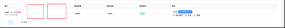
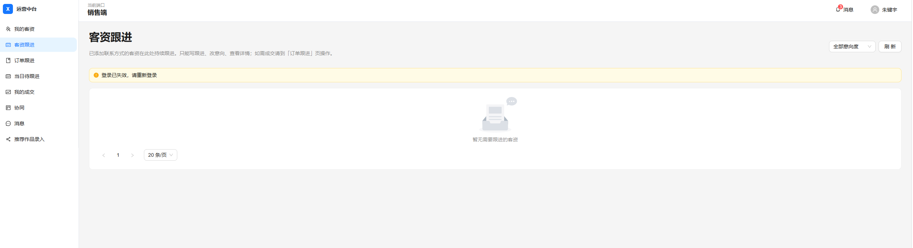
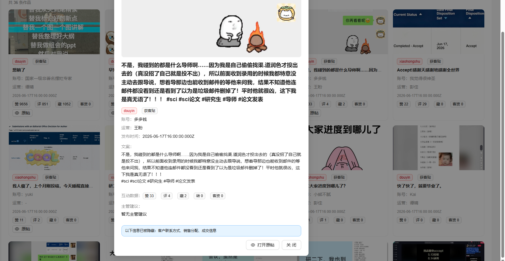
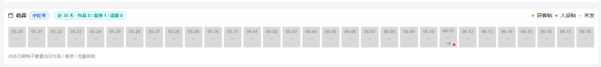
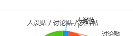
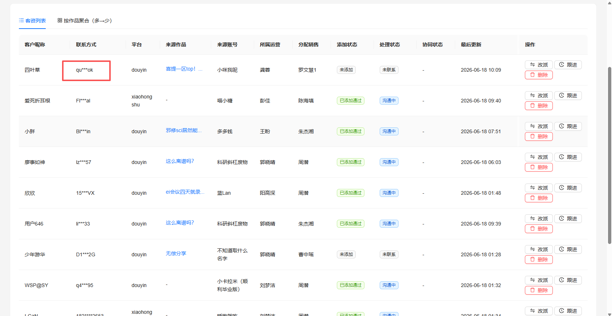
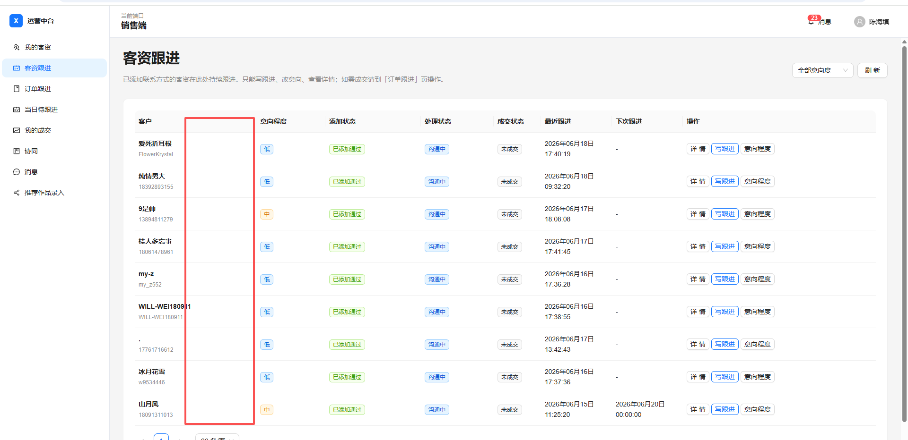

## 文档：销售端bug

- [ ] **运营分配客资过来后 销售端-我的客资页面无法及时更新**

- [ ] **销售端-我的客资页面 需要看到哪个运营推过来的，以及客户需求（运营填写的）**

- [ ] **切换账号有时候有bug**

- [ ] **无效原因不要是可选项，手动填写**

- [ ] **四端催办和提醒不明显**，很容易漏，最好右上角弹一个提醒或者对应客资显示一个红点在旁边，比如销售提醒运营，运营就在对应客资那里显示一个红点

- [ ] **标记成交的付款逻辑问题**
这里的付款逻辑是，我在客资跟进过程中，如果成交了，这个客户一定会支付定金，这个时候我写上金额，把付款阶段改成定金，那么在订单跟进页面的详情页中就会显示该客户的付款阶段处于已付定金，费用多少钱。而不是我又要选付款状态 又要选付款阶段。当我录到尾款的时候，付款状态就应该显示已完结。
其次付款阶段这里应该有两个选项，分三笔和分四笔，默认是三笔，定金、中期、尾款。四笔对应的是定金、前期、中期、后期。
这里还有个逻辑问题的点，在客资跟进过程中，我点成交，付款阶段选择定金了，在订单跟进这里的付款状态会显示已付定金，金额费用。然后客户付后续款的时候，我要在订单跟进这里能够填写后续的付款金额，选定这个金额所对应的阶段。

- [ ] **销售端客资详情 上方的表格里 客户需求 需要可以编辑**

- [ ] **销售端的客资显示**，最开头的是客户的网名，后面要加一个销售备注，要改成销售可以备注的微信昵称或者微信号比较好

- [ ] **销售端，客资看板和客资跟进的板块** 客资需要有时间筛选某一天的客资的功能，还要有微信昵称搜索具体某个客资的功能，可以是通过微信号搜索，可以通过昵称搜索。

- [ ] **销售端收不到销售那边发的待办消息**

- [ ] **** 这个隐藏是啥意思

- [ ] **账号分析 这里应该有三类帖子**

- [ ] **运营主管端的 这个页面 联系方式和微信需要完全展示，不脱敏**

- [ ] **运营端 客资跟进，需要展示专业和学历**

- [ ] **运营端 很多数据展示不准确**（还是帖子数据解析问题）

- [ ] **销售端-我的客资 上方的筛选条件没生效**

- [ ] **boss端要能删除销售端的成交数据**，现在有很多测试数据没法删除

## 教务端bug

- [ ] **教务首页-即将到期panel 点击后 跳转的页面和位置不对**

- [ ] **教务端-订单跟进** 进行中的订单仍旧无法编辑，新增的编辑功能与跟进功能一致没用，可以把编辑改成查看，检查跟进状态

- [ ] **作品广场，没有运营的搜索框了** 可筛选某些运营员工下的账号

- [ ] **个人看板，数据都是错的** 选择时间筛选今日，但是筛选出来是这三周的数据，不是今天的
