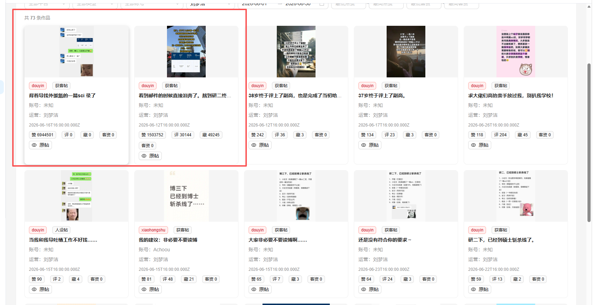
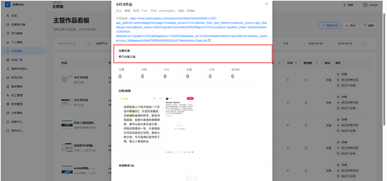
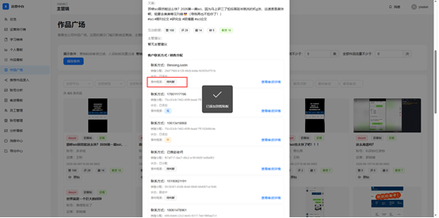

1. 主管端-账号分析  未显示人设和讨论贴
2. 主管端- 个人看板   流量数据有问题
3. 之前的流量读取一直有问题  但是没改
还有所有地方用小红书和抖音拼音的改成中文 
4. 主管端 作品看板  文案没显示

5. 主管端- 作品看板  点击客资数 /流量数选项，  没有自动排序 从高到底
6.  这里只有意向程度 和我描述的不一致（？）

    上述问题 有的是运营，运营主管，boss三段同时存在的问题
7. 教务端-异常订单  异常订单进入的准则是什么
   没有今日待提醒 只有节点提醒  节点提醒相当于记事簿，今日待提醒对应的是今日任务 可以去之前的word或者聊天里找找 我说明了的