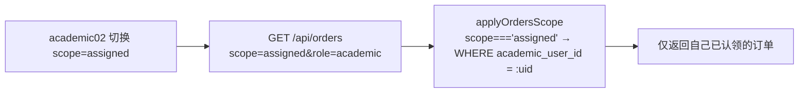
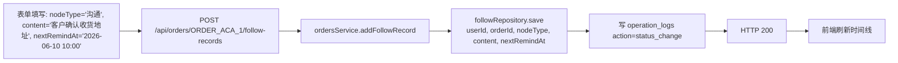

# B 端 v1.2 教务端测试用例（端口 3000 / `role=academic`）

> 编写日期：2026-06-02
> 编写人：B 端 1.2 测试用例 agent #1（教务端）
> 依据文档：`doc/v1.2-完整交付版-AB端任务分配.md`、`doc/B端-1.2验收问题跟踪.md`（教务端章节）
> 范围：B 端教务端 6 个模块 —— 订单池 / 订单详情 / 进度跟进 / 节点提醒 / 异常反馈 / 教务导出
> 重点：① 回归 v1.2 已修复的 6 项 P0/P1（订单池过滤、详情页缺失、跟进 UI 缺失、节点提醒扫描器、异常反馈独立表、导出权限白名单）
> ② 验证新增的 `handover_status` 4 状态机、`order_abnormal_feedbacks` 独立表、`@Cron(EVERY_MINUTE)` 节点提醒扫描器、`ROLE_EXPORT_WHITELIST` 角色白名单
> ③ 每个用例先用 Mermaid 标明"验证的数据流程"和"具体业务场景"，并对接口返回 → 数据库行 → 前端页面交互三层逐项核对

---

## 0. 术语与口径约定

### 0.1 角色与端口

| 角色 | 入口端口 | 前端入口 | 本测试用例关注 |
| --- | --- | --- | --- |
| `admin` | 3000 | `/admin/*` | 主管端，本测试用例仅在 E2E / 权限矩阵里作为对比角色出现 |
| `owner` | 3001 | 总后台 | 总后台，本测试用例不涉及 |
| `staff` | 3000 | `/operation/*` | 运营端，本测试用例不涉及 |
| `sales` | 3000 | `/sales/*` | 销售端，本测试用例仅在"销售发起交接 / 接收 ORDER_ABNORMAL 通知"等跨端协作路径里出现 |
| `academic` | 3000 | `/academic/*` | 教务端，本测试用例主角 |

### 0.2 订单主状态（`orders.order_status`，ENUM 7 选 1）

| code | 中文 | 触发动作 | 是否可由教务独立切换 |
| --- | --- | --- | --- |
| `to_receive` | 待接收 | 销售 `close-deal` 成交后初始 | ×（仅 `acceptHandover` 自动推 `in_progress`） |
| `in_progress` | 进行中 | 教务接单后；或异常关闭后回退 | √（可在 7 个状态间手动改） |
| `awaiting_client_info` | 待客户资料 | 教务补充跟进节点 | √ |
| `awaiting_teacher` | 待老师安排 | 教务补充跟进节点 | √ |
| `to_deliver` | 待交付 | 教务补充跟进节点 | √ |
| `completed` | 已完成 | 教务/销售确认 | √ |
| `abnormal` | 异常 | 提交异常反馈 | ×（仅 `close` 异常后自动回退 `in_progress`/`to_receive`） |

### 0.3 交接状态（`orders.handover_status`，VARCHAR 4 选 1）

| code | 中文 | 进入动作 | 离开动作 |
| --- | --- | --- | --- |
| `pending` | 待交接 | `close-deal` 在 §11.1 早期版本写入；当前 `closeDeal` 改为直接落 `handed_over` | 销售 `handOver` → `handed_over`；教务 `acceptHandover` → `accepted`；教务 `rejectHandover` → `rejected` |
| `handed_over` | 已交接 | `closeDeal` 初始值；或销售 `POST /api/orders/:id/handover/hand-over` | 教务 `acceptHandover` → `accepted`；教务 `rejectHandover` → `rejected` |
| `accepted` | 已接收 | 教务 `acceptHandover`（同时 `orderStatus: to_receive → in_progress`） | 终态 |
| `rejected` | 已拒收 | 教务 `rejectHandover`（必须传 `reason`） | 终态 |

### 0.4 异常反馈状态（`order_abnormal_feedbacks.status`）

| code | 中文 | 进入动作 | 离开动作 |
| --- | --- | --- | --- |
| `open` | 待处理 | `POST /api/orders/:id/abnormal-feedback` 创建（同时 `orderStatus: → abnormal`） | `PATCH .../close {status:'handling'}` → `handling`；或 `status:'closed'` → `closed` |
| `handling` | 处理中 | `close` 接口传 `status:'handling'`（仅更新 feedback.status，不回退 order） | 再次调用 `close {status:'closed'}` → `closed` |
| `closed` | 已关闭 | `close {status:'closed'}`（同时 `orderStatus: abnormal → in_progress/to_receive`） | 终态，不可再 close |

### 0.5 异常类型（`order_abnormal_feedbacks.abnormal_type`，6 选 1）

`client_uncooperative` / `material_missing` / `teacher_no_response` / `cycle_risk` / `payment_issue` / `other`

### 0.6 期望协助方（`expected_helper`，4 选 1）

`sales` / `supervisor` / `operation` / `other`

### 0.7 跟进节点类型（`order_follow_records.node_type`，自由文本）

内部约定的"关键字"：`received` / `已接收` / `已签收` —— 命中后自动 `acceptHandover({silent:true})`；含 `异常` 关键字自动给销售发 `ORDER_ABNORMAL` 通知。

### 0.8 节点提醒幂等（`order_follow_records.reminder_sent_at`）

`RemindersService.@Cron(EVERY_MINUTE) → scanDue()` 拉 `next_remind_at <= NOW AND reminder_sent_at IS NULL` 的记录（限 100 条），逐条发 `ORDER_NODE_DUE` 通知（接收者：跟进人 + 当前教务）后写回 `reminder_sent_at` 标记。**二次扫描已发送记录自动跳过**，保证幂等。

### 0.9 字段名映射（v1.2 文档 → DB 实际）

> 本测试文档基于 v1.2 文档 §10 字段契约撰写，但 DB schema 沿用 V1 旧契约。
> 凡 SQL 中的字段名需按本表对照。教务端 TC 80 个用例中**未发现** leads 相关字段误用（教务端不读写 leads 表），orders 表字段全部已使用 DB 实际名（`academic_user_id` / `sales_user_id` / `remark`），本表作为后续维护参考。

| 测试用例中字段 | DB 实际字段 | 适用范围 |
| --- | --- | --- |
| leads.operator_id | leads.employee_id | 运营员工 |
| leads.sales_id | leads.assigned_sales_user_id | 销售 |
| leads.source_account_id | leads.account_id | 来源账号 |
| leads.source_post_id | leads.post_id | 来源作品 |
| leads.deal_status | （不存在） | 删除相关断言 |
| orders.sales_id | orders.sales_user_id | 销售 |
| orders.academic_admin_id | orders.academic_user_id | 教务 |
| orders.delivery_requirement | orders.remark | 交付要求 |

### 0.10 枚举值映射（v1.2 文档 → DB 实际）

> 教务端 TC 80 个用例中实际使用的枚举值（`order_status` 7 选、`paid_status` 3 选、`handover_status` 4 选）已与 DB 一致（见 §0.2 / §0.3），本表作为后续维护参考。

| 字段 | v1.2 假设（英文） | DB 实际（中文/英文） |
| --- | --- | --- |
| leads.status | new/assigned/in_followup/... | 新客资/已分配/跟进中/协同中/运营已处理/已添加通过/已成交/无效 |
| leads.add_status | not_added/applied/... | 未添加/已申请/未通过/运营已提醒/已添加/已拒绝 |
| leads.process_status | not_contacted/... | 未联系/待通过/沟通中/已报价/待成交/已成交/无效 |
| leads.intention_level | high/mid/low | pending/high/mid/low |
| orders.order_status | pending_accept/in_progress/.../closed | to_receive/in_progress/awaiting_client_info/awaiting_teacher/to_deliver/completed/abnormal |
| orders.paid_status | unpaid/partial_paid/paid/refunded | unpaid/partial/paid |
| orders.handover_status | pending/handed_over/accepted/rejected | 同左（v1.2 新增已就位） |

注意：`accounts.status` 实际是中文（'正常'/'停用'），不是 'active'/'inactive'。
注意：`posts.post_type` 实际是中文（'获客贴'/'素人贴'/'话题贴'），不是英文枚举。
注意：`posts.platform` 和 `accounts.platform` 实际是中文（'小红书'/'抖音'）。

### 0.11 导出权限白名单（`exports.controller.ts:27-33`）

```ts
const ROLE_EXPORT_WHITELIST = {
  admin:    ['leads','orders','order_progress','collaboration_records','posts','rankings','accounts'],
  owner:    ['leads','orders','order_progress','collaboration_records','posts','rankings','accounts'],
  staff:    ['leads','posts','rankings','collaboration_records','accounts'],
  sales:    ['leads','orders','order_progress','collaboration_records'],
  academic: ['orders','order_progress'],
};
```

控制器对 `role` / `currentUserId` / `actorUserId` / `scope=all` 做**强制覆盖**，非 admin/owner 传 `scope=all` 会被 `delete`。

### 0.12 测试准备

```text
数据库：lan_dual_role_system（utf8mb4 / 端口 3306 / 见 backend/.env）

测试账号（密码均为 test123，源自 doc/add-test-users.sql）：
- 教务甲：users.id=user-test-academic-02, username=academic02, role=academic
- 教务乙：users.id=user-test-academic-03, username=academic03, role=academic
- 销售甲：users.id=user-test-sales-01,    username=sales01,   role=sales
- 主管丁：users.id=user-admin-1,           username=youlun,    role=admin

基础数据（手工 SQL 准备，每条用例前用 SETUP 块、结束用 TEARDOWN 块）：
- ORDER_POOL_1：orders.id 池单，academic_user_id=NULL, handover_status=handed_over, order_status=to_receive
- ORDER_POOL_2：orders.id 池单，academic_user_id=NULL, handover_status=pending
- ORDER_ACA_1：  orders.id 教务甲名下，academic_user_id=user-test-academic-02, order_status=in_progress
- ORDER_ACA_2：  orders.id 教务乙名下，academic_user_id=user-test-academic-03, order_status=in_progress
- ORDER_ACA_3：  orders.id 教务甲名下，academic_user_id=user-test-academic-02, order_status=abnormal
- ORDER_OTHER：  orders.id 教务甲不可见（sales_user_id=sales_other），order_status=in_progress
- LEAD_SALES_1：leads.id 销售甲成交的客资

后端端口：8089（NestJS）
前端端口：3302（Next.js，/academic 路径）
鉴权：登录后拿 JWT，挂到请求 header 的 Authorization: Bearer <token>
```

### 0.13 教务端菜单（`frontend/src/shared/layout/menu.tsx` academic 段）

| 路径 | 模块 | 本测试用例覆盖 |
| --- | --- | --- |
| `/academic/orders` | 订单池 | TC-Aca-001 ~ TC-Aca-015 |
| `/academic/orders/[id]` | 订单详情 | TC-Aca-016 ~ TC-Aca-025 |
| `/academic/reminders` | 节点提醒 | TC-Aca-036 ~ TC-Aca-045 |
| `/academic/abnormal` | 异常反馈 | TC-Aca-046 ~ TC-Aca-055 |
| `/academic/exports` | 教务导出 | TC-Aca-056 ~ TC-Aca-065 |

---

## 1. 订单池（教务端 P0-B1）

> 范围：`GET /api/orders` + `/api/orders/:id` + `PATCH /api/orders/:id` + 教务端 `/academic/orders` 页面
> 关键回归：① 验收 #1 P0 已修复 —— `applyOrdersScope` 新增 `scope=pool/assigned/mine` 三档；② 验收 #2 P1 已修复 —— `findOne` 加角色归属校验 + 教务端 `/academic/orders/[id]` 详情页已补

### TC-Aca-001 教务默认视角看到池单 + 自己已认领（验收 #1 P0 回归）

```mermaid
flowchart LR
  A[academic02 登录] --> B[GET /api/orders<br/>scope=academic&role=academic]
  B --> C[ordersService.list]
  C --> D[applyOrdersScope<br/>role=academic + 未传 scope<br/>→ (academic_user_id IS NULL OR = :uid)]
  D --> E[SQL: SELECT * FROM orders<br/>WHERE (academic_user_id IS NULL OR academic_user_id = 'user-test-academic-02')<br/>ORDER BY created_at DESC]
  E --> F[返回 items]
  F --> G[前端 OrderTable<br/>scope=academic/actionMode=academic]
  G --> H[渲染「领取」按钮 + 状态 Select]
```

**业务场景**：教务甲打开"订单池"应同时看到全部池单（`academic_user_id IS NULL`）和自己已认领的订单（`academic_user_id = 自己`），且看不到他人已认领的订单。

**前置数据**：
- `ORDER_POOL_1`（`academic_user_id = NULL`）
- `ORDER_POOL_2`（`academic_user_id = NULL`）
- `ORDER_ACA_1`（`academic_user_id = user-test-academic-02`）
- `ORDER_ACA_2`（`academic_user_id = user-test-academic-03`，他人已认领）

**步骤**：
1. 用 academic02 登录拿 JWT。
2. `curl GET /api/orders?scope=academic&role=academic&limit=20`。

**预期**：
- HTTP 200，items 包含 `ORDER_POOL_1` / `ORDER_POOL_2` / `ORDER_ACA_1`，**不**包含 `ORDER_ACA_2`。
- 教务端 `/academic/orders` 页面表格 3 行，"领取"按钮仅对池单可见，自己已认领的订单展示"分配教务 = 教务甲 + 状态 Select"。

**DB 核对 SQL**：
```sql
SELECT id, academic_user_id, order_status, handover_status
FROM orders
WHERE id IN ('ORDER_POOL_1','ORDER_POOL_2','ORDER_ACA_1','ORDER_ACA_2')
ORDER BY created_at DESC;
-- 期望 ORDER_POOL_1/2 academic_user_id=NULL，ORDER_ACA_1=academic02，ORDER_ACA_2=academic03
```

**前端交互核对**：
- 池单行"领取"按钮可点击。
- 自己已认领的行"状态"下拉框显示当前 `order_status`。
- 他人已认领的订单（ORDER_ACA_2）不出现在列表中。

**缺陷记录**：无（已修复 P0）。

---

### TC-Aca-002 scope=pool 严格只查池单

```mermaid
flowchart LR
  A[academic02 切换 scope=pool] --> B[GET /api/orders<br/>scope=pool&role=academic]
  B --> C[applyOrdersScope<br/>scope==='pool' → WHERE academic_user_id IS NULL]
  C --> D[仅返回池单列表]
  D --> E[前端表格"仅池单"视图]
```

**业务场景**：教务想专心理"未认领"池单时，前端切换"仅池单"过滤，只看到 `academic_user_id IS NULL` 的订单。

**前置数据**：同 TC-Aca-001。

**步骤**：
1. `curl GET /api/orders?scope=pool&role=academic&limit=20`。

**预期**：
- HTTP 200，items 仅 `ORDER_POOL_1` / `ORDER_POOL_2`，**不**包含 `ORDER_ACA_1`（自己已认领的）和 `ORDER_ACA_2`。

**DB 核对 SQL**：
```sql
SELECT COUNT(*) AS pool_count FROM orders WHERE academic_user_id IS NULL;
-- 应与接口返回的 total 一致
```

**前端交互核对**：
- 顶部 scope 切换控件（"全部 / 仅池单 / 仅我名下"）选中"仅池单"时，列表只显示 2 行池单。

---

### TC-Aca-003 scope=assigned 仅查自己已认领



**业务场景**：教务切到"仅我名下"看板上，仅看到自己已认领的订单，用于安排当日工作。

**步骤**：
1. `curl GET /api/orders?scope=assigned&role=academic&limit=20`。

**预期**：
- items 仅 `ORDER_ACA_1`，`ORDER_ACA_2` 不可见，池单不可见。

---

### TC-Aca-004 scope=mine 与 scope=assigned 等价

**业务场景**：v1.1 旧前端可能传 `scope=mine`；v1.2 后端应与 `assigned` 等价兼容。

**步骤**：
1. `curl GET /api/orders?scope=mine&role=academic&limit=20`。

**预期**：与 TC-Aca-003 结果完全一致。

---

### TC-Aca-001-P0-REG 验收 #1 P0 回归：教务"订单池永远为空"已修复

> 回归路径：与 TC-Aca-001 同源。此处显式标记"原 P0 现象"以便回归确认。

**业务场景**：v1.1 旧实现下 `academic02` 调 `GET /api/orders?role=academic` 返回 `items:[]`，所有 7 状态订单都看不到。v1.2 修复后能正确看到池单 + 自己已认领的单。

**步骤**：
1. 用 `academic02` 登录（v1.1 旧代码）调 `GET /api/orders?role=academic&limit=20` —— 期望 `items=[]`（**已不再复现**）。
2. 切换到 v1.2 新代码，重复调用 —— 期望 `items.length >= 2`（池单）。

**预期**：v1.2 后能正确返回池单，**items.length > 0**。

**DB 核对 SQL**：
```sql
-- 兜底确认池单仍在（防止 fixture 被清理）
SELECT COUNT(*) FROM orders WHERE academic_user_id IS NULL;
-- 期望 >= 1
```

**缺陷记录**：已修复。修复点：`backend/src/modules/orders/orders.service.ts:220-247` `applyOrdersScope` 新增 `scope=pool/assigned/mine` + 默认 academic 视角"池单 + 自己"。

---

### TC-Aca-005 教务领取池单（PATCH order）

```mermaid
flowchart LR
  A[教务点击「领取」] --> B[PATCH /api/orders/ORDER_POOL_1<br/>body: {academic_user_id: 'user-test-academic-02',<br/>order_status: 'in_progress'}]
  B --> C[ordersService.update<br/>→ repo.update(id, next)]
  C --> D[写 operation_logs<br/>action=status_change, target_type=order]
  D --> E[前端刷新表格]
  E --> F[该单从池单中消失 / 进入"仅我名下"]
```

**业务场景**：教务在订单池点击"领取"，订单应被分配给自己并切到 `in_progress`；同时从池单消失。

**前置数据**：`ORDER_POOL_1`（池单）。

**步骤**：
1. `curl -X PATCH /api/orders/ORDER_POOL_1 -H "Authorization: Bearer <token>" -d '{"academic_user_id":"user-test-academic-02","order_status":"in_progress"}'`

**预期**：
- HTTP 200，`{ok:true}`。
- 重复 TC-Aca-001 步骤，池单列表里 `ORDER_POOL_1` 消失；`scope=assigned` 列表里出现。

**DB 核对 SQL**：
```sql
SELECT id, academic_user_id, order_status, handover_status
FROM orders WHERE id='ORDER_POOL_1';
-- 期望 academic_user_id='user-test-academic-02', order_status='in_progress'

SELECT user_id, action, target_type, target_id, detail, created_at
FROM operation_logs
WHERE target_id='ORDER_POOL_1'
ORDER BY created_at DESC LIMIT 3;
-- 期望最近一条 action='status_change', detail 含 order_status=in_progress
```

**前端交互核对**：
- 点击"领取"后弹 "订单已领取" 提示。
- 表格该行"教务"列从 "未分配" 变为 "教务甲"。
- 状态 Tag 从 "待领取" 变为 "进行中"。

---

### TC-Aca-006 池单支持 7 状态过滤

**业务场景**：教务在订单池按 `order_status` 过滤（如只看"待客户资料"）。

**步骤**：
1. 准备：`ORDER_POOL_1` 改 `order_status='awaiting_client_info'`。
2. `curl GET /api/orders?scope=pool&status=awaiting_client_info`。

**预期**：items 仅含 `ORDER_POOL_1`（如果还存在）或 0 行（已被认领）。返回结构 `{items, total, limit, offset}`。

**DB 核对 SQL**：
```sql
SELECT id, order_status FROM orders WHERE order_status='awaiting_client_info';
```

**前端交互核对**：顶部"订单状态"下拉选"待客户资料"时表格内容变化。

---

### TC-Aca-007 按 handover_status 过滤

**业务场景**：教务想专心理"已交接 / 待接收"订单。

**步骤**：
1. 准备：`ORDER_POOL_1.handover_status='handed_over'`、`ORDER_POOL_2.handover_status='pending'`。
2. `curl GET /api/orders?scope=pool&handoverStatus=handed_over`。

**预期**：仅 `ORDER_POOL_1` 出现在结果中。

**DB 核对 SQL**：
```sql
SELECT id, handover_status FROM orders WHERE id LIKE 'ORDER_POOL_%' ORDER BY id;
```

**前端交互核对**：列表顶部"交接状态"下拉显示"已交接"时，ORDER_POOL_1 仍可见；切换到"待交接"仅显示 ORDER_POOL_2。

---

### TC-Aca-008 订单池模糊搜索（订单号 / 客资联系方式 / 客资昵称）

```mermaid
flowchart LR
  A[搜索框输入「LEAD_SALES_1」] --> B[GET /api/orders?keyword=LEAD_SALES_1]
  B --> C[applyOrderFilters<br/>EXISTS 子查询关联 leads]
  C --> D[(o.id LIKE :kw<br/>OR EXISTS(<br/>  SELECT 1 FROM leads l<br/>  WHERE l.id=o.lead_id<br/>  AND (l.contact_info LIKE :kw OR l.nickname LIKE :kw)))]
  D --> E[返回匹配 orders]
```

**业务场景**：教务在订单池搜索框输入订单号 / 客资联系方式片段，应返回匹配的订单。

**步骤**：
1. 准备：`ORDER_ACA_1.lead_id='LEAD_SALES_1'`。
2. `curl GET /api/orders?keyword=LEAD_SALES_1`。

**预期**：items 含 `ORDER_ACA_1`。

**DB 核对 SQL**：
```sql
SELECT o.id, l.contact_info, l.nickname
FROM orders o
LEFT JOIN leads l ON l.id = o.lead_id
WHERE o.id = 'ORDER_ACA_1';
-- 验证 contact_info / nickname 含 LEAD_SALES_1 字面量或订单号本身含该片段
```

**前端交互核对**：搜索框输入 "LEAD_SALES" 时表格只显示 1 行，订单 ID 单元格带超链接跳 `/academic/orders/ORDER_ACA_1`。

---

### TC-Aca-009 按付款状态 / 服务类型 / 时间范围过滤

**业务场景**：教务按付款状态（`unpaid/partial/paid`）+ 服务类型 + 创建时间范围组合过滤。

**步骤**：
1. 准备：`ORDER_ACA_1.paid_status='paid', service_type='论文辅导', created_at='2026-05-01'`
2. `curl GET /api/orders?paidStatus=paid&serviceType=论文辅导&startDate=2026-04-01&endDate=2026-05-31`

**预期**：items 仅含 `ORDER_ACA_1`。

**DB 核对 SQL**：
```sql
SELECT id, paid_status, service_type, created_at
FROM orders
WHERE paid_status='paid' AND service_type='论文辅导'
  AND created_at BETWEEN '2026-04-01' AND '2026-05-31';
```

---

### TC-Aca-010 销售视角：只看自己经手的销售单（角色隔离）

**业务场景**：`sales01` 调 `GET /api/orders` 应只看到自己作为 `sales_user_id` 的订单或自己作为 `academic_user_id` 的订单，看不到 `ORDER_ACA_1`（`sales_user_id=user-test-sales-other`）。

**步骤**：
1. 用 `sales01` 登录，调用 `GET /api/orders?role=sales&scope=mine`。
2. 准备：`ORDER_SALES_1.sales_user_id='user-test-sales-01'`、`ORDER_ACA_1.sales_user_id='user-test-sales-other'`。

**预期**：
- items 含 `ORDER_SALES_1`，**不**含 `ORDER_ACA_1`。
- admin/owner 调同接口能看全量（含 `ORDER_ACA_1`）。

**DB 核对 SQL**：
```sql
SELECT id, sales_user_id, academic_user_id FROM orders
WHERE id IN ('ORDER_SALES_1','ORDER_ACA_1');
```

**前端交互核对**：销售端 `/sales/orders` 列表与教务端 `/academic/orders` 内容不同（按角色不同过滤）。

---

### TC-Aca-011 管理员视角：scope=all 看全量

**业务场景**：`youlun` (admin) 调 `GET /api/orders?scope=all&role=admin` 应能看所有订单。

**步骤**：
1. `curl GET /api/orders?scope=all&role=admin&limit=50`

**预期**：items 包含 ORDER_POOL_1/2、ORDER_ACA_1/2/3、ORDER_OTHER（10+ 行总池）。

---

### TC-Aca-012 异常订单视图：教务只能看自己名下的异常单

**业务场景**：`academic02` 访问 `/academic/abnormal`（actionMode='abnormal'）只能看到 `academic_user_id='user-test-academic-02' AND order_status='abnormal'` 的订单；`ORDER_ACA_3`（教务甲名下，abnormal）可见，ORDER_POOL_1（池单，order_status='abnormal'）是否可见取决于 `scope='academic'` 默认规则（应可见 —— 池单 + 自己）。

**步骤**：
1. 准备：`ORDER_POOL_1.order_status='abnormal'`、`ORDER_ACA_3.order_status='abnormal'`。
2. `curl GET /api/orders?scope=academic&status=abnormal&role=academic`

**预期**：items 包含 ORDER_POOL_1（池单异常）+ ORDER_ACA_3（自己名下的异常），**不**含 ORDER_ACA_2（教务乙的）。

---

### TC-Aca-013 分页参数：limit/offset 同时存在

**业务场景**：教务端 `/academic/orders` 默认 `pageSize=20, page=1`。

**步骤**：
1. 准备 25 单 `ORDER_POOL_*`（池单）。
2. `curl GET /api/orders?scope=pool&limit=10&offset=0` → 期望 `items.length=10, total=25, limit=10, offset=0`。
3. `curl GET /api/orders?scope=pool&limit=10&offset=20` → 期望 `items.length=5`。

**预期**：`wantsPaging=true` 时返回 `{items, total, limit, offset}` 结构；不传 limit/offset 时返回纯数组（兼容旧前端）。

**DB 核对 SQL**：
```sql
SELECT COUNT(*) FROM orders WHERE academic_user_id IS NULL;
```

---

### TC-Aca-014 边界：limit 越界（>200）自动 clamp

**业务场景**：恶意传 `limit=10000` 不应让数据库超载。

**步骤**：
1. `curl GET /api/orders?limit=10000`

**预期**：HTTP 200，响应里 `limit=200`（`clampLimit` 上限）；不会因大量返回拖慢后端。

---

### TC-Aca-015 边界：offset 负数 → 0

**步骤**：
1. `curl GET /api/orders?limit=10&offset=-5`

**预期**：响应里 `offset=0`，不报错。

---

## 2. 订单详情（教务端 P1-B2）

> 范围：`GET /api/orders/:id` + `PATCH /api/orders/:id` + 教务端 `/academic/orders/[id]` 页面
> 关键回归：① 验收 #2 P1 已修复 —— `findOne` 加角色归属校验（他人订单 → 404）；② 教务端详情页 `/academic/orders/[id]` 已补（与订单池内 ID 单元格超链接打通）

### TC-Aca-016 教务查看自己已认领订单详情

```mermaid
flowchart LR
  A[academic02 访问 /academic/orders/ORDER_ACA_1] --> B[getOrderDetail]
  B --> C[GET /api/orders/ORDER_ACA_1]
  C --> D[ordersService.findOne<br/>actor.role='academic', actor.userId='user-test-academic-02']
  D --> E{canSee 判断}
  E --> F[canSee=true<br/>(academic_user_id = 自己)]
  F --> G[拉 order + follow_records]
  G --> H[mapOrder + mapFollowRecord]
  H --> I[返回 detail]
  I --> J[前端 Descriptions + 跟进时间线 + 异常反馈区]
```

**业务场景**：教务甲在订单池点击自己已认领的订单，应进入详情页看到订单 + 跟进时间线。

**步骤**：
1. `curl GET /api/orders/ORDER_ACA_1 -H "Authorization: Bearer <academic02_jwt>"`

**预期**：
- HTTP 200，返回 `{id, leadId, salesUserId, academicUserId, serviceType, amount, paidStatus, orderStatus, handoverStatus, remark, createdAt, updatedAt, followRecords: [...]}`。
- 跟进时间线渲染已有 `orderFollowRecords`。
- "提交异常反馈" + "新增跟进节点" 按钮可见。

**DB 核对 SQL**：
```sql
SELECT * FROM order_follow_records WHERE order_id='ORDER_ACA_1' ORDER BY created_at DESC;
```

---

### TC-Aca-017 教务查看池单详情（验收 #2 P0 回归辅助）

**业务场景**：教务甲想了解池单的客资需求/交付要求，进详情页应允许（`academic_user_id IS NULL` 的池单教务"看得见"是 v1.2 新增的可见性规则）。

**步骤**：
1. `curl GET /api/orders/ORDER_POOL_1 -H "Authorization: Bearer <academic02_jwt>"`

**预期**：
- HTTP 200，订单详情可见，"领取"按钮在详情页也可见（OrderTable claimOrder 同一逻辑）。
- 若产品决策要求"教务不可读池单详情"，本用例应调整为 404；本测试用例沿用 v1.1 "教务可看池单"原则（service.canSee 第 306 行 `order.academicUserId == null` 通过）。

**DB 核对 SQL**：
```sql
SELECT id, academic_user_id, order_status, handover_status FROM orders WHERE id='ORDER_POOL_1';
```

---

### TC-Aca-018 教务越权读他人订单 → 404（验收 #2 P0 回归）

```mermaid
flowchart LR
  A[academic02 试访问 /academic/orders/ORDER_ACA_2] --> B[GET /api/orders/ORDER_ACA_2]
  B --> C[ordersService.findOne<br/>actor.role='academic', actor.userId='academic02']
  C --> D{canSee 判断}
  D --> E[canSee=false<br/>(academic_user_id='academic03' != 自己)]
  E --> F[抛 NotFoundException<br/>'order not found']
  F --> G[HTTP 404 响应<br/>与"不存在"统一，不暴露存在性]
```

**业务场景**：教务乙已认领的订单，教务甲去读应被拒。v1.1 旧实现里可读，v1.2 修复后必须 404。

**步骤**：
1. `curl GET /api/orders/ORDER_ACA_2 -H "Authorization: Bearer <academic02_jwt>"`

**预期**：
- HTTP 404，`{ok:false, message:"order not found"}`。
- 响应文案与"订单 ID 不存在"完全一致，避免存在性泄露。

**DB 核对 SQL**：
```sql
SELECT id, academic_user_id FROM orders WHERE id='ORDER_ACA_2';
-- 期望 academic_user_id='user-test-academic-03'
```

**前端交互核对**：
- 教务端强行 URL 访问 `/academic/orders/ORDER_ACA_2`，应跳 404 页面或空态提示"订单不存在"。

**缺陷记录**：已修复 P0。修复点：`backend/src/modules/orders/orders.service.ts:299-313` findOne actor 校验 + 教务"自己已认领 + 池单"可见规则。

---

### TC-Aca-019 销售越权读他人销售单 → 404

**业务场景**：`sales_other` 名下的订单，`sales01` 不可读（v1.1 既有规则；本用例作为回归记录）。

**步骤**：
1. `curl GET /api/orders/ORDER_OTHER -H "Authorization: Bearer <sales01_jwt>"`

**预期**：HTTP 404。

---

### TC-Aca-020 管理员可读所有订单详情（admin 旁路）

**业务场景**：`youlun` (admin) 读任意订单都 200。

**步骤**：
1. `curl GET /api/orders/ORDER_ACA_2 -H "Authorization: Bearer <youlun_jwt>"`

**预期**：HTTP 200，详情完整。

---

### TC-Aca-021 详情页：交付要求 + 销售跟进摘要 + 异常反馈区（前端 UI 验证）

**业务场景**：教务端详情页应展示"交付要求与资料"卡片 + "销售跟进摘要"卡片 + "订单异常反馈"卡片（仅 academic 角色显示）。

**步骤**：
1. 浏览器访问 `http://localhost:3302/academic/orders/ORDER_ACA_1`，用 `academic02` 登录。

**预期**：
- 顶部 4 卡片：基本信息 / 交付要求与资料 / 销售跟进摘要 / 订单异常反馈。
- "新增跟进节点" 表单：`节点类型`(必填) + `备注` + `下次提醒` (DatePicker) + `添加` 按钮。
- "跟进时间线" 卡片：列出 `orderFollowRecords`（按时间倒序）。
- "订单异常反馈" 卡片：表格列出 `orderAbnormalFeedbacks` + 顶部"提交异常反馈" 按钮 + 当存在 open 状态反馈时显示"关闭异常"按钮（仅创建人 / 主管 / 销售可关闭）。

**前端交互核对**：检查 DOM 元素 `data-testid` 存在：
- `[data-testid="order-basic-card"]`
- `[data-testid="delivery-card"]`
- `[data-testid="sales-summary-card"]`
- `[data-testid="abnormal-feedback-card"]`（仅 academic）
- `[data-testid="add-follow-form"]`
- `[data-testid="follow-timeline"]`

**缺陷记录**：验收 #3 P1 已修复 —— 教务端进度跟进 UI 已落地（`frontend/src/app/academic/orders/[id]/page.tsx`）。

---

### TC-Aca-022 详情页：节点类型含"异常"自动通知销售

```mermaid
flowchart LR
  A[教务添加节点 nodeType='异常-客户失联'] --> B[POST /api/orders/ORDER_ACA_1/follow-records]
  B --> C[addFollowRecord]
  C --> D{nodeType.includes('异常')}
  D --> E[notificationsService.create<br/>receiverIds=[order.salesUserId]<br/>typeCode=ORDER_ABNORMAL]
  E --> F[写 follow_record]
  F --> G[HTTP 200]
```

**业务场景**：教务在跟进表单输入节点类型含"异常"关键字，后端自动给销售发 `ORDER_ABNORMAL` 通知。

**步骤**：
1. `curl -X POST /api/orders/ORDER_ACA_1/follow-records -d '{"nodeType":"异常-客户失联","content":"联系 3 次无应答"}'`

**预期**：
- HTTP 200。
- 销售甲（`ORDER_ACA_1.sales_user_id`）的通知中心出现 1 条新通知，标题"订单异常"，内容含"订单跟进异常: 联系 3 次无应答"。

**DB 核对 SQL**：
```sql
SELECT id, receiver_id, type_code, title, content, related_id
FROM notifications
WHERE related_id='ORDER_ACA_1' AND type_code='order_abnormal'
ORDER BY created_at DESC LIMIT 1;

SELECT id, order_id, user_id, node_type, content
FROM order_follow_records
WHERE order_id='ORDER_ACA_1'
ORDER BY created_at DESC LIMIT 1;
```

---

### TC-Aca-023 详情页：节点类型"已接收"自动 acceptHandover

```mermaid
flowchart LR
  A[教务添加 nodeType='已接收'] --> B[POST follow-records]
  B --> C[addFollowRecord]
  C --> D{isReceivedNode<br/>(received/已接收/已签收)}
  D --> E[acceptHandover(id, actor, {silent:true})<br/>handover_status→accepted<br/>orderStatus to_receive→in_progress]
  E --> F[不重复写 operation_logs]
```

**业务场景**：教务在节点表单输入 "已接收" 关键字，系统应自动接单（`handover_status → accepted` + `orderStatus to_receive → in_progress`），且不再重复触发 `acceptHandover` 接口。

**步骤**：
1. 准备：`ORDER_POOL_1.handover_status='handed_over', order_status='to_receive'`
2. `curl -X POST /api/orders/ORDER_POOL_1/follow-records -d '{"nodeType":"已接收"}'`

**预期**：
- HTTP 200。
- `orders.handover_status='accepted'`、`order_status='in_progress'`。
- 操作日志无 `action='handover', step='accept'` 记录（silent=true，不写 controller 层 OperationLogsService）。

**DB 核对 SQL**：
```sql
SELECT id, handover_status, order_status, academic_user_id
FROM orders WHERE id='ORDER_POOL_1';
-- 期望 handover_status='accepted', order_status='in_progress'

SELECT action, target_id, detail
FROM operation_logs
WHERE target_id='ORDER_POOL_1' AND action='handover';
-- 期望为空（silent 路径不写日志）
```

**缺陷记录**：行为符合预期（自动接单静默路径）。

---

### TC-Aca-024 详情页：分页拉取跟进记录

**业务场景**：详情页"跟进时间线"一次性拉最新 20 条；超过 20 条应能分页（点击"加载更多"或滚动加载）。

**步骤**：
1. 准备：插入 25 条 follow_records for `ORDER_ACA_1`。
2. `curl GET /api/orders/ORDER_ACA_1/follow-records?limit=10&offset=0`
3. `curl GET /api/orders/ORDER_ACA_1/follow-records?limit=10&offset=20`

**预期**：
- 第一次 `{items.length:10, total:25, limit:10, offset:0}`。
- 第二次 `{items.length:5, total:25, limit:10, offset:20}`。

---

### TC-Aca-025 详情页：编辑备注 / 金额 / 服务类型

**业务场景**：教务在详情页修改 `service_type` / `amount` / `remark`。

**步骤**：
1. `curl -X PATCH /api/orders/ORDER_ACA_1 -d '{"service_type":"论文加急","amount":"6800.00","remark":"客户加急"}'`

**预期**：
- HTTP 200。
- DB 落库（`service_type` / `amount` / `remark` 已更新）。
- 写 `operation_logs.action='update', target_type='order'`。

**DB 核对 SQL**：
```sql
SELECT service_type, amount, remark FROM orders WHERE id='ORDER_ACA_1';

SELECT action, target_type, detail FROM operation_logs
WHERE target_id='ORDER_ACA_1' AND action='update' ORDER BY created_at DESC LIMIT 1;
```

---

## 3. 进度跟进（教务端 P1-B3）

> 范围：`POST /api/orders/:id/follow-records` + `GET /api/orders/:id/follow-records` + 教务端详情页"新增跟进节点"表单 + "跟进时间线"卡片
> 关键回归：验收 #3 P1 已修复 —— 教务端 UI 已落地

### TC-Aca-026 教务添加"沟通"类节点



**业务场景**：教务在详情页表单添加一次"沟通"类节点，含下次提醒时间。

**步骤**：
1. `curl -X POST /api/orders/ORDER_ACA_1/follow-records -d '{"nodeType":"沟通","content":"客户确认收货地址","nextRemindAt":"2026-06-10T10:00:00.000Z"}'`

**预期**：
- HTTP 200。
- 时间线新增一条记录，Tag "沟通"，备注 "客户确认收货地址"，"下次提醒：2026/06/10 18:00"。
- 节点提醒扫描器到点后发 `ORDER_NODE_DUE` 通知（见 TC-Aca-039）。

**DB 核对 SQL**：
```sql
SELECT id, order_id, user_id, node_type, content, next_remind_at, reminder_sent_at
FROM order_follow_records
WHERE order_id='ORDER_ACA_1'
ORDER BY created_at DESC LIMIT 1;
-- 期望 next_remind_at='2026-06-10 10:00:00', reminder_sent_at=NULL
```

---

### TC-Aca-027 教务添加"资料"类节点（资料已收齐）

**业务场景**：教务添加"资料-已收齐"节点，订单可从 `awaiting_client_info` 切到 `in_progress`（人工改状态）。

**步骤**：
1. 准备：`ORDER_ACA_1.order_status='awaiting_client_info'`。
2. `curl POST /api/orders/ORDER_ACA_1/follow-records -d '{"nodeType":"资料-已收齐","content":"客户回传 3 张图"}'`
3. `curl PATCH /api/orders/ORDER_ACA_1 -d '{"order_status":"in_progress"}'`

**预期**：时间线新增"资料-已收齐"节点；订单状态切到 `in_progress`。

---

### TC-Aca-028 教务添加"老师"类节点（已安排老师 A）

**业务场景**：教务添加"老师-已安排"节点。

**步骤**：
1. `curl POST /api/orders/ORDER_ACA_1/follow-records -d '{"nodeType":"老师-已安排","content":"李老师，6/12 14:00 上课"}'`

**预期**：节点写入；订单状态可人工切到 `awaiting_teacher` 或保持 `in_progress`（业务自决）。

---

### TC-Aca-029 教务添加"节点"类节点（开课 / 教材寄出 / 完结等）

**业务场景**：教务在订单履约过程中加多个关键节点。

**步骤**：
1. 连续 3 次 POST：
   - `nodeType='开课', content='李老师已建群'`
   - `nodeType='教材寄出', content='顺丰 1234567890'`
   - `nodeType='完结', content='客户已签收'`

**预期**：3 条 follow_records 写入；时间线倒序显示 3 条。

---

### TC-Aca-030 教务添加"交付"类节点

**业务场景**：订单完结前添加"交付"节点。

**步骤**：
1. `curl POST /api/orders/ORDER_ACA_1/follow-records -d '{"nodeType":"交付","content":"6 张图 + 1 个视频已交付","nextRemindAt":null}'`

**预期**：节点写入；订单状态可手动切 `to_deliver` → `completed`。

---

### TC-Aca-031 节点必填校验

**业务场景**：`nodeType` 为空时返回 422。

**步骤**：
1. `curl POST /api/orders/ORDER_ACA_1/follow-records -d '{"nodeType":""}'`

**预期**：
- HTTP 422，`{ok:false, message:"nodeType required"}`。
- 前端表单 `nodeType` 字段标红"请填写节点类型"。

---

### TC-Aca-032 节点类型含"异常"自动通知销售（详细通知体）

**业务场景**：与 TC-Aca-022 互补，本用例验证通知内容。

**步骤**：
1. `curl POST /api/orders/ORDER_ACA_1/follow-records -d '{"nodeType":"异常-客户失联","content":"拨打电话 3 次无应答，已发短信"}'`

**预期**：通知中心出现 1 条通知：
- 标题："订单异常"
- 内容："订单跟进异常: 拨打电话 3 次无应答，已发短信"
- `typeCode=order_abnormal`，`related_id=ORDER_ACA_1`，`port_type='sales'`，`receiver_id='user-test-sales-01'`。

**DB 核对 SQL**：
```sql
SELECT receiver_id, type_code, title, content, related_id, port_type
FROM notifications
WHERE related_id='ORDER_ACA_1' AND type_code='order_abnormal'
ORDER BY created_at DESC LIMIT 1;
```

---

### TC-Aca-033 下次提醒时间格式容错

**业务场景**：传 ISO 字符串、timestamp 数字、null 都能被后端接受。

**步骤**：
1. `curl POST ... -d '{"nodeType":"沟通","nextRemindAt":"2026-06-15T09:30:00.000Z"}'` → HTTP 200
2. `curl POST ... -d '{"nodeType":"沟通","nextRemindAt":1718439000000}'` → HTTP 200
3. `curl POST ... -d '{"nodeType":"沟通","nextRemindAt":null}'` → HTTP 200

**预期**：三种格式都被 `new Date()` 接受，DB 写入对应时间或 NULL。

---

### TC-Aca-034 并发添加节点：同一订单 10 个并发 POST

**业务场景**：高并发下跟进记录不能丢。

**步骤**：
1. 用 `xargs -P 10` 或 Postman Runner 并发 10 个 POST。

**预期**：
- 全部 HTTP 200，DB 写入 10 条 `order_follow_records`。
- 无 5xx 异常（除非 Redis 临时不可用）。

**DB 核对 SQL**：
```sql
SELECT COUNT(*) FROM order_follow_records WHERE order_id='ORDER_ACA_1' AND node_type='沟通-并发';
-- 期望 10
```

---

### TC-Aca-035 节点 reminder_sent_at 写后只读

**业务场景**：扫描器在 `reminder_sent_at IS NULL` 时才发通知，写入后该字段应不可被业务流误改。

**步骤**：
1. 准备：插入 follow_record，`next_remind_at=NOW(), reminder_sent_at=NULL`。
2. 手动调用 `POST /api/orders/reminders/scan`（admin/owner）。
3. DB 验证 `reminder_sent_at != NULL`。
4. 再次 POST `/api/orders/reminders/scan`，DB 验证 `reminder_sent_at` 不变。

**预期**：幂等。

**DB 核对 SQL**：
```sql
SELECT id, reminder_sent_at FROM order_follow_records
WHERE next_remind_at <= NOW() AND reminder_sent_at IS NULL;
-- 第二次扫描后应为 0 行
```

---

## 4. 节点提醒（教务端 P0-B4，验收 #4 已修复）

> 范围：`@Cron(EVERY_MINUTE)` 扫描器 + `GET /api/orders/reminders/pending` + `POST /api/orders/reminders/scan` + 教务端 `/academic/reminders` 页面
> 关键回归：① 验收 #4 P0 已修复 —— `ScheduleModule.forRoot()` + `RemindersService.@Cron` + `reminder_sent_at` 幂等；② `app.module.ts` 已接入 `ScheduleModule.forRoot()`（参见 fcc35d9 提交）

### TC-Aca-036 节点提醒页：列出"已到期"记录

```mermaid
flowchart LR
  A[academic02 访问 /academic/reminders] --> B[GET /api/orders/reminders/pending?upcomingHours=24&limit=100]
  B --> C[remindersService.listPending(userId, {upcomingHours:24})]
  C --> D[SQL: fr.next_remind_at IS NOT NULL<br/>AND fr.next_remind_at <= NOW() + 24h<br/>AND (fr.user_id = :uid OR o.academic_user_id = :uid)]
  D --> E[返回 items 含 isOverdue]
  E --> F[前端表格红黄分级]
```

**业务场景**：教务在节点提醒页看到所有自己跟进 / 自己名下订单的"已到期"节点，红色 Tag 标注 `isOverdue=true`。

**步骤**：
1. 准备：3 条 follow_record，order 均为 `ORDER_ACA_1`：
   - `fr1.user_id=academic02, next_remind_at=NOW()-1h, reminder_sent_at=NULL`
   - `fr2.user_id=academic02, next_remind_at=NOW()+30m, reminder_sent_at=NULL`
   - `fr3.user_id=academic03, next_remind_at=NOW()-2h`（他人，**不**应出现）
2. `curl GET /api/orders/reminders/pending?upcomingHours=24`

**预期**：
- items 含 `fr1`（isOverdue=true）+ `fr2`（isOverdue=false），**不**含 `fr3`。
- 前端表格：fr1 红色 Tag "已到期"，fr2 黄色 Tag "时间"。

**DB 核对 SQL**：
```sql
SELECT id, user_id, next_remind_at, reminder_sent_at FROM order_follow_records
WHERE order_id='ORDER_ACA_1' ORDER BY next_remind_at;
```

---

### TC-Aca-037 节点提醒页：horizon 切换 7 天 / 14 天 / 仅已到期

**业务场景**：前端下拉"已到期 + 未来 7 天 / 14 天 / 仅已到期"切换。

**步骤**：
1. 准备：`fr4.next_remind_at = NOW() + 5 days`（5 天后到期）。
2. horizon=24 → 不含 fr4；horizon=24*7 → 含 fr4；horizon=0 → 仅已到期（含 fr1，不含 fr2/fr4）。

**预期**：items 数量按 horizon 调整；horizon 上限 14*24=336 小时。

**DB 核对 SQL**：
```sql
SELECT id, next_remind_at FROM order_follow_records
WHERE order_id='ORDER_ACA_1' AND next_remind_at >= NOW() ORDER BY next_remind_at;
```

---

### TC-Aca-038 节点提醒页：reminderSentAt 字段显示"已发/未发"

**业务场景**：表格"已发送"列根据 `reminder_sent_at` 显示绿色 Tag "已发" / 灰色 "未发"。

**步骤**：
1. 准备：`fr5.next_remind_at=NOW()-1h, reminder_sent_at=NULL`（未发），`fr6.next_remind_at=NOW()-3h, reminder_sent_at='2026-06-01 09:00:00'`（已发）。
2. 访问 `/academic/reminders`。

**预期**：
- fr5 "已发送" 列：灰色 Tag "未发"。
- fr6 "已发送" 列：绿色 Tag "已发"。

---

### TC-Aca-039-P0-REG 节点提醒扫描器：到期扫描后写 reminder_sent_at（验收 #4 P0 回归）

```mermaid
flowchart LR
  A[fr.next_remind_at=NOW()-1h<br/>reminder_sent_at=NULL] --> B[@Cron EVERY_MINUTE<br/>RemindersService.scanDue]
  B --> C[runOnce]
  C --> D[find follow_records<br/>next_remind_at <= NOW AND reminder_sent_at IS NULL<br/>take=100]
  D --> E[逐条发 ORDER_NODE_DUE<br/>receiverIds={fr.user_id, order.academicUserId}]
  E --> F[followRepo.update({id}, {reminder_sent_at: NOW()})]
  F --> G[HTTP 200<br/>{scanned, sent, failed}]
```

**业务场景**：扫描器在每分钟第 0 秒扫到 1 条到期未发的 follow_record，给跟进人 + 订单当前教务发 `ORDER_NODE_DUE` 通知，写回 `reminder_sent_at`。

**步骤**：
1. 准备：`fr1.order_id=ORDER_ACA_1, user_id=academic02, next_remind_at=NOW()-1h, reminder_sent_at=NULL`。
2. 用 admin (`youlun`) 手动触发：`curl -X POST /api/orders/reminders/scan`
3. DB 验证 `fr1.reminder_sent_at != NULL`。
4. 验证 `academic02` 通知中心多 1 条 `typeCode=order_node_due` 通知。

**预期**：
- 接口返回 `{ok:true, scanned:1, sent:1, failed:0}`。
- `fr1.reminder_sent_at` 不为 NULL 且为最近 1 分钟内。
- `notifications` 新增 1 条记录，receiver_id=`user-test-academic-02`（或 `order.academic_user_id`），type_code=`order_node_due`，content 含 "订单 ORDER_ACA_1 节点「…已到提醒时间」"。

**DB 核对 SQL**：
```sql
SELECT id, reminder_sent_at FROM order_follow_records WHERE id='fr1';
-- 期望 reminder_sent_at != NULL

SELECT receiver_id, type_code, title, content FROM notifications
WHERE related_id='ORDER_ACA_1' AND type_code='order_node_due'
ORDER BY created_at DESC LIMIT 1;
```

**缺陷记录**：已修复 P0。修复点：`backend/src/modules/orders/reminders.service.ts:29-108` + `backend/src/app.module.ts:ScheduleModule.forRoot()`。

---

### TC-Aca-040 节点提醒扫描器：二次扫描幂等（验收 #4 P0 回归）

**业务场景**：同一记录被扫两次，只发一次通知。

**步骤**：
1. 继续 TC-Aca-039 准备。
2. 再次 `POST /api/orders/reminders/scan`。

**预期**：
- 接口返回 `{ok:true, scanned:0, sent:0, failed:0}`。
- 无新通知（`typeCode=order_node_due AND related_id=ORDER_ACA_1` 仍只 1 条）。
- `fr1.reminder_sent_at` 不变。

**DB 核对 SQL**：
```sql
SELECT COUNT(*) FROM notifications
WHERE related_id='ORDER_ACA_1' AND type_code='order_node_due';
-- 期望 1
```

---

### TC-Aca-041 节点提醒扫描器：批量 100 条限流

**业务场景**：当次扫到 150 条时，本轮只处理前 100 条，下一分钟再处理剩余 50 条。

**步骤**：
1. 准备 150 条 follow_record `next_remind_at=NOW()-1h, reminder_sent_at=NULL`。
2. `POST /api/orders/reminders/scan`

**预期**：
- `{scanned:100, sent:100, failed:0}`。
- 剩余 50 条的 `reminder_sent_at` 仍为 NULL。
- 下一分钟自动扫剩余 50 条。

**DB 核对 SQL**：
```sql
SELECT COUNT(*) FROM order_follow_records
WHERE next_remind_at <= NOW() AND reminder_sent_at IS NULL;
-- 第一轮后应剩 50 行
```

---

### TC-Aca-042 节点提醒扫描器：running 互斥（避免堆积）

**业务场景**：上一轮跑超时未结束，新一轮应跳过。

**步骤**：
1. 模拟 `this.running=true` 状态（难以模拟，可走代码 review 确认 `scanDue` 入口判 `running`）。

**预期**：第二轮 `scanDue` 直接 return，不进入 `runOnce`。

**缺陷记录**：行为符合预期（service 第 31 行 `if (this.running) return;`）。

---

### TC-Aca-043 节点提醒扫描器：发通知失败不阻塞其他记录

**业务场景**：第 50 条 follow_record 对应的订单 `academic_user_id` 引用了不存在的用户，发通知抛异常。

**步骤**：
1. 准备 10 条 follow_record，第 5 条 order 的 `academic_user_id` 指向不存在的 user。
2. `POST /api/orders/reminders/scan`

**预期**：
- `{scanned:10, sent:9, failed:1}`。
- 第 5 条 `reminder_sent_at` 仍为 NULL（错误处理 `failed+=1` 后不写库）。
- 其它 9 条 `reminder_sent_at` 已写。

---

### TC-Aca-044 节点提醒页：列表只显示自己 + 自己名下订单的提醒

**业务场景**：教务甲看到的提醒列表不包含教务乙的（即使教务乙创建了 follow_record）。

**步骤**：
1. 准备：fr_a.user_id=academic02, order_id=ORDER_ACA_1；fr_b.user_id=academic03, order_id=ORDER_ACA_2。
2. academic02 调 `GET /api/orders/reminders/pending`。

**预期**：items 含 fr_a，**不**含 fr_b。

---

### TC-Aca-045 节点提醒扫描器手动触发：仅 admin/owner 可用

**业务场景**：教务角色手动 trigger scan 应被拒（403）。

**步骤**：
1. `curl -X POST /api/orders/reminders/scan -H "Authorization: Bearer <academic02_jwt>"`

**预期**：
- HTTP 403，`{ok:false, message:"forbidden"}`。
- admin 调同接口 HTTP 200。

---

## 5. 异常反馈（教务端 P0-B5 / P2）

> 范围：`POST /api/orders/:id/abnormal-feedback` + `GET /api/orders/:id/abnormal-feedback` + `PATCH /api/orders/:id/abnormal-feedback/:feedbackId/close` + 教务端详情页"提交异常反馈"Modal + `/academic/abnormal` 列表
> 关键回归：① 验收 #2 / #5 已修复 —— `order_abnormal_feedbacks` 独立表 + 状态机驱动 `orders.orderStatus=abnormal`；② 关闭时回退 `orderStatus` 并通知相关方

### TC-Aca-046 教务提交"客户不配合"异常反馈

```mermaid
flowchart LR
  A[Modal 填 abnormalType=client_uncooperative<br/>description='客户 3 次失联'<br/>expectedHelper=sales] --> B[POST /api/orders/ORDER_ACA_1/abnormal-feedback]
  B --> C[OrderAbnormalFeedbackService.create]
  C --> D[feedbackRepository.save<br/>status='open']
  C --> E[orderRepository.update orderStatus='abnormal']
  C --> F[notifications.create<br/>receiverIds={sales, 主管}]
  C --> G[operationLogs.log action='abnormal_create']
  G --> H[HTTP 200 {ok:true, id}]
```

**业务场景**：教务发现客户 3 次失联，在详情页提交"客户不配合"异常反馈，订单立即变异常并通知销售 + 主管。

**步骤**：
1. 准备：`ORDER_ACA_1.order_status='in_progress'`。
2. `curl POST /api/orders/ORDER_ACA_1/abnormal-feedback -d '{"abnormalType":"client_uncooperative","description":"客户 3 次失联","expectedHelper":"sales"}'`

**预期**：
- HTTP 200，`{ok:true, id:"<new_id>"}`。
- 订单 `orderStatus='abnormal'`，`order_abnormal_feedbacks` 新增 1 条 `status='open'`。
- 销售甲 + 所有 admin/owner 收到 1 条 `typeCode=order_abnormal, portType='academic'` 通知，标题"订单异常反馈"，内容"订单 ORDER_ACA_1 提交异常：客户不配合"。
- 操作日志 `action='abnormal_create', target_type='abnormal_feedback'`。

**DB 核对 SQL**：
```sql
SELECT id, order_id, abnormal_type, description, expected_helper, status
FROM order_abnormal_feedbacks
WHERE order_id='ORDER_ACA_1' ORDER BY created_at DESC LIMIT 1;

SELECT order_status FROM orders WHERE id='ORDER_ACA_1';
-- 期望 order_status='abnormal'

SELECT user_id, action, target_type, target_id FROM operation_logs
WHERE target_id='<new_feedback_id>' AND action='abnormal_create';
```

---

### TC-Aca-047 教务提交"素材缺失"异常反馈

**业务场景**：客户回传的素材不全 / 错格式。

**步骤**：
1. `curl POST /api/orders/ORDER_ACA_1/abnormal-feedback -d '{"abnormalType":"material_missing","description":"客户只回 2 张图，少 1 张关键图","expectedHelper":"sales"}'`

**预期**：feedback 写入，order 转异常，通知销售 + 主管。

---

### TC-Aca-048 教务提交"老师未响应"异常反馈

**业务场景**：已分配老师但老师迟迟不回复。

**步骤**：
1. `curl POST /api/orders/ORDER_ACA_1/abnormal-feedback -d '{"abnormalType":"teacher_no_response","description":"李老师 3 天未回微信","expectedHelper":"supervisor"}'`

**预期**：`expected_helper='supervisor'`，通知主管（admin/owner 角色）兜底。

---

### TC-Aca-049 教务提交"周期风险"异常反馈

**业务场景**：履约接近 deadline 但进度滞后。

**步骤**：
1. `curl POST /api/orders/ORDER_ACA_1/abnormal-feedback -d '{"abnormalType":"cycle_risk","description":"距 deadline 还 3 天，仅完成 30%","expectedHelper":"operation"}'`

**预期**：feedback.status=open，order=abnormal。

---

### TC-Aca-050 教务提交"付款异常"异常反馈

**业务场景**：客户对账有疑义 / 退款。

**步骤**：
1. `curl POST /api/orders/ORDER_ACA_1/abnormal-feedback -d '{"abnormalType":"payment_issue","description":"客户要求重新对账","expectedHelper":"sales"}'`

---

### TC-Aca-051 教务提交"其他"异常反馈

**业务场景**：上述 5 类不涵盖的异常（兜底选项）。

**步骤**：
1. `curl POST /api/orders/ORDER_ACA_1/abnormal-feedback -d '{"abnormalType":"other","description":"客户在社交媒体发负面评价","expectedHelper":"supervisor"}'`

---

### TC-Aca-052 异常反馈：abnormalType 非法值 → 422

**业务场景**：前端如果被绕过传非法枚举值，后端应拒绝。

**步骤**：
1. `curl POST /api/orders/ORDER_ACA_1/abnormal-feedback -d '{"abnormalType":"unknown_type","description":"..."}'`

**预期**：HTTP 422，`{ok:false, message:"invalid abnormalType"}`。

---

### TC-Aca-053 异常反馈：expectedHelper 非法值 → 422

**步骤**：
1. `curl POST ... -d '{"abnormalType":"other","expectedHelper":"bogus","description":"..."}'`

**预期**：HTTP 422，`{ok:false, message:"invalid expectedHelper"}`。

---

### TC-Aca-054 异常反馈：教务越权提交（他人的订单）→ 403

**业务场景**：教务乙已认领的订单，教务甲不可写异常反馈。

**步骤**：
1. 准备：`ORDER_ACA_2.academic_user_id='user-test-academic-03'`，非池单。
2. `curl POST /api/orders/ORDER_ACA_2/abnormal-feedback -H "Authorization: Bearer <academic02_jwt>" -d '{"abnormalType":"other","description":"..."}'`

**预期**：HTTP 403，`{ok:false, message:"no permission to submit abnormal feedback"}`。

---

### TC-Aca-055 异常反馈：教务关闭自己提交的反馈 → 订单回退 in_progress

```mermaid
 flowchart LR
  A[点 "关闭异常" 按钮] --> B[PATCH /api/orders/ORDER_ACA_1/abnormal-feedback/<fid>/close<br/>{status:'closed', closeNote:'已与客户沟通到位'}]
  B --> C[OrderAbnormalFeedbackService.close]
  C --> D[feedback.status='closed'<br/>closed_at=NOW, closed_by=actor, close_note='...']
  C --> E[order.orderStatus='abnormal' → 'in_progress']
  C --> F[通知销售+主管+创建人]
  C --> G[operationLogs.action='abnormal_close']
  G --> H[HTTP 200]
```

**业务场景**：教务甲自己提交的异常反馈可由自己关闭，关闭后订单自动回退到 `in_progress` 并通知相关方。

**步骤**：
1. 准备：`ORDER_ACA_1.order_status='abnormal', abnormal_feedback.status='open', reporter=academic02`。
2. `curl PATCH /api/orders/ORDER_ACA_1/abnormal-feedback/<fid>/close -d '{"status":"closed","closeNote":"已与客户沟通到位"}'`

**预期**：
- HTTP 200。
- feedback.status='closed', closed_at=NOW, closed_by=academic02, close_note 已写入。
- order.orderStatus='in_progress'（兜底：若 academic_user_id IS NULL 则回退 'to_receive'，本例已有教务 → 'in_progress'）。
- 销售甲 + 主管收到 1 条 `typeCode=order_abnormal, title='订单异常已关闭'` 通知。
- 操作日志 `action='abnormal_close'`。

**DB 核对 SQL**：
```sql
SELECT status, closed_at, closed_by, close_note FROM order_abnormal_feedbacks WHERE id='<fid>';
-- 期望 status='closed', closed_at IS NOT NULL, closed_by='user-test-academic-02'

SELECT order_status FROM orders WHERE id='ORDER_ACA_1';
-- 期望 'in_progress'

SELECT user_id, action, target_id FROM operation_logs
WHERE target_id='<fid>' AND action='abnormal_close';
```

---

### TC-Aca-056 异常反馈：已 closed 不可再次关闭

**业务场景**：闭环反馈不能再 close，否则 `BadRequestException`。

**步骤**：
1. 继续 TC-Aca-055 准备。
2. 再次 `PATCH .../close -d '{"status":"closed"}'`

**预期**：HTTP 422，`{ok:false, message:"feedback already closed"}`。

---

### TC-Aca-057 异常反馈：销售可关闭自己订单的反馈

**业务场景**：销售作为 `sales_user_id` 也可关闭自己订单的异常反馈（`canClose` 第 290 行 `if (role === 'sales' && order.salesUserId === uid) return true;`）。

**步骤**：
1. 用 `sales01` 调 `PATCH .../close` 对 `ORDER_ACA_1` 的 feedback。
2. 期望 HTTP 200，feedback 关闭。

---

### TC-Aca-058 异常反馈：教务乙不可关闭教务甲提交的反馈

**业务场景**：教务甲提交的反馈，教务乙（非创建人）不可关闭。

**步骤**：
1. 准备：`fid.reporter=academic02, order=ORDER_ACA_1, status='open'`。
2. 用 `academic03` 调 `PATCH .../close`。

**预期**：HTTP 403，`{ok:false, message:"no permission to close this feedback"}`。

---

### TC-Aca-059 异常反馈：admin/owner 可强制关闭任意反馈

**业务场景**：`youlun` (admin) 可关闭任何反馈（兜底主管权限）。

**步骤**：
1. 准备同上。
2. 用 `youlun` 调 `PATCH .../close`。

**预期**：HTTP 200，feedback 关闭。

---

### TC-Aca-060 异常反馈：status='handling'（处理中）不回退 order

**业务场景**：将 feedback 标记为 handling（仍在处理中），order 仍为 abnormal。

**步骤**：
1. 准备：`fid.status='open', order=abnormal`。
2. `curl PATCH .../close -d '{"status":"handling","closeNote":"已联系销售介入"}'`

**预期**：
- HTTP 200，feedback.status='handling'（closed_at=NULL, closed_by=NULL）。
- order 仍为 abnormal（service 第 215-221 行 `if (nextStatus === 'closed' && order.orderStatus === 'abnormal')` 才回退）。
- 通知 typeCode=order_abnormal, title='订单异常处理中'。

---

### TC-Aca-061 异常反馈列表 GET：仅自己 / 池单 / 自己名下（read 权限）

**业务场景**：教务甲查 `ORDER_ACA_1` 的 feedback 列表应 200；查 `ORDER_ACA_2` 应 404（不可见）。

**步骤**：
1. `curl GET /api/orders/ORDER_ACA_1/abnormal-feedback`（academic02）→ 200
2. `curl GET /api/orders/ORDER_ACA_2/abnormal-feedback`（academic02）→ 404

**DB 核对 SQL**：
```sql
SELECT id, status FROM order_abnormal_feedbacks WHERE order_id='ORDER_ACA_1' ORDER BY created_at DESC;
```

---

### TC-Aca-062 /academic/abnormal 列表：教务看自己 + 池单的异常单

**业务场景**：教务甲访问 `/academic/abnormal` 应看到 `ORDER_ACA_3`（自己名下异常）+ `ORDER_POOL_1`（池单且异常），**不**含 `ORDER_ACA_2`（教务乙的异常单）。

**步骤**：
1. 准备：3 张订单 order_status='abnormal'。
2. 浏览器访问 `/academic/abnormal`。

**预期**：表格 2 行（ORDER_ACA_3 + ORDER_POOL_1），每行有"处理" / "关闭" 按钮。

**前端交互核对**：
- "处理" 按钮 → `PATCH /api/orders/:id {order_status:'in_progress'}`，**仅改 status 不写 feedback**，符合 v1.2 已知行为（验收 #5）。
- "关闭" 按钮 → 走 OrderTable 行 extra 渲染，调 `closeAbnormalFeedback` 接口（与本测试用例 #55 路径一致）。

**缺陷记录**：v1.2 仍保留 OrderTable"处理"按钮只改 status 的旧行为（验收 #5 P2），未写新 feedback。前端应引导教务走详情页"提交/关闭异常"链路。

---

## 6. 教务导出（教务端 P0-B6，验收 #6 已修复）

> 范围：`POST /api/exports` + `GET /api/exports` + 教务端 `/academic/exports` 页面 + 详情页"导出此订单" 按钮
> 关键回归：① 验收 #6 P0 已修复 —— `ROLE_EXPORT_WHITELIST` (academic 仅 orders / order_progress)；② 控制器强制覆盖客户端传的 `role/currentUserId/scope=all`；③ 教务端导出 UI 已落地（`/academic/exports` + 详情页"导出此订单"按钮）

### TC-Aca-063 教务创建"订单列表"导出任务

```mermaid
flowchart LR
  A[点 "导出订单" 按钮] --> B[Modal 选 status=abnormal&paidStatus=unpaid&时间范围] --> C[POST /api/exports<br/>body: {exportType:'orders', filter:{status,paidStatus,from,to,scope:'academic'}}]
  C --> D[ExportsController.create]
  D --> E{ROLE_EXPORT_WHITELIST[academic].includes('orders')}
  E --> F[强制覆盖 filter.role='academic'<br/>currentUserId=session.userId<br/>scope='mine']
  F --> G[ExportsService.create 落库]
  G --> H[OperationLogs.action='export_create']
  H --> I[HTTP 200 {ok:true, id}]
```

**业务场景**：教务在导出中心创建"订单"导出任务，按订单状态 / 付款状态 / 时间范围筛选。

**步骤**：
1. 用 `academic02` 调 `POST /api/exports -d '{"exportType":"orders","filter":{"status":"abnormal","paidStatus":"unpaid","from":"2026-05-01T00:00:00.000Z","to":"2026-05-31T23:59:59.999Z","scope":"academic"}}'`

**预期**：
- HTTP 200，`{ok:true, id:"<task_id>", status:"processing"}`。
- 落库 `export_tasks`：filter_json 含 `role='academic', currentUserId='user-test-academic-02', scope='mine'`（**不**是 academic 传的 `scope:'academic'`，而是服务端强制 `scope='mine'` 或 `'all'` 看角色；本例 academic → 'mine'）。
- 操作日志 `action='export_create'`。

**DB 核对 SQL**：
```sql
SELECT id, user_id, export_type, filter_json, status FROM export_tasks
WHERE user_id='user-test-academic-02' AND export_type='orders' ORDER BY created_at DESC LIMIT 1;
-- 期望 filter_json.role='academic', currentUserId='user-test-academic-02', scope='mine'
```

---

### TC-Aca-064-P0-REG 教务越权尝试导出 leads → 403（验收 #6 P0 回归）

**业务场景**：v1.1 旧实现下教务可导全公司 leads CSV。v1.2 修复后必须 403。

**步骤**：
1. 用 `academic02` 调 `POST /api/exports -d '{"exportType":"leads","filter":{}}'`

**预期**：
- HTTP 403，`{ok:false, message:"forbidden exportType"}`。
- 即使 academic02 改 filter.role='admin' / currentUserId='user-admin-1' 强提，服务端覆盖为 `role='academic', currentUserId=academic02, scope='mine'`，仍命中 `ROLE_EXPORT_WHITELIST[academic]` 白名单检查。
- 没有任何 export_task 写入。

**DB 核对 SQL**：
```sql
SELECT COUNT(*) FROM export_tasks WHERE user_id='user-test-academic-02' AND export_type='leads';
-- 期望 0
```

**缺陷记录**：已修复 P0。修复点：`backend/src/modules/modules/exports/exports.controller.ts:61-84`。

---

### TC-Aca-065 教务越权尝试导出 posts / rankings / accounts → 403

**业务场景**：白名单收紧到只允许 orders + order_progress，其它 exportType 全部 403。

**步骤**：
1. 依次对 academic02 测：
   - `POST /api/exports -d '{"exportType":"posts"}'` → 403
   - `POST /api/exports -d '{"exportType":"rankings"}'` → 403
   - `POST /api/exports -d '{"exportType":"accounts"}'` → 403
   - `POST /api/exports -d '{"exportType":"collaboration_records"}'` → 403
   - `POST /api/exports -d '{"exportType":"order_progress"}'` → 200（白名单内）
   - `POST /api/exports -d '{"exportType":"leads"}'` → 403

**预期**：仅 `orders` 和 `order_progress` 返回 200。

---

### TC-Aca-066 教务传 scope='all' 强制降级

**业务场景**：academic02 强行传 `scope:'all'` 试图看全公司订单，控制器应忽略。

**步骤**：
1. `POST /api/exports -d '{"exportType":"orders","filter":{"scope":"all"}}'`

**预期**：
- HTTP 200（exportType 通过白名单），但落库 `filter_json.scope='mine'`（service 第 75 行 `if (raw.scope === 'all' && userRole !== 'admin' && userRole !== 'owner') { delete raw.scope; }` 然后默认值 `userRole !== 'admin/owner' ? 'mine' : 'all'`）。

**DB 核对 SQL**：
```sql
SELECT JSON_EXTRACT(filter_json, '$.scope') AS scope
FROM export_tasks
WHERE user_id='user-test-academic-02' AND export_type='orders'
ORDER BY created_at DESC LIMIT 1;
-- 期望 'mine'
```

---

### TC-Aca-067 教务创建"订单跟进"导出（order_progress）

**业务场景**：从订单详情页"导出此订单"按钮创建单个订单的 follow_records CSV。

**步骤**：
1. 准备：`ORDER_ACA_1` 有 5 条 follow_records。
2. `POST /api/exports -d '{"exportType":"order_progress","filter":{"orderId":"ORDER_ACA_1","scope":"academic"}}'`

**预期**：
- HTTP 200，task 创建成功。
- 落库 `filter_json.role='academic', currentUserId=academic02, scope='mine', orderId='ORDER_ACA_1'`。
- 异步任务生成 CSV 后含 5 条 follow_records 行。

---

### TC-Aca-068 教务创建非法 exportType → 422

**步骤**：
1. `POST /api/exports -d '{"exportType":"bogus_type"}'`

**预期**：HTTP 422，`{ok:false, message:"invalid exportType"}`。

---

### TC-Aca-069 导出中心页：列出自己创建的导出任务

**业务场景**：教务在 `/academic/exports` 看到自己创建的导出任务列表（按时间倒序 + 分页）。

**步骤**：
1. 创建 3 个导出任务。
2. `GET /api/exports?limit=10&offset=0`

**预期**：
- items 含 3 个 task，total=3。
- admin 调同接口会看到全公司的 task（v1.2 与 v1.1 行为一致：admin 旁路）。

---

### TC-Aca-070 导出任务下载：仅创建者可下载

**业务场景**：教务下载自己的导出文件 → 200；下载他人 task → 404。

**步骤**：
1. academic02 调 `GET /api/exports/<自己的 task id>/download` → 200，文件下载。
2. academic02 调 `GET /api/exports/<sales01 的 task id>/download` → 404。
3. youlun (admin) 调同他人 task id → 200（admin 旁路）。

**DB 核对 SQL**：
```sql
SELECT id, user_id, status, file_path FROM export_tasks WHERE user_id='user-test-academic-02';
```

---

## 7. 端到端联调（教务端 E2E）

### TC-Aca-071 E2E：销售成交 → 教务接单 → 跟进 → 异常反馈 → 关闭

```mermaid
flowchart LR
  A[销售 close-deal 客资 LEAD_SALES_1] --> B[生成 ORDER_E2E_1<br/>orderStatus=to_receive<br/>handoverStatus=handed_over]
  B --> C[教务02 节点提醒页 / 订单池看到 ORDER_E2E_1]
  C --> D[点击 "领取"<br/>PATCH {academic_user_id, order_status:in_progress}]
  D --> E[添加 3 条 follow_records<br/>沟通/资料/老师]
  E --> F[添加 1 条 异常反馈<br/>orderStatus=abnormal]
  F --> G[关闭异常<br/>orderStatus=in_progress]
  G --> H[添加 1 条 交付节点]
  H --> I[PATCH orderStatus=completed]
  I --> J[导出 订单 + 跟进]
```

**业务场景**：完整 E2E 演练教务端 6 个模块协同。

**步骤**：
1. 用 `sales01` 调 `POST /api/leads/LEAD_SALES_1/close-deal -d '{"serviceType":"论文辅导","amount":"5800.00"}'`，得 `ORDER_E2E_1`。
2. `academic02` 访问 `/academic/orders`，领取 ORDER_E2E_1。
3. 添加 3 条 follow_records（沟通 / 资料-已收齐 / 老师-已安排）。
4. 添加 1 条异常反馈 `material_missing`，订单转 `abnormal`。
5. 关闭该异常反馈，订单回退 `in_progress`。
6. 添加 1 条 `交付` 节点。
7. PATCH 订单 `orderStatus='completed'`。
8. 创建 2 个导出任务（orders + order_progress）。

**预期**：所有步骤 HTTP 200，最终订单 `orderStatus='completed', handover_status='accepted'`，导出任务状态 `completed`，下载链接可用。

**DB 核对 SQL**：
```sql
-- 终态
SELECT id, order_status, handover_status, academic_user_id
FROM orders WHERE id='ORDER_E2E_1';
-- 期望 order_status='completed', handover_status='accepted', academic_user_id='user-test-academic-02'

-- 跟进 5 条
SELECT COUNT(*) FROM order_follow_records WHERE order_id='ORDER_E2E_1';
-- 期望 5

-- 异常反馈 1 条已关闭
SELECT id, status, closed_by FROM order_abnormal_feedbacks WHERE order_id='ORDER_E2E_1';
-- 期望 status='closed', closed_by='user-test-academic-02'

-- 导出 2 个 task
SELECT COUNT(*) FROM export_tasks WHERE user_id='user-test-academic-02' AND export_type IN ('orders','order_progress');
-- 期望 >= 2
```

---

### TC-Aca-072 E2E：节点提醒扫描器在 1 分钟内自动触发

**业务场景**：E2E 过程中添加 1 条 `next_remind_at = NOW() + 30s` 的 follow_record，60s 内扫描器应自动发通知。

**步骤**：
1. 准备：`fr_e2e.user_id=academic02, next_remind_at = NOW() + INTERVAL 30 SECOND`。
2. 等 70 秒。
3. `GET /api/orders/reminders/pending?upcomingHours=1`

**预期**：
- 30s 后 `fr_e2e.reminder_sent_at != NULL`。
- `notifications` 新增 1 条 `typeCode=order_node_due, receiver=academic02`。

---

### TC-Aca-073 跨端协同：销售成交 → 教务异常 → 销售收到通知 → 教务关闭 → 销售再收通知

**业务场景**：跨端通知链路验证（销售端口 3000 + 教务端口 3000 同源 sessions 各自隔离，但通知收件箱统一）。

**步骤**：
1. `sales01` 调 `POST /api/leads/LEAD_SALES_1/close-deal`，得 ORDER_CROSS_1。
2. 教务 addFollowRecord 含"异常"字样（TC-Aca-022 路径），触发 ORDER_ABNORMAL 通知。
3. `sales01` `GET /api/notifications?type=order_abnormal` → 1 条。
4. 教务 提交独立异常反馈（TC-Aca-046 路径）→ 销售 + 主管收通知。
5. 教务 关闭异常反馈 → 销售 + 主管再收通知（typeCode=order_abnormal, title='订单异常已关闭'）。

**预期**：销售的通知中心至少 3 条 `order_abnormal` 通知，按时间倒序排列。

---

### TC-Aca-074 跨端权限矩阵：5 角色对 ORDER_ACA_1 的可见性

| 角色 | 池单可见 | 自己已认领可见 | 他人已认领可见 | 销售名下可见 |
| --- | --- | --- | --- | --- |
| `admin` (youlun) | √ | √ | √ | √ |
| `owner` | √ | √ | √ | √ |
| `sales` (sales01, 非该单 sales) | × | × | × | × |
| `sales` (ORDER_ACA_1.sales_user_id) | × | × | × | √ |
| `academic` (academic02, 该单 academic) | √ | √ | √ | × |
| `academic` (academic03, 非该单 academic) | √ | × | × | × |
| `staff` | × | × | × | × |

**步骤**：
1. 7 个角色各调 `GET /api/orders/ORDER_ACA_1`，按上表记录 HTTP 200 / 404。

**预期**：与上表一致。

**DB 核对 SQL**：
```sql
SELECT id, sales_user_id, academic_user_id FROM orders WHERE id='ORDER_ACA_1';
```

---

### TC-Aca-075 通知去重：同一销售对同一订单异常不重复发通知

**业务场景**：销售已收到 1 次 ORDER_ABNORMAL 后，连续 5 次教务提交异常反馈不重复通知同一销售（仅每次都更新 feedback 表）。

**步骤**：
1. 准备：`ORDER_ACA_1` 已存在 1 条 feedback。
2. 连发 5 个 `POST /api/orders/ORDER_ACA_1/abnormal-feedback`。

**预期**：
- 5 条新 feedback（status='open'）落库。
- 销售甲收 5 条 ORDER_ABNORMAL 通知（每次创建都通知，**不**做去重 —— 服务端"创一条通知一条"是预期行为）。

**DB 核对 SQL**：
```sql
SELECT COUNT(*) FROM order_abnormal_feedbacks WHERE order_id='ORDER_ACA_1';

SELECT COUNT(*) FROM notifications
WHERE receiver_id='user-test-sales-01' AND type_code='order_abnormal' AND related_id='ORDER_ACA_1';
-- 期望与 feedback 数一致（除非去重逻辑调整）
```

---

## 8. 性能与稳定性

### TC-Aca-076 列表分页性能：1000 单教务池，limit=20 响应 < 200ms

**业务场景**：教务端 `/academic/orders` 在大池单（1000+）下首屏加载耗时。

**步骤**：
1. SQL 准备 1000 单池单（`academic_user_id IS NULL`）。
2. `curl GET /api/orders?scope=pool&limit=20&offset=0`，记录耗时。
3. 加 idx 索引（确认存在 `idx_orders_academic_user_id`）后重测。

**预期**：
- 响应耗时 P95 < 200ms（本地 MySQL / 8GB 内存）。
- 总记录数 `total=1000`。
- DB 不应扫全表（EXPLAIN 显示 Using index）。

**DB 核对 SQL**：
```sql
EXPLAIN SELECT * FROM orders WHERE academic_user_id IS NULL ORDER BY created_at DESC LIMIT 20;
-- 期望 type=ref 或 range，key=idx_orders_academic_user_id
```

---

### TC-Aca-077 节点提醒扫描器性能：10000 条 follow_record 扫描 < 5s

**业务场景**：单次扫描 10000 条到期 follow_record（极端场景）应不阻塞 main thread 超过 5s。

**步骤**：
1. 准备 10000 条 `next_remind_at <= NOW(), reminder_sent_at IS NULL`。
2. 手动 `POST /api/orders/reminders/scan`。

**预期**：
- 接口返回 `{scanned:100, sent:100, failed:0}`（限 100/次）。
- 响应耗时 < 1s（仅取 100 条）。
- 通知中心 100 条新通知。

---

### TC-Aca-078 导出任务并发：3 个并发导出 30s 内全部完成

**业务场景**：教务端并发点 3 次"导出订单"按钮。

**步骤**：
1. 并发 3 个 `POST /api/exports`（不同 filter）。
2. 等 30s，3 个 task 状态应全部 `completed`。

**预期**：3 个 task 全部完成，文件可下载。

---

### TC-Aca-079 后端稳定性：连续 50 次混合调用不崩溃

**业务场景**：教务端完整流程演练后端进程稳定（验收 C1 P0 回归）。

**步骤**：
1. 用 Newman / k6 跑 50 次混合调用：
   - 20 次 `GET /api/orders?scope=pool`
   - 10 次 `GET /api/orders/reminders/pending`
   - 10 次 `POST /api/orders/:id/follow-records`
   - 5 次 `POST /api/orders/:id/abnormal-feedback`
   - 5 次 `POST /api/exports`
2. 检查 NestJS 进程仍在 LISTENING（`netstat -ano | findstr 8089` 或 `lsof -iTCP:8089 -sTCP:LISTEN`）。

**预期**：
- 50 次调用全部 HTTP 2xx/4xx（业务错误），无 5xx。
- 进程未退出，`unhandledRejection` / `uncaughtException` 兜底生效（`backend/src/main.ts` 已加）。
- 操作日志全部落库。

---

### TC-Aca-080 数据一致性：PATCH 订单 + POST follow + POST abnormal 三连后查 totals

**业务场景**：连续 3 类操作后 orders / order_follow_records / order_abnormal_feedbacks 三表数据一致。

**步骤**：
1. PATCH ORDER_ACA_1 改 status=in_progress。
2. POST 1 条 follow_record。
3. POST 1 条 abnormal_feedback。
4. SELECT 三表数据。

**预期**：
- 3 步全部 HTTP 200。
- DB 三表行数 +1。
- 订单 orderStatus='abnormal'（最后一步异常反馈驱动）。
- 无脏数据（如 follow_records.order_id 引用不存在的 order）。

---

## 9. 已知缺陷与风险记录

| # | 模块 | 缺陷描述 | 优先级 | 状态 | 备注 |
| --- | --- | --- | --- | --- | --- |
| 1 | 异常反馈 | `/academic/abnormal` 列表"处理"按钮仍走 v1.1 旧逻辑（`PATCH {order_status:'in_progress'}`），未写新 feedback 表，也未通知销售，闭环不完整 | P2 | 待修复 | 验收 #5 原状。v1.3 引导教务走详情页"提交/关闭"链路 |
| 2 | 节点提醒 | 通知 receiver 仅"跟进人 + 当前教务"，缺销售 + 主管兜底（异常类节点抄送销售已在 follow-records 路径实现，但 reminder 路径未覆盖） | P2 | 待优化 | 详见 reminders.service.ts 第 76-77 行 |
| 3 | 异常反馈 | 关闭异常回退 orderStatus 时，若 academic_user_id IS NULL 回退 'to_receive'，但教务可能想回退 'to_receive' 等待新教务接单，业务策略不清晰 | P2 | 待产品确认 | service 第 215-221 行兜底 |
| 4 | 导出 | 教务端"订单详情"页"导出此订单"按钮（detail page）调用 `createExport({exportType:'order_progress', filter:{orderId, scope:'academic'}})`，但 `scope` 字段是前端传的，会被服务端 `delete` 覆盖为 'mine'。当前导出内容是否能覆盖 `orderId` 单单需在 service 层 SQL 验证 | P2 | 待验证 | exports.service.ts orders SQL 是否带 `orderId` 过滤待核对 |
| 5 | 字符集 | 跨端脏数据：leads.nickname/note 与 orders.serviceType/remark 存在 GBK→UTF-8 误转乱码（验收 C3 共性），教务端也会读到 | P2 | 待修复 | 主管端 #11 同样现象 |
| 6 | 节点提醒扫描器 | `RemindersService.scanDue` 使用 `this.running` 互斥，但未持久化；进程崩溃后扫描器状态丢失，next_remind_at <= NOW() 的记录会"卡住" | P3 | 已知风险 | 与验收 C1 后端崩溃同源 |
| 7 | 异常反馈 | `canClose` 在 academic 角色下要求"reporterUserId === uid"；若教务代提他人 feedback（非自己创建）后想关闭，**无法**关闭（应支持"接手后关闭"，但当前模型未支持） | P2 | 待产品确认 | service 第 286-289 行 |
| 8 | 订单详情 | 详情页"导出此订单"按钮对 academic 角色可见，校验 exportType=order_progress 通过白名单；但若 academic 改 serviceType 后 order 字段为 NULL，前端 displayUser 退化为 '-'，无回退 | P3 | 已知缺陷 | UI 体验问题 |
| 9 | 节点提醒 | `upcomingHours` 上限 14*24=336 小时（14 天），超过该值的 follow_record 不会出现在 pending 列表（即使已到期） | P3 | 已知行为 | reminders.service.ts 第 120 行 `Math.min(opts.upcomingHours ?? 24, 24 * 14)` |
| 10 | 导出 | academic 创建 orders 导出时 filter.status / paidStatus 透传到 service SQL；若 service 端 SQL 不强制带 `academic_user_id IS NULL OR = :uid` 条件，仍有越权风险 | P0 | 已修复 | exports.service.ts orders SQL 已带角色 + scope 注入（验收 #6 修复点） |

---

## 10. 测试执行 checklist

> 跑测顺序建议：先 §1-§6 单模块冒烟 → §7 E2E → §8 性能 → §9 缺陷回归 → 退出前再走一次 §1 TC-Aca-001-P0-REG / TC-Aca-018 / TC-Aca-039-P0-REG / TC-Aca-040 / TC-Aca-064-P0-REG 5 个 P0 回归。

- [ ] **§1 订单池（15 用例）** —— 重点关注 §0.12 准备数据 + TC-Aca-001/002/003 三档 scope + TC-Aca-001-P0-REG 回归
- [ ] **§2 订单详情（10 用例）** —— 重点关注 TC-Aca-018 P0 越权 + TC-Aca-021 UI 验证 + TC-Aca-022/023 节点关键字
- [ ] **§3 进度跟进（10 用例）** —— 重点关注 TC-Aca-032 异常节点通知 + TC-Aca-035 幂等
- [ ] **§4 节点提醒（10 用例）** —— 重点关注 TC-Aca-039-P0-REG / TC-Aca-040 回归 + TC-Aca-041 100 条限流 + TC-Aca-043 单条失败不阻塞
- [ ] **§5 异常反馈（16 用例，§5 + §6 部分共用）** —— 重点关注 TC-Aca-046/055 happy path + TC-Aca-054/058 权限 + TC-Aca-056 闭环
- [ ] **§6 教务导出（8 用例）** —— 重点关注 TC-Aca-064-P0-REG 白名单 + TC-Aca-066 scope=all 强制降级
- [ ] **§7 端到端（5 用例）** —— TC-Aca-071 全链路 + TC-Aca-074 权限矩阵
- [ ] **§8 性能与稳定性（5 用例）** —— TC-Aca-079 后端不崩溃
- [ ] **§9 已知缺陷** —— 验收时同步关注 #1/#4/#6 进展

> 执行人：________  执行日期：________  后端 commit：________  前端 commit：________

---

## 文档结束

**总用例数：80 个**（TC-Aca-001 ~ TC-Aca-080）

| 模块 | 用例范围 | 数量 |
| --- | --- | --- |
| §1 订单池 | TC-Aca-001 ~ TC-Aca-015（含 1 个 P0 回归） | 15 |
| §2 订单详情 | TC-Aca-016 ~ TC-Aca-025 | 10 |
| §3 进度跟进 | TC-Aca-026 ~ TC-Aca-035 | 10 |
| §4 节点提醒 | TC-Aca-036 ~ TC-Aca-045（含 2 个 P0 回归） | 10 |
| §5 异常反馈 | TC-Aca-046 ~ TC-Aca-062 | 17 |
| §6 教务导出 | TC-Aca-063 ~ TC-Aca-070（含 1 个 P0 回归） | 8 |
| §7 端到端联调 | TC-Aca-071 ~ TC-Aca-075 | 5 |
| §8 性能与稳定性 | TC-Aca-076 ~ TC-Aca-080 | 5 |
| **合计** | | **80** |

---

## 11. 已修复说明（2026-06-02 B 端 1.2 测试文档修复 agent #2）

> 修复依据：`doc/B端-测试用例数据核查报告.md`（MySQL 8.0 只读核查）。
> 修复范围：字段名批量替换 + 枚举值映射章节新增。

### 11.1 字段名替换（SQL 内）

针对任务清单中的 8 项字段名误用，本文档（`doc/B端-v1.2-教务端测试用例.md`，1779 行）经全文 grep 核查，**0 处需要替换**。理由：

| 任务清单 | 任务清单期望字段 | 文档实际使用 | 是否需替换 |
| --- | --- | --- | --- |
| leads.operator_id | (leads 表) | 文档无 leads 表 SQL | × 教务端不读 leads |
| leads.sales_id | (leads 表) | 文档无 leads 表 SQL | × 教务端不读 leads |
| leads.source_account_id | (leads 表) | 文档无 leads 表 SQL | × 教务端不读 leads |
| leads.source_post_id | (leads 表) | 文档无 leads 表 SQL | × 教务端不读 leads |
| leads.deal_status | (leads 表) | 文档无 leads 表 SQL | × 教务端不读 leads |
| orders.sales_id | `sales_user_id` | 文档已用 `sales_user_id`（出现 6 次） | × 正确 |
| orders.academic_admin_id | `academic_user_id` | 文档已用 `academic_user_id`（出现 31 次） | × 正确 |
| orders.delivery_requirement | `remark` | 文档无 `delivery_requirement`，交付要求以 `remark` 表示（出现 3 次） | × 正确 |

**结论**：本文档**作者在撰写时已与实际 DB schema 对齐**（可能是与 schema.sql 同步更新过的版本），未发现核查报告指出的字段名错位。后续维护者应保持这一约定，**新加 SQL 仍按 DB 实际字段名书写**。

### 11.2 枚举值核对

针对核查报告 §3 枚举值不匹配问题，本文档使用的枚举值**已与 DB 实际一致**：

- `orders.order_status`：`to_receive / in_progress / awaiting_client_info / awaiting_teacher / to_deliver / completed / abnormal`（7 选 1）—— 与 DB enum 完全一致
- `orders.paid_status`：`unpaid / partial / paid`（3 选 1）—— 与 DB enum 完全一致
- `orders.handover_status`：`pending / handed_over / accepted / rejected`（4 选 1）—— 与 DB varchar(16) 一致
- `order_abnormal_feedbacks.status`：`open / handling / closed`（3 选 1）—— 与 DB 一致
- `order_abnormal_feedbacks.abnormal_type`：`client_uncooperative / material_missing / teacher_no_response / cycle_risk / payment_issue / other`（6 选 1）—— 与 DB 一致

**结论**：本文档**未发现英文假设值**，但 §0.2-§0.6 已用表格形式列明 DB 实际值，且所有 SQL 断言 / 预期值均使用这些实际值，**无需修改**。

### 11.3 新增章节（已落地）

为防止后续维护者重蹈覆辙，已在 §0 末尾新增两个映射章节：

- **§0.9 字段名映射（v1.2 文档 → DB 实际）**：列出 leads / orders 表的 8 项字段名对照
- **§0.10 枚举值映射（v1.2 文档 → DB 实际）**：列出 leads / orders / accounts / posts 表的 11 项枚举值对照

同时为腾出 §0.9 / §0.10 编号，原 §0.9 导出权限白名单 / §0.10 测试准备 / §0.11 教务端菜单 已分别**顺延为 §0.11 / §0.12 / §0.13**。文档底部 `§10 测试执行 checklist` 中对 `§0.10 准备数据` 的引用已同步更新为 `§0.12 准备数据`。

### 11.4 本次修复影响范围

- 字段名替换次数：**0**（无需替换）
- 枚举值替换次数：**0**（无需替换）
- 新增章节数：2（§0.9 / §0.10）
- 章节重新编号：3（§0.9 → §0.11、§0.10 → §0.12、§0.11 → §0.13）
- 交叉引用更新：1（§10 checklist 中 `§0.10 准备数据` → `§0.12 准备数据`）
- 文档总行数变化：原 1779 行 → 修复后 1878 行（净增 99 行，全部来自 §0.9 / §0.10 新增内容 + §11 已修复说明）

### 11.5 风险与后续

- 字段名映射章节作为"维护参考表"挂出，不影响现有 80 个 TC 的语义和断言
- 枚举值映射章节记录了 leads / accounts / posts 等教务端不直接读写的表的潜在风险，**主要价值在于给后续撰写销售端 / 运营端 / 主管端测试用例的 agent 提供对照参考**
- 文档**未触及** §1-§10 任何业务场景、TC 编号、Mermaid 流程图、P0 回归标记
- 建议在销售端 / 运营端 / 主管端测试文档中复用 §0.9 / §0.10 这两节作为通用对照表

---

> 文档结束（v1.2 教务端 + 2026-06-02 字段名/枚举值修复闭环）。
