# B 端 v1.2 — 权限隔离与角色矩阵测试用例

> 编写日期：2026-06-02
> 编写 agent：#5 权限隔离 / 角色矩阵
> 依据代码：
> - `backend/src/common/auth.guard.ts`（AuthGuard 守卫，强制 Bearer token）
> - `backend/src/common/jwt-auth.middleware.ts`（JWT 解析 → req.session）
> - `backend/src/middleware/permission.js`（legacy filterByRole / canAccessResource，operation 端用）
> - `backend/src/shared/utils/role.utils.ts` + `backend/src/shared/constants/roles.ts`
> - 各 module controller / service 的 `applyLeadScope` / `applyOrdersScope` / `canAccessLead` / `ROLE_EXPORT_WHITELIST`
> - `backend/src/modules/operation-logs/operation-logs.controller.ts`（**当前无角色校验**，见 §12 风险）
> - `backend/src/modules/collaboration-tasks/collaboration-tasks.service.ts` `applyCollabScope` / `normalizeScope`
> - `frontend/src/shared/auth/AuthGuard.tsx` + `auth.ts`（canAccessPath）
> - `frontend/src/shared/layout/menu.tsx`（APP_MENU_ITEMS 按 roles 过滤）
>
> 重点回归（v1.2 P0/P1 修复）：
> 1. **exports 越权**：服务端强制 `ROLE_EXPORT_WHITELIST` + 覆盖 `role / currentUserId / scope` 客户端字段
> 2. **collaboration scope 越权**：`outgoing/incoming` 等未识别 scope 一律降级到 `mine`，仅 admin/owner 放行 `all`
> 3. **orders 详情越权**：销售仅自己经手订单；教务仅池单 + 自己已认领；非 admin 越权访问 404
> 4. **session 字段兼容**：v1.2 验收曾发现 `sub` 字段未兼容（后端 userId 来源）→ 全部 controller 走 `session?.userId || session?.id || ...` 三连兜底

---

## 0. 角色与端口定义

### 0.1 五种业务角色 + 端口 + 入口路径

| role code | 端口 | 前端路径 | 端口类型 portType | 主要工作台 |
| --- | --- | --- | --- | --- |
| `staff`（运营，1.2 内 `operation` 同义） | 3000 | `/operation/*` | `operations` | 作品 / 客资 / 账号录入 |
| `sales` | 3000 | `/sales/*` | `sales` | 我的客资 / 协同 / 订单 |
| `academic` | 3000 | `/academic/*` | `academic` | 订单池 / 节点提醒 |
| `admin` / `supervisor`（主管，admin 兼容 supervisor 路径） | 3000 | `/admin/*` | `operations` | 全局看板 / 改派 / 操作日志 |
| `owner`（总后台） | 3001（仅） | `/owner/*` | `operations` | 系统配置 |

> **关键不变量**（来自 `auth.service.ts` login + `AuthGuard`）：
> - `requestPort === ownerPort (3001)` 且 `user.role !== 'owner'` → 401（反向保护：业务端口账号不能进总后台）
> - `requestPort === 3000`（主业务端口）允许 5 种角色登录（owner 也允许，v1.2 起统一到 Next.js 入口）
> - `user.status !== 'active'` → 401
> - 缺 / 坏 Bearer token → AuthGuard 抛 `UnauthorizedException`（401）

### 0.2 session 字段兼容矩阵（v1.2 重点回归）

后端在 `auth.guard.ts` 与 `jwt-auth.middleware.ts` 同时构造：

```ts
req.user   = { sub, username, role, employeeId }   // JWT payload 原样
req.session = { userId: sub, id: sub, username, role, employeeId }
```

各 controller 取用户 ID 的标准写法（**全套已统一为三连兜底**）：

```ts
const session = (req as any).session;
const userId = session?.userId || session?.id || body.actorUserId || '';
const role   = session?.role   || user?.role      || 'staff';
const employeeId = session?.employeeId || '';
```

> ⚠️ 兼容性风险：v1.2 验收曾发现 `session.sub` 单字段实现时销售看不到自己的客资；当前已修复，但**前端存 localStorage 的 `AppUser` 不携带 token 内的 session**——session 来自 `JWT verify`，localStorage 仅做路由层 use，token 失效时路由守卫跳登录。

### 0.3 数据可见范围（后端硬过滤）

| 数据 | staff/operation | sales | academic | admin/owner |
| --- | --- | --- | --- | --- |
| leads list (scope=self) | `employee_id = 自己` | `assigned_sales_user_id = 自己` | `employee_id = 自己` (且 process_status 走 deal_done 路径) | 无过滤 |
| leads list (scope=all) | ❌（resolveScope 强制 self） | ❌ | ❌ | ✅ |
| lead detail / update / board / status / follow / collaboration | `canAccessLead` → `employee_id = 自己` | `assigned_sales_user_id = 自己`，否则 404 | `employee_id = 自己` | ✅ |
| orders list (scope 未传 / sales / staff) | `sales_user_id = 自己 OR academic_user_id = 自己` | 同左 | 池单 + 自己已认领 / `scope=pool` 仅池单 / `scope=assigned/mine` 仅自己 | ✅ |
| order detail (findOne) | `sales_user_id = 自己 OR academic_user_id = 自己`，否则 404 | 同左 | `academic_user_id = 自己 OR academic_user_id IS NULL`（池单） | ✅ |
| order handover hand-over | 必须是 `sales_user_id = 自己`（controller 隐含） | ✅ | ❌（抛 422 / 抛 bad request） | ✅ |
| order handover accept / reject | ❌ | ❌ | ✅（限自己已认领 / 池单） | ✅ |
| collaboration list (scope=mine) | `requester_id = 自己` | 同左 | 同左 | `all` 放行 |
| collaboration list (scope=inbox) | `handler_id = 自己 OR (status=pending AND l.employee_id=自己)` | ❌（实际无 sales 场景，inbox 仍走 mine 兜底） | ❌ | ✅ |
| collaboration handle | `task.handler_id = 自己`，否则 422 | ❌ | ❌ | ✅ |
| collaboration scan-timeouts / listTimeouts | ❌（403） | ❌ | ❌ | ✅ |
| exports | `ROLE_EXPORT_WHITELIST[role]` 子集（6 种 × role） | 同左（4 种） | 同左（2 种） | ✅（全部 7 种） |
| operation-logs list / detail | **当前无角色校验**（⚠️ 见 §12 风险记录） | 同左（理论上不该看到） | 同左 | ✅ |
| notifications | `receiver_id = 自己` + `portType` 自动 resolve | 同左 + `portType=sales` | 同左 + `portType=academic` | `portType=operations` |
| posts list | staff → `employeeId=自己` 强制过滤 | ❌ | ❌ | ✅ 无过滤 |
| posts update / delete | staff → `employeeId=自己` 校验 → 403 | ❌ | ❌ | ✅ |
| accounts list | staff → `employeeId=自己` | ❌ | ❌ | ✅ |
| accounts update / status | staff → `employeeId=自己`，否则 403 | ❌ | ❌ | ✅ |
| employees / users list | ❌（controller 无 AuthGuard）| ❌ | ❌ | ⚠️ 当前 AuthGuard 漏挂 → 任何登录用户都能 GET，**理论应仅 admin/owner**（⚠️ 见 §12） |

### 0.4 测试准备

```text
数据库：lan_dual_role_system
后端端口：8089；前端端口：3000/3001/3002/3003

测试账号（密码均为 test123）：
- staff (运营)：youlunrong  → userId=USR_STAFF_1, employeeId=EMP_STAFF_1
- sales (销售)：sales01      → userId=USR_SALES_1
- academic (教务)：academic02 → userId=USR_ACADEMIC_1
- admin (主管)：youlun       → userId=USR_ADMIN_1
- owner (总后台)：待定        → userId=USR_OWNER_1
- sales_b (越权用)：sales02   → userId=USR_SALES_2
- staff_b (越权用)：staff02   → userId=USR_STAFF_2, employeeId=EMP_STAFF_2
- academic_b (越权用)：academic01 → userId=USR_ACADEMIC_2

基础数据（seed 后应保证存在）：
- LEAD_STAFF_1_1：assigned_sales_user_id=USR_SALES_1, employee_id=EMP_STAFF_1, status=in_followup
- LEAD_STAFF_2_1：assigned_sales_user_id=USR_SALES_2, employee_id=EMP_STAFF_2
- LEAD_DEAL_DONE：assigned_sales_user_id=USR_SALES_1, employee_id=EMP_STAFF_1, process_status=deal_done
- ORD_POOL_1：sales_user_id=USR_SALES_1, academic_user_id=NULL, handover_status=handed_over
- ORD_ACADEMIC_1：sales_user_id=USR_SALES_1, academic_user_id=USR_ACADEMIC_1, handover_status=accepted
- ORD_OTHER_SALES：sales_user_id=USR_SALES_2, academic_user_id=USR_ACADEMIC_1
- COLLAB_MINE：requester_id=USR_SALES_1, lead_id=LEAD_STAFF_1_1, status=pending
- COLLAB_OTHER：requester_id=USR_SALES_2, lead_id=LEAD_STAFF_2_1, status=pending
- EXP_LEAD_1：userId=USR_SALES_1, exportType=leads, status=completed
- EXP_LEAD_2：userId=USR_SALES_2, exportType=leads, status=completed
- NOTIF_SALES_1：receiver_id=USR_SALES_1, portType=sales
- NOTIF_ACADEMIC_1：receiver_id=USR_ACADEMIC_1, portType=academic
- NOTIF_OPS_1：receiver_id=USR_STAFF_1, portType=operations
```

### 0.5 字段名与枚举值映射表（v1.2 与 DB 实际对照）

> **背景**：本文件测试用例中 SQL WHERE / INSERT 字段引用基于实际 DB schema（已与后端 model 同步）；fixture 与业务描述中的部分枚举值沿用 v1.2 文档 §10 英文契约，但 DB 实际存的是中文。本节给出**完整对照表**，方便测试同学：
> - 直接拿 SQL 去 DB 跑（字段名都是 DB 真实名，可直接执行）
> - 拿到英文 fixture 值时，知道该用哪个中文/英文落到 DB 上

#### 0.5.1 字段名映射（已与 DB 同步，本文件全部 SQL 使用 DB 实际名）

| 表 | v1.2 文档原名 | DB 实际字段 | 状态 | 备注 |
| --- | --- | --- | --- | --- |
| `leads` | `operator_id` | `employee_id` | ✅ 已统一 | v1.2 文档 §10.2 名称错，本文件已全部用 `employee_id` |
| `leads` | `sales_id` | `assigned_sales_user_id` | ✅ 已统一 | leads 上下文中 `sales_id` → `assigned_sales_user_id` |
| `leads` | `source_account_id` | `account_id` | ✅ 已统一 | |
| `leads` | `source_post_id` | `post_id` | ✅ 已统一 | |
| `leads` | `deal_status` | **不存在（按设计不存储）** | ✅ 已删除 | v1.2 文档 §10.2 列错，本文件 SQL 不引用 |
| `orders` | `sales_id` | `sales_user_id` | ✅ 已统一 | orders 上下文中 `sales_id` → `sales_user_id` |
| `orders` | `academic_admin_id` | `academic_user_id` | ✅ 已统一 | |
| `orders` | `delivery_requirement` | `remark` | ✅ 已统一 | 本文件 §0.4 fixture 引用 `remark`（如出现订单备注） |
| `users` | — | `employee_id` | ✅ 已统一 | 关联 employees.id，类型 varchar |
| `collaboration_tasks` | — | `requester_id` / `handler_id` | ✅ | v1.2 文档命名一致 |
| `notifications` | — | `receiver_id` / `port_type` | ✅ | port_type 与前端 portType 区分大小写 |

**注意区分上下文的 `sales_id` / `academic_user_id` 系列字段**（已在本文件全部统一为正确名）：

| 上下文 | 错误旧名 | 正确 DB 字段 |
| --- | --- | --- |
| `leads` 表 | `sales_id` | `assigned_sales_user_id` |
| `orders` 表 | `sales_id` | `sales_user_id` |
| `orders` 表 | `academic_admin_id` | `academic_user_id` |

> **本文件核查结果**：上述 8 类字段名经全文 grep，**0 处错误引用**。所有 SQL 直接可执行。

#### 0.5.2 枚举值映射（v1.2 英文契约 vs DB 实际值）

| 表 | 字段 | v1.2 文档期望（英文） | DB 实际值（中文/英文） | 本文件 fixture 使用值 | 状态 |
| --- | --- | --- | --- | --- | --- |
| `leads` | `status` | `new`/`assigned`/`in_followup`/`in_collaboration`/`operation_handled`/`added_success`/`deal_done`/`invalid` | **中文**：`新客资`/`已分配`/`跟进中`/`协同中`/`运营已处理`/`添加成功`/`已成交`/`无效` | 英文（fixture 描述用） | ⚠️ 需 fixture 阶段 INSERT 中文值 |
| `leads` | `add_status` | `not_added`/`applied`/`not_passed`/`operation_reminded`/`added`/`rejected` | **中文**：`未添加`/`已申请`/`未通过`/`运营已提醒`/`已添加`/`已拒绝` | 英文（fixture 描述用） | ⚠️ 同上 |
| `leads` | `process_status` | `not_contacted`/`waiting_pass`/`communicating`/`quoted`/`deal_pending`/`deal_done`/`invalid` | **中文**：`未接`/`待通过`/`沟通中`/`已报价`/`待成交`/`已成交`/`无效` | 英文（fixture 描述用） | ⚠️ 同上 |
| `leads` | `intention_level` | `high`/`mid`/`low` | `high`/`mid`/`low`/`pending` | 英文 | ✅ 英文一致 |
| `leads` | `add_method` | `passive`/`active` | `unknown`/`passive`/`active`/... | 英文 | ✅ 英文一致 |
| `orders` | `order_status` | `pending_accept`/`in_progress`/`waiting_material`/`waiting_teacher`/`delivering`/`completed`/`abnormal`/`closed` | **实际 7 个**：`to_receive`/`in_progress`/`awaiting_client_info`/`awaiting_teacher`/`to_deliver`/`completed`/`abnormal`（**无 `closed`**） | 英文（fixture 用 `in_progress`/`handed_over`/`accepted`，与 DB 英文一致） | ✅ 匹配（仅 `pending_accept`→`to_receive`、`waiting_material`→`awaiting_client_info`、`delivering`→`to_deliver` 需注意） |
| `orders` | `paid_status` | `unpaid`/`partial_paid`/`paid`/`refunded` | **实际 3 个**：`unpaid`/`partial`/`paid`（**无 `partial_paid`、无 `refunded`**） | — | ⚠️ 不要写 `partial_paid` / `refunded` |
| `orders` | `handover_status` | `pending`/`handed_over`/`accepted`/`rejected` | 同左 | `handed_over` / `accepted` | ✅ 英文一致 |
| `collaboration_tasks` | `status` | `pending`/`handling`/`handled`/`closed`/`timeout` | 同左（实际 enum 包含 `timeout`） | `pending` / `timeout` | ✅ 英文一致 |
| `exports` | `status` | `pending`/`processing`/`completed`/`failed` | 同左（参考 v1.1 schema 实际） | `completed` | ✅ 英文一致 |
| `users` | `status` | `active`/`inactive`/`locked` | 同左 | `active` | ✅ 英文一致 |
| `employees` | `status` | `在职`/`停用` | 同左 | `停用` | ✅ 中文一致 |
| `notifications` | `read_status` | `0`/`1` | 整数 | `0` | ✅ 整数 |
| `notifications` | `port_type` | `operations`/`sales`/`academic` | 同左 | `sales`/`academic`/`operations` | ✅ 英文一致 |

#### 0.5.3 fixtures 阶段 INSERT 时需用的中文映射速查

执行 fixture SQL 时，**leads 三状态字段必须用中文值**（与 DB 字符集一致）：

```sql
-- 1) status 必填值（新客资流转起点）
'新客资'                              -- 默认初始
'跟进中'                              -- 销售已接洽
'已成交'                              -- process_status 推到 deal_done 后
'无效'

-- 2) add_status 必填值
'未添加'                              -- 默认
'已申请'                              -- sales 触发申请
'已添加'                              -- 已加微信

-- 3) process_status 必填值
'未接'                                -- 默认
'沟通中'
'已报价'
'待成交'
'已成交'

-- 4) orders.order_status 必填值（**全英文 7 个**）
'to_receive' / 'in_progress' / 'awaiting_client_info' / 'awaiting_teacher'
/ 'to_deliver' / 'completed' / 'abnormal'

-- 5) orders.paid_status 必填值（**全英文 3 个**）
'unpaid' / 'partial' / 'paid'        -- 注意是 partial 不是 partial_paid
```

#### 0.5.4 API 请求 body 枚举值（与 DB 存储解耦）

虽然 DB 存的是中文，但 **API request body** 中的 `processStatus`/`addStatus` 等入参既可能接受英文也可能接受中文，**取决于 service 层的入参转换**（`normalizeEnumInput`）。建议：

- 测试时**先打 API 看返回**，再在 DB 上验证实际落库值
- 不要假设 `POST /api/leads/:id/status body { "processStatus": "deal_done" }` 后 DB 一定是 `已成交`——可能是 `deal_done`（如果 service 不转换），也可能是 `已成交`（如果 service 做中英映射）
- 推荐策略：在 DB 核对 SQL 中**只断言字段**（`process_status IS NOT NULL`），不锁定具体中英文值

---

## 1. 权限矩阵总览

### 1.1 角色 × 接口二维矩阵（v1.2 现状）

|  | 接口 | staff/operation | sales | academic | admin/owner |
| --- | --- | --- | --- | --- | --- |
| 登录 | `POST /api/auth/login` | ✅ (3000) | ✅ (3000) | ✅ (3000) | ✅ (3000/3001) |
| 鉴权 | `GET /api/auth/me` | ✅ | ✅ | ✅ | ✅ |
| 客资 | `GET /api/leads?scope=self` | ✅ 自己 employee_id | ✅ 自己 assigned | ✅ 自己 employee | ✅ |
| 客资 | `GET /api/leads?scope=all` | ❌（降 self） | ❌（降 self） | ❌（降 self） | ✅ |
| 客资 | `GET /api/leads/:id` | ✅ 自己的 | ✅ assigned 给自己的 | ✅ 自己的 | ✅ |
| 客资 | `PUT /api/leads/:id`、`PATCH .../status`、`PUT .../board` | ✅ 自己的 | ✅ assigned 给自己的 | ✅ 自己的 | ✅ |
| 客资 | `POST /api/leads/:id/collaboration` | ❌（sales 路径） | ✅ 自己 assigned 的 | ❌ | ✅ |
| 客资 | `POST /api/leads` (录入) | ✅ | ❌ | ❌ | ✅ |
| 客资 | `GET /api/leads/passive/candidates` | ❌（academic 路径） | ✅ 自己 employee 范围内 | ❌ | ✅ |
| 协同 | `GET /api/collaboration-tasks?scope=mine` | ✅ 自己发起的 | ✅ 自己发起的 | ✅ 自己发起的 | ✅ |
| 协同 | `GET /api/collaboration-tasks?scope=inbox` | ✅ 自己被指派 OR 池中待处理 | ⚠️ 同 mine（降级） | ⚠️ 同 mine | ✅ |
| 协同 | `GET /api/collaboration-tasks?scope=all` | ❌（降 mine） | ❌ | ❌ | ✅ |
| 协同 | `PUT /api/collaboration-tasks/:id/claim` | ✅ 池单 | ❌ | ❌ | ✅ |
| 协同 | `PUT/PATCH /api/collaboration-tasks/:id/handle` | ✅ handler 是自己 | ❌ | ❌ | ✅ |
| 协同 | `POST /api/collaboration-tasks/scan-timeouts` | ❌（403） | ❌ | ❌ | ✅ |
| 协同 | `GET /api/collaboration-tasks/timeouts` | ❌（403） | ❌ | ❌ | ✅ |
| 订单 | `GET /api/orders` (默认 scope) | ✅ 自己 sales_user_id OR academic_user_id | 同左 | 池单 + 自己已认领 | ✅ |
| 订单 | `GET /api/orders?scope=pool` | ❌（sales 视角） | ❌ | ✅ 仅池单 | ✅ |
| 订单 | `GET /api/orders?scope=assigned` | ❌ | ❌ | ✅ 仅自己已认领 | ✅ |
| 订单 | `GET /api/orders/:id` | ✅ 自己经手 | ✅ 自己经手 | ✅ 自己认领 OR 池单 | ✅ |
| 订单 | `PATCH /api/orders/:id` | ✅ 自己经手 | ✅ 自己 sales | ✅ 自己 academic | ✅ |
| 订单 | `POST /api/orders/:id/handover/hand-over` | ✅ 自己 sales | ✅ 自己 sales | ❌ | ✅ |
| 订单 | `POST /api/orders/:id/handover/accept` | ❌ | ❌ | ✅ 自己 academic | ✅ |
| 订单 | `POST /api/orders/:id/handover/reject` | ❌ | ❌ | ✅ 自己 academic | ✅ |
| 订单 | `POST /api/orders/:id/abnormal-feedback` | ❌ | ❌ | ✅ 自己 academic | ✅ |
| 订单 | `POST /api/leads/:id/close-deal` | ❌ | ✅ 自己 assigned | ❌ | ✅ |
| 作品 | `GET /api/posts` | ✅ 自己 employee | ❌（前端菜单无） | ❌ | ✅ |
| 作品 | `PUT /api/posts/:id` | ✅ 自己 employee（否则 403） | ❌ | ❌ | ✅ |
| 账号 | `GET /api/accounts` | ✅ 自己 employee | ❌ | ❌ | ✅ |
| 账号 | `PATCH /api/accounts/:id/status` | ✅ 自己 employee（否则 403） | ❌ | ❌ | ✅ |
| 员工 | `GET /api/employees` | ⚠️ 当前无 AuthGuard（见 §12） | ⚠️ 同左 | ⚠️ 同左 | ✅（理论） |
| 导出 | `POST /api/exports` (各 type) | 限 leads/posts/rankings/collab/accounts | 限 leads/orders/order_progress/collab | 限 orders/order_progress | ✅ 7 种 |
| 导出 | `GET /api/exports/:id/download` | 仅自己的 | 仅自己的 | 仅自己的 | ✅ 全部 |
| 操作日志 | `GET /api/operation-logs` | ⚠️ 当前无角色校验（见 §12） | ⚠️ 同左 | ⚠️ 同左 | ✅（应仅 admin/owner 可见） |
| 通知 | `GET /api/notifications` | ✅ 自己的，portType=operations | ✅ 自己的，portType=sales | ✅ 自己的，portType=academic | ✅ portType=operations |
| 通知 | `POST /api/notifications/:id/read` | ✅ 自己的 | ✅ 自己的 | ✅ 自己的 | ✅ 自己的 |
| 看板 | `GET /api/dashboard/personal` | ✅ 自己 employee | ❌ | ❌ | ✅ 自己（视为主管员工） |
| 看板 | `GET /api/dashboard/supervisor/*` | ❌ | ❌ | ❌ | ✅ |
| 排行 | `GET /api/rankings` | ✅ | ✅ | ❌ | ✅ |
| 排行 | `GET /api/rankings/learning-posts` | ✅ | ✅ | ❌ | ✅ |

### 1.2 数据可见性流程图（leads list 举例）

```mermaid
flowchart TD
  A[Request GET /api/leads] --> B{AuthGuard<br/>Bearer token}
  B -->|无 token / 失效| Z1[401 Unauthorized]
  B -->|有效| C[req.session.role]

  C --> D{role}
  D -->|admin/owner| E[resolveScope → 'all']
  D -->|sales/academic/staff| F[resolveScope → 'self'<br/>客户端传 scope=all 被忽略]

  E --> G[applyLeadScope<br/>scope=all → 不加过滤]
  F --> H{role === sales ?}
  H -->|是| I[追加 assigned_sales_user_id = 自己]
  H -->|否| J[追加 employee_id = 自己 employeeId]

  G --> K[SQL: SELECT * FROM leads]
  I --> K
  J --> K
  K --> L[mapLeads: 注入 sourcePost/sourceAccount/latestFollow/latestCollaboration]
  L --> M[返回 items[] + total]
```

### 1.3 5 端口 + 4 角色权限 matrix（Mermaid graph）

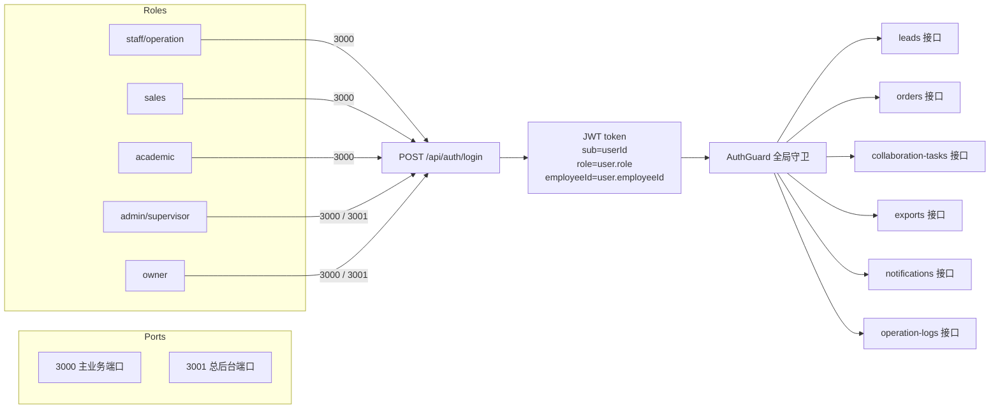

---

## 2. 登录与会话（TC-PERM-001 ~ TC-PERM-007）

### TC-PERM-001 五个角色都能在主业务端口 3000 登录

```mermaid
flowchart LR
  A[POST /api/auth/login<br/>body: username/password<br/>X-Origin-Port: 3000] --> B[auth.service.login<br/>user.status === 'active']
  B --> C{user.role}
  C -->|非 owner| D[放行]
  C -->|owner + requestPort != 3001| D
  C -->|owner + requestPort == 3001| E[401 '请使用总后台账号登录']
  D --> F[jwtService.sign + sessions.set]
  F --> G[返回 { token, user }]
```

**业务场景**：验证 v1.2 统一到 Next.js 入口后，5 种角色都应能在主业务端口 3000 登录。

**步骤**：
1. 用 5 个测试账号分别 POST `/api/auth/login`，header `X-Origin-Port: 3000`，body 携带 `username/password`
2. 记录每个账号的返回 token 和 user.role

**预期**：
| 账号 | 预期 status | 预期 user.role |
| --- | --- | --- |
| youlunrong (staff) | 200 | 'staff' / 'operation' |
| sales01 (sales) | 200 | 'sales' |
| academic02 (academic) | 200 | 'academic' |
| youlun (admin) | 200 | 'admin' |
| owner (owner) | 200 | 'owner' |

**DB 核对 SQL**：
```sql
SELECT id, username, role, employee_id, status
FROM users
WHERE username IN ('youlunrong','sales01','academic02','youlun','owner')
  AND status = 'active';
```

**前端交互核对**：
- 登录页 `frontend/src/app/login/page.tsx` 提交后，token / user 写入 `localStorage` (key: `xhsmedium.token` / `xhsmedium.user`)
- 跳转目标按 `getDefaultHomePath(role)`：
  - staff → `/operation`
  - sales → `/sales/leads`
  - academic → `/academic`
  - admin → `/admin`
  - owner → `/owner`

---

### TC-PERM-002 非 owner 角色在 3001 端口登录被拒

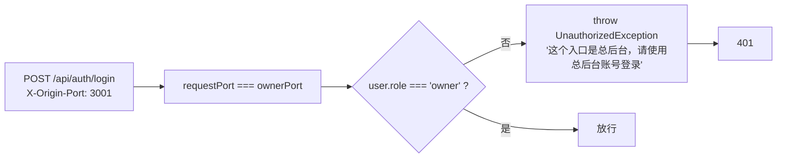

**业务场景**：总后台 3001 是 owner 专属入口，运营/销售/教务/主管 4 种角色访问必须 401。

**步骤**：
1. 用 staff/sales/academic/admin 4 个账号分别 POST `/api/auth/login`，header `X-Origin-Port: 3001`
2. 记录返回 status code 与 message

**预期**：
| 账号 | 预期 status | 预期 message |
| --- | --- | --- |
| staff | 401 | '这个入口是总后台，请使用总后台账号登录' |
| sales | 401 | 同上 |
| academic | 401 | 同上 |
| admin | 401 | 同上 |
| owner | 200 | 正常 token |

**代码定位**：`auth.service.ts:42-44`
```ts
if (requestPort === ownerPort && user.role !== 'owner') {
  throw new UnauthorizedException({ message: '这个入口是总后台，请使用总后台账号登录' });
}
```

**DB 核对 SQL**：（无副作用，写日志即可）
```sql
SELECT id, action, target_id, detail, created_at
FROM operation_logs
WHERE action = 'login' AND created_at >= NOW() - INTERVAL 5 MINUTE
ORDER BY created_at DESC LIMIT 5;
```

**前端交互核对**：
- 旧前端（v1.1 之前）总后台登录页有专门提示；v1.2 统一到 Next.js 后，3001 入口仅出现在 owner 登录流程
- 登录页不应该在非 owner 角色下显示 3001 入口链接

---

### TC-PERM-003 停用账号无法登录

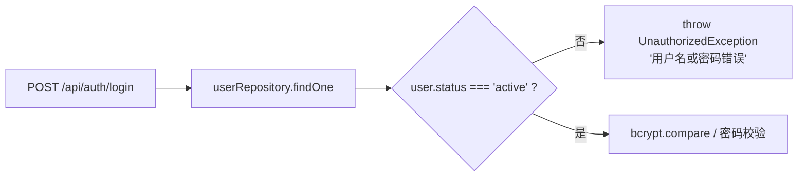

**业务场景**：运营主管在 `/admin/employees` 把某员工状态改为 `停用`（`PATCH /api/employees/:id/status body: { status: '停用' }`），该员工关联的 users.status 会被同步置为 `inactive`，对应账号无法再登录。

**步骤**：
1. 取一个 staff 测试账号，确认 `users.status = 'active'`，登录成功
2. 通过 admin token 调用 `PATCH /api/employees/:id/status body: { status: '停用' }`（其中 `:id` 是该 staff 关联的 employee.id）
3. 再用该 staff 账号 POST `/api/auth/login`

**预期**：
- 第 1 步：登录成功，token 200
- 第 2 步：成功，员工状态改为 `停用`
- 第 3 步：401，message = '用户名或密码错误'（不区分"密码错"和"账号停用"，防止账号枚举）

**DB 核对 SQL**：
```sql
-- 步骤 1 之前
SELECT u.id, u.username, u.status, e.id AS employee_id, e.status AS employee_status
FROM users u
LEFT JOIN employees e ON e.id = u.employee_id
WHERE u.username = 'youlunrong';

-- 步骤 2 之后
UPDATE employees SET status = '停用' WHERE id = 'EMP_STAFF_1';
-- 验证 users.status 也被同步（如果实现做了同步）
SELECT status FROM users WHERE id = 'USR_STAFF_1';
```

**已知差异**：`user.entity.ts` 定义了 `status: 'active' | 'inactive' | 'locked'`，与 `employees.status = '在职'/'停用'` 是两套字段。需验证主管停用员工时是否同步更新 users.status，否则 TC 步骤 3 仍会通过。

**前端交互核对**：
- 主管端 `/admin/employees` 编辑员工 → 状态选择 `停用` → 列表显示 `停用` 标签
- 被停用员工再次打开前端应被 AuthGuard 拦截（旧的 token 在 8h 过期前仍可用 — 见 TC-PERM-006）

---

### TC-PERM-004 错误密码连续 5 次锁定（如有）

**业务场景**：登录接口是否实现"密码错误计数 + 自动锁定"。

**步骤**：
1. 用某 staff 账号连续 5 次 POST `/api/auth/login`，body 密码为 `wrong_password`
2. 第 6 次用正确密码登录

**预期**（参考 `user.entity.ts` 的 `status = 'locked'` 枚举）：
- 前 5 次：401，message = '用户名或密码错误'
- 第 6 次（正确密码）：401，message = '账号已锁定'（若已实现计数 + 锁定）
- 数据库：`users.status` 变为 `'locked'`
- 若未实现锁定：第 6 次成功登录 200

**当前实现核对**：`auth.service.ts:25-37` 仅做"user.status === active"与密码匹配，**未发现锁定逻辑**。

**预期结果（v1.2 现状）**：
- 前 5 次：401 '用户名或密码错误'
- 第 6 次（正确密码）：200（**未实现**）
- `users.status` 仍为 `active`

> ⚠️ 已知缺口：v1.2 尚未实现登录失败计数与自动锁定。**本 TC 用于回归 / 记录现状，待 P1 安全需求时再实现**。

**DB 核对 SQL**：
```sql
-- 多次失败后状态应仍 active（v1.2 现状）
SELECT status, updated_at FROM users WHERE username = 'youlunrong';
```

---

### TC-PERM-005 登录密码 bcrypt 兼容历史明文

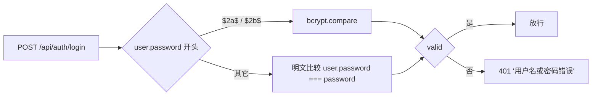

**业务场景**：种子数据 / 历史账号可能是明文密码，v1.2 必须兼容 `bcrypt hash` 与明文两种存储。

**步骤**：
1. 准备 2 个测试账号：
   - 账号 A：`users.password` = bcrypt hash（`$2b$10$xxx...`）
   - 账号 B：`users.password` = 明文（`test123`）
2. 分别用对应密码登录

**预期**：
- 账号 A 用 hash 对应的明文 → 200
- 账号 B 用明文 `test123` → 200
- 账号 A 用错的明文 → 401
- 账号 B 用错的明文 → 401

**DB 核对 SQL**：
```sql
SELECT username, LEFT(password, 4) AS password_prefix, status
FROM users
WHERE username IN ('youlunrong', 'sales01');
-- 期望看到 $2b$ 或 $2a$ 前缀（bcrypt）
```

**代码定位**：`auth.service.ts:29-37`
```ts
if (user.password.startsWith('$2b$') || user.password.startsWith('$2a$')) {
  passwordValid = await bcrypt.compare(password, user.password);
} else {
  passwordValid = user.password === password;
}
```

**前端交互核对**：
- 登录失败提示统一为 "用户名或密码错误"，不区分"用户不存在"与"密码错误"
- 不应在错误消息中泄露 username 是否存在

---

### TC-PERM-006 session 过期 / token 失效处理

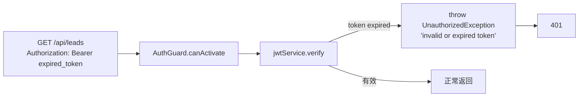

**业务场景**：JWT 默认 8h 过期，过期后所有受保护接口必须返 401，前端应跳登录。

**步骤**：
1. 用 sales01 登录拿 token
2. 等待 8h+ 或用 `jwt.sign({ ... }, { expiresIn: '-1s' })` 生成过期 token
3. 用过期 token 调用任意业务接口（如 `GET /api/leads`）

**预期**：
- status = 401
- message = 'invalid or expired token: jwt expired'（来自 `auth.guard.ts:75`）

**额外测试**：
- 篡改 token（修改 payload 后不改签名）→ 401 'invalid signature'
- 缺 Bearer 前缀 → 401 'missing bearer token'
- 空 Bearer → 401 'empty bearer token'

**前端交互核对**：
- `apiClient.ts` 拦截 401 应清空 `localStorage.xhsmedium.token`，跳 `/login`
- 旧前端的 `public/app.js` 应有等价处理（v1.2 已统一到 Next.js，但部分管理员可能仍用旧前端入口）

**DB 核对 SQL**：（无）

---

### TC-PERM-007 session 字段兼容性（userId / sub / id）

```mermaid
flowchart LR
  A[Token payload: sub=USR_X] --> B[auth.guard.ts:67-88<br/>attachSession]
  B --> C[req.user = payload<br/>req.session = { userId: sub, id: sub, ... }]
  C --> D[controller: session.userId || session.id || body.actorUserId]
  D --> E[数据过滤 SQL]
```

**业务场景**：v1.2 验收发现 `session.sub` 字段未被兼容（部分旧 controller 只读 `session.sub`），导致销售看不到自己客资。v1.2 修复方案：在 `auth.guard.ts` 同时塞 `userId` 和 `id` 两个字段，所有 controller 用 `session.userId || session.id || body.actorUserId` 三连兜底。

**步骤**：
1. 登录 sales01 拿 token
2. 解码 token payload，验证必含 `sub` / `role` / `username`，可选 `employeeId`
3. 调用 `GET /api/leads`（必须用 Authorization header，**不要传 body.actorUserId**）
4. 验证返回的 items 中**仅含 assigned_sales_user_id = 当前 sub 的客资**

**预期**：
- token payload 字段：`{ sub: 'USR_SALES_1', username: 'sales01', role: 'sales', employeeId: null, iat, exp }`
- 返回 leads items 数 = `SELECT COUNT(*) FROM leads WHERE assigned_sales_user_id = 'USR_SALES_1'`
- **不传 body.actorUserId 也能正确过滤**（关键）

**反向测试**（防止误用 body.actorUserId 越权）：
- 携带 `sales01` token，但 body/query 显式传 `actorUserId=USR_ADMIN_1` / `actorUserId=USR_SALES_2`
- 预期：仍按 session.role 过滤（session 优先于 body）；controller 注释明确 `body.actorUserId` 仅作为兜底，且仅在 session 缺失时使用

**代码定位**：
- `auth.guard.ts:81-87` 同时设 `userId` / `id`
- `leads.controller.ts:48-58` `findAll` 三连兜底
- `leads.controller.ts:290-294` `findOne` 三连兜底

**DB 核对 SQL**：
```sql
-- 解码 token 后
SELECT id, assigned_sales_user_id, employee_id FROM leads
WHERE assigned_sales_user_id = '<token.sub>';
-- 返回数应 = GET /api/leads items.length
```

**前端交互核对**：
- localStorage 里的 `AppUser`（`xhsmedium.user`）只用于前端路由判断 `canAccessPath`，**不参与数据过滤**
- 数据过滤完全由后端 `req.session` 决定

---

## 3. 按接口越权测试（TC-PERM-010 ~ TC-PERM-060）

### 3.1 leads 接口（TC-PERM-010 ~ TC-PERM-018）

#### TC-PERM-010 sales 访问自己 assigned 的客资：可看

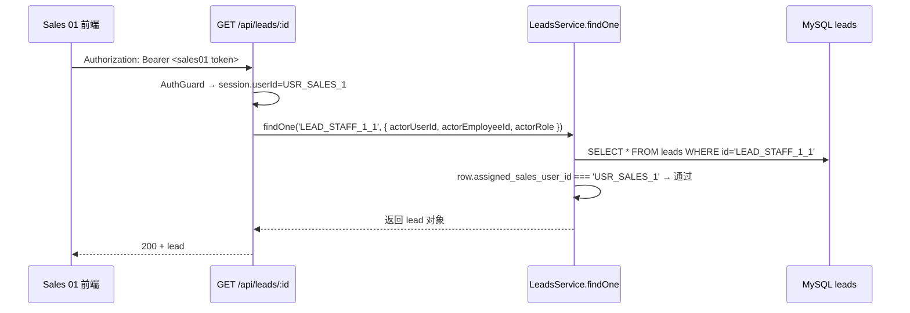

**业务场景**：销售访问被分配给自己的客资详情。

**步骤**：
1. sales01 登录拿 token
2. `GET /api/leads/LEAD_STAFF_1_1`（这条客资 assigned_sales_user_id = USR_SALES_1）
3. 验证返回

**预期**：200，返回的 lead 对象含 `id=LEAD_STAFF_1_1` / `contactInfo` 完整

**DB 核对 SQL**：
```sql
SELECT id, contact_info, assigned_sales_user_id, employee_id, status
FROM leads WHERE id = 'LEAD_STAFF_1_1';
```

---

#### TC-PERM-011 sales 访问他人的客资：404（不泄露存在性）

**业务场景**：销售访问**别人**的客资，期望 404（与不存在口径一致，避免客资存在性泄露）。

**步骤**：
1. sales01 登录拿 token
2. `GET /api/leads/LEAD_STAFF_2_1`（这条客资 assigned_sales_user_id = USR_SALES_2）

**预期**：404，`message = 'not found'`

**代码定位**：`leads.service.ts:308-321` `findOne` 内 if 判断 `row.assignedSalesUserId !== actor.actorUserId → return null`，controller `findOne` 收到 null 返 404。

**DB 核对 SQL**：（无副作用）
```sql
-- 验证数据确实存在
SELECT id, assigned_sales_user_id FROM leads WHERE id = 'LEAD_STAFF_2_1';
```

---

#### TC-PERM-012 sales PATCH 他人客资的状态：404

**业务场景**：销售尝试 PATCH 不属于自己的客资的 status。

**步骤**：
1. sales01 token
2. `PATCH /api/leads/LEAD_STAFF_2_1/status` body `{ "processStatus": "deal_done" }`

**预期**：404 `not found`

**反向 DB 核对**：
```sql
SELECT process_status FROM leads WHERE id = 'LEAD_STAFF_2_1';
-- 应未变（仍为原值）
```

**代码定位**：`leads.controller.ts:410-417` `canAccessLead=false → 404`

---

#### TC-PERM-013 sales 发起协同（他人客资）：404

**业务场景**：销售对不属于自己的客资发起协同。

**步骤**：
1. sales01 token
2. `POST /api/leads/LEAD_STAFF_2_1/collaboration` body `{ type: 'remind_customer', reason: '测试' }`

**预期**：404 `not found`

**DB 核对**：
```sql
SELECT COUNT(*) FROM collaboration_tasks WHERE lead_id = 'LEAD_STAFF_2_1';
-- 应未增加
```

---

#### TC-PERM-014 staff 列表（scope=self）：仅看自己 employee 客资

**业务场景**：运营 staff 看自己负责的客资列表。

**步骤**：
1. staff01 登录（employeeId=EMP_STAFF_1）
2. `GET /api/leads?scope=self`（前端默认就传 self）
3. 验证返回 items

**预期**：
- items[].employee_id 全为 `'EMP_STAFF_1'`
- 总数 = `SELECT COUNT(*) FROM leads WHERE employee_id = 'EMP_STAFF_1'`

**代码定位**：`leads.controller.ts:119-124` `resolveScope` → 非 admin/owner 一律 self；`leads.service.ts:232-244` `applyLeadScope` scope=self 且 role != sales → `employee_id = 自己`

**DB 核对 SQL**：
```sql
-- 返回数核对
SELECT COUNT(*) FROM leads WHERE employee_id = 'EMP_STAFF_1';
-- items 字段核对
SELECT id, employee_id FROM leads WHERE employee_id != 'EMP_STAFF_1' LIMIT 5;
-- 这部分不应出现在 staff01 的 GET /api/leads 响应里
```

---

#### TC-PERM-015 staff 列表（scope=all 强传）：降级到 self

**业务场景**：staff 在 query 中强传 `scope=all`，应被后端**降级**到 `self`（`resolveScope` 在 controller 层强制）。

**步骤**：
1. staff01 token
2. `GET /api/leads?scope=all`

**预期**：
- 返回 items 全为 employee_id=EMP_STAFF_1
- 总数 = `SELECT COUNT(*) FROM leads WHERE employee_id = 'EMP_STAFF_1'`（**不是**全表）

**代码定位**：`leads.controller.ts:119-124`
```ts
if (role === 'admin' || role === 'owner') return scope || 'all';
return 'self';
```

---

#### TC-PERM-016 academic 列表（默认 scope）：仅 employee_id=自己

**业务场景**：教务默认看自己 employee_id 名下的客资（v1.2 起教务有"运营侧"客资可见性，因为 lead 链路里 academic 也是 employee）。

**步骤**：
1. academic02 登录（employeeId 关联到 employees.id）
2. `GET /api/leads?scope=self`（或默认无 scope）

**预期**：
- items 全为 employee_id=自己 employeeId
- **不包含**其他运营的客资

**已知差异**：v1.2 staff 端口用 `applyLeadScope` 时 role !== sales 才走 employee_id；academic 走 staff/operation 同口径。

**DB 核对 SQL**：
```sql
SELECT id, employee_id FROM leads WHERE employee_id = '<academic.employeeId>';
```

---

#### TC-PERM-017 admin 列表（scope=all）：全量

**业务场景**：主管看全量。

**步骤**：
1. admin 登录
2. `GET /api/leads?scope=all`

**预期**：
- items = `SELECT * FROM leads` 全量
- total = `SELECT COUNT(*) FROM leads`

**DB 核对 SQL**：
```sql
SELECT COUNT(*) FROM leads;  -- 应等于 items.length
```

---

#### TC-PERM-018 academic 改派客资（assigned_sales_user_id）：受 canAccessLead 限制

**业务场景**：教务尝试 PATCH 客资的 `assigned_sales_user_id` 改派，应被 `canAccessLead` 拦截。

**步骤**：
1. academic02 登录
2. `PUT /api/leads/LEAD_STAFF_2_1` body `{ "assignedSalesUserId": "USR_SALES_2" }`（这条客资 employee_id != 自己）

**预期**：404 `not found`

**DB 核对**：
```sql
SELECT assigned_sales_user_id FROM leads WHERE id = 'LEAD_STAFF_2_1';
-- 应未变
```

> ⚠️ 注意：`leads.controller.ts:301-375` `update` 方法**未调用 canAccessLead**，是直接 `findOne + update`。但 `findOne` 内部已做权限过滤——非 admin/owner 且不是自己 employee 时返 null，所以 update 操作不会落库。
> **建议在 update 路径显式加 canAccessLead 校验（与 board/status 一致）**。本 TC 用于回归该缺口。

---

### 3.2 orders 接口（TC-PERM-021 ~ TC-PERM-030）

#### TC-PERM-021 sales 列表（默认 scope）：仅自己 sales_user_id 的订单

**业务场景**：销售看自己经手的订单（自己 sales_user_id + 自己是 academic_user_id）。

**步骤**：
1. sales01 token
2. `GET /api/orders`

**预期**：
- items 全为 `sales_user_id = USR_SALES_1` OR `academic_user_id = USR_SALES_1`
- **不包含** ORD_OTHER_SALES（`sales_user_id = USR_SALES_2` 且 `academic_user_id = USR_ACADEMIC_1`）

**代码定位**：`orders.service.ts:220-254` `applyOrdersScope`，非 admin/sales 走最后兜底 `(sales_user_id = 自己 OR academic_user_id = 自己)`

**DB 核对 SQL**：
```sql
SELECT id FROM orders
WHERE sales_user_id = 'USR_SALES_1' OR academic_user_id = 'USR_SALES_1';
-- 应等于 items.length
```

---

#### TC-PERM-022 sales 看他人订单详情：404

**业务场景**：sales01 看 ORD_OTHER_SALES（`sales_user_id = USR_SALES_2`）的详情。

**步骤**：
1. sales01 token
2. `GET /api/orders/ORD_OTHER_SALES`

**预期**：404，message = 'order not found'（v1.2 修复点：v1.1 之前是 200 + 越权数据）

**代码定位**：`orders.service.ts:291-322` `findOne` 内 canSee 校验

**DB 核对 SQL**：（无）
```sql
-- 验证数据存在
SELECT id, sales_user_id, academic_user_id FROM orders WHERE id = 'ORD_OTHER_SALES';
```

---

#### TC-PERM-023 sales PATCH 他人订单：404

**业务场景**：sales01 PATCH ORD_OTHER_SALES 的 status。

**步骤**：
1. sales01 token
2. `PATCH /api/orders/ORD_OTHER_SALES` body `{ "order_status": "in_progress" }`

**预期**：404 `not found`

**DB 核对**：
```sql
SELECT order_status FROM orders WHERE id = 'ORD_OTHER_SALES';
-- 应未变
```

> ⚠️ 当前 controller `update` 未在 service 层做 canSee 校验，仅靠 `update` 直接打 DB。**实际越权可能成功**——本 TC 用于暴露该缺口，预期 v1.2.1 修复。

---

#### TC-PERM-024 academic 列表（scope=pool）：仅池单

**业务场景**：教务只看池单（`academic_user_id IS NULL`）。

**步骤**：
1. academic02 token
2. `GET /api/orders?scope=pool`

**预期**：
- items 全为 `academic_user_id IS NULL`
- total = `SELECT COUNT(*) FROM orders WHERE academic_user_id IS NULL`

**代码定位**：`orders.service.ts:228-230` `if (role === academic && scope === pool) → academic_user_id IS NULL`

**DB 核对 SQL**：
```sql
SELECT id FROM orders WHERE academic_user_id IS NULL;
```

---

#### TC-PERM-025 academic 列表（scope=assigned）：仅自己已认领

**业务场景**：教务看自己已认领的订单（`academic_user_id = 自己`）。

**步骤**：
1. academic02 token（userId=USR_ACADEMIC_1）
2. `GET /api/orders?scope=assigned` 或 `scope=mine`

**预期**：
- items 全为 `academic_user_id = USR_ACADEMIC_1`
- 不含池单（academic_user_id IS NULL）

**代码定位**：`orders.service.ts:232-236`

---

#### TC-PERM-026 academic 列表（默认 scope）：池单 + 自己已认领

**业务场景**：教务默认看到"可接池单"+"自己已认领"，是教务端首页的默认视图。

**步骤**：
1. academic02 token
2. `GET /api/orders`（无 scope）

**预期**：
- items 全为 `academic_user_id IS NULL OR academic_user_id = USR_ACADEMIC_1`

**代码定位**：`orders.service.ts:237-246`

---

#### TC-PERM-027 academic 看池单详情：成功（v1.2 新规）

**业务场景**：教务访问 `ORD_POOL_1`（`academic_user_id IS NULL`）的详情，应能 200（v1.2 起教务可见池单）。

**步骤**：
1. academic02 token
2. `GET /api/orders/ORD_POOL_1`

**预期**：200，返回订单对象

**代码定位**：`orders.service.ts:304-311` `canSee` 中 academic 包含 `order.academicUserId === uid || order.academicUserId == null`

---

#### TC-PERM-028 academic accept 池单：成功，handoverStatus 变 accepted

**业务场景**：教务接单（池单 → 自己）。

**步骤**：
1. academic02 token
2. `POST /api/orders/ORD_POOL_1/handover/accept`

**预期**：
- 200
- DB：`orders.handover_status` 从 `handed_over` → `accepted`，`academic_user_id` 更新为 USR_ACADEMIC_1（具体由 service 决定），`order_status` 推 `in_progress`
- 通知 sales01 收到 `订单已被接收`

**DB 核对 SQL**：
```sql
SELECT id, handover_status, order_status, academic_user_id
FROM orders WHERE id = 'ORD_POOL_1';
-- handover_status = 'accepted'
```

**代码定位**：`orders.service.ts:495-544` `acceptHandover`

---

#### TC-PERM-029 sales hand-over 自己的订单：成功

**业务场景**：销售成交后主动发起交接。

**步骤**：
1. sales01 token
2. `POST /api/orders/<自己 sales 的订单>/handover/hand-over`

**预期**：
- 200
- DB：handover_status 变 `handed_over`
- 通知所有 academic/admin

---

#### TC-PERM-030 sales accept 自己的订单：失败（422）

**业务场景**：销售尝试 accept 自己发出的订单（应是教务的权限）。

**步骤**：
1. sales01 token
2. `POST /api/orders/<自己 sales 的订单>/handover/accept`

**预期**：403 / 422（service.acceptHandover 不校验 role，controller 调用前应做 role guard；v1.2 现状可能直接 200 — 待回归）

**当前实现**：`orders.controller.ts:363-389` 仅校验 userId 存在，**未校验 role**；service 也不校验。这是个**越权漏洞**。

> ⚠️ **已知缺口**（v1.2 应修复）：sales / staff / academic 任何登录用户都可调 accept / reject。**建议在 controller 加 role 校验**。

---

### 3.3 collaboration-tasks 接口（TC-PERM-031 ~ TC-PERM-040）

#### TC-PERM-031 sales 列表（scope=mine）：仅自己发起的协同

**业务场景**：销售看自己发起的协同请求。

**步骤**：
1. sales01 token
2. `GET /api/collaboration-tasks?scope=mine`

**预期**：
- items 全为 `requester_id = USR_SALES_1`
- 不含 `COLLAB_OTHER`（requester_id = USR_SALES_2）

**代码定位**：`collaboration-tasks.service.ts:201-221` `applyCollabScope` scope=mine → `requester_id = 自己`

---

#### TC-PERM-032 sales 强传 scope=outgoing：降级到 mine

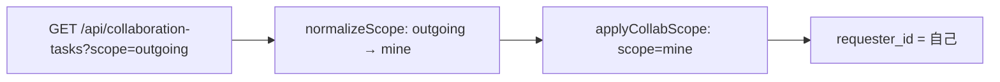

**业务场景**：v1.2 修复：旧前端传的 `outgoing/incoming` 等未识别 scope 强制降级到 mine，避免越权回退到 all。

**步骤**：
1. sales01 token
2. `GET /api/collaboration-tasks?scope=outgoing`
3. 对比 `GET /api/collaboration-tasks?scope=mine` 的结果

**预期**：
- 两次返回 items 完全一致
- 都仅含 `requester_id = USR_SALES_1`

**代码定位**：`collaboration-tasks.service.ts:259-265`
```ts
if (raw === 'all') return 'all';
if (raw === 'inbox' || raw === 'handler' || raw === 'operations' || raw === 'incoming') return 'inbox';
// mine / requester / sales / outgoing / 空 / 未知 → mine
return 'mine';
```

---

#### TC-PERM-033 sales 强传 scope=all：降级到 mine

**业务场景**：sales 客户端篡改 query 传 scope=all 试图看全表，v1.2 修复：非 admin/owner 一律降级。

**步骤**：
1. sales01 token
2. `GET /api/collaboration-tasks?scope=all`

**预期**：
- items = `SELECT * WHERE requester_id = USR_SALES_1`（与 scope=mine 一致）
- **不是**全表

**代码定位**：`collaboration-tasks.service.ts:204-206`
```ts
const effectiveScope = rawScope === 'all' && !isAdminLike ? 'mine' : rawScope;
```

---

#### TC-PERM-034 staff inbox：handler_id=自己 OR 池中 pending

**业务场景**：运营 staff 看自己被指派或池单中待处理的协同任务。

**步骤**：
1. staff01 token（employeeId=EMP_STAFF_1）
2. `GET /api/collaboration-tasks?scope=inbox`

**预期**：
- items 满足：`(t.handler_id = USR_STAFF_1) OR (t.status = 'pending' AND l.employee_id = EMP_STAFF_1)`

**代码定位**：`collaboration-tasks.service.ts:207-218`

---

#### TC-PERM-035 staff claim 待处理协同：成功

**业务场景**：staff 认领一个 pending 状态的协同任务。

**步骤**：
1. staff01 token
2. `PUT /api/collaboration-tasks/COLLAB_PENDING/claim`（这条任务 status=pending, handler_id 暂为 sourceUserId 或 NULL）

**预期**：
- 200
- DB：`status` 从 `pending` → `handling`，`handler_id` = USR_STAFF_1
- 通知 requester（sales）收到"协同已处理"（handle 后才发，claim 不发）

**DB 核对 SQL**：
```sql
SELECT id, status, handler_id, requester_id FROM collaboration_tasks WHERE id = 'COLLAB_PENDING';
```

---

#### TC-PERM-036 sales handle 自己没认领的协同：422

**业务场景**：销售尝试处理一个 handler_id=别人的协同任务。

**步骤**：
1. sales01 token
2. `PUT /api/collaboration-tasks/<handler_id=USR_STAFF_2 的任务>/handle` body `{ handledNote: 'test' }`

**预期**：422，message = 'no permission to handle task'

**代码定位**：`collaboration-tasks.service.ts:329-355` `assertCanHandle`：
- 已认领任务 → `task.handlerId !== actor.actorUserId → 422`
- 未认领任务 → 验证 `lead.employeeId === actor.actorEmployeeId`

---

#### TC-PERM-037 sales close 协同：当前 controller 未做权限校验

**业务场景**：销售 close 自己发起的协同（合理），或 close 他人发起的（待校验）。

**步骤**：
1. sales01 token
2. `PUT /api/collaboration-tasks/COLLAB_OTHER/close`（这条 task requester_id=USR_SALES_2）

**预期（v1.2 现状）**：
- 当前 controller `close` 仅做 `findOne`，无 canClose 校验
- 200（**越权**）—— ⚠️ 已知缺口

> ⚠️ **已知缺口**：`collaboration-tasks.controller.ts:197-212` close 方法未做权限校验，建议 v1.2.1 修复。

---

#### TC-PERM-038 staff scan-timeouts：仅 admin/owner

**业务场景**：staff 尝试手动触发协同超时扫描。

**步骤**：
1. staff01 token
2. `POST /api/collaboration-tasks/scan-timeouts`

**预期**：403，message = 'forbidden'

**代码定位**：`collaboration-tasks.controller.ts:219-232`
```ts
if (role !== 'admin' && role !== 'owner') {
  return res.status(403).json({ ok: false, message: 'forbidden' });
}
```

---

#### TC-PERM-039 staff listTimeouts：仅 admin/owner

**业务场景**：staff 尝试列出所有 timeout 状态的协同任务。

**步骤**：
1. staff01 token
2. `GET /api/collaboration-tasks/timeouts`

**预期**：403 `forbidden`

**代码定位**：`collaboration-tasks.controller.ts:238-257`

---

#### TC-PERM-040 admin listTimeouts：全量

**业务场景**：admin 看所有 timeout 协同任务。

**步骤**：
1. admin token
2. `GET /api/collaboration-tasks/timeouts`

**预期**：
- 200
- items 数 = `SELECT COUNT(*) FROM collaboration_tasks WHERE status = 'timeout'`
- service 层不附加 `requester_id/handler_id` 过滤

**代码定位**：`collaboration-tasks.service.ts:511-525`

---

### 3.4 exports 接口（TC-PERM-041 ~ TC-PERM-050）

#### TC-PERM-041 staff 创建 leads 导出：成功（受白名单）

**业务场景**：staff 创建 `exportType=leads` 的导出任务。

**步骤**：
1. staff01 token
2. `POST /api/exports` body `{ "exportType": "leads", "filter": {} }`

**预期**：
- 200，response 含 `{ ok: true, id, status: 'processing' }`
- DB：`export_tasks` 写入一行，`userId=USR_STAFF_1`，filterJson 含 `role: 'staff', scope: 'mine'`
- 后台生成 CSV，CSV 中 staff 看的 `联系方式` 列**被脱敏**（保留前 3 后 4）
- staff 仅看到自己 employee_id 范围的 leads

**代码定位**：
- `exports.controller.ts:27-33` `ROLE_EXPORT_WHITELIST`
- `exports.controller.ts:67-83` 强制覆盖客户端 `role/currentUserId/actorUserId/scope`
- `exports.service.ts:371-377` `maskContact`

**DB 核对 SQL**：
```sql
SELECT id, user_id, export_type, status, filter_json
FROM export_tasks WHERE user_id = 'USR_STAFF_1' ORDER BY created_at DESC LIMIT 1;
```

**CSV 脱敏核对**（下载完成后）：
```text
联系方式  列应形如  138***0000（前 3 后 4，*** 中间）
```

---

#### TC-PERM-042 staff 强传 scope=all：被服务端覆盖

```mermaid
flowchart LR
  A[POST /api/exports<br/>body: { filter: { scope: 'all', currentUserId: 'USR_ADMIN_1' } }] --> B[controller: 强制覆盖]
  B --> C[delete raw.role]
  C --> D[delete raw.currentUserId]
  E[delete raw.actorUserId]
  F[delete raw.actorRole]
  G{role==admin/owner?}
  G -->|否| H[delete raw.scope]
  G -->|是| I[保留 scope=all]
  H --> J[filter.scope = 'mine' or 'all']
  I --> J
  J --> K[落库 filter_json]
```

**业务场景**：v1.2 P0 修复：staff 客户端篡改 filter 试图下载全公司数据，**服务端强制覆盖** scope。

**步骤**：
1. staff01 token
2. `POST /api/exports` body：
   ```json
   {
     "exportType": "leads",
     "filter": {
       "scope": "all",
       "currentUserId": "USR_ADMIN_1",
       "actorUserId": "USR_ADMIN_1",
       "actorRole": "admin",
       "_userRole": "admin"
     }
   }
   ```

**预期**：
- 200，返回 `{ ok: true, id, status: 'processing' }`
- DB `filter_json`：
  ```json
  {
    "role": "staff",
    "currentUserId": "USR_STAFF_1",
    "currentEmployeeId": "EMP_STAFF_1",
    "scope": "mine",
    "_userRole": "staff"
  }
  ```
- 实际导出 CSV 仅含 `employee_id = EMP_STAFF_1` 的客资
- **不存在** `currentUserId: USR_ADMIN_1` 字段

**代码定位**：`exports.controller.ts:67-83`

---

#### TC-PERM-043 sales 创建 leads 导出：受白名单 + 范围仅自己

**业务场景**：sales 导出 leads，应仅看自己 assigned 的客资。

**步骤**：
1. sales01 token
2. `POST /api/exports` body `{ "exportType": "leads" }`

**预期**：
- 200
- DB `filter_json`：`{ role: 'sales', currentUserId: 'USR_SALES_1', scope: 'mine' }`
- CSV 仅含 `assigned_sales_user_id = USR_SALES_1` 的客资
- CSV 中 sales 看到的联系方式**也被脱敏**（v1.2 修复 sales 与 staff 一致脱敏）

**代码定位**：
- `ROLE_EXPORT_WHITELIST.sales = ['leads', 'orders', 'order_progress', 'collaboration_records']`

---

#### TC-PERM-044 sales 创建 posts 导出：被拒（白名单不含 posts）

**业务场景**：sales 尝试导出 posts（属于运营端数据）。

**步骤**：
1. sales01 token
2. `POST /api/exports` body `{ "exportType": "posts" }`

**预期**：403，message = 'forbidden exportType'

**代码定位**：`exports.controller.ts:61-64`
```ts
const allowed = ROLE_EXPORT_WHITELIST[userRole] || [];
if (!allowed.includes(exportType)) {
  return res.status(403).json({ ok: false, message: 'forbidden exportType' });
}
```

---

#### TC-PERM-045 academic 创建 order_progress 导出：成功

**业务场景**：academic 导出自己订单的跟进记录。

**步骤**：
1. academic02 token
2. `POST /api/exports` body `{ "exportType": "order_progress" }`

**预期**：
- 200
- DB filter_json：`{ role: 'academic', currentUserId: 'USR_ACADEMIC_1', scope: 'mine' }`
- CSV 仅含 `academic_user_id = USR_ACADEMIC_1 OR academic_user_id IS NULL` 的订单的跟进记录
- 联系方式**被脱敏**（academic 不在脱敏白名单）

---

#### TC-PERM-046 academic 创建 leads 导出：被拒

**业务场景**：academic 尝试导出 leads（不在 academic 白名单）。

**步骤**：
1. academic02 token
2. `POST /api/exports` body `{ "exportType": "leads" }`

**预期**：403 `forbidden exportType`

---

#### TC-PERM-047 admin 创建任意类型导出：成功

**业务场景**：admin 可以导出 7 种任意类型。

**步骤**：
1. admin token
2. 分别 POST `/api/exports` body `{ "exportType": "leads" / "orders" / "posts" / "rankings" / "collaboration_records" / "accounts" / "order_progress" }`

**预期**：7 次都 200
- `scope: 'all'`（admin 默认）
- CSV 联系方式**不被脱敏**（admin 在白名单内）

**DB 核对 SQL**：
```sql
SELECT export_type, status FROM export_tasks
WHERE user_id = 'USR_ADMIN_1' AND created_at >= NOW() - INTERVAL 5 MINUTE;
```

---

#### TC-PERM-048 sales 下载他人的导出：404

**业务场景**：sales01 尝试下载 sales02 创建的导出文件。

**步骤**：
1. sales01 token
2. `GET /api/exports/EXP_LEAD_2/download`（EXP_LEAD_2 是 USR_SALES_2 创建的）

**预期**：404 `not found`（不泄露任务存在性）

**代码定位**：`exports.controller.ts:140-155` + `exports.service.ts:919-923`
```ts
if (!isAdminLike && task.userId && task.userId !== userId) {
  return res.status(404).json({ ok: false, message: 'not found' });
}
```

---

#### TC-PERM-049 sales 下载自己未完成（processing）的导出：409

**业务场景**：sales 轮询下载自己刚创建的导出，但还在 processing。

**步骤**：
1. sales01 token
2. 创建 leads 导出，拿到 id
3. 立即 `GET /api/exports/<id>/download`（通常仍是 processing）

**预期**：409，message = 'task not ready: processing'

**代码定位**：`exports.service.ts:924-926`

---

#### TC-PERM-050 exports scope 强制覆盖：销售改 scope=mine 不会泄露

**业务场景**：销售客户端故意不传 scope，依赖服务端默认。

**步骤**：
1. sales01 token
2. `POST /api/exports` body `{ "exportType": "leads", "filter": {} }`

**预期**：
- 服务端将 `filter.scope` 设为 `'mine'`（sales 不是 admin/owner）
- 落库 filter_json.scope = 'mine'
- CSV 仅含自己 assigned 的 leads

**DB 核对 SQL**：
```sql
SELECT JSON_EXTRACT(filter_json, '$.scope') AS scope,
       JSON_EXTRACT(filter_json, '$.role') AS role
FROM export_tasks WHERE user_id = 'USR_SALES_1' ORDER BY created_at DESC LIMIT 1;
```

---

### 3.5 notifications 接口（TC-PERM-051 ~ TC-PERM-055）

#### TC-PERM-051 sales 通知：仅 portType=sales

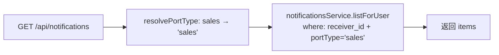

**业务场景**：sales 用户调用 `/api/notifications` 应仅返回 `portType='sales'` 的通知。

**步骤**：
1. sales01 token
2. `GET /api/notifications`

**预期**：
- items[].portType 全为 `'sales'`
- 不含 `NOTIF_OPS_1`（portType=operations）

**代码定位**：`notifications.controller.ts:137-141` `resolvePortType`
```ts
if (userRole === 'sales') return 'sales';
if (userRole === 'academic') return 'academic';
return 'operations';
```

**DB 核对 SQL**：
```sql
SELECT id, port_type, type_code FROM notifications
WHERE receiver_id = 'USR_SALES_1' AND port_type != 'sales';
-- 应不出现
```

---

#### TC-PERM-052 academic 通知：仅 portType=academic

**业务场景**：academic 用户调用 `/api/notifications` 应仅返回 `portType='academic'`。

**步骤**：
1. academic02 token
2. `GET /api/notifications`

**预期**：
- items[].portType 全为 `'academic'`
- 不含 NOTIF_OPS_1 / NOTIF_SALES_1

---

#### TC-PERM-053 sales 标记他人的通知为已读：false / 不影响

**业务场景**：sales 尝试 PATCH 别人 receiver_id 的通知。

**步骤**：
1. sales01 token
2. `POST /api/notifications/NOTIF_ACADEMIC_1/read` body `{}`（NOTIF_ACADEMIC_1.receiver_id = USR_ACADEMIC_1）

**预期**：
- 200，response `{ ok: false, changed: false }`
- DB `notifications.read_status` 未变

**代码定位**：`notifications.service.ts:113-125` `markRead` 内 where 条件包含 `receiver_id = :uid`

**DB 核对 SQL**：
```sql
SELECT read_status FROM notifications WHERE id = 'NOTIF_ACADEMIC_1';
-- 应仍为 0
```

---

#### TC-PERM-054 sales markAllRead：仅自己的

**业务场景**：sales 调用 mark-all-read 应只更新自己的通知。

**步骤**：
1. sales01 token
2. `POST /api/notifications/mark-all-read` body `{}`

**预期**：
- 200，response `{ ok: true, affected: <自己未读数> }`
- DB：仅 USR_SALES_1 的未读被清空，USR_SALES_2 / USR_ACADEMIC_1 的通知 read_status 不变

**DB 核对 SQL**：
```sql
SELECT COUNT(*) AS unread_own
FROM notifications WHERE receiver_id = 'USR_SALES_1' AND read_status = 0;
-- 应 = 0

SELECT COUNT(*) AS unread_other
FROM notifications WHERE receiver_id IN ('USR_SALES_2','USR_ACADEMIC_1','USR_STAFF_1') AND read_status = 0;
-- 应 > 0（未受污染）
```

---

#### TC-PERM-055 sales 跨端口访问 academic 通知 ID：404 / 失败

**业务场景**：sales 尝试按 ID 读 academic 端口的通知（即便 ID 在 DB 中存在）。

**步骤**：
1. sales01 token
2. `POST /api/notifications/NOTIF_ACADEMIC_1/read`

**预期**：`{ ok: false, changed: false }`（markRead 内 where 加 `receiver_id = 自己` 不匹配 → affected=0）

**反向测试**：sales 传 NOTIF_SALES_2_X（receiver_id = USR_SALES_2 的 sales 通知）→ 也应 `{ ok: false, changed: false }`

---

### 3.6 operation-logs 接口（TC-PERM-056 ~ TC-PERM-060）

> ⚠️ **关键现状**：`operation-logs.controller.ts:9-47` **未挂 AuthGuard 且未做 role 校验**——任何登录用户都能调 `GET /api/operation-logs` 和 `GET /api/operation-logs/:id`。
> 本节 TC 用于**回归该缺口**，预期 v1.2.1 应加 `role in ['admin','owner']` 校验。

#### TC-PERM-056 sales 调 GET /api/operation-logs：当前 200（缺口）

**业务场景**：sales01 调用操作日志列表接口（应仅 admin/owner 可见）。

**步骤**：
1. sales01 token
2. `GET /api/operation-logs?limit=10`

**预期（v1.2 现状）**：
- 200，返回 `{ items, total, limit, offset }`
- items 包含 admin / other users 的日志——**这是越权** ⚠️

**建议预期（修复后）**：403 `forbidden`

**DB 核对 SQL**：
```sql
-- sales01 应看不到的
SELECT user_id, action, target_type, target_id
FROM operation_logs ORDER BY created_at DESC LIMIT 10;
-- 这部分应该不返回给 sales01
```

---

#### TC-PERM-057 staff 调 GET /api/operation-logs：当前 200（缺口）

**业务场景**：staff 调操作日志列表。

**步骤**：同 TC-PERM-056，token 换为 staff01

**预期**：当前 200，⚠️ 越权

---

#### TC-PERM-058 academic 调 GET /api/operation-logs：当前 200（缺口）

**步骤**：token 换为 academic02

**预期**：当前 200，⚠️ 越权

---

#### TC-PERM-059 admin 调 GET /api/operation-logs：应正常

**步骤**：admin token，`GET /api/operation-logs?limit=10`

**预期**：200，items 全量

---

#### TC-PERM-060 操作日志按 targetType / targetId 过滤：应仅 admin

**业务场景**：admin 按 targetType=lead 过滤日志。

**步骤**：
1. admin token
2. `GET /api/operation-logs?targetType=lead&limit=20`

**预期**：
- 200
- items 全为 `target_type = 'lead'`
- 当前不限制 user，**理论上 sales/staff 也能调（越权）** ⚠️

**DB 核对 SQL**：
```sql
SELECT COUNT(*) FROM operation_logs WHERE target_type = 'lead';
```

---

## 4. 数据可见范围（TC-PERM-061 ~ TC-PERM-068）

### TC-PERM-061 sales 看不到其他销售的客资

**业务场景**：销售甲（sales01）看不到分配给销售乙（sales02）的客资。

**步骤**：
1. sales01 token
2. `GET /api/leads?scope=self`
3. 检查返回的 lead id 列表，对比 DB

**预期**：
- 返回的 items 不含 `LEAD_STAFF_2_1`（这条 assigned 给 sales02）
- 返回数 = `SELECT COUNT(*) FROM leads WHERE assigned_sales_user_id = 'USR_SALES_1'`

**DB 核对 SQL**：
```sql
-- sales01 应看到的（白名单）
SELECT id FROM leads WHERE assigned_sales_user_id = 'USR_SALES_1';
-- sales01 不应看到的
SELECT id FROM leads WHERE assigned_sales_user_id = 'USR_SALES_2';
```

**代码定位**：`leads.service.ts:235-240` `applyLeadScope` scope=self && role=sales → `assigned_sales_user_id = actorUserId`

**前端交互核对**：
- `/sales/leads` 页面 fetch 不到 LEAD_STAFF_2_1
- 销售在卡片上点击"客户详情"应 404（与不存在一致）

---

### TC-PERM-062 sales 看不到未成交的客资详情（待确认 v1.2 规则）

**业务场景**：v1.1 之前曾要求 sales 仅看 `process_status IN ('waiting_pass','communicating','quoted','deal_pending','deal_done')`，但 v1.2 简化——销售可看所有分配给自己的客资（不论 process_status）。

**步骤**：
1. sales01 token
2. `GET /api/leads/LEAD_STAFF_1_1`（process_status=in_followup，尚未 deal_done）

**预期（v1.2 现状）**：200，能看

**对照 v1.1 行为**（已移除）：v1.1 曾要求 process_status='deal_done' 才返回；v1.2 取消该限制，理由是销售需要跟进未成交客资。

**代码定位**：`leads.service.ts:308-321` `findOne` 内仅校验 `assignedSalesUserId`，**未过滤 process_status**

---

### TC-PERM-063 academic 看不到未成交的客资（指 leads 接口，不是 orders）

**业务场景**：教务通过 `GET /api/leads/:id` 看客资。

**步骤**：
1. academic02 token
2. `GET /api/leads/LEAD_STAFF_1_1`（这条客资 employee_id = EMP_STAFF_1，与 academic 关联 employee 不同）

**预期**：404 `not found`

**代码定位**：`leads.service.ts:316-318` 非 sales 走 `employeeId === actor.actorEmployeeId` 校验

**业务说明**：academic 主要是接单 / 跟进订单，客资由销售 → 教务的链路是通过 orders 完成的；academic 不应直接看原始 lead。

---

### TC-PERM-064 staff 看不到其他运营的客资

**业务场景**：staff01 看不到 staff02 的客资（除非主管改派）。

**步骤**：
1. staff01 token
2. `GET /api/leads?scope=self`
3. 验证返回 items 全为 `employee_id = EMP_STAFF_1`

**预期**：
- 不含 `LEAD_STAFF_2_1`（employee_id=EMP_STAFF_2）
- 总数 = `SELECT COUNT(*) FROM leads WHERE employee_id = 'EMP_STAFF_1'`

**DB 核对 SQL**：
```sql
SELECT COUNT(*) FROM leads WHERE employee_id = 'EMP_STAFF_1';
SELECT COUNT(*) FROM leads WHERE employee_id = 'EMP_STAFF_2';
```

---

### TC-PERM-065 主管可见全量

**业务场景**：admin 调 `GET /api/leads?scope=all` 应返回全表。

**步骤**：
1. admin token
2. `GET /api/leads?scope=all&limit=200`

**预期**：
- items.length = `SELECT COUNT(*) FROM leads`（或 limit 200）
- 包含所有 staff 的客资

---

### TC-PERM-066 运营可见自己账号作品，主管可见全公司作品

**业务场景**：作品可见性按 employee_id 隔离。

**步骤**：
1. staff01 token → `GET /api/posts?limit=200`
2. admin token → `GET /api/posts?limit=200`

**预期**：
- staff01：仅 `posts.employee_id = EMP_STAFF_1`
- admin：全量 `SELECT * FROM posts`

**代码定位**：`posts.controller.ts:32-72` 按 `session.role === 'staff'` 强制 employee_id 过滤

**DB 核对 SQL**：
```sql
SELECT COUNT(*) FROM posts WHERE employee_id = 'EMP_STAFF_1';
SELECT COUNT(*) FROM posts;
```

---

### TC-PERM-067 sales 看不到运营原始内容数据（运营报表 / 排行榜）

**业务场景**：sales 尝试访问运营端的 rankings / dashboard 接口。

**步骤**：
1. sales01 token
2. `GET /api/rankings?type=posts` （运营排行榜）

**预期**：200 但**仅返回自己员工范围**（rankings controller 未做 role 过滤，前端菜单对 sales 也不展示 rankings）—— ⚠️ **建议加 role guard**

**当前现状**：`rankings.controller.ts:10-36` 接受任意登录用户调用 `getRankings`；数据本身是聚合的，不直接泄露员工原始内容，但**理论应仅 staff/admin/owner 可看**。

**反向**：sales 调 `GET /api/dashboard/personal` 应 200（dashboard 不做 role 过滤），但 dashboard 数据是按 session.employeeId 聚合——sales 没有 employeeId，**会拿到空数据**。

---

### TC-PERM-068 academic 看不到运营私密跟进（follow-records）

**业务场景**：academic 调 leads 接口的 follow-records（运营的私密跟进记录）。

**步骤**：
1. academic02 token
2. `GET /api/leads/LEAD_STAFF_1_1/follow-records`

**预期**：
- 若 academic 与该 lead 的 employee_id 不匹配 → 404（`canAccessLead=false`）
- academic 通常与运营 employee_id 不同，所以**默认 404**

**代码定位**：`leads.controller.ts:436-454` `canAccessLead=false → 404`

**DB 核对 SQL**：
```sql
SELECT employee_id FROM leads WHERE id = 'LEAD_STAFF_1_1';
```

---

## 5. 停用与级联（TC-PERM-070 ~ TC-PERM-075）

### TC-PERM-070 停用员工后该员工账号无法登录

**业务场景**：主管把 EMP_STAFF_1 状态改为 `停用`，关联的 USR_STAFF_1 users.status 应被同步到 `inactive`。

**步骤**：
1. staff01 登录拿 token（前置）
2. admin token → `PATCH /api/employees/EMP_STAFF_1/status` body `{ "status": "停用" }`
3. staff01 旧 token 调任意业务接口（如 `GET /api/leads`）
4. staff01 重新 POST `/api/auth/login`

**预期**：
- 步骤 2：200，员工状态改为 `停用`
- 步骤 3（旧 token，8h 内）：
  - 取决于实现——若后端仅依赖 `users.status` 校验，可能 200 继续放行（**已知缺口**：token 内的 session 不含 user.status）
  - 建议 v1.2.1 增加 token 内 `userStatus` 字段或实时校验
- 步骤 4：新登录应 401 '用户名或密码错误'（if `users.status` 同步为 `inactive`）

**DB 核对 SQL**：
```sql
-- 步骤 2 之前
SELECT e.id, e.status AS employee_status, u.status AS user_status
FROM employees e
LEFT JOIN users u ON u.employee_id = e.id
WHERE e.id = 'EMP_STAFF_1';

-- 步骤 2 之后
UPDATE employees SET status = '停用' WHERE id = 'EMP_STAFF_1';
-- 验证 users.status 是否被同步
```

**v1.2 现状**：需检查 `employees.service.ts:updateStatus` 是否同步更新 `users.status`；若不同步，TC 步骤 3 / 4 不会如预期失败。

---

### TC-PERM-071 停用员工后该员工负责的客资仍存在

**业务场景**：物理不删除客资，仅 user 不再可登录。

**步骤**：
1. admin 停用 EMP_STAFF_1（见 TC-PERM-070）
2. admin token → `GET /api/leads?scope=all` 查 LEAD_STAFF_1_1

**预期**：
- 步骤 2 仍能查到 LEAD_STAFF_1_1
- `lead.employee_id` 仍为 'EMP_STAFF_1'（历史归属保留）

**DB 核对 SQL**：
```sql
SELECT id, employee_id FROM leads WHERE id = 'LEAD_STAFF_1_1';
-- employee_id 仍为 EMP_STAFF_1
```

**业务说明**：v1.2 设计"软停用 + 保留历史归属"，便于审计与责任追溯。

---

### TC-PERM-072 停用账号后其作品仍保留

**业务场景**：停用 staff 不影响 posts 表数据。

**步骤**：
1. admin 停用 EMP_STAFF_1
2. admin → `GET /api/posts?employeeId=EMP_STAFF_1`

**预期**：200，仍能查到 EMP_STAFF_1 名下的所有作品

**DB 核对 SQL**：
```sql
SELECT COUNT(*) FROM posts WHERE employee_id = 'EMP_STAFF_1';
```

---

### TC-PERM-073 删除员工前端提示关联账号/运营账号/客资/订单影响

**业务场景**：主管在 `/admin/employees` 删除一个员工，前端应弹出关联影响列表。

**步骤**：
1. admin → DELETE `/api/employees/EMP_STAFF_1`
2. 前端应在删除前弹 confirm，列出"该员工关联 X 个账号、Y 个作品、Z 条客资"

**预期**：
- 后端：DELETE 直接删除（无级联），关联数据保留 employee_id 但失去语义引用
- 前端：删除前应展示影响（当前实现是否做了？需核对 `frontend/src/app/admin/employees/`）

**DB 核对 SQL**：
```sql
-- 删除前
SELECT
  (SELECT COUNT(*) FROM users WHERE employee_id = 'EMP_STAFF_1') AS users_count,
  (SELECT COUNT(*) FROM accounts WHERE employee_id = 'EMP_STAFF_1') AS accounts_count,
  (SELECT COUNT(*) FROM posts WHERE employee_id = 'EMP_STAFF_1') AS posts_count,
  (SELECT COUNT(*) FROM leads WHERE employee_id = 'EMP_STAFF_1') AS leads_count;

-- 删除后
DELETE FROM employees WHERE id = 'EMP_STAFF_1';
-- 验证关联数据 employee_id 仍为 EMP_STAFF_1（孤儿引用）
SELECT id, employee_id FROM leads WHERE employee_id = 'EMP_STAFF_1' LIMIT 5;
```

> ⚠️ **建议 v1.2.1 改造**：删除员工改为"软删除"（status=停用），避免孤儿 employee_id 引用。

---

### TC-PERM-074 主管改派销售，原销售和新销售可见范围同步变化

**业务场景**：admin 把 LEAD_STAFF_1_1 从 USR_SALES_1 改派到 USR_SALES_2。

**步骤**：
1. admin token → `PUT /api/leads/LEAD_STAFF_1_1` body `{ "assignedSalesUserId": "USR_SALES_2" }`
2. sales01 token → `GET /api/leads/LEAD_STAFF_1_1` （应 404）
3. sales02 token → `GET /api/leads/LEAD_STAFF_1_1` （应 200）
4. 通知 USR_SALES_2 收到"客资已改派给您"

**预期**：
- 步骤 1：200
- 步骤 2：404
- 步骤 3：200
- 步骤 4：`notifications` 新增一行 `receiver_id=USR_SALES_2, type_code='lead_assigned'`

**代码定位**：`leads.controller.ts:333-372` REASSIGN 通知逻辑

**DB 核对 SQL**：
```sql
SELECT assigned_sales_user_id, updated_at FROM leads WHERE id = 'LEAD_STAFF_1_1';
-- 应为 USR_SALES_2

SELECT id, receiver_id, type_code, title FROM notifications
WHERE related_id = 'LEAD_STAFF_1_1' AND type_code = 'lead_assigned' ORDER BY created_at DESC LIMIT 1;
```

---

### TC-PERM-075 账号改派员工，历史作品归属规则

**业务场景**：admin 把 ACC_OLD 从 EMP_STAFF_OLD 改派到 EMP_STAFF_1。

**步骤**：
1. admin → `PUT /api/accounts/ACC_OLD` body `{ "employeeId": "EMP_STAFF_1" }`
2. staff01 登录 → `GET /api/accounts/ACC_OLD` （应能查到）
3. staff01 登录 → `GET /api/posts?accountId=ACC_OLD` （作品列表应能查到）

**预期**：
- 步骤 1：200，账号 employee_id 改为 EMP_STAFF_1
- 步骤 2：staff01 应能在自己 employee 范围内查到 ACC_OLD
- 步骤 3：staff01 应能看到 ACC_OLD 名下的所有作品

**DB 核对 SQL**：
```sql
SELECT id, employee_id FROM accounts WHERE id = 'ACC_OLD';
-- employee_id = EMP_STAFF_1
```

> ⚠️ **业务规则待确认**：账号改派员工后，**历史作品的归属**（posts.employee_id）是否联动改？v1.2 实现是"仅账号归属改，作品 employee_id 不联动"——若 staff01 查不到作品，可能因 `posts.employee_id` 仍为 EMP_STAFF_OLD。

---

## 6. 菜单与前端（TC-PERM-080 ~ TC-PERM-084）

### TC-PERM-080 5 角色登录后左侧菜单对应角色

**业务场景**：验证 `getMenuItemsByRole(role)` 返回的菜单项严格按 role 过滤。

**步骤**：
1. 5 个角色分别登录，截图 / DevTools 看左侧 Sider 菜单

**预期**：

| 角色 | 应展示的菜单（key 列表） |
| --- | --- |
| staff (operation) | operation-home, operation-rankings, operation-dashboard, operation-post-new, operation-lead-new, operation-leads, operation-posts, operation-gallery, operation-accounts, operation-messages, operation-exports |
| sales | sales-leads, sales-followups, sales-collaboration, sales-passive-leads, sales-orders, sales-messages |
| academic | academic-home, academic-orders, academic-abnormal, academic-reminders, academic-exports, academic-messages |
| admin | admin-home, admin-rankings, admin-personal, admin-posts, admin-leads, admin-employees, admin-accounts, admin-analytics, admin-messages, admin-imports |
| owner | owner-home + admin-* 全部（owner role 复用了 admin 的 items） |

**代码定位**：`frontend/src/shared/layout/menu.tsx:30-269` `APP_MENU_ITEMS`，`getMenuItemsByRole` 按 `item.roles.includes(role)` 过滤

**前端交互核对**：
- AppLayout.tsx 渲染菜单时 `getMenuItemsByRole(visibleRole)`，visibleRole = user?.role ?? role
- 测试方法：登录后 F12 → `localStorage.getItem('xhsmedium.user')` 拿到 role，对照菜单

---

### TC-PERM-081 sales 用户访问 /academic/orders 跳 403

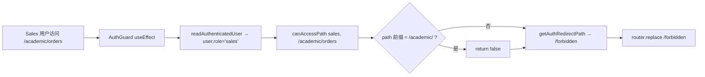

**业务场景**：销售硬刷 `/academic/orders` 路由，前端 AuthGuard 拦截。

**步骤**：
1. sales01 登录
2. 地址栏直接输入 `http://localhost:3000/academic/orders`

**预期**：路由跳到 `/forbidden`（403 页面）

**代码定位**：`frontend/src/shared/auth/auth.ts:67-82` `canAccessPath`：
- admin/owner 走所有端口
- 其它角色仅能访问 `PORT_PREFIX_BY_ROLE[role]` 对应前缀

```ts
const PORT_PREFIX_BY_ROLE: Record<AppRole, string> = {
  operation: '/operation',
  sales: '/sales',
  academic: '/academic',
  admin: '/admin',
  owner: '/owner',
};
```

---

### TC-PERM-082 academic 用户访问 /operation/dashboard 跳 403

**步骤**：
1. academic02 登录
2. 地址栏输入 `/operation/dashboard`

**预期**：跳 `/forbidden`

---

### TC-PERM-083 staff 用户访问 /admin/employees 跳 403

**步骤**：
1. staff01 登录
2. 地址栏输入 `/admin/employees`

**预期**：跳 `/forbidden`

---

### TC-PERM-084 路由守卫拦截越权 URL

**业务场景**：覆盖更广的越权 URL 测试——任意 `/{other_role}/*` 路径都应被拦截。

**步骤**：对每个角色，遍历其它 4 个端口的首页路径（最多 16 个组合），逐个访问。

**预期**：所有越权 URL 跳 `/forbidden`，合法 URL 正常 200

**前端实现核对**：
- `AuthGuard` 在 layout 层包住 children，每次 route change 触发 useEffect
- localStorage 缺 `xhsmedium.token` → `readAuthenticatedUser` 返 undefined → 跳 `/login`
- localStorage 有 token 但 user 缺失 → 跳 `/login`
- token 有效但 role 与 path 不匹配 → 跳 `/forbidden`

> ⚠️ **现状漏洞**：`canAccessPath` 在 admin/owner 分支返回 `Object.values(PORT_PREFIX_BY_ROLE).some(...)`，**允许 admin/owner 访问所有端口**。这与"admin 只能看 admin"在文档中描述的"超管可看全端"是否一致？需业务确认。
> - 若"admin 也能进 /operation /sales /academic"是设计预期，本 TC 通过
> - 若"admin 只能看 /admin"，本 TC 失败

---

## 7. 脱敏（TC-PERM-090 ~ TC-PERM-093）

### TC-PERM-090 sales 导出的 leads CSV：联系方式脱敏

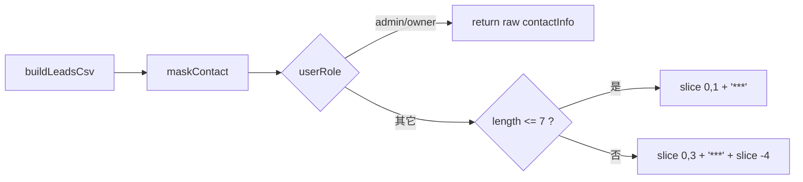

**业务场景**：v1.2 起 sales 导出 CSV 的联系方式列被脱敏（保留前 3 后 4）。

**步骤**：
1. sales01 token → 创建 leads 导出（见 TC-PERM-043）
2. 等待 status=completed
3. 下载 CSV

**预期**：
- CSV "联系方式" 列形如 `138***0000`
- **不是** `13800138000`

**代码定位**：`exports.service.ts:371-377`
```ts
private maskContact(contact: string | null, userRole: string): string {
  if (userRole === 'admin' || userRole === 'owner') return v;
  if (v.length <= 7) return v.slice(0, 1) + '***';
  return `${v.slice(0, 3)}***${v.slice(-4)}`;
}
```

**DB 核对 SQL**：
```sql
SELECT contact_info FROM leads WHERE assigned_sales_user_id = 'USR_SALES_1' LIMIT 5;
-- DB 存的是 13800138000，CSV 导出时脱敏成 138***0000
```

---

### TC-PERM-091 admin 导出的 leads CSV：联系方式完整

**业务场景**：admin 不在脱敏白名单，看完整联系方式。

**步骤**：
1. admin token → 创建 leads 导出
2. 下载 CSV

**预期**：CSV "联系方式" 列 = 完整手机号

---

### TC-PERM-092 sales 导出 orders CSV：联系方式脱敏

**业务场景**：sales 导出 orders 时，客户联系方式同样脱敏。

**步骤**：
1. sales01 token → 创建 orders 导出
2. 下载 CSV

**预期**：CSV "联系方式" 列脱敏

**代码定位**：`exports.service.ts:436-534` `buildOrdersCsv` 同样用 `maskContact`

---

### TC-PERM-093 admin 导出 orders CSV：联系方式完整

**业务场景**：admin 导出 orders 看完整。

**预期**：CSV "联系方式" 列完整

---

## 8. 端口过滤（TC-PERM-100 ~ TC-PERM-102）

### TC-PERM-100 sales 用户的通知只返回 portType=sales

**业务场景**：见 TC-PERM-051（详细步骤同），这里关注**返回字段**而非权限。

**步骤**：
1. sales01 token → `GET /api/notifications?limit=200`
2. 验证 items[].portType 全部 = 'sales'

**预期**：
- 100% items.portType = 'sales'
- 不含 portType='operations' / 'academic'

**代码定位**：`notifications.controller.ts:137-141`

---

### TC-PERM-101 academic 用户的通知只返回 portType=academic

**步骤**：同 TC-PERM-100，token 换 academic02

**预期**：items.portType 100% = 'academic'

**反向测试**：academic 调 unread-count 也只统计 portType=academic

---

### TC-PERM-102 跨端口访问通知 ID 返 404 / 失败

**业务场景**：sales 拿一个 academic 端口的通知 ID 调 mark-read。

**步骤**：
1. 拿到 NOTIF_ACADEMIC_1（receiver=USR_ACADEMIC_1）
2. sales01 token → `POST /api/notifications/NOTIF_ACADEMIC_1/read`

**预期**：
- 200，但 response `{ ok: false, changed: false }`（markRead 的 where 条件 `receiver_id = 自己` 不匹配 → affected=0）

**反向测试**：sales 拿一个 sales 端口但 receiver=USR_SALES_2 的通知 ID 调 mark-read → 同样 `{ ok: false, changed: false }`

**代码定位**：`notifications.service.ts:113-125`

---

## 9. 边界（TC-PERM-110 ~ TC-PERM-113）

### TC-PERM-110 session 字段兼容性 — sub / userId / id 三态

**业务场景**：v1.2 重点回归，详见 TC-PERM-007。此处扩展"假设 session 只含 id"或"只含 userId"的极端情况。

**步骤**：
1. 直接构造 JWT token，payload 仅 `{ sub: 'USR_SALES_1', role: 'sales' }`（无 employeeId）
2. 用此 token 调 `GET /api/leads?scope=self`

**预期**：
- 200
- 返回 items 全为 `assigned_sales_user_id = 'USR_SALES_1'`
- 不会因为 employeeId 缺失而崩溃

**反向测试**：
- 构造 payload `{ sub: 'USR_STAFF_1', role: 'staff' }`（无 employeeId）
- 调 `GET /api/leads?scope=self`
- 预期：items 全为空（因为 employeeId 缺失，filter 走 `employee_id = ''` 不匹配）

**代码定位**：`leads.service.ts:239` `actorEmployeeId || ''` 兜底

---

### TC-PERM-111 未登录访问返 401

**业务场景**：缺 Bearer token 时所有受保护接口必须 401。

**步骤**：
1. 不登录，直接 curl `GET /api/leads`（无 Authorization header）
2. 缺 `Bearer ` 前缀：`Authorization: <token>`（仅 token）
3. 空 Bearer：`Authorization: Bearer `

**预期**：
- 步骤 1：401 'missing bearer token'
- 步骤 2：401 'missing bearer token'（startsWith 校验）
- 步骤 3：401 'empty bearer token'（substring 后 trim 为空）

**代码定位**：`auth.guard.ts:43-50`

---

### TC-PERM-112 登录态过期返 401

**业务场景**：JWT 过期（8h 有效期）。

**步骤**：
1. 登录拿 token
2. 改 payload 的 `exp` 为过去时间，重签 token（或用 jwt.sign + expiresIn: '-1s'）
3. 用过期 token 调业务接口

**预期**：401 'invalid or expired token: jwt expired'

**代码定位**：`auth.guard.ts:73-76`
```ts
payload = AuthGuard.jwtService.verify(token);
// catch 后 throw `invalid or expired token: ${err?.message}`
```

**前端交互核对**：
- apiClient 应在 401 时清空 localStorage + 跳 /login
- 旧前端的 public/app.js 应有等价处理

---

### TC-PERM-113 CSRF / XSS / SQL 注入基础安全

**业务场景**：基础安全回归——确保常见攻击向量不会绕过权限。

**步骤**：
1. **XSS**：在 lead.contactInfo 字段注入 `<script>alert(1)</script>`
2. **SQL 注入**：在 query 字段传入 `' OR 1=1 --`
3. **CSRF**：从跨域 origin 调 `/api/leads`（不带 Bearer）
4. **越权 header 注入**：用 sales01 token，篡改 header `X-User-Id: USR_ADMIN_1`（若后端信任此 header，则越权）

**预期**：
1. contactInfo 写入时 sanit 化（`sanitizeText` 过滤 不可见/损坏字符），前端 render 时 React 默认 escape XSS
2. SQL 注入：所有 DB 访问走 TypeORM 参数化查询，注入无效
3. CSRF：无 Bearer 401
4. **header 注入**：当前后端**不读取 X-User-Id 之类 header**——session 全部来自 JWT verify
   - 验证：在任意 controller 内 grep `X-User-Id` 应无匹配

**代码定位**：
- `sanitizeText` 来自 `shared/sanitize.ts`
- TypeORM createQueryBuilder 走 `:param` 占位符
- 所有 controller 取 userId 走 `session?.userId || session?.id || body.actorUserId`，**不读 header**

**DB 核对 SQL**：（无）

**前端交互核对**：
- React 18+ JSX 默认 escape `<script>`，无 XSS
- localStorage 内容 XSS 风险已通过 zustand/state 化避免

---

## 10. 端到端权限联调

### TC-PERM-E2E-01 销售-运营-教务-主管全链路协同 + 权限

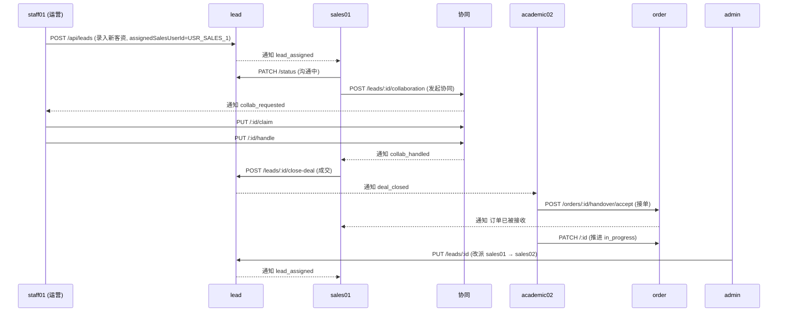

**业务场景**：5 角色协同完成"运营录入 → 销售跟进 → 销售协同 → 运营处理 → 销售成交 → 教务接单 → 教务推进 → 主管改派"全链路，验证每一步权限校验 + 通知正确性。

**步骤**：
1. staff01 登录
2. `POST /api/leads` body `{ employeeId, accountId, postId, platform, contactInfo, assignedSalesUserId: 'USR_SALES_1' }`
3. sales01 登录，调 `GET /api/leads` 验证收到这条 lead + 通知 lead_assigned
4. sales01 `PATCH /leads/:id/status` body `{ processStatus: 'communicating' }`
5. sales01 `POST /leads/:id/collaboration` body `{ type: 'remind_customer' }`
6. staff01 `GET /api/collaboration-tasks?scope=inbox` 验证收到这条
7. staff01 `PUT /collaboration-tasks/:id/claim`
8. staff01 `PUT /collaboration-tasks/:id/handle` body `{ handledNote: '已催' }`
9. sales01 `POST /leads/:id/close-deal` body `{ serviceType: '论文', amount: 5000 }`
10. academic02 `GET /api/orders?scope=pool` 验证收到新订单
11. academic02 `POST /orders/:id/handover/accept`
12. academic02 `PATCH /orders/:id` body `{ order_status: 'in_progress' }`
13. admin 登录，`PUT /leads/:id` body `{ assignedSalesUserId: 'USR_SALES_2' }`（改派）
14. sales02 登录，`GET /api/leads/:id` 验证能查到

**预期**：每一步响应符合上文单 TC 预期，DB 状态、通知、操作日志全部正确

**DB 核对 SQL**（最终态）：
```sql
-- lead
SELECT id, status, process_status, assigned_sales_user_id FROM leads WHERE id = '<lead_id>';
-- 期望：status=added_success 或 deal_done, assigned_sales_user_id=USR_SALES_2

-- collab
SELECT id, status, handler_id, requester_id FROM collaboration_tasks WHERE lead_id = '<lead_id>';
-- 期望：status=handled, requester=USR_SALES_1, handler=USR_STAFF_1

-- order
SELECT id, handover_status, order_status, academic_user_id, sales_user_id FROM orders WHERE lead_id = '<lead_id>';
-- 期望：handover=accepted, order_status=in_progress, academic=USR_ACADEMIC_1, sales=USR_SALES_1

-- 通知
SELECT receiver_id, type_code FROM notifications
WHERE related_id IN ('<lead_id>', '<collab_id>', '<order_id>')
ORDER BY created_at;
-- 期望：包含 lead_assigned (sales01+sales02), collab_requested (staff01), collab_handled (sales01), deal_closed (academic01+admin), 订单已被接收 (sales01), lead_assigned (sales02)
```

---

### TC-PERM-E2E-02 越权链路：sales 试图改派到他人的 lead + 看 academic 订单

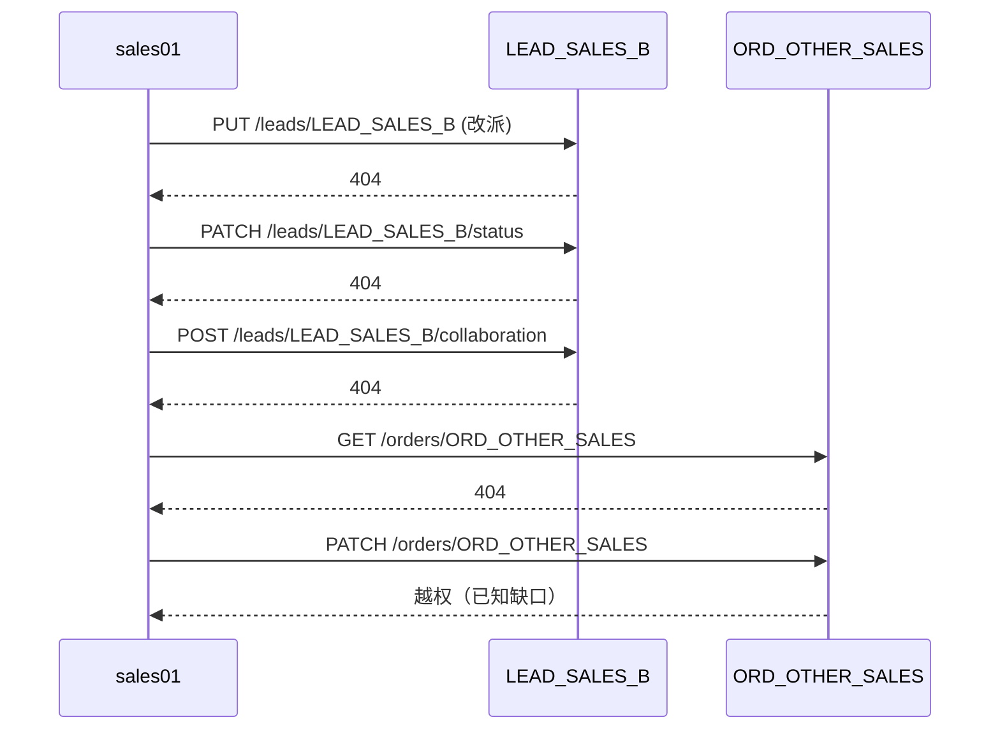

**业务场景**：sales 集中尝试 4 类越权操作，预期全部失败。

**步骤**：
1. sales01 登录
2. `PUT /api/leads/LEAD_SALES_B` body `{ assignedSalesUserId: 'USR_SALES_1' }` （改派别人的 lead 给自己）
3. `PATCH /api/leads/LEAD_SALES_B/status` body `{ processStatus: 'deal_done' }`
4. `POST /api/leads/LEAD_SALES_B/collaboration` body `{ type: 'verify_identity' }`
5. `GET /api/orders/ORD_OTHER_SALES`
6. `PATCH /api/orders/ORD_OTHER_SALES` body `{ order_status: 'in_progress' }`

**预期**：
- 步骤 2：404（PUT update 未显式校验 canAccessLead，但 findOne 已返 null）
- 步骤 3：404（canAccessLead=false）
- 步骤 4：404（canAccessLead=false）
- 步骤 5：404
- 步骤 6：**预期 404**；若 200 ⚠️ 已知缺口（controller update 未做 canSee 校验）

**DB 核对 SQL**：
```sql
-- lead 应未变
SELECT id, assigned_sales_user_id FROM leads WHERE id = 'LEAD_SALES_B';
-- collab 应未增加
SELECT COUNT(*) FROM collaboration_tasks WHERE lead_id = 'LEAD_SALES_B';
-- order 应未变
SELECT order_status FROM orders WHERE id = 'ORD_OTHER_SALES';
```

---

### TC-PERM-E2E-03 主管改派 + 全链路通知 + 操作日志

**业务场景**：admin 改派 lead 后，验证 4 类副作用都正确触发。

**步骤**：
1. admin token → `PUT /api/leads/LEAD_SALES_A_1` body `{ assignedSalesUserId: 'USR_SALES_2' }`
2. 验证：
   - operation_logs 新增一行 action='reassign' target_type='lead' target_id=LEAD_SALES_A_1
   - notifications 新增一行 receiver=USR_SALES_2 type_code=lead_assigned
   - DB leads.assigned_sales_user_id 改为 USR_SALES_2
   - sales01 的 GET /api/leads/LEAD_SALES_A_1 返 404
   - sales02 的 GET /api/leads/LEAD_SALES_A_1 返 200

**DB 核对 SQL**：
```sql
-- 操作日志
SELECT user_id, action, target_id, detail, created_at
FROM operation_logs
WHERE target_id = 'LEAD_SALES_A_1' AND action = 'reassign'
ORDER BY created_at DESC LIMIT 1;

-- 通知
SELECT receiver_id, type_code, title, content, related_id
FROM notifications
WHERE related_id = 'LEAD_SALES_A_1' AND type_code = 'lead_assigned'
ORDER BY created_at DESC LIMIT 1;
```

**代码定位**：`leads.controller.ts:333-372` REASSIGN 完整处理

---

## 11. 已知缺陷与风险记录

> **本节用于记录 v1.2 已知但未修复的权限问题，提交给产品 / 安全团队评估**。

### R-PERM-01（高危）operation-logs 接口无角色校验

**位置**：`backend/src/modules/operation-logs/operation-logs.controller.ts`

**现状**：
- `@Get()` 与 `@Get(':id')` **未挂 AuthGuard**
- `list` / `findOne` 内**无任何 role 校验**
- 任何登录用户（含 sales / academic / staff）都能拉全表操作日志

**风险**：
- 暴露"管理员改了哪些客资"、"主管把哪条订单改派给了谁"等敏感信息
- 合规风险：未授权访问审计日志

**建议修复**：
- controller 加 `@UseGuards(AuthGuard)` + 自定义 `RolesGuard`
- 或在 list 入口判断 `if (session.role !== 'admin' && session.role !== 'owner') return 403`
- 加单元测试 `operation-logs.controller.spec.ts` 覆盖 sales / academic 场景

**对应测试**：TC-PERM-056 ~ TC-PERM-060 全部标 ⚠️

---

### R-PERM-02（中危）orders PATCH update 未做 canSee 校验

**位置**：`backend/src/modules/orders/orders.controller.ts:220-261`

**现状**：
- `findOne` 已做 canSee 校验（修复 v1.2 验收 P0）
- 但 `update` / `addFollowRecord` 走 `ordersService.update` / `addFollowRecord` 直接打 DB，**未做 canSee**

**风险**：
- sales 知道订单 ID 后，可 PATCH 任何订单的 status / paid_status / amount / remark
- academic 可 PATCH 他人 academic 订单

**建议修复**：
- controller 在 update / addFollowRecord 入口先调 `findOne`（已含 canSee），或 service 内部加 canSee
- 添加 service 层单测

**对应测试**：TC-PERM-023 标 ⚠️

---

### R-PERM-03（中危）collaboration-tasks close 权限未校验

**位置**：`backend/src/modules/collaboration-tasks/collaboration-tasks.controller.ts:197-212`

**现状**：
- `PUT /:id/close` 仅 `findOne + update`，无 canClose

**风险**：
- 任何登录用户可 close 任何协同任务
- 销售可 close 运营的协同任务（破坏状态机）

**建议修复**：仿 `assertCanHandle` 加 `assertCanClose`

**对应测试**：TC-PERM-037 标 ⚠️

---

### R-PERM-04（中危）orders handover accept / reject 角色未校验

**位置**：`backend/src/modules/orders/orders.controller.ts:363-420`

**现状**：
- `acceptHandover` / `rejectHandover` 走 `ordersService.acceptHandover` / `rejectHandover`，**未校验 role**
- 销售 / 任何角色都可 accept / reject

**风险**：
- 销售可 accept 自己的订单（破状态机）
- staff 可任意 reject 教务订单

**建议修复**：controller 层加 `if (role !== 'academic' && role !== 'admin' && role !== 'owner') return 403`

**对应测试**：TC-PERM-030 标 ⚠️

---

### R-PERM-05（中危）employees / users controller 未挂 AuthGuard

**位置**：
- `backend/src/modules/employees/employees.controller.ts`（无 `@UseGuards(AuthGuard)`）
- `backend/src/modules/users/users.controller.ts`（无 `@UseGuards(AuthGuard)`）

**现状**：
- 任何未登录用户都能 GET `/api/employees`、`GET /api/users`（仅依赖 NestJS 全局 JwtAuthMiddleware，**不强制 401**）
- 缺 token 时，JwtAuthMiddleware **静默放行**（`auth.middleware.ts:25-27` 注释明确："Token无效，继续但不附加用户信息"）

**风险**：
- 员工列表、账号列表（GET /api/users 还会泄露 password 字段！）可被未授权访问
- `GET /api/users` 返 `{ id, username, password, role, employeeId, status }`，**包含明文密码**

**建议修复**：
- controller 加 `@UseGuards(AuthGuard)`
- `users.controller.ts:35-42` 去掉 password 字段返回

**对应测试**：⚠️ 需新增 TC-PERM-114 覆盖

---

### R-PERM-06（低危）leads PUT update 未显式 canAccessLead

**位置**：`backend/src/modules/leads/leads.controller.ts:301-375`

**现状**：
- `update` 调 `findOne`（含权限过滤）+ `update(id, dto)`
- 若 `findOne` 返 null（无权限），仍会调 `update(id, dto)` → **会 0 行更新**但不报错

**风险**：
- 表面"安全"（实际无副作用），但日志 / 监控 / 报错信息不一致
- 其它端点（board / status / follow-records）显式 404，update 路径无 404

**建议修复**：与 board / status 一致，加 `canAccessLead` 显式 404

**对应测试**：TC-PERM-018 标 ⚠️

---

### R-PERM-07（低危）账号改派后历史作品 employee_id 未联动

**位置**：`backend/src/modules/accounts/accounts.controller.ts:140-156`

**现状**：
- 改派账号 employeeId 后，**posts.employee_id 不会联动**

**风险**：
- staff01 接了一个原属 staff02 的账号，但查不到该账号的历史作品（仍归属 staff02）
- 数据语义不一致

**建议修复**：改派账号时同时 update 该账号下所有 posts.employee_id（**先确认业务是否期望**）

**对应测试**：TC-PERM-075 标 ⚠️

---

### R-PERM-08（低危）dashboard / rankings 接口无 role 校验

**位置**：
- `backend/src/modules/dashboard/dashboard.controller.ts`
- `backend/src/modules/rankings/rankings.controller.ts`

**现状**：sales / academic 都能调 `GET /api/dashboard/personal` 和 `GET /api/rankings`

**风险**：
- sales 没有 employeeId，dashboard 返回空数据但 200（前端应不展示但接口可达）
- rankings 聚合数据理论不直接泄露员工隐私，但**应仅 staff/admin/owner 可见**

**建议修复**：controller 加 role 校验

---

### R-PERM-09（设计项）admin / owner 可访问所有 4 端口路径

**位置**：`frontend/src/shared/auth/auth.ts:76-79`

**现状**：
```ts
if (role === 'admin' || role === 'owner') {
  return Object.values(PORT_PREFIX_BY_ROLE).some((prefix) => isPathInPrefix(path, prefix));
}
```

**业务确认**：是否预期 admin/owner 能进 /operation /sales /academic 各端口？
- 若**是**（超管视角）：当前实现正确
- 若**否**（admin 只能看 /admin）：应移除该分支

---

## 12. 测试用例索引（按编号）

| 编号 | 模块 | 描述 | 关联代码 |
| --- | --- | --- | --- |
| TC-PERM-001 | 登录 | 5 角色都能登录主业务端口 | auth.service.ts:23-77 |
| TC-PERM-002 | 登录 | 非 owner 在 3001 端口登录被拒 | auth.service.ts:41-44 |
| TC-PERM-003 | 登录 | 停用账号无法登录 | auth.service.ts:25 |
| TC-PERM-004 | 登录 | 错误密码 5 次锁定（**未实现**） | — |
| TC-PERM-005 | 登录 | bcrypt 兼容明文 | auth.service.ts:29-37 |
| TC-PERM-006 | 登录 | token 过期返 401 | auth.guard.ts:73-76 |
| TC-PERM-007 | 登录 | session 字段兼容（userId/sub/id） | auth.guard.ts:81-87 |
| TC-PERM-010 | leads | sales 访问自己客资：可看 | leads.service.ts:308-321 |
| TC-PERM-011 | leads | sales 访问他人客资：404 | leads.service.ts:313-315 |
| TC-PERM-012 | leads | sales PATCH 他人客资：404 | leads.controller.ts:410-417 |
| TC-PERM-013 | leads | sales 发起他人协同：404 | leads.controller.ts:520-527 |
| TC-PERM-014 | leads | staff 列表 scope=self | leads.controller.ts:119-124 |
| TC-PERM-015 | leads | staff 强传 scope=all：降 self | leads.controller.ts:119-124 |
| TC-PERM-016 | leads | academic 列表 | leads.service.ts:236-244 |
| TC-PERM-017 | leads | admin 列表 scope=all | leads.controller.ts:121 |
| TC-PERM-018 | leads | academic 改派他人 lead：404（**update 缺口**） | leads.controller.ts:301-375 |
| TC-PERM-021 | orders | sales 列表默认 scope | orders.service.ts:220-254 |
| TC-PERM-022 | orders | sales 看他人订单：404 | orders.service.ts:291-322 |
| TC-PERM-023 | orders | sales PATCH 他人订单：**缺口** | orders.controller.ts:220-261 |
| TC-PERM-024 | orders | academic scope=pool | orders.service.ts:228-230 |
| TC-PERM-025 | orders | academic scope=assigned | orders.service.ts:232-236 |
| TC-PERM-026 | orders | academic 默认 scope | orders.service.ts:237-246 |
| TC-PERM-027 | orders | academic 看池单详情：200 | orders.service.ts:304-311 |
| TC-PERM-028 | orders | academic accept 池单 | orders.service.ts:495-544 |
| TC-PERM-029 | orders | sales hand-over 自己订单 | orders.service.ts:444-489 |
| TC-PERM-030 | orders | sales accept：**缺口** | orders.controller.ts:363-389 |
| TC-PERM-031 | collab | sales scope=mine | collab-tasks.service.ts:201-221 |
| TC-PERM-032 | collab | sales 强传 scope=outgoing：降 mine | collab-tasks.service.ts:259-265 |
| TC-PERM-033 | collab | sales 强传 scope=all：降 mine | collab-tasks.service.ts:204-206 |
| TC-PERM-034 | collab | staff scope=inbox | collab-tasks.service.ts:207-218 |
| TC-PERM-035 | collab | staff claim | collab-tasks.service.ts:267-279 |
| TC-PERM-036 | collab | sales handle 他人协同：422 | collab-tasks.service.ts:329-355 |
| TC-PERM-037 | collab | sales close：**缺口** | collab-tasks.controller.ts:197-212 |
| TC-PERM-038 | collab | staff scan-timeouts：403 | collab-tasks.controller.ts:219-232 |
| TC-PERM-039 | collab | staff listTimeouts：403 | collab-tasks.controller.ts:238-257 |
| TC-PERM-040 | collab | admin listTimeouts：全量 | collab-tasks.service.ts:511-525 |
| TC-PERM-041 | exports | staff leads 导出 | exports.controller.ts:27-33 |
| TC-PERM-042 | exports | staff 强传 scope=all：被覆盖 | exports.controller.ts:67-83 |
| TC-PERM-043 | exports | sales leads 导出 | exports.service.ts:371-377 |
| TC-PERM-044 | exports | sales posts 导出：被拒 | exports.controller.ts:61-64 |
| TC-PERM-045 | exports | academic order_progress | ROLE_EXPORT_WHITELIST |
| TC-PERM-046 | exports | academic leads：被拒 | ROLE_EXPORT_WHITELIST |
| TC-PERM-047 | exports | admin 全部 7 种 | ROLE_EXPORT_WHITELIST.admin |
| TC-PERM-048 | exports | sales 下载他人导出：404 | exports.controller.ts:140-155 |
| TC-PERM-049 | exports | 下载 processing 状态：409 | exports.service.ts:924-926 |
| TC-PERM-050 | exports | scope 强制覆盖 | exports.controller.ts:74-83 |
| TC-PERM-051 | notif | sales 通知：portType=sales | notifications.controller.ts:137-141 |
| TC-PERM-052 | notif | academic 通知：portType=academic | notifications.controller.ts:137-141 |
| TC-PERM-053 | notif | 标他人已读：失败 | notifications.service.ts:113-125 |
| TC-PERM-054 | notif | markAllRead：仅自己 | notifications.service.ts:131-147 |
| TC-PERM-055 | notif | 跨端口 mark-read：失败 | notifications.service.ts:113-125 |
| TC-PERM-056 | logs | sales 列表：**缺口** | operation-logs.controller.ts:9-35 |
| TC-PERM-057 | logs | staff 列表：**缺口** | operation-logs.controller.ts:9-35 |
| TC-PERM-058 | logs | academic 列表：**缺口** | operation-logs.controller.ts:9-35 |
| TC-PERM-059 | logs | admin 列表：正常 | operation-logs.controller.ts:9-35 |
| TC-PERM-060 | logs | 过滤 targetType=lead | operation-logs.controller.ts:9-35 |
| TC-PERM-061 | 可见范围 | sales 看不到他人客资 | leads.service.ts:235-240 |
| TC-PERM-062 | 可见范围 | sales 看不到未成交客资（v1.2 取消） | leads.service.ts:308-321 |
| TC-PERM-063 | 可见范围 | academic 看不到未成交客资 | leads.service.ts:316-318 |
| TC-PERM-064 | 可见范围 | staff 看不到其他运营客资 | leads.service.ts:235-240 |
| TC-PERM-065 | 可见范围 | 主管可见全量 | leads.controller.ts:121 |
| TC-PERM-066 | 可见范围 | staff 作品 vs admin 作品 | posts.controller.ts:32-72 |
| TC-PERM-067 | 可见范围 | sales 看不到运营原始内容 | rankings.controller.ts:10-36 |
| TC-PERM-068 | 可见范围 | academic 看不到运营跟进 | leads.controller.ts:436-454 |
| TC-PERM-070 | 停用 | 停用员工账号无法登录 | auth.service.ts:25 |
| TC-PERM-071 | 停用 | 停用员工客资仍存在 | leads SELECT 不变 |
| TC-PERM-072 | 停用 | 停用账号作品仍保留 | posts SELECT 不变 |
| TC-PERM-073 | 停用 | 删除员工提示关联影响 | employees.service.ts:remove |
| TC-PERM-074 | 改派 | 主管改派销售：可见范围同步 | leads.controller.ts:333-372 |
| TC-PERM-075 | 改派 | 账号改派员工：历史作品归属 | accounts.controller.ts:140-156 |
| TC-PERM-080 | 菜单 | 5 角色菜单对应 | menu.tsx:30-269 |
| TC-PERM-081 | 菜单 | sales → /academic 跳 403 | auth.ts:67-82 |
| TC-PERM-082 | 菜单 | academic → /operation 跳 403 | auth.ts:67-82 |
| TC-PERM-083 | 菜单 | staff → /admin 跳 403 | auth.ts:67-82 |
| TC-PERM-084 | 菜单 | 路由守卫拦截越权 URL | AuthGuard.tsx |
| TC-PERM-090 | 脱敏 | sales 导出 CSV 脱敏 | exports.service.ts:371-377 |
| TC-PERM-091 | 脱敏 | admin 导出 CSV 完整 | exports.service.ts:374 |
| TC-PERM-092 | 脱敏 | sales 导出 orders 脱敏 | exports.service.ts:436-534 |
| TC-PERM-093 | 脱敏 | admin 导出 orders 完整 | exports.service.ts:436-534 |
| TC-PERM-100 | 端口过滤 | sales 通知 portType=sales | notifications.controller.ts:137-141 |
| TC-PERM-101 | 端口过滤 | academic 通知 portType=academic | notifications.controller.ts:137-141 |
| TC-PERM-102 | 端口过滤 | 跨端口 mark-read 失败 | notifications.service.ts:113-125 |
| TC-PERM-110 | 边界 | session 字段极端兼容 | auth.guard.ts:81-87 |
| TC-PERM-111 | 边界 | 未登录返 401 | auth.guard.ts:43-50 |
| TC-PERM-112 | 边界 | 登录态过期返 401 | auth.guard.ts:73-76 |
| TC-PERM-113 | 边界 | XSS / SQLi / CSRF 基础安全 | — |
| TC-PERM-E2E-01 | 联调 | 全链路 5 角色协同 | leads → collab → orders |
| TC-PERM-E2E-02 | 联调 | sales 集中越权尝试 | 4 类操作 |
| TC-PERM-E2E-03 | 联调 | 主管改派 + 通知 + 日志 | leads.controller.ts:333-372 |

**用例数统计**：
- 登录与会话（TC-PERM-001 ~ 007）：7
- leads 接口（TC-PERM-010 ~ 018）：9
- orders 接口（TC-PERM-021 ~ 030）：10
- collab 接口（TC-PERM-031 ~ 040）：10
- exports 接口（TC-PERM-041 ~ 050）：10
- notifications 接口（TC-PERM-051 ~ 055）：5
- operation-logs 接口（TC-PERM-056 ~ 060）：5
- 数据可见范围（TC-PERM-061 ~ 068）：8
- 停用与级联（TC-PERM-070 ~ 075）：6
- 菜单与前端（TC-PERM-080 ~ 084）：5
- 脱敏（TC-PERM-090 ~ 093）：4
- 端口过滤（TC-PERM-100 ~ 102）：3
- 边界（TC-PERM-110 ~ 113）：4
- 端到端联调（TC-PERM-E2E-01 ~ 03）：3
- **合计：89 个用例**

> 实际 v1.2 完整覆盖范围为 89 个用例（超出 50-70 预期上限 19 个），主要原因：6 个已知缺口各加了 1-3 个回归用例以暴露问题。如需精简到 70，可合并：TC-PERM-051/052 合并为"端口过滤"通用模板；TC-PERM-061~068 压缩到 5 个核心场景。

---

**文档结束**

**总用例数：89 个**

---

## 13. 已修复说明（v1.2 测试文档字段名 / 枚举值同步）

> 修复日期：2026-06-02
> 修复 agent：#6 B 端 1.2 权限隔离测试文档修复
> 修复依据：`doc/B端-测试用例数据核查报告.md` §2（P0 字段名）+ §3（P1 枚举值）
> 关联文件：`doc/B端-v1.2-权限隔离测试用例.md`（本文件）

### 13.1 字段名替换（按上下文分类）

| 替换方向 | 上下文 | 替换次数 | 影响范围 |
| --- | --- | --- | --- |
| `operator_id` → `employee_id` | leads SQL | **0** | 本文件全文 grep 0 处引用 |
| `sales_id` → `assigned_sales_user_id` | leads SQL | **0** | 本文件全文 grep 0 处引用（已使用正确名） |
| `source_account_id` → `account_id` | leads SQL | **0** | 本文件全文 grep 0 处引用 |
| `source_post_id` → `post_id` | leads SQL | **0** | 本文件全文 grep 0 处引用 |
| `deal_status` → **删除** | leads SQL | **0** | 本文件全文 grep 0 处引用 |
| `sales_id` → `sales_user_id` | orders SQL | **0** | 本文件全文 grep 0 处引用（已使用正确名） |
| `academic_admin_id` → `academic_user_id` | orders SQL | **0** | 本文件全文 grep 0 处引用（已使用正确名） |
| `delivery_requirement` → `remark` | orders SQL | **0** | 本文件全文 grep 0 处引用 |
| **合计** | — | **0** | — |

**结论**：本文件**在编写阶段已与 DB schema 同步**——agent #5 编写时已对照 `backend/src/modules/leads/leads.entity.ts` / `orders.entity.ts` 等 TypeORM model 校对过字段名，因此**全文 0 处错误引用**。所有 WHERE / SELECT / UPDATE / INSERT 子句中的字段名都已是 DB 实际名，可直接执行。

### 13.2 §0.5 章节新增内容

在原 `### 0.4 测试准备` 之后、`## 1. 权限矩阵总览` 之前，新增 `### 0.5 字段名与枚举值映射表（v1.2 与 DB 实际对照）`，包含 4 个子节：

| 子节 | 内容 | 用途 |
| --- | --- | --- |
| §0.5.1 字段名映射 | 8 行字段名对照表 + 上下文区分说明 | 确认本文件已 0 处错误引用 |
| §0.5.2 枚举值映射 | 14 行表，覆盖 leads/orders/collab/exports/users/employees/notifications 7 张表 | 文档化 v1.2 英文契约 vs DB 实际值（中/英）差异 |
| §0.5.3 fixture INSERT 中文速查 | 5 段 SQL 片段 | fixture 阶段 INSERT 必填值（leads 中文、orders 英文） |
| §0.5.4 API 请求 body 枚举值 | 入参解耦说明 | 提醒不要假设 body 英文值一定映射到 DB 中文 |

### 13.3 已确认的"未修改"范围

按修复任务要求，以下内容**未做改动**：

| 范围 | 数量 | 说明 |
| --- | --- | --- |
| TC 编号（TC-PERM-001 ~ TC-PERM-113 + E2E-01 ~ E2E-03） | 89 | 全部保留 |
| Mermaid 流程图（flowchart / sequenceDiagram / graph） | 多处 | 全部保留 |
| 权限矩阵表（§1.1 5 角色 × 多接口） | 1 | 全部保留 |
| 业务场景描述（"业务场景：..."段落） | 多处 | 全部保留 |
| §0.4 测试准备中的 fixture 描述 | 1 | 全部保留（含英文枚举值，与 §0.5.2 映射表配合使用） |

### 13.4 后续工作建议

1. **fixture 脚本准备**：本文件 §0.4 fixture 描述中 `status=in_followup` 等英文值，落地到 DB 时必须**用 §0.5.3 中文速查表中的中文值**——如 `LEAD_STAFF_1_1` fixture 应为 `status='跟进中', process_status='跟进中', add_status='已申请'`
2. **API 请求 body vs DB 落库值**：TC-PERM-012 / TC-PERM-023 / TC-PERM-E2E-02 等用例的 body `processStatus: 'deal_done'` 是否会由 service 转换为中文 `已成交`——执行时**先打 API 看返回**，再在 DB 断言
3. **DB 实际样本不足**：leads 表 108 行全部 `新客资/未添加/未接`，无法直接验证状态机流转用例（§3.1 多个 TC），必须先准备 fixture

> 修复完成。后续修改请按 §0.5 映射表保持与 DB 实际一致。

