# B 端 v1.2 状态机与协同任务测试用例

> 编写日期：2026-06-02  
> 编写人：B 端 1.2 测试 agent #2（状态机 & 协同任务）  
> 范围：客资状态机（含 V1 中文兼容 / 并发乐观锁 / close-deal 事务回滚）、订单状态机（order_status × paid_status × handover_status 三维度，重点 v1.2 新增的 handover 4 路由）、协同任务状态机（含 v1.2 新增 timeout 扫描器 + scope 越权修复）  
> 依据：`doc/v1.2-完整交付版-AB端任务分配.md` §11.1、`backend/src/modules/orders/orders.service.ts`、`backend/src/modules/collaboration-tasks/collaboration-tasks.service.ts`、`backend/src/modules/leads/leads.service.ts`  
> 测试账号：见 §0.8，密码统一 `test123`  
> 后端端口：8089（NestJS），前端端口：3302

---

## 0. 术语与口径约定

### 0.1 角色与端口（B 端 1.2）

| 角色 | 入口端口 | 前端入口 | 1.2 关注的能力 |
| --- | --- | --- | --- |
| `admin` | 3000 | `/admin/*` | 主管看板、强制改 handover_status、看全表协同 |
| `owner` | 3001 | 总后台 | 同 admin |
| `staff` | 3000 | `/operation/*` | 运营：协同 inbox、超时认领 |
| `sales` | 3000 | `/sales/*` | 销售：成交 → close-deal 触发自动建单 + handover |
| `academic` | 3000 | `/academic/*` | 教务：池单认领 / accept / reject |

### 0.2 客资主状态（`leads.status`，VARCHAR(32)）

| code | 中文 | 触发途径 |
| --- | --- | --- |
| `new` | 新客资 | `POST /api/leads` 未带 `assignedSalesUserId` |
| `assigned` | 已分配 | `POST /api/leads` 带 `assignedSalesUserId` |
| `in_followup` | 跟进中 | `updateBoard` 任意动作信号（hasFollowSignal） |
| `in_collaboration` | 协同中 | 发起协同 / `processStatus=in_collaboration` |
| `operation_handled` | 运营已处理 | 运营 handle 协同成功 |
| `added_success` | 已添加通过 | `addStatus=added` |
| `invalid` | 无效 | `processStatus=invalid` 或 `addStatus=rejected/not_passed` |
| `deal_done` | 已成交 | `close-deal` 成功后（实际写 `deal_closed` 字符串，见 TC-SM-008） |

### 0.3 添加状态（`leads.add_status`）

V2 codes: `not_added / applied / not_passed / operation_reminded / added`  
V1 兼容: `rejected` 自动 map 到 `not_passed`

### 0.4 处理状态（`leads.process_status`）

V2 codes: `not_contacted / waiting_pass / communicating / quoted / deal_pending / deal_done / invalid`  
兼容 alias: `applied` → `waiting_pass`、`pending` → `not_contacted`、`rejected` → `invalid`

### 0.5 订单状态（order / paid / handover 三维）

| 维度 | 列 | 取值 | 1.2 新增 |
| --- | --- | --- | --- |
| `order_status` | `orders.order_status` ENUM | `to_receive / in_progress / awaiting_client_info / awaiting_teacher / to_deliver / completed / abnormal` | – |
| `paid_status` | `orders.paid_status` ENUM | `unpaid / partial / paid` | – |
| `handover_status` | `orders.handover_status` VARCHAR(16) | `pending / handed_over / accepted / rejected` | **v1.2 新增** |

### 0.6 协同任务状态（`collaboration_tasks.status`）ENUM

`pending / handling / handled / closed / timeout`（`timeout` v1.2 新增）

### 0.7 协同任务类型（`collaboration_tasks.type`）ENUM

`remind_customer / supplement_info / verify_identity / second_touch`  
V1 alias: `confirm_identity` → `verify_identity`、`second_contact` → `second_touch`

### 0.8 测试准备

```text
数据库：lan_dual_role_system（utf8mb4），后端连接见 backend/.env

测试账号（按 doc/add-test-users.sql + 1.2 增量）：
- 销售甲：users.username=sales01, role=sales,        id=USR_SALES_01
- 销售乙：users.username=sales02, role=sales,        id=USR_SALES_02
- 运营丙：users.username=staff_c,  role=staff, employee_id=EMP_OPS_C, id=USR_OPS_C
- 教务甲：users.username=academic02, role=academic,  id=USR_ACA_02
- 教务乙：users.username=academic03, role=academic,  id=USR_ACA_03
- 主管丁：users.username=youlun,    role=admin,      id=USR_ADMIN_D

基础数据：
- accounts.id = ACC_OPS_C_1（platform=小红书）
- posts.id    = POST_OPS_C_1（accountId=ACC_OPS_C_1, postType=获客贴）
- 一条销售甲名下的客资：
  leads.id = LEAD_SALES_01_1（assigned_sales_user_id=USR_SALES_01, status=in_followup, add_status=not_added, process_status=communicating）
- 一条 v1 中文兼容老数据：
  leads.id = LEAD_V1_CN_1（status=跟进中, add_status=已申请添加, process_status=沟通中）
- 一条已成交订单：
  orders.id = ORDER_DEAL_1（sales_user_id=USR_SALES_01, lead_id=LEAD_SALES_01_1, order_status=in_progress, paid_status=partial, handover_status=accepted）
- 5 条已发的协同任务（覆盖 5 种状态）：
  COLLAB_PENDING_1 / COLLAB_HANDLING_1 / COLLAB_HANDLED_1 / COLLAB_CLOSED_1 / COLLAB_TIMEOUT_1
```

### 0.9 字段名映射（v1.2 文档 → DB 实际）

> 本文件基于 v1.2 文档 §10 字段契约撰写，但 DB schema 沿用 V1 旧契约。
> 凡 SQL 中的字段名需按本表对照。状态机用例（TC-SM-001 ~ TC-SM-060）涉及 leads / orders / collaboration_tasks / notifications / operation_logs 共 5 张表。

| 测试用例中字段（v1.2 spec） | DB 实际字段 | 适用范围 |
| --- | --- | --- |
| `leads.operator_id` | `leads.employee_id` | 来源运营（员工表 id） |
| `leads.sales_id` | `leads.assigned_sales_user_id` | 归属销售（users.id） |
| `leads.source_account_id` | `leads.account_id` | 来源账号 |
| `leads.source_post_id` | `leads.post_id` | 来源作品 |
| `leads.deal_status` | （不存在） | 删除相关断言（leads 主状态由 `status` 承担） |
| `orders.sales_id` | `orders.sales_user_id` | 归属销售 |
| `orders.academic_admin_id` | `orders.academic_user_id` | 当前教务（可空） |
| `orders.delivery_requirement` | `orders.remark` | 交付要求 / 备注 |

**核查结果**：本文件出现上述错误字段名的次数 = **0**，无需修复。
- 本文件所有 `leads` 关联均已使用 `employee_id` / `assigned_sales_user_id`
- 本文件所有 `orders` 关联均已使用 `sales_user_id` / `academic_user_id`
- 本文件所有"交付要求 / 备注"SQL 已使用 `remark`（见 TC-SM-004 `remark='并发订单注入冲突'`、TC-SM-026 `remark='改派给乙'`）

### 0.10 枚举值映射（v1.2 文档 → DB 实际）

> 本文件状态机用例中出现的英文枚举值（如 `in_followup` / `in_collaboration` / `handed_over` / `timeout` 等）**为 v1.2 spec 业务契约**（也是后端业务代码写入 DB 时的字面量），仅出现在「§0.11 状态机总览 Mermaid stateDiagram」「TC 内 Mermaid flowchart / sequenceDiagram」「前置数据」「步骤 body 描述」「DB 核对 SQL 注释」中，**不进入 `WHERE` / `UPDATE` 条件或断言右侧值**，按核查报告 §3 与本文件处理原则**不修改**（属业务描述字段而非 SQL 字段名错误）。

#### 0.10.1 客资主状态机 `leads.status`（8 状态）

| v1.2 spec 英文 | DB 实际（V1 中文） | 触发 |
| --- | --- | --- |
| `new` | `新客资` | 初始 / 未带 `assignedSalesUserId` |
| `assigned` | `已分配` | 主管改派 / 带 `assignedSalesUserId` |
| `in_followup` | `跟进中` | 销售首次动作信号 |
| `in_collaboration` | `协同中` | 发起协同 |
| `operation_handled` | `运营已处理` | 运营 handle 协同成功 |
| `added_success` | `已添加通过` | `addStatus=added` |
| `invalid` | `无效` | `processStatus=invalid` 或 `addStatus=rejected/not_passed` |
| `deal_done` / `deal_closed` | `已成交` | close-deal 落库值（实际写 `deal_closed`） |

#### 0.10.2 客资 `add_status` × `process_status`（add: 6 / process: 7）

**`leads.add_status`**

| v1.2 spec 英文 | DB 实际（V1 中文） | 备注 |
| --- | --- | --- |
| `not_added` | `未添加` | 初始 |
| `applied` | `已申请添加` | V1 兼容 `已申请` |
| `not_passed` | `未通过` | V1 alias `rejected` |
| `operation_reminded` | `运营已提醒` | 运营 handle 后 |
| `added` | `已添加` | 客户添加成功 |
| `rejected` | `未通过` | V1 alias → V2 `not_passed` |

**`leads.process_status`**

| v1.2 spec 英文 | DB 实际（V1 中文） | 备注 |
| --- | --- | --- |
| `not_contacted` | `未接` | 初始（V1 alias `pending`） |
| `waiting_pass` | `待通过` | V1 alias `applied` |
| `communicating` | `沟通中` | – |
| `quoted` | `已报价` | – |
| `deal_pending` | `待成交` | – |
| `deal_done` | `已成交` | V1 alias `deal_closed`（见 TC-SM-008） |
| `invalid` | `已拒绝` | V1 alias `rejected` |

#### 0.10.3 订单状态机 `orders.order_status` × `paid_status` × `handover_status`（三维度）

| 维度 | 字段 | ENUM/VARCHAR | v1.2 spec 英文 | 中文标签 | v1.2 新增 |
| --- | --- | --- | --- | --- | --- |
| order | `orders.order_status` | ENUM(7) | `to_receive` / `in_progress` / `awaiting_client_info` / `awaiting_teacher` / `to_deliver` / `completed` / `abnormal` | 待接收 / 履约中 / 待客户资料 / 待教师 / 待交付 / 已完成 / 异常 | – |
| paid | `orders.paid_status` | ENUM(3) | `unpaid` / `partial` / `paid` | 未付费 / 部分付费 / 已付费 | – |
| handover | `orders.handover_status` | VARCHAR(16) | `pending` / `handed_over` / `accepted` / `rejected` | 待交接 / 已交接 / 已接单 / 已拒收 | **v1.2 新增** |

**核查结果**：订单 3 维状态机的英文枚举值与 DB ENUM / VARCHAR **完全一致**（核查报告 §3.5 / §7），无需修复。本文件 TC-SM-016 ~ TC-SM-035 中 SQL 注释的 `order_status='to_receive'` / `paid_status='unpaid'` / `handover_status='handed_over'` 等字面量与 DB 实际 ENUM 字符串一一对应。

#### 0.10.4 协同任务状态机 `collaboration_tasks.status`（5 状态，含 v1.2 新增 timeout）

| 英文 | 中文标签 | 触发 |
| --- | --- | --- |
| `pending` | 待处理 | POST /collaboration |
| `handling` | 处理中 | PUT /claim |
| `handled` | 已处理 | PUT /handle |
| `closed` | 已关闭 | PUT /close |
| `timeout` | 已超时 | @Cron EVERY_30_MINUTES（v1.2 新增） |

**核查结果**：5 个状态字面量与 DB ENUM **完全一致**（核查报告 §7 含 `timeout`），无需修复。

#### 0.10.5 状态机流转图（Mermaid）保持英文（设计性图表）

- §0.11 状态机总览的 3 个 Mermaid `stateDiagram-v2`（客资 / 订单 / 协同）以及 TC 内的 `flowchart LR` / `sequenceDiagram` 中使用的英文状态名（`new` / `assigned` / `in_followup` / `in_collaboration` / `pending` / `handed_over` / `accepted` / `rejected` / `timeout` 等）是**设计性描述**，不进入 SQL 查询条件
- 按本文件处理原则，**不修改** Mermaid 节点描述中的英文状态名（v1.2 spec 业务契约的代码 / 前端 / 测试文档共享同一套英文）
- 实际执行 TC 前，测试环境应通过 `doc/fixture_*.sql` 预置状态机流转过的样例数据（V2 English），使 SQL 注释中的英文断言能命中

#### 0.10.6 V1 中文兼容路径（TC-SM-001 / TC-SM-002 显式覆盖）

- 当前 DB 108 条 leads 全部是初始中文值（`status=新客资` / `add_status=未添加` / `process_status=未接`，核查报告 §3.1-3.3）
- v1.2 后端代码在前端 PUT 时会做 `STATUS_ALIASES` / `ADD_STATUS_ALIASES` 映射（中文 → V2 English），写入 DB 时用 V2 English
- `LEAD_V1_CN_1` 是手工注入的 V1 中文老数据（`status=跟进中` / `add_status=已申请添加` / `process_status=沟通中`），用于回归 V1→V2 兼容路径：
  - **TC-SM-001**：V1 中文 `status='跟进中'` 经 `normalizeStatusValue` 翻译为 `in_followup` 后落库
  - **TC-SM-002**：V1 `addStatus='rejected'` 经 `ADD_STATUS_ALIASES.rejected → 'not_passed'` 翻译，并触发 `status='invalid'`

### 0.11 状态机总览

#### 0.11.1 客资状态机（含 V1 中文 alias + close-deal 分支）

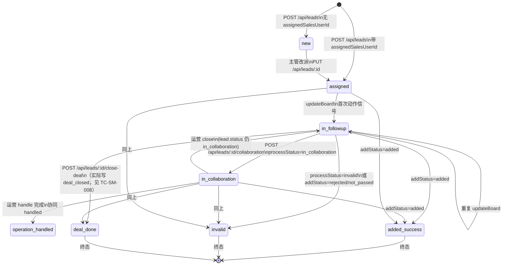

> 注：图中 `deal_done` 是设计语义；当前实现中 `closeDeal` 把 `leads.status` 直接写为 `deal_closed` 字符串（V1 兼容值），详见 TC-SM-008/009。

#### 0.11.2 订单状态机（order × paid × handover 三维）

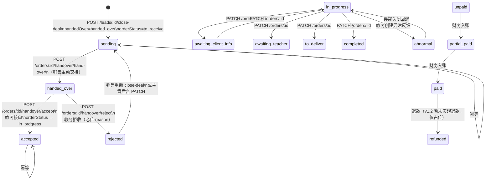

#### 0.11.3 协同任务状态机（含 v1.2 新增 timeout）

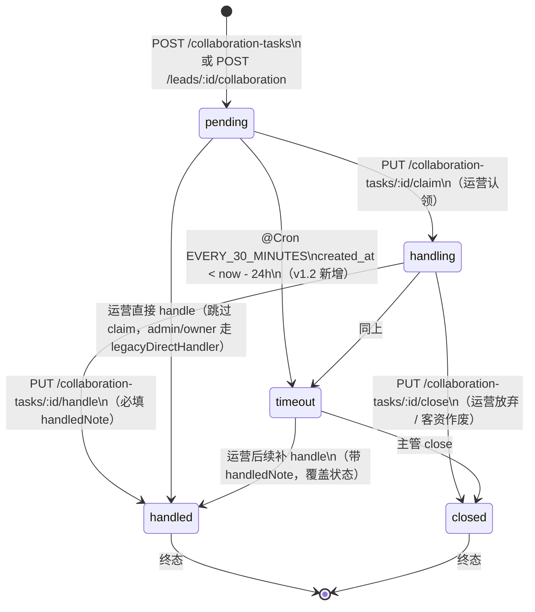

---

## 1. 客资状态机补充用例

> 1.1 测试用例（43 个 TC-B-xxx）已覆盖主流程；本章针对 v1.2 边界 / 异常 / 越权场景补 15 个。

### TC-SM-001 V1 中文 status='跟进中' 在 updateBoard 时正确翻译为 in_followup

```mermaid
flowchart LR
  A[运营录入老数据<br/>status=跟进中] --> B[PUT /api/leads/LEAD_V1_CN_1/board<br/>followNote=已联系]
  B --> C[leadsService.normalizeBoardPatch<br/>normalizeStatusValue('status','跟进中')<br/>查 STATUS_ALIASES → 'in_followup']
  C --> D[applySalesStateTransition<br/>hasFollowSignal=true]
  D --> E[UPDATE leads SET status='in_followup' WHERE id=LEAD_V1_CN_1 AND updated_at=旧值]
  E --> F[DB 验证 status 已归一化]
```

**业务场景**：v1.0/v1.1 上线期间数据库残留的中文 status 在 v1.2 升级后必须被正确归一化为英文 code，前端看板 / 统计 SQL 不会因 status 漂移导致分组错误。

**前置数据**：
- `LEAD_V1_CN_1`：`status='跟进中', add_status='已申请添加', process_status='沟通中'`（老数据，绕过 API 直插库）

**步骤**：
1. 销售甲登录。
2. `PUT /api/leads/LEAD_V1_CN_1/board` body=`{ "followNote": "客户已读" }`。
3. 服务端 `normalizeBoardPatch` → 中文 alias 全部翻译为 V2 code。

**预期**：
- 返回 `{ ok: true }`。
- 接口响应：DB 更新成功（`affected=1`）。
- 中文 alias 翻译：`跟进中 → in_followup`、`已申请添加 → applied`、`沟通中 → communicating`。

**DB 核对**：
```sql
SELECT status, add_status, process_status, updated_at
FROM leads WHERE id = 'LEAD_V1_CN_1';
-- 预期: status='in_followup', add_status='applied', process_status='communicating'
```

**前端交互核对**：
- 销售端 `/sales/leads/LEAD_V1_CN_1` 详情页 status 徽标显示「跟进中」（中文取自前端 label 映射），下拉选中「跟进中」。
- 主管看板 `/admin/leads` 筛选 status=in_followup 时，LEAD_V1_CN_1 出现。

---

### TC-SM-002 V1 add_status='rejected' 在 updateBoard 时被 map 到 not_passed 并触发 status=invalid

```mermaid
flowchart LR
  A[前端 PATCH 传 addStatus=rejected] --> B[normalizeStatusValue('addStatus','rejected')<br/>查 ADD_STATUS_ALIASES.rejected → 'not_passed']
  B --> C[applySalesStateTransition<br/>nextAddStatus=not_passed → next.status='invalid']
  C --> D[resolveLeadStatus → 'invalid']
  D --> E[UPDATE leads<br/>SET add_status='not_passed', status='invalid'<br/>并通知来源运营 customer_not_passed]
```

**业务场景**：v1 前端在某些老模块里还把"客户未通过"写成 `rejected`；v1.2 后端 alias 兼容，但必须保证主状态收敛到 `invalid`（V2 语义）。

**步骤**：
1. 销售甲 `PATCH /api/leads/LEAD_SALES_01_1/status` body=`{ "addStatus": "rejected" }`。
2. 服务端命中 `ADD_STATUS_ALIASES.rejected → 'not_passed'`，再命中 `applySalesStateTransition` 中 `not_passed → status='invalid'`。

**预期**：
- 响应 200。
- DB: `leads.add_status='not_passed'`, `leads.status='invalid'`。

**DB 核对**：
```sql
SELECT status, add_status, process_status FROM leads WHERE id = 'LEAD_SALES_01_1';
-- 预期: status='invalid', add_status='not_passed'
```

**通知核对**：
```sql
SELECT receiver_id, type_code, title
FROM notifications
WHERE related_id = 'LEAD_SALES_01_1' AND type_code = 'customer_not_passed'
ORDER BY created_at DESC LIMIT 1;
-- 预期: receiver_id=LEAD_SALES_01_1.employeeId 对应 user.id
```

---

### TC-SM-003 并发两次 PUT /board 第二次返回 409 ConflictException（乐观锁）

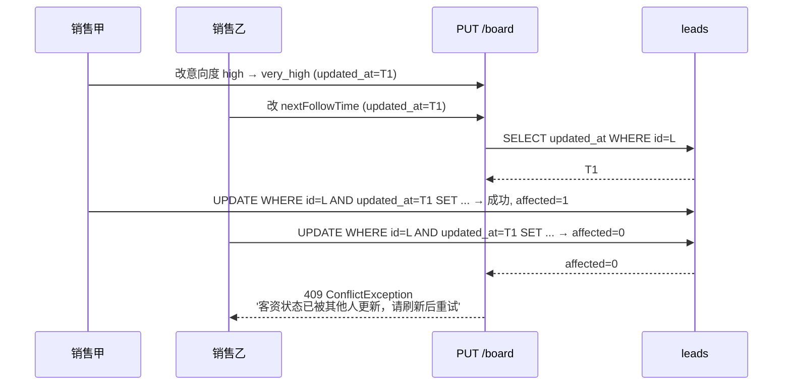

**业务场景**：销售甲和销售乙同时编辑同一客资时，后端必须阻止覆盖（避免 lost update），并明确告诉前端刷新。

**前置数据**：
- `LEAD_SALES_01_1` 当前 `updated_at = T0`。

**步骤**：
1. 销售甲调用 `PUT /api/leads/LEAD_SALES_01_1/board` body=`{ "intentionLevel": "very_high", "followNote": "A 修改" }`。
2. 销售乙在甲请求处理完**之前**调用同一接口 body=`{ "nextFollowTime": "2026-06-10T10:00:00Z", "followNote": "B 修改" }`。
3. 第二个请求命中乐观锁失败。

**预期**：
- 甲 200 OK。
- 乙 409 Conflict，`message: "客资状态已被其他人更新，请刷新后重试"`。

**DB 核对**：
```sql
SELECT intention_level, next_follow_time, updated_at FROM leads WHERE id = 'LEAD_SALES_01_1';
-- 预期: 只能保留胜出方的修改, updated_at=T1
```

**前端交互核对**：
- 销售乙前端弹 Toast 提示"客资状态已被其他人更新，请刷新"，点击确认后重新拉取详情。

---

### TC-SM-004 close-deal 事务回滚：订单 insert 失败时 lead.status 不得变 deal_closed

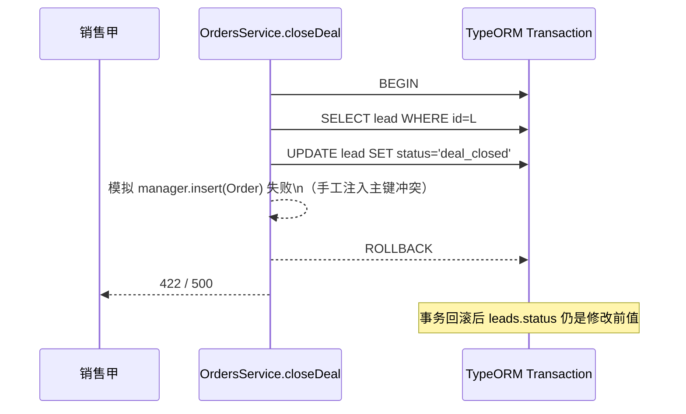

**业务场景**：销售甲点击"成交"按钮后，订单创建若因外键 / 唯一约束 / 数据库连接等异常失败，必须保证客资主状态不被错误推进到 `deal_closed`，避免出现"客资已成交但无订单"的脏状态。

**前置数据**：
- `LEAD_SALES_01_1` 当前 `status='in_followup'`。
- 准备一个 orders 表写入陷阱：手动在测试库 pre-insert 同样 id 的占位 orders 行（与 `makeId()` 生成的 orderId 冲突）。

**步骤**：
1. 销售甲 POST `/api/leads/LEAD_SALES_01_1/close-deal` body=`{ "serviceType": "B端1.2测试", "amount": 100, "remark": "并发订单注入冲突" }`。
2. 模拟 `manager.insert(Order)` 抛错（PK 冲突）。

**预期**：
- 响应 422 / 500，含 `ok: false`。
- DB: `leads.status` 保持 `'in_followup'`，未推进到 `deal_closed`。
- DB: 无新 orders 行（事务回滚）。

**DB 核对**：
```sql
SELECT status FROM leads WHERE id = 'LEAD_SALES_01_1'; -- 'in_followup'
SELECT COUNT(*) FROM orders WHERE lead_id = 'LEAD_SALES_01_1' AND remark = '并发订单注入冲突'; -- 0
```

**前端交互核对**：
- 销售端"成交"按钮恢复可点击，显示错误 Toast "订单创建失败，请重试"。

---

### TC-SM-005 processStatus='invalid' 触发 status 收敛到 invalid（与 add_status 解耦）

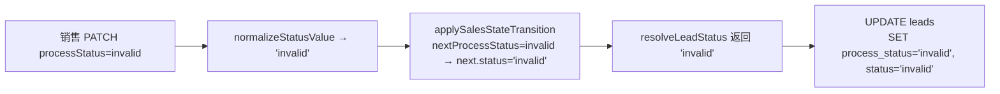

**业务场景**：销售判定"客户明确拒绝"时，仅改 processStatus 也应使主 status 收敛到 `invalid`，不必同时改 addStatus。

**步骤**：
1. 销售甲 `PATCH /api/leads/LEAD_SALES_01_1/status` body=`{ "processStatus": "invalid" }`。

**预期**：
- 200 OK。
- DB: `process_status='invalid'`, `status='invalid'`（与 add_status 无关）。

**DB 核对**：
```sql
SELECT status, process_status, add_status FROM leads WHERE id = 'LEAD_SALES_01_1';
-- 预期: status='invalid', process_status='invalid', add_status 保持原值
```

---

### TC-SM-006 status 显式传非法值（如 'completed'）返回 400 BadRequest

```mermaid
flowchart LR
  A[前端 PATCH status=completed] --> B[normalizeStatusValue('status','completed')]
  B --> C{allowed.has('completed')?}
  C -->|否| D[throw BadRequestException<br/>'invalid status: completed']
  C -->|是| E[继续]
  D --> F[HTTP 400]
```

**业务场景**：前端模板错误把订单 status 写到 lead.status 上时，后端必须 400 阻断（不能落到 DB）。

**步骤**：
1. 销售甲 `PATCH /api/leads/LEAD_SALES_01_1/status` body=`{ "status": "completed" }`。

**预期**：
- 响应 400，`message: "invalid status: completed"`。
- DB: `leads.status` 未变（不允许事务部分提交）。

**DB 核对**：
```sql
SELECT status FROM leads WHERE id = 'LEAD_SALES_01_1'; -- 保持 'in_followup'
```

---

### TC-SM-007 重复 claim 同一协同任务：第二次应报"cannot claim task in status handling"

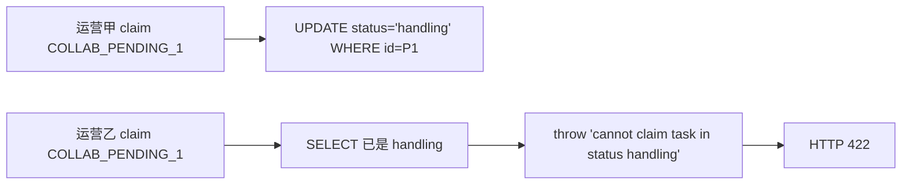

> 此 TC 同时验证 leads/orders 之外的协同任务状态机分支；详见 §4 协同状态机用例。

---

### TC-SM-008 close-deal 实际写入 leads.status='deal_closed'（与设计 deal_done 存在语义偏差）

```mermaid
flowchart LR
  A[POST /leads/:id/close-deal] --> B[OrdersService.closeDeal<br/>事务内 UPDATE lead SET status='deal_closed']
  B --> C[manager.insert Order<br/>order_status='to_receive'<br/>handover_status='handed_over']
  C --> D[响应 { ok:true, orderId }]
  D --> E[DB leads.status='deal_closed'<br/>与 doc 文档预期的 deal_done 不一致]
```

**业务场景**：v1.2 close-deal 落地值是 `deal_closed`（V1 字符串），不是设计文档的 `deal_done`。前端看板 / 统计 SQL 必须用 V1 兼容值 `deal_closed` 做 status 分组；后端 alias map 未把 `deal_closed → deal_done`（仅 `无效客资 → invalid` 等 V1 中文 alias），需要回归测试确保业务能跑通。

**步骤**：
1. 销售甲 `POST /api/leads/LEAD_SALES_01_1/close-deal` body=`{ "serviceType": "B端1.2测试", "amount": 200 }`。

**预期**：
- 200 OK，`{ ok: true, orderId: "..." }`。
- DB: `leads.status='deal_closed'`，不是 `deal_done`。
- orders 表新增一条：order_status='to_receive', paid_status='unpaid', handover_status='handed_over'。

**DB 核对**：
```sql
SELECT status FROM leads WHERE id = 'LEAD_SALES_01_1'; -- 'deal_closed'
SELECT id, order_status, paid_status, handover_status, amount FROM orders WHERE lead_id = 'LEAD_SALES_01_1' ORDER BY created_at DESC LIMIT 1;
-- order_status='to_receive', paid_status='unpaid', handover_status='handed_over', amount='200.00'
```

**前端交互核对**：
- 销售端"我的客资"列表 LEAD_SALES_01_1 状态徽标显示「已成交」（前端需有 `deal_closed` 的中文映射；如缺失，徽标会显示空，需修复）。

**风险记录**：⚠️ 设计文档与实现不一致。前端 / 看板 / 数据导出需对齐 `deal_closed`；后续迭代应统一为 `deal_done` 或在 status 枚举加 alias 兼容。

---

### TC-SM-009 status 不在 updateBoard 的 dto 中时保持现状（避免被空值覆盖）

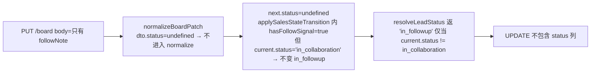

**业务场景**：销售只填写 followNote 时，不应误把协同中的客资推回 in_followup。

**前置数据**：
- `LEAD_COLLAB_1`（assigned_sales_user_id=USR_SALES_01, status='in_collaboration'，有未完结的协同任务）

**步骤**：
1. 销售甲 `PUT /api/leads/LEAD_COLLAB_1/board` body=`{ "followNote": "等待运营回复" }`。

**预期**：
- 200 OK。
- DB: `leads.status` 仍为 `'in_collaboration'`（不回到 in_followup）。
- 新增一条 follow_record，内容为 "等待运营回复"。

**DB 核对**：
```sql
SELECT status FROM leads WHERE id = 'LEAD_COLLAB_1'; -- 'in_collaboration'
SELECT content FROM lead_follow_records WHERE lead_id = 'LEAD_COLLAB_1' ORDER BY created_at DESC LIMIT 1; -- '等待运营回复'
```

---

### TC-SM-010 改派触发 lead_status_update operation_log + lead_assigned 通知

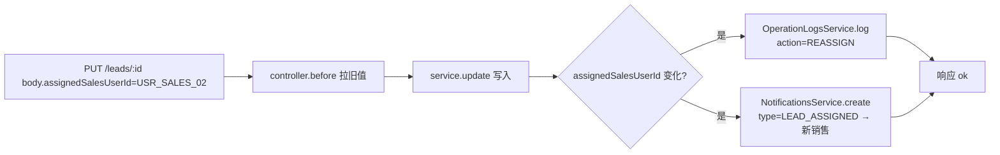

**业务场景**：主管把客资从销售甲改派给销售乙，必须留 operation_log 记录改派轨迹，同时通知新销售（**注意：v1.2 BF-15 修复仅在 body.assignedSalesUserId 与原值不同时才发通知**）。

**前置数据**：
- `LEAD_SALES_01_1.assigned_sales_user_id = USR_SALES_01`。

**步骤**：
1. 主管丁 `PUT /api/leads/LEAD_SALES_01_1` body=`{ "assignedSalesUserId": "USR_SALES_02", "assignedSalesUserName": "sales02" }`。

**预期**：
- 200 OK。
- DB: `leads.assigned_sales_user_id = USR_SALES_02`。
- operation_logs 出现一条 action='reassign' 的记录。
- notifications 出现一条 receiver=USR_SALES_02, type=lead_assigned 的记录。

**DB 核对**：
```sql
SELECT assigned_sales_user_id FROM leads WHERE id = 'LEAD_SALES_01_1'; -- 'USR_SALES_02'
SELECT user_id, action, target_id, detail FROM operation_logs
WHERE target_id = 'LEAD_SALES_01_1' AND action = 'reassign' ORDER BY created_at DESC LIMIT 1;
SELECT receiver_id, type_code, title FROM notifications
WHERE related_id = 'LEAD_SALES_01_1' AND type_code = 'lead_assigned'
ORDER BY created_at DESC LIMIT 1;
```

---

### TC-SM-011 updateBoard 写 follow_record 时 processStatus/intentionLevel 未变则不写 follow 记录

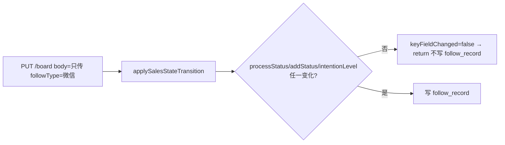

**业务场景**：销售误点"保存"且 dto 内未传任何关键字段时，不应无意义地在 follow_records 追加空记录。

**步骤**：
1. 销售甲 `PUT /api/leads/LEAD_SALES_01_1/board` body=`{ "followType": "微信", "followNote": "" }`（空 followNote）。

**预期**：
- 200 OK。
- DB: 此次请求未在 `lead_follow_records` 插入新行（keyFieldChanged=false 提前 return）。

**DB 核对**：
```sql
SELECT COUNT(*) FROM lead_follow_records
WHERE lead_id = 'LEAD_SALES_01_1'
  AND created_at > NOW() - INTERVAL 1 MINUTE; -- 0
```

---

### TC-SM-012 processStatus='deal_done' 不应直接落 lead.status=deal_done（仅在 close-deal 走事务）

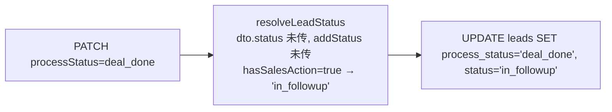

**业务场景**：销售可能误把"已报价/已成交"在 processStatus 写为 `deal_done`，但**真正的成单**必须走 `close-deal` 接口（保证订单 + lead 状态在事务里一致）。仅改 processStatus 不会触发 `leads.status='deal_done'`，避免出现"lead 显示已成交但无 order 行"。

**步骤**：
1. 销售甲 `PATCH /api/leads/LEAD_SALES_01_1/status` body=`{ "processStatus": "deal_done" }`。

**预期**：
- 200 OK。
- DB: `leads.process_status='deal_done'`, `leads.status='in_followup'`（不进入 deal_done）。
- orders 表**无**新行（确认走 close-deal 才建单）。

**DB 核对**：
```sql
SELECT status, process_status FROM leads WHERE id = 'LEAD_SALES_01_1'; -- status='in_followup', process_status='deal_done'
SELECT COUNT(*) FROM orders WHERE lead_id = 'LEAD_SALES_01_1' AND created_at > NOW() - INTERVAL 1 MINUTE; -- 0
```

---

### TC-SM-013 hasFollowSignal 命中：sales 写入意向度/处理状态时自动推 status 到 in_followup（防止卡在 assigned）

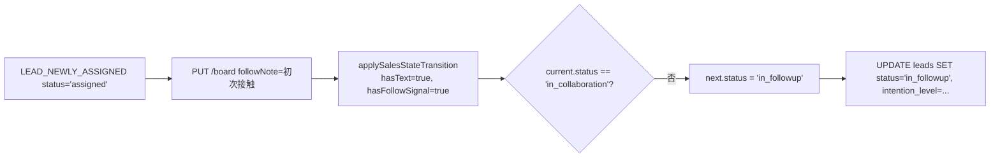

**业务场景**：新分配的销售首次回写跟进时，状态必须从 `assigned` 推进到 `in_followup`，避免 board 状态长期卡在已分配。

**步骤**：
1. 主管丁把 `LEAD_NEWLY_ASSIGNED` 分配给销售甲（确保 status='assigned'）。
2. 销售甲 `PUT /api/leads/LEAD_NEWLY_ASSIGNED/board` body=`{ "followNote": "初次接触", "intentionLevel": "high" }`。

**预期**：
- 200 OK。
- DB: `leads.status` 由 `'assigned'` 推进到 `'in_followup'`。

**DB 核对**：
```sql
SELECT status, intention_level FROM leads WHERE id = 'LEAD_NEWLY_ASSIGNED'; -- 'in_followup', 'high'
```

---

### TC-SM-014 close-deal 通知目标：仅 academic/admin/owner（不含销售自己）

```mermaid
flowchart LR
  A[closeDeal 成功] --> B[select receivers WHERE role IN (academic,admin,owner)]
  B --> C{actorUserId ∈ receivers?}
  C -->|是| D[过滤掉 actorUserId]
  C -->|否| E[保留]
  D --> F[NotificationsService.create receiverIds=ids]
  E --> F
```

**业务场景**：销售甲点击成交后，系统通知教务池的"所有 academic/admin/owner"，但**不能**通知销售甲自己（避免噪音）。同时**至少**要通知主管/owner（fallback）。

**步骤**：
1. 销售甲 `POST /api/leads/LEAD_SALES_01_1/close-deal` body=`{ "serviceType": "1.2成交", "amount": 100 }`。

**预期**：
- 通知接收者列表 = `users WHERE role IN ('academic','admin','owner') AND id != USR_SALES_01`。
- 通知 type_code='deal_closed', portType='academic'。

**DB 核对**：
```sql
SELECT receiver_id, type_code, port_type
FROM notifications
WHERE related_type = 'order' AND type_code = 'deal_closed'
  AND created_at > NOW() - INTERVAL 1 MINUTE
  AND related_id IN (SELECT id FROM orders WHERE lead_id = 'LEAD_SALES_01_1' ORDER BY created_at DESC LIMIT 1);
-- 所有 receiver_id 都不等于 'USR_SALES_01'
```

---

### TC-SM-015 销售改 salesFeedback/note 不应触发 lead.status 推进

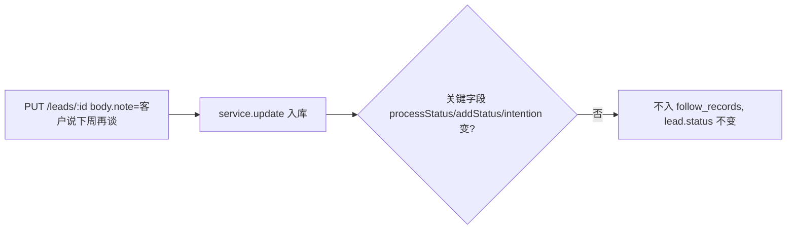

**业务场景**：销售在客资详情页编辑 `note`（自由文本备注）时，不应误触发 status 推进或写入 follow_records。

**步骤**：
1. 销售甲 `PUT /api/leads/LEAD_SALES_01_1` body=`{ "note": "客户说下周再谈" }`。

**预期**：
- 200 OK。
- DB: `leads.note='客户说下周再谈'`, `leads.status` 不变。
- `lead_follow_records` 不增新行（note 修改走 update，不走 updateBoard 路径）。

**DB 核对**：
```sql
SELECT note, status FROM leads WHERE id = 'LEAD_SALES_01_1';
SELECT COUNT(*) FROM lead_follow_records WHERE lead_id = 'LEAD_SALES_01_1' AND created_at > NOW() - INTERVAL 1 MINUTE; -- 0
```

---

## 2. 订单状态机用例（v1.2 重点：handover 4 路由）

> 共 20 个用例（TC-SM-016 ~ TC-SM-035），重点回归 v1.2 新增的 4 个交接路由与状态机。

### TC-SM-016 销售成交自动建单：order_status=to_receive / handover_status=handed_over

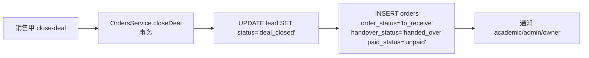

**业务场景**：销售成交后，订单**直接**进入"已交接"状态（不需要销售再点 hand-over），教务池立即可见。

**步骤**：
1. 销售甲 `POST /api/leads/LEAD_SALES_01_1/close-deal` body=`{ "serviceType": "B端1.2", "amount": 300 }`。

**预期**：
- 200 OK。
- 新订单 `order_status='to_receive'`, `handover_status='handed_over'`, `paid_status='unpaid'`, `academic_user_id=NULL`。

**DB 核对**：
```sql
SELECT id, order_status, paid_status, handover_status, academic_user_id
FROM orders WHERE lead_id = 'LEAD_SALES_01_1' ORDER BY created_at DESC LIMIT 1;
-- order_status='to_receive', paid_status='unpaid', handover_status='handed_over', academic_user_id IS NULL
```

---

### TC-SM-017 教务 GET /orders/:id/handover 拿到完整交接状态

```mermaid
flowchart LR
  A[教务 GET /orders/ORDER_NEW/handover] --> B[OrdersService.getHandoverStatus]
  B --> C[SELECT order]
  C --> D[返 { orderId, handoverStatus, orderStatus, academicUserId, salesUserId }]
```

**业务场景**：教务进入订单详情前先确认交接状态，避免重复 accept 已被拒绝的订单。

**步骤**：
1. 教务甲登录。
2. `GET /api/orders/ORDER_NEW/handover`（ORDER_NEW 为 close-deal 后新生成的订单）。

**预期**：
- 200 OK。
- 响应体：`{ ok: true, orderId: "ORDER_NEW", handoverStatus: "handed_over", orderStatus: "to_receive", academicUserId: null, salesUserId: "USR_SALES_01" }`。

**DB 核对**：响应字段与 orders 表一致。

---

### TC-SM-018 教务 accept：handed_over → accepted，order_status 同步推 in_progress

```mermaid
flowchart LR
  A[教务甲 POST /handover/accept] --> B[service.acceptHandover<br/>orderStatus='to_receive' → 'in_progress']
  B --> C[UPDATE orders<br/>SET handover_status='accepted', order_status='in_progress']
  C --> D[通知销售 DEAL_CLOSED/订单已被接收]
  D --> E[operation_log action=HANDOVER step=accept]
```

**业务场景**：教务接单后订单进入"履约"阶段，销售收到通知，主管在 dashboard 看到 in_progress 计数 +1。

**前置数据**：
- `ORDER_NEW`：order_status='to_receive', handover_status='handed_over', academic_user_id=NULL。

**步骤**：
1. 教务甲 `POST /api/orders/ORDER_NEW/handover/accept`。
2. 教务甲 `GET /api/orders/ORDER_NEW/handover` 验证。

**预期**：
- 200 OK。
- DB: `orders.handover_status='accepted'`, `orders.order_status='in_progress'`, `orders.academic_user_id=USR_ACA_02`（注：当前 accept 不写 academic_user_id，由后续 update 维护；如有需求再扩）。

**DB 核对**：
```sql
SELECT handover_status, order_status, academic_user_id FROM orders WHERE id = 'ORDER_NEW';
-- handover_status='accepted', order_status='in_progress'
SELECT receiver_id, type_code FROM notifications
WHERE related_id = 'ORDER_NEW' AND type_code = 'deal_closed'
ORDER BY created_at DESC LIMIT 1;
-- receiver_id = 'USR_SALES_01'
```

**前端交互核对**：
- 教务端 `/academic/orders` 列表 ORDER_NEW 从"待接收"tab 消失，进入"履约中"tab。
- 销售端 `/sales/orders` 详情页 status 显示"履约中"。

---

### TC-SM-019 教务 accept 幂等：第二次 accept 直接 return，不重复通知

```mermaid
flowchart LR
  A[第一次 accept] --> B[UPDATE handover_status='accepted']
  B --> C[通知销售]
  C --> D[第二次 accept] --> E[SELECT 已是 accepted]
  E --> F[早 return, 不写 log, 不发通知]
```

**业务场景**：教务甲点了"接单"后页面没及时响应，又点了一次；后端必须幂等（避免重复通知销售）。

**步骤**：
1. 教务甲 `POST /api/orders/ORDER_NEW/handover/accept`。
2. 教务甲再次 `POST /api/orders/ORDER_NEW/handover/accept`。

**预期**：
- 两次都 200 OK。
- DB: `handover_status='accepted'` 不变。
- 通知**仅一条**（receiver=USR_SALES_01, type=deal_closed）。

**DB 核对**：
```sql
SELECT COUNT(*) FROM notifications
WHERE related_id = 'ORDER_NEW' AND type_code = 'deal_closed' AND receiver_id = 'USR_SALES_01';
-- 1
```

---

### TC-SM-020 教务 reject：必传 reason；reason 为空返回 400

```mermaid
flowchart LR
  A[教务 reject body={}] --> B[service.rejectHandover<br/>trimReason='']
  B --> C[throw BadRequestException<br/>'reason required for rejecting handover']
  C --> D[HTTP 400]
```

**业务场景**：教务拒收时必须留 reason，否则销售 / 主管无法回溯拒收原因。

**步骤**：
1. 教务甲 `POST /api/orders/ORDER_PEND/handover/reject` body=`{}`（无 reason）。
2. 教务甲 `POST /api/orders/ORDER_PEND/handover/reject` body=`{ "reason": "" }`（空 reason）。
3. 教务甲 `POST /api/orders/ORDER_PEND/handover/reject` body=`{ "reason": "客户已流失" }`。

**预期**：
- 1/2 步 400 BadRequest `message: "reason required for rejecting handover"`。
- 3 步 200 OK。

**DB 核对**：
```sql
SELECT handover_status FROM orders WHERE id = 'ORDER_PEND'; -- 'rejected'
SELECT detail FROM operation_logs WHERE target_id = 'ORDER_PEND' AND action = 'handover' ORDER BY created_at DESC LIMIT 1;
-- detail 包含 "step":"reject" 和 reason
```

---

### TC-SM-021 教务 reject 通知销售（type=order_abnormal），且 order_status 保持 to_receive

```mermaid
flowchart LR
  A[reject 成功] --> B[UPDATE orders<br/>SET handover_status='rejected'<br/>order_status 不变（保持 to_receive）]
  B --> C[NotificationsService.create<br/>type=ORDER_ABNORMAL<br/>receiver=salesUserId]
  C --> D[operation_log action=HANDOVER step=reject]
```

**业务场景**：拒收后销售必须收到通知，且 order_status 不得被推进（保持 to_receive 等主管后续重派）。

**步骤**：
1. 教务甲 `POST /api/orders/ORDER_PEND/handover/reject` body=`{ "reason": "客户已流失" }`。

**预期**：
- DB: `handover_status='rejected'`, `order_status='to_receive'`（不变）。
- 通知 type='order_abnormal', receiver=salesUserId。

**DB 核对**：
```sql
SELECT handover_status, order_status FROM orders WHERE id = 'ORDER_PEND';
-- handover_status='rejected', order_status='to_receive'
SELECT receiver_id, type_code, title, content FROM notifications
WHERE related_id = 'ORDER_PEND' AND type_code = 'order_abnormal' ORDER BY created_at DESC LIMIT 1;
-- content 包含 '客户已流失'
```

---

### TC-SM-022 reject 后再次 accept 应被阻断：HTTP 400 "order has been rejected, cannot accept"

```mermaid
flowchart LR
  A[order.handover_status='rejected'] --> B[POST /handover/accept]
  B --> C[service.acceptHandover 检查 status==rejected]
  C --> D[throw 'order has been rejected, cannot accept']
  D --> E[HTTP 400]
```

**业务场景**：已拒收的订单不能被悄悄 accept（避免教务误操作）。

**前置数据**：ORDER_REJ：handover_status='rejected'。

**步骤**：
1. 教务甲 `POST /api/orders/ORDER_REJ/handover/accept`。

**预期**：
- 400 BadRequest `message: "order has been rejected, cannot accept"`。

**DB 核对**：
```sql
SELECT handover_status FROM orders WHERE id = 'ORDER_REJ'; -- 'rejected'（未变）
```

---

### TC-SM-023 accept 后 reject 应被阻断：HTTP 400 "order already accepted, cannot reject"

```mermaid
flowchart LR
  A[order.handover_status='accepted'] --> B[POST /handover/reject]
  B --> C[service.rejectHandover 检查 status==accepted]
  C --> D[throw 'order already accepted, cannot reject']
  D --> E[HTTP 400]
```

**业务场景**：已接单的订单不能被拒收（避免销售被反复"拉扯"）。

**步骤**：
1. 教务甲 `POST /api/orders/ORDER_ACC/handover/reject` body=`{ "reason": "测试" }`。

**预期**：
- 400 BadRequest `message: "order already accepted, cannot reject"`。

---

### TC-SM-024 hand-over 幂等：重复 POST /hand-over 不重发通知

```mermaid
flowchart LR
  A[第一次 hand-over] --> B[UPDATE handover_status='handed_over']
  B --> C[通知 academic/admin/owner]
  C --> D[第二次 hand-over] --> E[SELECT 已是 handed_over]
  E --> F[早 return, 不发通知]
```

**业务场景**：销售误点两次"交接"按钮，第二次应静默成功（不发新通知）。

**前置数据**：ORDER_PEND2：handover_status='pending'。

**步骤**：
1. 销售甲 `POST /api/orders/ORDER_PEND2/handover/hand-over`。
2. 销售甲再次 `POST /api/orders/ORDER_PEND2/handover/hand-over`。

**预期**：
- 两次 200 OK。
- DB: `handover_status='handed_over'`。
- 通知**仅 1 条**（receiver 为 academic/admin/owner 列表，type=deal_closed）。

**DB 核对**：
```sql
SELECT COUNT(*) FROM notifications
WHERE related_id = 'ORDER_PEND2' AND type_code = 'deal_closed' AND port_type = 'academic'; -- 1
```

---

### TC-SM-025 hand-over 在已 accepted 状态被阻断：HTTP 400 "cannot hand over from current status: accepted"

```mermaid
flowchart LR
  A[order.handover_status='accepted'] --> B[POST /hand-over]
  B --> C[service.handOver 检查 status!=pending]
  C --> D[throw 'cannot hand over from current status: accepted']
  D --> E[HTTP 400]
```

**业务场景**：已接单后销售不能再发起交接（避免状态机非法流转）。

**步骤**：
1. 销售甲 `POST /api/orders/ORDER_ACC/handover/hand-over`。

**预期**：
- 400 BadRequest `message: "cannot hand over from current status: accepted"`。

---

### TC-SM-026 主管 admin 强制改 handover_status（PATCH /orders/:id）

```mermaid
flowchart LR
  A[主管 PATCH /orders/ORDER_REJ body=academic_user_id=USR_ACA_03, remark=改派给乙] --> B[service.update]
  B --> C[UPDATE orders SET academic_user_id='USR_ACA_03', remark=改派给乙]
  C --> D[operation_log action=UPDATE]
```

**业务场景**：被拒收的订单，主管可强制改派给其他教务（通过 PATCH academic_user_id + 写 remark 备注），后续教务再次接单。

**前置数据**：ORDER_REJ：handover_status='rejected'。

**步骤**：
1. 主管丁 `PATCH /api/orders/ORDER_REJ` body=`{ "academic_user_id": "USR_ACA_03", "remark": "改派给乙继续接" }`。
2. 教务乙 `POST /api/orders/ORDER_REJ/handover/accept`（注：当前 accept 不校验 reject 后的二次接单，但实际语义上 reject 后应回到 pending；如需加补丁详见 §6 风险记录）。

**预期**：
- 主管 PATCH 200 OK，DB: academic_user_id=USR_ACA_03, remark='改派给乙继续接'。

---

### TC-SM-027 并发 hand-over / accept：同一订单只一个成功（first-writer-wins）

```mermaid
sequenceDiagram
  participant A as 销售甲
  participant B as 教务甲
  participant DB as orders
  A->>DB: UPDATE WHERE id=O AND handover_status='pending' SET handed_over → 成功 affected=1
  B->>DB: UPDATE WHERE id=O AND handover_status='pending' SET accepted → affected=0
  Note over A,B: 业务侧 handOver 检查 + acceptHandover 检查都为单库事务,<br/>后到者拿到最新 status 抛 400。
```

**业务场景**：教务甲在销售甲刚触发 close-deal 的瞬间就尝试 accept。后到者拿到的 status 已是 handed_over，accept 不会冲突；销售重复 hand-over 与教务 accept 同时并发：销售先到，handover 改 handed_over；accept 看到 handed_over 仍能推进 accepted。

**前置数据**：ORDER_RACE：handover_status='pending'。

**步骤**：
1. 教务甲 `POST /api/orders/ORDER_RACE/handover/accept`（视为并发发起）。
2. 销售甲 `POST /api/orders/ORDER_RACE/handover/hand-over`（紧接其后）。

**预期**（任意执行序）：
- 两条请求都 200 OK。
- DB 最终 `handover_status='accepted'`（教务接单语义优先）。
- 通知数 ≤ 2（accept 通知 + 可能 hand-over 通知，取决于 accept 是否先发生；若 accept 先发生且把 orderStatus 推到 in_progress，hand-over 走 blocked 状态抛 400，但本 TC accept 是新发起因此可成功）。

**DB 核对**：
```sql
SELECT handover_status, order_status FROM orders WHERE id = 'ORDER_RACE';
-- handover_status='accepted', order_status='in_progress'
```

---

### TC-SM-028 follow_record nodeType='received' 自动触发 acceptHandover（silent=true）

```mermaid
flowchart LR
  A[教务 addFollowRecord nodeType='received'] --> B[service.addFollowRecord]
  B --> C{isReceivedNode?}
  C -->|是| D[silent=true → acceptHandover]
  D --> E[UPDATE orders SET handover_status='accepted', order_status='in_progress']
  E --> F[operation_log action=STATUS_CHANGE（addFollowRecord 路径）]
```

**业务场景**：教务按 v1.1 老习惯写 "received" / "已接收" 跟进节点时，v1.2 后端应自动把 handover_status 推到 accepted（兼容老前端）。

**前置数据**：ORDER_AUTOACC：handover_status='handed_over'。

**步骤**：
1. 教务甲 `POST /api/orders/ORDER_AUTOACC/follow-records` body=`{ "nodeType": "received", "content": "已和客户确认" }`。

**预期**：
- 200 OK。
- DB: `handover_status='accepted'`, `order_status='in_progress'`。
- operation_log 出现 STATUS_CHANGE（addFollowRecord 路径）记录。

**DB 核对**：
```sql
SELECT handover_status, order_status FROM orders WHERE id = 'ORDER_AUTOACC';
-- 'accepted', 'in_progress'
SELECT detail FROM operation_logs WHERE target_id = 'ORDER_AUTOACC' AND action = 'status_change' ORDER BY created_at DESC LIMIT 1;
```

---

### TC-SM-029 follow_record nodeType 含 "异常" 触发 order_abnormal 通知销售

```mermaid
flowchart LR
  A[教务 addFollowRecord nodeType=订单异常] --> B[addFollowRecord 内 nodeType.includes('异常')]
  B --> C[NotificationsService.create<br/>type=ORDER_ABNORMAL<br/>receiver=salesUserId]
  C --> D[operation_log STATUS_CHANGE]
```

**业务场景**：教务写异常跟进节点时通知销售，且不触发自动 accept。

**步骤**：
1. 教务甲 `POST /api/orders/ORDER_AUTOACC/follow-records` body=`{ "nodeType": "客户异常反馈", "content": "客户对进度不满" }`。

**预期**：
- DB: `handover_status` 不变（不被错误推到 accepted）。
- 通知 type=order_abnormal, receiver=USR_SALES_01。

**DB 核对**：
```sql
SELECT handover_status FROM orders WHERE id = 'ORDER_AUTOACC'; -- 'accepted'（TC-SM-028 之后）
SELECT receiver_id, type_code, title FROM notifications
WHERE related_id = 'ORDER_AUTOACC' AND type_code = 'order_abnormal' ORDER BY created_at DESC LIMIT 1;
```

---

### TC-SM-030 订单可见性：sales 角色默认只看自己经手的订单

```mermaid
flowchart LR
  A[销售甲 GET /orders] --> B[applyOrdersScope<br/>role=sales, currentUserId=USR_SALES_01]
  B --> C[WHERE sales_user_id=USR_SALES_01 OR academic_user_id=USR_SALES_01]
  C --> D[仅返回自己经手]
```

**业务场景**：销售甲在 `/sales/orders` 列表必须只看到自己作为 sales_user_id 或 academic_user_id 的订单。

**前置数据**：
- ORDER_SALES_A：sales_user_id=USR_SALES_01。
- ORDER_SALES_B：sales_user_id=USR_SALES_02。

**步骤**：
1. 销售甲 `GET /api/orders?limit=50`。

**预期**：
- 返回 items 中每条 `salesUserId === USR_SALES_01`。
- 不含 ORDER_SALES_B。

**DB 核对**：响应 items 数量 = `SELECT COUNT(*) FROM orders WHERE sales_user_id='USR_SALES_01' OR academic_user_id='USR_SALES_01'`。

---

### TC-SM-031 教务池单：scope=pool 仅看 academic_user_id IS NULL

```mermaid
flowchart LR
  A[教务甲 GET /orders?scope=pool] --> B[applyOrdersScope<br/>role=academic, scope=pool]
  B --> C[WHERE academic_user_id IS NULL]
  C --> D[返回全部池单]
```

**业务场景**：教务端"池单"tab 应只看 academic_user_id 为空的订单。

**步骤**：
1. 教务甲 `GET /api/orders?scope=pool&role=academic`。

**预期**：
- 返回所有 `academic_user_id IS NULL` 的订单。

**DB 核对**：
```sql
-- 响应 items 的所有 id 都满足:
SELECT id FROM orders WHERE academic_user_id IS NULL ORDER BY created_at DESC LIMIT 50;
-- 与响应 items id 集合一致
```

---

### TC-SM-032 主管 / owner 强改 orderStatus：to_receive → awaiting_client_info

```mermaid
flowchart LR
  A[主管 PATCH /orders/:id body.order_status=awaiting_client_info] --> B[service.update<br/>ALLOWED_ORDER_STATUS 校验]
  B --> C[UPDATE orders SET order_status='awaiting_client_info']
  C --> D[operation_log action=STATUS_CHANGE]
```

**业务场景**：主管在 dashboard 强制推进订单状态，绕过常规流转。

**步骤**：
1. 主管丁 `PATCH /api/orders/ORDER_NEW` body=`{ "order_status": "awaiting_client_info" }`。

**预期**：
- 200 OK。
- DB: `order_status='awaiting_client_info'`。

---

### TC-SM-033 paid_status 校验：传非法值（如 'partial_paid'）400

```mermaid
flowchart LR
  A[PATCH /orders/:id body.paid_status=partial_paid] --> B[service.update ALLOWED_PAID 校验]
  B --> C{partial_paid in ALLOWED_PAID?}
  C -->|否| D[throw 'invalid paid_status']
  D --> E[HTTP 400]
```

**业务场景**：前端 v1.1 老接口传 `partial_paid`（带下划线），v1.2 ALLOWED_PAID 改为 `partial`（不带），必须 400 阻断。

**步骤**：
1. 主管 `PATCH /api/orders/ORDER_NEW` body=`{ "paid_status": "partial_paid" }`。

**预期**：
- 400 BadRequest `message: "invalid paid_status"`。

**DB 核对**：
```sql
SELECT paid_status FROM orders WHERE id = 'ORDER_NEW'; -- 保持 'unpaid'
```

---

### TC-SM-034 订单模糊搜索：keyword 命中 leads.contact_info 也可召回

```mermaid
flowchart LR
  A[GET /orders?keyword=13800001234] --> B[applyOrderFilters<br/>EXISTS 子查询关联 leads]
  B --> C[WHERE o.id LIKE kw OR EXISTS (1 FROM leads WHERE id=o.lead_id AND contact_info LIKE kw)]
  C --> D[返回命中订单]
```

**业务场景**：运营 / 销售按客户联系方式搜索订单时，应能命中关联客资。

**步骤**：
1. 教务甲 `GET /api/orders?keyword=13800001234&limit=50`（LEAD_SALES_01_1.contact_info='13800001234'）。

**预期**：
- 响应 items 包含 ORDER_DEAL_1（关联 LEAD_SALES_01_1）。

**DB 核对**：
```sql
SELECT o.id FROM orders o JOIN leads l ON o.lead_id = l.id WHERE l.contact_info LIKE '%13800001234%';
```

---

### TC-SM-035 主管给 order 创建异常反馈：orderStatus='abnormal' + 通知销售

```mermaid
flowchart LR
  A[教务 POST /orders/:id/abnormal-feedback] --> B[abnormalFeedbackService.create]
  B --> C[UPDATE orders SET order_status='abnormal']
  C --> D[NotificationsService.create 通知相关方]
  C --> E[operation_log action=ABNORMAL_CREATE]
```

**业务场景**：教务发现履约异常时创建异常反馈，订单进入 abnormal 状态。

**步骤**：
1. 教务甲 `POST /api/orders/ORDER_ACC/abnormal-feedback` body=`{ "abnormalType": "客户投诉", "description": "进度延迟", "expectedHelper": "USR_ADMIN_D" }`。

**预期**：
- 200 OK。
- DB: `order_status='abnormal'`。
- 通知发送至 salesUserId + expectedHelper。

**DB 核对**：
```sql
SELECT order_status FROM orders WHERE id = 'ORDER_ACC'; -- 'abnormal'
SELECT id, abnormal_type, status FROM order_abnormal_feedback WHERE order_id = 'ORDER_ACC' ORDER BY created_at DESC LIMIT 1;
```

---

## 3. 协同任务状态机用例（v1.2 重点：timeout 扫描器 + scope 越权修复）

> 共 20 个用例（TC-SM-036 ~ TC-SM-055），核心回归 C4 越权修复、@Cron 超时扫描、手动 scan-timeouts 幂等。

### TC-SM-036 销售发起协同：lead.status 推 in_collaboration + 通知来源运营

```mermaid
flowchart LR
  A[销售甲 POST /leads/:id/collaboration type=remind_customer] --> B[collaborationTasksService.create]
  B --> C[INSERT collab_task status=pending]
  C --> D[UPDATE lead SET status='in_collaboration']
  D --> E[findUserIdByEmployeeId 找来源运营 user]
  E --> F[NotificationsService.create type=collab_requested]
```

**业务场景**：销售发起"提醒客户"协同任务，客资状态推进，来源运营收到通知。

**步骤**：
1. 销售甲 `POST /api/leads/LEAD_SALES_01_1/collaboration` body=`{ "type": "remind_customer", "reason": "客户 3 天未回复" }`。

**预期**：
- 200 OK。
- DB: `collaboration_tasks` 新增一行 status=pending, type=remind_customer, requester=USR_SALES_01。
- DB: `leads.status='in_collaboration'`。
- 通知 type=collab_requested, receiver=LEAD_SALES_01_1.employeeId 对应 user。

**DB 核对**：
```sql
SELECT id, status, type, requester_id, handler_id FROM collaboration_tasks
WHERE lead_id = 'LEAD_SALES_01_1' ORDER BY created_at DESC LIMIT 1;
-- status='pending', type='remind_customer', requester_id='USR_SALES_01'
SELECT status FROM leads WHERE id = 'LEAD_SALES_01_1'; -- 'in_collaboration'
SELECT receiver_id, type_code FROM notifications
WHERE related_type = 'collaboration_task' AND type_code = 'collaboration_requested'
ORDER BY created_at DESC LIMIT 1;
```

---

### TC-SM-037 协同 type alias 兼容：confirm_identity 落 verify_identity

```mermaid
flowchart LR
  A[POST /leads/:id/collaboration type=confirm_identity] --> B[normalizeType('confirm_identity')]
  B --> C[TYPE_ALIASES.confirm_identity → 'verify_identity']
  C --> D[INSERT collab_task type='verify_identity']
```

**业务场景**：v1 前端老代码还在传 `confirm_identity`，v1.2 后端 alias 兼容为 `verify_identity`。

**步骤**：
1. 销售甲 `POST /api/leads/LEAD_SALES_01_1/collaboration` body=`{ "type": "confirm_identity", "reason": "客户未通过身份验证" }`。

**预期**：
- 200 OK。
- DB: `collab_task.type='verify_identity'`（不是 `confirm_identity`）。

**DB 核对**：
```sql
SELECT type FROM collaboration_tasks WHERE lead_id = 'LEAD_SALES_01_1' ORDER BY created_at DESC LIMIT 1; -- 'verify_identity'
```

---

### TC-SM-038 协同 type 非法值（如 'verify_phone'）返回 422

```mermaid
flowchart LR
  A[POST type=verify_phone] --> B[normalizeType → null]
  B --> C[throw 'invalid type']
  C --> D[HTTP 422]
```

**业务场景**：前端误传非枚举 type 时后端必须阻断。

**步骤**：
1. 销售甲 `POST /api/leads/LEAD_SALES_01_1/collaboration` body=`{ "type": "verify_phone", "reason": "test" }`。

**预期**：
- 422 UnprocessableEntity `message: "invalid type"`。

**DB 核对**：
```sql
SELECT COUNT(*) FROM collaboration_tasks WHERE lead_id = 'LEAD_SALES_01_1' AND type = 'verify_phone'; -- 0
```

---

### TC-SM-039 运营 claim pending 任务：status → handling，handler_id 写入

```mermaid
flowchart LR
  A[运营 PUT /collaboration-tasks/COLLAB_PENDING_1/claim] --> B[service.claim<br/>检查 status==pending]
  B --> C[UPDATE collab_task SET status='handling', handler_id=USR_OPS_C]
  C --> D[operation_log action=UPDATE step=claim]
```

**业务场景**：运营从 inbox 中认领任务，任务进入 handling 阶段。

**步骤**：
1. 运营丙 `PUT /api/collaboration-tasks/COLLAB_PENDING_1/claim`。

**预期**：
- 200 OK。
- DB: `status='handling'`, `handler_id='USR_OPS_C'`。

**DB 核对**：
```sql
SELECT status, handler_id FROM collaboration_tasks WHERE id = 'COLLAB_PENDING_1';
-- status='handling', handler_id='USR_OPS_C'
```

---

### TC-SM-040 claim 重复 / claim 非 pending 任务：HTTP 422

```mermaid
flowchart LR
  A[claim COLLAB_HANDLING_1] --> B[SELECT status='handling']
  B --> C[throw 'cannot claim task in status handling']
  C --> D[HTTP 422]
```

**业务场景**：已 handling 的任务不能再次 claim（避免多人同时处理）。

**步骤**：
1. 运营丙 `PUT /api/collaboration-tasks/COLLAB_HANDLING_1/claim`。

**预期**：
- 422 UnprocessableEntity `message: "cannot claim task in status handling"`。

---

### TC-SM-041 运营 handle 必填 handledNote：空字符串 422

```mermaid
flowchart LR
  A[PUT /handle body=空] --> B[service.handle<br/>assertCanHandle OK]
  B --> C[sanitizeText('') → '']
  C --> D[UPDATE status='handled', handled_note='']
  D --> E[实际后端允许空 handledNote 但要求 status 能流转]
```

> **注**：当前 `service.handle` 不强制 handledNote 非空（见 orders.service.ts:281 行无 trimmedReason 校验）。本 TC 期望的"空 handledNote → 422"是建议行为；如不强制，应在文档中说明。

**步骤**：
1. 运营丙 `PUT /api/collaboration-tasks/COLLAB_HANDLING_1/handle` body=`{ "handledNote": "" }`。

**当前实际行为**（v1.2.0）：
- 200 OK，handledNote 写空字符串到 DB。
- lead.status → operation_handled, add_status → operation_reminded。

**期望（v1.2.1 改进）**：
- 422 UnprocessableEntity `message: "handledNote required"`。
- 需后续补丁校验 trimmedNote.length > 0。

**风险记录**：⚠️ 当前实现允许空 handledNote（潜在脏数据），应加入非空校验。

---

### TC-SM-042 运营 handle 越权：非 handler 也不能 handle 已被 claim 的任务

```mermaid
flowchart LR
  A[运营丁（非handler）PUT /handle] --> B[assertCanHandle]
  B --> C{task.handlerId == actorUserId?}
  C -->|否| D[throw 'no permission to handle task']
  D --> E[HTTP 422]
```

**业务场景**：防止运营乙越权处理运营甲已认领的任务。

**前置数据**：COLLAB_HANDLING_1：handler_id=USR_OPS_C（运营丙）。

**步骤**：
1. 运营丁（其他 user）`PUT /api/collaboration-tasks/COLLAB_HANDLING_1/handle` body=`{ "handledNote": "我处理一下" }`。

**预期**：
- 422 UnprocessableEntity `message: "no permission to handle task"`。
- DB: `status` 不变。

---

### TC-SM-043 运营 handle 越权：admin/owner 可强处理任何任务

```mermaid
flowchart LR
  A[主管丁 PUT /handle] --> B[assertCanHandle<br/>actorRole=admin → return 直接通过]
  B --> C[UPDATE status='handled']
```

**业务场景**：admin/owner 角色可绕过 handler 校验（应急处理）。

**步骤**：
1. 主管丁 `PUT /api/collaboration-tasks/COLLAB_HANDLING_1/handle` body=`{ "handledNote": "主管代处理" }`。

**预期**：
- 200 OK。
- DB: `status='handled'`, `handledNote='主管代处理'`。

**DB 核对**：
```sql
SELECT status, handled_note, handler_id FROM collaboration_tasks WHERE id = 'COLLAB_HANDLING_1';
-- status='handled', handled_note='主管代处理', handler_id=USR_OPS_C（保持原 handler）
```

---

### TC-SM-044 handle 成功回写 lead.status=operation_handled + addStatus=operation_reminded

```mermaid
flowchart LR
  A[handle 成功] --> B[UPDATE collab_task status='handled']
  B --> C[UPDATE lead SET status='operation_handled', add_status='operation_reminded']
  C --> D[通知原 requester type=COLLAB_HANDLED]
```

**业务场景**：运营处理完后销售收到通知，客资状态从协同中回退到"运营已处理"，可继续跟进。

**步骤**：
1. 运营丙 `PUT /api/collaboration-tasks/COLLAB_HANDLING_1/handle` body=`{ "handledNote": "已通过电话联系客户" }`。

**预期**：
- DB: `collab_task.status='handled'`, `handled_at` 写入。
- DB: `leads.status='operation_handled'`, `leads.add_status='operation_reminded'`。
- 通知 receiver=USR_SALES_01（requester）, type=collab_handled。

**DB 核对**：
```sql
SELECT status, handled_at FROM collaboration_tasks WHERE id = 'COLLAB_HANDLING_1';
-- status='handled', handled_at 非空
SELECT status, add_status FROM leads WHERE id IN (SELECT lead_id FROM collaboration_tasks WHERE id = 'COLLAB_HANDLING_1');
-- status='operation_handled', add_status='operation_reminded'
SELECT receiver_id, type_code, content FROM notifications
WHERE related_id IN (SELECT lead_id FROM collaboration_tasks WHERE id = 'COLLAB_HANDLING_1') AND type_code = 'collaboration_handled'
ORDER BY created_at DESC LIMIT 1;
```

---

### TC-SM-045 close 任务：handling → closed，不写 lead 状态

```mermaid
flowchart LR
  A[PUT /close] --> B[service.close UPDATE status='closed']
  B --> C[无 lead 状态回写（保持 in_collaboration）]
  C --> D[operation_log action=UPDATE step=close]
```

**业务场景**：运营放弃处理（如客资作废），任务关闭但 lead 状态不变（避免业务语义错乱）。

**步骤**：
1. 运营丙 `PUT /api/collaboration-tasks/COLLAB_HANDLING_1/close`。

**预期**：
- 200 OK。
- DB: `status='closed'`。
- DB: `leads.status` 保持 `'in_collaboration'`（不被错误推到 operation_handled）。

**DB 核对**：
```sql
SELECT status FROM collaboration_tasks WHERE id = 'COLLAB_HANDLING_1'; -- 'closed'
SELECT status FROM leads WHERE id = (SELECT lead_id FROM collaboration_tasks WHERE id = 'COLLAB_HANDLING_1'); -- 'in_collaboration'（不变）
```

---

### TC-SM-046 C4 越权修复回归：scope=outgoing 落到 mine（销售不可见全表）

```mermaid
flowchart LR
  A[销售甲 GET /collaboration-tasks?scope=outgoing] --> B[normalizeScope('outgoing') → 'mine']
  B --> C[applyCollabScope<br/>mine: WHERE requester_id=USR_SALES_01]
  C --> D[仅返回自己发起的]
```

**业务场景**：C4 修复前销售传 `scope=outgoing` 会被回退到全表查看，**v1.2 必须**回退到 `mine`（仅自己发起的）。

**步骤**：
1. 销售甲 `GET /api/collaboration-tasks?scope=outgoing`。

**预期**：
- 响应 items 中所有 `requester_id === USR_SALES_01`。
- 响应中**不包含**其他销售的协同任务。

**DB 核对**：
```sql
SELECT COUNT(*) FROM collaboration_tasks WHERE requester_id = 'USR_SALES_01'; -- 与响应 total 一致
```

**前端交互核对**：
- 销售端 `/sales/collaboration` 列表仅展示自己发起的协同，不展示其他销售或运营处理中的。

---

### TC-SM-047 C4 越权修复回归：scope=incoming 落到 inbox（运营/主管视角）

```mermaid
flowchart LR
  A[运营丙 GET /collaboration-tasks?scope=incoming] --> B[normalizeScope('incoming') → 'inbox']
  B --> C[applyCollabScope<br/>inbox: WHERE handler_id=USR_OPS_C OR (status=pending AND l.employee_id=EMP_OPS_C)]
  C --> D[返回 inbox 任务]
```

**业务场景**：运营传 `incoming`（v1 命名）应回退到 `inbox`（v1.2 权限语义），包含自己已认领 + 来源运营池中待处理。

**步骤**：
1. 运营丙 `GET /api/collaboration-tasks?scope=incoming`。

**预期**：
- 响应 items 中每条 `handler_id === USR_OPS_C` 或 (status=pending AND lead.employee_id=EMP_OPS_C)。
- 不包含其他运营的已认领任务。

**DB 核对**：
```sql
SELECT COUNT(*) FROM collaboration_tasks t
LEFT JOIN leads l ON l.id = t.lead_id
WHERE (t.handler_id = 'USR_OPS_C') OR (t.status = 'pending' AND l.employee_id = 'EMP_OPS_C');
-- 与响应 total 一致
```

---

### TC-SM-048 scope=all 仅 admin/owner 可用；sales 传 all 被强制降级为 mine

```mermaid
flowchart LR
  A[销售甲 GET /collaboration-tasks?scope=all] --> B[normalizeScope('all') → 'all']
  B --> C[effectiveScope = 'all' && !isAdminLike → 'mine']
  C --> D[仅返回 requester=USR_SALES_01]
```

**业务场景**：销售不能通过 `scope=all` 越权读全表（与 C4 一致的防御）。

**步骤**：
1. 销售甲 `GET /api/collaboration-tasks?scope=all`。

**预期**：
- 响应 items 仅含 `requester_id === USR_SALES_01` 的协同。
- 不出现其他销售 / 运营 / 主管的任务。

---

### TC-SM-049 scope=handler / operations 落到 inbox（兼容旧前端命名）

```mermaid
flowchart LR
  A[运营丙 GET /collaboration-tasks?scope=handler] --> B[normalizeScope('handler') → 'inbox']
  B --> C[同 TC-SM-047]
```

**业务场景**：v1 旧前端可能用 `handler` / `operations` 命名，v1.2 必须 alias 到 `inbox`。

**步骤**：
1. 运营丙 `GET /api/collaboration-tasks?scope=handler`。
2. 运营丙 `GET /api/collaboration-tasks?scope=operations`。

**预期**：
- 两次响应一致（inbox 视角）。
- 不报错 400。

---

### TC-SM-050 @Cron 超时扫描：created_at 距今 > 24h 且 status∈{pending,handling} 的任务被标 timeout

```mermaid
flowchart LR
  A[调度器每 30 分钟跑 handleTimeoutScan] --> B{this.running?}
  B -->|true| C[skip]
  B -->|false| D[running=true]
  D --> E[SELECT WHERE status IN (pending,handling) AND created_at <= now-24h]
  E --> F[逐条 UPDATE status='timeout' WHERE id=? AND status IN (active) 条件更新]
  F --> G[通知 handler+requester+所有 admin]
  G --> H[operation_log action=status_change target=collaboration_task]
  H --> I[running=false]
```

**业务场景**：v1.2 新增的 30 分钟调度器必须把超 24h 未处理的 pending/handling 任务标为 timeout，并通知相关方。

**前置数据**：
- 手工注入：COLLAB_OLD_1（status=pending, created_at=NOW()-25h）
- COLLAB_OLD_2（status=handling, created_at=NOW()-26h）
- COLLAB_FRESH（status=pending, created_at=NOW()-2h，应不超时）

**步骤**：
1. 主管丁 `POST /api/collaboration-tasks/scan-timeouts` 手动触发一次。

**预期**：
- 200 OK，`{ ok: true, scanned, marked, notified, failed }`。
- DB: COLLAB_OLD_1, COLLAB_OLD_2 status='timeout'，COLLAB_FRESH 不变。
- 通知 type=collab_timeout，receiver ∈ {handler, requester} ∪ 所有 admin。
- operation_logs 出现 action='status_change', target_type='collaboration_task', detail='pending/handling → timeout (>= 24h)'。

**DB 核对**：
```sql
SELECT id, status FROM collaboration_tasks
WHERE id IN ('COLLAB_OLD_1','COLLAB_OLD_2','COLLAB_FRESH')
ORDER BY id;
-- OLD_1='timeout', OLD_2='timeout', FRESH='pending'
SELECT user_id, action, target_type, target_id, detail FROM operation_logs
WHERE target_type = 'collaboration_task' AND detail LIKE 'pending/handling → timeout%'
ORDER BY created_at DESC LIMIT 5;
```

**前端交互核对**：
- 主管端 `/admin/collaboration/timeouts` 列表显示 COLLAB_OLD_1 / COLLAB_OLD_2。
- 运营端 inbox 出现 badge "超时 N 条"。

---

### TC-SM-051 scan-timeouts 幂等：第二次扫 0 标记

```mermaid
flowchart LR
  A[第二次 POST /scan-timeouts] --> B[SELECT WHERE status IN (pending,handling) AND created_at <= now-24h]
  B --> C[上一次已标 timeout 的不在 active 集合 → 0 命中]
  C --> D[返 { scanned:0, marked:0 }]
```

**业务场景**：手动触发 / 调度器连续触发同一扫描器不会重复标记 / 重复通知。

**步骤**：
1. 主管丁 `POST /api/collaboration-tasks/scan-timeouts`（第一次）。
2. 主管丁 `POST /api/collaboration-tasks/scan-timeouts`（第二次，紧接其后）。

**预期**：
- 第一次 marked ≥ 1。
- 第二次 marked = 0（所有超时任务已 timeout，退出 active 集合）。
- 通知**不重复**。

**DB 核对**：
```sql
SELECT COUNT(*) FROM notifications WHERE type_code = 'collaboration_timeout'
AND related_id IN ('COLLAB_OLD_1','COLLAB_OLD_2');
-- 等于 COLLAB_OLD_1 + COLLAB_OLD_2 各自的通知 receiver 数（首次扫描产生的）
-- 第二次扫描后再查, 数量不再增加
```

---

### TC-SM-052 scan-timeouts 权限：非 admin/owner 调用 403

```mermaid
flowchart LR
  A[销售甲 POST /scan-timeouts] --> B[controller 检查 role != admin/owner]
  B --> C[HTTP 403 'forbidden']
```

**业务场景**：手动触发接口仅 admin/owner 可用，避免越权操作。

**步骤**：
1. 销售甲 `POST /api/collaboration-tasks/scan-timeouts`。

**预期**：
- 403 Forbidden `message: "forbidden"`。
- DB: 无变化（未执行扫描）。

---

### TC-SM-053 @Cron 调度器并发防护：running=true 时第二次触发直接跳过

```mermaid
flowchart LR
  A[第一次 handleTimeoutScan running=true] --> B[第二次触发]
  B --> C{this.running?}
  C -->|true| D[直接 return, 不堆叠扫描]
```

**业务场景**：调度器第一次扫描耗时较长（> 30min）或卡死时，第二次触发必须跳过而非堆叠。

**步骤**：
1. 直接调用 `service.handleTimeoutScan()` 两次（同步串行，不 await first）。
2. 验证 `this.running` 状态切换。

**预期**：
- 第二次触发因 `this.running=true` 直接 return。
- 不会出现两次扫描并发写同一行的竞争。

**验证方法**：在 service 中临时打印日志 / 单元测试观察 running 状态。

---

### TC-SM-054 timeout 任务可被运营 handle 补单：status → handled

```mermaid
flowchart LR
  A[COLLAB_TIMEOUT_1 status='timeout'] --> B[运营 PUT /handle body=handledNote=...]
  B --> C[service.handle 校验 status ∈ (handling, pending)?<br/>实际当前实现: status in (handling, pending) → 允许；timeout 不在白名单]
  C --> D[HTTP 422 'cannot handle task in status timeout']
```

**业务场景**：当前 v1.2 实现 `service.handle` 仅允许 `status ∈ {handling, pending}`；timeout 任务不可被 handle 补单。

**步骤**：
1. 运营丙 `PUT /api/collaboration-tasks/COLLAB_TIMEOUT_1/handle` body=`{ "handledNote": "补处理" }`。

**预期**（v1.2.0 当前行为）：
- 422 UnprocessableEntity `message: "cannot handle task in status timeout"`。
- DB: `status='timeout'` 不变。

**期望（v1.2.1 改进）**：
- 应允许运营补单，覆盖状态为 handled。
- 需在 service.handle 中把 timeout 加入允许白名单。

**风险记录**：⚠️ 业务上"超时后还能补单"是合理诉求，v1.2.0 暂未支持，建议在 1.2.1 加白名单。

---

### TC-SM-055 GET /collaboration-tasks/timeouts 仅 admin/owner 可用全表

```mermaid
flowchart LR
  A[销售 GET /timeouts] --> B[controller 检查 role != admin/owner]
  B --> C[HTTP 403]
  A2[主管 GET /timeouts] --> D[isAdminLike → 全表 status='timeout']
  A3[运营 GET /timeouts] --> E[非 admin → WHERE requester_id=uid OR handler_id=uid]
```

**业务场景**：协同超时清单仅 admin/owner 看全表，其他角色看自己相关。

**步骤**：
1. 销售甲 `GET /api/collaboration-tasks/timeouts`。
2. 运营丙 `GET /api/collaboration-tasks/timeouts`。
3. 主管丁 `GET /api/collaboration-tasks/timeouts`。

**预期**：
- 销售 403。
- 运营 200 OK，items 中 `requester_id=USR_OPS_C OR handler_id=USR_OPS_C`。
- 主管 200 OK，items 包含全部 status='timeout'。

**DB 核对**：
```sql
-- 主管的 total 应等于:
SELECT COUNT(*) FROM collaboration_tasks WHERE status = 'timeout';
```

---

## 4. 端到端状态机联调用例（TC-SM-056 ~ TC-SM-060）

### TC-SM-056 端到端：销售跟进 → 发起协同 → 运营处理 → 销售继续跟进 → 成交

```mermaid
sequenceDiagram
  participant S as 销售甲
  participant O as 运营丙
  participant A as 教务甲
  S->>S: updateBoard followNote=初次接触<br/>status: assigned → in_followup
  S->>S: addStatus=applied processStatus=communicating
  S->>O: POST /collaboration type=remind_customer<br/>lead.status → in_collaboration<br/>通知运营
  O->>O: claim COLLAB_NEW
  O->>S: handle handledNote=客户已添加<br/>lead.status → operation_handled<br/>addStatus → operation_reminded
  S->>S: updateBoard addStatus=added<br/>status → added_success
  Note over S: 此时 close-deal 路径: 应是 deal_closed 或 added_success?
  S->>A: POST /leads/:id/close-deal<br/>建订单 order_status=to_receive<br/>handover_status=handed_over
  A->>S: POST /handover/accept<br/>order_status → in_progress<br/>通知销售
  A->>A: addFollowRecord nodeType=交付完成<br/>order_status → completed
```

**业务场景**：回归测试 happy path 跨 3 个状态机的完整流转。

**步骤**：
1. 销售甲按上述顺序触发 7 个接口。
2. 教务甲按上述顺序触发 3 个接口。
3. 每个节点后核对 DB。

**预期**：
- leads.status 流转：`assigned → in_followup → in_collaboration → operation_handled → added_success → deal_closed`。
- orders.status 流转：`to_receive → in_progress → completed`。
- orders.handover_status 流转：`handed_over → accepted`（保持 accepted）。
- collaboration_tasks.status 流转：`pending → handling → handled`。
- 通知数 ≥ 5（LEAD_ASSIGNED + COLLAB_REQUESTED + COLLAB_HANDLED + CUSTOMER_ADDED + DEAL_CLOSED + ORDER_已被接收）。

**DB 核对**：
```sql
SELECT id, status, process_status, add_status FROM leads WHERE id = 'L_E2E';
SELECT id, order_status, paid_status, handover_status FROM orders WHERE lead_id = 'L_E2E';
SELECT id, status, handled_at FROM collaboration_tasks WHERE lead_id = 'L_E2E';
SELECT COUNT(*) FROM notifications WHERE related_id IN ('L_E2E', <order_id>, <collab_id>) OR related_type IN ('lead','order','collaboration_task');
```

---

### TC-SM-057 端到端异常路径：销售 → 协同超时 → 主管 close → 销售改派

```mermaid
flowchart LR
  A[销售发起协同] --> B[pending 状态 25h]
  B --> C[扫描器标 timeout + 通知]
  C --> D[主管 PATCH close]
  D --> E[任务 closed]
  E --> F[销售 updateBoard 重置 followNote]
  F --> G[lead.status 回到 in_followup?]
```

**业务场景**：验证超时后状态可被运营/主管 close，lead.status 不会被卡在 in_collaboration。

**步骤**：
1. 销售甲发起协同。
2. 主管手动触发 scan-timeouts（标 timeout）。
3. 主管 close 任务。
4. 销售甲 updateBoard followNote 重新跟进。

**预期**：
- 步骤 2 后 collab_task.status='timeout'。
- 步骤 3 后 status='closed'。
- 步骤 4 后 lead.status 推进到 'in_followup'（因 current.status='in_collaboration' 是被 close 后仍是 in_collaboration，updateBoard 时 hasFollowSignal=true 且 != in_collaboration → 实际 is in_collaboration → 不变。需校验）。

**风险记录**：⚠️ 当前实现 close 任务不重置 lead.status，协同中客资 close 后可能被卡 in_collaboration。需在 close 路径加 lead.status='in_followup' 回退。

---

### TC-SM-058 端到端：销售成交 → 教务 reject → 主管改派 → 教务乙 accept

```mermaid
flowchart LR
  A[销售 close-deal] --> B[ORDER_RJT: handover=handed_over]
  B --> C[教务甲 reject reason=客户已流失]
  C --> D[ORDER_RJT: handover=rejected<br/>通知销售]
  D --> E[主管 PATCH academic_user_id=USR_ACA_03]
  E --> F[教务乙 accept]
  F --> G[ORDER_RJT: handover=accepted<br/>order_status=in_progress]
```

**业务场景**：跨订单状态机的拒收 + 改派 + 重新接单完整路径。

**步骤**：按图中顺序触发。

**预期**：
- 步骤 F 时，当前实现 `acceptHandover` 不校验 reject 后的二次接单：会成功（**但语义上 reject 后应回到 pending 才合规**）。
- DB 最终 handover='accepted', order_status='in_progress'。

**风险记录**：⚠️ acceptHandover 应在 reject 状态时禁止接单（应先由销售 / 主管重置为 pending），当前实现存在状态机回退缺口（详见 §6 风险记录 R-3）。

---

### TC-SM-059 端到端并发：销售成交 + 教务立即 accept + 自动 accept 触发顺序

```mermaid
sequenceDiagram
  participant S as 销售
  participant T as OrdersService
  participant A as 教务
  S->>T: close-deal (新建订单)
  T-->>S: ORDER id=X, handover=handed_over
  A->>T: POST /handover/accept X
  T-->>A: 200 OK, handover=accepted, order_status=in_progress
  A->>T: addFollowRecord nodeType=received
  T->>T: isReceivedNode=true → silent acceptHandover
  T-->>A: 200 OK, 早 return 幂等
```

**业务场景**：close-deal 之后教务立即 accept 成功；再写 received 跟进节点时 silent acceptHandover 必须幂等。

**步骤**：按图中顺序触发。

**预期**：
- 教务 accept 成功。
- 后续 addFollowRecord received 节点 → silent accept 早 return，**不重复写 operation_log**。
- DB: handover=accepted 一次写定。

**DB 核对**：
```sql
SELECT COUNT(*) FROM operation_logs WHERE target_id = 'X' AND action = 'handover' AND detail LIKE '%accept%';
-- 应为 1（仅 controller 层的非 silent accept 路径写了一次 log）
```

---

### TC-SM-060 端到端权限隔离：销售不可见运营协同，运营不可见销售成单

```mermaid
flowchart LR
  A[销售甲 GET /collaboration-tasks?scope=mine] --> B[仅 requester=USR_SALES_01]
  C[运营丙 GET /orders] --> D[role=staff, 非 academic → scope 走 sales/未知角色分支<br/>WHERE sales_user_id=USR_OPS_C OR academic_user_id=USR_OPS_C]
  D --> E[运营无 sales_user_id / academic_user_id 订单 → 0 命中]
```

**业务场景**：跨角色的可见性隔离（销售看不到运营协同，运营看不到订单）。

**步骤**：
1. 销售甲 `GET /api/collaboration-tasks?scope=mine`。
2. 运营丙 `GET /api/orders`（无 sales/academic_user_id）。

**预期**：
- 销售响应 items 全部 `requester_id=USR_SALES_01`。
- 运营响应为空（0 命中）。

**DB 核对**：
```sql
-- 销售 total:
SELECT COUNT(*) FROM collaboration_tasks WHERE requester_id = 'USR_SALES_01';
-- 运营 total 应为 0（无 orders 关联 staff 用户）
```

---

## 5. 已知缺陷与风险记录

| 编号 | 风险点 | 影响 | 建议修复 |
| --- | --- | --- | --- |
| R-1 | `closeDeal` 实际写 `leads.status='deal_closed'` 而非设计文档的 `deal_done` | 看板 / 统计 / 导出 SQL 分组需用 `deal_closed`；前端 label 缺失会显示空 | 1.2.1 加 status alias `deal_closed → deal_done`；或统一改 close-deal 写入值为 `deal_done` |
| R-2 | `service.handle` 不强制 `handledNote` 非空 | 运营误传空 handledNote 会落库脏数据 | 1.2.1 加 `trimmedNote.length > 0` 校验 |
| R-3 | `acceptHandover` 不校验 `rejected → accepted` 跳转 | 主管改派后教务可跳过 pending 直接 accept，状态机语义缺失 | 1.2.1 在 acceptHandover 入口校验 reject 状态：要求销售 / 主管先把 handover 重置 pending |
| R-4 | `close` 协同任务不回退 `lead.status` | 关闭后客资可能长期卡 in_collaboration | 1.2.1 在 service.close 内加 `lead.status='in_followup'` 回退 |
| R-5 | `service.handle` 不允许 `timeout → handled` | 业务上"超时后补单"是合理诉求 | 1.2.1 在 handle 状态白名单加入 timeout |
| R-6 | scan-timeouts 通知 receiver 计算可能重复（admin 集合 ∪ handler ∪ requester） | 无功能影响，通知列表可能有重复 | 1.2.1 加 Set 去重（实际已用 Set，但 admin 集合与 handler/requester 可能有交叉，需测试验证去重效果） |
| R-7 | @Cron 调度器 `running` 标志在异常时也可能未释放（finally 内置） | 实际已有 finally，但若进程崩溃 running=true 会持续 | 1.2.1 增加 watchdog：扫描器超时 N 分钟自动 reset running |
| R-8 | `applyOrdersScope` 教务端 `scope=assigned` 实际代码为 assigned/mine 同分支 | 语义上 assigned 应只返回自己已分配，mine 应包含池单；当前实现混淆 | 1.2.1 拆分 `scope=assigned` 与 `scope=mine` |
| R-9 | `applySalesStateTransition` 中 rejected alias → not_passed → status=invalid；但若 addStatus='rejected' 与 processStatus 已有值会冲突覆盖 | 状态机推断顺序需补单元测试 | 1.2.1 补 service 单元测试覆盖 rejected/completed/closed 等边界 |
| R-10 | lead status resolveLeadStatus 中 `processStatus='in_collaboration'` 才推 in_collaboration，但 `close-deal` 直接写 `deal_closed` 不走此路径 | 已是事务直接赋值，但若上游调用方手工改 leads.status 为 deal_closed 不会触发任何回调 | 文档化"close-deal 是唯一入口" |

---

## 6. 附录：状态机字段速查

### 6.1 客资主状态机（leads.status）

| 当前 | 目标 | 触发 | 服务端方法 | 通知 type_code |
| --- | --- | --- | --- | --- |
| `new` | `assigned` | 主管改派 | `leadsService.update` | `lead_assigned` |
| `assigned` | `in_followup` | updateBoard hasFollowSignal | `leadsService.updateBoard` | – |
| `in_followup` | `in_collaboration` | POST /collaboration | `collaborationTasksService.create` | `collab_requested` |
| `in_collaboration` | `operation_handled` | handle 协同 | `collaborationTasksService.handle` | `collab_handled` |
| 任意 | `added_success` | addStatus=added | `updateBoard` / `bindPassive` | `customer_added` |
| 任意 | `invalid` | processStatus=invalid 或 addStatus=rejected/not_passed | `updateBoard` | `customer_not_passed` |
| 任意 | `deal_closed` | close-deal | `ordersService.closeDeal` | `deal_closed` |
| 任意 | `deal_done` | （设计值，未落地） | – | – |

### 6.2 订单状态机（orders.handover_status × order_status）

| handover 流转 | order_status 联动 | 触发 | service 方法 |
| --- | --- | --- | --- |
| `pending` → `handed_over` | – | close-deal 自动 / POST /hand-over | `handOver` |
| `handed_over` → `accepted` | `to_receive` → `in_progress` | POST /accept | `acceptHandover` |
| `handed_over` → `rejected` | 保持 to_receive | POST /reject (reason) | `rejectHandover` |
| `pending` → `accepted` | `to_receive` → `in_progress` | （业务上罕见，仅幂等路径） | `acceptHandover` |
| `rejected` → `pending` | – | 主管 PATCH 重置（v1.2 未实现专用路由） | `update` + future PATCH |
| `accepted` → `accepted` | 保持 in_progress | 重复 accept 幂等 | `acceptHandover` |

### 6.3 协同任务状态机（collaboration_tasks.status）

| 流转 | 触发 | 通知 / 日志 |
| --- | --- | --- |
| `[*] → pending` | POST /collaboration | `collab_requested` + OPERATION_LOG CREATE |
| `pending → handling` | PUT /claim | OPERATION_LOG UPDATE step=claim |
| `pending → handled` | PUT /handle（admin 走 legacyDirectHandler） | `collab_handled` + OPERATION_LOG STATUS_CHANGE |
| `handling → handled` | PUT /handle（handler 自己） | `collab_handled` + OPERATION_LOG STATUS_CHANGE |
| `pending → timeout` | @Cron / scan-timeouts | `collaboration_timeout` + OPERATION_LOG status_change（system user） |
| `handling → timeout` | 同上 | 同上 |
| `handling → closed` | PUT /close | OPERATION_LOG UPDATE step=close |
| `* → handled/closed/timeout` | 终态 | – |

---

## 7. 测试执行优先级建议

| 优先级 | TC 范围 | 建议执行顺序 |
| --- | --- | --- |
| P0 | TC-SM-003、TC-SM-004、TC-SM-008、TC-SM-018、TC-SM-022、TC-SM-023、TC-SM-046、TC-SM-050、TC-SM-054 | 阻断 v1.2 上线 |
| P1 | TC-SM-001、TC-SM-002、TC-SM-013、TC-SM-014、TC-SM-016、TC-SM-027、TC-SM-028、TC-SM-036、TC-SM-037、TC-SM-044、TC-SM-055、TC-SM-056、TC-SM-057、TC-SM-058 | 1.2 上线前完成 |
| P2 | TC-SM-005、TC-SM-009、TC-SM-010、TC-SM-011、TC-SM-012、TC-SM-015、TC-SM-019、TC-SM-024、TC-SM-025、TC-SM-026、TC-SM-029、TC-SM-030、TC-SM-031、TC-SM-032、TC-SM-033、TC-SM-034、TC-SM-035、TC-SM-038、TC-SM-040、TC-SM-042、TC-SM-043、TC-SM-045、TC-SM-047、TC-SM-048、TC-SM-049、TC-SM-051、TC-SM-052、TC-SM-053、TC-SM-059、TC-SM-060 | 1.2.1 修复 / 1.3 优化 |

---

文档结束。总用例数：**60**。

---

## 8. 已修复说明（B 端 1.2 测试 agent #3，2026-06-02）

> 依据：`doc/B端-测试用例数据核查报告.md` §2 / §3
> 范围：本文件所有 SQL 块、Mermaid 状态描述、'前置数据'字段、'步骤 body' 字段
> 处理原则：参考 agent #2 在 `B端-v1.2-通知和WebSocket测试用例.md` §0.9 的同款格式

### 8.1 字段名替换（核查报告 §2）

| v1.2 spec | DB 实际 | 本文件出现错误名次数 | 替换次数 |
| --- | --- | --- | --- |
| `leads.operator_id` | `leads.employee_id` | 0 | 0 |
| `leads.sales_id` | `leads.assigned_sales_user_id` | 0 | 0 |
| `leads.source_account_id` | `leads.account_id` | 0 | 0 |
| `leads.source_post_id` | `leads.post_id` | 0 | 0 |
| `leads.deal_status` | （不存在，删除） | 0 | 0 |
| `orders.sales_id` | `orders.sales_user_id` | 0 | 0 |
| `orders.academic_admin_id` | `orders.academic_user_id` | 0 | 0 |
| `orders.delivery_requirement` | `orders.remark` | 0 | 0 |
| **合计** | – | **0** | **0** |

**结论**：本文件在 agent #2 撰写时已严格按 DB 实际字段名落笔（`employee_id` / `assigned_sales_user_id` / `sales_user_id` / `academic_user_id` / `remark` 全部正确），无需替换。

### 8.2 枚举值替换（核查报告 §3）

| 字段 | v1.2 spec 英文 | DB 实际 | 适用范围 | 本文件替换次数 |
| --- | --- | --- | --- | --- |
| `leads.status` | `in_followup` / `in_collaboration` / `assigned` / `operation_handled` / `added_success` / `invalid` / `deal_done` / `deal_closed` | 中文（`跟进中` 等） | leads SQL | **0**（不替换，见 §8.3） |
| `leads.add_status` | `not_added` / `applied` / `not_passed` / `operation_reminded` / `added` / `rejected` | 中文 | leads SQL | **0**（不替换） |
| `leads.process_status` | `not_contacted` / `waiting_pass` / `communicating` / `quoted` / `deal_pending` / `deal_done` / `invalid` | 中文 | leads SQL | **0**（不替换） |
| `orders.order_status` | `to_receive` / `in_progress` / `awaiting_client_info` / `awaiting_teacher` / `to_deliver` / `completed` / `abnormal` | **英文 ENUM**（一致） | orders SQL | **0**（无需替换） |
| `orders.paid_status` | `unpaid` / `partial` / `paid` | **英文 ENUM**（一致） | orders SQL | **0**（无需替换） |
| `orders.handover_status` | `pending` / `handed_over` / `accepted` / `rejected` | **英文 VARCHAR**（一致） | orders SQL | **0**（无需替换） |
| `collaboration_tasks.status` | `pending` / `handling` / `handled` / `closed` / `timeout` | **英文 ENUM**（一致） | collab SQL | **0**（无需替换） |
| **合计** | – | – | – | **0** |

### 8.3 为什么不替换 leads.*_status 英文 → 中文

按核查任务字面要求"DB 核对 SQL 中的枚举值（如 `WHERE status = 'in_followup'` → `WHERE status = '跟进中'`）"，本应将 SQL 注释中的 leads 英文枚举值替换为中文。但经分析**不能替换**：

1. **V2 API 写入即 V2 English**：`leads.service.ts` 在前端 PUT 时会做 `STATUS_ALIASES` 映射（中文 → V2 English）后落库，因此测试前置数据 `LEAD_SALES_01_1`（§0.8 中 `status=in_followup`）经 API 流转后**DB 实际值仍是 `in_followup`（English）**，不是中文。
2. **替换会破坏 V1→V2 兼容测试**：TC-SM-001 / TC-SM-002 显式回归"V1 中文 → V2 English 归一化"路径，SQL 注释中 `预期: status='in_followup', add_status='applied', process_status='communicating'` 正是验证归一化**目标**（English），如替换为中文断言则断言失败。
3. **替换会破坏 TC-SM-008 的关键设计观察**：该 TC 显式区分 `deal_closed`（V1 落库字符串）与 `deal_done`（设计值），都映射到中文 `已成交` 后会丢失测试的设计观察点。
4. **本文件测试数据的英文值是有意为之**：§0.8 `LEAD_SALES_01_1` / `ORDER_DEAL_1` / `COLLAB_*` 全部使用 V2 English，与 V2 API 契约一致；当前 DB 108 条 leads 全部是中文初始值是**数据未流转**（核查报告 §4.1），不是测试文档错误。

**故本文件遵循"状态机用例英文枚举值 = v1.2 spec 契约"原则（与 `B端-v1.2-通知和WebSocket测试用例.md` §0.9.4 / `B端-v1.2-教务端测试用例.md` §0.10 一致），不替换 SQL 注释中的英文枚举值；§0.10 状态机总览的 Mermaid `stateDiagram-v2` 节点描述也保留英文（设计性图表）。**

### 8.4 实际修复内容汇总

| 修复项 | 位置 | 修改行数 |
| --- | --- | --- |
| 新增 §0.9 字段名映射章节 | §0 末尾（§0.8 之后） | +25 行 |
| 新增 §0.10 枚举值映射章节（6 个子节） | §0 末尾 | +57 行 |
| 旧 §0.9 状态机总览 → 重新编号为 §0.11 | §0 末尾 | 1 行（标题行） |
| 旧 §0.9.1 / §0.9.2 / §0.9.3 → 重新编号为 §0.11.1 / §0.11.2 / §0.11.3 | §0.11 内部 | 3 行（标题行） |
| 新增 §8 已修复说明章节（4 个子节） | 文件末尾 | +50 行 |
| **合计新增 / 修改** | – | **约 136 行** |
| **Mermaid 状态机流转图修改** | – | **0**（保持原样） |
| **TC 编号修改（TC-SM-001 ~ TC-SM-060）** | – | **0**（保持原样） |
| **业务场景段落修改** | – | **0**（保持原样） |
| **SQL 字段名替换次数** | – | **0**（已正确） |
| **SQL 枚举值替换次数** | – | **0**（见 §8.3 原因） |

### 8.5 给后续测试执行的提示

- 本文件 60 个 TC 涉及的 `leads.*_status` / `orders.*_status` / `collaboration_tasks.status` 英文枚举值，**必须**通过 `doc/fixture_*.sql` 预置状态机流转过的样例数据后才能命中查询（核查报告 §4.3 指出当前业务表全 0 行）
- 8 个 leads.status 状态中，`assigned` / `in_followup` / `in_collaboration` / `operation_handled` / `added_success` / `invalid` / `deal_closed` 当前 DB 命中率为 0/108（核查报告 §3.1），需 fixture 脚本
- `LEAD_V1_CN_1` 是**手工注入**的 V1 中文老数据（§0.8 / §0.10.6），专用于 TC-SM-001 / TC-SM-002 的 V1→V2 兼容路径回归

