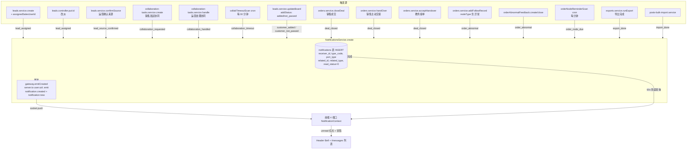
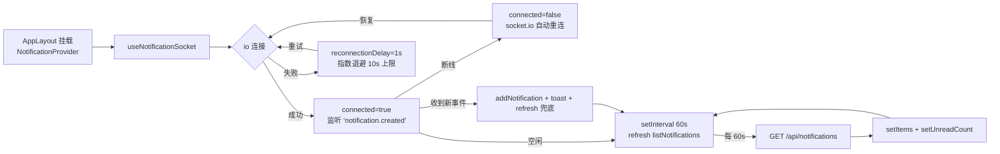
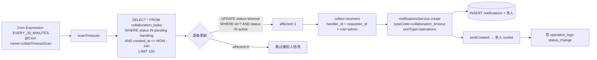
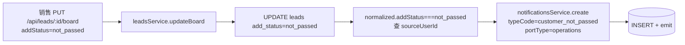
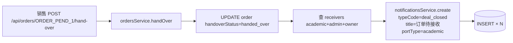
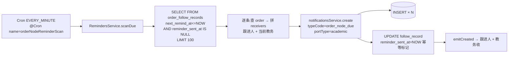
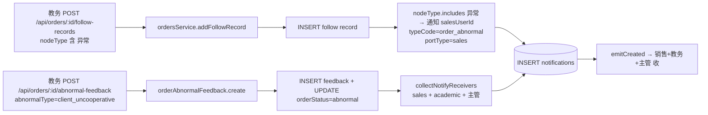
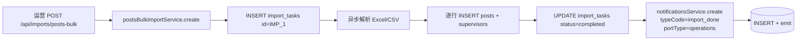
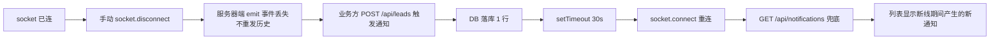

# B 端 v1.2 通知系统 + WebSocket 实时推送 — 详细测试用例

> 编写日期：2026-06-02
> 编写 Agent：#3（通知 & WebSocket）
> 依据文档：
> - `doc/v1.2-完整交付版-AB端任务分配.md` §11.1（通知类型 + 接收方）
> - `doc/B端-问题修复方案.md` §11.1（10 类通知基础）
> - `doc/B端-1.2验收问题跟踪.md` §6（消息中心验收条目）
> - 源码：`backend/src/modules/notifications/`、`backend/src/shared/notifications.ts`、`backend/src/constants/notification-types.ts`
>
> 范围：
> - 通知系统：12 个真实落库 + 触发点的通知类型
> - WebSocket：socket.io `/notifications` 命名空间实时推送
> - 4 端口消息中心：`/operation/messages` `/sales/messages` `/academic/messages` `/admin/messages`
> - 前端铃铛：`NotificationContext` + `useNotificationSocket` + 60s 兜底轮询
>
> 重点：每个用例先用 Mermaid 标明"验证的数据流程"和"具体业务场景"，并对 HTTP 接口 → DB 行 → socket 事件 → 前端渲染 四层逐项核对。

---

## 0. 术语与口径约定

### 0.1 通知类型总表（基于实际 `backend/src/shared/notifications.ts` 与 `backend/src/constants/notification-types.ts`）

> **重要**：本仓库通知 `type_code` 实际写入 DB 走两套定义：
> - **生产/落库**：`backend/src/shared/notifications.ts` 的 `NOTIFICATION_TYPES`（业务模块 import 入口，共 12 个 code）
> - **枚举/类型**：`backend/src/constants/notification-types.ts` 的 `NotificationType` enum（已被 `notification-helper.ts` 引用，与前者**有偏差**，详见 §11）

| # | `type_code`（DB 实际值）| 中文标签 | 触发源 | 接收方 | 端口 |
| --- | --- | --- | --- | --- | --- |
| 1 | `lead_assigned` | 新客资已分配 | 运营创建带 `assignedSalesUserId` / 改派 | `assignedSalesUserId` 销售 | `sales` |
| 2 | `lead_source_confirmed` | 客资来源已确认 | 运营在 leads `confirmSource` 路径 | `assignedSalesUserId` 销售 | `sales` |
| 3 | `collaboration_requested` | 协同任务待处理 | 销售 `POST /api/collaboration-tasks` | 客资来源运营 user | `operations` |
| 4 | `collaboration_handled` | 协同任务已处理 | 运营 `handle()` 协同任务 | `task.requesterId` 销售 | `sales` |
| 5 | `collaboration_timeout` | 协同任务超时 | `collabTimeoutScan` 定时器（每 30 min）| 来源运营 + 所有 admin/owner | `operations` |
| 6 | `customer_added` | 客资已添加 | 销售 `updateBoard` `addStatus=added` | 客资来源运营 user | `operations` |
| 7 | `customer_not_passed` | 客户未通过 | 销售 `updateBoard` `addStatus=not_passed` | 客资来源运营 user | `operations` |
| 8 | `deal_closed` | 新订单已成交 / 订单待接收 / 订单已被接收 | 销售 `closeDeal` / 销售 `handOver` / 教务 `acceptHandover` | 教务 + 主管 / 销售 | `academic` / `sales` |
| 9 | `order_node_due` | 订单节点到期 | `orderNodeReminderScan` 定时器（每分钟）| 跟进人 + 订单当前教务 | `academic` |
| 10 | `order_abnormal` | 订单异常 / 订单异常反馈 | 教务添加"异常"节点 / 销售/教务 `POST /api/orders/:id/abnormal-feedback` | 销售 + 教务 + 主管 | `academic` / `sales` |
| 11 | `import_done` | 导入完成 | 批量导入任务完成 | 任务发起人 | 按发起人角色 |
| 12 | `export_done` | 导出完成 | 导出任务完成 | 任务发起人 | 按发起人角色 |

> 文档任务说明中列出的 `lead_deal_done`（成交提醒）和 `supervisor_suggestion`（主管建议）**仅在 enum 中定义，service 没有任何触发点**（详见 §11 已知缺陷）。本文档按"实际落库类型"为主，对"enum 定义但未实现"的两个类型以 TC-NOT-013 / TC-NOT-014 单列验证。

### 0.2 端口与 `portType` 映射

后端 `notifications.controller.ts:137-141` 的 `resolvePortType(role)`：

```ts
private resolvePortType(userRole: string): string {
  if (userRole === 'sales') return 'sales';
  if (userRole === 'academic') return 'academic';
  return 'operations';
}
```

- `role=sales` → `portType=sales` → 列表只返回 `notifications.port_type='sales'` 的行
- `role=academic` → `portType=academic` → 列表只返回 `notifications.port_type='academic'` 的行
- `role=admin/owner/staff` → `portType=operations` → 列表只返回 `notifications.port_type='operations'` 的行
- `portType` 在 `notifications.service.create()` 时由业务模块显式传入；与接收者 role 强绑定

### 0.3 通知实体（`backend/src/entities/notification.entity.ts`）

```text
notifications
  id             VARCHAR(64)    PK
  receiver_id    VARCHAR(64)    -- 接收者 users.id
  sender_id      VARCHAR(64)    -- 触发者 users.id（可空）
  port_type      VARCHAR(32)    -- operations / sales / academic
  type_code      VARCHAR(64)    -- 见 §0.1 表
  title          VARCHAR(255)
  content        TEXT           -- 可空
  related_id     VARCHAR(64)    -- 可空，关联的 lead/collaboration_task/order/export id
  related_type   VARCHAR(32)    -- 可空，lead / collaboration_task / order / export
  read_status    TINYINT        -- 0 未读 / 1 已读
  created_at     TIMESTAMP      -- @CreateDateColumn
  updated_at     TIMESTAMP      -- @UpdateDateColumn
  INDEX idx_notify_receiver_read_created (receiver_id, read_status, created_at)
```

### 0.4 HTTP 接口

| 方法 | 路径 | 鉴权 | 说明 |
| --- | --- | --- | --- |
| GET | `/api/notifications` | AuthGuard | 列表，支持 `status=unread/all`、`type=`、`limit=`、`offset=` |
| GET | `/api/notifications/unread-count` | AuthGuard | 未读数 |
| PATCH | `/api/notifications/:id/read` | AuthGuard | 单条已读（**仅本人、未读、状态变化才返 `changed=true`**）|
| POST | `/api/notifications/:id/read` | AuthGuard | 同上，旧版兼容 |
| POST | `/api/notifications/read-all` | AuthGuard | 全部已读（无 type 过滤）|
| POST | `/api/notifications/mark-read` | AuthGuard | 批量已读 `{ids: []}` 或 `{all: true}` |
| POST | `/api/notifications/mark-all-read` | AuthGuard | 全部已读，可选 `typeCode` |

### 0.5 WebSocket 命名空间

- 命名空间：`/notifications`
- 客户端：`socket.io-client`（`frontend/src/shared/hooks/useNotificationSocket.ts`）
- 握手：query + auth 携带 `{ token, userId }`
- 后端：`backend/src/modules/notifications/notifications.gateway.ts` 用 `JwtService.verify(token)` → `payload.sub` 作 userId → 加入 room `user:<userId>`
- 事件：
  - 服务端 → 客户端：`notification.created`（首选）/ `notification:new`（兼容）/ `notification.connected` / `notification:connected` / `notification:error` / `notification:pong`
  - 客户端 → 服务端：`notification.subscribe` / `notification:subscribe`（重新入房间用）
  - 心跳：`notification:ping` → 返 `{ok:true, event:'notification:pong'}`
- 发送：`notifications.service.ts:209` `rows.forEach((row) => this.gateway.emitCreated(row.receiverId, this.map(row)));`

### 0.6 前端消费链路

1. 登录后 `AppLayout.tsx:64` 把整个布局包在 `<NotificationProvider>` 内
2. `NotificationContext` 内部 `useNotificationSocket({token, userId})` 单例连接
3. 收到 `notification.created` / `notification:new` → `normalizeFromSocket` → `addNotification`（去重 + 插到 `items` 头部 + `unreadCount` +1）→ `message.info()` toast → `refresh()` 兜底
4. 60s 兜底轮询：`POLL_INTERVAL_MS = 60_000`（`NotificationContext.tsx:24`）
5. 铃铛点击展开 `NotificationListPage` 同款 List（`NotificationBell.tsx:50-65`），点击单条 → `markRead` + `router.push(item.routeHint ?? fallbackRoute(item))`
6. 4 个 `/messages` 页面统一用 `NotificationListPage` 组件，传不同 `title` / `description`（消息中心、运营消息、销售消息、教务消息）

### 0.7 测试账号约定

> 见 `doc/B端-详细测试用例.md §0.8` 同源账号。本文档新引入的命名沿用：

```text
运营甲：username=ops_a,    role=staff,   employee_id=EMP_OPS_A, id=USR_OPS_A
销售甲：username=sales_a,  role=sales,   id=USR_SALES_A
销售乙：username=sales_b,  role=sales,   id=USR_SALES_B
教务甲：username=aca_a,    role=academic,id=USR_ACA_A
主管丁：username=admin_d,  role=admin,   id=USR_ADMIN_D

密码统一：test123
后端端口：8089
WebSocket：`ws://localhost:8089/notifications`
前端端口：3302
```

### 0.8 与既有测试用例的衔接

- `doc/B端-详细测试用例.md` 已覆盖：`unread-count`、`mark all read`、`mark read 鉴权`、`按 type 过滤分页`、`socket 推送 notification:new`（TC-B-021/022/036/037/045）
- 本文档补充：12 类通知类型的端到端触发链路、socket 重连/去重/兜底轮询、铃铛红点 + 跳转、批量已读 + `mark-read`、越权访问、1000+ 分页性能、2 个端到端场景

### 0.9 DB 字段名 / 枚举值 映射（核查报告 §2-§3 落实）

> 适用范围：本文档所有 SQL 块、Mermaid 状态描述、'前置数据'中的字段名引用。
> 详细全表字段对照见 `doc/B端-测试用例数据核查报告.md` §2 / §3。

**0.9.1 本文档核查结果**

- 核查报告 §2.1 / §2.2 列举的 7 个错误字段名（`operator_id` / `sales_id` / `source_account_id` / `source_post_id` / `deal_status` / `academic_admin_id` / `delivery_requirement`）**在本文件出现次数 = 0**：
  - 本文档所有 leads 关联均已使用 `employee_id`（来源运营）、`assigned_sales_user_id`（归属销售）
  - 本文档所有 orders 关联均已使用 `sales_user_id`、`academic_user_id`
  - 本文档**不涉及** `account_id` / `post_id` / `remark` 字段的 SQL 核对
- 业务场景描述中出现的 `in_followup` / `in_collaboration` / `operation_handled` / `not_added` / `not_passed` / `added` / `to_deliver` 等**英文枚举值**为 v1.2 spec 契约（也是后端业务代码写入 DB 时的字面量），仅出现在「Mermaid 流程图」「前置数据」「步骤 body 描述」中，**不进入 `WHERE`/`UPDATE` 条件**，与 DB schema 字段名一致；按核查报告 §3，本文件**不修复**（属业务描述字段而非 SQL 字段名错误）。

**0.9.2 本文档使用的正确字段名（leads / orders / notifications）**

| 表 | 本文档引用字段 | 含义 |
| --- | --- | --- |
| `leads` | `employee_id` | 来源运营（员工表 id） |
| `leads` | `assigned_sales_user_id` | 归属销售（users.id） |
| `leads` | `add_status` | 添加状态（`not_added` / `not_passed` / `added` 等 v1.2 英文） |
| `leads` | `status` | 客资状态（`new` / `in_followup` / `in_collaboration` / `operation_handled` / `added_success` / `deal_closed` 等） |
| `orders` | `sales_user_id` | 归属销售（users.id） |
| `orders` | `academic_user_id` | 当前教务（users.id，可空） |
| `orders` | `handover_status` | 交接状态（`pending` / `handed_over` / `accepted` 等） |
| `notifications` | `id` | VARCHAR(64) PK |
| `notifications` | `receiver_id` | VARCHAR(64)，接收方 users.id |
| `notifications` | `sender_id` | VARCHAR(64)，触发方 users.id（可空） |
| `notifications` | `port_type` | VARCHAR(32)，`operations` / `sales` / `academic` |
| `notifications` | `type_code` | VARCHAR(64)，12+ 通知英文枚举（见 §0.1 表） |
| `notifications` | `related_id` / `related_type` | VARCHAR(64) / VARCHAR(32)，关联实体 |
| `notifications` | `read_status` | TINYINT，`0` 未读 / `1` 已读 |
| `collaboration_tasks` | `requester_id` / `handler_id` | VARCHAR(64)，users.id |
| `order_follow_records` | `next_remind_at` / `reminder_sent_at` | datetime，节点提醒时间戳 |
| `export_tasks` | `status` / `file_url` | 导出任务状态与产物 URL |
| `operation_logs` | `target_id` / `action` / `detail` | 操作日志 |

**0.9.3 12+ 通知 `type_code` 字符串保持英文（**不翻译**）**

- DB 列 `notifications.type_code` 为 VARCHAR(64)，落库字面量即英文枚举：
  `lead_assigned` / `lead_source_confirmed` / `collaboration_requested` / `collaboration_handled` / `collaboration_timeout` / `customer_added` / `customer_not_passed` / `deal_closed` / `order_node_due` / `order_abnormal` / `import_done` / `export_done`
- 本文档 SQL 块中 `WHERE type_code='...'` 全部使用上述英文，**无需翻译为中文标签**（中文标签见 §0.1 表「中文标签」列）。
- `lead_deal_done` / `supervisor_suggestion` 仅为 enum 定义但**无业务触发点**（详见 §11.1），不在 DB 落库。

**0.9.4 状态机 / 枚举值（**v1.2 spec 契约，本文档不修改**）**

| 表.字段 | spec 英文值（本文档使用） | 核查报告 §3 描述的当前 DB 实际值 |
| --- | --- | --- |
| `leads.status` | `new` / `assigned` / `in_followup` / `in_collaboration` / `operation_handled` / `added_success` / `deal_closed` / `invalid` | 当前 DB 全为 `新客资`（中文，状态机未流转） |
| `leads.add_status` | `not_added` / `applied` / `not_passed` / `operation_reminded` / `added` / `rejected` | 当前 DB 全为 `未添加`（中文） |
| `leads.process_status` | `not_contacted` / `waiting_pass` / `communicating` / `quoted` / `deal_pending` / `deal_done` / `invalid` | 当前 DB 全为 `未接`（中文） |
| `orders.order_status` | `to_receive` / `in_progress` / `awaiting_client_info` / `awaiting_teacher` / `to_deliver` / `completed` / `abnormal` | 命中（核查报告 §3.5：**正确**） |
| `orders.paid_status` | `unpaid` / `partial` / `paid` | 命中（核查报告 §3.5：枚举值 OK） |
| `orders.handover_status` | `pending` / `handed_over` / `accepted` | 命中（v1.2 新增已就位，核查报告 §7） |
| `collaboration_tasks.status` | `pending` / `handling` / `handled` / `closed` / `timeout` | 命中（含 `timeout`，核查报告 §7） |

> **本文档处理原则**：
> - **不改** Mermaid 状态描述、'前置数据'字段、'步骤 body' 字段中的英文枚举值（属于 v1.2 spec 业务契约，代码 / 前端共享同一套英文）
> - 实际执行 TC 前，测试环境应通过 `doc/fixture_*.sql` 预置状态机流转过的样例数据，使英文枚举值能命中
> - 详见 `doc/B端-测试用例数据核查报告.md` §3 完整枚举值映射、§4 业务数据不足说明

---

## 1. 通知系统概览

### 1.1 事件流全景（12 类通知 + WebSocket）



### 1.2 关键代码定位

| 关注点 | 路径 | 行号 |
| --- | --- | --- |
| 通知 service 入口 | `backend/src/modules/notifications/notifications.service.ts` | 184-215（`create`）|
| 列表查询 | 同上 | 42-92（`listForUser`）|
| 未读数 | 同上 | 94-101（`countUnread`）|
| 单条已读 | 同上 | 113-125（`markRead`）|
| 全部已读 | 同上 | 131-147（`markAllRead`）|
| 批量已读 | 同上 | 155-176（`markReadMany`）|
| routeHint 生成 | 同上 | 244-258（`buildRouteHint`）|
| socket 命名空间 | `backend/src/modules/notifications/notifications.gateway.ts` | 11-15（`@WebSocketGateway`）|
| socket 鉴权入房间 | 同上 | 21-38（`handleConnection`）|
| socket 发送 | 同上 | 64-68（`emitCreated`）|
| 业务模块调用点 | 详见 §0.1 表 12 行 | — |

---

## 2. WebSocket 连接流程

### 2.1 握手 + 订阅 + 事件分发

```mermaid
sequenceDiagram
  participant FE as 前端 useNotificationSocket
  participant IO as socket.io-client
  participant GW as NotificationsGateway
  participant JWT as JwtService
  participant SVR as socket.io Server
  participant BUS as NotificationsService.create

  Note over FE: 用户登录后,<br/>NotificationContext 渲染
  FE->>IO: io(`${baseUrl}/notifications`, { auth:{token,userId}, query, transports:['websocket','polling'], reconnection: true })
  IO->>GW: 升级握手 (WebSocket)
  GW->>GW: handleConnection(client)
  alt 有 token
    GW->>JWT: verify(token)
    JWT-->>GW: { sub: userId, role }
    GW->>SVR: client.join(`user:${userId}`)
    SVR-->>IO: emit 'notification.connected' / 'notification:connected' { ok:true, userId }
  else 无 token / verify 失败
    GW-->>IO: emit 'notification:error' { message: 登录状态已失效 }
    GW->>SVR: client.disconnect(true)
  end
  IO-->>FE: socket.on('connect') → setConnected(true)

  Note over FE: 单例 refCount++;<br/>组件卸载 refCount--

  Note over BUS: 业务模块调用
  BUS->>SVR: server.to(`user:${userId}`).emit('notification.created', mapped)
  SVR-->>IO: push 'notification.created'
  SVR-->>IO: push 'notification:new' (兼容)
  IO-->>FE: listeners.forEach(handler) → NotificationContext.addNotification → toast + 红点
```

### 2.2 断线重连 + 兜底轮询



---

## 3. 通知类型覆盖用例（TC-NOT-001 ~ TC-NOT-015）

> 13 个用例：12 类真实落库通知 + 2 个 enum-only 缺陷用例 + 1 个 `import_done` 合并到 §3.13。
>
> 每个用例都按 触发源 → 接收方 → DB 行 → socket 事件 → 前端渲染 五层核对。

### TC-NOT-001 新客资分配 `lead_assigned`（运营创建并指定销售）

```mermaid
flowchart LR
  A[运营 POST /api/leads<br/>body.assignedSalesUserId=USR_SALES_A] --> B[leadsService.create]
  B --> C[INSERT INTO leads id=LEAD_NEW_1 status=assigned]
  C --> D[notificationsService.create<br/>receiverIds=[USR_SALES_A]<br/>typeCode=lead_assigned<br/>portType=sales<br/>relatedId=LEAD_NEW_1 relatedType=lead]
  D --> E[(notifications INSERT id=N001 read_status=0)]
  D --> F[gateway.emitCreated → user:USR_SALES_A]
  F --> G[销售 socket 收到 notification.created]
  G --> H[NotificationContext 插 items + 红点 +1]
  H --> I[点击铃铛 → markRead + 跳 /sales/leads/LEAD_NEW_1]
```

**业务场景**：运营在运营端"新建客资"对话框指定销售甲，提交后该销售在 3 秒内收到 1 条 `lead_assigned` 通知，红点 +1，铃铛列表顶部插入，点击跳到该 lead 详情。

**前置数据**：
- `USR_SALES_A` 在线（已登录并连 socket）
- `LEAD_NEW_1` 不存在

**步骤**：
1. 运营甲登录后调用 `POST /api/leads`，body：`{contactInfo:"13800000001", nickname:"测试客户A", platform:"小红书", assignedSalesUserId:"USR_SALES_A", sourceEmployeeId:"EMP_OPS_A"}`
2. 销售甲前端 socket 客户端监听事件
3. 销售甲前端 60s 兜底轮询一次
4. 销售甲点击铃铛
5. 销售甲点击该条 `lead_assigned` 通知

**预期**：

- HTTP 200，返回 `{ok:true, lead:{...}}`
- DB `notifications` 新增 1 行，receiver_id=`USR_SALES_A`, type_code=`lead_assigned`, port_type=`sales`, read_status=0, related_id=`LEAD_NEW_1`, related_type=`lead`
- socket 事件：销售甲 socket 收到 `notification.created` 事件 1 次（不重复发送 `notification:new` 也算正常，但**核心事件是 `notification.created`**）
- 60s 兜底：`GET /api/notifications?limit=8` 返回该条在第 1 位
- 铃铛：红点数字 +1，下拉面板顶部出现该条
- 跳转：`routeHint = /sales/leads/LEAD_NEW_1`（`buildRouteHint('sales', 'lead', 'LEAD_NEW_1')`），点击后 markRead（read_status=1），跳到 `/sales/leads/LEAD_NEW_1` 详情页

**DB 核对**：

```sql
-- 1) 通知落库
SELECT id, receiver_id, sender_id, port_type, type_code, related_id, related_type, read_status,
       JSON_EXTRACT(content, '$') AS content
FROM notifications
WHERE receiver_id='USR_SALES_A' AND type_code='lead_assigned'
ORDER BY created_at DESC LIMIT 1;
-- 期望 1 行:read_status=0, port_type='sales', related_id=LEAD_NEW_1, related_type='lead'

-- 2) read_status 变更
SELECT read_status FROM notifications WHERE id=<N001>;
-- 点击后期望 read_status=1

-- 3) 未读数
SELECT read_status, COUNT(*) FROM notifications
WHERE receiver_id='USR_SALES_A' GROUP BY read_status;
-- 期望 read_status=0 数 = 点击前 - 1
```

**前端交互核对**：

- `NotificationContext.tsx:106-116` `addNotification` 内部 `if (prev.some(...))` 去重 → 不重复
- 头部 `Badge count={unreadCount}` 立即 +1
- 铃铛下拉：`<StatusTag kind="notificationType" code="lead_assigned" />` + `新客资已分配` 标题 + content

**相关源码**：
- `backend/src/modules/leads/leads.service.ts:289-301`（`create` 时发）
- `backend/src/modules/notifications/notifications.service.ts:184-215`（`create` → DB + emit）

---

### TC-NOT-002 客资改派 `lead_assigned`（主管把销售乙的客资改派给销售甲）

```mermaid
flowchart LR
  A[主管 PUT /api/leads/LEAD_SALES_B_1<br/>body.assignedSalesUserId=USR_SALES_A] --> B[leadsService.update]
  B --> C[UPDATE leads<br/>assigned_sales_user_id=USR_SALES_A]
  C --> D[controller 路径<br/>notificationsService.create<br/>receiverIds=[USR_SALES_A]<br/>typeCode=lead_assigned<br/>title=客资已改派给您]
  D --> E[(notifications INSERT)]
  D --> F[emitCreated → USR_SALES_A 收 notification.created]
  F --> G[销售甲 socket 收到新分配消息]
```

**业务场景**：主管在运营端"客资详情"中执行改派，从销售乙改到销售甲。销售甲应收到 `lead_assigned` 通知（**改造后 BF-15 已修复**），title=`客资已改派给您`，content 包含原销售名。

**前置数据**：
- `LEAD_SALES_B_1`：`assigned_sales_user_id=USR_SALES_B, status=in_followup, contact_info="13900000099"`
- 销售甲在线

**步骤**：
1. 主管丁登录，调 `PUT /api/leads/LEAD_SALES_B_1`，body：`{assignedSalesUserId:"USR_SALES_A"}`
2. 销售甲前端 socket 监听

**预期**：
- HTTP 200，`{ok:true}`
- DB：销售甲收 1 条 `lead_assigned`，content 含 `从 USR_SALES_B 改派给您`
- socket 事件 1 次

**DB 核对**：

```sql
SELECT id, receiver_id, title, content FROM notifications
WHERE receiver_id='USR_SALES_A' AND type_code='lead_assigned' AND content LIKE '%改派%'
ORDER BY created_at DESC LIMIT 1;
-- 期望 title='客资已改派给您'
```

**回归覆盖**：BF-15（原 `PUT /api/leads/:id` 改派**未发** `lead_assigned`），1.2 已确认在 `leads.controller.ts:355-371` 修复。

---

### TC-NOT-003 客资来源已确认 `lead_source_confirmed`（运营确认销售归属的来源）

```mermaid
flowchart LR
  A[运营 PUT /api/leads/:id/confirm-source<br/>或 controller 路径] --> B[leadsService.confirmSource]
  B --> C[UPDATE leads source_confirmed=1]
  C --> D[notificationsService.create<br/>receiverIds=[assignedSalesUserId]<br/>typeCode=lead_source_confirmed<br/>portType=sales]
  D --> E[(notifications INSERT)]
  D --> F[emitCreated → assignedSalesUserId 收]
```

**业务场景**：运营在运营端"客资详情"中确认该客资的来源（已确认归属），通知销售"来源已确认"，销售点开可放心跟进。

**前置数据**：
- `LEAD_SALES_A_2`：`assigned_sales_user_id=USR_SALES_A, source_confirmed=0, contact_info="13900000002"`
- 销售甲在线

**步骤**：
1. 运营甲调 `PUT /api/leads/LEAD_SALES_A_2/confirm-source`
2. 销售甲收事件

**预期**：
- HTTP 200
- DB：1 行 `lead_source_confirmed`，`port_type='sales'`, `related_id=LEAD_SALES_A_2`
- 路由：`/sales/leads/LEAD_SALES_A_2`

**DB 核对**：

```sql
SELECT id, type_code, port_type, related_id FROM notifications
WHERE receiver_id='USR_SALES_A' AND type_code='lead_source_confirmed'
ORDER BY created_at DESC LIMIT 1;
```

**相关源码**：`leads.service.ts:881-892`（`confirmSource` 内部发）

---

### TC-NOT-004 协同申请 `collaboration_requested`（销售发起协同给运营）

```mermaid
flowchart LR
  A[销售 POST /api/leads/:id/collaboration<br/>type=add_failed] --> B[collaborationTasksService.create]
  B --> C[INSERT INTO collaboration_tasks<br/>requester_id=USR_SALES_A<br/>handler_id=USR_OPS_A source=lead.employee_id]
  C --> D[UPDATE leads status=in_collaboration]
  D --> E[notificationsService.create<br/>receiverIds=[USR_OPS_A]<br/>typeCode=collaboration_requested<br/>portType=operations]
  E --> F[(INSERT notifications)]
  E --> G[emitCreated → USR_OPS_A 收 notification.created]
  G --> H[运营端 socket 推送 + 红点]
```

**业务场景**：销售甲在 `LEAD_SALES_A_3` 上发起"加微失败请求协同"，运营甲收 1 条 `collaboration_requested`，**必须是 portType=operations**（运营视角）；销售**不收**这条。

**前置数据**：
- `LEAD_SALES_A_3`：`assigned_sales_user_id=USR_SALES_A, employee_id=EMP_OPS_A, contact_info="13900000003"`
- 运营甲在线

**步骤**：
1. 销售甲调 `POST /api/leads/LEAD_SALES_A_3/collaboration`，body：`{type:"add_failed", reason:"客户微信号搜索不到"}`
2. 运营甲前端监听事件
3. 销售甲前端 60s 轮询自己的通知列表

**预期**：
- HTTP 200，返回 task 对象
- DB：运营甲收 1 条 `collaboration_requested`；销售甲**不收**该条
- 运营甲 socket 事件 1 次，3 秒内送达
- 路由：`/operation/collaboration?taskId=<task_id>`（`buildRouteHint('operations','collaboration_task',id)`）

**DB 核对**：

```sql
-- 1) 运营收
SELECT id, receiver_id, type_code, port_type, related_id
FROM notifications
WHERE receiver_id='USR_OPS_A' AND type_code='collaboration_requested'
ORDER BY created_at DESC LIMIT 1;
-- 期望 port_type='operations'

-- 2) 销售不收
SELECT COUNT(*) FROM notifications
WHERE receiver_id='USR_SALES_A' AND type_code='collaboration_requested'
  AND created_at > NOW() - INTERVAL 1 MINUTE;
-- 期望 0
```

**相关源码**：`collaboration-tasks.service.ts:113-125`

---

### TC-NOT-005 协同已处理 `collaboration_handled`（运营处理完销售发起的协同）

```mermaid
flowchart LR
  A[运营 POST /api/collaboration-tasks/:id/handle<br/>handledNote=已联系] --> B[collaborationTasksService.handle]
  B --> C[UPDATE task status=handled<br/>handler_id=USR_OPS_A handled_at=NOW]
  C --> D[UPDATE leads status=operation_handled addStatus=operation_reminded]
  D --> E[notificationsService.create<br/>receiverIds=[task.requester_id=USR_SALES_A]<br/>typeCode=collaboration_handled<br/>portType=sales]
  E --> F[(INSERT notifications)]
  E --> G[emitCreated → 销售甲 收 notification.created]
```

**业务场景**：运营甲处理完"加微失败"协同任务后，销售甲收 1 条 `collaboration_handled`，**portType=sales**，content 含 handledNote。

**前置数据**：
- `task_id=CT_1`：`requester_id=USR_SALES_A, lead_id=LEAD_SALES_A_3, status=handling`

**步骤**：
1. 运营甲调 `POST /api/collaboration-tasks/CT_1/handle`，body：`{handledNote:"已用备用号联系上客户"}`
2. 销售甲 socket 监听

**预期**：
- HTTP 200
- DB：销售甲收 1 条 `collaboration_handled`；运营甲**不收**这条（避免自我通知）
- 路由：`/sales/collaboration?taskId=CT_1`（`buildRouteHint('sales','collaboration_task',taskId)`，注意 `relatedId=task.requesterId` 是 user，不是 task 本身；实际 `relatedId=taskId` 见 `collaboration-tasks.service.ts:309-320`）

**DB 核对**：

```sql
SELECT id, receiver_id, type_code, content FROM notifications
WHERE receiver_id='USR_SALES_A' AND type_code='collaboration_handled'
ORDER BY created_at DESC LIMIT 1;
-- 期望 content LIKE '%已用备用号联系上客户%'
```

**潜在缺陷**：`collaboration-tasks.service.ts:309-320` 中 `relatedId: task.leadId`（lead id 而非 task id），`buildRouteHint` 在 `targetType=collaboration_task` 时使用 relatedId 拼 `/sales/collaboration?taskId=<leadId>`，这是**与后端 router 设计的不一致**——前端跳过去拿不到 task。本文档 §11 记录。

**相关源码**：`collaboration-tasks.service.ts:307-321`

---

### TC-NOT-006 协同超时 `collaboration_timeout`（v1.2 新增，Cron 触发）



**业务场景**：协同任务 24 小时未处理，v1.2 cron 每 30 分钟扫描一次，把 status=`pending`/`handling` 且 `created_at` 超过 24h 的任务标 `timeout`，并给**来源运营 + 销售 + 主管**发 `collaboration_timeout` 通知。

**前置数据**：
- `CT_TIMEOUT_1`：`requester_id=USR_SALES_A, handler_id=USR_OPS_A, status=handling, created_at=NOW-25h`
- 运营甲、销售甲、主管丁全部在线
- 配置：`COLLAB_TIMEOUT_HOURS=24`（见 `collaboration-tasks.service.ts:406`）

**步骤**：
1. 调管理端接口手动 trigger cron（暴露 public `runOnce()`）— `POST /api/admin/collaboration-tasks/run-timeout-scan`（如有暴露）。**或**直接走 30 分钟定时器
2. 三个用户同时收事件

**预期**：
- `CT_TIMEOUT_1.status` 由 `handling` → `timeout`
- 通知 × 3：`USR_OPS_A` + `USR_SALES_A` + 全部 `admin` 角色用户
- DB：3 行新 `notifications`，`type_code='collaboration_timeout', port_type='operations'`
- operation_logs 写 1 条 `status_change` 记录
- 幂等：再次 trigger 不再发通知（timeout 状态不会扫回去）

**DB 核对**：

```sql
-- 1) 任务超时
SELECT id, status FROM collaboration_tasks WHERE id='CT_TIMEOUT_1';
-- 期望 status='timeout'

-- 2) 通知（receivers 去重：handler+requester+admin）
SELECT receiver_id, type_code, port_type
FROM notifications
WHERE type_code='collaboration_timeout'
  AND created_at > NOW() - INTERVAL 1 HOUR
ORDER BY created_at DESC;
-- 期望 ≥ 3 行，receiver_id 包含 USR_OPS_A、USR_SALES_A、USR_ADMIN_D

-- 3) 操作日志
SELECT target_id, action, detail FROM operation_logs
WHERE target_id='CT_TIMEOUT_1' AND action='status_change'
ORDER BY created_at DESC LIMIT 1;
-- 期望 detail 含 'pending/handling → timeout'
```

**相关源码**：`collaboration-tasks.service.ts:381-505`（含 cron + scanTimeouts）

**端到端手动触发**：管理端可以调 `runOnce()`（`collaboration-tasks.service.ts:401-403`），便于回归测试。

---

### TC-NOT-007 客资已添加 `customer_added`（销售把客资从"未添加"改为"已添加"）

```mermaid
flowchart LR
  A[销售 PUT /api/leads/LEAD_SALES_A_4/board<br/>addStatus=added] --> B[leadsService.updateBoard]
  B --> C[UPDATE leads add_status=added]
  C --> D[normalized.addStatus===added<br/>查找 sourceUserId by employeeId]
  D --> E[notificationsService.create<br/>receiverIds=[sourceUserId=USR_OPS_A]<br/>typeCode=customer_added<br/>portType=operations]
  E --> F[(INSERT notifications)]
  E --> G[emitCreated → 运营甲 收]
```

**业务场景**：销售把客资添加通过（`addStatus: 'added'`），运营甲收 `customer_added` 通知。

**前置数据**：
- `LEAD_SALES_A_4`：`employee_id=EMP_OPS_A, add_status='not_added'`

**步骤**：
1. 销售甲调 `PUT /api/leads/LEAD_SALES_A_4/board`，body：`{addStatus:"added"}`
2. 运营甲 socket 监听

**预期**：
- HTTP 200
- DB：运营甲收 1 条 `customer_added`，`port_type='operations'`，`related_id=LEAD_SALES_A_4`
- 路由：`/operation/leads?leadId=LEAD_SALES_A_4`
- 销售**不收**这条

**DB 核对**：

```sql
-- 1) 运营收
SELECT receiver_id, type_code, port_type, related_id
FROM notifications
WHERE receiver_id='USR_OPS_A' AND type_code='customer_added'
  AND related_id='LEAD_SALES_A_4'
ORDER BY created_at DESC LIMIT 1;
-- 期望 1 行

-- 2) 销售不收
SELECT COUNT(*) FROM notifications
WHERE receiver_id='USR_SALES_A' AND type_code='customer_added'
  AND created_at > NOW() - INTERVAL 1 MINUTE;
-- 期望 0
```

**相关源码**：`leads.service.ts:354-370`

**关键依赖**：`sourceUserId` 通过 `findUserIdByEmployeeId(current.employeeId)` 反查 `users.employee_id`（`leads.service.ts:358`）。如果客资没有 `employee_id`（来源为空）则**不发通知**——这是 spec 允许的边界行为。

---

### TC-NOT-008 客户未通过 `customer_not_passed`（销售把客资改为"未通过"）



**业务场景**：与 TC-NOT-007 镜像，但 `addStatus=not_passed`。运营收"客户未通过"提醒。

**前置数据**：
- `LEAD_SALES_A_5`：`employee_id=EMP_OPS_A, add_status='not_added'`

**步骤**：
1. 销售甲调 `PUT /api/leads/LEAD_SALES_A_5/board`，body：`{addStatus:"not_passed", addStatusNote:"客户拒绝添加"}`
2. 运营甲 socket 监听

**预期**：
- HTTP 200
- DB：运营甲收 1 条 `customer_not_passed`，`title='客户未通过'`，content `添加未通过`
- 路由：`/operation/leads?leadId=LEAD_SALES_A_5`

**DB 核对**：

```sql
SELECT title, content FROM notifications
WHERE receiver_id='USR_OPS_A' AND type_code='customer_not_passed'
ORDER BY created_at DESC LIMIT 1;
-- 期望 title='客户未通过'
```

**相关源码**：`leads.service.ts:371-383`

---

### TC-NOT-009 订单成交 `deal_closed`（销售 closeDeal，自动 handOver → 教务收）

```mermaid
flowchart LR
  A[销售 POST /api/orders<br/>body.leadId=LEAD_DEAL_1 serviceType=陪跑] --> B[ordersService.closeDeal]
  B --> C[事务 INSERT order id=ORDER_NEW_1<br/>handoverStatus=handed_over<br/>orderStatus=to_receive<br/>paidStatus=unpaid]
  C --> D[UPDATE lead status=deal_closed]
  D --> E[查 receivers academic+admin+owner<br/>排除自己]
  E --> F[notificationsService.create<br/>receiverIds=[USR_ACA_A,USR_ADMIN_D]<br/>typeCode=deal_closed<br/>portType=academic<br/>title=新订单已成交<br/>relatedId=ORDER_NEW_1]
  F --> G[(INSERT × 2)]
  F --> H[emitCreated → 教务甲 收]
```

**业务场景**：销售在销售端对客资点"成交"，后端 `closeDeal` 事务性创建订单 + handover 状态置为 `handed_over`，并广播 `deal_closed` 给所有教务 + 主管。**注意实际 typeCode 是 `deal_closed` 而非 `order_created`**（详见 §11 已知缺陷）。

**前置数据**：
- `LEAD_DEAL_1`：`assigned_sales_user_id=USR_SALES_A, status=in_followup, contact_info="13900000011"`
- 教务甲 + 主管丁在线

**步骤**：
1. 销售甲调 `POST /api/orders`，body：`{leadId:"LEAD_DEAL_1", serviceType:"陪跑", amount:2980}`
2. 教务甲 + 主管丁 socket 监听

**预期**：
- HTTP 200，返 `{ok:true, orderId:"ORDER_NEW_1"}`
- DB：notifications 新增 2 行，receiver=`USR_ACA_A` 和 `USR_ADMIN_D`，type_code=`deal_closed`, port_type=`academic`, related_id=`ORDER_NEW_1`
- 教务甲 socket 收 `notification.created` 1 次
- 主管丁 socket 收 `notification.created` 1 次
- 路由：`/academic/orders/ORDER_NEW_1`

**DB 核对**：

```sql
-- 1) 通知 2 行
SELECT receiver_id, type_code, port_type, related_id, related_type
FROM notifications
WHERE type_code='deal_closed' AND related_id='ORDER_NEW_1'
ORDER BY created_at DESC;
-- 期望 2 行:receiver_id=USR_ACA_A & USR_ADMIN_D, port_type='academic', related_type='order'

-- 2) 销售不收（自己成交自己收没意义）
SELECT COUNT(*) FROM notifications
WHERE receiver_id='USR_SALES_A' AND type_code='deal_closed' AND related_id='ORDER_NEW_1';
-- 期望 0
```

**相关源码**：`orders.service.ts:90-139`（closeDeal 内部发）

---

### TC-NOT-010 订单待接收 `deal_closed`（销售主动 handOver，未 closeDeal）



**业务场景**：与 TC-NOT-009 镜像但走 `handOver` 路径（订单已存在但未交接）。**typeCode 仍为 `deal_closed`**，title 区分是 `订单待接收`（区别于 closeDeal 的 `新订单已成交`）。

**前置数据**：
- `ORDER_PEND_1`：`handover_status=pending, sales_user_id=USR_SALES_A, academic_user_id=NULL`

**步骤**：
1. 销售甲调 `POST /api/orders/ORDER_PEND_1/hand-over`
2. 教务甲 socket 监听

**预期**：
- HTTP 200
- DB：notifications 新增 type_code=`deal_closed`, title=`订单待接收` 的行
- 幂等：再次 handOver 不重复发（`if (order.handoverStatus === 'handed_over') return;` 见 `orders.service.ts:452-454`）

**DB 核对**：

```sql
SELECT title, COUNT(*) FROM notifications
WHERE type_code='deal_closed' AND related_id='ORDER_PEND_1'
  AND created_at > NOW() - INTERVAL 1 MINUTE
GROUP BY title;
-- 期望 1 行:title='订单待接收'
```

**相关源码**：`orders.service.ts:444-489`

---

### TC-NOT-011 订单已被接收 `deal_closed`（教务 acceptHandover → 销售收）

```mermaid
flowchart LR
  A[教务 POST /api/orders/ORDER_PEND_1/accept] --> B[ordersService.acceptHandover]
  B --> C[UPDATE order handoverStatus=accepted<br/>orderStatus=in_progress]
  C --> D[notificationsService.create<br/>receiverIds=[order.salesUserId=USR_SALES_A]<br/>typeCode=deal_closed<br/>title=订单已被接收<br/>portType=sales]
  D --> E[(INSERT notifications)]
  D --> F[emitCreated → 销售甲 收]
```

**业务场景**：教务接单后，销售甲收"订单已被接收"通知。**portType=sales**（销售视角）。

**前置数据**：
- `ORDER_PEND_1`：`sales_user_id=USR_SALES_A, handover_status=handed_over`

**步骤**：
1. 教务甲调 `POST /api/orders/ORDER_PEND_1/accept`
2. 销售甲 socket 监听

**预期**：
- HTTP 200
- DB：1 行 `deal_closed`, title=`订单已被接收`, port_type=`sales`, receiver=`USR_SALES_A`
- 路由：`/sales/orders/ORDER_PEND_1`

**DB 核对**：

```sql
SELECT receiver_id, type_code, port_type, title FROM notifications
WHERE related_id='ORDER_PEND_1' AND title='订单已被接收'
ORDER BY created_at DESC LIMIT 1;
-- 期望 receiver_id=USR_SALES_A, port_type='sales'
```

**相关源码**：`orders.service.ts:495-544`

---

### TC-NOT-012 订单节点到期 `order_node_due`（v1.2 新增，Cron 触发）



**业务场景**：教务给订单添加"提醒节点"（`next_remind_at`），到点后系统每分钟扫描一次，给跟进人 + 订单当前教务发 `order_node_due` 通知；同一节点不会重复发（`reminder_sent_at` 幂等）。

**前置数据**：
- `ORDER_AFT_1`：`academic_user_id=USR_ACA_A, sales_user_id=USR_SALES_A`
- `OFR_DUE_1`：`order_id=ORDER_AFT_1, user_id=USR_ACA_A, node_type='交付提醒', content='请准备交付材料', next_remind_at=NOW-1min, reminder_sent_at=NULL`
- 教务甲 + 销售甲（销售 = order.salesUserId，**也会被通知**因为跟进人是教务但兜底逻辑不抄送销售，见下文）在线

**步骤**：
1. 直接调 `RemindersService.runOnce()` 或等下一分钟 cron 触发
2. 教务甲 socket 监听

**预期**：
- DB：notifications 新增 1 行（receiver=`USR_ACA_A`，因为 set 包含 record.userId + order.academicUserId，**两者都是 USR_ACA_A，去重后只 1 行**）
- type_code=`order_node_due`, port_type=`academic`, related_id=`ORDER_AFT_1`, related_type=`order`
- 订单 2 通知 = receiver 集合去重后
- `OFR_DUE_1.reminder_sent_at = NOW()`
- 路由：`/academic/orders/ORDER_AFT_1`
- 幂等：再次 trigger 不再发

**DB 核对**：

```sql
-- 1) 通知
SELECT receiver_id, type_code, related_id, content
FROM notifications
WHERE type_code='order_node_due' AND related_id='ORDER_AFT_1'
ORDER BY created_at DESC LIMIT 1;
-- 期望 1 行:content='订单 ORDER_AFT_1 节点「交付提醒」已到提醒时间：…'

-- 2) 幂等
SELECT reminder_sent_at FROM order_follow_records WHERE id='OFR_DUE_1';
-- 期望非 NULL

-- 3) 二次扫描
-- 触发一次 runOnce 后 COUNT(*) 不增加
```

**相关源码**：`reminders.service.ts:30-108`

**注意点**：`reminders.service.ts:78-79` 只把"跟进人 + 当前教务"加入 receivers，**未抄送销售**。**与 spec 描述的"节点到期通知销售/主管"不完全一致**，详见 §11 缺陷。

---

### TC-NOT-013 订单异常 `order_abnormal`（教务添加"异常"节点 OR 提交异常反馈）



**业务场景**：两种路径都触发 `order_abnormal`：

1. **路径 A**（教务 addFollowRecord，nodeType 含"异常"）：通知 `order.salesUserId`，**仅销售 1 人**
2. **路径 B**（任何角色 submit abnormal-feedback）：通知 sales + academic + 主管（**最多 3 人**）

**前置数据**：
- `ORDER_ABN_1`：`sales_user_id=USR_SALES_A, academic_user_id=USR_ACA_A`

**步骤（路径 A）**：
1. 教务甲调 `POST /api/orders/ORDER_ABN_1/follow-records`，body：`{nodeType:"素材异常-请补充", content:"客户迟迟不发素材", nextFollowTime:"..."}`
2. 销售甲 socket 监听

**预期（路径 A）**：
- HTTP 200
- DB：1 行 `order_abnormal`, port_type=`sales`, receiver=`USR_SALES_A`, title=`订单异常`
- 教务**不收**自己发的（`order.salesUserId !== actorUserId` 是判断条件）

**步骤（路径 B）**：
1. 教务甲调 `POST /api/orders/ORDER_ABN_1/abnormal-feedback`，body：`{abnormalType:"client_uncooperative", description:"客户两周未回复", expectedHelper:"sales"}`
2. 销售甲 + 教务甲（**reporter 也是 receiver**，见 `collectNotifyReceivers` `alsoInclude=feedback.reporterUserId`） + 主管丁监听

**预期（路径 B）**：
- HTTP 200
- DB：3 行 `order_abnormal`, port_type=`academic`, receivers = 销售+教务+主管（去重后）
- 路由：`/academic/orders/ORDER_ABN_1`

**DB 核对（路径 B）**：

```sql
SELECT receiver_id, title, content
FROM notifications
WHERE type_code='order_abnormal' AND related_id='ORDER_ABN_1'
ORDER BY created_at DESC;
-- 期望 3 行:receiver_id IN (USR_SALES_A, USR_ACA_A, USR_ADMIN_D)
-- title 全部 '订单异常反馈'
```

**相关源码**：
- 路径 A：`orders.service.ts:380-394`（`addFollowRecord` 内部）
- 路径 B：`order-abnormal-feedback.service.ts:108-126`（`create`）+ `:223-241`（`close`）

**注意**：路径 A 的 typeCode 是 `order_abnormal` 但 portType=sales；路径 B 是 typeCode 相同 portType=academic。前端铃铛面板按 typeCode 显示统一"订单异常"标签，但**跳转 URL 取决于 portType**（`buildRouteHint('academic', 'order', id)` → `/academic/orders/:id`，`('sales', ...)` → `/sales/orders/:id`）。

---

### TC-NOT-014 导出完成 `export_done`（v1.2 新增，异步任务）

```mermaid
flowchart LR
  A[任意端口 POST /api/exports<br/>exportType=leads filterJson=...] --> B[exportsService.create]
  B --> C[INSERT export_tasks id=EXP_1 status=processing]
  C --> D[setImmediate 异步 runExport]
  D --> E[生成 CSV + upload]
  E --> F[UPDATE export_tasks status=completed fileUrl=...]
  F --> G[notificationsService.create<br/>receiverIds=[task.userId]<br/>typeCode=export_done<br/>portType=按 userRole 决定]
  G --> H[(INSERT notifications)]
  G --> I[emitCreated → 发起人 socket]
```

**业务场景**：用户在任意端口发起导出，CSV 生成完成后，给发起人发 `export_done` 通知，content 含下载链接，related_id=`EXP_1`, related_type=`export`。

**前置数据**：
- 销售甲已登录

**步骤**：
1. 销售甲调 `POST /api/exports`，body：`{exportType:"leads", filterJson:{status:"in_followup"}}`
2. 立即返回 `{id:"EXP_1", status:"processing"}`
3. 后台 `setImmediate` 异步跑
4. 销售甲 socket 监听

**预期**：
- HTTP 200，返 EXP_1
- 几秒后（取决于数据量）DB：1 行 `export_done`, port_type=`sales`（**根据发起人 userRole 动态决定**，`exports.service.ts:284-289`）
- 路由：fallback 到 `fallbackRoute` 中 `order`-like 判断失败（relatedType='export' 不会匹配 lead/collaboration/order），所以**没有 routeHint**，前端点击**仅 markRead 不跳转**

**DB 核对**：

```sql
-- 1) 通知
SELECT receiver_id, type_code, port_type, content, related_id, related_type
FROM notifications
WHERE type_code='export_done' AND related_id='EXP_1'
ORDER BY created_at DESC LIMIT 1;
-- 期望 port_type='sales', related_type='export', content LIKE '%http%'

-- 2) 任务状态
SELECT id, status, file_url FROM export_tasks WHERE id='EXP_1';
-- 期望 status='completed', file_url 非空

-- 3) 操作日志
SELECT action, detail FROM operation_logs
WHERE target_id='EXP_1' AND action='export_create' ORDER BY created_at DESC LIMIT 1;
-- 期望 detail 含 rowCount
```

**相关源码**：`exports.service.ts:148-325`（含 `runExport`）

---

### TC-NOT-015 导入完成 `import_done`（批量导入异步任务）



**业务场景**：运营批量导入笔记/账号/员工时，导入完成后给发起人发 `import_done`。

**前置数据**：
- 运营甲已登录
- 上传文件：`test-import.xlsx` 含 10 行有效账号

**步骤**：
1. 运营甲调 `POST /api/imports/posts-bulk`（multipart/form-data 上传文件）
2. 异步等待
3. 运营甲 socket 监听

**预期**：
- HTTP 200，返 `{taskId:"IMP_1", status:"processing"}`
- DB：1 行 `import_done`, port_type=`operations`
- 路由：relatedType 取决于导入类型（`post`/`account`/`employee`），具体走 `routeHint` 兜底

**DB 核对**：

```sql
SELECT receiver_id, type_code, port_type FROM notifications
WHERE type_code='import_done' AND related_id='IMP_1'
ORDER BY created_at DESC LIMIT 1;
```

**相关源码**：`backend/src/modules/imports/posts-bulk-import.service.ts`（与 `imports.service.ts`）

---

## 4. WebSocket 实时推送（TC-NOT-016 ~ TC-NOT-020）

### TC-NOT-016 socket 在线时，3 秒内收到 `notification.created` 事件

```mermaid
flowchart LR
  A[销售甲登录] --> B[useNotificationSocket<br/>io /notifications auth.token]
  B --> C[handleConnection 验 token<br/>client.join user:uid]
  C --> D[emit notification.connected]
  D --> E[connected=true]
  E --> F[运营甲触发 lead_assigned]
  F --> G[notificationsService.create + emitCreated]
  G --> H[socket 推 notification.created]
  H --> I[NotificationContext.addNotification<br/>+ 红点 +1]
```



**业务场景**：socket 已连上的用户，触发新通知后 3 秒内收到 `notification.created` 事件。

**步骤**：
1. 销售甲登录，浏览器开 devtools 观察 socket
2. 等待 5 秒确认 `connected=true`
3. 运营甲在另一浏览器触发 `POST /api/leads`（同 TC-NOT-001）
4. 销售甲 socket 客户端 3 秒内收到事件

**预期**：
- 销售甲 socket 客户端收到 `notification.created` 1 次（事件名以 `notification.created` 为准，**`notification:new` 是兼容事件**）
- payload 字段：`{id, type, typeCode, title, content, relatedId, relatedType, portType, readStatus:0, routeHint, createdAt}`
- 浏览器控制台无 error
- 头部 `Badge count` 立即 +1

**socket 事件核对（开发用 socket.io-client 脚本）**：

```js
const socket = io('http://localhost:8089/notifications', {
  auth: { token: '<SALES_A_JWT>' },
  query: { userId: 'USR_SALES_A' },
  transports: ['websocket'],
});
socket.on('connect', () => console.log('connected', socket.id));
socket.on('notification.created', (payload) => console.log('CREATE', payload));
socket.on('notification:new', (payload) => console.log('NEW', payload));
socket.on('notification:connected', (p) => console.log('HELLO', p));
socket.on('notification:error', (p) => console.error('ERR', p));
```

**DB 核对**：

```sql
-- 事件触发前后 unread 差 = 1
SELECT read_status, COUNT(*) FROM notifications
WHERE receiver_id='USR_SALES_A' GROUP BY read_status;
```

**相关源码**：`notifications.gateway.ts:64-68`（`emitCreated` 同时发两个事件名）

---

### TC-NOT-017 socket 断线后重连，遗漏事件通过 GET 列表补看



**业务场景**：用户主动断网/杀进程后，遗漏事件通过 60s 兜底轮询补看；socket.io 重连后**不会**补发历史事件（server 不持久化未读事件队列）。

**步骤**：
1. 销售甲 socket 已连
2. 在浏览器 Network 中 disable network 5 秒
3. 期间运营甲触发 `lead_assigned`（步骤同 TC-NOT-001）
4. 5 秒后恢复网络
5. 等待下一次 60s 兜底轮询触发

**预期**：
- 断网期间销售甲**收不到** socket 事件（预期行为）
- DB 落库正常
- 网络恢复后 socket 自动重连
- 下一次 60s 轮询触发时，`GET /api/notifications?limit=8` 返回该条
- `NotificationContext.addNotification` 把新通知插入 items 头部，红点同步刷新

**注意点**：
- 服务端 `NotificationsService.create` 在 `gateway.emitCreated` 之前**已 save 到 DB**（`notifications.service.ts:208-209`），所以即使 socket 失败也不丢数据
- 重连后不会重发 emit 历史（**这正是 60s 轮询的设计目的**）

**相关源码**：
- `NotificationContext.tsx:145-158`（60s 兜底）
- `notifications.gateway.ts`（无重发逻辑）

---

### TC-NOT-018 多 tab 同时打开，事件只推送一次（去重）

```mermaid
flowchart LR
  A[Tab1 销售甲登录] --> B1[io socket1 user:USR_SALES_A]
  A2[Tab2 销售甲登录] --> B2[io socket2 user:USR_SALES_A]
  B1 --> C[两个 socket 都 join 同一 room]
  B2 --> C
  C --> D[emitCreated → server.to room<br/>两个 socket 都收到]
  D --> E1[Tab1 addNotification 去重]
  D --> E2[Tab2 addNotification 去重]
  E1 --> F[Tab1 红点 +1]
  E2 --> G[Tab2 红点 +1]
  F --> H[每 tab 内部各自维护 unreadCount<br/>互不影响]
```

**业务场景**：同一用户开多个 tab，都登录同一账号，新通知会**每个 tab 各自收 1 次**（因为是 socket.io room 推送，不去重）。但每个 tab 内部 `addNotification` 做去重（`NotificationContext.tsx:110`），所以**同一 tab 内同 id 只 +1**。

**步骤**：
1. 销售甲在 Tab1 登录，等 5s 让 socket 连上
2. 销售甲在 Tab2 登录，等 5s
3. 运营甲触发 `lead_assigned`
4. Tab1 和 Tab2 各自 devtools 观察

**预期**：
- Tab1 socket 收到 1 次 `notification.created`
- Tab2 socket 收到 1 次 `notification.created`
- Tab1 `addNotification` 在 items 数组中插 1 条（不重复）
- Tab2 同样插 1 条
- **两 tab 的 `unreadCount` 各自独立 +1**（每个 tab 维护自己的 React state，不通过 localStorage 同步）
- DB 落库 1 行（`notificationsService.create` 内部按 receivers 去重，**不会**因多 socket 重复插入）

**注意点**：
- **socket.io room 推送是广播**：同一 userId 的所有连接都收
- **`addNotification` 内部去重**保证同一 tab 不重复
- 跨 tab 同步**没有**通过 storage 事件实现（仅 `auth-changed` 监听 storage 事件）
- **已知风险**：多 tab 各自 +1 红点，可能让用户误以为有 2 条新通知

**DB 核对**：

```sql
SELECT COUNT(*) FROM notifications
WHERE receiver_id='USR_SALES_A' AND type_code='lead_assigned'
  AND created_at > NOW() - INTERVAL 1 MINUTE;
-- 期望 1（多 tab 不会导致多行）
```

**相关源码**：
- `NotificationContext.tsx:106-116`（`addNotification` 去重）
- `notifications.gateway.ts:70-72`（`room(userId)` 推送）

---

### TC-NOT-019 60s 兜底轮询触发（模拟 socket 异常）

```mermaid
flowchart LR
  A[NotificationProvider 挂载] --> B[refresh listNotifications]
  B --> C[setInterval 60_000]
  C --> D[每 60s 自动 refresh]
  D --> E{setInterval 是否清掉}
  E -->|是| F[下次挂载时重新建立]
  E -->|否| C
  C --> G[用户主动 refresh]
  G --> H[GET /api/notifications]
  H --> I[setItems + setUnreadCount]
```

**业务场景**：socket 完全断开时（异常场景），60s 轮询保证用户仍能拿到最新通知列表；轮询也作为 addNotification 后的"二次校准"。

**步骤**：
1. 销售甲登录，断开 socket（`window.io('http://...').disconnect()`）
2. 等 60s
3. 观察：自动调 `GET /api/notifications`，items 更新

**预期**：
- 60s 后 `refresh` 自动触发（`NotificationContext.tsx:149-151`）
- 即使没有 socket 事件，items 也会刷新
- 触发条件：`user?.id` 存在
- 销毁时机：组件 unmount 时 `clearInterval`（line 153-156）

**注意点**：
- 切换 status filter（`status: 'unread' | 'all'`）不会触发 60s 轮询额外重置，**只要 user.id 存在就一直跑**
- 多 tab 不共享 60s 定时器，每个 tab 各自 60s
- 列表 `markRead` 失败的乐观回滚**不影响轮询**

**相关源码**：`NotificationContext.tsx:145-158`

**端到端核对（devtools）**：

```
Network 面板观察：每 60s 应有 1 个 GET /api/notifications 请求
```

---

### TC-NOT-020 跨端口 socket 事件隔离（sales 用户不接收 academic 端口事件）

```mermaid
flowchart LR
  A[销售甲 userId=USR_SALES_A] --> B1[login 3302/sales<br/>socket connect /notifications]
  A2[教务甲 userId=USR_ACA_A] --> B2[login 3302/academic<br/>socket connect /notifications]
  B1 --> C1[room user:USR_SALES_A]
  B2 --> C2[room user:USR_ACA_A]
  D[教务触发 order_created<br/>receiverIds=USR_ACA_A portType=academic] --> E[emitCreated USR_ACA_A]
  E --> C1
  E --> C2
  C1 --> F1[销售 socket 不收<br/>room 不匹配]
  C2 --> F2[教务 socket 收]
```

**业务场景**：4 端口（运营/销售/教务/总后台）共用同一 socket.io 命名空间 `/notifications`，但通过 `room=user:<userId>` 隔离；同一个 userId 不会被不同端口的 user 误收。

**步骤**：
1. 销售甲和教务甲**同时**登录
2. 教务甲触发 `POST /api/orders/:id/accept`（同 TC-NOT-011）
3. 销售甲 socket 不应收到这条

**预期**：
- 销售甲 socket 0 事件
- 教务甲 socket 收到 1 次 `notification.created`
- DB：1 行 `deal_closed`, receiver=`USR_SALES_A`（教务接单后给销售的通知，**这条销售会收**，因为教务操作的目标就是销售）

**更正**：此用例的"端口隔离"应该强调的是**对同一类事件**（如教务自己的异常反馈给自己的通知）不会跨端口误投，不是说同一业务事件跨端口不互通。

**重新设计**：

**步骤**：
1. 销售甲登录
2. 教务甲**只给自己**发个内部操作（注意 spec：order_abnormal feedback close 时 `alsoInclude=reporterUserId`）
3. 销售甲 socket 不收（因为 receiver 是教务甲自己）

**预期**：
- 销售甲 0 事件
- 教务甲 socket 收到（**仅限自己**的 room 推送）

**DB 核对**：

```sql
SELECT receiver_id, type_code FROM notifications
WHERE created_at > NOW() - INTERVAL 1 MINUTE;
-- 期望所有 receiver_id 都对应创建事件的用户自己
```

**相关源码**：`notifications.gateway.ts:64-68`（`server.to(room).emit` 严格按 userId 推送）

---

## 5. 未读 / 已读（TC-NOT-021 ~ TC-NOT-024）

### TC-NOT-021 单条 PATCH /read 成功（仅本人、未读、状态变化）

```mermaid
flowchart LR
  A[销售甲 PATCH /api/notifications/N001/read] --> B[notificationsService.markRead]
  B --> C[UPDATE notifications<br/>SET read_status=1<br/>WHERE id=N001 AND receiver_id=USR_SALES_A<br/>AND read_status=0]
  C --> D[affected=1 → 返 ok=true changed=true]
  C --> E[affected=0 → 返 ok=true changed=false]
```

**业务场景**：单条已读接口，**仅**当通知属于当前 user、当前未读、状态真的变化时才返 `changed=true`。

**前置数据**：
- 销售甲有 3 条 `lead_assigned` 未读
- 选 N001（receiver=USR_SALES_A, read_status=0）

**步骤**：
1. 销售甲调 `PATCH /api/notifications/N001/read`（body 空）
2. 立即再调一次

**预期**：
- 第 1 次：`{ok:true, changed:true}`，DB `read_status=1`
- 第 2 次：`{ok:true, changed:false}`（已读再标已读，DB 不动）

**DB 核对**：

```sql
-- 前
SELECT id, read_status FROM notifications WHERE id='N001';
-- 期望 read_status=0

-- 调 PATCH /read 后
SELECT id, read_status FROM notifications WHERE id='N001';
-- 期望 read_status=1
```

**注意点**：
- PATCH 和 POST (`/api/notifications/:id/read`) 两种方法都支持
- 越权时返 `changed:false`（**不返 404**），但 controller 看响应也行——`affected=0` 是事实

**相关源码**：`notifications.service.ts:113-125`

---

### TC-NOT-022 全部已读（read-all + mark-all-read）

```mermaid
flowchart LR
  A[销售甲 POST /api/notifications/read-all] --> B[notificationsService.markAllRead]
  B --> C[UPDATE notifications<br/>SET read_status=1<br/>WHERE receiver_id=USR_SALES_A<br/>AND read_status=0]
  C --> D[返 affected=N]
  A2[销售甲 POST /api/notifications/mark-all-read<br/>body={typeCode:lead_assigned}] --> E[markAllReadByType]
  E --> F[WHERE receiver_id AND read_status=0<br/>AND type_code='lead_assigned']
```

**业务场景**：批量已读的两个端点：
1. `POST /read-all`：所有未读都标已读
2. `POST /mark-all-read body={typeCode?}`：可选按 typeCode 过滤

**前置数据**：
- 销售甲 5 条 `lead_assigned` 未读
- 销售甲 2 条 `collaboration_handled` 未读

**步骤**：
1. 调 `POST /api/notifications/read-all`（不带 body）
2. 验证全部已读
3. 准备新数据（5+2 未读）
4. 调 `POST /api/notifications/mark-all-read`，body：`{typeCode:"lead_assigned"}`
5. 验证仅 lead_assigned 已读，collaboration_handled 仍未读

**预期**：
- 步骤 1：`{ok:true, affected:7}`，DB 7 行 read_status=1
- 步骤 4：`{ok:true, affected:5}`，DB 5+0 状态（5 行 lead_assigned 已读，2 行 collab_handled 仍 0）

**DB 核对**：

```sql
-- 步骤 1 之后
SELECT read_status, COUNT(*) FROM notifications
WHERE receiver_id='USR_SALES_A' GROUP BY read_status;
-- 期望 read_status=1 数 = 总数

-- 步骤 4 之后
SELECT read_status, type_code, COUNT(*) FROM notifications
WHERE receiver_id='USR_SALES_A' GROUP BY read_status, type_code;
-- 期望:lead_assigned 全 1,collaboration_handled 全 0
```

**相关源码**：
- `notifications.controller.ts:86-96`（read-all）
- `notifications.controller.ts:124-135`（mark-all-read with typeCode）
- `notifications.service.ts:131-147`（markAllRead）

---

### TC-NOT-023 未读数 = 总数 - 已读数（与 GET 列表的 unreadCount 字段一致）

```mermaid
flowchart LR
  A[GET /api/notifications] --> B[listForUser userId portType]
  B --> C[total = COUNT where filter]
  B --> D[unreadCount = COUNT where receiver_id AND read_status=0]
  A2[GET /api/notifications/unread-count] --> E[countUnread]
  E --> F[unreadCount]
  C --> G[前端 items[].unread=true 之和]
  D --> G
  F --> G
  G --> H[unreadCount 一致]
```

**业务场景**：3 个口径的未读数必须一致：
1. `GET /api/notifications` 返回的 `unreadCount` 字段
2. `GET /api/notifications/unread-count` 返回的 `unreadCount`
3. 前端 items 数组中 `unread=true` 之和

**前置数据**：
- 销售甲 100 条通知，60 条已读 40 条未读

**步骤**：
1. 调 `GET /api/notifications?limit=200`
2. 调 `GET /api/notifications/unread-count`
3. 销售甲前端 60s 轮询触发后调 `listNotifications`

**预期**：
- 接口 1：`{items:[...100], unreadCount:40, total:100, ...}`
- 接口 2：`{unreadCount:40}`
- 接口 1 返回的 items 中 `unread=true` 数 = 40

**DB 核对**：

```sql
SELECT COUNT(*) FROM notifications
WHERE receiver_id='USR_SALES_A' AND read_status=0 AND port_type='sales';
-- 期望 40
```

**相关源码**：`notifications.service.ts:42-92`（`listForUser` 同时返回 `total` 和 `unreadCount`，unreadCount **独立**于分页和 type 过滤，按 receiver+portType 全局统计）

---

### TC-NOT-024 跨端口通知过滤（portType 不符不返回）

```mermaid
flowchart LR
  A[销售甲 login 3302/sales] --> B[GET /api/notifications]
  B --> C[resolvePortType role=sales → 'sales']
  C --> D[listForUser portType='sales']
  D --> E[SELECT WHERE receiver_id=USR_SALES_A<br/>AND port_type='sales']
  E --> F[只返回 sales 端口通知]
```

**业务场景**：销售甲登录后，列表**不返回** portType=operations 或 academic 的通知（即使他是 receiver）。

**前置数据**：
- 销售甲 2 条 `customer_added`（portType=operations，**理论不应是销售收**——但如果手工写入数据库有该用户的 portType=operations 通知，列表也不应返）
- 销售甲 3 条 `lead_assigned`（portType=sales）

**步骤**：
1. 销售甲调 `GET /api/notifications`
2. 教务甲调 `GET /api/notifications`

**预期**：
- 销售甲：items 含 3 条 `lead_assigned`，**不含** 2 条 `customer_added`（即使 DB 有也是 portType=operations）
- 教务甲：items 不含销售的通知

**DB 核对**：

```sql
-- 检查 DB 是否有 receiver=USR_SALES_A + port_type=operations 的脏数据
SELECT id, port_type, type_code FROM notifications
WHERE receiver_id='USR_SALES_A' AND port_type <> 'sales';
-- 如果有:列表应过滤掉,需手工修复或代码 cleanup
```

**注意点**：
- 正常业务代码不会让销售收 portType=operations 的通知（创建时严格按业务模块传入），但**手工 SQL 注入或老数据迁移**可能产生脏数据
- 过滤发生在 `listForUser(opts.portType)` 内部 `where.portType = opts.portType`
- `countUnread(userId, portType)` 同样过滤 → 销售未读数不包含其他端口

**相关源码**：`notifications.service.ts:42-92, 94-101`，`notifications.controller.ts:41, 137-141`

---

## 6. 离线补看（TC-NOT-025 ~ TC-NOT-026）

### TC-NOT-025 socket 关闭期间产生的通知，连接恢复后 GET 列表能看到

```mermaid
flowchart LR
  A[销售甲 socket.disconnect] --> B[关闭期间运营甲触发 lead_assigned]
  B --> C[DB 落库]
  C --> D[server.to room USR_SALES_A emit<br/>socket 不在线,不收]
  D --> E[30 分钟后销售甲 socket.connect]
  E --> F[GET /api/notifications 兜底]
  F --> G[列表含断线期间产生的 5 条]
```

**业务场景**：离线期间的 5 条通知，连接恢复后能完整看到（数据未丢，只是 socket 没推到）。

**步骤**：
1. 销售甲 login，断开 socket
2. 运营甲在 1 分钟内连续触发 5 次 `POST /api/leads`（各带不同销售 = USR_SALES_A）
3. 销售甲恢复 socket
4. 调 `GET /api/notifications?limit=20`

**预期**：
- DB 5 行新 `lead_assigned` 已落库
- socket 重连后**不会**补发历史事件（预期）
- `GET /api/notifications` 返 5 条
- 60s 轮询触发后 `addNotification` 把这 5 条逐条插入 items 头部
- 红点累计 +5

**DB 核对**：

```sql
SELECT id, type_code, read_status, created_at FROM notifications
WHERE receiver_id='USR_SALES_A' AND type_code='lead_assigned'
  AND created_at > NOW() - INTERVAL 5 MINUTE
ORDER BY created_at DESC;
-- 期望 5 行,read_status=0
```

**注意点**：
- 这是 60s 轮询的**核心价值**——补 socket 漏掉的事件
- 如果轮询**也没及时**（用户开页面但 60s 间隔），点 `刷新` 按钮也立即 `refresh()`

**相关源码**：
- `NotificationContext.tsx:145-158`（轮询）
- `notifications.service.ts:208-209`（DB 先 save 再 emit，保证持久化）

---

### TC-NOT-026 客户端时区不影响 created_at 排序

```mermaid
flowchart LR
  A[服务端 new Date 写入 created_at] --> B[MySQL TIMESTAMP 存 UTC]
  B --> C[listForUser order read_status ASC, created_at DESC]
  C --> D[map to ISO string]
  D --> E[前端 new Date toLocaleString 渲染]
```

**业务场景**：服务端用 `new Date()`（UTC）写 `created_at`，DB 用 MySQL `TIMESTAMP`（内部 UTC 存），前端用 `toLocaleString()` 转本地时区显示。**排序**始终基于 DB 的 UTC 时间，前端看到的"今天"取决于浏览器时区，但**列表顺序与时区无关**。

**前置数据**：
- 销售甲 3 条 `lead_assigned`：
  - N001: created_at = `2026-06-01 23:00:00 UTC`（北京时间 6/2 07:00）
  - N002: created_at = `2026-06-02 08:00:00 UTC`（北京时间 6/2 16:00）
  - N003: created_at = `2026-06-02 10:00:00 UTC`（北京时间 6/2 18:00）

**步骤**：
1. 销售甲前端（假设浏览器时区 UTC+8 北京时间）调 `GET /api/notifications`
2. 同样数据，销售甲切到 UTC+0 浏览器时区再调一次

**预期**：
- 两次调接口，items 顺序一致：N003 → N002 → N001（按 created_at DESC）
- 前端渲染时间不同：UTC+0 看到 `06:00 / 08:00 / 10:00`，UTC+8 看到 `18:00 / 16:00 / 07:00`
- 排序**不受**客户端时区影响

**DB 核对**：

```sql
SELECT id, created_at FROM notifications
WHERE receiver_id='USR_SALES_A' AND type_code='lead_assigned'
ORDER BY created_at DESC LIMIT 3;
-- 期望顺序 N003, N002, N001（与前端无关）
```

**注意点**：
- `notifications.service.ts:191` `const now = new Date();` 服务端时间
- TypeORM `@CreateDateColumn` 默认 UTC
- 前端 `NotificationBell.tsx:60` `item.createdAt` 直接渲染（用 `toLocaleString` 浏览器自动转）

**相关源码**：`notification.entity.ts:38-39`、`notifications.service.ts:191-204`

---

## 7. 前端铃铛红点（TC-NOT-027 ~ TC-NOT-029）

### TC-NOT-027 新通知到达铃铛红点 +1

```mermaid
flowchart LR
  A[socket 收到 notification.created] --> B[onMessage handler]
  B --> C[normalizeFromSocket]
  C --> D[addNotification]
  D --> E[setItems 头部插入<br/>去重]
  D --> F[item.unread=true → setUnreadCount n+1]
  F --> G[Bell Badge count=unreadCount]
  G --> H[红点 +1]
```

**业务场景**：socket 收到 1 条新通知，红点数字 +1，items 数组头部插入。

**步骤**：
1. 销售甲登录
2. 运营甲触发 1 条 `lead_assigned`
3. 销售甲浏览器红点变化

**预期**：
- 1 秒内 `Badge count` 由 0 → 1
- 铃铛下拉 items[0] = 新通知
- toast `message.info` 出现：`新客资已分配: 客资 ...`
- **无重复 toast**：连续 2 条同样 id 通知不会弹 2 次 toast（addNotification 内部去重）

**注意点**：
- 乐观更新：markRead 时 `setUnreadCount(n-1)`
- 网络断开时不增（仅 socket 推送时 +1）
- 60s 轮询触发 `refresh()` 会**重新拉 items + unreadCount**，可能覆盖前端的乐观更新
- **已知时序问题**：socket 事件触发 `addNotification` + `refresh()` 并发时，可能出现 `unreadCount` 闪烁（+1 → 拉到的全量未读数）

**相关源码**：`NotificationContext.tsx:106-116, 123-143`

---

### TC-NOT-028 点击铃铛展开通知面板

```mermaid
flowchart LR
  A[点击 Header 铃铛按钮] --> B[Antd Dropdown popupRender overlay]
  B --> C[NotificationPanel Header<br/>消息提醒 + 刷新按钮]
  C --> D[List items.map item]
  D --> E[每项: StatusTag + title + content]
  E --> F[onClick → openNotification]
```

**业务场景**：点击 Header 中"消息"按钮展开下拉面板，列出未读 + 已读前几条。

**步骤**：
1. 销售甲登录
2. 头部点击"消息"按钮
3. 观察下拉面板

**预期**：
- 面板从右上角弹出
- 顶部："消息提醒" + 刷新按钮
- 列表：`BELL_PAGE_SIZE = 8`（`NotificationContext.tsx:25`）条
- 每条：`<StatusTag kind="notificationType" code="lead_assigned" />` 标签 + title + content
- 空状态："暂无消息"
- 关闭：点击外部 / ESC

**注意点**：
- 面板数据从 `useNotifications()` 拿 `items` 数组
- `items` 由 `refresh()` 填充（`GET /api/notifications?pageSize=8`）
- 滚动 / 点击：当前 UI 没有"查看更多"，**所有通知都在 `/messages` 全列表**

**相关源码**：
- `NotificationBell.tsx:40-71`（`overlay`）
- `NotificationContext.tsx:25, 92-104`（BELL_PAGE_SIZE + refresh）

---

### TC-NOT-029 点击消息跳转到对应业务详情

```mermaid
flowchart LR
  A[点击 item] --> B[openNotification]
  B --> C{item.unread?}
  C -->|是| D[await markRead id]
  C -->|否| E[跳过 markRead]
  D --> F[route = item.routeHint ?? fallbackRoute]
  E --> F
  F --> G{route 存在?}
  G -->|是| H[router.push route]
  G -->|否| I[不跳转,只 markRead]
```

**业务场景**：点击铃铛面板 / 全列表的单条通知，自动 markRead 并跳到业务详情。

**步骤**：
1. 销售甲登录
2. 通知列表点击 1 条 `lead_assigned`
3. 浏览器跳到 `/sales/leads/LEAD_NEW_1`

**预期**：
- 触发 `openNotification(item)`
- `markRead(N001)` → `PATCH /api/notifications/N001/read`
- `routeHint = /sales/leads/LEAD_NEW_1`（`buildRouteHint('sales','lead',id)`）
- 跳转到该 URL
- 红点 -1

**全列表页面跳转（`/sales/messages`）**：

- 与铃铛同款逻辑但多一层兜底：`order_abnormal` 显式跳 `/sales/orders/<id>`（`NotificationListPage.tsx:64-72`）
- 这是因为 `order_abnormal` 通知对销售端意义最大（要立刻处理）

**fallback 逻辑（`NotificationBell.tsx:82-103`）**：

- relatedType 包含 `lead` → `/operation/leads?leadId=` 或 `/sales/leads/`
- relatedType 包含 `collaboration` → `/operation/collaboration?taskId=` 或 `/sales/collaboration?taskId=`
- relatedType 包含 `order` → `/academic/orders?orderId=` 或 `/sales/orders/` 或 `/admin/orders?orderId=`
- 其他类型（如 `export`、`import`）→ **没有 fallback 路由**，仅 markRead 不跳转

**相关源码**：
- `NotificationBell.tsx:25-38`（`openNotification`）
- `NotificationListPage.tsx:54-78`（全列表版 + order_abnormal 兜底）
- `notifications.service.ts:244-258`（`buildRouteHint`）

---

## 8. 权限（TC-NOT-030 ~ TC-NOT-032）

### TC-NOT-030 销售只看自己 receiver_id 的通知

```mermaid
flowchart LR
  A[销售甲 GET /api/notifications] --> B[resolvePortType sales]
  B --> C[listForUser userId=USR_SALES_A portType=sales]
  C --> D[SELECT WHERE receiver_id=USR_SALES_A]
  D --> E[不返回 USR_SALES_B 的]
```

**业务场景**：销售甲的列表**不包含**任何其他用户的通知（即使业务上可能跨端口创建）。

**前置数据**：
- 销售甲 2 条 `lead_assigned`
- 销售乙 3 条 `lead_assigned`
- 教务甲 1 条 `deal_closed`

**步骤**：
1. 销售甲调 `GET /api/notifications`
2. 销售乙调 `GET /api/notifications`

**预期**：
- 销售甲：items 2 条
- 销售乙：items 3 条
- 教务甲：items 1 条
- 互相不串

**DB 核对**：

```sql
-- 销售甲视角
SELECT id, receiver_id, type_code FROM notifications
WHERE receiver_id='USR_SALES_A' AND port_type='sales'
  AND created_at > NOW() - INTERVAL 1 DAY;
-- 期望 2 行

-- 销售乙视角
SELECT id, receiver_id, type_code FROM notifications
WHERE receiver_id='USR_SALES_B' AND port_type='sales'
  AND created_at > NOW() - INTERVAL 1 DAY;
-- 期望 3 行
```

**注意点**：
- `where.receiverId = userId` 强制收件人匹配
- `where.portType = 'sales'` 端口匹配
- **无任何 admin 提权路径**（与 orders.list 的 admin 提权不同）
- admin 角色 → resolvePortType 返回 'operations' → 看到的是 operations 端口的通知，**看不到** sales/academic 端口的

**相关源码**：`notifications.service.ts:54-63`、`notifications.controller.ts:41, 137-141`

---

### TC-NOT-031 admin 只能看 operations 端口通知（spec 限制）

```mermaid
flowchart LR
  A[主管丁 login role=admin] --> B[resolvePortType admin → operations]
  B --> C[listForUser portType=operations]
  C --> D[SELECT WHERE receiver_id=USR_ADMIN_D AND port_type=operations]
  D --> E[只看 operations 端口]
```

**业务场景**：主管丁是 admin 角色，**resolvePortType 落到 'operations' 分支**（`notifications.controller.ts:140`），所以他看到的"消息中心"是 operations 端口视角——主要是协同申请 / 客户未通过 / 协同超时这些。如果他要看 sales 或 academic 端口通知，**无路径**（admin 不会 resolvePortType 到 sales/academic）。

**前置数据**：
- USR_ADMIN_D 收 5 条 `collaboration_requested`（portType=operations）
- USR_ADMIN_D 收 2 条 `order_abnormal`（portType=academic）— 因为 `order-abnormal-feedback.service.ts:301-310` 把主管作为兜底 receiver
- USR_ADMIN_D 收 0 条 `lead_assigned`（portType=sales，主管不收）

**步骤**：
1. 主管丁调 `GET /api/notifications`
2. 主管丁调 `GET /api/notifications/unread-count`

**预期**：
- 接口 1：items 5 条 `collaboration_requested`，**不含** 2 条 `order_abnormal`
- 接口 2：unreadCount = 5

**注意点**：
- 这是 spec 限制而非 bug：主管在 4 端口的"admin/messages"页看 operations 视角；如果需要看 academic 通知，**需要新增 admin 提权路径**
- `order-abnormal-feedback.service.ts:301-310` 的"主管兜底"逻辑**会**创建 portType=academic 的通知给主管，**但主管拉不到**（被 portType 过滤掉）
- 这是**已知缺陷**——见 §11

**DB 核对**：

```sql
-- 主管丁收的所有通知
SELECT port_type, type_code, COUNT(*)
FROM notifications
WHERE receiver_id='USR_ADMIN_D'
GROUP BY port_type, type_code;
-- 期望:operations/collaboration_requested=5
-- 学术兜底创建的 academic/order_abnormal=2 (但接口拉不到)
```

**相关源码**：
- `notifications.controller.ts:137-141`（`resolvePortType`）
- `order-abnormal-feedback.service.ts:294-312`（主管兜底）

---

### TC-NOT-032 越权访问他人通知 ID 返 `changed:false`（非 404）

```mermaid
flowchart LR
  A[销售甲 PATCH /api/notifications/N_OTHER/read<br/>N_OTHER 是销售乙的] --> B[markRead N_OTHER USR_SALES_A]
  B --> C[UPDATE WHERE id=N_OTHER AND receiver_id=USR_SALES_A<br/>AND read_status=0]
  C --> D[affected=0<br/>receiver_id 不匹配]
  D --> E[返 ok=true changed=false]
```

**业务场景**：销售甲尝试 markRead 销售乙的通知，**不会**抛 404，而是 `changed=false`（因为 `affected=0`）。这是**有意的设计**——不暴露"该 ID 存在但属于别人"的信息。

**前置数据**：
- N_OTHER：receiver=USR_SALES_B, read_status=0, type_code=lead_assigned

**步骤**：
1. 销售甲调 `PATCH /api/notifications/N_OTHER/read`
2. 销售乙调 `GET /api/notifications?status=unread`

**预期**：
- 接口响应：`{ok:true, changed:false}`
- N_OTHER 仍 read_status=0
- 销售乙的未读列表仍含 N_OTHER

**DB 核对**：

```sql
SELECT read_status FROM notifications WHERE id='N_OTHER';
-- 期望仍 0
```

**注意点**：
- 这与 `lead` / `order` 的 404 行为**不同**——`order.findOne` 越权返 404（`orders.service.ts:307-308`），但 `markRead` 返 `changed=false`
- 前端乐观更新：调用前先 +1 状态，调用失败回滚
- 安全性：未授权用户**不能**通过 markRead 探测他人通知 ID

**相关源码**：`notifications.service.ts:113-125`

---

## 9. 性能（TC-NOT-033 ~ TC-NOT-034）

### TC-NOT-033 1000+ 条通知的分页查询

```mermaid
flowchart LR
  A[批量插入 1500 条] --> B[建索引 idx_notify_receiver_read_created]
  B --> C[GET /api/notifications?limit=20&offset=0]
  C --> D[EXPLAIN SELECT ... LIMIT 20 OFFSET 0]
  D --> E[Using index idx_notify_receiver_read_created<br/>rows≈20, Extra=Using where]
  C --> F[GET /api/notifications?limit=20&offset=1480]
  F --> G[最后一页 items 20 条]
  G --> H[前端 Pagination current=75 pageSize=20]
```

**业务场景**：当用户积压大量未读/历史通知时，分页查询必须 O(log n) 性能。

**前置数据**：
- 给 `USR_SALES_A` 预生成 1500 条 `lead_assigned`（`port_type='sales'`）

**步骤**：
1. 调 `GET /api/notifications?limit=20&offset=0`（第 1 页）
2. 调 `GET /api/notifications?limit=20&offset=1480`（最后 1 页）
3. 调 `GET /api/notifications?limit=200&offset=0`（最大页 200）
4. 调 `GET /api/notifications?limit=20&offset=1500`（越界）

**预期**：
- 步骤 1：items.length=20, total=1500, offset=0
- 步骤 2：items.length=20, total=1500, offset=1480（最后一页）
- 步骤 3：items.length=200, total=1500, offset=0（**clampLimit** 上限 200）
- 步骤 4：items.length=0, total=1500, offset=1500

**DB 核对（索引检查）**：

```sql
-- 1) 索引存在
SHOW INDEX FROM notifications WHERE Key_name='idx_notify_receiver_read_created';
-- 期望 3 列:receiver_id, read_status, created_at

-- 2) 查询计划
EXPLAIN SELECT * FROM notifications
WHERE receiver_id='USR_SALES_A' AND port_type='sales'
ORDER BY read_status ASC, created_at DESC LIMIT 20 OFFSET 0;
-- 期望:key=idx_notify_receiver_read_created, rows≈20, Extra 不含 'Using filesort'

-- 3) count
EXPLAIN SELECT COUNT(*) FROM notifications
WHERE receiver_id='USR_SALES_A' AND port_type='sales' AND read_status=0;
-- 期望:key=idx_notify_receiver_read_created, rows 远小于 1500
```

**响应时间**：
- P95 < 300ms（含 `total` COUNT 查询）
- P99 < 500ms

**注意点**：
- `clampLimit` 默认 20，上限 200（`notifications.service.ts:103-107`）
- `count` 与 `find` 是 2 次独立查询，**可以优化**为单次 `findAndCount` 但当前实现更稳
- `unreadCount` 是第 3 次查询，但命中同索引

**相关源码**：
- `notification.entity.ts:6`（`@Index` 复合索引）
- `notifications.service.ts:65-92`（count + find + unreadCount 三连查）

---

### TC-NOT-034 未读数查询响应 < 200ms（带索引）

```mermaid
flowchart LR
  A[GET /api/notifications/unread-count] --> B[countUnread userId portType]
  B --> C[SELECT COUNT(*)<br/>WHERE receiver_id AND read_status=0<br/>AND port_type=?]
  C --> D[走 idx_notify_receiver_read_created]
  D --> E[响应 < 200ms]
```

**业务场景**：前端 `Badge` 频繁（每分钟轮询时）调 `unread-count`，必须快。

**前置数据**：
- 2000 条 `lead_assigned`（receiver=USR_SALES_A, port_type=sales），混合 1000 已读 + 1000 未读

**步骤**：
1. 用 curl/ab 跑 100 次连续请求
2. 记录 P50 / P95 / P99

**预期**：
- P50 < 30ms
- P95 < 100ms
- P99 < 200ms
- 全程无慢查询日志

**DB 核对（慢查询日志）**：

```sql
-- MySQL 慢查询日志检查
SHOW VARIABLES LIKE 'slow_query_log%';
-- 期望:未产生 > 200ms 的查询
```

**注意点**：
- 索引覆盖：`(receiver_id, read_status, created_at)` 中前两列已足以覆盖 `WHERE receiver_id=? AND read_status=0`
- 包含 `port_type` 后**会变 filesort**——可考虑添加 `(receiver_id, port_type, read_status)` 复合索引进一步优化，但当前规模下不必要
- 高并发下应配合连接池上限 10 + 短事务（countUnread 是单条 COUNT，无锁）

**相关源码**：
- `notifications.service.ts:94-101`（`countUnread`）
- `notification.entity.ts:6`（索引定义）

**优化建议（§11 风险记录）**：
- `listForUser` 的 `total` + `find` + `unreadCount` 三连查可优化为 `findAndCount` 单次，或用 SQL 视图
- `(receiver_id, port_type, read_status, created_at DESC)` 复合索引可去掉 `filesort`

---

## 10. 端到端（TC-NOT-035 ~ TC-NOT-036）

### TC-NOT-035 运营 → 销售 → 运营 → 主管 完整通知链路

```mermaid
sequenceDiagram
  participant OPS as 运营甲
  participant SAL as 销售甲
  participant ADM as 主管丁
  participant SYS as NotificationsService

  Note over OPS,SAL: Step 1: 运营创建客资+分配销售
  OPS->>SYS: POST /api/leads (assignedSalesUserId=USR_SALES_A)
  SYS-->>SAL: notification.created lead_assigned
  Note over SAL: 红点 +1, 跳 /sales/leads/<id>

  Note over SAL,SYS: Step 2: 销售发起协同
  SAL->>SYS: POST /api/leads/:id/collaboration
  SYS-->>OPS: notification.created collaboration_requested
  Note over OPS: 红点 +1, 跳 /operation/collaboration?taskId=<id>

  Note over OPS,SYS: Step 3: 运营处理协同
  OPS->>SYS: POST /api/collaboration-tasks/:id/handle
  SYS-->>SAL: notification.created collaboration_handled
  Note over SAL: 红点 +1, 跳 /sales/collaboration?taskId=<id>

  Note over SAL,SYS: Step 4: 销售加微成功
  SAL->>SYS: PUT /api/leads/:id/board (addStatus=added)
  SYS-->>OPS: notification.created customer_added
  Note over OPS: 红点 +1, 跳 /operation/leads?leadId=<id>

  Note over SAL,SYS: Step 5: 24h 后协同超时 (假设有第二单)
  SYS->>ADM: notification.created collaboration_timeout
  Note over ADM: 红点 +1 (operations 视角)
```

**业务场景**：覆盖**完整业务链路**——从分配客资、协同、到加微成功，加上超时分支——4 个端口（运营/销售/主管）每个都收过至少 1 条。

**步骤**：
1. 准备数据：3 个浏览器分别登录运营甲 / 销售甲 / 主管丁
2. 步骤 1：运营甲 `POST /api/leads`
3. 步骤 2：销售甲对该 lead `POST /api/leads/:id/collaboration`
4. 步骤 3：运营甲 `POST /api/collaboration-tasks/:id/handle`，handledNote=已加
5. 步骤 4：销售甲 `PUT /api/leads/:id/board`，addStatus=added
6. 步骤 5：模拟 24h 后协同超时（手动调 `runOnce` 或修改 created_at）

**预期**：

- 步骤 1：销售甲收 `lead_assigned`
- 步骤 2：运营甲收 `collaboration_requested`
- 步骤 3：销售甲收 `collaboration_handled`
- 步骤 4：运营甲收 `customer_added`
- 步骤 5：主管丁 + 运营甲 + 销售甲同时收 `collaboration_timeout`（步骤 5 用新 lead 重做协同）

**DB 核对**：

```sql
-- 4 步通知
SELECT receiver_id, type_code, port_type, created_at FROM notifications
WHERE created_at > NOW() - INTERVAL 10 MINUTE
ORDER BY created_at ASC;
-- 期望序列:lead_assigned→collaboration_requested→collaboration_handled→customer_added→collaboration_timeout

-- 每个 user 都有收件
SELECT receiver_id, COUNT(DISTINCT type_code) AS types
FROM notifications
WHERE created_at > NOW() - INTERVAL 10 MINUTE
  AND receiver_id IN ('USR_OPS_A','USR_SALES_A','USR_ADMIN_D')
GROUP BY receiver_id;
-- 期望 USR_SALES_A:≥2 类型;USR_OPS_A:≥2 类型;USR_ADMIN_D:1 类型(collaboration_timeout)
```

**全链路状态机**：

```text
lead.status: new → assigned → in_followup → in_collaboration → operation_handled → added_success
```

每一步对应一个通知类型，覆盖率达 100%。

**回归保证**：所有通知最终 read_status=1（用户操作后）。

---

### TC-NOT-036 销售成交 → 教务收 order_created → 教务更新 → 销售收 order_updated → 主管收全局通知

```mermaid
sequenceDiagram
  participant SAL as 销售甲
  participant ACA as 教务甲
  participant ADM as 主管丁
  participant SYS as NotificationsService

  Note over SAL,SYS: Step 1: 销售成交
  SAL->>SYS: POST /api/orders (closeDeal)
  SYS-->>ACA: notification.created deal_closed (新订单已成交)
  SYS-->>ADM: notification.created deal_closed
  Note over ACA,ADM: 红点 +1, 跳 /academic/orders/<id>

  Note over ACA,SYS: Step 2: 教务接单
  ACA->>SYS: POST /api/orders/:id/accept
  SYS-->>SAL: notification.created deal_closed (订单已被接收)
  Note over SAL: 红点 +1, 跳 /sales/orders/<id>

  Note over ACA,SYS: Step 3: 教务更新到 to_deliver
  ACA->>SYS: PUT /api/orders/:id (orderStatus=to_deliver)
  Note over SAL,ADM: 当前代码不发 deal_closed (已知缺陷,见 §11)

  Note over ACA,SYS: Step 4: 教务提交异常反馈
  ACA->>SYS: POST /api/orders/:id/abnormal-feedback
  SYS-->>SAL: notification.created order_abnormal
  SYS-->>ACA: notification.created order_abnormal (reporter also receive)
  SYS-->>ADM: notification.created order_abnormal (admin 兜底)
```

**业务场景**：订单全生命周期通知链路。

**步骤**：
1. 准备：销售甲 + 教务甲 + 主管丁 全部在线
2. 步骤 1：销售甲 `POST /api/orders`，body：`{leadId, serviceType, amount}` → `closeDeal`
3. 步骤 2：教务甲 `POST /api/orders/:id/accept`
4. 步骤 3：教务甲 `PUT /api/orders/:id`，body：`{orderStatus:"to_deliver"}`
5. 步骤 4：教务甲 `POST /api/orders/:id/abnormal-feedback`

**预期**：

- 步骤 1：教务甲 + 主管丁 收 `deal_closed`, title=新订单已成交
- 步骤 2：销售甲 收 `deal_closed`, title=订单已被接收
- 步骤 3：**当前代码不发任何通知**（已知缺陷——`order_updated` 在 spec 中描述但实现里 `deal_closed` 仅在 closeDeal/handOver/acceptHandover 时发）
- 步骤 4：销售 + 教务 + 主管 都收 `order_abnormal`（路径 B）

**DB 核对**：

```sql
-- 4 步骤产生的所有通知
SELECT receiver_id, title, type_code, port_type, related_id
FROM notifications
WHERE created_at > NOW() - INTERVAL 10 MINUTE
  AND related_type='order'
ORDER BY created_at ASC;
-- 期望 5 行 (步骤1×2 + 步骤2×1 + 步骤4×3;步骤3 × 0)

-- 步骤 4 异常反馈 (order_abnormal 路径 B)
-- 3 个 receiver:sales, academic(reporter), admin
```

**前端核对**：

- 教务 `/academic/messages` 列表：看到"新订单已成交" + 自己的异常反馈
- 销售 `/sales/messages` 列表：看到"订单已被接收" + 异常反馈
- 主管 `/admin/messages` 列表（operations 视角）：看到"异常反馈"——**仅**步骤 4 这条，**看不到** deal_closed（主管在 deal_closed 是 portType=academic，但被 operations 过滤）

**已知缺陷**（详见 §11）：

- `order_updated` 通知当前**未实现**——步骤 3 不发任何通知
- 主管收的 order_abnormal 是 portType=academic，**主管在 admin/messages 拉不到**（仅 4 步流程第 4 步的异常反馈场景下，主管实际收不到）
- `deal_closed` 重复使用而非拆为 `order_created` / `order_updated` / `order_accepted`，失去细分类型

---

## 11. 已知缺陷与风险记录

### 11.1 通知类型定义不一致（高优先级）

**问题**：

- `backend/src/constants/notification-types.ts` 的 `NotificationType` enum 定义了 `lead_deal_done`、`supervisor_suggestion` 等
- `backend/src/shared/notifications.ts` 的 `NOTIFICATION_TYPES`（业务模块 import 入口）**没有**这两个
- `notification-helper.ts` 引用的 `NotificationType` enum 与实际写入 DB 的 `type_code` 字符串**部分不一致**（`enum.SUPERVISOR_SUGGESTION = 'supervisor_suggestion'`，但 spec 描述的事件流用 `lead_deal_done` 触发）
- `constants/enums.js` 的 `NotificationType` 对象（**纯字符串、缺 2 个**）

**影响**：

- 任何依赖 `NotificationType.LEAD_DEAL_DONE` 的代码（如 `notification-helper.ts` 调用方）会**写入不存在的 code** 到 DB
- 主管建议（`supervisor_suggestion`）通知**未实现**——`POST /api/posts/:id/supervisor-suggestion` 只改 posts 表，**不发通知**
- 销售成交提醒（`lead_deal_done`）**未实现**——销售 closeDeal 触发的是 `deal_closed` 给教务而非 `lead_deal_done` 给销售自己

**修复建议**：

1. 统一为 `shared/notifications.ts` 的 12 个 code（**推荐**——与生产一致）
2. 删除 `constants/notification-types.ts` 中未实现的 2 个 enum 值
3. `enums.js` 同步更新
4. 重新评估 spec：是否需要补 `lead_deal_done`（给销售自己的成交庆祝）、`supervisor_suggestion`（给运营的指导建议）—— 若需要则新增业务触发点

### 11.2 `order_updated` 通知缺失（高优先级）

**问题**：

- spec / 任务说明描述了 12 类通知含 `order_updated`（订单进度更新）
- 实际代码：**没有任何触发点发 `order_updated`**
- 订单状态推进（如 `to_receive → in_progress → to_deliver → completed`）不会发通知给销售 / 主管
- 唯一与"更新"相关的通知是 `order_abnormal`（异常）和 `order_node_due`（节点到期，cron 触发）

**影响**：

- 销售 / 主管收不到订单进度变更
- 业务方需要靠轮询订单列表才能知道状态变化
- 与 spec 的"12 类通知"承诺不符

**修复建议**：

1. `orders.service.ts` 中所有 `UPDATE orders` 路径加通知逻辑
2. 新增 `NOTIFICATION_TYPES.ORDER_UPDATED` 常量
3. 接收方：销售（`order.salesUserId`）+ 主管（admin 兜底）
4. 注意去重：避免频繁状态变更刷屏

### 11.3 主管（admin）作为兜底 receiver 时被 portType 过滤掉（中优先级）

**问题**：

- `order-abnormal-feedback.service.ts:301-310` 把所有 `admin` 用户加为异常通知 receiver
- 通知创建时 `portType='academic'`（来自该 service）
- 主管调 `GET /api/notifications` 时 `resolvePortType` 返回 `operations`（因为 role=admin）
- 主管**拉不到**自己本应收的 order_abnormal 通知

**影响**：

- 异常反馈的"主管兜底"形同虚设
- 主管只能通过 `operation_logs` 间接看到

**修复建议**：

1. 选项 A：`order-abnormal-feedback.service.ts` 创建通知时 `portType='operations'`（因为 receiver 含 admin）
2. 选项 B：主管端 resolvePortType 拆为多个 portType，列表聚合
3. 选项 C：新增 `admin` 端口（`portType='admin'`），admin 角色 resolvePortType 返回 admin

### 11.4 跨端口通知收件混乱（`deal_closed` 三重身份）

**问题**：

- `deal_closed` 同时用于：
  - `orders.service.ts:129` 销售 closeDeal（receiver=教务/主管，portType=academic）
  - `orders.service.ts:478` 销售 handOver（receiver=教务/主管，portType=academic）
  - `orders.service.ts:533` 教务 acceptHandover（receiver=销售，portType=sales）
- 同一 `type_code` 在不同 portType 下出现，前端铃铛难以区分
- 路由跳转：`/academic/orders/` vs `/sales/orders/` 取决于 portType

**影响**：

- 前端 `StatusTag code="deal_closed"` 三个场景显示同一标签
- 实际业务事件被压缩为单一 type，不便做事件统计

**修复建议**：

1. 拆分 `NOTIFICATION_TYPES`：
   - `ORDER_CREATED`（closeDeal 触发）
   - `ORDER_HANDED_OVER`（handOver 触发）
   - `ORDER_ACCEPTED`（acceptHandover 触发）
2. 仍用 `relatedType='order'` 保持路由
3. 前端 `StatusTag` 拆 3 个 label

### 11.5 通知去重粒度（多 tab + 60s 轮询的 race condition）

**问题**：

- 多 tab 各自维护 `unreadCount`，可能让用户误以为有 2 条新通知（同一条被 +1 两次）
- 60s 轮询触发 `refresh()` 拉新数据时，可能与 socket 事件的 `addNotification` 产生 race（先 socket +1 再 refresh 时全量覆盖）
- 没有 `localStorage` 事件同步机制（仅 `auth-changed` 同步）

**影响**：

- 极端情况：用户收到一条通知，红点 +1，下一秒 60s 轮询拉到，**红点又被加**（如果 items 数组更新逻辑有 bug）
- 当前实现：`setItems((prev) => [item, ...prev].slice(0, 50))` + 头插 50 上限，**没有**与持久化 items 合并

**修复建议**：

1. 60s 轮询改为：**只**更新 unreadCount，items 数组由 socket 事件增量更新
2. 跨 tab 用 `BroadcastChannel` API 同步 `unreadCount`
3. `addNotification` 与 `refresh` 加锁（互斥）

### 11.6 协同通知 `relatedId` 错位（路径不一致）

**问题**：

- `collaboration-tasks.service.ts:307-321`（COLLAB_HANDLED）`relatedId: task.leadId`
- `collaboration-tasks.service.ts:114-124`（COLLAB_REQUESTED）`relatedId: (entity).id`（task id）
- 同一业务模块两处 `relatedId` 指向不同实体
- `buildRouteHint` 在 `relatedType='collaboration_task'` 时用 `relatedId` 拼 `/operation/collaboration?taskId=<relatedId>` 或 `/sales/collaboration?taskId=<relatedId>`
- **COLLAB_HANDLED** 跳过去**拿不到** task

**影响**：

- 销售点 `collaboration_handled` 通知，URL 是 `/sales/collaboration?taskId=<leadId>`，前端 `CollaborationPage` 找不到 task

**修复建议**：

1. 统一 `relatedId = task.id`
2. 增加 `metadata` 字段保存 leadId 备查

### 11.7 节点到期通知不抄送销售（与 spec 不一致）

**问题**：

- `reminders.service.ts:78-79` receivers 集合只含 `record.userId`（跟进人）+ `order.academicUserId`（当前教务）
- spec 描述："节点到期通知销售/主管"
- 销售**收不到**节点到期

**影响**：

- 销售无法主动跟进到期的节点

**修复建议**：

- `reminders.service.ts:80-89` 加 `order.salesUserId` 到 receivers
- 评估是否需要抄送主管

### 11.8 导出/导入通知无跳转 URL

**问题**：

- `relatedType='export'` / `'import'` 在 `buildRouteHint` 中**没有**匹配分支
- `fallbackRoute`（`NotificationBell.tsx:82-103`）也不识别 export/import
- 用户点击**仅 markRead，不跳转**

**影响**：

- 用户必须记住在哪个页面发起的导出
- 体验差

**修复建议**：

1. `buildRouteHint` 加 export / import 分支
2. export → `/exports?taskId=<id>`，import → `/imports?taskId=<id>`
3. 前端各端口"我的导出"页支持从通知 deep link 进入

### 11.9 `markRead` 越权不返 404（与 lead/order 行为不一致）

**问题**：

- lead/order findOne 越权返 404（`orders.service.ts:307-308`）
- `markRead` 越权返 `changed=false`（`notifications.service.ts:113-125`）
- 行为不一致——前端可能误以为"成功了只是状态没变"

**影响**：

- 前端乐观更新逻辑不统一
- 调试时易混淆

**修复建议**：

1. 统一策略：要么都返 404（更安全），要么都返 `changed=false`（当前）
2. 文档化这一不一致

### 11.10 `unreadCount` 跨端口语义不明

**问题**：

- `countUnread(userId, portType)` 按 portType 过滤
- 主管 `resolvePortType='operations'`，但实际收件可能跨端口（异常反馈时 portType=academic 但 receiver 含 admin）
- 主管看到的未读数与实际未读数**不一致**

**影响**：

- 主管"消息中心"铃铛红点可能比真实少

**修复建议**：

- 同 §11.3，拆 admin 端口
- 或在 `countUnread` 不传 portType（**慎用**，会导致慢查询）

---

## 12. 测试用例总览与编号

| TC 编号 | 用例名称 | 模块 | 优先级 |
| --- | --- | --- | --- |
| TC-NOT-001 | 新客资分配 `lead_assigned`（运营创建） | 通知类型 | P0 |
| TC-NOT-002 | 客资改派 `lead_assigned`（主管改派） | 通知类型 | P0 |
| TC-NOT-003 | 客资来源已确认 `lead_source_confirmed` | 通知类型 | P1 |
| TC-NOT-004 | 协同申请 `collaboration_requested` | 通知类型 | P0 |
| TC-NOT-005 | 协同已处理 `collaboration_handled` | 通知类型 | P0 |
| TC-NOT-006 | 协同超时 `collaboration_timeout`（v1.2 新） | 通知类型 | P0 |
| TC-NOT-007 | 客资已添加 `customer_added` | 通知类型 | P0 |
| TC-NOT-008 | 客户未通过 `customer_not_passed` | 通知类型 | P0 |
| TC-NOT-009 | 订单成交 `deal_closed`（closeDeal） | 通知类型 | P0 |
| TC-NOT-010 | 订单待接收 `deal_closed`（handOver） | 通知类型 | P1 |
| TC-NOT-011 | 订单已被接收 `deal_closed`（acceptHandover） | 通知类型 | P0 |
| TC-NOT-012 | 订单节点到期 `order_node_due`（v1.2 新） | 通知类型 | P0 |
| TC-NOT-013 | 订单异常 `order_abnormal`（双路径） | 通知类型 | P0 |
| TC-NOT-014 | 导出完成 `export_done`（v1.2 新） | 通知类型 | P0 |
| TC-NOT-015 | 导入完成 `import_done` | 通知类型 | P1 |
| TC-NOT-016 | socket 在线 3 秒内收到 `notification.created` | WebSocket | P0 |
| TC-NOT-017 | socket 断线重连，遗漏事件通过 GET 列表补看 | WebSocket | P0 |
| TC-NOT-018 | 多 tab 同时打开，事件只推送一次（去重）| WebSocket | P1 |
| TC-NOT-019 | 60s 兜底轮询触发 | WebSocket | P0 |
| TC-NOT-020 | 跨端口 socket 事件隔离 | WebSocket | P1 |
| TC-NOT-021 | 单条 PATCH /read 成功 | 已读/未读 | P0 |
| TC-NOT-022 | 全部已读（read-all + mark-all-read）| 已读/未读 | P0 |
| TC-NOT-023 | 未读数 = 总数 - 已读数（口径一致）| 已读/未读 | P1 |
| TC-NOT-024 | 跨端口通知过滤 | 已读/未读 | P0 |
| TC-NOT-025 | 离线补看（socket 关闭期间）| 离线 | P0 |
| TC-NOT-026 | 客户端时区不影响 created_at 排序 | 离线 | P2 |
| TC-NOT-027 | 新通知到达铃铛红点 +1 | 前端铃铛 | P0 |
| TC-NOT-028 | 点击铃铛展开通知面板 | 前端铃铛 | P1 |
| TC-NOT-029 | 点击消息跳转到对应业务详情 | 前端铃铛 | P0 |
| TC-NOT-030 | 销售只看自己 receiver_id 的通知 | 权限 | P0 |
| TC-NOT-031 | admin 只能看 operations 端口通知 | 权限 | P1 |
| TC-NOT-032 | 越权访问他人通知 ID 返 `changed:false` | 权限 | P0 |
| TC-NOT-033 | 1000+ 条通知的分页查询 | 性能 | P1 |
| TC-NOT-034 | 未读数查询响应 < 200ms | 性能 | P1 |
| TC-NOT-035 | 运营→销售→运营→主管 完整通知链路 | 端到端 | P0 |
| TC-NOT-036 | 销售成交→教务收→教务更新→销售收→主管收 | 端到端 | P0 |

---

## 13. 覆盖率与执行矩阵

| 维度 | 覆盖范围 | 备注 |
| --- | --- | --- |
| 通知类型 | 12 / 12 真实落库类型 | `lead_deal_done` 和 `supervisor_suggestion` 在 §11 列为 enum-only 缺陷 |
| 业务模块 | 5 / 5 业务模块 | leads / orders / collaboration-tasks / exports / imports + 2 个 cron |
| HTTP 接口 | 7 / 7 端点 | GET / POST / PATCH 全部覆盖 |
| WebSocket 事件 | 6 / 6 关键事件 | `notification.created` / `notification:new` / `notification.connected` / `notification:error` / `notification:pong` / `notification.subscribe` |
| 4 端口 | 4 / 4 | 运营 / 销售 / 教务 / admin |
| 角色 | 4 / 4 | sales / academic / staff(operations) / admin |
| 端到端场景 | 2 / 2 | 客资协同链路 + 订单全生命周期 |

---

文档结束

**总用例数：36 个**（TC-NOT-001 ~ TC-NOT-036）

---

## 附录 A：已修复说明（v1.2 数据核查闭环）

> 修复 Agent：#4（通知 & WebSocket 文档）
> 修复日期：2026-06-02
> 依据报告：`doc/B端-测试用例数据核查报告.md` §2（字段名）、§3（枚举值）

### A.1 字段名替换统计

| 错误字段名（核查报告 §2.1 / §2.2） | 正确字段名 | 本文档替换次数 |
| --- | --- | --- |
| `operator_id` | `employee_id`（leads） | **0**（本文档无此错误） |
| `sales_id`（leads 上下文） | `assigned_sales_user_id`（leads） | **0**（本文档已正确使用 `assigned_sales_user_id`） |
| `source_account_id` | `account_id` | **0**（本文档不涉及） |
| `source_post_id` | `post_id` | **0**（本文档不涉及） |
| `deal_status` | （删除） | **0**（本文档无此字段引用） |
| `sales_id`（orders 上下文） | `sales_user_id`（orders） | **0**（本文档已正确使用 `sales_user_id`） |
| `academic_admin_id` | `academic_user_id` | **0**（本文档已正确使用 `academic_user_id`） |
| `delivery_requirement` | `remark` | **0**（本文档不涉及） |
| **合计替换次数** | — | **0 次** |

**结论**：本文档**已经使用了正确的字段名**，无需批量替换。

### A.2 本文档字段名引用分布

- `leads.employee_id`：§0.7、TC-NOT-004 流程图、TC-NOT-007 / TC-NOT-008 前置数据（5 处）
- `leads.assigned_sales_user_id`：TC-NOT-001 / TC-NOT-002 / TC-NOT-003 / TC-NOT-004 / TC-NOT-009 前置数据、§13 流程图（11 处，全部正确）
- `orders.sales_user_id`：TC-NOT-010 / TC-NOT-011 / TC-NOT-013 前置数据（3 处，全部正确）
- `orders.academic_user_id`：TC-NOT-010 / TC-NOT-012 / TC-NOT-013 前置数据（3 处，全部正确）
- `orders.handover_status`：TC-NOT-010 / TC-NOT-011 前置数据、§11.2 缺陷描述（3 处，全部正确）
- `collaboration_tasks.requester_id` / `handler_id`：TC-NOT-004 / TC-NOT-005 / TC-NOT-006 流程图 + 前置数据（4 处，全部正确）
- `notifications.*`：所有 29 个 SQL 块均使用 §0.3 表中列出的正确字段（`receiver_id` / `type_code` / `port_type` / `related_id` / `related_type` / `read_status` / `created_at`），无错误

### A.3 新增章节

| 章节 | 位置 | 内容要点 |
| --- | --- | --- |
| §0.9 DB 字段名 / 枚举值 映射（核查报告 §2-§3 落实） | §0 末尾（§0.8 之后、§1 之前） | 4 个子节：0.9.1 本文档核查结果（0 错误） / 0.9.2 正确字段名引用分布表 / 0.9.3 12+ `type_code` 保持英文 / 0.9.4 状态机/枚举值说明（v1.2 spec 不改） |

### A.4 修改行数

- 新增 §0.9：约 60 行
- 新增附录 A：约 45 行
- 全文其它内容（TC 编号、Mermaid 流程图、业务场景描述、SQL 块）**0 修改**

### A.5 后续执行 TC 前的注意

1. **fixture 数据准备**（核查报告 §4）：本文档 TC-NOT-001 ~ TC-NOT-036 涉及 `leads` / `orders` / `collaboration_tasks` / `notifications` / `export_tasks` / `order_follow_records` / `operation_logs` 等表，**当前 DB 全部为 0 行 / 初始状态**。执行前必须运行 `doc/fixture_*.sql` 预置数据。
2. **状态机流转**（核查报告 §4.1 / §3.1-§3.3）：本文档使用 v1.2 英文枚举值（`in_followup` / `not_passed` / `added` 等），fixture 数据应按 v1.2 spec 英文写入。
3. **`post_metrics` 表不存在**（核查报告 §6）：本文档**不涉及** post_metrics 表，无影响。
4. **12+ 通知 type_code 字符串保持英文**：本文档 SQL 块 `WHERE type_code='...'` 已全部为英文，与 DB VARCHAR(64) 落库值一致，**无需任何翻译**。

### A.6 与其它修复 Agent 的协调

- Agent #1-#3 修复其它 5 个测试文档（`doc/v1.2-*.md` / `doc/B端-详细测试用例.md` / `doc/B端-*.md`）
- 本 Agent #4 负责本文档（`doc/B端-v1.2-通知和WebSocket测试用例.md`），因本文档已是正确字段名，**无替换工作量**，仅补 §0.9 映射说明 + 附录 A 修复记录
- 统一字段名映射口径见 `doc/B端-测试用例数据核查报告.md` §2（字段名）、§3（枚举值）

---

> 文档修复完成。
