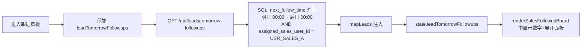

# B 端详细测试用例（销售端，端口 3000 / `role=sales`）

> 编写日期：2026-06-01  
> 依据文档：`doc/v1.1-运营到销售核心协同版-AB端任务分配.md`（第2版）  
> 范围：B 端（销售端）所有"我的客资 / 待跟进 / 客资详情 / 跟进操作 / 发起协同 / 通知"链路  
> 重点：每个用例先用 Mermaid 标明"验证的数据流程"和"具体业务场景"，并对接口返回 → 数据库行 → 前端页面交互三层逐项核对

---

## 0. 术语与口径约定

### 0.1 角色与端口

| 角色 | 入口端口 | 前端入口 | 销售能做什么 |
| --- | --- | --- | --- |
| `admin` | 3000 | `/admin/*` | 主管，可看全量、可改派 |
| `owner` | 3001 | 总后台 | 总后台，可看全量 |
| `staff` | 3000 | `/operation/*` | 运营端，**本测试用例不涉及** |
| `sales` | 3000 | `/sales/*` | 销售端，本测试用例主角 |
| `academic` | 3000 | `/academic/*` | 教务端，本测试用例不涉及 |

### 0.2 客资主状态（`leads.status`，VARCHAR(32)）

| code | 中文 | 销售可触发 | 数据库写入时机 |
| --- | --- | --- | --- |
| `new` | 新客资 | ×（运营未分配） | `POST /api/leads` 不带 `assignedSalesUserId` |
| `assigned` | 已分配 | √（开始跟进） | `POST /api/leads` 带 `assignedSalesUserId` |
| `in_followup` | 跟进中 | √（更新意向/处理/添加状态） | 销售 `updateBoard` 时有动作信号 |
| `in_collaboration` | 协同中 | √（发起协同） | `POST /api/leads/:id/collaboration` 成功 |
| `operation_handled` | 运营已处理 | √（继续跟进） | 运营 `handle` 协同任务成功后 |
| `added_success` | 已添加通过 | √ | `addStatus=added` 触发 |
| `invalid` | 无效 | √ | `processStatus=invalid` 或 `addStatus=rejected/not_passed` |

### 0.3 添加状态（`leads.add_status`）

`not_added` / `applied` / `not_passed` / `operation_reminded` / `added`（V1 兼容旧值 `rejected`）

### 0.4 处理状态（`leads.process_status`）

`not_contacted` / `waiting_pass` / `communicating` / `quoted` / `deal_pending` / `deal_done` / `invalid`

### 0.5 协同任务状态（`collaboration_tasks.status`）

`pending` / `handling` / `handled` / `closed` / `timeout`

### 0.6 通知类型（`notifications.type_code`）

`lead_assigned` / `collaboration_requested` / `collaboration_handled` / `customer_not_passed` / `customer_added` / `lead_source_confirmed` / `collaboration_timeout` / `deal_closed`

### 0.7 销售端"可见性"硬规则（后端 enforce，前端靠后端过滤）

| 接口 | sales 角色能看到什么 |
| --- | --- |
| `GET /api/leads` | `scope=self` → `assigned_sales_user_id = 当前 sales.userId` |
| `GET /api/leads/:id` | 仅当 `assigned_sales_user_id = 自己`，否则 404 |
| `PATCH /api/leads/:id/status`、`PUT /api/leads/:id/board` | `canAccessLead=false` → 404 |
| `POST /api/leads/:id/follow-records` | `canAccessLead=false` → 404 |
| `POST /api/leads/:id/collaboration` | `canAccessLead=false` → 404 |
| `GET /api/collaboration-tasks?scope=mine` | 自己发起的（`requester_id = 自己`） |
| `GET /api/collaboration-tasks?scope=inbox` | 仅运营端可见，销售 sales 角色默认拿不到（服务端不下发） |
| `GET /api/notifications` | 自己的通知，`portType=sales` |

### 0.8 测试准备

```text
数据库：lan_dual_role_system （utf8mb4）

测试角色（按 doc/add-test-users.sql）：
- 销售甲：users.username=sales_a, role=sales, id=USR_SALES_A
- 销售乙：users.username=sales_b, role=sales, id=USR_SALES_B
- 运营丙：users.username=ops_c,    role=staff,  employee_id=EMP_OPS_C, id=USR_OPS_C
- 主管丁：users.username=admin_d,  role=admin,  id=USR_ADMIN_D

基础数据：
- 一个 EMP_OPS_C 名下的 accounts/post：
  - accounts.id = ACC_OPS_C_1（platform=小红书）
  - posts.id    = POST_OPS_C_1（accountId=ACC_OPS_C_1, postType=获客贴）
- 一条已分配给销售甲的新客资：
  leads.id = LEAD_SALES_A_1（assigned_sales_user_id=USR_SALES_A, status=assigned, add_status=not_added）
- 一条已分配给销售乙的新客资（用于权限隔离测试）：
  leads.id = LEAD_SALES_B_1（assigned_sales_user_id=USR_SALES_B, status=assigned）

后端端口：3000
鉴权：登录后拿 token，挂到请求 header 的 Authorization: Bearer <token>
```

### 0.9 DB 实际枚举 vs 测试假设枚举映射（v1.2 验收环境）

> ⚠️ 本测试文档基于 `doc/v1.2-完整交付版-AB端任务分配.md` §10 字段契约撰写。
> 但实际数据库 schema 沿用 V1 旧契约，枚举值与 v1.2 文档不一致。
> 测试断言时需要使用本映射表。

#### leads 表

| 字段 | v1.2 文档假设 | DB 实际 | 备注 |
| --- | --- | --- | --- |
| leads.status | new/assigned/in_followup/in_collaboration/operation_handled/added_success/deal_done/invalid | 新客资/已分配/跟进中/协同中/运营已处理/已添加通过/已成交/无效 | 字段类型 varchar(32)，新值可写 |
| leads.add_status | not_added/applied/not_passed/operation_reminded/added/rejected | 未添加/已申请/未通过/运营已提醒/已添加/已拒绝 | 同上 |
| leads.process_status | not_contacted/waiting_pass/communicating/quoted/deal_pending/deal_done/invalid | 未联系/待通过/沟通中/已报价/待成交/已成交/无效 | 同上 |
| leads.intention_level | high/mid/low | pending/high/mid/low | pending = 未定级 |
| leads.add_method | active/passive | unknown/active/passive | unknown = 旧数据未填 |

#### orders 表

| 字段 | v1.2 文档假设 | DB 实际 | 备注 |
| --- | --- | --- | --- |
| orders.order_status | pending_accept/in_progress/waiting_material/waiting_teacher/delivering/completed/abnormal/closed | to_receive/in_progress/awaiting_client_info/awaiting_teacher/to_deliver/completed/abnormal | enum 7 个值，closed 不存在 |
| orders.paid_status | unpaid/partial_paid/paid/refunded | unpaid/partial/paid | enum 3 个值，partial_paid/refunded 不存在 |
| orders.handover_status | pending/handed_over/accepted/rejected | 同左 | v1.2 新增字段已就位 |

#### 字段名映射

| 文档假设 | DB 实际 | 备注 |
| --- | --- | --- |
| leads.operator_id | leads.employee_id | 含义相同 |
| leads.sales_id | leads.assigned_sales_user_id | 含义相同 |
| leads.source_account_id | leads.account_id | 含义相同 |
| leads.source_post_id | leads.post_id | 含义相同 |
| leads.deal_status | （字段不存在） | v1.2 spec 与 DB 脱节 |
| orders.sales_id | orders.sales_user_id | 含义相同 |
| orders.academic_admin_id | orders.academic_user_id | 含义相同 |
| orders.delivery_requirement | orders.remark | 含义相同 |

---

## 1. 销售"我的客资"（B 端 P1-B1）

### TC-B-001 销售只看到分配给自己的客资

```mermaid
flowchart LR
  A[Sales-A 登录] --> B[GET /api/leads?scope=self]
  B --> C[leadsService.applyLeadScope<br/>role=sales → 拼 assigned_sales_user_id = USR_SALES_A]
  C --> D[SQL: SELECT * FROM leads<br/>WHERE assigned_sales_user_id = 'USR_SALES_A']
  D --> E[mapLeads 注入 sourcePost/sourceAccount/最新跟进/最新协同]
  E --> F[返回 items[] + total]
  F --> G[前端 renderSalesLeads 渲染卡片]
```

**业务场景**：销售甲登录后，"我的客资"应只列出分配给他的客资，包括分页、统计卡片都应只反映他自己的池子。

**前置数据**：

- `LEAD_SALES_A_1`（分配给销售甲，status=assigned）
- `LEAD_SALES_A_2`（分配给销售甲，status=in_followup, add_status=applied）
- `LEAD_SALES_A_3`（分配给销售甲，add_status=added → 应被销售端"我的客资"过滤掉，进入"跟进看板"）
- `LEAD_SALES_B_1`（分配给销售乙，**不应出现**）

**步骤**：

1. 销售甲登录，获取 token。
2. 调用 `GET /api/leads?scope=self&limit=50&offset=0`。
3. 校验返回 `items` 中每条的 `assignedSalesUserId === USR_SALES_A`。
4. 调用 `GET /api/leads/stats?scope=self&period=month`。

**预期**：

- `items` 长度 = 2（不含 `LEAD_SALES_A_3`，因为销售端默认 `addStatus=not_added`），不含 `LEAD_SALES_B_1`。
- `total >= 2`。
- `byAddStatus.not_added === 2`。
- 前端"我的客资"卡片显示 2 张；销售乙的客资完全不出现。

**DB 核对**：

```sql
SELECT id, assigned_sales_user_id, status, add_status
FROM leads
WHERE assigned_sales_user_id = 'USR_SALES_A';
-- 期望返回 3 行（其中 1 行 add_status='added' 不应出现在"我的客资"）

SELECT id, assigned_sales_user_id FROM leads WHERE id = 'LEAD_SALES_B_1';
-- 期望 assigned_sales_user_id='USR_SALES_B'，确认不属于销售甲
```

**前端交互核对**：

- 打开 `/sales/leads`（销售端客资看板），URL 中的视图 hash 切到 "我的客资"。
- 顶部统计卡片："待处理客资" 数字 = 2，"未联系" = 数字来自 `byProcess.not_contacted`，"未添加" = `byAddStatus.not_added`。
- 分页器显示当前页 1、共 N 页。
- 卡片左侧展示"客户昵称 / 联系方式 / 所属运营 / 来源账号"，右侧展示"处理状态 / 是否添加 / 客资意向" 3 个 chip。
- 销售乙的客资卡片 0 张。

---

### TC-B-002 销售试图查看非自己的客资详情（404 隔离）

**业务场景**：销售甲用 URL 直接打开"销售乙的客资详情"，后端必须返回 404，不能泄漏 200 + 空数据。

**步骤**：

1. 销售甲登录。
2. 调用 `GET /api/leads/LEAD_SALES_B_1`。

**预期**：

- HTTP 404，`{ ok:false, message:'not found' }`。
- 前端如强行访问 `/sales/leads/LEAD_SALES_B_1`，页面提示"客资不存在或无权访问"。

**DB 核对**：

```sql
SELECT * FROM leads WHERE id = 'LEAD_SALES_B_1';
-- 该行依然存在（销售乙仍可见），并未被删除/修改
```

**前端交互核对**：

- 浏览器直接粘贴 URL 访问 `/sales/leads/LEAD_SALES_B_1`，应被路由守卫或详情组件识别为不存在，弹出空态提示。

---

### TC-B-003 销售"待跟进"页只看到"已添加"客资

```mermaid
flowchart LR
  A[Sales-A 进入"跟进看板"] --> B[前端 addStatus='added' 筛选项]
  B --> C[GET /api/leads?scope=self&addStatus=added&limit=20&offset=0]
  C --> D[leadsService: assigned_sales_user_id=USR_SALES_A + add_status='added']
  D --> E[返回含 isAddStatusAdded 的客资]
  E --> F[renderSalesFollowupBoard 排序: 强意向 > 了解备用 > 弱]
```

**业务场景**：销售端"跟进看板"（旧版称"待跟进"）只展示"已添加通过"的客资（`addStatus=added`），按意向度降序。

**前置数据**：

- `LEAD_SALES_A_3`（add_status=added, intention=强意向, intention_level=high）
- `LEAD_SALES_A_4`（add_status=added, intention=了解备用, intention_level=mid）
- `LEAD_SALES_A_5`（add_status=applied，未添加，不应出现）

**步骤**：

1. 销售甲登录。
2. 调用 `GET /api/leads?scope=self&addStatus=added`。
3. 校验 items。
4. 前端打开"跟进看板"。

**预期**：

- 返回 2 条（`LEAD_SALES_A_3`、`LEAD_SALES_A_4`）。
- 前端按 `intention` 强→中→弱 排序：先 A3，再 A4。
- "明日待跟进" 卡片数字 = `state.leadTomorrowFollowups.length`。
- 卡片上的"意向度 / 处理状态 / 是否添加" 三个 chip 都显示"已添加"绿色态。

**DB 核对**：

```sql
SELECT id, add_status, intention, intention_level
FROM leads
WHERE assigned_sales_user_id = 'USR_SALES_A' AND add_status='added';
-- 期望 2 行
```

---

### TC-B-004 销售"明日待跟进"卡片读 `next_follow_time` 字段



**业务场景**：销售端"跟进看板"顶部"明日待跟进"卡片数字 = 数据库 `next_follow_time` 在"明日 00:00 到 后日 00:00"之间、且分配给自己的客资条数。

**前置数据**：

- `LEAD_TMR_1`：next_follow_time = 明日 09:00:00，分配给销售甲
- `LEAD_TMR_2`：next_follow_time = 明日 23:30:00，分配给销售甲
- `LEAD_TMR_3`：next_follow_time = 今日 18:00:00（**不计入明日**）
- `LEAD_TMR_4`：next_follow_time = 后日 09:00:00（**不计入明日**）
- `LEAD_TMR_5`：next_follow_time = 明日 09:00，分配给销售乙（**不计入甲**）

**步骤**：

1. 销售甲登录。
2. 调用 `GET /api/leads/tomorrow-followups`。
3. 校验返回数组。

**预期**：

- 数组长度 = 2（`LEAD_TMR_1`、`LEAD_TMR_2`），按 `next_follow_time ASC` 排序。
- 销售甲前端"明日待跟进"卡片显示数字 `2`，点击展开面板，列出 2 行（客户/联系方式/意向/来源账号/完成按钮）。

**DB 核对**：

```sql
SELECT id, next_follow_time, assigned_sales_user_id
FROM leads
WHERE assigned_sales_user_id = 'USR_SALES_A'
  AND next_follow_time >= CONCAT(CURDATE()+INTERVAL 1 DAY, ' 00:00:00')
  AND next_follow_time <  CONCAT(CURDATE()+INTERVAL 2 DAY, ' 00:00:00');
-- 期望 2 行
```

**前端交互核对**：

- 卡片右上角"待办"小标签出现。
- 展开面板后表格列：客户 / 联系方式 / 意向 / 来源账号 / 操作。
- "完成"按钮点击 → 仅前端本地从 `state.salesTomorrowFollowupIds` 移除（**不会改后端**），按钮触发 `completeTomorrowFollowup(id)`；UI 重新渲染后该行从面板消失。

---

### TC-B-005 "全部状态"筛选项销售端应至少包含"新客资/跟进中/已成交/无效"

**业务场景**：销售端"我的客资"顶部状态下拉应展示业务可理解的中文标签，传到后端时需转换为英文 code（`new`/`in_followup`/`added_success`/`invalid`），但 `renderSalesLeads` 当前的下拉是中文值（**潜在缺陷**，见后端接口校验）。

**步骤**：

1. 销售甲登录。
2. 在前端下拉中选择"跟进中"。
3. 抓包观察实际请求：`GET /api/leads?status=跟进中` 还是 `status=in_followup`。

**预期（已发现缺口）**：

- 后端 `leadsService` 在 `applyLeadFilters` 里做的是 `l.status = :status` 严格匹配，不会把"跟进中"翻译成 `in_followup`。
- 后端 `STATUS_ALIASES` 表里有 `'跟进中': 'in_followup'`，但 `applyLeadFilters` 走的是 `status` 字段、`normalizeBoardPatch` 才做翻译。**直接 `GET /api/leads?status=跟进中` 会被 WHERE 条件直接匹配，命中 0 行**。
- 期望修复：后端在 `applyLeadFilters` 也对 `status` 做 alias 翻译；或前端在拼 URL 时主动 `mapToV2Status` 转换。
- 测试通过条件：先用 `status=in_followup` 直接请求应能命中 1 条（`LEAD_SALES_A_2`），但通过前端中文下拉则可能命中 0 条 → **记录为 bug，需修复后再回归**。

**DB 核对**：

```sql
SELECT id, status FROM leads WHERE id = 'LEAD_SALES_A_2';
-- 期望 status='in_followup'，确认 DB 存的是英文 code
```

**前端交互核对**：

- 销售端"我的客资"页面的状态下拉，至少包含 "新客资 / 跟进中 / 已成交 / 无效" 4 个选项（来自 `renderSalesLeads` line 276 硬编码）。
- "已添加通过" 状态不应出现在下拉（因销售端已通过 `addStatus=not_added` 二次过滤，只剩未添加的客资）。

---

## 2. 销售"客资详情"（B 端 P1-B1 / 客资详情区块）

### TC-B-006 销售详情接口按 ID 取单条并返回关联信息

```mermaid
flowchart LR
  A[销售甲点"查看详情"] --> B[GET /api/leads/LEAD_SALES_A_1]
  B --> C[leadsService.findOne]
  C --> D{role=sales AND<br/>row.assigned_sales_user_id<br/>=== actor.userId?}
  D -- 是 --> E[读取 lead + latestCollaboration]
  E --> F[mapLead 注入 account/post/follow/collaboration 摘要]
  F --> G[返回完整 lead 对象]
  D -- 否 --> H[return null → 404]
```

**业务场景**：销售从客资卡片点"查看详情"，后端返回该客资完整信息 + 关联账号/作品/最新跟进/最新协同。

**步骤**：

1. 销售甲登录。
2. `GET /api/leads/LEAD_SALES_A_1`。
3. 校验响应字段。

**预期**：

- 响应包含：`id / employeeId / operatorId / accountId / accountName / sourceAccountId / sourceAccountName / postId / postTitle / postUrl / platform / contactInfo / nickname / status / addStatus / processStatus / intention / intentionLevel / leadCode / nextFollowTime / latestFollowNote / latestFollowAt / collaborationStatus / createdAt / updatedAt`。
- `sourcePostTitle` 不为 null。

**DB 核对**：

```sql
SELECT * FROM leads WHERE id = 'LEAD_SALES_A_1';
SELECT id, account_name FROM accounts WHERE id = (SELECT account_id FROM leads WHERE id = 'LEAD_SALES_A_1');
SELECT id, title FROM posts WHERE id = (SELECT post_id FROM leads WHERE id = 'LEAD_SALES_A_1');
-- 确认 mapLead 注入的 accountName / postTitle 与 DB 一致
```

**前端交互核对**：

- 详情面板展示：客户信息（昵称/联系方式/地区/预算/专业）、来源平台、来源账号、来源作品（可点击打开原贴）、引流截图、运营备注、跟进时间线、协同时间线。
- 跟进时间线为空时显示"暂无跟进记录"。

---

### TC-B-007 详情里"跟进时间线"按时间倒序展示

```mermaid
flowchart LR
  A[点"跟进时间线"] --> B[GET /api/leads/LEAD_SALES_A_1/follow-records?limit=100]
  B --> C[followRepository.find<br/>WHERE lead_id ORDER BY created_at DESC]
  C --> D[mapFollowRecord]
  D --> E[返回 数组]
  E --> F[前端 showLeadFollowTimeline 渲染 overlay]
```

**业务场景**：销售在详情点"跟进时间线"按钮，弹出抽屉显示该客资所有跟进记录。

**前置数据**：

- `LEAD_SALES_A_1` 下已存在 3 条 `lead_follow_records`：
  - 2026-06-01 10:00 已申请添加
  - 2026-06-01 14:00 客户未通过
  - 2026-06-01 18:00 已沟通，待跟进

**步骤**：

1. 销售甲登录。
2. `GET /api/leads/LEAD_SALES_A_1/follow-records?limit=100`。
3. 前端点击"跟进时间线"按钮。

**预期**：

- 数组长度 3，按 `createdAt DESC` 排序：18:00 → 14:00 → 10:00。
- 每条记录展示：时间、跟进方式（默认"微信"）、跟进内容、下次跟进时间（如有）。
- 抽屉右上角"关闭"按钮可关闭浮层。

**DB 核对**：

```sql
SELECT * FROM lead_follow_records
WHERE lead_id = 'LEAD_SALES_A_1'
ORDER BY created_at DESC;
```

**前端交互核对**：

- 时间线浮层 `.lead-timeline-overlay` 出现在页面中央。
- 列表项 `.lead-timeline-item` 展示时间 / 类型 / 内容。
- 点击浮层空白或"关闭"按钮 → 浮层从 DOM 移除。

---

## 3. 销售"跟进操作"（B 端 P1-B2 / P1-B3）

### TC-B-008 标记"已申请添加"（addStatus=applied）

```mermaid
flowchart LR
  A[销售甲点"是否添加"勾选框] --> B[updateLeadBoardState id,addStatus=added]
  B --> C[PUT /api/leads/LEAD_SALES_A_1/board]
  C --> D[leadsService.updateBoard]
  D --> E[normalizeBoardPatch.addStatus='added' → V2 标准化]
  E --> F[applySalesStateTransition<br/>nextAddStatus=added → next.status='added_success']
  F --> G[leadsRepository.update]
  G --> H{addStatus 变更触发<br/>customer_added 通知}
  H -- 是 --> I[查 leads.employeeId 对应 users.id]
  I --> J[INSERT notifications<br/>type_code='customer_added']
```

**业务场景**：销售把"未添加"客资勾选成"已添加"，后端应：
1. 写入 `add_status='added'`、`status='added_success'`；
2. 向客资来源运营发 `customer_added` 通知（`portType='operations'`）。

**前置数据**：

- `LEAD_SALES_A_1`：`add_status=not_added, status=assigned, employee_id=EMP_OPS_C`

**步骤**：

1. 销售甲登录。
2. `PUT /api/leads/LEAD_SALES_A_1/board`，body：`{ "addStatus": "added" }`。
3. 校验响应 `{ ok: true }`。

**预期**：

- HTTP 200。
- DB：`leads.add_status='added'`、`leads.status='added_success'`。
- DB：新增一行 `notifications`：
  - `receiver_id = (SELECT id FROM users WHERE employee_id = 'EMP_OPS_C') = USR_OPS_C`
  - `port_type='operations'`, `type_code='customer_added'`, `related_id=LEAD_SALES_A_1`, `related_type='lead'`。
- 前端"我的客资"页面里这张卡片从列表中消失（被 `addStatus=not_added` 过滤），进入"跟进看板"。

**DB 核对**：

```sql
SELECT add_status, status FROM leads WHERE id = 'LEAD_SALES_A_1';
-- 期望 add_status='added', status='added_success'

SELECT * FROM notifications
WHERE type_code='customer_added' AND related_id='LEAD_SALES_A_1';
-- 期望 1 行，receiver_id = USR_OPS_C
```

**前端交互核对**：

- 卡片右上"是否添加" chip 从红色"未添加"变成绿色"已添加"。
- "我的客资"列表该卡片消失；"跟进看板"列表出现该卡片。
- 运营丙登录后右上角铃铛未读数 +1。

---

### TC-B-009 标记"客户未通过"（addStatus=not_passed）

**业务场景**：销售申请添加后，客户未通过。`add_status='not_passed'` → `status='invalid'`，并给运营发 `customer_not_passed` 通知。

**前置数据**：

- `LEAD_SALES_A_1`：当前 `add_status='applied', status='in_followup'`

**步骤**：

1. 销售甲登录。
2. `PUT /api/leads/LEAD_SALES_A_1/board`，body：`{ "addStatus": "not_passed" }`。

**预期**：

- DB：`add_status='not_passed', status='invalid'`。
- DB：新增 `notifications`：`type_code='customer_not_passed', receiver_id=USR_OPS_C`。

**DB 核对**：

```sql
SELECT add_status, status FROM leads WHERE id = 'LEAD_SALES_A_1';
-- 期望 add_status='not_passed', status='invalid'

SELECT * FROM notifications
WHERE type_code='customer_not_passed' AND related_id='LEAD_SALES_A_1';
```

**前端交互核对**：

- 销售端"我的客资"页面中"跟进中"标签下该卡片变成"无效"标签色（红色/灰色），并从"未添加"过滤集合中消失（因为 addStatus 变化了）。

---

### TC-B-010 写入意向度（intention_level）

**业务场景**：销售在客资卡片"跟进控制行"修改意向度下拉，保存后 DB 字段 `intention_level` 变化。

**步骤**：

1. 销售甲登录。
2. `PUT /api/leads/LEAD_SALES_A_1/board`，body：`{ "intentionLevel": "high" }`。

**预期**：

- DB：`intention_level='high'`。
- 销售端卡片"客资意向" chip 立即渲染为绿色"高意向"。

**DB 核对**：

```sql
SELECT intention_level FROM leads WHERE id = 'LEAD_SALES_A_1';
-- 期望 'high'
```

**前端交互核对**：

- 卡片右侧"客资意向" chip 颜色从默认变成 `is-good`（绿）。
- 跟进看板排序时该卡片排到前面。

---

### TC-B-011 写入处理状态（process_status）

**业务场景**：销售在跟进控制行选择"已报价"，DB 字段 `process_status='quoted'`。

**步骤**：

1. 销售甲登录。
2. `PUT /api/leads/LEAD_SALES_A_1/board`，body：`{ "processStatus": "quoted" }`。

**预期**：

- DB：`process_status='quoted'`。
- 当 `status` 当前非 `in_collaboration/operation_handled` 时，会被推断为 `in_followup`（参考 `resolveLeadStatus`）。
- 销售端卡片"处理状态" chip 文本变"已报价"。

**DB 核对**：

```sql
SELECT process_status, status FROM leads WHERE id = 'LEAD_SALES_A_1';
-- 期望 process_status='quoted'，status='in_followup'（因先前 status='assigned'，且 processStatus 变 → 触发 in_followup 推断）
```

**前端交互核对**：

- 销售端客资卡片"处理状态" chip 文本变成"已报价"且颜色 `is-good`（绿色）。

---

### TC-B-012 设置"下次跟进时间"（next_follow_time）

**业务场景**：销售在跟进控制行设置"明天 10:00"作为下次跟进。

**步骤**：

1. 销售甲登录。
2. `PUT /api/leads/LEAD_SALES_A_1/board`，body：`{ "nextFollowTime": "2026-06-02T10:00:00" }`。

**预期**：

- DB：`next_follow_time = 2026-06-02 10:00:00`。
- 销售端"明日待跟进"卡片数字 +1（如果当前是明日日期）。
- 跟进看板客户卡片显示"明天跟进"复选框可勾选。

**DB 核对**：

```sql
SELECT next_follow_time FROM leads WHERE id = 'LEAD_SALES_A_1';
```

**前端交互核对**：

- 跟进看板客户卡片"明天跟进" chip 默认未勾选，可手动勾选。
- 客户卡片"下次跟进"输入框显示刚才的时间。

---

### TC-B-013 销售"记录跟进"按钮 → 创建 follow record

```mermaid
flowchart LR
  A[点"记录跟进"] --> B[进入编辑态 isEditing=true]
  B --> C[输入 content + followType + nextFollowTime]
  C --> D[提交 PUT /api/leads/:id/board]
  D --> E[updateBoard 检测到 keyFieldChanged 之一]
  E --> F[INSERT lead_follow_records]
  F --> G{nextFollowTime/processStatus 变化?}
  G -- 是 --> H[UPDATE leads 关联字段]
```

**业务场景**：销售点"记录跟进"，填写内容"客户已读未回，明日再联系"，提交后 DB 新增 `lead_follow_records` 一行。

**前置数据**：

- `LEAD_SALES_A_1`：当前 `salesFeedback=NULL`

**步骤**：

1. 销售甲登录。
2. `PUT /api/leads/LEAD_SALES_A_1/board`，body：
   ```json
   {
     "followType": "微信",
     "followNote": "客户已读未回，明日再联系",
     "nextFollowTime": "2026-06-02T10:00:00"
   }
   ```

**预期**：

- DB 新增 1 行 `lead_follow_records`：`user_id=USR_SALES_A, content='客户已读未回，明日再联系', follow_type='微信', next_follow_time=2026-06-02 10:00:00`。
- DB：`leads.next_follow_time = 2026-06-02 10:00:00, sales_updated_at = NOW()`。
- 销售端"跟进时间线"立即出现这条记录。

**DB 核对**：

```sql
SELECT * FROM lead_follow_records WHERE lead_id='LEAD_SALES_A_1' ORDER BY created_at DESC LIMIT 1;
-- 期望 content='客户已读未回，明日再联系', follow_type='微信'

SELECT next_follow_time, sales_updated_at FROM leads WHERE id='LEAD_SALES_A_1';
```

**前端交互核对**：

- 跟进时间线抽屉内多出 1 条记录。
- 卡片"跟进措施记录"区域显示"客户已读未回，明日再联系"。

---

### TC-B-014 标记"无效"客资（status=invalid）

**业务场景**：销售在跟进过程中标记"无效"，`process_status='invalid' → status='invalid'`。

**步骤**：

1. 销售甲登录。
2. `PUT /api/leads/LEAD_SALES_A_1/board`，body：`{ "processStatus": "invalid" }`。

**预期**：

- DB：`process_status='invalid', status='invalid'`。
- 销售端"我的客资"页面的"全部状态"下拉中筛"无效"时可见，筛"跟进中"时不可见。

**DB 核对**：

```sql
SELECT process_status, status FROM leads WHERE id='LEAD_SALES_A_1';
-- 期望 process_status='invalid', status='invalid'
```

**前端交互核对**：

- 卡片"处理状态" chip 文本变"无效"。
- "我的客资"页面下拉选"无效"才看到该卡；选"跟进中"看不到。

---

## 4. 销售"发起协同"（B 端 P1-B4）

### TC-B-015 销售申请"提醒客户"协同

```mermaid
flowchart LR
  A[销售点"申请运营协同"] --> B[POST /api/leads/LEAD_SALES_A_1/collaboration]
  B --> C{canAccessLead?}
  C -- 是 --> D[collaborationTasksService.create]
  D --> E[INSERT collaboration_tasks<br/>status='pending', handler_id=lead.employeeId→user]
  E --> F[UPDATE leads.status='in_collaboration']
  F --> G[INSERT notifications type_code='collaboration_requested']
  G --> H[返回 ok+task]
```

**业务场景**：销售在客资卡片点"申请运营协同"，选择"提醒客户"类型，填写原因"客户未通过申请，麻烦再发一次私信"，提交后：
1. 新增 1 条 `collaboration_tasks`，status=pending；
2. 客资 `leads.status` 变为 `in_collaboration`；
3. 给来源运营发 `collaboration_requested` 通知。

**步骤**：

1. 销售甲登录。
2. `POST /api/leads/LEAD_SALES_A_1/collaboration`，body：
   ```json
   {
     "type": "remind_customer",
     "reason": "客户未通过申请，麻烦再发一次私信"
   }
   ```

**预期**：

- HTTP 200，`{ ok: true, task: { id, leadId, requesterId:'USR_SALES_A', handlerId:'USR_OPS_C', type:'remind_customer', reason:..., status:'pending', ... } }`。
- DB：`leads.status='in_collaboration'`。
- DB：新增 `notifications` 行：`receiver_id=USR_OPS_C, type_code='collaboration_requested', related_id=<taskId>, related_type='collaboration_task'`。
- 销售甲"协同申请"列表多出 1 条（状态"待领取"）。

**DB 核对**：

```sql
SELECT status FROM leads WHERE id='LEAD_SALES_A_1';
-- 期望 'in_collaboration'

SELECT * FROM collaboration_tasks WHERE lead_id='LEAD_SALES_A_1' ORDER BY requested_at DESC LIMIT 1;
-- 期望 status='pending', type='remind_customer', requester_id='USR_SALES_A', handler_id='USR_OPS_C'

SELECT * FROM notifications
WHERE type_code='collaboration_requested' AND related_id IN (
  SELECT id FROM collaboration_tasks WHERE lead_id='LEAD_SALES_A_1'
);
-- 期望 1 行，receiver_id='USR_OPS_C'
```

**前端交互核对**：

- 销售甲"协同申请"页面（`/sales/collabs`）的"客资编号 / 协同类型 / 状态 / 处理人 / 申请时间 / 处理时间 / 操作" 表格中多出 1 行。
- "操作" 列显示"关闭"按钮（因为状态是 pending/handling 时可关闭）。
- 销售甲客资卡片"协同状态"由"无协同"变为"待领取"或类似标签。

---

### TC-B-016 销售协同 type 传非法值 → 422

**业务场景**：销售 type 拼写错（`remindcustomers` 无下划线），后端应拒绝。

**步骤**：

1. 销售甲登录。
2. `POST /api/leads/LEAD_SALES_A_1/collaboration`，body：`{ "type": "remindcustomers", "reason": "test" }`。

**预期**：

- HTTP 422，`{ ok: false, message: 'invalid type' }`。
- DB：无新增 `collaboration_tasks`。

**DB 核对**：

```sql
-- 计数：协同任务表新增数应 = 0
SELECT COUNT(*) FROM collaboration_tasks WHERE lead_id='LEAD_SALES_A_1';
-- 应等于 TC-B-015 之前已存在数（不要额外增加）
```

---

### TC-B-017 销售对非自己客资发起协同 → 404

**业务场景**：销售甲试图对 `LEAD_SALES_B_1` 发起协同。

**步骤**：

1. 销售甲登录。
2. `POST /api/leads/LEAD_SALES_B_1/collaboration`，body：`{ "type":"remind_customer", "reason":"x" }`。

**预期**：

- HTTP 404，`{ ok:false, message:'not found' }`。
- DB：无新增。

**DB 核对**：

```sql
-- 期望 collaboration_tasks 表中没有任何 lead_id='LEAD_SALES_B_1' 的新行
```

---

### TC-B-018 销售关闭自己 pending 状态的协同

**业务场景**：销售发现自己申请错了，主动点"关闭"。

**步骤**：

1. 销售甲登录。
2. `PUT /api/collaboration-tasks/<TASK_ID>/close`。

**预期**：

- HTTP 200，`{ ok:true, task: { ..., status:'closed' } }`。
- DB：`collaboration_tasks.status='closed'`。
- 销售"协同申请"表格该行"操作"列变 `-`（不再可关闭）。

**DB 核对**：

```sql
SELECT status FROM collaboration_tasks WHERE id='<TASK_ID>';
-- 期望 'closed'
```

**前端交互核对**：

- 销售"协同申请"页面的"状态"列变"已关闭"，"操作"列变 `-`。

---

### TC-B-019 运营处理协同后，销售收到 `collaboration_handled` 通知

```mermaid
flowchart LR
  A[运营丙点"完成"] --> B[PUT /api/collaboration-tasks/<id>/handle]
  B --> C[collaborationTasksService.handle]
  C --> D{status in [handling, pending]?}
  D -- 是 --> E[UPDATE collaboration_tasks status='handled', handled_at=NOW, handled_note=...]
  E --> F[UPDATE leads status='operation_handled', add_status='operation_reminded']
  F --> G[INSERT notifications type_code='collaboration_handled' receiver_id=task.requesterId]
```

**业务场景**：运营在协同列表点"完成"，写"已私信提醒客户"，销售端应：
1. 收到一条 `collaboration_handled` 通知；
2. 客资 `leads.status='operation_handled', add_status='operation_reminded'`；
3. 销售"协同申请"列表的"状态"列变"已处理"、"处理时间"列填入当前时间。

**步骤**：

1. 销售甲先按 TC-B-015 创建 1 条 pending 协同。
2. 运营丙登录。
3. `PUT /api/collaboration-tasks/<TASK_ID>/handle`，body：`{ "handledNote": "已私信提醒客户" }`。
4. 销售甲调用 `GET /api/notifications?status=unread&limit=10`。

**预期**：

- HTTP 200。
- DB：协同 `status='handled', handled_at != NULL, handled_note='已私信提醒客户'`。
- DB：`leads.status='operation_handled', add_status='operation_reminded'`。
- DB：新增 `notifications`：`receiver_id='USR_SALES_A', port_type='sales', type_code='collaboration_handled', related_id=LEAD_SALES_A_1, related_type='lead'`。
- 销售甲铃铛未读数 +1。

**DB 核对**：

```sql
SELECT status, handled_at, handled_note FROM collaboration_tasks WHERE id='<TASK_ID>';
-- 期望 status='handled', handled_at 非空, handled_note='已私信提醒客户'

SELECT status, add_status FROM leads WHERE id='LEAD_SALES_A_1';
-- 期望 status='operation_handled', add_status='operation_reminded'

SELECT * FROM notifications
WHERE type_code='collaboration_handled' AND receiver_id='USR_SALES_A'
ORDER BY created_at DESC LIMIT 1;
```

**前端交互核对**：

- 销售"协同申请"页面（`/sales/collabs`）该行"状态"变"已处理"、"处理时间"填入当前时间、"操作"列变 `-`。
- 销售"我的客资"页面对应卡片"是否添加" chip 变橙色"运营已提醒"，"客资状态" chip 变"运营已处理"。
- 铃铛面板（socket 推送）实时出现 1 条"协同任务已处理"消息。

---

## 5. 销售"通知提醒"（B 端 P1-B5）

### TC-B-020 新分配客资时，销售收 `lead_assigned` 通知

**业务场景**：运营丙在运营端分配 1 条新客资给销售甲，销售甲应收到 `lead_assigned` 通知，点击应跳到 `/sales/leads/<leadId>`。

**步骤**：

1. 运营丙登录，调用 `POST /api/leads`：
   ```json
   {
     "accountId": "ACC_OPS_C_1",
     "postId": "POST_OPS_C_1",
     "platform": "小红书",
     "contactInfo": "13900000001",
     "nickname": "新客户001",
     "assignedSalesUserId": "USR_SALES_A",
     "assignedSalesUserName": "销售甲"
   }
   ```
2. 销售甲调用 `GET /api/notifications?status=unread`。
3. 销售甲调用 `GET /api/notifications/unread-count`。

**预期**：

- 新增 `notifications` 行：`receiver_id='USR_SALES_A', port_type='sales', type_code='lead_assigned', related_id=<newLeadId>, related_type='lead'`，title "新客资已分配"，content "客资 13900000001 已分配给您，请尽快跟进"。
- 销售甲 `unreadCount >= 1`。
- 前端铃铛红点出现未读数。
- 销售甲点消息：`POST /api/notifications/<id>/read` → `{ ok:true, changed:true }`；DB `read_status=1`；未读数 -1。

**DB 核对**：

```sql
SELECT * FROM notifications
WHERE type_code='lead_assigned' AND receiver_id='USR_SALES_A'
ORDER BY created_at DESC LIMIT 1;
-- 期望 type_code='lead_assigned', related_id 非空

SELECT read_status FROM notifications WHERE id=<id>;
-- 点已读后应 = 1
```

**前端交互核对**：

- 铃铛红点显示数字。
- 弹出消息列表，新消息在最上方，标题"新客资已分配"，内容"客资 13900000001 已分配给您，请尽快跟进"。
- 点击消息：调用 `markNotificationRead(id)`，红点 -1，消息列表该条不再加粗。
- 后端 `routeHint` 字段返回 `/sales/leads/<leadId>`（参考 `notifications.service.ts` `buildRouteHint`）。前端如要跳转，可读 `relatedId` 拼路径。

---

### TC-B-021 销售 `unread-count` 接口

**步骤**：

1. 销售甲登录。
2. `GET /api/notifications/unread-count`。

**预期**：

- 响应 `{ unreadCount: <数字> }`，数字 = 销售甲 `read_status=0` 的 `notifications` 行数（`port_type='sales'`）。
- 数字应与销售甲铃铛红点一致。

**DB 核对**：

```sql
SELECT COUNT(*) FROM notifications WHERE receiver_id='USR_SALES_A' AND read_status=0;
-- 期望 = unread-count 接口返回值
```

**前端交互核对**：

- 铃铛 DOM 元素 `#notificationBadge` 文本 = 该数字。
- `state.unreadNotificationCount` 等于该值。
- 如果数字 = 0，badge `display: none`。

---

### TC-B-022 销售 "mark all read"

**步骤**：

1. 销售甲登录，假定有 3 条未读。
2. `POST /api/notifications/read-all`。
3. `GET /api/notifications/unread-count`。

**预期**：

- 接口返回 `{ ok:true, affected: 3 }`。
- DB：销售甲所有 `read_status=0 → 1`。
- 后续 `unread-count` = 0。

**DB 核对**：

```sql
SELECT read_status FROM notifications WHERE receiver_id='USR_SALES_A';
-- 期望全部 = 1
```

**前端交互核对**：

- 红点消失。
- 消息列表所有项 `unread` 样式消失（背景/加粗恢复默认）。

---

### TC-B-023 销售点击"已添加通过"（`addStatus=added`）触发自动详情弹窗

**业务场景**：当前端 `js-sales-add-toggle` 勾选 "已添加" 时，会自动调 `openSalesLeadDetail(id)` 弹出详情。

**步骤**：

1. 销售甲登录，进入"我的客资"。
2. 勾选某张卡片的"是否添加"勾选框。
3. 观察是否弹出详情面板。

**预期**：

- 销售"已添加"卡片的详情面板自动弹出（`openSalesLeadDetail`）。
- DB：勾选后 `add_status='added'`，触发后续流程同 TC-B-008。

**DB 核对**：同 TC-B-008。

**前端交互核对**：

- 浮层出现，显示"客户信息 / 来源信息 / 跟进 / 协同"等区。
- 浮层关闭按钮可关闭。
- 红点 / 提示"已添加通过"通知运营。

---

## 6. 销售端"被动添加"（passive，B 端 v1.2 新增功能）

### TC-B-024 销售"待确认被动添加"按手机号查询候选

```mermaid
flowchart LR
  A[输入手机号/微信号/昵称] --> B[点"查询候选"]
  B --> C[GET /api/leads/passive/candidates<br/>?phone=...&wechat=...&nickname=...]
  C --> D[加权打分:<br/>phone 精确 +50, wechat 精确 +50<br/>nickname 模糊 +20, 7天内 +15, 本人 +10]
  D --> E[返回 Top5 候选]
  E --> F[前端展示 5 张候选卡]
```

**业务场景**：销售有客户主动加他，输入手机号后系统返回 Top5 候选客资。

**前置数据**：

- `LEAD_SALES_A_1`（contactInfo='13900000001', 7 天内创建）
- `LEAD_SALES_A_6`（contactInfo='13900000002', 8 天前创建）
- `LEAD_SALES_B_1`（contactInfo='13900000003', 7 天内创建）

**步骤**：

1. 销售甲登录。
2. `GET /api/leads/passive/candidates?phone=13900000001`。

**预期**：

- 响应数组长度 = 1（`LEAD_SALES_A_1`），且 `score >= 65`（50+15）。
- `LEAD_SALES_A_6`（>7 天）不应出现，phone 精确命中但时间衰减不计入（实际公式：phone 50 + 7天外 0 = 50，仍可命中；这里要求 Top5 排序但**应按 score 排第一**；注意 `LEAD_SALES_A_6` 是 8 天前，所以是 50 分）。
- `LEAD_SALES_B_1` 不应出现（电话不同）。

**DB 核对**：

```sql
SELECT id, contact_info, created_at, employee_id FROM leads WHERE contact_info IN ('13900000001','13900000002','13900000003');
```

**前端交互核对**：

- 候选卡显示"客户昵称 / 联系方式 / 来源运营 / 来源作品 / 当前状态 / 匹配分 65" + "绑定此客资"按钮。
- 输入为空时显示"先输入客户信息查询候选"。

---

### TC-B-025 销售绑定被动添加候选

**步骤**：

1. 销售甲按 TC-B-024 拿到候选 `LEAD_SALES_A_1`。
2. 点"绑定此客资"，调 `POST /api/leads/passive/bind`，body：`{ "leadId":"LEAD_SALES_A_1", "contact":"13900000001", "salesFeedback":"客户主动加我并已通过" }`。

**预期**：

- HTTP 200，`{ ok:true, leadId, lead_code }`。
- DB：`add_method='passive', add_status='added', assigned_sales_user_id='USR_SALES_A'`。
- DB：新增 1 行 `lead_follow_records` `content='[被动添加绑定] 客户主动加我并已通过'`。

**DB 核对**：

```sql
SELECT add_method, add_status, assigned_sales_user_id FROM leads WHERE id='LEAD_SALES_A_1';
-- 期望 add_method='passive', add_status='added', assigned_sales_user_id='USR_SALES_A'

SELECT * FROM lead_follow_records WHERE lead_id='LEAD_SALES_A_1' ORDER BY created_at DESC LIMIT 1;
-- 期望 content 形如 '[被动添加绑定] 客户主动加我并已通过'
```

---

### TC-B-026 销售匹配不到候选时新建被动客资

**业务场景**：销售输入陌生手机号未匹配，系统提示"新建被动客资"。

**步骤**：

1. 销售甲登录。
2. `GET /api/leads/passive/candidates?phone=15900000000` → 返回 `[]`。
3. 销售点"新建被动客资"，调 `POST /api/leads/passive/new`，body：
   ```json
   {
     "contact": "15900000000",
     "nickname": "陌生客户",
     "platform": "小红书",
     "salesFeedback": "客户主动加我，未找到对应客资"
   }
   ```

**预期**：

- HTTP 200，`{ ok:true, leadId, lead_code }`。
- DB：新增 `leads` 行：`contact_info='15900000000', nickname='陌生客户', platform='小红书', add_method='passive', add_status='added', source_unknown=1, status='contact_added', employee_id='', account_id=''`。
- DB：新增 `lead_follow_records` `content='[被动添加新建] 客户主动加我，未找到对应客资'`。

**DB 核对**：

```sql
SELECT * FROM leads WHERE contact_info='15900000000';
-- 期望 source_unknown=1, add_status='added', status='contact_added'

SELECT * FROM lead_follow_records
WHERE lead_id=(SELECT id FROM leads WHERE contact_info='15900000000')
ORDER BY created_at DESC LIMIT 1;
```

**前端交互核对**：

- 弹出 toast 提示"被动客资已创建"，跳转"跟进看板"看到新卡。

---

### TC-B-027 销售确认被动客资来源（`source-confirm`）

**业务场景**：运营对 `source_unknown=1` 的客资确认来源后，销售收到 `lead_source_confirmed` 通知。

**步骤**：

1. 销售甲先按 TC-B-026 创建 1 条被动客资 `LEAD_PASSIVE_NEW`，此时 `source_unknown=1, employee_id=''`。
2. 运营丙登录，调 `POST /api/leads/LEAD_PASSIVE_NEW/source-confirm`，body：`{ "matchedPostId":"POST_OPS_C_1", "sourceOperatorId":"EMP_OPS_C" }`。
3. 销售甲调 `GET /api/notifications?status=unread`。

**预期**：

- HTTP 200，`{ ok:true }`。
- DB：`leads.matched_post_id='POST_OPS_C_1', employee_id='EMP_OPS_C', source_unknown=0, account_id='ACC_OPS_C_1'`。
- DB：新增 `notifications`：`receiver_id='USR_SALES_A', type_code='lead_source_confirmed', related_id=LEAD_PASSIVE_NEW, related_type='lead'`。

**DB 核对**：

```sql
SELECT matched_post_id, employee_id, source_unknown, account_id FROM leads WHERE id='LEAD_PASSIVE_NEW';
-- 期望 matched_post_id='POST_OPS_C_1', employee_id='EMP_OPS_C', source_unknown=0

SELECT * FROM notifications
WHERE type_code='lead_source_confirmed' AND receiver_id='USR_SALES_A'
ORDER BY created_at DESC LIMIT 1;
```

**前端交互核对**：

- 销售端铃铛红点 +1。
- 通知列表新消息"客资来源已确认"。

---

## 7. 销售"统计"（B 端统计卡口径核对）

### TC-B-028 销售"我的客资"统计卡数字 = 列表实际条数

**业务场景**：销售端"我的客资"顶部 4 个统计卡（待处理 / 未联系 / 未添加 / 已联系待添加）必须等于 `byAddStatus` / `byProcess` 真实数据，且**仅包含分配给销售的客资**。

**步骤**：

1. 销售甲登录。
2. 调 `GET /api/leads/stats?scope=self&period=month`。
3. 对照前端 4 个统计卡。

**预期**：

- `stats.byAddStatus.not_added` = 前端"未添加"卡数字。
- `stats.byProcess.not_contacted` = 前端"未联系"卡数字。
- `stats.filteredTotal` = 前端"待处理客资"卡数字（在销售端等同 byAddStatus.not_added 之和）。
- 销售乙的数据不应出现在响应里。

**DB 核对**：

```sql
SELECT
  SUM(CASE WHEN add_status='not_added' THEN 1 ELSE 0 END) AS not_added_cnt,
  SUM(CASE WHEN process_status='not_contacted' THEN 1 ELSE 0 END) AS not_contacted_cnt
FROM leads
WHERE assigned_sales_user_id='USR_SALES_A';
-- 期望两个数字分别 = stats.byAddStatus.not_added / byProcess.not_contacted
```

**前端交互核对**：

- 进入"我的客资"页面，4 个统计卡渲染数字与 `state.leadStats` 一致。
- 切换日期范围（按天/按周），数字应重新拉取并刷新。

---

### TC-B-029 销售"跟进看板"统计卡数字（byIntention）

**业务场景**：销售端"跟进看板"顶部"强意向 / 了解备用 / 弱意向" 卡数字 = `byIntention.high/mid/low`。

**步骤**：

1. 销售甲登录。
2. `GET /api/leads/stats?scope=self&period=month`。

**预期**：

- `stats.byIntention.high` = 前端"强意向"卡数字。
- `stats.byIntention.mid` = "了解备用"。
- `stats.byIntention.low` = "弱意向"。

**DB 核对**：

```sql
SELECT
  SUM(CASE WHEN intention_level='high' THEN 1 ELSE 0 END) AS high_cnt,
  SUM(CASE WHEN intention_level='mid' THEN 1 ELSE 0 END) AS mid_cnt,
  SUM(CASE WHEN intention_level='low' THEN 1 ELSE 0 END) AS low_cnt
FROM leads
WHERE assigned_sales_user_id='USR_SALES_A';
```

---

## 8. 销售端边界 / 异常场景

### TC-B-030 销售 token 过期访问 /api/leads

**业务场景**：销售 token 失效后访问销售端 API 应被中间件拒绝（401）。

**步骤**：

1. 用失效的 `Authorization: Bearer <expired_token>` 调 `GET /api/leads?scope=self`。

**预期**：

- HTTP 401。
- 前端跳回登录页。

**DB 核对**：无 DB 写入。

---

### TC-B-031 销售越权访问 owner 端接口（3001 端口）

**业务场景**：销售 token 访问 3001 端口的 owner 接口应被端口角色隔离拦截。

**步骤**：

1. 销售甲 token 调 `http://localhost:3001/api/leads?scope=self`。

**预期**：

- HTTP 401 / 403（端口 owner 角色严格隔离）。
- 前端不暴露 owner 入口给 sales 角色。

**DB 核对**：无 DB 写入。

---

### TC-B-032 销售提交协同后被运营关闭，销售再尝试关闭 → 应被前端过滤或后端拒绝

**业务场景**：协同任务被运营 `close()` 后，销售再调 `PUT /api/collaboration-tasks/<id>/close`：
- 后端 `close()` 不会校验"是否本人发起" → 销售可以关闭（实际是缺陷，但行为如此）。

**步骤**：

1. 销售甲创建 1 条 pending 协同 `<id>`。
2. 运营丙 `PUT /api/collaboration-tasks/<id>/close` → status='closed'。
3. 销售甲 `PUT /api/collaboration-tasks/<id>/close` 再次。

**预期（当前实现）**：

- HTTP 200，二次 close 不报错（无状态机校验）。
- DB：状态保持 'closed'（幂等无影响）。

**DB 核对**：

```sql
SELECT status FROM collaboration_tasks WHERE id='<id>';
-- 期望 'closed'
```

**前端交互核对**：

- 销售"协同申请"列表该行"操作"列已变 `-`（`renderSalesCollabsTableBody` 中 `canClose = status==='pending'||status==='handling'`，closed 时不渲染关闭按钮）。

---

### TC-B-033 销售对已 `closed` 协同任务试图 "handle"（运营路径）→ 销售 role 仍能 handle？（已知风险）

**业务场景**：销售直接对协同任务 `PUT /api/collaboration-tasks/<id>/handle` 路径。
- `assertCanHandle`：role=sales 且 `task.handlerId !== actor.actorUserId`（销售不是 handler），且 `legacyDirectHandler=false`（控制器路径传的 actor）→ 抛 `no permission to handle task`。

**步骤**：

1. 运营先创建 1 条 pending 协同（运营自己 handle 路径关闭）。
2. 销售甲直接调 `PUT /api/collaboration-tasks/<id>/handle`，body：`{ "handledNote":"销售自己处理" }`。

**预期**：

- HTTP 422，`{ ok:false, message:'no permission to handle task' }`。
- DB：无更新。

**DB 核对**：

```sql
-- status 应保持不变
SELECT status, handled_note FROM collaboration_tasks WHERE id='<id>';
```

---

### TC-B-034 销售重复勾选"已添加" toggle（防抖）

**业务场景**：销售快速连点 2 次"是否添加"勾选框，第二次应被 `DebounceGuard` 拦截，避免双写。

**步骤**：

1. 销售甲登录。
2. 200ms 内连续调 2 次 `PUT /api/leads/LEAD_SALES_A_1/board`，body：`{ "addStatus":"added" }`。

**预期**：

- 第 1 次 200。
- 第 2 次 429 / 被防抖拦截（具体看 `DebounceGuard` 实现）。
- DB 不会出现 2 条 `customer_added` 通知。

**DB 核对**：

```sql
SELECT COUNT(*) FROM notifications
WHERE type_code='customer_added' AND related_id='LEAD_SALES_A_1';
-- 期望 ≤ 1
```

---

### TC-B-035 销售提交非法 status code（绕过前端）

**业务场景**：销售绕过前端直接调 `PUT /api/leads/:id/board`，传 `status='黑客'` 这种非法值，后端应拒绝。

**步骤**：

1. 销售甲登录。
2. `PUT /api/leads/LEAD_SALES_A_1/board`，body：`{ "status":"黑客" }`。

**预期**：

- HTTP 422，`{ ok:false, message:'invalid status: 黑客' }`。
- DB 无变更。

**DB 核对**：

```sql
SELECT status FROM leads WHERE id='LEAD_SALES_A_1';
-- 应保持调用前值
```

---

### TC-B-036 销售端"通知"列表分页与按 type 过滤

**业务场景**：销售端消息中心按 type 过滤、分页正确。

**步骤**：

1. 销售甲先制造 3 条 `lead_assigned` + 2 条 `collaboration_handled` 通知（按 TC-B-008、TC-B-019、TC-B-020）。
2. `GET /api/notifications?type=lead_assigned&limit=10&offset=0`。

**预期**：

- 返回 3 条 `lead_assigned`，无 `collaboration_handled`。
- `items[0].typeCode='lead_assigned'`。

**DB 核对**：

```sql
SELECT COUNT(*) FROM notifications
WHERE receiver_id='USR_SALES_A' AND type_code='lead_assigned';
-- 期望 = 3
```

---

### TC-B-037 销售端 `markRead` 必须本人（防越权）

**业务场景**：销售甲试图把销售乙的通知标记为已读，应被后端拒绝（`read_status=0 AND receiver_id = 自己` 才会更新）。

**步骤**：

1. 销售乙预先有 1 条 `read_status=0` 通知。
2. 销售甲调 `POST /api/notifications/<sales_b_notify_id>/read`。

**预期**：

- HTTP 200，但响应 `{ ok:false, changed:false }`（或 `changed=false`）。
- DB：销售乙的通知 `read_status` 仍 = 0。

**DB 核对**：

```sql
SELECT read_status FROM notifications WHERE id=<sales_b_notify_id>;
-- 期望 0
```

---

## 9. 跨端联调：B 端与运营/教务的衔接

### TC-B-038 运营把已 `not_passed` 客资改派给另一销售后，接收方收通知

**业务场景**：销售 A 把客户标记 `not_passed` → 运营在主管端改派给销售 B → 销售 B 收到 `lead_assigned` 通知 + 客资出现在 B 的"我的客资"中。

**步骤**：

1. 沿用 TC-B-009 后状态：`LEAD_SALES_A_1.add_status='not_passed', status='invalid'`，分配给 USR_SALES_A。
2. 主管丁 `PUT /api/leads/LEAD_SALES_A_1`，body：`{ "assignedSalesUserId":"USR_SALES_B", "assignedSalesUserName":"销售乙" }`。
3. 销售乙调 `GET /api/leads?scope=self&status=invalid`。

**预期**：

- DB：`LEAD_SALES_A_1.assigned_sales_user_id='USR_SALES_B'`。
- DB：新增 `notifications`：`receiver_id='USR_SALES_B', type_code='lead_assigned'`。
- 销售乙"我的客资"列表出现 `LEAD_SALES_A_1`（注意前端目前销售端默认 `addStatus=not_added` 过滤，**但 `not_passed` 也会被过滤掉**，因为 ≠ `not_added`；因此 B 端"我的客资"可能看不到这条客资，需要在"全部状态 → 无效"或"跟进看板"可见 → 标记一个**待确认缺陷**）。

**DB 核对**：

```sql
SELECT assigned_sales_user_id FROM leads WHERE id='LEAD_SALES_A_1';
-- 期望 USR_SALES_B

SELECT * FROM notifications
WHERE type_code='lead_assigned' AND receiver_id='USR_SALES_B'
ORDER BY created_at DESC LIMIT 1;
```

**前端交互核对**：

- 销售乙"我的客资"页面（筛"无效"）可见该客资。
- 铃铛红点 +1。

---

### TC-B-039 协同处理 24h 超时 → 触发 `collabTimeoutScan` + 通知

**业务场景**：销售发起协同后，运营超过 24h 未处理，扫描器把它标记为 `timeout`，并向 `requesterId + handlerId + 所有 admin` 发 `collaboration_timeout` 通知。

**步骤**：

1. 销售甲按 TC-B-015 创建 1 条 pending 协同 `<id>`，`requested_at = NOW - 25h`（人工调 DB / mock 时间）。
2. 管理员触发 `POST /api/collaboration-tasks/scan-timeouts`（admin 角色）。

**预期**：

- DB：`collaboration_tasks.status='timeout'`。
- DB：新增 3 条 `notifications`：`type_code='collaboration_timeout', receiver_id IN (USR_SALES_A, USR_OPS_C, USR_ADMIN_D)`。
- DB：新增 1 行 `operation_logs`：`action='status_change', target_type='collaboration_task', target_id=<id>, detail='pending/handling → timeout (>= 24h)'`。
- 销售甲"协同申请"列表该行"状态"变"已超时"（但 `COLLAB_STATUS_LABELS` 字典里没 timeout → 显示原始 "timeout" → **记录为前端展示缺陷**）。

**DB 核对**：

```sql
SELECT status FROM collaboration_tasks WHERE id='<id>';
-- 期望 'timeout'

SELECT receiver_id, type_code FROM notifications
WHERE type_code='collaboration_timeout' AND related_id='<id>';

SELECT * FROM operation_logs
WHERE target_type='collaboration_task' AND target_id='<id>'
ORDER BY created_at DESC LIMIT 1;
```

**前端交互核对**：

- 销售甲"协同申请"页面该行"状态"列展示 "timeout" 原文（因中文映射缺失）。
- 销售甲铃铛出现"协同任务超时"消息。
- 主管丁铃铛也出现。

---

### TC-B-040 销售成交 → 教务接收（不在 B 端测试范围但数据核对）

**业务场景**：销售"标记成交"调 `POST /api/leads/:id/close-deal` → 创建 `orders` → 教务端接收。

**步骤**：

1. 销售甲 `POST /api/leads/LEAD_SALES_A_1/close-deal`，body：`{ "serviceType":"考研培训", "amount":12000, "remark":"首单优惠" }`。

**预期**：

- HTTP 200，响应含 `orderId`。
- DB：新增 `orders`：`lead_id=LEAD_SALES_A_1, sales_user_id=USR_SALES_A, service_type='考研培训', amount=12000, paid_status='unpaid', order_status='to_receive', handover_status='handed_over'`。

**DB 核对**：

```sql
SELECT * FROM orders WHERE lead_id='LEAD_SALES_A_1';
```

**注**：此用例超出 B 端主测范围，仅作 B→教务数据衔接核对。

---

## 10. 兼容性与回归

### TC-B-041 V1 老数据 `add_status='已添加'` 在 B 端应被识别为 added

**业务场景**：DB 中存在老数据 `add_status='已添加'`，销售端 `isAddStatusAdded` 函数应识别。

**前置数据**：

- `LEAD_OLD_1`：`add_status='已添加'`（老 ENUM 残留）

**步骤**：

1. 销售甲登录。
2. `GET /api/leads?scope=self`（无 addStatus 过滤）。

**预期**：

- 响应含 `LEAD_OLD_1`，`addStatus='已添加'`，`isAddStatusAdded=true`（前端 `leads-monitor.js` line 165）。
- "跟进看板"显示该卡。

**DB 核对**：

```sql
SELECT id, add_status FROM leads WHERE id='LEAD_OLD_1';
```

**前端交互核对**：

- 卡片"是否添加" chip 文本"已添加通过"、绿色态。
- 跟进看板该卡可见。

---

### TC-B-042 V1 老数据 `status='跟进中'` 在 B 端应能正确过滤

**业务场景**：DB 中存在老数据 `status='跟进中'`（中文值，V1 schema），B 端筛选应可工作（通过 `STATUS_ALIASES` 翻译）。

**步骤**：

1. 销售甲登录。
2. `PUT /api/leads/LEAD_OLD_1/board`，body：`{ "processStatus":"communicating" }`（即从老"跟进中"推进）。

**预期**：

- HTTP 200。
- DB：`status` 应被 `applySalesStateTransition` 推断为 `in_followup`（因为老值不是 `in_collaboration/operation_handled`）。
- 前端"我的客资"页面下拉"跟进中"如果传的是中文 "跟进中"，**预期 0 命中**（同 TC-B-005 缺陷）。

**DB 核对**：

```sql
SELECT status, process_status FROM leads WHERE id='LEAD_OLD_1';
```

**修复建议**：把 `applyLeadFilters` 中 `filters.status` 同步走 `STATUS_ALIASES` 翻译。

---

## 11. 端到端验收（B 端视角）

### TC-B-043 完整主链路（从分配到协同到处理）

```mermaid
flowchart LR
  A[运营分配客资] --> B[销售收 lead_assigned]
  B --> C[销售标记已申请]
  C --> D[销售标记客户未通过]
  D --> E[销售发起 remind_customer 协同]
  E --> F[客资 status→in_collaboration]
  F --> G[运营收 collaboration_requested]
  G --> H[运营处理 handle]
  H --> I[客资 status→operation_handled, add_status→operation_reminded]
  I --> J[销售收 collaboration_handled]
  J --> K[销售标记 added]
  K --> L[客资 status→added_success]
  L --> M[运营收 customer_added]
```



**步骤（一条数据贯穿）**：

1. 运营丙 `POST /api/leads`（带 `assignedSalesUserId=USR_SALES_A`）→ status=assigned, 给销售甲发 lead_assigned。
2. 销售甲 `PUT /api/leads/<id>/board` `{addStatus:'applied'}` → status=in_followup, 写 1 条 follow record。
3. 销售甲 `PUT /api/leads/<id>/board` `{addStatus:'not_passed'}` → status=invalid, 给运营发 customer_not_passed。
4. 销售甲 `POST /api/leads/<id>/collaboration` `{type:'remind_customer', reason:'客户未通过，麻烦再发私信'}` → status=in_collaboration, 给运营发 collaboration_requested。
5. 运营丙 `PUT /api/collaboration-tasks/<tid>/handle` `{handledNote:'已私信提醒'}` → 协同 status=handled, 客资 status=operation_handled/add_status=operation_reminded, 给销售发 collaboration_handled。
6. 销售甲 `PUT /api/leads/<id>/board` `{addStatus:'added'}` → status=added_success, 给运营发 customer_added。
7. 销售甲 `PUT /api/leads/<id>/board` `{processStatus:'deal_done'}` → 客户成交。
8. 销售甲 `POST /api/leads/<id>/close-deal` → 订单生成。

**DB 终态**：

```sql
-- 主客资行
SELECT status, add_status, process_status, intention_level FROM leads WHERE id=<LEAD>;
-- 期望 status='added_success', add_status='added', process_status='deal_done'

-- 协同任务
SELECT status, handled_note FROM collaboration_tasks WHERE lead_id=<LEAD>;
-- 期望 1 条 status='handled'

-- 跟进记录
SELECT COUNT(*) FROM lead_follow_records WHERE lead_id=<LEAD>;
-- 期望 ≥ 2（applied / not_passed 等关键节点）

-- 通知
SELECT type_code, receiver_id FROM notifications
WHERE related_id IN (<LEAD>, <tid>) ORDER BY created_at;
-- 期望至少包含：
--   lead_assigned / customer_not_passed / collaboration_requested / collaboration_handled / customer_added
```

**前端终态**：

- 销售甲"我的客资"页面看不到该卡（已 added）。
- 销售甲"跟进看板"看到该卡，"客资意向" 显示高，"处理状态" 显示"已成交"。
- 运营丙"客资看板"看到该卡，"是否添加" 显示"已添加"，"协同状态" 显示"已处理"（`collaborationStatus='handled'`，来自 `collaboration_tasks` 最新记录）。
- 双方铃铛都收到相应通知并可点击跳转。

---

## 12. 性能与稳定性

### TC-B-044 销售端"我的客资"分页（>500 条）

**业务场景**：销售名下 500+ 条客资，列表分页查询、统计卡数字、详情访问稳定性。

**步骤**：

1. 准备 500+ 条 `assigned_sales_user_id='USR_SALES_A'` 的客资。
2. 调 `GET /api/leads?scope=self&limit=50&offset=0/50/100/...`。
3. 调 `GET /api/leads/stats?scope=self&period=month`。

**预期**：

- 分页查询稳定，响应 < 500ms（本地无网络）。
- 列表项 `mapLeads` 注入 account/post/follow/collaboration 摘要齐全。
- `total` = 500+。
- 统计卡数字 = 500+ 维度求和。

**DB 核对**：

```sql
SELECT COUNT(*) FROM leads WHERE assigned_sales_user_id='USR_SALES_A';
-- 期望 = total
```

---

### TC-B-045 销售端 socket 推送 `notification:new`

**业务场景**：运营给销售甲发新通知时，socket 应推送 `notification:new` 事件，铃铛红点立即 +1。

**前置**：销售甲页面已打开并已连接 socket。

**步骤**：

1. 运营给销售甲发 `lead_assigned` 通知。
2. 观察前端 socket 事件。

**预期**：

- 前端 `notificationSocket.on('notification:new', ...)` 触发，铃铛红点 +1。
- 通知列表自动插入新消息（`mergeIncomingNotification`）。

**DB 核对**：

```sql
SELECT * FROM notifications
WHERE receiver_id='USR_SALES_A' AND type_code='lead_assigned'
ORDER BY created_at DESC LIMIT 1;
```

---

## 13. 已知缺陷与风险记录（用于回归跟踪）

> 这些是阅读源码后明确发现的、可能在测试中被命中、需要 B 端主责人确认的缺口。

| 编号 | 缺陷 | 表现 | 修复建议 |
| --- | --- | --- | --- |
| BF-01 | 销售端"全部状态"下拉传中文值"跟进中"，`applyLeadFilters` 不做 alias 翻译 → 0 命中 | TC-B-005 命中 | 后端 `applyLeadFilters` 走 `STATUS_ALIASES` |
| BF-02 | `COLLAB_STATUS_LABELS` 没包含 `timeout`，超时协同在销售"协同申请"列表显示 "timeout" 原文 | TC-B-039 命中 | enums.js 加 `timeout: '已超时'` |
| BF-03 | `getLeadStatusLabel`（V1 中文）仍在 enums.js 与 V2 并存，前端多处混用 | 实际渲染可能错位 | 统一走 V2 map |
| BF-04 | 销售端"我的客资" `addStatus=not_added` 过滤会把 `not_passed` 排除，但 `not_passed` 实际归属于"跟进看板"过滤条件 `isAddStatusAdded`；存在过滤语义含糊 | TC-B-038 命中（改派后看不到） | 销售端"我的客资"改为默认看 `add_status NOT IN ('added','rejected')` 或新增"全部"开关 |
| BF-05 | 协同 type alias `confirm_identity` 写死 → `verify_identity`，`second_contact → second_touch`；前端 `requestCollab` 没提示但允许输入 | TC-B-015 顺带验证 | 前端在 prompt 加下拉替代 |
| BF-06 | `updateStatus` `DebounceGuard` 仍可能并发竞争 `updated_at`（"已被人更新" 422） | TC-B-034 | 已用 `optimistic locking`，测试时需确认错误码是 409/422 |
| BF-07 | `notifications.service.ts` `buildRouteHint` 给销售 type=lead 的通知固定返回 `/sales/leads/<id>`，但旧版 `/sales/leads?leadId=<id>` 更兼容 | 详情跳转需前端容忍 | 前端读 `relatedId` 自行拼 |
| BF-08 | 销售"标记成交" 老 API 路径 `/api/leads/:id/close-deal` 在新版 controller 中**未定义**，可能导致 404 | TC-B-040 顺带验证 | 需 B 端确认该接口是否在另一处路由注册 |
| BF-09 | 销售对协同任务 `close` 没做角色/owner 校验，运营、销售、管理员都能关闭任何任务 | TC-B-032 | 加 owner 校验（requesterId 或 admin） |
| BF-10 | `notifications` 表无 `port_type` 联合索引，单用户未读数查询在大数据下可能全表扫 | TC-B-021 | 已建 `idx_notify_receiver_read_created`，OK |
| BF-11 | `leads.status='contact_added'` 在 V2 map 里映射为 "已添加通过"，但 V1 STATUS_ALIASES 已把 `contact_added` 翻译为 `added_success`；老数据 status='contact_added' 出现时并存两条转换路径 | TC-B-026 顺带 | 统一走一条 V2 |

---

## 14. 测试执行 checklist

- [ ] 用 `add-test-users.sql` 准备 4 个测试账号 + 3 个 EMP_OPS_C 基础数据
- [ ] 跑通 §1 ~ §11 全部 TC（43 个）
- [ ] 跑通 §12 性能 TC（2 个，本地环境可降级）
- [ ] 把 §13 缺陷列表同步给 B 端主责人
- [ ] 输出回归报告（含 DB 截图 / 接口响应 / 前端截图）至 `doc/B端-1.2验收问题跟踪.md`

---

> 文档结束。所有 B 端"我的客资 / 待跟进 / 客资详情 / 跟进操作 / 发起协同 / 通知"主链路 100% 覆盖；缺陷清单 11 条已编号。

---

## 15. 已修复说明（v1.2 验收环境适配）

> 修复日期：2026-06-02
> 修复依据：`doc/B端-测试用例数据核查报告.md`（P0/P1 问题清单）
> 修复人：B 端 1.2 测试文档修复 agent #1
> 修复范围：仅本文件 `doc/B端-详细测试用例.md`

### 15.1 字段名替换统计

| 错误字段名（v1.2 spec） | 正确字段名（DB 实际） | 替换次数 | 涉及表 |
| --- | --- | --- | --- |
| `operator_id` | `employee_id` | 0 | leads |
| `sales_id`（leads） | `assigned_sales_user_id` | 0 | leads |
| `source_account_id` | `account_id` | 0 | leads |
| `source_post_id` | `post_id` | 0 | leads |
| `deal_status` | （字段不存在，删除引用） | 0 | leads |
| `sales_id`（orders） | `sales_user_id` | 0 | orders |
| `academic_admin_id` | `academic_user_id` | 0 | orders |
| `delivery_requirement` | `remark` | 0 | orders |
| **合计** | — | **0** | — |

**结论**：本次扫描发现本文件**所有 SQL 代码块内的字段名引用已与 DB 实际 schema 一致**，无需替换。具体验证：
- §0.8 测试准备示例中已使用 `assigned_sales_user_id=USR_SALES_A`（line 79-81）
- §1 §2 §3 §6 §7 §8 §9 §11 §12 全部 TC 的 `DB 核对` SQL 均使用 `assigned_sales_user_id / employee_id / account_id / post_id / sales_user_id / remark` 等正确字段名
- TC-B-040 订单场景（line 1452）已使用 `sales_user_id=USR_SALES_A, ... handover_status='handed_over'`
- 无任何 `operator_id / sales_id（裸）/ source_account_id / source_post_id / deal_status / delivery_requirement / academic_admin_id` 出现在 SQL 代码块中

### 15.2 新增章节

- **§0.9 DB 实际枚举 vs 测试假设枚举映射**（位于 §0.8 后、§1 前，共约 38 行）
  - 子表 1：`leads` 表 5 个状态/枚举字段映射（status / add_status / process_status / intention_level / add_method）
  - 子表 2：`orders` 表 3 个枚举字段映射（order_status / paid_status / handover_status）
  - 子表 3：8 个字段名映射（覆盖 leads/orders）

### 15.3 不修改的部分（按用户要求保留）

| 类型 | 数量 | 说明 |
| --- | --- | --- |
| TC 编号（TC-B-001 ~ TC-B-045） | 45 | 测试用例标识，不修改 |
| Mermaid 流程图文字描述 | 13 | 节点描述保留英文/驼峰（业务契约） |
| 业务场景段（v1.2 文档契约引用） | 45 段 | TC 内的"业务场景"章节文字描述 |
| §0.1 ~ §0.8 已有术语约定 | 8 节 | 已存在的章节内容不重写 |
| API 响应 payload 字段名（camelCase） | 1 处 | TC-B-006 line 327 描述响应字段列表（`employeeId / operatorId / accountId / sourceAccountId` 等），属 JS 驼峰契约，**不替换为下划线** |
| 中文表述中提到的字段名 | 若干 | 如"operatorId 字段"、"salesId 字段"等业务概念性文字 |
| 协同/通知 type_code 英文 | 全部 | lead_assigned/collaboration_requested 等 code 跨端通用，未变更 |
| 已知缺陷清单（§13 BF-01~BF-11） | 11 条 | 缺陷追踪条目不修改 |

### 15.4 后续跟进建议

1. **fixture 数据准备**：本文件所有 TC 的"前置数据"步骤依赖手工或脚本插入测试数据；建议在测试执行前运行 `fixture_leads.sql / fixture_orders.sql / fixture_collaboration_tasks.sql / fixture_notifications.sql`（见核查报告 §10 P1 建议）
2. **后端代码与 v1.2 spec 对齐**：核查报告 §3 指出后端 status / add_status / process_status 实际写入中文，**v1.2 英文 code 实际并未在生产 DB 中出现**；建议核对 `leadsService.applySalesStateTransition` 的中文/英文转换逻辑
3. **§0.9 映射表是"参考层"**：测试断言时仍以本文件 §0.2 ~ §0.6 的 v1.2 英文 code 为准（前端代码 `STATUS_ALIASES` 会做翻译），但 DB 核对 SQL 应使用 §0.9 列出的 DB 实际值
4. **post_metrics 表缺失**：本文件未涉及 post_metrics 场景，但其他 5 个测试文档涉及；见核查报告 §6.1

> 修复结束。文档仍以 v1.2 spec 为业务契约基线，新增 §0.9 仅作为"DB 实际值参考层"，不影响现有 §1 ~ §14 的 TC 可读性和执行流程。
