# 系统架构图

## 简介

本文档使用 Mermaid 语法描述社交媒体运营中台系统的整体架构。系统采用 **Monolithic Node.js/Express + NestJS** 架构，核心特征包括多端口反向代理、角色隔离的三层防护体系、NestJS 模块化业务层、TypeORM 数据层以及 Playwright 爬虫服务。

---

## 架构总览图

```mermaid
flowchart TB
    subgraph Client["客户端层"]
        direction LR
        Browser["浏览器 / 移动端"]
    end

    subgraph ReverseProxy["反向代理层 (server.js — Express)"]
        direction TB
        P3000["3000 主入口<br/>销售 / 教务 / 员工 / 主管 / 管理员"]
        P3001["3001 总后台<br/>仅 owner"]
        P3003["3003 统一登录入口<br/>销售 / 教务 / 员工 / 主管 / 管理员"]
        P3302["3302 新前端 (Next.js)"]
        Static["public/ 静态文件"]
    end

    subgraph APIGateway["API 网关层 (NestJS — 端口 8089)"]
        direction TB
        Middleware["中间件链"]
        AuthGuard["AuthGuard<br/>JWT + 端口-角色校验 (L3)"]
        ExceptionFilter["全局异常过滤器"]
    end

    subgraph Business["业务模块层"]
        direction TB

        subgraph CoreBiz["核心业务"]
            Auth["auth — 登录 / JWT 签发"]
            Users["users — 用户账号"]
            Employees["employees — 员工资料"]
            Leads["leads — 客资管理"]
            Orders["orders — 订单管理"]
            Posts["posts — 作品管理"]
            Accounts["accounts — 社交账号"]
        end

        subgraph OpsBiz["运营支撑"]
            Analytics["analytics — 数据分析"]
            Dashboard["dashboard — 总览仪表盘"]
            Rankings["rankings — 运营排行榜"]
            Scraping["scraping — Playwright 爬虫调度"]
            SupervisorSuggestions["supervisor-suggestions — 主管评审"]
            Sales["sales — 销售专属接口"]
        end

        subgraph DataOps["数据操作"]
            Exports["exports — 异步导出"]
            Imports["imports — 数据导入"]
            Parser["parser — 客资文本解析"]
            LeadDrafts["lead-drafts — 客资草稿"]
        end

        subgraph CollabBiz["协同与工具"]
            Collaboration["collaboration-tasks — 销售-运营协同"]
            Reminders["reminders — 教务节点提醒"]
            Favorites["favorites — 收藏夹"]
            Notifications["notifications — 站内消息"]
            OperationLogs["operation-logs — 操作日志审计"]
            Tools["tools — 工具类接口"]
            Uploads["uploads — 文件上传"]
            Enums["enums — 枚举常量"]
        end
    end

    subgraph DataLayer["数据层"]
        direction TB
        MySQL[("MySQL<br/>TypeORM 实体管理")]
        Cache[("内存缓存<br/>CacheModule")]
    end

    subgraph ExternalServices["外部服务"]
        direction TB
        Playwright["Playwright<br/>小红书 / 抖音指标抓取"]
        Nginx["Nginx<br/>反向代理 + HTTPS"]
    end

    subgraph Infrastructure["基础设施"]
        direction LR
        PM2["PM2 进程管理"]
        UploadsDir["uploads/ 图片存储"]
        Backups["backups/ 数据备份"]
    end

    %% 客户端到反向代理
    Browser -->|"访问主入口"| P3000
    Browser -->|"访问总后台"| P3001
    Browser -->|"统一登录"| P3003
    Browser -->|"新前端"| P3302
    Browser -->|"静态资源"| Static

    %% 反向代理到 API 网关
    P3000 -->|"/api/* /socket.io<br/>反代到 8089"| Middleware
    P3001 -->|"/api/* /socket.io<br/>反代到 8089"| Middleware
    P3003 -->|"/api/* /socket.io<br/>反代到 8089"| Middleware

    %% L1/L2/L3 防护标注
    P3000 -.->|"L1: Express JWT peek (403)"| AuthGuard
    P3001 -.->|"L2: 登录端口-角色匹配 (401)"| AuthGuard
    P3003 -.->|"L3: AuthGuard 端口-角色校验"| AuthGuard

    %% API 网关到业务模块
    Middleware --> AuthGuard
    AuthGuard --> ExceptionFilter
    ExceptionFilter --> CoreBiz
    ExceptionFilter --> OpsBiz
    ExceptionFilter --> DataOps
    ExceptionFilter --> CollabBiz

    %% 业务模块到数据层
    CoreBiz --> MySQL
    OpsBiz --> MySQL
    DataOps --> MySQL
    CollabBiz --> MySQL
    CoreBiz --> Cache
    OpsBiz --> Cache
    CollabBiz --> Cache

    %% 爬虫链路
    Scraping -->|"调度浏览器实例"| Playwright
    Playwright -->|"抓取指标数据"| MySQL

    %% 文件上传链路
    Uploads -->|"存储文件"| UploadsDir
    Nginx -->|"静态文件服务"| UploadsDir

    %% 基础设施
    PM2 -.->|"管理进程"| ReverseProxy
    PM2 -.->|"管理进程"| APIGateway
    MySQL -->|"自动备份"| Backups

    %% 样式定义
    style Client fill:#e1f5fe,stroke:#01579b,stroke-width:2px
    style ReverseProxy fill:#fff3e0,stroke:#e65100,stroke-width:2px
    style APIGateway fill:#f3e5f5,stroke:#4a148c,stroke-width:2px
    style Business fill:#e8f5e9,stroke:#1b5e20,stroke-width:2px
    style DataLayer fill:#fce4ec,stroke:#880e4f,stroke-width:2px
    style ExternalServices fill:#fff8e1,stroke:#ff6f00,stroke-width:2px
    style Infrastructure fill:#f5f5f5,stroke:#424242,stroke-width:2px

    style P3000 fill:#ffe0b2,stroke:#e65100
    style P3001 fill:#ffccbc,stroke:#bf360c
    style P3003 fill:#ffe0b2,stroke:#e65100
    style P3302 fill:#c8e6c9,stroke:#2e7d32
    style Static fill:#c8e6c9,stroke:#2e7d32

    style AuthGuard fill:#d1c4e9,stroke:#4527a0
    style Middleware fill:#d1c4e9,stroke:#4527a0
    style ExceptionFilter fill:#d1c4e9,stroke:#4527a0

    style MySQL fill:#f8bbd0,stroke:#880e4f
    style Cache fill:#f8bbd0,stroke:#880e4f

    style Playwright fill:#ffecb3,stroke:#ff6f00
    style Nginx fill:#ffecb3,stroke:#ff6f00
```



---

## 各层级说明

### 1. 客户端层（浏览器 / 移动端）

用户通过浏览器访问系统的入口点：
- **3000 主入口**：销售、教务、员工、主管、管理员角色的日常操作入口
- **3001 总后台**：仅限 `owner` 角色访问，提供系统级管理功能
- **3003 统一登录入口**：所有非 owner 角色的统一登录页面
- **3302 新前端 (Next.js)**：基于 Next.js 构建的新版前端界面
- **public/ 静态文件**：老前端静态资源，由 server.js 直接服务

### 2. 反向代理层（server.js — Express）

单个 Node.js 进程监听三个端口，实现角色隔离：

| 端口 | 环境变量 | 允许角色 | 拒绝角色 |
|------|----------|----------|----------|
| 3000 | `PORT` | sales / academic / staff / admin / supervisor | owner |
| 3001 | `OWNER_PORT` | owner | 其他所有角色 |
| 3003 | `ALL_ROLES_PORT` | sales / academic / staff / admin / supervisor | owner |

**三层防护体系**：
- **L1（Express 层）**：JWT peek，未登录直接返回 403
- **L2（登录层）**：`auth.service.ts:login` 校验端口与角色匹配
- **L3（API 层）**：`auth.guard.ts` 对所有 `/api/*` 请求校验 JWT + 端口-角色绑定

所有 `/api/*` 和 `/socket.io` 请求通过反向代理转发到 NestJS（端口 8089）。

### 3. API 网关层（NestJS — 端口 8089）

NestJS 作为业务 API 的核心承载层，包含以下全局设施：
- **请求日志中间件**：记录所有请求日志
- **JWT 鉴权**：验证 Token 有效性
- **Body 大小限制**：防止超大请求
- **全局异常过滤器**：统一异常处理和响应格式
- **AuthGuard**：全局守卫，执行端口-角色匹配校验（L3）

### 4. 业务模块层

NestJS 按功能划分为 4 大业务组，共 25+ 模块：

#### 核心业务（6 模块）
| 模块 | 职责 |
|------|------|
| auth | 登录认证、JWT 签发、密码校验（bcrypt + 明文双轨） |
| users | 用户账号 CRUD、密码管理、状态变更 |
| employees | 员工资料 + 关联登录账号管理 |
| leads | 客资核心：录入、状态流转、跟进记录、协同、改派、导出 |
| orders | 订单管理：创建、交接、教务分配、节点提醒、成交状态 |
| posts | 作品管理：CRUD、来源识别、质量状态 |
| accounts | 社交账号管理（小红书 / 抖音） |

#### 运营支撑（6 模块）
| 模块 | 职责 |
|------|------|
| analytics | 数据分析：快照、趋势、平台统计 |
| dashboard | 总览仪表盘汇总接口 |
| rankings | 运营排行榜 |
| scraping | Playwright 爬虫调度（小红书 / 抖音指标抓取） |
| supervisor-suggestions | 主管作品评审建议 |
| sales | 销售专属接口（home-summary、deals 等） |

#### 数据操作（4 模块）
| 模块 | 职责 |
|------|------|
| exports | 异步导出任务（CSV / Excel） |
| imports | 数据导入（客资批量导入） |
| parser | 客资文本解析（粘贴识别） |
| lead-drafts | 客资草稿暂存 |

#### 协同与工具（8 模块）
| 模块 | 职责 |
|------|------|
| collaboration-tasks | 销售-运营协同任务 |
| reminders | 教务节点提醒 |
| favorites | 收藏夹（作品收藏） |
| notifications | 站内消息通知 |
| operation-logs | 操作日志审计（关键写操作自动记录） |
| tools | 工具类接口 |
| uploads | 文件上传（头像、引流截图） |
| enums | 枚举常量定义 |

### 5. 数据层

#### MySQL（TypeORM）
- 主要数据存储，包含 25+ 实体定义
- 关键实体：users、employees、accounts、posts、leads、orders 等
- 使用 TypeORM 进行 ORM 映射和数据库迁移
- 连接池管理，默认最大 10 连接

#### 内存缓存（CacheModule）
- NestJS 内置缓存模块
- 用于热点数据缓存，减少数据库查询压力
- 适用于配置数据、枚举值、排行榜等读多写少场景

### 6. 外部服务

#### Playwright（浏览器自动化）
- 小红书、抖音帖子指标自动抓取
- 浏览器配置文件持久化在 `.playwright-profiles/`
- 由 `scraping` 模块调度执行
- 支持多平台账号会话保持

#### Nginx
- 生产环境反向代理
- SSL/TLS 终止（HTTPS）
- 静态文件服务加速
- 负载均衡（如需多实例部署）

### 7. 基础设施

| 组件 | 说明 |
|------|------|
| PM2 | 进程管理器，用于生产环境进程守护和日志管理 |
| uploads/ | 用户上传文件存储目录（图片、截图等） |
| backups/ | 数据自动备份目录（JSON 遗留数据的最大 40 个备份轮转） |

---

## 关键数据流

### 1. 登录认证流
```
浏览器 → 3000/3001/3003 → server.js (L1 JWT peek)
  → 反代到 NestJS:8089 → auth 模块 (L2 端口-角色校验)
  → 签发 JWT → 后续请求携带 Token
  → AuthGuard (L3 端口-角色绑定校验)
```

### 2. 客资录入流
```
浏览器 → 反向代理 → leads 模块
  → MySQL (leads 表写入)
  → operation-logs 模块记录审计日志
```

### 3. 爬虫指标刷新流
```
scraping 模块 → Playwright 浏览器实例
  → 小红书 / 抖音页面抓取
  → 解析指标数据 → MySQL (posts 表更新)
  → 通知 dashboard / analytics 模块
```

### 4. 文件上传流
```
浏览器 → uploads 模块 → uploads/ 目录存储
  → 返回文件 URL → Nginx 静态文件服务
```

---

*文档版本：v1.0 | 最后更新：2026-07-09*
