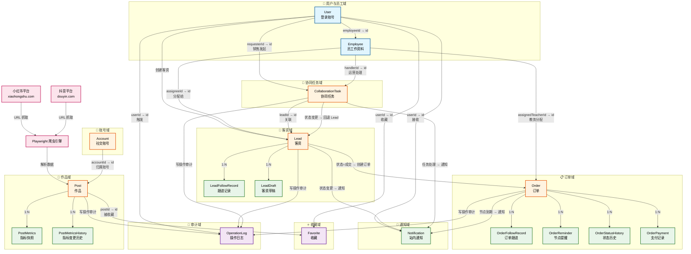
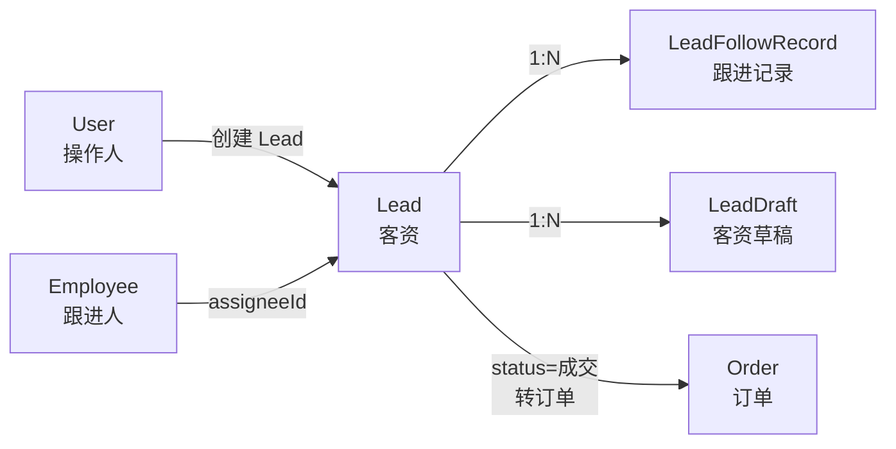
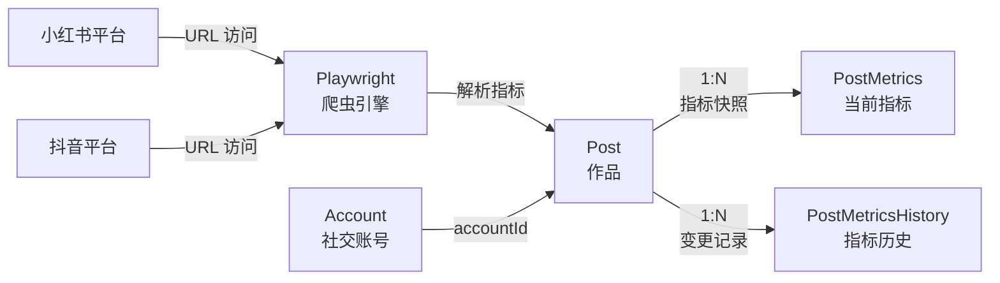
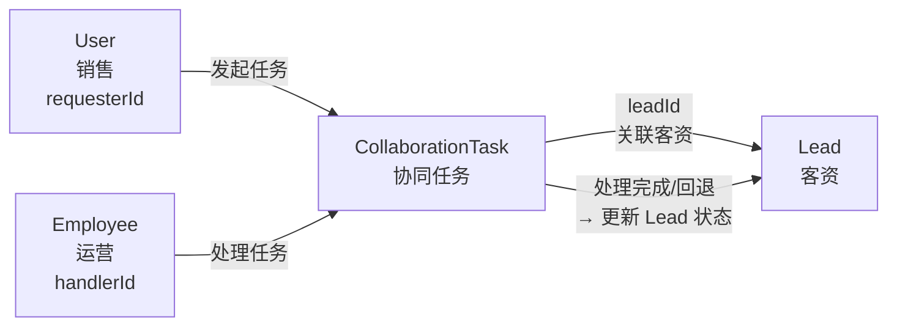
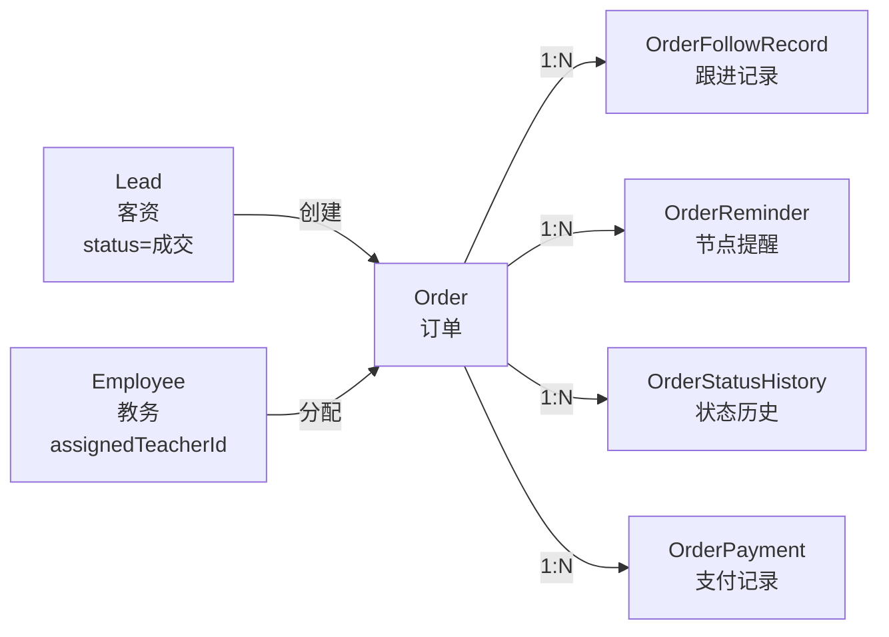
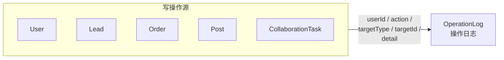

# 数据流图 — 社交媒体运营中台系统

本文档使用 Mermaid 语法描述系统中主要业务实体的数据流向与交互关系。

---

## 全局数据流图

---

## 各业务流程详解

### 1. 客资录入流

**触发点**：销售/员工在系统中录入新客户信息

**数据流向**：

**流程说明**：

1. `User` 创建 `Lead`，记录客户基本信息（姓名、电话、微信、QQ、来源等）
2. `Lead.assigneeId` 指向 `Employee.id`，将客资分配给指定员工跟进
3. 跟进过程中产生多条 `LeadFollowRecord`，记录每次沟通内容
4. `LeadDraft` 用于暂存未完成的客资信息，支持粘贴识别解析
5. 当 `Lead.status` 变更为"成交"时，触发创建 `Order`

---

### 2. 爬虫抓取流

**触发点**：Playwright 定时/手动抓取小红书/抖音作品数据

**数据流向**：

**流程说明**：

1. `Playwright` 使用持久化浏览器会话访问小红书/抖音平台
2. 抓取作品页面，解析出标题、浏览量、点赞数、收藏数、评论数等指标
3. 数据写入 `Post` 表，若已存在则更新
4. `PostMetrics` 记录当前指标快照，`PostMetricsHistory` 记录每次指标变更（用于趋势分析）
5. `Post` 通过 `accountId` 关联到 `Account`，标识归属的社交账号

---

### 3. 协同任务流

**触发点**：销售发起协同请求，运营人员处理

**数据流向**：

**流程说明**：

1. 销售（`User`）创建 `CollaborationTask`，`requesterId` 标识发起人
2. `handlerId` 指向 `Employee.id`，指定运营处理人
3. `leadId` 关联到具体 `Lead`，任务内容与客资强绑定
4. 运营处理完成后，根据处理结果（`handledNote`）可能回退 `Lead` 状态
5. 任务状态流转：待处理 → 处理中 → 已完成 / 已回退

---

### 4. 订单流转

**触发点**：客资成交后创建订单，进入教务交付流程

**数据流向**：

**流程说明**：

1. `Lead` 成交后自动生成 `Order`，`orderNo` 由独立序列号生成器分配
2. `assignedTeacherId` 指向 `Employee.id`，教务老师接管订单
3. `OrderFollowRecord` 记录订单全生命周期的跟进内容
4. `OrderReminder` 在关键节点（如上课前、考试前）触发提醒
5. `OrderStatusHistory` 记录每次状态变更的完整轨迹（创建→交接→教务分配→成交/流失）
6. `OrderPayment` 记录每笔支付明细，支持多次支付

---

### 5. 操作审计流

**触发点**：系统中任何写操作（创建/更新/删除/改派/重置密码等）

**数据流向**：

**流程说明**：

1. 系统中所有关键写操作（`INSERT`/`UPDATE`/`DELETE`）均触发审计记录
2. `OperationLog` 记录：操作人 `userId`、动作 `action`、目标类型 `targetType`、目标ID `targetId`、详情 `detail`
3. 覆盖的操作类型：客资创建/改派/删除、订单创建/状态变更、作品新增/删除、协同任务处理、密码重置等
4. 审计日志不可修改，用于事后追溯和责任界定

---

## 图例说明

| 颜色 | 类型 | 包含实体 |
|------|------|----------|
| 🟦 浅蓝 | 用户实体 | User, Employee |
| 🟧 浅橙 | 核心业务实体 | Lead, Order, Post, Account, CollaborationTask |
| 🟩 浅绿 | 辅助/记录实体 | LeadFollowRecord, PostMetrics, OrderReminder, Notification 等 |
| 🟪 浅紫 | 辅助实体 | Favorite, OperationLog |
| 🟥 粉红 | 外部数据 | 小红书平台、抖音平台、Playwright 爬虫 |

---

## 实体关系总览表

| 主实体 | 关系 | 从实体 | 字段 | 业务含义 |
|--------|------|--------|------|----------|
| User | 1:N | Employee | employeeId | 用户关联员工资料 |
| Lead | 1:N | LeadFollowRecord | leadId | 客资跟进记录 |
| Lead | 1:N | LeadDraft | leadId | 客资草稿（弱关联） |
| Lead | 1:1 | Order | leadId | 成交转订单 |
| Employee | 1:N | Lead | assigneeId | 员工负责客资 |
| Employee | 1:N | Order | assignedTeacherId | 教务分配 |
| Order | 1:N | OrderFollowRecord | orderId | 订单跟进 |
| Order | 1:N | OrderReminder | orderId | 节点提醒 |
| Order | 1:N | OrderStatusHistory | orderId | 状态历史 |
| Order | 1:N | OrderPayment | orderId | 支付记录 |
| Post | 1:N | PostMetrics | postId | 指标快照 |
| Post | 1:N | PostMetricsHistory | postId | 指标变更历史 |
| Account | 1:N | Post | accountId | 账号作品 |
| CollaborationTask | N:1 | Lead | leadId | 任务关联客资 |
| User | 1:N | Favorite | userId | 用户收藏 |
| Post | 1:N | Favorite | postId | 作品被收藏 |
| User | 1:N | Notification | userId | 用户通知 |
| User | 1:N | OperationLog | userId | 操作人 |
