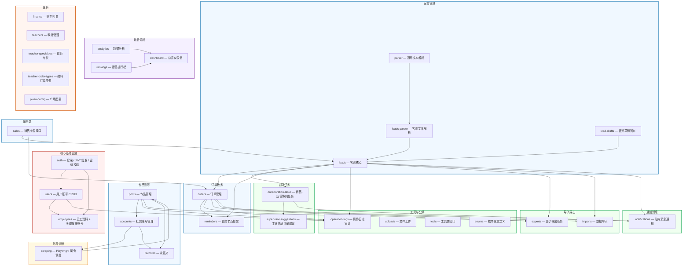
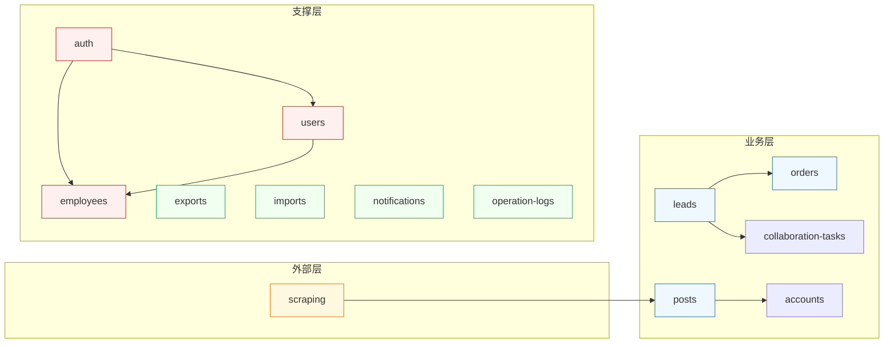

# NestJS 模块划分图

> 本项目为社交媒体运营中台系统，后端基于 NestJS 构建，共包含 35+ 个业务模块。以下按功能域进行模块划分与依赖关系梳理。

## 模块架构图

## 模块组说明

### 核心基础设施

| 模块 | 说明 |
|------|------|
| `auth` | 登录鉴权：JWT 签发、密码校验（bcrypt + 明文双轨）、角色与端口绑定校验 |
| `users` | 用户账号 CRUD，密码管理，状态变更 |
| `employees` | 员工资料管理，关联登录账号，支持创建/重置密码/软删除 |

### 客资管理

| 模块 | 说明 |
|------|------|
| `leads` | 客资核心模块：录入、状态流转、跟进记录、协同、改派、导出 |
| `leads-parser` | 客资文本解析（粘贴识别），将非结构化文本转换为结构化客资 |
| `lead-drafts` | 客资草稿暂存，支持分步录入与暂存恢复 |
| `parser` | 通用文本解析工具，为基础解析能力提供支撑 |

### 订单教务

| 模块 | 说明 |
|------|------|
| `orders` | 订单管理：创建、交接、教务分配、节点提醒、成交状态流转 |
| `reminders` | 教务节点提醒，关联订单生命周期关键节点 |

### 作品账号

| 模块 | 说明 |
|------|------|
| `posts` | 作品管理：CRUD、来源识别、质量状态评估 |
| `accounts` | 社交账号管理（小红书/抖音），绑定作品与账号关系 |
| `favorites` | 收藏夹，支持作品收藏与分类管理 |

### 数据分析

| 模块 | 说明 |
|------|------|
| `analytics` | 数据分析：快照采集、趋势分析、平台统计 |
| `dashboard` | 总览仪表盘汇总接口，聚合各模块核心指标 |
| `rankings` | 运营排行榜，基于作品/账号表现生成排名 |

### 协同任务

| 模块 | 说明 |
|------|------|
| `collaboration-tasks` | 销售-运营协同任务，支持任务分配、跟进、关闭 |
| `supervisor-suggestions` | 主管作品评审建议，关联协同任务的质量把控 |

### 通知消息

| 模块 | 说明 |
|------|------|
| `notifications` | 站内消息通知，支持多端推送与消息中心 |

### 导入导出

| 模块 | 说明 |
|------|------|
| `exports` | 异步导出任务（CSV/Excel），支持大数据量异步处理 |
| `imports` | 数据导入（客资批量导入），支持模板校验与批量入库 |

### 爬虫（外部依赖）

| 模块 | 说明 |
|------|------|
| `scraping` | Playwright 爬虫调度，负责小红书/抖音指标抓取，为 `posts` 和 `accounts` 提供数据 |

### 销售端

| 模块 | 说明 |
|------|------|
| `sales` | 销售专属接口，包含 home-summary、deals 等业务视图 |

### 工具与公共

| 模块 | 说明 |
|------|------|
| `operation-logs` | 操作日志审计，关键写操作（创建/更新/删除/改派/重置密码）自动记录 |
| `uploads` | 文件上传（头像/引流截图），支持多类型文件存储 |
| `tools` | 工具类接口，提供通用辅助功能 |
| `enums` | 枚举常量定义，全系统共享枚举 |

### 其他

| 模块 | 说明 |
|------|------|
| `finance` | 财务相关模块 |
| `teachers` | 教师管理 |
| `teacher-specialties` | 教师专长配置 |
| `teacher-order-types` | 教师订单类型配置 |
| `plaza-config` | 广场配置管理 |

## 依赖关系总览

---

> 上图展示了模块间的核心依赖关系：`scraping` 抓取外部数据驱动 `posts` 和 `accounts` 模块，`leads` 作为客资入口驱动 `orders` 和 `collaboration-tasks` 等业务流，底层 `auth/users/employees` 为全系统提供身份与权限支撑。
