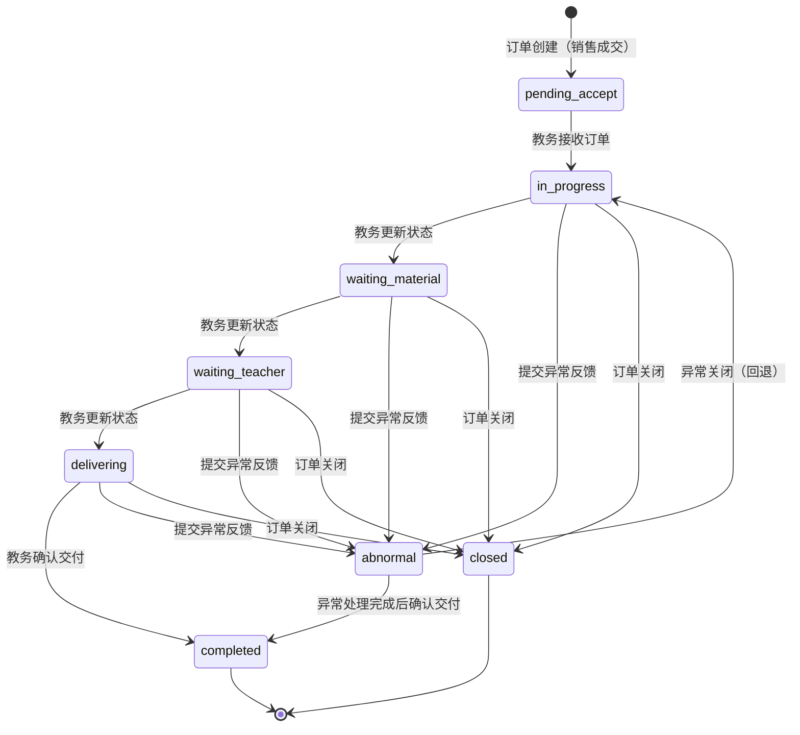
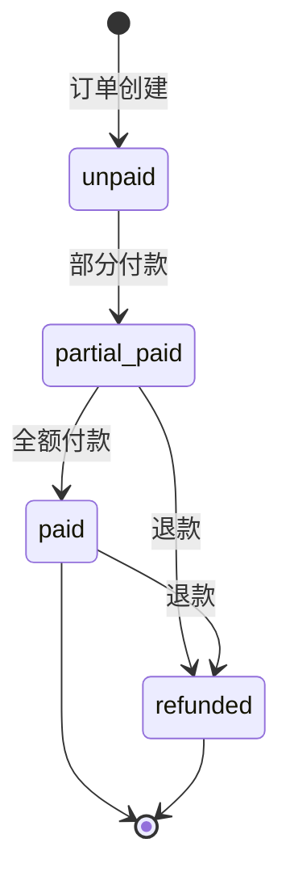
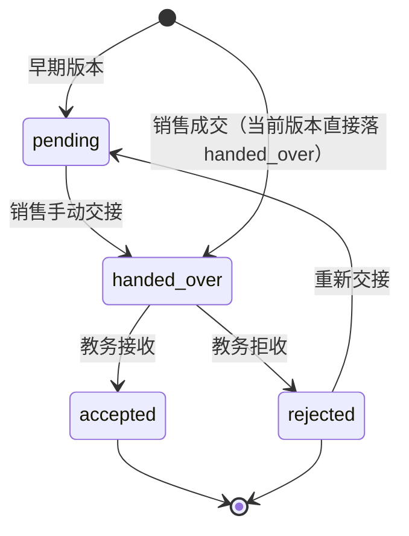
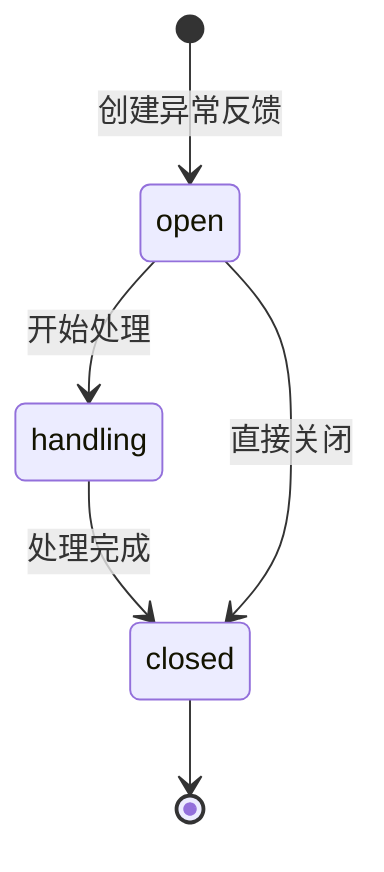

# 教务端测试用例文档（v1.2 完整交付版）

> 文档版本：v1.2-20260603
> 编写日期：2026-06-03
> 编写人：测试工程师
> 依据文档：`doc/v1.2-完整交付版-AB端任务分配.md`
> 适用范围：教务端（`role=academic`）功能测试验收

---

## 文档目录

1. [文档头部与术语约定](#1-文档头部与术语约定)
2. [订单状态机与状态流转图](#2-订单状态机与状态流转图)
3. [测试用例汇总表](#3-测试用例汇总表)
4. [模块一：教务端导航和首页（6 宫格）](#4-模块一教务端导航和首页6-宫格)
5. [模块二：教务订单池](#5-模块二教务订单池)
6. [模块三：教务订单详情](#6-模块三教务订单详情)
7. [模块四：教务进度跟进](#7-模块四教务进度跟进)
8. [模块五：节点提醒](#8-模块五节点提醒)
9. [模块六：异常反馈](#9-模块六异常反馈)
10. [模块七：教务导出](#10-模块七教务导出)
11. [模块八：教务消息中心](#11-模块八教务消息中心)
12. [跨端联调测试用例](#12-跨端联调测试用例)
13. [异常场景测试用例](#13-异常场景测试用例)

---

## 1. 文档头部与术语约定

### 1.1 角色与端口

| 角色 | 入口端口 | 前端入口路径 | 说明 |
| --- | --- | --- | --- |
| `operation` | 3000 | `/operation/*` | 运营端 |
| `sales` | 3000 | `/sales/*` | 销售端 |
| `academic` | 3000 | `/academic/*` | 教务端（测试主体） |
| `supervisor` | 3000 | `/supervisor/*` 或 3001 | 主管端 |
| `admin` | 3000 | `/admin/*` | 管理员端 |

### 1.2 术语对照表

| 术语 | 英文 code | 中文说明 |
| --- | --- | --- |
| 订单状态 | `order_status` | 订单主流程状态 |
| 付款状态 | `paid_status` | 订单支付进度 |
| 交接状态 | `handover_status` | 销售到教务的交接进度 |
| 异常反馈状态 | `feedback_status` | 异常记录的当前处理状态 |

### 1.3 测试环境账号

| 角色 | username | role | 用途 |
| --- | --- | --- | --- |
| 教务甲 | academic01 | academic | 教务主测账号 |
| 教务乙 | academic02 | academic | 教务备测账号 |
| 销售甲 | sales01 | sales | 销售主测账号 |
| 销售乙 | sales02 | sales | 销售备测账号 |
| 主管甲 | admin01 | admin | 主管账号 |

### 1.4 API 基础信息

- 后端接口基础路径：`http://localhost:3000/api`
- 教务端前端路径：`http://localhost:3000/academic`
- 鉴权方式：Bearer Token（JWT）
- Content-Type：`application/json`

---

## 2. 订单状态机与状态流转图

### 2.1 订单主状态机（order_status）



**状态枚举值对照表**：

| code（文档） | DB 实际值 | 中文 |
| --- | --- | --- |
| `pending_accept` | `to_receive` | 待接收 |
| `in_progress` | `in_progress` | 进行中 |
| `waiting_material` | `awaiting_client_info` | 待客户资料 |
| `waiting_teacher` | `awaiting_teacher` | 待老师安排 |
| `delivering` | `to_deliver` | 待交付 |
| `completed` | `completed` | 已完成 |
| `abnormal` | `abnormal` | 异常 |
| `closed` | `closed` | 已关闭 |

### 2.2 付款状态机（paid_status）



**状态枚举值**：

| code | 中文 |
| --- | --- |
| `unpaid` | 未付款 |
| `partial_paid` 或 `partial` | 部分付款 |
| `paid` | 已付款 |
| `refunded` | 已退款 |

### 2.3 交接状态机（handover_status）



**4 个 Handover 路由**：

| 路由 | HTTP 方法 | 触发动作 | 状态变更 |
| --- | --- | --- | --- |
| `hand-over` | POST | 销售手动发起交接 | `pending → handed_over` |
| `accept` | POST | 教务接收订单 | `handed_over → accepted` + `order_status: to_receive → in_progress` |
| `reject` | POST | 教务拒收订单 | `handed_over → rejected`（必须传 reason） |

### 2.4 异常反馈状态机



---

## 3. 测试用例汇总表

| 编号区间 | 模块名称 | 用例数量 | 优先级分布 |
| --- | --- | --- | --- |
| TC-AC-001 ~ TC-AC-025 | 模块一：教务端导航和首页（6 宫格） | 25 | P0: 10, P1: 10, P2: 5 |
| TC-AC-026 ~ TC-AC-075 | 模块二：教务订单池 | 50 | P0: 20, P1: 20, P2: 10 |
| TC-AC-076 ~ TC-AC-115 | 模块三：教务订单详情 | 40 | P0: 15, P1: 15, P2: 10 |
| TC-AC-116 ~ TC-AC-165 | 模块四：教务进度跟进 | 50 | P0: 20, P1: 20, P2: 10 |
| TC-AC-166 ~ TC-AC-195 | 模块五：节点提醒 | 30 | P0: 12, P1: 12, P2: 6 |
| TC-AC-196 ~ TC-AC-245 | 模块六：异常反馈 | 50 | P0: 20, P1: 20, P2: 10 |
| TC-AC-246 ~ TC-AC-275 | 模块七：教务导出 | 30 | P0: 12, P1: 12, P2: 6 |
| TC-AC-276 ~ TC-AC-305 | 模块八：教务消息中心 | 30 | P0: 12, P1: 12, P2: 6 |
| TC-AC-306 ~ TC-AC-325 | 跨端联调测试 | 20 | P0: 8, P1: 8, P2: 4 |
| TC-AC-326 ~ TC-AC-345 | 异常场景测试 | 20 | P0: 8, P1: 8, P2: 4 |
| **合计** | - | **345** | P0: 137, P1: 137, P2: 71 |

---

## 4. 模块一：教务端导航和首页（6 宫格）

### 4.1 导航结构测试

#### TC-AC-001：教务端左侧导航菜单完整性验证

| 字段 | 内容 |
| --- | --- |
| 用例编号 | TC-AC-001 |
| 用例标题 | 教务端左侧导航菜单完整性验证 |
| 模块/子模块 | 导航结构 / 菜单完整性 |
| 优先级 | P0 |
| 前置条件 | 用户已登录且角色为 academic |
| 测试数据 | 无 |
| 测试步骤 | 1. 使用教务账号登录系统<br>2. 进入教务端（/academic）<br>3. 检查左侧导航菜单 |
| 预期结果 | 左侧导航包含：订单池、订单详情（通过订单池跳转）、进度跟进、节点提醒、异常反馈、导出、消息中心 |
| 实际结果 | 待执行 |
| 备注/关联需求 | 依据：5.1 教务端导航和首页 |

#### TC-AC-002：教务端顶部未读消息红点显示

| 字段 | 内容 |
| --- | --- |
| 用例编号 | TC-AC-002 |
| 用例标题 | 教务端顶部未读消息红点显示 |
| 模块/子模块 | 导航结构 / 消息通知 |
| 优先级 | P0 |
| 前置条件 | 1. 教务账号已登录<br>2. 系统有待阅通知 |
| 测试数据 | notification 表有 academic 角色的未读消息 |
| 测试步骤 | 1. 登录教务账号<br>2. 进入教务端首页<br>3. 检查顶部导航区域 |
| 预期结果 | 顶部显示消息中心入口，且当存在未读消息时显示红点badge |
| 实际结果 | 待执行 |
| 备注/关联需求 | 依据：5.1 教务端导航和首页 |

#### TC-AC-003：教务端顶部节点提醒Tag显示

| 字段 | 内容 |
| --- | --- |
| 用例编号 | TC-AC-003 |
| 用例标题 | 教务端顶部节点提醒Tag显示 |
| 模块/子模块 | 导航结构 / 节点提醒 |
| 优先级 | P0 |
| 前置条件 | 1. 教务账号已登录<br>2. 存在待处理节点提醒 |
| 测试数据 | orders 表有 academic_user_id=当前用户的待提醒记录 |
| 测试步骤 | 1. 登录教务账号<br>2. 进入教务端首页<br>3. 检查顶部 toolbar 区域 |
| 预期结果 | 顶部 toolbar 显示"节点提醒"Tag，点击可跳转节点提醒页面 |
| 实际结果 | 待执行 |
| 备注/关联需求 | 依据：5.1 教务端导航和首页 |

### 4.2 首页6宫格测试

#### TC-AC-004：首页6宫格数据卡片展示验证

| 字段 | 内容 |
| --- | --- |
| 用例编号 | TC-AC-004 |
| 用例标题 | 首页6宫格数据卡片展示验证 |
| 模块/子模块 | 首页 / 6宫格 |
| 优先级 | P0 |
| 前置条件 | 教务账号已登录，系统有各类状态的订单 |
| 测试数据 | 订单池待接收数、进行中数、待客户资料数、待老师安排数、即将到期数、异常订单数 |
| 测试步骤 | 1. 登录教务账号<br>2. 进入教务端首页（/academic）<br>3. 检查6宫格卡片 |
| 预期结果 | 首页展示6个统计卡片：待接收、进行中、待客户资料、待老师安排、即将到期、异常订单，每个卡片显示对应数量 |
| 实际结果 | 待执行 |
| 备注/关联需求 | 依据：5.1 教务端首页6宫格 |

#### TC-AC-005：6宫格卡片数量与实际订单匹配

| 字段 | 内容 |
| --- | --- |
| 用例编号 | TC-AC-005 |
| 用例标题 | 6宫格卡片数量与实际订单匹配 |
| 模块/子模块 | 首页 / 6宫格数据准确性 |
| 优先级 | P0 |
| 前置条件 | 数据库有确定数量的各状态订单 |
| 测试数据 | 准备测试数据：待接收3单、进行中5单、待客户资料2单、待老师安排1单、即将到期1单、异常1单 |
| 测试步骤 | 1. 登录教务账号<br>2. 进入首页<br>3. 记录每个卡片的数量<br>4. 手动查询数据库验证 |
| 预期结果 | 每个卡片显示的数量与数据库查询结果一致 |
| 实际结果 | 待执行 |
| 备注/关联需求 | 依据：5.1 教务端首页6宫格 |

#### TC-AC-006：6宫格卡片点击跳转OrderTable筛选

| 字段 | 内容 |
| --- | --- |
| 用例编号 | TC-AC-006 |
| 用例标题 | 6宫格卡片点击跳转OrderTable筛选 |
| 模块/子模块 | 首页 / 6宫格交互 |
| 优先级 | P0 |
| 前置条件 | 教务账号已登录 |
| 测试数据 | 各状态有对应订单 |
| 测试步骤 | 1. 点击"待接收"卡片<br>2. 检查跳转后的URL和筛选条件<br>3. 分别点击其他5个卡片验证 |
| 预期结果 | 点击卡片后跳转到 /academic/orders，且URL包含对应的状态筛选参数 |
| 实际结果 | 待执行 |
| 备注/关联需求 | 依据：5.1 教务端首页6宫格 |

#### TC-AC-007：首页API接口数据准确性验证

| 字段 | 内容 |
| --- | --- |
| 用例编号 | TC-AC-007 |
| 用例标题 | 首页API接口数据准确性验证 |
| 模块/子模块 | 首页 / API接口 |
| 优先级 | P0 |
| 前置条件 | 后端服务正常运行 |
| 测试数据 | 无 |
| 测试步骤 | 1. 调用 GET /api/academic/home-summary 接口<br>2. 记录返回数据<br>3. 与前端页面展示对比 |
| 预期结果 | API 返回数据与前端展示一致 |
| 实际结果 | 待执行 |
| 备注/关联需求 | 依据：5.1 教务端首页 getAcademicHomeSummary |

#### TC-AC-008：首页空数据状态展示

| 字段 | 内容 |
| --- | --- |
| 用例编号 | TC-AC-008 |
| 用例标题 | 首页空数据状态展示 |
| 模块/子模块 | 首页 / 空状态 |
| 优先级 | P1 |
| 前置条件 | 教务账号下没有任何订单 |
| 测试数据 | 清空 academic_user_id 为当前用户的订单 |
| 测试步骤 | 1. 使用无订单的教务账号登录<br>2. 进入首页 |
| 预期结果 | 6宫格卡片显示0或"暂无数据"提示，不显示错误 |
| 实际结果 | 待执行 |
| 备注/关联需求 | 依据：5.1 教务端首页6宫格 |

#### TC-AC-009：首页加载中状态展示

| 字段 | 内容 |
| --- | --- |
| 用例编号 | TC-AC-009 |
| 用例标题 | 首页加载中状态展示 |
| 模块/子模块 | 首页 / 加载状态 |
| 优先级 | P1 |
| 前置条件 | 网络延迟环境（可使用浏览器开发者工具节流） |
| 测试数据 | 无 |
| 测试步骤 | 1. 打开浏览器开发者工具<br>2. 设置网络节流<br>3. 进入教务端首页 |
| 预期结果 | 显示加载动画或骨架屏，数据加载完成后正常展示 |
| 实际结果 | 待执行 |
| 备注/关联需求 | 依据：5.1 教务端前端通用要求 |

#### TC-AC-010：首页错误状态展示

| 字段 | 内容 |
| --- | --- |
| 用例编号 | TC-AC-010 |
| 用例标题 | 首页错误状态展示 |
| 模块/子模块 | 首页 / 错误处理 |
| 优先级 | P1 |
| 前置条件 | API 接口异常（可模拟） |
| 测试数据 | 无 |
| 测试步骤 | 1. 模拟 API 请求失败<br>2. 进入教务端首页 |
| 预期结果 | 显示友好错误提示，提供重试按钮 |
| 实际结果 | 待执行 |
| 备注/关联需求 | 依据：5.1 教务端前端通用要求 |

### 4.3 底部入口卡片测试

#### TC-AC-011：底部3个原入口卡片显示验证

| 字段 | 内容 |
| --- | --- |
| 用例编号 | TC-AC-011 |
| 用例标题 | 底部3个原入口卡片显示验证 |
| 模块/子模块 | 首页 / 底部入口 |
| 优先级 | P1 |
| 前置条件 | 教务账号已登录 |
| 测试数据 | 无 |
| 测试步骤 | 1. 进入教务端首页<br>2. 检查页面底部区域 |
| 预期结果 | 页面底部显示3个入口卡片（订单池、进度跟进、导出中心） |
| 实际结果 | 待执行 |
| 备注/关联需求 | 依据：5.1 教务端前端 6 宫格外底部入口 |

#### TC-AC-012：底部入口卡片跳转验证

| 字段 | 内容 |
| --- | --- |
| 用例编号 | TC-AC-012 |
| 用例标题 | 底部入口卡片跳转验证 |
| 模块/子模块 | 首页 / 底部入口交互 |
| 优先级 | P1 |
| 前置条件 | 教务账号已登录 |
| 测试数据 | 无 |
| 测试步骤 | 1. 点击"订单池"卡片<br>2. 检查跳转路径<br>3. 重复测试"进度跟进"、"导出中心" |
| 预期结果 | 点击后正确跳转到对应页面 |
| 实际结果 | 待执行 |
| 备注/关联需求 | 依据：5.1 教务端前端 |

#### TC-AC-013：顶部角色Tag显示验证

| 字段 | 内容 |
| --- | --- |
| 用例编号 | TC-AC-013 |
| 用例标题 | 顶部角色Tag显示验证 |
| 模块/子模块 | 导航结构 / 角色标识 |
| 优先级 | P0 |
| 前置条件 | 教务账号已登录 |
| 测试数据 | 无 |
| 测试步骤 | 1. 登录教务账号<br>2. 进入教务端 |
| 预期结果 | 顶部 toolbar 显示"教务"或"academic"角色标签 |
| 实际结果 | 待执行 |
| 备注/关联需求 | 依据：5.1 教务端导航和首页 |

#### TC-AC-014：顶部未读消息Badge数字显示

| 字段 | 内容 |
| --- | --- |
| 用例编号 | TC-AC-014 |
| 用例标题 | 顶部未读消息Badge数字显示 |
| 模块/子模块 | 导航结构 / 消息Badge |
| 优先级 | P0 |
| 前置条件 | 1. 教务账号已登录<br>2. 有确定数量的未读消息 |
| 测试数据 | notification 表有 academic 角色的5条未读消息 |
| 测试步骤 | 1. 登录教务账号<br>2. 进入教务端<br>3. 查看顶部 Bell 图标旁的 Badge |
| 预期结果 | Badge 显示数字 5 |
| 实际结果 | 待执行 |
| 备注/关联需求 | 依据：5.1 教务端顶部未读消息 |

#### TC-AC-015：顶部消息入口点击跳转消息中心

| 字段 | 内容 |
| --- | --- |
| 用例编号 | TC-AC-015 |
| 用例标题 | 顶部消息入口点击跳转消息中心 |
| 模块/子模块 | 导航结构 / 消息跳转 |
| 优先级 | P0 |
| 前置条件 | 教务账号已登录 |
| 测试数据 | 无 |
| 测试步骤 | 1. 登录教务账号<br>2. 点击顶部 Bell 图标 |
| 预期结果 | 跳转到 /academic/messages 或打开消息列表 |
| 实际结果 | 待执行 |
| 备注/关联需求 | 依据：5.1 教务端消息中心 |

### 4.4 权限隔离测试

#### TC-AC-016：非教务角色不能访问教务端

| 字段 | 内容 |
| --- | --- |
| 用例编号 | TC-AC-016 |
| 用例标题 | 非教务角色不能访问教务端 |
| 模块/子模块 | 导航结构 / 权限隔离 |
| 优先级 | P0 |
| 前置条件 | 运营账号登录状态 |
| 测试数据 | role=operation 的用户 |
| 测试步骤 | 1. 使用运营账号登录<br>2. 尝试访问 /academic 路径 |
| 预期结果 | 拒绝访问或重定向到运营端首页 |
| 实际结果 | 待执行 |
| 备注/关联需求 | 依据：5.2 角色权限 - academic 角色访问控制 |

#### TC-AC-017：教务只能看到自己负责的订单汇总

| 字段 | 内容 |
| --- | --- |
| 用例编号 | TC-AC-017 |
| 用例标题 | 教务只能看到自己负责的订单汇总 |
| 模块/子模块 | 首页 / 权限过滤 |
| 优先级 | P0 |
| 前置条件 | 1. 教务甲和教务乙各自有订单<br>2. 订单池有待接收订单 |
| 测试数据 | academic01 有 3 单，academic02 有 2 单，池单有 5 单 |
| 测试步骤 | 1. 登录 academic01<br>2. 查看首页6宫格数据<br>3. 对比数据库统计 |
| 预期结果 | 首页数据只包含池单 + academic01 个人订单，不包含 academic02 的订单 |
| 实际结果 | 待执行 |
| 备注/关联需求 | 依据：5.2 角色权限 - academic 角色数据隔离 |

#### TC-AC-018：销售角色不能访问教务端页面

| 字段 | 内容 |
| --- | --- |
| 用例编号 | TC-AC-018 |
| 用例标题 | 销售角色不能访问教务端页面 |
| 模块/子模块 | 导航结构 / 权限隔离 |
| 优先级 | P0 |
| 前置条件 | 销售账号登录状态 |
| 测试数据 | role=sales 的用户 |
| 测试步骤 | 1. 使用销售账号登录<br>2. 尝试直接访问 /academic 路径 |
| 预期结果 | 拒绝访问或重定向到销售端 |
| 实际结果 | 待执行 |
| 备注/关联需求 | 依据：5.2 角色权限 |

#### TC-AC-019：主管角色可访问教务端查看数据

| 字段 | 内容 |
| --- | --- |
| 用例编号 | TC-AC-019 |
| 用例标题 | 主管角色可访问教务端查看数据 |
| 模块/子模块 | 导航结构 / 主管权限 |
| 优先级 | P1 |
| 前置条件 | 主管账号登录状态 |
| 测试数据 | role=admin 或 supervisor 的用户 |
| 测试步骤 | 1. 使用主管账号登录<br>2. 尝试访问 /academic 路径 |
| 预期结果 | 主管可以访问教务端页面（依据主管权限设计） |
| 实际结果 | 待执行 |
| 备注/关联需求 | 依据：5.2 角色权限 - 主管可看全局 |

#### TC-AC-020：首页数据实时刷新验证

| 字段 | 内容 |
| --- | --- |
| 用例编号 | TC-AC-020 |
| 用例标题 | 首页数据实时刷新验证 |
| 模块/子模块 | 首页 / 实时性 |
| 优先级 | P1 |
| 前置条件 | 教务账号已登录首页 |
| 测试数据 | 无 |
| 测试步骤 | 1. 在另一标签页创建一个属于该教务的订单<br>2. 刷新当前首页 |
| 预期结果 | 6宫格数据相应更新 |
| 实际结果 | 待执行 |
| 备注/关联需求 | 依据：5.1 教务端前端数据同步 |

### 4.5 新增功能测试

#### TC-AC-021：首页支持快捷周期筛选

| 字段 | 内容 |
| --- | --- |
| 用例编号 | TC-AC-021 |
| 用例标题 | 首页支持快捷周期筛选 |
| 模块/子模块 | 首页 / 筛选功能 |
| 优先级 | P2 |
| 前置条件 | 教务账号已登录 |
| 测试数据 | 有不同时期的订单 |
| 测试步骤 | 1. 进入首页<br>2. 使用周期筛选器（今日/本周/本月/累计）<br>3. 观察数据变化 |
| 预期结果 | 不同周期下展示对应时间范围内的订单统计 |
| 实际结果 | 待执行 |
| 备注/关联需求 | 依据：5.1 教务端前端 [ ] 待开发 |

#### TC-AC-022：首页卡片支持拖拽排序

| 字段 | 内容 |
| --- | --- |
| 用例编号 | TC-AC-022 |
| 用例标题 | 首页卡片支持拖拽排序 |
| 模块/子模块 | 首页 / 个性化 |
| 优先级 | P2 |
| 前置条件 | 教务账号已登录 |
| 测试数据 | 无 |
| 测试步骤 | 1. 进入首页<br>2. 尝试拖拽卡片调整位置<br>3. 刷新页面验证是否保存 |
| 预期结果 | 卡片位置可调整并保存 |
| 实际结果 | 待执行 |
| 备注/关联需求 | 依据：P2 待开发功能 |

#### TC-AC-023：首页6宫格卡片支持自定义

| 字段 | 内容 |
| --- | --- |
| 用例编号 | TC-AC-023 |
| 用例标题 | 首页6宫格卡片支持自定义 |
| 模块/子模块 | 首页 / 个性化配置 |
| 优先级 | P2 |
| 前置条件 | 教务账号已登录 |
| 测试数据 | 无 |
| 测试步骤 | 1. 进入首页<br>2. 进入卡片自定义模式<br>3. 添加/删除/替换卡片 |
| 预期结果 | 用户可自定义展示的统计卡片 |
| 实际结果 | 待执行 |
| 备注/关联需求 | 依据：P2 待开发功能 |

#### TC-AC-024：首页快捷操作入口

| 字段 | 内容 |
| --- | --- |
| 用例编号 | TC-AC-024 |
| 用例标题 | 首页快捷操作入口 |
| 模块/子模块 | 首页 / 快捷操作 |
| 优先级 | P2 |
| 前置条件 | 教务账号已登录 |
| 测试数据 | 无 |
| 测试步骤 | 1. 进入首页<br>2. 检查是否有快捷操作入口（如：一键接收全部订单） |
| 预期结果 | 提供常用操作的快捷入口 |
| 实际结果 | 待执行 |
| 备注/关联需求 | 依据：P2 优化体验功能 |

#### TC-AC-025：首页数据导出入口

| 字段 | 内容 |
| --- | --- |
| 用例编号 | TC-AC-025 |
| 用例标题 | 首页数据导出入口 |
| 模块/子模块 | 首页 / 导出功能 |
| 优先级 | P2 |
| 前置条件 | 教务账号已登录 |
| 测试数据 | 无 |
| 测试步骤 | 1. 进入首页<br>2. 检查是否有快速导出入口 |
| 预期结果 | 提供首页数据的快速导出功能 |
| 实际结果 | 待执行 |
| 备注/关联需求 | 依据：P2 待开发功能 |

---

## 5. 模块二：教务订单池

### 5.1 订单池基础功能

#### TC-AC-026：订单池列表展示进入教务的成交订单

| 字段 | 内容 |
| --- | --- |
| 用例编号 | TC-AC-026 |
| 用例标题 | 订单池列表展示进入教务的成交订单 |
| 模块/子模块 | 订单池 / 列表展示 |
| 优先级 | P0 |
| 前置条件 | 1. 销售已成交订单<br>2. 订单已创建并通知教务 |
| 测试数据 | orders 表有 `order_status='to_receive'` 且 `handover_status='handed_over'` 的订单 |
| 测试步骤 | 1. 登录教务账号<br>2. 进入订单池页面（/academic/orders）<br>3. 检查列表展示 |
| 预期结果 | 列表展示所有进入教务交付流程的订单，包括池单和自己已认领的订单 |
| 实际结果 | 待执行 |
| 备注/关联需求 | 依据：5.1 教务订单池 - 展示进入教务的成交订单 |

#### TC-AC-027：订单池权限过滤验证

| 字段 | 内容 |
| --- | --- |
| 用例编号 | TC-AC-027 |
| 用例标题 | 订单池权限过滤验证 |
| 模块/子模块 | 订单池 / 权限隔离 |
| 优先级 | P0 |
| 前置条件 | 1. academic01 有认领的订单<br>2. academic02 有认领的订单<br>3. 订单池有待接收订单 |
| 测试数据 | academic01 有 2 单，academic02 有 3 单，池单 5 单 |
| 测试步骤 | 1. 用 academic01 登录<br>2. 进入订单池<br>3. 记录列表数据<br>4. 对比 academic01 可见范围 |
| 预期结果 | academic01 只能看到：池单 + 自己认领的2单，不能看到 academic02 的3单 |
| 实际结果 | 待执行 |
| 备注/关联需求 | 依据：5.2 角色权限 - 教务只能看已成交订单 |

#### TC-AC-028：订单池状态Tab筛选-待接收

| 字段 | 内容 |
| --- | --- |
| 用例编号 | TC-AC-028 |
| 用例标题 | 订单池状态Tab筛选-待接收 |
| 模块/子模块 | 订单池 / 状态筛选 |
| 优先级 | P0 |
| 前置条件 | 订单池有待接收订单 |
| 测试数据 | orders 表有 `order_status='to_receive'` 记录 |
| 测试步骤 | 1. 进入订单池<br>2. 点击"待接收"Tab |
| 预期结果 | 仅显示 `order_status='to_receive'` 的订单 |
| 实际结果 | 待执行 |
| 备注/关联需求 | 依据：5.1 教务订单池 - 待接收筛选 |

#### TC-AC-029：订单池状态Tab筛选-进行中

| 字段 | 内容 |
| --- | --- |
| 用例编号 | TC-AC-029 |
| 用例标题 | 订单池状态Tab筛选-进行中 |
| 模块/子模块 | 订单池 / 状态筛选 |
| 优先级 | P0 |
| 前置条件 | 订单池有进行中订单 |
| 测试数据 | orders 表有 `order_status='in_progress'` 记录 |
| 测试步骤 | 1. 进入订单池<br>2. 点击"进行中"Tab |
| 预期结果 | 仅显示 `order_status='in_progress'` 的订单 |
| 实际结果 | 待执行 |
| 备注/关联需求 | 依据：5.1 教务订单池 |

#### TC-AC-030：订单池状态Tab筛选-待客户资料

| 字段 | 内容 |
| --- | --- |
| 用例编号 | TC-AC-030 |
| 用例标题 | 订单池状态Tab筛选-待客户资料 |
| 模块/子模块 | 订单池 / 状态筛选 |
| 优先级 | P0 |
| 前置条件 | 订单池有待客户资料订单 |
| 测试数据 | orders 表有 `order_status='awaiting_client_info'` 记录 |
| 测试步骤 | 1. 进入订单池<br>2. 点击"待客户资料"Tab |
| 预期结果 | 仅显示 `order_status='awaiting_client_info'` 的订单 |
| 实际结果 | 待执行 |
| 备注/关联需求 | 依据：5.1 教务订单池 |

#### TC-AC-031：订单池状态Tab筛选-待老师安排

| 字段 | 内容 |
| --- | --- |
| 用例编号 | TC-AC-031 |
| 用例标题 | 订单池状态Tab筛选-待老师安排 |
| 模块/子模块 | 订单池 / 状态筛选 |
| 优先级 | P0 |
| 前置条件 | 订单池有待老师安排订单 |
| 测试数据 | orders 表有 `order_status='awaiting_teacher'` 记录 |
| 测试步骤 | 1. 进入订单池<br>2. 点击"待老师安排"Tab |
| 预期结果 | 仅显示 `order_status='awaiting_teacher'` 的订单 |
| 实际结果 | 待执行 |
| 备注/关联需求 | 依据：5.1 教务订单池 |

#### TC-AC-032：订单池状态Tab筛选-待交付

| 字段 | 内容 |
| --- | --- |
| 用例编号 | TC-AC-032 |
| 用例标题 | 订单池状态Tab筛选-待交付 |
| 模块/子模块 | 订单池 / 状态筛选 |
| 优先级 | P0 |
| 前置条件 | 订单池有待交付订单 |
| 测试数据 | orders 表有 `order_status='to_deliver'` 记录 |
| 测试步骤 | 1. 进入订单池<br>2. 点击"待交付"Tab |
| 预期结果 | 仅显示 `order_status='to_deliver'` 的订单 |
| 实际结果 | 待执行 |
| 备注/关联需求 | 依据：5.1 教务订单池 |

#### TC-AC-033：订单池状态Tab筛选-已完成

| 字段 | 内容 |
| --- | --- |
| 用例编号 | TC-AC-033 |
| 用例标题 | 订单池状态Tab筛选-已完成 |
| 模块/子模块 | 订单池 / 状态筛选 |
| 优先级 | P0 |
| 前置条件 | 订单池有已完成订单 |
| 测试数据 | orders 表有 `order_status='completed'` 记录 |
| 测试步骤 | 1. 进入订单池<br>2. 点击"已完成"Tab |
| 预期结果 | 仅显示 `order_status='completed'` 的订单 |
| 实际结果 | 待执行 |
| 备注/关联需求 | 依据：5.1 教务订单池 |

#### TC-AC-034：订单池状态Tab筛选-异常

| 字段 | 内容 |
| --- | --- |
| 用例编号 | TC-AC-034 |
| 用例标题 | 订单池状态Tab筛选-异常 |
| 模块/子模块 | 订单池 / 状态筛选 |
| 优先级 | P0 |
| 前置条件 | 订单池有异常订单 |
| 测试数据 | orders 表有 `order_status='abnormal'` 记录 |
| 测试步骤 | 1. 进入订单池<br>2. 点击"异常"Tab |
| 预期结果 | 仅显示 `order_status='abnormal'` 的订单 |
| 实际结果 | 待执行 |
| 备注/关联需求 | 依据：5.1 教务订单池 - 异常筛选 |

### 5.2 订单池高级筛选

#### TC-AC-035：订单池销售筛选

| 字段 | 内容 |
| --- | --- |
| 用例编号 | TC-AC-035 |
| 用例标题 | 订单池销售筛选 |
| 模块/子模块 | 订单池 / 高级筛选 |
| 优先级 | P0 |
| 前置条件 | 订单池有不同销售创建的订单 |
| 测试数据 | sales01 创建的订单有3单，sales02 创建的订单有2单 |
| 测试步骤 | 1. 进入订单池<br>2. 打开高级筛选<br>3. 选择销售 sales01 |
| 预期结果 | 仅显示 sales01 创建的订单 |
| 实际结果 | 待执行 |
| 备注/关联需求 | 依据：5.1 教务订单池 - 销售筛选 |

#### TC-AC-036：订单池教务筛选

| 字段 | 内容 |
| --- | --- |
| 用例编号 | TC-AC-036 |
| 用例标题 | 订单池教务筛选 |
| 模块/子模块 | 订单池 / 高级筛选 |
| 优先级 | P0 |
| 前置条件 | 不同教务有认领的订单 |
| 测试数据 | academic01 认领3单，academic02 认领2单 |
| 测试步骤 | 1. 进入订单池<br>2. 打开高级筛选<br>3. 选择教务 academic01 |
| 预期结果 | 仅显示 academic01 认领的订单 |
| 实际结果 | 待执行 |
| 备注/关联需求 | 依据：5.1 教务订单池 - 教务筛选 |

#### TC-AC-037：订单池服务类型筛选

| 字段 | 内容 |
| --- | --- |
| 用例编号 | TC-AC-037 |
| 用例标题 | 订单池服务类型筛选 |
| 模块/子模块 | 订单池 / 高级筛选 |
| 优先级 | P0 |
| 前置条件 | 订单池有不同服务类型的订单 |
| 测试数据 | 服务类型 A 有5单，服务类型 B 有3单 |
| 测试步骤 | 1. 进入订单池<br>2. 打开高级筛选<br>3. 选择服务类型 A |
| 预期结果 | 仅显示服务类型为 A 的订单 |
| 实际结果 | 待执行 |
| 备注/关联需求 | 依据：5.1 教务订单池 - 服务类型筛选 |

#### TC-AC-038：订单池付款状态筛选-未付款

| 字段 | 内容 |
| --- | --- |
| 用例编号 | TC-AC-038 |
| 用例标题 | 订单池付款状态筛选-未付款 |
| 模块/子模块 | 订单池 / 高级筛选 |
| 优先级 | P0 |
| 前置条件 | 订单池有不同付款状态的订单 |
| 测试数据 | unpaid 有2单，paid 有5单，partial 有1单 |
| 测试步骤 | 1. 进入订单池<br>2. 打开高级筛选<br>3. 选择付款状态"未付款" |
| 预期结果 | 仅显示 `paid_status='unpaid'` 的订单 |
| 实际结果 | 待执行 |
| 备注/关联需求 | 依据：5.1 教务订单池 - 付款状态筛选 |

#### TC-AC-039：订单池付款状态筛选-部分付款

| 字段 | 内容 |
| --- | --- |
| 用例编号 | TC-AC-039 |
| 用例标题 | 订单池付款状态筛选-部分付款 |
| 模块/子模块 | 订单池 / 高级筛选 |
| 优先级 | P0 |
| 前置条件 | 订单池有部分付款订单 |
| 测试数据 | `paid_status='partial'` 有订单 |
| 测试步骤 | 1. 进入订单池<br>2. 打开高级筛选<br>3. 选择付款状态"部分付款" |
| 预期结果 | 仅显示 `paid_status='partial'` 或 `partial_paid` 的订单 |
| 实际结果 | 待执行 |
| 备注/关联需求 | 依据：5.1 教务订单池 |

#### TC-AC-040：订单池付款状态筛选-已付款

| 字段 | 内容 |
| --- | --- |
| 用例编号 | TC-AC-040 |
| 用例标题 | 订单池付款状态筛选-已付款 |
| 模块/子模块 | 订单池 / 高级筛选 |
| 优先级 | P0 |
| 前置条件 | 订单池有已付款订单 |
| 测试数据 | `paid_status='paid'` 有订单 |
| 测试步骤 | 1. 进入订单池<br>2. 打开高级筛选<br>3. 选择付款状态"已付款" |
| 预期结果 | 仅显示 `paid_status='paid'` 的订单 |
| 实际结果 | 待执行 |
| 备注/关联需求 | 依据：5.1 教务订单池 |

#### TC-AC-041：订单池付款状态筛选-已退款

| 字段 | 内容 |
| --- | --- |
| 用例编号 | TC-AC-041 |
| 用例标题 | 订单池付款状态筛选-已退款 |
| 模块/子模块 | 订单池 / 高级筛选 |
| 优先级 | P0 |
| 前置条件 | 订单池有已退款订单 |
| 测试数据 | `paid_status='refunded'` 有订单 |
| 测试步骤 | 1. 进入订单池<br>2. 打开高级筛选<br>3. 选择付款状态"已退款" |
| 预期结果 | 仅显示 `paid_status='refunded'` 的订单 |
| 实际结果 | 待执行 |
| 备注/关联需求 | 依据：5.2 订单状态机 - refunded 状态 |

#### TC-AC-042：订单池交付节点筛选

| 字段 | 内容 |
| --- | --- |
| 用例编号 | TC-AC-042 |
| 用例标题 | 订单池交付节点筛选 |
| 模块/子模块 | 订单池 / 高级筛选 |
| 优先级 | P1 |
| 前置条件 | 订单有交付节点进度记录 |
| 测试数据 | 不同交付节点的订单 |
| 测试步骤 | 1. 进入订单池<br>2. 打开高级筛选<br>3. 选择交付节点条件 |
| 预期结果 | 仅显示符合交付节点条件的订单 |
| 实际结果 | 待执行 |
| 备注/关联需求 | 依据：5.1 教务订单池 - 交付节点筛选 |

#### TC-AC-043：订单池订单时间范围筛选

| 字段 | 内容 |
| --- | --- |
| 用例编号 | TC-AC-043 |
| 用例标题 | 订单池订单时间范围筛选 |
| 模块/子模块 | 订单池 / 高级筛选 |
| 优先级 | P0 |
| 前置条件 | 订单池有不同时期的订单 |
| 测试数据 | 最近7天3单，最近30天5单，更早2单 |
| 测试步骤 | 1. 进入订单池<br>2. 打开高级筛选<br>3. 选择时间范围"最近7天" |
| 预期结果 | 仅显示7天内创建的订单 |
| 实际结果 | 待执行 |
| 备注/关联需求 | 依据：5.1 教务订单池 - 订单时间筛选 |

#### TC-AC-044：订单池多条件组合筛选

| 字段 | 内容 |
| --- | --- |
| 用例编号 | TC-AC-044 |
| 用例标题 | 订单池多条件组合筛选 |
| 模块/子模块 | 订单池 / 高级筛选 |
| 优先级 | P0 |
| 前置条件 | 有满足多条件的订单数据 |
| 测试数据 | 销售=甲 + 状态=进行中 + 付款=已付 的订单 |
| 测试步骤 | 1. 进入订单池<br>2. 选择状态=进行中<br>3. 再选择销售=甲<br>4. 再选择付款状态=已付款 |
| 预期结果 | 同时满足所有筛选条件的订单 |
| 实际结果 | 待执行 |
| 备注/关联需求 | 依据：5.1 教务订单池 - 多条件筛选 |

### 5.3 订单池操作功能

#### TC-AC-045：接收订单功能

| 字段 | 内容 |
| --- | --- |
| 用例编号 | TC-AC-045 |
| 用例标题 | 接收订单功能 |
| 模块/子模块 | 订单池 / 订单操作 |
| 优先级 | P0 |
| 前置条件 | 订单池有待接收订单 |
| 测试数据 | `order_status='to_receive'`, `handover_status='handed_over'`, `academic_user_id=NULL` |
| 测试步骤 | 1. 进入订单池<br>2. 找到待接收订单<br>3. 点击"接收"按钮<br>4. 确认接收 |
| 预期结果 | 1. `academic_user_id` 更新为当前用户<br>2. `order_status` 变为 `in_progress`<br>3. `handover_status` 变为 `accepted`<br>4. 列表刷新，订单从"待接收"消失 |
| 实际结果 | 待执行 |
| 备注/关联需求 | 依据：5.1 教务进度跟进 + 9.2 销售到教务联调 |

#### TC-AC-046：分配订单给其他教务

| 字段 | 内容 |
| --- | --- |
| 用例编号 | TC-AC-046 |
| 用例标题 | 分配订单给其他教务 |
| 模块/子模块 | 订单池 / 订单操作 |
| 优先级 | P0 |
| 前置条件 | 教务甲已认领订单 |
| 测试数据 | academic01 已认领的订单 |
| 测试步骤 | 1. 登录 academic01<br>2. 进入订单池<br>3. 找到自己已认领的订单<br>4. 点击"分配教务"<br>5. 选择 academic02 |
| 预期结果 | 订单 `academic_user_id` 变为 academic02 |
| 实际结果 | 待执行 |
| 备注/关联需求 | 依据：5.1 教务订单池 - 分配教务 |

#### TC-AC-047：更新订单状态

| 字段 | 内容 |
| --- | --- |
| 用例编号 | TC-AC-047 |
| 用例标题 | 更新订单状态 |
| 模块/子模块 | 订单池 / 订单操作 |
| 优先级 | P0 |
| 前置条件 | 教务有进行中的订单 |
| 测试数据 | `order_status='in_progress'` 的订单 |
| 测试步骤 | 1. 进入订单池<br>2. 找到进行中订单<br>3. 在状态选择器中选择"待客户资料" |
| 预期结果 | 订单 `order_status` 更新为 `awaiting_client_info` |
| 实际结果 | 待执行 |
| 备注/关联需求 | 依据：5.1 教务订单池 - 更新订单状态 |

#### TC-AC-048：订单状态完整流转验证-正向

| 字段 | 内容 |
| --- | --- |
| 用例编号 | TC-AC-048 |
| 用例标题 | 订单状态完整流转验证-正向 |
| 模块/子模块 | 订单池 / 状态机 |
| 优先级 | P0 |
| 前置条件 | 有待接收订单 |
| 测试数据 | 新成交订单 |
| 测试步骤 | 1. 接收订单（to_receive → in_progress）<br>2. 更新为待客户资料（in_progress → awaiting_client_info）<br>3. 更新为待老师安排（awaiting_client_info → awaiting_teacher）<br>4. 更新为待交付（awaiting_teacher → to_deliver）<br>5. 确认交付（to_deliver → completed） |
| 预期结果 | 每步状态正确流转，最终到达 completed |
| 实际结果 | 待执行 |
| 备注/关联需求 | 依据：5.2 订单状态机 - 完整正向流转 |

#### TC-AC-049：订单状态完整流转验证-异常路径

| 字段 | 内容 |
| --- | --- |
| 用例编号 | TC-AC-049 |
| 用例标题 | 订单状态完整流转验证-异常路径 |
| 模块/子模块 | 订单池 / 状态机 |
| 优先级 | P0 |
| 前置条件 | 有进行中订单 |
| 测试数据 | `order_status='in_progress'` 的订单 |
| 测试步骤 | 1. 在进行中状态点击"异常"按钮<br>2. 填写异常信息并提交<br>3. 验证订单状态变为 `abnormal` |
| 预期结果 | 订单 `order_status` 变为 `abnormal` |
| 实际结果 | 待执行 |
| 备注/关联需求 | 依据：5.2 订单状态机 - 异常分支 |

#### TC-AC-050：异常订单回退到进行中

| 字段 | 内容 |
| --- | --- |
| 用例编号 | TC-AC-050 |
| 用例标题 | 异常订单回退到进行中 |
| 模块/子模块 | 订单池 / 状态机 |
| 优先级 | P0 |
| 前置条件 | 有异常订单 |
| 测试数据 | `order_status='abnormal'` |
| 测试步骤 | 1. 进入异常订单详情<br>2. 填写处理说明<br>3. 点击"关闭异常" |
| 预期结果 | 订单 `order_status` 回退为 `in_progress` |
| 实际结果 | 待执行 |
| 备注/关联需求 | 依据：5.2 订单状态机 - 异常回退 |

### 5.4 订单池分页和排序

#### TC-AC-051：订单池分页功能

| 字段 | 内容 |
| --- | --- |
| 用例编号 | TC-AC-051 |
| 用例标题 | 订单池分页功能 |
| 模块/子模块 | 订单池 / 分页 |
| 优先级 | P0 |
| 前置条件 | 订单数量超过一页（20条） |
| 测试数据 | 25条订单 |
| 测试步骤 | 1. 进入订单池<br>2. 查看第一页<br>3. 点击下一页 |
| 预期结果 | 1. 第一页显示20条<br>2. 第二页显示5条<br>3. 分页器显示总数25条 |
| 实际结果 | 待执行 |
| 备注/关联需求 | 依据：5.1 教务订单池 - 分页 |

#### TC-AC-052：订单池排序-按创建时间倒序

| 字段 | 内容 |
| --- | --- |
| 用例编号 | TC-AC-052 |
| 用例标题 | 订单池排序-按创建时间倒序 |
| 模块/子模块 | 订单池 / 排序 |
| 优先级 | P1 |
| 前置条件 | 有多条订单 |
| 测试数据 | 不同创建时间的订单 |
| 测试步骤 | 1. 进入订单池<br>2. 点击"创建时间"列头排序 |
| 预期结果 | 订单按创建时间倒序排列（最新在前） |
| 实际结果 | 待执行 |
| 备注/关联需求 | 依据：5.1 教务订单池 - 排序 |

#### TC-AC-053：订单池排序-按更新时间

| 字段 | 内容 |
| --- | --- |
| 用例编号 | TC-AC-053 |
| 用例标题 | 订单池排序-按更新时间 |
| 模块/子模块 | 订单池 / 排序 |
| 优先级 | P1 |
| 前置条件 | 有多条订单 |
| 测试数据 | 不同更新时间的订单 |
| 测试步骤 | 1. 进入订单池<br>2. 点击更新时间列头 |
| 预期结果 | 订单按更新时间排列 |
| 实际结果 | 待执行 |
| 备注/关联需求 | 依据：5.1 教务订单池 - 排序 |

#### TC-AC-054：订单池排序-按成交金额

| 字段 | 内容 |
| --- | --- |
| 用例编号 | TC-AC-054 |
| 用例标题 | 订单池排序-按成交金额 |
| 模块/子模块 | 订单池 / 排序 |
| 优先级 | P1 |
| 前置条件 | 有多条订单 |
| 测试数据 | 不同金额的订单 |
| 测试步骤 | 1. 进入订单池<br>2. 点击金额列头 |
| 预期结果 | 订单按金额升序/降序排列 |
| 实际结果 | 待执行 |
| 备注/关联需求 | 依据：5.1 教务订单池 - 排序 |

### 5.5 订单池空状态和边界

#### TC-AC-055：订单池空状态展示

| 字段 | 内容 |
| --- | --- |
| 用例编号 | TC-AC-055 |
| 用例标题 | 订单池空状态展示 |
| 模块/子模块 | 订单池 / 空状态 |
| 优先级 | P1 |
| 前置条件 | 教务没有任何订单 |
| 测试数据 | 清空 academic_user_id 为当前用户的订单 |
| 测试步骤 | 1. 登录一个无订单的教务账号<br>2. 进入订单池 |
| 预期结果 | 显示"暂无订单"提示，不显示错误 |
| 实际结果 | 待执行 |
| 备注/关联需求 | 依据：5.1 教务订单池 - 空状态 |

#### TC-AC-056：筛选条件下无数据展示

| 字段 | 内容 |
| --- | --- |
| 用例编号 | TC-AC-056 |
| 用例标题 | 筛选条件下无数据展示 |
| 模块/子模块 | 订单池 / 空状态 |
| 优先级 | P1 |
| 前置条件 | 有订单但没有符合筛选条件的 |
| 测试数据 | 选择一个不存在的筛选条件 |
| 测试步骤 | 1. 进入订单池<br>2. 选择一个不可能有数据的筛选条件 |
| 预期结果 | 显示"没有符合条件的数据"提示 |
| 实际结果 | 待执行 |
| 备注/关联需求 | 依据：5.1 教务订单池 |

#### TC-AC-057：订单池交接状态列显示

| 字段 | 内容 |
| --- | --- |
| 用例编号 | TC-AC-057 |
| 用例标题 | 订单池交接状态列显示 |
| 模块/子模块 | 订单池 / 列表字段 |
| 优先级 | P0 |
| 前置条件 | 有不同交接状态的订单 |
| 测试数据 | pending/handed_over/accepted/rejected 各有订单 |
| 测试步骤 | 1. 进入订单池<br>2. 检查是否有交接状态列 |
| 预期结果 | 显示 handover_status 列，状态与实际一致 |
| 实际结果 | 待执行 |
| 备注/关联需求 | 依据：5.1 教务订单池 + M14 handover_status |

#### TC-AC-058：订单池交接状态筛选

| 字段 | 内容 |
| --- | --- |
| 用例编号 | TC-AC-058 |
| 用例标题 | 订单池交接状态筛选 |
| 模块/子模块 | 订单池 / 高级筛选 |
| 优先级 | P0 |
| 前置条件 | 有不同交接状态的订单 |
| 测试数据 | handover_status 各状态的订单 |
| 测试步骤 | 1. 进入订单池<br>2. 高级筛选选择 handover_status=pending |
| 预期结果 | 仅显示 `handover_status='pending'` 的订单 |
| 实际结果 | 待执行 |
| 备注/关联需求 | 依据：5.1 教务订单池 + M14 |

#### TC-AC-059：订单池导出按钮功能

| 字段 | 内容 |
| --- | --- |
| 用例编号 | TC-AC-059 |
| 用例标题 | 订单池导出按钮功能 |
| 模块/子模块 | 订单池 / 导出功能 |
| 优先级 | P1 |
| 前置条件 | 订单池有订单 |
| 测试数据 | 有可导出的订单 |
| 测试步骤 | 1. 进入订单池<br>2. 点击"导出"按钮 |
| 预期结果 | 触发导出流程，跳转导出中心或弹出导出配置 |
| 实际结果 | 待执行 |
| 备注/关联需求 | 依据：5.1 教务导出 |

#### TC-AC-060：订单池数据权限验证

| 字段 | 内容 |
| --- | --- |
| 用例编号 | TC-AC-060 |
| 用例标题 | 订单池数据权限验证 |
| 模块/子模块 | 订单池 / 权限隔离 |
| 优先级 | P0 |
| 前置条件 | 存在越权订单数据 |
| 测试数据 | academic_user_id 为其他教务的订单 |
| 测试步骤 | 1. 登录 academic01<br>2. 尝试通过直接 API 访问 academic02 的订单 |
| 预期结果 | API 返回403或空数据，不能看到其他教务的订单 |
| 实际结果 | 待执行 |
| 备注/关联需求 | 依据：5.2 角色权限 - 数据隔离 |

### 5.6 Handover 路由测试

#### TC-AC-061：Handover状态-pending视图

| 字段 | 内容 |
| --- | --- |
| 用例编号 | TC-AC-061 |
| 用例标题 | Handover状态-pending视图 |
| 模块/子模块 | 订单池 / Handover状态 |
| 优先级 | P0 |
| 前置条件 | 有 handover_status=pending 的订单 |
| 测试数据 | `handover_status='pending'` |
| 测试步骤 | 1. 进入订单池<br>2. 查看订单的交接状态列 |
| 预期结果 | 显示"待交接"标签 |
| 实际结果 | 待执行 |
| 备注/关联需求 | 依据：5.2 Handover状态机 |

#### TC-AC-062：Handover状态-handed_over视图

| 字段 | 内容 |
| --- | --- |
| 用例编号 | TC-AC-062 |
| 用例标题 | Handover状态-handed_over视图 |
| 模块/子模块 | 订单池 / Handover状态 |
| 优先级 | P0 |
| 前置条件 | 有 handover_status=handed_over 的订单 |
| 测试数据 | `handover_status='handed_over'` |
| 测试步骤 | 1. 进入订单池<br>2. 查看订单的交接状态列 |
| 预期结果 | 显示"已交接"标签，教务可操作"接收" |
| 实际结果 | 待执行 |
| 备注/关联需求 | 依据：5.2 Handover状态机 |

#### TC-AC-063：Handover路由-accept接收订单

| 字段 | 内容 |
| --- | --- |
| 用例编号 | TC-AC-063 |
| 用例标题 | Handover路由-accept接收订单 |
| 模块/子模块 | 订单池 / Handover路由 |
| 优先级 | P0 |
| 前置条件 | 订单 handover_status=handed_over |
| 测试数据 | `handover_status='handed_over'`, `order_status='to_receive'` |
| 测试步骤 | 1. 调用 POST /api/orders/:id/handover/accept |
| 预期结果 | 1. `handover_status` → `accepted`<br>2. `order_status` → `in_progress`<br>3. 通知销售订单已被接收 |
| 实际结果 | 待执行 |
| 备注/关联需求 | 依据：5.2 Handover 4路由 + 9.2 联调 |

#### TC-AC-064：Handover路由-reject拒收订单

| 字段 | 内容 |
| --- | --- |
| 用例编号 | TC-AC-064 |
| 用例标题 | Handover路由-reject拒收订单 |
| 模块/子模块 | 订单池 / Handover路由 |
| 优先级 | P0 |
| 前置条件 | 订单 handover_status=handed_over |
| 测试数据 | `handover_status='handed_over'` |
| 测试步骤 | 1. 调用 POST /api/orders/:id/handover/reject<br>2. 必填 reason 参数 |
| 预期结果 | 1. `handover_status` → `rejected`<br>2. 记录拒收原因<br>3. 通知销售订单被拒收 |
| 实际结果 | 待执行 |
| 备注/关联需求 | 依据：5.2 Handover 4路由 |

#### TC-AC-065：Handover路由-hand-over销售发起交接

| 字段 | 内容 |
| --- | --- |
| 用例编号 | TC-AC-065 |
| 用例标题 | Handover路由-hand-over销售发起交接 |
| 模块/子模块 | 订单池 / Handover路由 |
| 优先级 | P0 |
| 前置条件 | 销售账号登录，订单 handover_status=pending |
| 测试数据 | `handover_status='pending'` |
| 测试步骤 | 1. 销售调用 POST /api/orders/:id/handover/hand-over |
| 预期结果 | `handover_status` → `handed_over`，通知教务有新订单 |
| 实际结果 | 待执行 |
| 备注/关联需求 | 依据：5.2 Handover 4路由 |

#### TC-AC-066：Handover状态-accepted终态验证

| 字段 | 内容 |
| --- | --- |
| 用例编号 | TC-AC-066 |
| 用例标题 | Handover状态-accepted终态验证 |
| 模块/子模块 | 订单池 / Handover状态 |
| 优先级 | P0 |
| 前置条件 | 订单已接收 |
| 测试数据 | `handover_status='accepted'` |
| 测试步骤 | 1. 对已接收的订单尝试再次调用 accept/reject |
| 预期结果 | 拒绝操作，返回错误或忽略请求 |
| 实际结果 | 待执行 |
| 备注/关联需求 | 依据：5.2 Handover终态不可逆 |

#### TC-AC-067：Handover状态-rejected后重新交接

| 字段 | 内容 |
| --- | --- |
| 用例编号 | TC-AC-067 |
| 用例标题 | Handover状态-rejected后重新交接 |
| 模块/子模块 | 订单池 / Handover状态 |
| 优先级 | P1 |
| 前置条件 | 订单被拒收 |
| 测试数据 | `handover_status='rejected'` |
| 测试步骤 | 1. 销售对拒收订单再次调用 hand-over |
| 预期结果 | `handover_status` 从 `rejected` 变回 `handed_over` |
| 实际结果 | 待执行 |
| 备注/关联需求 | 依据：5.2 Handover状态可循环 |

### 5.7 订单池并发测试

#### TC-AC-068：两教务并发接收同一订单

| 字段 | 内容 |
| --- | --- |
| 用例编号 | TC-AC-068 |
| 用例标题 | 两教务并发接收同一订单 |
| 模块/子模块 | 订单池 / 并发场景 |
| 优先级 | P0 |
| 前置条件 | 池中有待接收订单 |
| 测试数据 | academic01 和 academic02 同时尝试接收同一订单 |
| 测试步骤 | 1. academic01 和 academic02 同时点击接收按钮<br>2. 观察结果 |
| 预期结果 | 只有一人成功接收，另一人收到提示"订单已被其他教务接收" |
| 实际结果 | 待执行 |
| 备注/关联需求 | 依据：5.1 教务订单池 - 并发接收 |

#### TC-AC-069：快速连续点击接收按钮

| 字段 | 内容 |
| --- | --- |
| 用例编号 | TC-AC-069 |
| 用例标题 | 快速连续点击接收按钮 |
| 模块/子模块 | 订单池 / 防抖测试 |
| 优先级 | P1 |
| 前置条件 | 池中有待接收订单 |
| 测试数据 | 无 |
| 测试步骤 | 1. 快速连续点击同一订单的"接收"按钮3次 |
| 预期结果 | 只执行一次接收操作，订单状态正确 |
| 实际结果 | 待执行 |
| 备注/关联需求 | 依据：5.1 教务订单池 |

#### TC-AC-070：订单池大数据量性能

| 字段 | 内容 |
| --- | --- |
| 用例编号 | TC-AC-070 |
| 用例标题 | 订单池大数据量性能 |
| 模块/子模块 | 订单池 / 性能测试 |
| 优先级 | P1 |
| 前置条件 | 数据库有大量订单（1000+） |
| 测试数据 | 1000条订单 |
| 测试步骤 | 1. 进入订单池<br>2. 测量页面加载时间 |
| 预期结果 | 页面在3秒内加载完成 |
| 实际结果 | 待执行 |
| 备注/关联需求 | 依据：性能要求 |

### 5.8 订单池其他测试

#### TC-AC-071：订单详情页入口跳转

| 字段 | 内容 |
| --- | --- |
| 用例编号 | TC-AC-071 |
| 用例标题 | 订单详情页入口跳转 |
| 模块/子模块 | 订单池 / 页面跳转 |
| 优先级 | P0 |
| 前置条件 | 订单池有订单 |
| 测试数据 | 无 |
| 测试步骤 | 1. 点击订单行的"查看详情"或订单编号 |
| 预期结果 | 跳转到订单详情页 /academic/orders/:id |
| 实际结果 | 待执行 |
| 备注/关联需求 | 依据：5.1 教务订单池 |

#### TC-AC-072：订单刷新功能

| 字段 | 内容 |
| --- | --- |
| 用例编号 | TC-AC-072 |
| 用例标题 | 订单刷新功能 |
| 模块/子模块 | 订单池 / 工具栏 |
| 优先级 | P1 |
| 前置条件 | 订单池有订单 |
| 测试数据 | 无 |
| 测试步骤 | 1. 在另一标签页操作订单状态<br>2. 点击当前页面的刷新按钮 |
| 预期结果 | 列表刷新，显示最新状态 |
| 实际结果 | 待执行 |
| 备注/关联需求 | 依据：5.1 教务订单池 |

#### TC-AC-073：订单筛选条件保存

| 字段 | 内容 |
| --- | --- |
| 用例编号 | TC-AC-073 |
| 用例标题 | 订单筛选条件保存 |
| 模块/子模块 | 订单池 / 筛选状态 |
| 优先级 | P2 |
| 前置条件 | 有筛选条件 |
| 测试数据 | 无 |
| 测试步骤 | 1. 设置筛选条件<br>2. 跳转其他页面<br>3. 返回订单池 |
| 预期结果 | 筛选条件被保留 |
| 实际结果 | 待执行 |
| 备注/关联需求 | 依据：P2 优化体验 |

#### TC-AC-074：订单池批量操作

| 字段 | 内容 |
| --- | --- |
| 用例编号 | TC-AC-074 |
| 用例标题 | 订单池批量操作 |
| 模块/子模块 | 订单池 / 批量操作 |
| 优先级 | P2 |
| 前置条件 | 有多条可操作的订单 |
| 测试数据 | 无 |
| 测试步骤 | 1. 勾选多个订单<br>2. 选择批量操作（如批量更新状态） |
| 预期结果 | 批量操作成功执行 |
| 实际结果 | 待执行 |
| 备注/关联需求 | 依据：P2 待开发功能 |

#### TC-AC-075：订单池字段自定义

| 字段 | 内容 |
| --- | --- |
| 用例编号 | TC-AC-075 |
| 用例标题 | 订单池字段自定义 |
| 模块/子模块 | 订单池 / 个性化 |
| 优先级 | P2 |
| 前置条件 | 订单池有订单 |
| 测试数据 | 无 |
| 测试步骤 | 1. 进入字段设置<br>2. 选择要显示/隐藏的字段 |
| 预期结果 | 表格列按设置显示 |
| 实际结果 | 待执行 |
| 备注/关联需求 | 依据：P2 待开发功能 |

---

## 6. 模块三：教务订单详情

### 6.1 订单详情基础信息展示

#### TC-AC-076：订单详情页完整信息展示

| 字段 | 内容 |
| --- | --- |
| 用例编号 | TC-AC-076 |
| 用例标题 | 订单详情页完整信息展示 |
| 模块/子模块 | 订单详情 / 信息展示 |
| 优先级 | P0 |
| 前置条件 | 有已认领的订单 |
| 测试数据 | academic 认领的订单，有完整的交接信息 |
| 测试步骤 | 1. 进入订单详情页<br>2. 检查各信息卡片 |
| 预期结果 | 显示：客户基础需求、销售交接信息、服务类型、成交金额、付款状态、交付要求、资料情况、老师/专家安排、备注 |
| 实际结果 | 待执行 |
| 备注/关联需求 | 依据：5.1 教务订单详情 |

#### TC-AC-077：客户基础需求信息展示

| 字段 | 内容 |
| --- | --- |
| 用例编号 | TC-AC-077 |
| 用例标题 | 客户基础需求信息展示 |
| 模块/子模块 | 订单详情 / 信息卡片 |
| 优先级 | P0 |
| 前置条件 | 有订单详情数据 |
| 测试数据 | 无 |
| 测试步骤 | 1. 进入订单详情页<br>2. 查看客户基础需求卡片 |
| 预期结果 | 显示：客户姓名、联系方式、需求描述、服务类型等信息 |
| 实际结果 | 待执行 |
| 备注/关联需求 | 依据：5.1 教务订单详情 |

#### TC-AC-078：销售交接信息展示

| 字段 | 内容 |
| --- | --- |
| 用例编号 | TC-AC-078 |
| 用例标题 | 销售交接信息展示 |
| 模块/子模块 | 订单详情 / 信息卡片 |
| 优先级 | P0 |
| 前置条件 | 销售已填写交接信息 |
| 测试数据 | orders 表有 sales handover 记录 |
| 测试步骤 | 1. 进入订单详情页<br>2. 查看销售交接信息卡片 |
| 预期结果 | 显示：销售姓名、交接时间、交接备注、客户跟进情况 |
| 实际结果 | 待执行 |
| 备注/关联需求 | 依据：5.1 教务订单详情 |

#### TC-AC-079：服务类型和成交金额展示

| 字段 | 内容 |
| --- | --- |
| 用例编号 | TC-AC-079 |
| 用例标题 | 服务类型和成交金额展示 |
| 模块/子模块 | 订单详情 / 信息卡片 |
| 优先级 | P0 |
| 前置条件 | 有订单成交数据 |
| 测试数据 | 无 |
| 测试步骤 | 1. 进入订单详情页<br>2. 查看服务类型和金额卡片 |
| 预期结果 | 显示：服务类型、成交金额、合同状态 |
| 实际结果 | 待执行 |
| 备注/关联需求 | 依据：5.1 教务订单详情 |

#### TC-AC-080：付款状态展示

| 字段 | 内容 |
| --- | --- |
| 用例编号 | TC-AC-080 |
| 用例标题 | 付款状态展示 |
| 模块/子模块 | 订单详情 / 信息卡片 |
| 优先级 | P0 |
| 前置条件 | 有订单付款数据 |
| 测试数据 | paid_status 各状态订单 |
| 测试步骤 | 1. 进入订单详情页<br>2. 查看付款状态卡片 |
| 预期结果 | 显示：当前付款状态（unpaid/partial/paid/refunded）、已付金额、待付金额 |
| 实际结果 | 待执行 |
| 备注/关联需求 | 依据：5.1 教务订单详情 + 5.2 付款状态机 |

#### TC-AC-081：交付要求展示

| 字段 | 内容 |
| --- | --- |
| 用例编号 | TC-AC-081 |
| 用例标题 | 交付要求展示 |
| 模块/子模块 | 订单详情 / 信息卡片 |
| 优先级 | P0 |
| 前置条件 | 销售填写了交付要求 |
| 测试数据 | orders.remark 或 delivery_requirement 有值 |
| 测试步骤 | 1. 进入订单详情页<br>2. 查看交付要求卡片 |
| 预期结果 | 显示：交付内容、交付时间要求、特殊注意事项 |
| 实际结果 | 待执行 |
| 备注/关联需求 | 依据：5.1 教务订单详情 |

#### TC-AC-082：资料情况展示

| 字段 | 内容 |
| --- | --- |
| 用例编号 | TC-AC-082 |
| 用例标题 | 资料情况展示 |
| 模块/子模块 | 订单详情 / 信息卡片 |
| 优先级 | P0 |
| 前置条件 | 有资料收集记录 |
| 测试数据 | order_follow_records 有资料相关记录 |
| 测试步骤 | 1. 进入订单详情页<br>2. 查看资料情况卡片 |
| 预期结果 | 显示：已收集资料列表、缺失资料列表、资料收集进度 |
| 实际结果 | 待执行 |
| 备注/关联需求 | 依据：5.1 教务订单详情 |

#### TC-AC-083：老师/专家安排展示

| 字段 | 内容 |
| --- | --- |
| 用例编号 | TC-AC-083 |
| 用例标题 | 老师/专家安排展示 |
| 模块/子模块 | 订单详情 / 信息卡片 |
| 优先级 | P0 |
| 前置条件 | 有老师安排记录 |
| 测试数据 | order_follow_records 有老师安排记录 |
| 测试步骤 | 1. 进入订单详情页<br>2. 查看老师/专家安排卡片 |
| 预期结果 | 显示：已安排老师列表、老师信息、服务时间 |
| 实际结果 | 待执行 |
| 备注/关联需求 | 依据：5.1 教务订单详情 |

#### TC-AC-084：备注信息展示

| 字段 | 内容 |
| --- | --- |
| 用例编号 | TC-AC-084 |
| 用例标题 | 备注信息展示 |
| 模块/子模块 | 订单详情 / 信息卡片 |
| 优先级 | P0 |
| 前置条件 | 有订单备注 |
| 测试数据 | orders.remark 有值 |
| 测试步骤 | 1. 进入订单详情页<br>2. 查看备注卡片 |
| 预期结果 | 显示：订单备注内容 |
| 实际结果 | 待执行 |
| 备注/关联需求 | 依据：5.1 教务订单详情 |

### 6.2 销售跟进摘要

#### TC-AC-085：销售跟进摘要展示

| 字段 | 内容 |
| --- | --- |
| 用例编号 | TC-AC-085 |
| 用例标题 | 销售跟进摘要展示 |
| 模块/子模块 | 订单详情 / 销售跟进 |
| 优先级 | P0 |
| 前置条件 | 有销售跟进记录 |
| 测试数据 | leads 表有跟进记录 |
| 测试步骤 | 1. 进入订单详情页<br>2. 查看销售跟进摘要卡片 |
| 预期结果 | 显示：跟进时间线、跟进类型（不含私密沟通） |
| 实际结果 | 待执行 |
| 备注/关联需求 | 依据：5.1 教务订单详情 - 销售跟进摘要（隐藏私密沟通） |

#### TC-AC-086：销售跟进时间线展示

| 字段 | 内容 |
| --- | --- |
| 用例编号 | TC-AC-086 |
| 用例标题 | 销售跟进时间线展示 |
| 模块/子模块 | 订单详情 / 销售跟进 |
| 优先级 | P0 |
| 前置条件 | 有多条销售跟进记录 |
| 测试数据 | lead_follow_records 有多条记录 |
| 测试步骤 | 1. 进入订单详情页<br>2. 查看销售跟进时间线 |
| 预期结果 | 按时间倒序展示跟进记录 |
| 实际结果 | 待执行 |
| 备注/关联需求 | 依据：5.1 教务订单详情 |

#### TC-AC-087：销售私密沟通隐藏验证

| 字段 | 内容 |
| --- | --- |
| 用例编号 | TC-AC-087 |
| 用例标题 | 销售私密沟通隐藏验证 |
| 模块/子模块 | 订单详情 / 权限控制 |
| 优先级 | P0 |
| 前置条件 | 销售有私密跟进记录 |
| 测试数据 | lead_follow_records 有 is_private=true 的记录 |
| 测试步骤 | 1. 教务进入订单详情页<br>2. 查看销售跟进摘要 |
| 预期结果 | 不显示标记为私密的跟进内容 |
| 实际结果 | 待执行 |
| 备注/关联需求 | 依据：5.1 教务订单详情 - 隐藏销售私密沟通 |

### 6.3 订单进度时间线

#### TC-AC-088：订单进度时间线展示

| 字段 | 内容 |
| --- | --- |
| 用例编号 | TC-AC-088 |
| 用例标题 | 订单进度时间线展示 |
| 模块/子模块 | 订单详情 / 进度时间线 |
| 优先级 | P0 |
| 前置条件 | 有订单进度记录 |
| 测试数据 | order_follow_records 有记录 |
| 测试步骤 | 1. 进入订单详情页<br>2. 查看订单进度时间线 |
| 预期结果 | 显示：所有节点完成情况、当前状态、进行中节点 |
| 实际结果 | 待执行 |
| 备注/关联需求 | 依据：5.1 教务订单详情 - 订单进度时间线 |

#### TC-AC-089：订单节点状态与时间线同步

| 字段 | 内容 |
| --- | --- |
| 用例编号 | TC-AC-089 |
| 用例标题 | 订单节点状态与时间线同步 |
| 模块/子模块 | 订单详情 / 数据一致性 |
| 优先级 | P0 |
| 前置条件 | 有订单节点进度 |
| 测试数据 | 无 |
| 测试步骤 | 1. 更新订单状态<br>2. 查看时间线是否同步更新 |
| 预期结果 | 时间线实时反映最新的订单节点状态 |
| 实际结果 | 待执行 |
| 备注/关联需求 | 依据：5.1 教务订单详情 |

### 6.4 异常反馈记录

#### TC-AC-090：异常反馈记录展示

| 字段 | 内容 |
| --- | --- |
| 用例编号 | TC-AC-090 |
| 用例标题 | 异常反馈记录展示 |
| 模块/子模块 | 订单详情 / 异常反馈 |
| 优先级 | P0 |
| 前置条件 | 订单有异常反馈记录 |
| 测试数据 | order_abnormal_feedbacks 有记录 |
| 测试步骤 | 1. 进入订单详情页<br>2. 查看异常反馈记录卡片 |
| 预期结果 | 显示：异常类型、异常说明、期望协助对象、处理状态、时间线 |
| 实际结果 | 待执行 |
| 备注/关联需求 | 依据：5.1 教务订单详情 - 异常反馈记录 |

#### TC-AC-091：HandoverStatus Tag显示

| 字段 | 内容 |
| --- | --- |
| 用例编号 | TC-AC-091 |
| 用例标题 | HandoverStatus Tag显示 |
| 模块/子模块 | 订单详情 / 状态标签 |
| 优先级 | P0 |
| 前置条件 | 有交接状态的订单 |
| 测试数据 | handover_status 各状态 |
| 测试步骤 | 1. 进入订单详情页<br>2. 查看页面头部状态标签 |
| 预期结果 | 显示 handover_status 对应的中文标签（待交接/已交接/已接收/已拒收） |
| 实际结果 | 待执行 |
| 备注/关联需求 | 依据：5.1 教务订单详情 - handoverStatus Tag |

#### TC-AC-092：订单详情页返回按钮

| 字段 | 内容 |
| --- | --- |
| 用例编号 | TC-AC-092 |
| 用例标题 | 订单详情页返回按钮 |
| 模块/子模块 | 订单详情 / 页面导航 |
| 优先级 | P1 |
| 前置条件 | 从订单池进入详情页 |
| 测试数据 | 无 |
| 测试步骤 | 1. 从订单池点击订单进入详情页<br>2. 点击返回按钮 |
| 预期结果 | 返回订单池列表，保持之前的筛选条件 |
| 实际结果 | 待执行 |
| 备注/关联需求 | 依据：5.1 教务订单详情 |

#### TC-AC-093：订单详情页快捷操作

| 字段 | 内容 |
| --- | --- |
| 用例编号 | TC-AC-093 |
| 用例标题 | 订单详情页快捷操作 |
| 模块/子模块 | 订单详情 / 快捷操作 |
| 优先级 | P1 |
| 前置条件 | 有订单详情数据 |
| 测试数据 | 无 |
| 测试步骤 | 1. 进入订单详情页<br>2. 查看是否有快捷操作入口 |
| 预期结果 | 提供：更新状态、添加跟进、提交异常等快捷入口 |
| 实际结果 | 待执行 |
| 备注/关联需求 | 依据：5.1 教务订单详情 |

#### TC-AC-094：订单详情页导出功能

| 字段 | 内容 |
| --- | --- |
| 用例编号 | TC-AC-094 |
| 用例标题 | 订单详情页导出功能 |
| 模块/子模块 | 订单详情 / 导出功能 |
| 优先级 | P1 |
| 前置条件 | 有订单详情数据 |
| 测试数据 | 无 |
| 测试步骤 | 1. 进入订单详情页<br>2. 点击"导出此订单"按钮 |
| 预期结果 | 触发导出，生成该订单的完整信息文件 |
| 实际结果 | 待执行 |
| 备注/关联需求 | 依据：5.1 教务订单详情 + B端 1.2 补全批次 |

#### TC-AC-095：订单详情页消息跳转

| 字段 | 内容 |
| --- | --- |
| 用例编号 | TC-AC-095 |
| 用例标题 | 订单详情页消息跳转 |
| 模块/子模块 | 订单详情 / 消息联动 |
| 优先级 | P1 |
| 前置条件 | 有订单相关通知 |
| 测试数据 | notification 表有该订单的通知 |
| 测试步骤 | 1. 从消息中心点击订单相关通知<br>2. 检查是否跳转到正确的订单详情页 |
| 预期结果 | 跳转到对应订单的详情页 |
| 实际结果 | 待执行 |
| 备注/关联需求 | 依据：5.1 教务订单详情 - 消息跳转 |

### 6.5 订单详情权限测试

#### TC-AC-096：非订单负责人不能查看详情

| 字段 | 内容 |
| --- | --- |
| 用例编号 | TC-AC-096 |
| 用例标题 | 非订单负责人不能查看详情 |
| 模块/子模块 | 订单详情 / 权限控制 |
| 优先级 | P0 |
| 前置条件 | academic01 认领的订单 |
| 测试数据 | academic01 的订单 academic02 尝试访问 |
| 测试步骤 | 1. academic02 尝试直接访问 academic01 的订单详情页 |
| 预期结果 | 返回403或无权限提示 |
| 实际结果 | 待执行 |
| 备注/关联需求 | 依据：5.2 角色权限 |

#### TC-AC-097：池单状态订单详情展示

| 字段 | 内容 |
| --- | --- |
| 用例编号 | TC-AC-097 |
| 用例标题 | 池单状态订单详情展示 |
| 模块/子模块 | 订单详情 / 边界场景 |
| 优先级 | P0 |
| 前置条件 | 池中有待接收订单 |
| 测试数据 | academic_user_id=NULL 的订单 |
| 测试步骤 | 1. 从订单池点击待接收订单<br>2. 查看详情页 |
| 预期结果 | 可以查看订单详情，但不能进行接收以外的操作 |
| 实际结果 | 待执行 |
| 备注/关联需求 | 依据：5.1 教务订单池 |

#### TC-AC-098：异常订单详情特殊展示

| 字段 | 内容 |
| --- | --- |
| 用例编号 | TC-AC-098 |
| 用例标题 | 异常订单详情特殊展示 |
| 模块/子模块 | 订单详情 / 特殊状态 |
| 优先级 | P0 |
| 前置条件 | 有异常订单 |
| 测试数据 | order_status='abnormal' |
| 测试步骤 | 1. 进入异常订单详情页<br>2. 检查页面展示 |
| 预期结果 | 1. 显示异常状态标签<br>2. 突出显示异常反馈记录<br>3. 提供处理入口 |
| 实际结果 | 待执行 |
| 备注/关联需求 | 依据：5.1 教务订单详情 |

#### TC-AC-099：已完成订单详情只读展示

| 字段 | 内容 |
| --- | --- |
| 用例编号 | TC-AC-099 |
| 用例标题 | 已完成订单详情只读展示 |
| 模块/子模块 | 订单详情 / 边界场景 |
| 优先级 | P0 |
| 前置条件 | 有已完成订单 |
| 测试数据 | order_status='completed' |
| 测试步骤 | 1. 进入已完成订单详情页<br>2. 检查操作入口 |
| 预期结果 | 操作入口受限或隐藏，仅可查看和添加备注 |
| 实际结果 | 待执行 |
| 备注/关联需求 | 依据：5.1 教务订单详情 |

#### TC-AC-100：订单详情数据脱敏验证

| 字段 | 内容 |
| --- | --- |
| 用例编号 | TC-AC-100 |
| 用例标题 | 订单详情数据脱敏验证 |
| 模块/子模块 | 订单详情 / 敏感数据 |
| 优先级 | P0 |
| 前置条件 | 有敏感信息的订单 |
| 测试数据 | 订单包含客户联系方式 |
| 测试步骤 | 1. 以普通教务角色查看订单详情<br>2. 检查敏感信息展示 |
| 预期结果 | 联系方式部分脱敏显示（如：138****5678） |
| 实际结果 | 待执行 |
| 备注/关联需求 | 依据：5.2 操作日志和安全 - 敏感数据脱敏 |

### 6.6 订单详情其他测试

#### TC-AC-101：订单详情刷新功能

| 字段 | 内容 |
| --- | --- |
| 用例编号 | TC-AC-101 |
| 用例标题 | 订单详情刷新功能 |
| 模块/子模块 | 订单详情 / 页面功能 |
| 优先级 | P1 |
| 前置条件 | 有订单详情 |
| 测试数据 | 无 |
| 测试步骤 | 1. 打开订单详情页<br>2. 在其他端修改订单<br>3. 点击刷新按钮 |
| 预期结果 | 页面数据更新到最新状态 |
| 实际结果 | 待执行 |
| 备注/关联需求 | 依据：5.1 教务订单详情 |

#### TC-AC-102：订单详情打印功能

| 字段 | 内容 |
| --- | --- |
| 用例编号 | TC-AC-102 |
| 用例标题 | 订单详情打印功能 |
| 模块/子模块 | 订单详情 / 辅助功能 |
| 优先级 | P2 |
| 前置条件 | 有订单详情 |
| 测试数据 | 无 |
| 测试步骤 | 1. 进入订单详情页<br>2. 点击打印按钮 |
| 预期结果 | 打开打印预览，展示适合打印的订单信息 |
| 实际结果 | 待执行 |
| 备注/关联需求 | 依据：P2 辅助功能 |

#### TC-AC-103：订单详情复制订单号

| 字段 | 内容 |
| --- | --- |
| 用例编号 | TC-AC-103 |
| 用例标题 | 订单详情复制订单号 |
| 模块/子模块 | 订单详情 / 辅助功能 |
| 优先级 | P2 |
| 前置条件 | 有订单详情 |
| 测试数据 | 无 |
| 测试步骤 | 1. 进入订单详情页<br>2. 点击订单号旁边的复制按钮 |
| 预期结果 | 订单号复制到剪贴板，显示复制成功提示 |
| 实际结果 | 待执行 |
| 备注/关联需求 | 依据：P2 辅助功能 |

#### TC-AC-104：订单详情页签切换

| 字段 | 内容 |
| --- | --- |
| 用例编号 | TC-AC-104 |
| 用例标题 | 订单详情页签切换 |
| 模块/子模块 | 订单详情 / 页面布局 |
| 优先级 | P1 |
| 前置条件 | 有订单详情 |
| 测试数据 | 无 |
| 测试步骤 | 1. 进入订单详情页<br>2. 切换不同页签（基础信息/跟进记录/异常记录） |
| 预期结果 | 页签内容正确切换，加载对应数据 |
| 实际结果 | 待执行 |
| 备注/关联需求 | 依据：5.1 教务订单详情 |

#### TC-AC-105：订单详情关联客资跳转

| 字段 | 内容 |
| --- | --- |
| 用例编号 | TC-AC-105 |
| 用例标题 | 订单详情关联客资跳转 |
| 模块/子模块 | 订单详情 / 页面跳转 |
| 优先级 | P1 |
| 前置条件 | 订单有关联客资 |
| 测试数据 | orders.lead_id 有值 |
| 测试步骤 | 1. 进入订单详情页<br>2. 点击关联客资入口 |
| 预期结果 | 跳转到客资详情页（如果教务有权限） |
| 实际结果 | 待执行 |
| 备注/关联需求 | 依据：5.1 教务订单详情 |

#### TC-AC-106：订单详情关联销售跳转

| 字段 | 内容 |
| --- | --- |
| 用例编号 | TC-AC-106 |
| 用例标题 | 订单详情关联销售跳转 |
| 模块/子模块 | 订单详情 / 页面跳转 |
| 优先级 | P1 |
| 前置条件 | 订单有销售信息 |
| 测试数据 | orders.sales_user_id 有值 |
| 测试步骤 | 1. 进入订单详情页<br>2. 点击关联销售入口 |
| 预期结果 | 跳转到销售相关信息页 |
| 实际结果 | 待执行 |
| 备注/关联需求 | 依据：5.1 教务订单详情 |

#### TC-AC-107：订单详情历史版本对比

| 字段 | 内容 |
| --- | --- |
| 用例编号 | TC-AC-107 |
| 用例标题 | 订单详情历史版本对比 |
| 模块/子模块 | 订单详情 / 高级功能 |
| 优先级 | P2 |
| 前置条件 | 有订单修改历史 |
| 测试数据 | 无 |
| 测试步骤 | 1. 进入订单详情页<br>2. 打开历史版本功能<br>3. 对比不同版本 |
| 预期结果 | 展示订单的修改历史，可对比不同版本差异 |
| 实际结果 | 待执行 |
| 备注/关联需求 | 依据：P2 待开发功能 |

#### TC-AC-108：订单详情加载状态

| 字段 | 内容 |
| --- | --- |
| 用例编号 | TC-AC-108 |
| 用例标题 | 订单详情加载状态 |
| 模块/子模块 | 订单详情 / 页面状态 |
| 优先级 | P1 |
| 前置条件 | 网络延迟环境 |
| 测试数据 | 无 |
| 测试步骤 | 1. 设置网络节流<br>2. 进入订单详情页 |
| 预期结果 | 显示加载动画，数据加载完成后展示 |
| 实际结果 | 待执行 |
| 备注/关联需求 | 依据：5.1 教务前端通用要求 |

#### TC-AC-109：订单详情错误状态

| 字段 | 内容 |
| --- | --- |
| 用例编号 | TC-AC-109 |
| 用例标题 | 订单详情错误状态 |
| 模块/子模块 | 订单详情 / 页面状态 |
| 优先级 | P1 |
| 前置条件 | API 异常 |
| 测试数据 | 无 |
| 测试步骤 | 1. 模拟 API 请求失败<br>2. 进入订单详情页 |
| 预期结果 | 显示友好错误提示，提供重试按钮 |
| 实际结果 | 待执行 |
| 备注/关联需求 | 依据：5.1 教务前端通用要求 |

#### TC-AC-110：订单详情不存在订单

| 字段 | 内容 |
| --- | --- |
| 用例编号 | TC-AC-110 |
| 用例标题 | 订单详情不存在订单 |
| 模块/子模块 | 订单详情 / 边界场景 |
| 优先级 | P1 |
| 前置条件 | 无 |
| 测试数据 | 尝试访问不存在的订单 ID |
| 测试步骤 | 1. 直接访问 /academic/orders/non-existent-id |
| 预期结果 | 显示"订单不存在"或返回404 |
| 实际结果 | 待执行 |
| 备注/关联需求 | 依据：5.1 教务订单详情 |

#### TC-AC-111：订单详情接口数据一致性

| 字段 | 内容 |
| --- | --- |
| 用例编号 | TC-AC-111 |
| 用例标题 | 订单详情接口数据一致性 |
| 模块/子模块 | 订单详情 / 数据验证 |
| 优先级 | P0 |
| 前置条件 | 有订单数据 |
| 测试数据 | 无 |
| 测试步骤 | 1. 调用 GET /api/orders/:id 接口<br>2. 对比数据库数据<br>3. 对比前端展示 |
| 预期结果 | API返回数据 = 数据库数据 = 前端展示 |
| 实际结果 | 待执行 |
| 备注/关联需求 | 依据：5.1 教务订单详情 |

#### TC-AC-112：订单详情订单号格式验证

| 字段 | 内容 |
| --- | --- |
| 用例编号 | TC-AC-112 |
| 用例标题 | 订单详情订单号格式验证 |
| 模块/子模块 | 订单详情 / 数据格式 |
| 优先级 | P2 |
| 前置条件 | 有订单数据 |
| 测试数据 | 无 |
| 测试步骤 | 1. 查看订单号显示格式 |
| 预期结果 | 订单号格式统一可读 |
| 实际结果 | 待执行 |
| 备注/关联需求 | 依据：P2 数据格式规范 |

#### TC-AC-113：订单详情时间格式显示

| 字段 | 内容 |
| --- | --- |
| 用例编号 | TC-AC-113 |
| 用例标题 | 订单详情时间格式显示 |
| 模块/子模块 | 订单详情 / 数据格式 |
| 优先级 | P2 |
| 前置条件 | 有订单数据 |
| 测试数据 | 无 |
| 测试步骤 | 1. 查看订单中的时间显示 |
| 预期结果 | 时间格式统一（YYYY-MM-DD HH:mm） |
| 实际结果 | 待执行 |
| 备注/关联需求 | 依据：P2 数据格式规范 |

#### TC-AC-114：订单详情金额格式显示

| 字段 | 内容 |
| --- | --- |
| 用例编号 | TC-AC-114 |
| 用例标题 | 订单详情金额格式显示 |
| 模块/子模块 | 订单详情 / 数据格式 |
| 优先级 | P2 |
| 前置条件 | 有订单数据 |
| 测试数据 | 无 |
| 测试步骤 | 1. 查看订单中的金额显示 |
| 预期结果 | 金额格式统一，带货币符号和千分位 |
| 实际结果 | 待执行 |
| 备注/关联需求 | 依据：P2 数据格式规范 |

#### TC-AC-115：订单详情响应时间验证

| 字段 | 内容 |
| --- | --- |
| 用例编号 | TC-AC-115 |
| 用例标题 | 订单详情响应时间验证 |
| 模块/子模块 | 订单详情 / 性能测试 |
| 优先级 | P1 |
| 前置条件 | 有订单数据 |
| 测试数据 | 无 |
| 测试步骤 | 1. 测量订单详情页加载时间 |
| 预期结果 | 详情页在2秒内加载完成 |
| 实际结果 | 待执行 |
| 备注/关联需求 | 依据：性能要求 |

---

## 7. 模块四：教务进度跟进

### 7.1 进度跟进基础功能

#### TC-AC-116：记录沟通跟进

| 字段 | 内容 |
| --- | --- |
| 用例编号 | TC-AC-116 |
| 用例标题 | 记录沟通跟进 |
| 模块/子模块 | 进度跟进 / 跟进类型 |
| 优先级 | P0 |
| 前置条件 | 教务已认领订单 |
| 测试数据 | 无 |
| 测试步骤 | 1. 进入订单详情或进度跟进页面<br>2. 选择跟进类型"沟通"<br>3. 填写跟进内容<br>4. 提交 |
| 预期结果 | 1. 创建 order_follow_records 记录<br>2. 更新时间线显示 |
| 实际结果 | 待执行 |
| 备注/关联需求 | 依据：5.1 教务进度跟进 - 记录沟通 |

#### TC-AC-117：记录资料收集跟进

| 字段 | 内容 |
| --- | --- |
| 用例编号 | TC-AC-117 |
| 用例标题 | 记录资料收集跟进 |
| 模块/子模块 | 进度跟进 / 跟进类型 |
| 优先级 | P0 |
| 前置条件 | 教务已认领订单 |
| 测试数据 | 无 |
| 测试步骤 | 1. 选择跟进类型"资料收集"<br>2. 填写收集的资料信息<br>3. 提交 |
| 预期结果 | 1. 创建记录，node_type 标记为资料收集<br>2. 同步更新资料情况卡片 |
| 实际结果 | 待执行 |
| 备注/关联需求 | 依据：5.1 教务进度跟进 - 资料收集 |

#### TC-AC-118：记录老师安排跟进

| 字段 | 内容 |
| --- | --- |
| 用例编号 | TC-AC-118 |
| 用例标题 | 记录老师安排跟进 |
| 模块/子模块 | 进度跟进 / 跟进类型 |
| 优先级 | P0 |
| 前置条件 | 教务已认领订单 |
| 测试数据 | 无 |
| 测试步骤 | 1. 选择跟进类型"老师安排"<br>2. 填写老师信息和服务时间<br>3. 提交 |
| 预期结果 | 1. 创建记录，node_type 标记为老师安排<br>2. 同步更新老师安排卡片 |
| 实际结果 | 待执行 |
| 备注/关联需求 | 依据：5.1 教务进度跟进 - 老师安排 |

#### TC-AC-119：记录节点完成跟进

| 字段 | 内容 |
| --- | --- |
| 用例编号 | TC-AC-119 |
| 用例标题 | 记录节点完成跟进 |
| 模块/子模块 | 进度跟进 / 跟进类型 |
| 优先级 | P0 |
| 前置条件 | 教务有进行中的节点 |
| 测试数据 | 无 |
| 测试步骤 | 1. 选择跟进类型"节点完成"<br>2. 选择要完成的节点<br>3. 提交 |
| 预期结果 | 1. 创建记录<br>2. 节点状态更新为已完成<br>3. 触发下一节点提醒设置 |
| 实际结果 | 待执行 |
| 备注/关联需求 | 依据：5.1 教务进度跟进 - 节点完成 |

#### TC-AC-120：记录交付动作

| 字段 | 内容 |
| --- | --- |
| 用例编号 | TC-AC-120 |
| 用例标题 | 记录交付动作 |
| 模块/子模块 | 进度跟进 / 跟进类型 |
| 优先级 | P0 |
| 前置条件 | 教务有可交付的订单 |
| 测试数据 | 无 |
| 测试步骤 | 1. 选择跟进类型"交付"<br>2. 填写交付内容和结果<br>3. 提交 |
| 预期结果 | 1. 创建交付记录<br>2. 订单状态可推进到已完成 |
| 实际结果 | 待执行 |
| 备注/关联需求 | 依据：5.1 教务进度跟进 - 交付动作 |

### 7.2 设置提醒时间

#### TC-AC-121：设置下一次提醒时间

| 字段 | 内容 |
| --- | --- |
| 用例编号 | TC-AC-121 |
| 用例标题 | 设置下一次提醒时间 |
| 模块/子模块 | 进度跟进 / 提醒设置 |
| 优先级 | P0 |
| 前置条件 | 教务有进行中的订单 |
| 测试数据 | 无 |
| 测试步骤 | 1. 在跟进表单中填写下次提醒时间<br>2. 选择具体日期和时间<br>3. 提交跟进 |
| 预期结果 | 1. 记录保存 next_remind_at 字段<br>2. 到期时触发节点提醒通知 |
| 实际结果 | 待执行 |
| 备注/关联需求 | 依据：5.1 教务进度跟进 - 设置提醒时间 |

#### TC-AC-122：提醒时间格式验证

| 字段 | 内容 |
| --- | --- |
| 用例编号 | TC-AC-122 |
| 用例标题 | 提醒时间格式验证 |
| 模块/子模块 | 进度跟进 / 提醒设置 |
| 优先级 | P1 |
| 前置条件 | 无 |
| 测试数据 | 无 |
| 测试步骤 | 1. 尝试设置过去的提醒时间<br>2. 尝试设置不合理的时间 |
| 预期结果 | 1. 过去时间被拒绝或自动调整为当前时间之后<br>2. 显示友好的时间选择 |
| 实际结果 | 待执行 |
| 备注/关联需求 | 依据：5.1 教务进度跟进 |

#### TC-AC-123：提醒时间修改

| 字段 | 内容 |
| --- | --- |
| 用例编号 | TC-AC-123 |
| 用例标题 | 提醒时间修改 |
| 模块/子模块 | 进度跟进 / 提醒设置 |
| 优先级 | P1 |
| 前置条件 | 有已设置的提醒时间 |
| 测试数据 | 无 |
| 测试步骤 | 1. 进入已有提醒的订单<br>2. 修改提醒时间 |
| 预期结果 | 提醒时间更新，原提醒取消 |
| 实际结果 | 待执行 |
| 备注/关联需求 | 依据：5.1 教务进度跟进 |

#### TC-AC-124：提醒时间取消

| 字段 | 内容 |
| --- | --- |
| 用例编号 | TC-AC-124 |
| 用例标题 | 提醒时间取消 |
| 模块/子模块 | 进度跟进 / 提醒设置 |
| 优先级 | P1 |
| 前置条件 | 有已设置的提醒时间 |
| 测试数据 | 无 |
| 测试步骤 | 1. 进入已有提醒的订单<br>2. 选择不设置提醒或清除提醒时间 |
| 预期结果 | 提醒取消，next_remind_at 为空 |
| 实际结果 | 待执行 |
| 备注/关联需求 | 依据：5.1 教务进度跟进 |

### 7.3 更新订单节点状态

#### TC-AC-125：更新节点状态-待客户资料

| 字段 | 内容 |
| --- | --- |
| 用例编号 | TC-AC-125 |
| 用例标题 | 更新节点状态-待客户资料 |
| 模块/子模块 | 进度跟进 / 状态更新 |
| 优先级 | P0 |
| 前置条件 | 订单状态为进行中 |
| 测试数据 | 无 |
| 测试步骤 | 1. 选择更新状态为"待客户资料"<br>2. 填写说明<br>3. 提交 |
| 预期结果 | 1. 订单 order_status 更新为 awaiting_client_info<br>2. 创建跟进记录<br>3. 通知相关人员 |
| 实际结果 | 待执行 |
| 备注/关联需求 | 依据：5.1 教务进度跟进 - 更新节点状态 |

#### TC-AC-126：更新节点状态-待老师安排

| 字段 | 内容 |
| --- | --- |
| 用例编号 | TC-AC-126 |
| 用例标题 | 更新节点状态-待老师安排 |
| 模块/子模块 | 进度跟进 / 状态更新 |
| 优先级 | P0 |
| 前置条件 | 订单状态为待客户资料 |
| 测试数据 | 无 |
| 测试步骤 | 1. 选择更新状态为"待老师安排"<br>2. 填写说明<br>3. 提交 |
| 预期结果 | 1. 订单 order_status 更新为 awaiting_teacher<br>2. 创建跟进记录 |
| 实际结果 | 待执行 |
| 备注/关联需求 | 依据：5.1 教务进度跟进 |

#### TC-AC-127：更新节点状态-待交付

| 字段 | 内容 |
| --- | --- |
| 用例编号 | TC-AC-127 |
| 用例标题 | 更新节点状态-待交付 |
| 模块/子模块 | 进度跟进 / 状态更新 |
| 优先级 | P0 |
| 前置条件 | 订单状态为待老师安排 |
| 测试数据 | 无 |
| 测试步骤 | 1. 选择更新状态为"待交付"<br>2. 填写说明<br>3. 提交 |
| 预期结果 | 1. 订单 order_status 更新为 to_deliver<br>2. 创建跟进记录 |
| 实际结果 | 待执行 |
| 备注/关联需求 | 依据：5.1 教务进度跟进 |

#### TC-AC-128：更新节点状态-已完成

| 字段 | 内容 |
| --- | --- |
| 用例编号 | TC-AC-128 |
| 用例标题 | 更新节点状态-已完成 |
| 模块/子模块 | 进度跟进 / 状态更新 |
| 优先级 | P0 |
| 前置条件 | 订单状态为待交付 |
| 测试数据 | 无 |
| 测试步骤 | 1. 选择更新状态为"已完成"<br>2. 填写完成说明<br>3. 提交 |
| 预期结果 | 1. 订单 order_status 更新为 completed<br>2. 创建交付完成记录<br>3. 通知销售和主管 |
| 实际结果 | 待执行 |
| 备注/关联需求 | 依据：5.1 教务进度跟进 |

#### TC-AC-129：节点状态逆向更新限制

| 字段 | 内容 |
| --- | --- |
| 用例编号 | TC-AC-129 |
| 用例标题 | 节点状态逆向更新限制 |
| 模块/子模块 | 进度跟进 / 状态机规则 |
| 优先级 | P0 |
| 前置条件 | 订单状态为待老师安排 |
| 测试数据 | 无 |
| 测试步骤 | 1. 尝试将状态从"待老师安排"回退到"待客户资料" |
| 预期结果 | 允许正常回退（业务允许情况下）或有明确提示 |
| 实际结果 | 待执行 |
| 备注/关联需求 | 依据：5.2 订单状态机规则 |

### 7.4 跟进记录持久化

#### TC-AC-130：跟进记录写入order_follow_records

| 字段 | 内容 |
| --- | --- |
| 用例编号 | TC-AC-130 |
| 用例标题 | 跟进记录写入order_follow_records |
| 模块/子模块 | 进度跟进 / 数据持久化 |
| 优先级 | P0 |
| 前置条件 | 有订单 |
| 测试数据 | 无 |
| 测试步骤 | 1. 添加跟进记录<br>2. 查询数据库 order_follow_records 表 |
| 预期结果 | 记录正确写入，包含：order_id、node_type、content、created_at、created_by |
| 实际结果 | 待执行 |
| 备注/关联需求 | 依据：5.1 教务进度跟进 - 所有动作写入 order_follow_records |

#### TC-AC-131：跟进记录操作日志

| 字段 | 内容 |
| --- | --- |
| 用例编号 | TC-AC-131 |
| 用例标题 | 跟进记录操作日志 |
| 模块/子模块 | 进度跟进 / 操作审计 |
| 优先级 | P0 |
| 前置条件 | 有订单操作 |
| 测试数据 | 无 |
| 测试步骤 | 1. 执行跟进操作<br>2. 查询 operation_logs 表 |
| 预期结果 | 关键操作写入操作日志 |
| 实际结果 | 待执行 |
| 备注/关联需求 | 依据：5.2 操作日志 |

#### TC-AC-132：跟进记录时间戳准确性

| 字段 | 内容 |
| --- | --- |
| 用例编号 | TC-AC-132 |
| 用例标题 | 跟进记录时间戳准确性 |
| 模块/子模块 | 进度跟进 / 数据准确性 |
| 优先级 | P1 |
| 前置条件 | 有跟进记录 |
| 测试数据 | 无 |
| 测试步骤 | 1. 记录跟进<br>2. 检查数据库 created_at 字段 |
| 预期结果 | 时间戳准确，精确到秒 |
| 实际结果 | 待执行 |
| 备注/关联需求 | 依据：5.1 教务进度跟进 |

#### TC-AC-133：跟进记录分页展示

| 字段 | 内容 |
| --- | --- |
| 用例编号 | TC-AC-133 |
| 用例标题 | 跟进记录分页展示 |
| 模块/子模块 | 进度跟进 / 分页 |
| 优先级 | P1 |
| 前置条件 | 订单有大量跟进记录 |
| 测试数据 | 30条跟进记录 |
| 测试步骤 | 1. 进入跟进记录列表<br>2. 检查分页 |
| 预期结果 | 正确分页加载，每页20条 |
| 实际结果 | 待执行 |
| 备注/关联需求 | 依据：5.1 教务进度跟进 |

### 7.5 跟进表单验证

#### TC-AC-134：跟进内容必填验证

| 字段 | 内容 |
| --- | --- |
| 用例编号 | TC-AC-134 |
| 用例标题 | 跟进内容必填验证 |
| 模块/子模块 | 进度跟进 / 表单验证 |
| 优先级 | P0 |
| 前置条件 | 无 |
| 测试数据 | 无 |
| 测试步骤 | 1. 填写跟进类型<br>2. 不填写跟进内容<br>3. 尝试提交 |
| 预期结果 | 提示跟进内容不能为空 |
| 实际结果 | 待执行 |
| 备注/关联需求 | 依据：5.1 教务进度跟进 |

#### TC-AC-135：跟进类型必选验证

| 字段 | 内容 |
| --- | --- |
| 用例编号 | TC-AC-135 |
| 用例标题 | 跟进类型必选验证 |
| 模块/子模块 | 进度跟进 / 表单验证 |
| 优先级 | P0 |
| 前置条件 | 无 |
| 测试数据 | 无 |
| 测试步骤 | 1. 不选择跟进类型<br>2. 填写内容<br>3. 尝试提交 |
| 预期结果 | 提示请选择跟进类型 |
| 实际结果 | 待执行 |
| 备注/关联需求 | 依据：5.1 教务进度跟进 |

#### TC-AC-136：跟进内容长度限制

| 字段 | 内容 |
| --- | --- |
| 用例编号 | TC-AC-136 |
| 用例标题 | 跟进内容长度限制 |
| 模块/子模块 | 进度跟进 / 表单验证 |
| 优先级 | P1 |
| 前置条件 | 无 |
| 测试数据 | 无 |
| 测试步骤 | 1. 输入超长跟进内容（>5000字符）<br>2. 提交 |
| 预期结果 | 提示内容超出长度限制 |
| 实际结果 | 待执行 |
| 备注/关联需求 | 依据：P1 表单验证 |

#### TC-AC-137：跟进内容特殊字符处理

| 字段 | 内容 |
| --- | --- |
| 用例编号 | TC-AC-137 |
| 用例标题 | 跟进内容特殊字符处理 |
| 模块/子模块 | 进度跟进 / 数据安全 |
| 优先级 | P1 |
| 前置条件 | 无 |
| 测试数据 | 包含 HTML/SQL 注入字符 |
| 测试步骤 | 1. 输入特殊字符内容<br>2. 提交<br>3. 检查数据库存储 |
| 预期结果 | 特殊字符被正确转义存储，不造成 XSS/SQL 注入 |
| 实际结果 | 待执行 |
| 备注/关联需求 | 依据：5.2 数据安全 |

### 7.6 跟进通知联动

#### TC-AC-138：跟进后通知销售

| 字段 | 内容 |
| --- | --- |
| 用例编号 | TC-AC-138 |
| 用例标题 | 跟进后通知销售 |
| 模块/子模块 | 进度跟进 / 通知联动 |
| 优先级 | P0 |
| 前置条件 | 教务对订单进行跟进 |
| 测试数据 | 无 |
| 测试步骤 | 1. 教务添加跟进记录<br>2. 检查销售是否收到通知 |
| 预期结果 | 销售收到 order_updated 类型的通知 |
| 实际结果 | 待执行 |
| 备注/关联需求 | 依据：5.2 订单状态机 - 教务更新进度后通知销售 |

#### TC-AC-139：异常跟进自动通知

| 字段 | 内容 |
| --- | --- |
| 用例编号 | TC-AC-139 |
| 用例标题 | 异常跟进自动通知 |
| 模块/子模块 | 进度跟进 / 通知联动 |
| 优先级 | P0 |
| 前置条件 | 跟进内容包含"异常"关键字 |
| 测试数据 | 无 |
| 测试步骤 | 1. 添加包含"异常"关键字的跟进记录<br>2. 检查通知 |
| 预期结果 | 自动触发异常通知给销售 |
| 实际结果 | 待执行 |
| 备注/关联需求 | 依据：0.7 跟进节点类型 - 含异常关键字自动发通知 |

#### TC-AC-140：接收动作自动触发Handover接受

| 字段 | 内容 |
| --- | --- |
| 用例编号 | TC-AC-140 |
| 用例标题 | 接收动作自动触发Handover接受 |
| 模块/子模块 | 进度跟进 / 状态联动 |
| 优先级 | P0 |
| 前置条件 | 池中有待接收订单 |
| 测试数据 | `node_type` 包含"已接收"或"已签收" |
| 测试步骤 | 1. 添加 node_type="已接收" 的跟进记录 |
| 预期结果 | 1. 自动执行 acceptHandover<br>2. order_status 变为 in_progress<br>3. handover_status 变为 accepted |
| 实际结果 | 待执行 |
| 备注/关联需求 | 依据：0.7 跟进节点类型 - 命中后自动 acceptHandover |

### 7.7 跟进其他功能

#### TC-AC-141：跟进记录编辑

| 字段 | 内容 |
| --- | --- |
| 用例编号 | TC-AC-141 |
| 用例标题 | 跟进记录编辑 |
| 模块/子模块 | 进度跟进 / 记录管理 |
| 优先级 | P1 |
| 前置条件 | 有跟进记录 |
| 测试数据 | 无 |
| 测试步骤 | 1. 找到已有跟进记录<br>2. 点击编辑<br>3. 修改内容并保存 |
| 预期结果 | 记录内容更新，显示编辑标记 |
| 实际结果 | 待执行 |
| 备注/关联需求 | 依据：P1 跟进记录管理 |

#### TC-AC-142：跟进记录删除

| 字段 | 内容 |
| --- | --- |
| 用例编号 | TC-AC-142 |
| 用例标题 | 跟进记录删除 |
| 模块/子模块 | 进度跟进 / 记录管理 |
| 优先级 | P1 |
| 前置条件 | 有跟进记录 |
| 测试数据 | 无 |
| 测试步骤 | 1. 找到已有跟进记录<br>2. 点击删除<br>3. 确认删除 |
| 预期结果 | 记录被删除，时间线更新 |
| 实际结果 | 待执行 |
| 备注/关联需求 | 依据：P1 跟进记录管理 |

#### TC-AC-143：跟进图片上传

| 字段 | 内容 |
| --- | --- |
| 用例编号 | TC-AC-143 |
| 用例标题 | 跟进图片上传 |
| 模块/子模块 | 进度跟进 / 附件功能 |
| 优先级 | P1 |
| 前置条件 | 无 |
| 测试数据 | 无 |
| 测试步骤 | 1. 在跟进表单中上传图片<br>2. 提交 |
| 预期结果 | 图片上传成功，与跟进记录关联 |
| 实际结果 | 待执行 |
| 备注/关联需求 | 依据：P1 附件功能 |

#### TC-AC-144：跟进文件上传

| 字段 | 内容 |
| --- | --- |
| 用例编号 | TC-AC-144 |
| 用例标题 | 跟进文件上传 |
| 模块/子模块 | 进度跟进 / 附件功能 |
| 优先级 | P1 |
| 前置条件 | 无 |
| 测试数据 | 无 |
| 测试步骤 | 1. 在跟进表单中上传文件<br>2. 提交 |
| 预期结果 | 文件上传成功，与跟进记录关联 |
| 实际结果 | 待执行 |
| 备注/关联需求 | 依据：P1 附件功能 |

#### TC-AC-145：跟进文件格式验证

| 字段 | 内容 |
| --- | --- |
| 用例编号 | TC-AC-145 |
| 用例标题 | 跟进文件格式验证 |
| 模块/子模块 | 进度跟进 / 附件功能 |
| 优先级 | P1 |
| 前置条件 | 无 |
| 测试数据 | 无 |
| 测试步骤 | 1. 尝试上传不支持的文件格式 |
| 预期结果 | 提示不支持的文件格式 |
| 实际结果 | 待执行 |
| 备注/关联需求 | 依据：P1 附件功能 |

#### TC-AC-146：跟进文件大小限制

| 字段 | 内容 |
| --- | --- |
| 用例编号 | TC-AC-146 |
| 用例标题 | 跟进文件大小限制 |
| 模块/子模块 | 进度跟进 / 附件功能 |
| 优先级 | P1 |
| 前置条件 | 无 |
| 测试数据 | 无 |
| 测试步骤 | 1. 尝试上传超大文件（>20MB） |
| 预期结果 | 提示文件超出大小限制 |
| 实际结果 | 待执行 |
| 备注/关联需求 | 依据：P1 附件功能 |

#### TC-AC-147：跟进记录筛选

| 字段 | 内容 |
| --- | --- |
| 用例编号 | TC-AC-147 |
| 用例标题 | 跟进记录筛选 |
| 模块/子模块 | 进度跟进 / 筛选功能 |
| 优先级 | P1 |
| 前置条件 | 有多条跟进记录 |
| 测试数据 | 无 |
| 测试步骤 | 1. 打开跟进记录筛选<br>2. 按跟进类型筛选 |
| 预期结果 | 仅显示符合筛选条件的记录 |
| 实际结果 | 待执行 |
| 备注/关联需求 | 依据：P1 跟进记录筛选 |

#### TC-AC-148：跟进记录导出

| 字段 | 内容 |
| --- | --- |
| 用例编号 | TC-AC-148 |
| 用例标题 | 跟进记录导出 |
| 模块/子模块 | 进度跟进 / 导出功能 |
| 优先级 | P1 |
| 前置条件 | 有跟进记录 |
| 测试数据 | 无 |
| 测试步骤 | 1. 点击导出跟进记录<br>2. 选择导出格式 |
| 预期结果 | 生成导出文件，包含所有跟进记录 |
| 实际结果 | 待执行 |
| 备注/关联需求 | 依据：P1 跟进记录导出 |

#### TC-AC-149：跟进记录搜索

| 字段 | 内容 |
| --- | --- |
| 用例编号 | TC-AC-149 |
| 用例标题 | 跟进记录搜索 |
| 模块/子模块 | 进度跟进 / 搜索功能 |
| 优先级 | P1 |
| 前置条件 | 有多条跟进记录 |
| 测试数据 | 无 |
| 测试步骤 | 1. 在搜索框输入关键词<br>2. 查看搜索结果 |
| 预期结果 | 显示包含关键词的跟进记录 |
| 实际结果 | 待执行 |
| 备注/关联需求 | 依据：P1 跟进记录搜索 |

#### TC-AC-150：批量添加跟进

| 字段 | 内容 |
| --- | --- |
| 用例编号 | TC-AC-150 |
| 用例标题 | 批量添加跟进 |
| 模块/子模块 | 进度跟进 / 批量操作 |
| 优先级 | P2 |
| 前置条件 | 有多条订单 |
| 测试数据 | 无 |
| 测试步骤 | 1. 勾选多个订单<br>2. 选择批量添加跟进 |
| 预期结果 | 批量操作成功执行 |
| 实际结果 | 待执行 |
| 备注/关联需求 | 依据：P2 批量功能 |

#### TC-AC-151：跟进模板功能

| 字段 | 内容 |
| --- | --- |
| 用例编号 | TC-AC-151 |
| 用例标题 | 跟进模板功能 |
| 模块/子模块 | 进度跟进 / 模板功能 |
| 优先级 | P2 |
| 前置条件 | 无 |
| 测试数据 | 无 |
| 测试步骤 | 1. 创建跟进模板<br>2. 在跟进时选择模板 |
| 预期结果 | 模板内容自动填充到跟进表单 |
| 实际结果 | 待执行 |
| 备注/关联需求 | 依据：P2 模板功能 |

#### TC-AC-152：跟进草稿保存

| 字段 | 内容 |
| --- | --- |
| 用例编号 | TC-AC-152 |
| 用例标题 | 跟进草稿保存 |
| 模块/子模块 | 进度跟进 / 草稿功能 |
| 优先级 | P2 |
| 前置条件 | 无 |
| 测试数据 | 无 |
| 测试步骤 | 1. 填写跟进表单<br>2. 意外关闭页面或刷新<br>3. 重新进入 |
| 预期结果 | 草稿内容被保留 |
| 实际结果 | 待执行 |
| 备注/关联需求 | 依据：P2 草稿功能 |

#### TC-AC-153：跟进@提及功能

| 字段 | 内容 |
| --- | --- |
| 用例编号 | TC-AC-153 |
| 用例标题 | 跟进@提及功能 |
| 模块/子模块 | 进度跟进 / 协作功能 |
| 优先级 | P2 |
| 前置条件 | 无 |
| 测试数据 | 无 |
| 测试步骤 | 1. 在跟进内容中@用户名<br>2. 提交 |
| 预期结果 | 被@用户收到通知 |
| 实际结果 | 待执行 |
| 备注/关联需求 | 依据：P2 协作功能 |

#### TC-AC-154：跟进评论功能

| 字段 | 内容 |
| --- | --- |
| 用例编号 | TC-AC-154 |
| 用例标题 | 跟进评论功能 |
| 模块/子模块 | 进度跟进 / 协作功能 |
| 优先级 | P2 |
| 前置条件 | 有跟进记录 |
| 测试数据 | 无 |
| 测试步骤 | 1. 对已有跟进记录添加评论<br>2. 查看评论 |
| 预期结果 | 评论显示在跟进记录下方 |
| 实际结果 | 待执行 |
| 备注/关联需求 | 依据：P2 评论功能 |

#### TC-AC-155：跟进记录排序

| 字段 | 内容 |
| --- | --- |
| 用例编号 | TC-AC-155 |
| 用例标题 | 跟进记录排序 |
| 模块/子模块 | 进度跟进 / 排序功能 |
| 优先级 | P2 |
| 前置条件 | 有多条跟进记录 |
| 测试数据 | 无 |
| 测试步骤 | 1. 点击排序按钮<br>2. 选择按时间/类型排序 |
| 预期结果 | 记录按选择的方式排序 |
| 实际结果 | 待执行 |
| 备注/关联需求 | 依据：P2 排序功能 |

### 7.8 进度跟进权限测试

#### TC-AC-156：非订单负责人不能添加跟进

| 字段 | 内容 |
| --- | --- |
| 用例编号 | TC-AC-156 |
| 用例标题 | 非订单负责人不能添加跟进 |
| 模块/子模块 | 进度跟进 / 权限控制 |
| 优先级 | P0 |
| 前置条件 | academic01 的订单 |
| 测试数据 | academic02 尝试操作 |
| 测试步骤 | 1. academic02 尝试对 academic01 的订单添加跟进 |
| 预期结果 | 拒绝操作，返回无权限提示 |
| 实际结果 | 待执行 |
| 备注/关联需求 | 依据：5.2 角色权限 |

#### TC-AC-157：主管可查看跟进记录

| 字段 | 内容 |
| --- | --- |
| 用例编号 | TC-AC-157 |
| 用例标题 | 主管可查看跟进记录 |
| 模块/子模块 | 进度跟进 / 权限控制 |
| 优先级 | P0 |
| 前置条件 | 主管账号 |
| 测试数据 | 无 |
| 测试步骤 | 1. 主管查看教务的订单跟进记录 |
| 预期结果 | 主管可以查看所有跟进记录 |
| 实际结果 | 待执行 |
| 备注/关联需求 | 依据：5.2 角色权限 - 主管可看全局 |

#### TC-AC-158：销售不能添加教务跟进

| 字段 | 内容 |
| --- | --- |
| 用例编号 | TC-AC-158 |
| 用例标题 | 销售不能添加教务跟进 |
| 模块/子模块 | 进度跟进 / 权限控制 |
| 优先级 | P0 |
| 前置条件 | 销售账号 |
| 测试数据 | 无 |
| 测试步骤 | 1. 销售尝试对订单添加教务跟进 |
| 预期结果 | 拒绝操作，销售只能添加销售跟进 |
| 实际结果 | 待执行 |
| 备注/关联需求 | 依据：5.2 角色权限 |

#### TC-AC-159：已完成订单跟进限制

| 字段 | 内容 |
| --- | --- |
| 用例编号 | TC-AC-159 |
| 用例标题 | 已完成订单跟进限制 |
| 模块/子模块 | 进度跟进 / 边界场景 |
| 优先级 | P0 |
| 前置条件 | 已完成订单 |
| 测试数据 | 无 |
| 测试步骤 | 1. 对已完成订单尝试添加跟进 |
| 预期结果 | 允许添加备注，但不能改变订单状态 |
| 实际结果 | 待执行 |
| 备注/关联需求 | 依据：5.1 教务进度跟进 |

#### TC-AC-160：池单状态跟进限制

| 字段 | 内容 |
| --- | --- |
| 用例编号 | TC-AC-160 |
| 用例标题 | 池单状态跟进限制 |
| 模块/子模块 | 进度跟进 / 边界场景 |
| 优先级 | P0 |
| 前置条件 | 池单 |
| 测试数据 | 无 |
| 测试步骤 | 1. 对池单（未接收）尝试添加跟进 |
| 预期结果 | 允许查看，不能添加跟进（除非接收后） |
| 实际结果 | 待执行 |
| 备注/关联需求 | 依据：5.1 教务进度跟进 |

#### TC-AC-161：跟进记录数据隔离

| 字段 | 内容 |
| --- | --- |
| 用例编号 | TC-AC-161 |
| 用例标题 | 跟进记录数据隔离 |
| 模块/子模块 | 进度跟进 / 权限控制 |
| 优先级 | P0 |
| 前置条件 | 多个教务有各自的跟进记录 |
| 测试数据 | 无 |
| 测试步骤 | 1. academic01 查看自己的订单跟进记录<br>2. 确认不包含 academic02 的记录 |
| 预期结果 | 教务只能看到自己订单的跟进记录 |
| 实际结果 | 待执行 |
| 备注/关联需求 | 依据：5.2 角色权限 |

#### TC-AC-162：跟进记录API权限验证

| 字段 | 内容 |
| --- | --- |
| 用例编号 | TC-AC-162 |
| 用例标题 | 跟进记录API权限验证 |
| 模块/子模块 | 进度跟进 / API安全 |
| 优先级 | P0 |
| 前置条件 | 无 |
| 测试数据 | 无 |
| 测试步骤 | 1. 直接调用 API 访问其他教务的跟进记录 |
| 预期结果 | API 返回403或空数据 |
| 实际结果 | 待执行 |
| 备注/关联需求 | 依据：5.2 角色权限 |

#### TC-AC-163：跟进记录乐观锁验证

| 字段 | 内容 |
| --- | --- |
| 用例编号 | TC-AC-163 |
| 用例标题 | 跟进记录乐观锁验证 |
| 模块/子模块 | 进度跟进 / 并发安全 |
| 优先级 | P1 |
| 前置条件 | 有跟进记录 |
| 测试数据 | 无 |
| 测试步骤 | 1. 两人同时编辑同一跟进记录<br>2. 观察冲突处理 |
| 预期结果 | 使用乐观锁，最后保存的请求被拒绝或有明确冲突提示 |
| 实际结果 | 待执行 |
| 备注/关联需求 | 依据：5.2 性能和安全 - 乐观锁 |

#### TC-AC-164：跟进记录事务一致性

| 字段 | 内容 |
| --- | --- |
| 用例编号 | TC-AC-164 |
| 用例标题 | 跟进记录事务一致性 |
| 模块/子模块 | 进度跟进 / 数据一致性 |
| 优先级 | P1 |
| 前置条件 | 无 |
| 测试数据 | 无 |
| 测试步骤 | 1. 执行包含多个表更新的跟进操作<br>2. 检查数据一致性 |
| 预期结果 | 事务回滚时所有表数据一致 |
| 实际结果 | 待执行 |
| 备注/关联需求 | 依据：5.2 性能和安全 - 事务化 |

#### TC-AC-165：跟进记录性能测试

| 字段 | 内容 |
| --- | --- |
| 用例编号 | TC-AC-165 |
| 用例标题 | 跟进记录性能测试 |
| 模块/子模块 | 进度跟进 / 性能测试 |
| 优先级 | P1 |
| 前置条件 | 有大量跟进记录（1000+） |
| 测试数据 | 无 |
| 测试步骤 | 1. 测量跟进列表加载时间<br>2. 测量添加跟进响应时间 |
| 预期结果 | 列表加载<2秒，添加跟进<1秒 |
| 实际结果 | 待执行 |
| 备注/关联需求 | 依据：性能要求 |

---

## 8. 模块五：节点提醒

### 8.1 节点提醒基础功能

#### TC-AC-166：资料未收齐提醒

| 字段 | 内容 |
| --- | --- |
| 用例编号 | TC-AC-166 |
| 用例标题 | 资料未收齐提醒 |
| 模块/子模块 | 节点提醒 / 提醒类型 |
| 优先级 | P0 |
| 前置条件 | 订单状态为待客户资料 |
| 测试数据 | order_status='awaiting_client_info' |
| 测试步骤 | 1. 等待节点提醒扫描器运行<br>2. 检查是否发送资料未收齐提醒 |
| 预期结果 | 提醒发送到教务和/或销售 |
| 实际结果 | 待执行 |
| 备注/关联需求 | 依据：5.1 节点提醒 - 资料未收齐提醒 |

#### TC-AC-167：老师未安排提醒

| 字段 | 内容 |
| --- | --- |
| 用例编号 | TC-AC-167 |
| 用例标题 | 老师未安排提醒 |
| 模块/子模块 | 节点提醒 / 提醒类型 |
| 优先级 | P0 |
| 前置条件 | 订单状态为待老师安排 |
| 测试数据 | order_status='awaiting_teacher' |
| 测试步骤 | 1. 等待节点提醒扫描器运行<br>2. 检查是否发送老师未安排提醒 |
| 预期结果 | 提醒发送到教务 |
| 实际结果 | 待执行 |
| 备注/关联需求 | 依据：5.1 节点提醒 - 老师未安排提醒 |

#### TC-AC-168：客户未回复提醒

| 字段 | 内容 |
| --- | --- |
| 用例编号 | TC-AC-168 |
| 用例标题 | 客户未回复提醒 |
| 模块/子模块 | 节点提醒 / 提醒类型 |
| 优先级 | P0 |
| 前置条件 | 有客户未回复的订单 |
| 测试数据 | 跟进记录显示客户超时未回复 |
| 测试步骤 | 1. 客户长时间未回复<br>2. 等待扫描器触发 |
| 预期结果 | 提醒发送到教务 |
| 实际结果 | 待执行 |
| 备注/关联需求 | 依据：5.1 节点提醒 - 客户未回复提醒 |

#### TC-AC-169：交付即将到期提醒

| 字段 | 内容 |
| --- | --- |
| 用例编号 | TC-AC-169 |
| 用例标题 | 交付即将到期提醒 |
| 模块/子模块 | 节点提醒 / 提醒类型 |
| 优先级 | P0 |
| 前置条件 | 订单有交付截止日期且临近 |
| 测试数据 | delivery_deadline 为未来3天内 |
| 测试步骤 | 1. 设置订单交付截止日期<br>2. 等待到期前提醒 |
| 预期结果 | 在到期前发送提醒到教务 |
| 实际结果 | 待执行 |
| 备注/关联需求 | 依据：5.1 节点提醒 - 交付即将到期提醒 |

#### TC-AC-170：节点超时提醒主管

| 字段 | 内容 |
| --- | --- |
| 用例编号 | TC-AC-170 |
| 用例标题 | 节点超时提醒主管 |
| 模块/子模块 | 节点提醒 / 提醒类型 |
| 优先级 | P0 |
| 前置条件 | 节点超时（如：资料收集超过设定时间） |
| 测试数据 | 节点超时配置 |
| 测试步骤 | 1. 节点超时<br>2. 扫描器检测到超时<br>3. 检查通知发送 |
| 预期结果 | 主管收到节点超时提醒 |
| 实际结果 | 待执行 |
| 备注/关联需求 | 依据：5.1 节点提醒 - 节点超时提醒主管 |

### 8.2 @Cron 扫描器验证

#### TC-AC-171：@Cron扫描器周期性执行

| 字段 | 内容 |
| --- | --- |
| 用例编号 | TC-AC-171 |
| 用例标题 | @Cron扫描器周期性执行 |
| 模块/子模块 | 节点提醒 / 扫描器 |
| 优先级 | P0 |
| 前置条件 | 有待提醒的订单 |
| 测试数据 | next_remind_at 为当前时间前后 |
| 测试步骤 | 1. 设置 next_remind_at 为当前时间<br>2. 等待扫描器执行（每分钟）<br>3. 检查通知是否发送 |
| 预期结果 | 扫描器在每分钟执行，到期提醒被发送 |
| 实际结果 | 待执行 |
| 备注/关联需求 | 依据：5.1 节点提醒 - @Cron(EVERY_MINUTE) |

#### TC-AC-172：扫描器幂等性验证

| 字段 | 内容 |
| --- | --- |
| 用例编号 | TC-AC-172 |
| 用例标题 | 扫描器幂等性验证 |
| 模块/子模块 | 节点提醒 / 扫描器 |
| 优先级 | P0 |
| 前置条件 | 提醒已发送 |
| 测试数据 | reminder_sent_at 已有值 |
| 测试步骤 | 1. 扫描器再次执行<br>2. 检查是否重复发送 |
| 预期结果 | 已发送的提醒不会重复发送 |
| 实际结果 | 待执行 |
| 备注/关联需求 | 依据：0.8 节点提醒幂等 - reminder_sent_at 标记 |

#### TC-AC-173：扫描器扫描范围限制

| 字段 | 内容 |
| --- | --- |
| 用例编号 | TC-AC-173 |
| 用例标题 | 扫描器扫描范围限制 |
| 模块/子模块 | 节点提醒 / 扫描器 |
| 优先级 | P0 |
| 前置条件 | 有大量待提醒记录 |
| 测试数据 | 200条待提醒记录 |
| 测试步骤 | 1. 检查扫描器日志<br>2. 验证每次扫描数量限制 |
| 预期结果 | 每次扫描限制100条，防止性能问题 |
| 实际结果 | 待执行 |
| 备注/关联需求 | 依据：0.8 限100条 |

#### TC-AC-174：扫描器错误处理

| 字段 | 内容 |
| --- | --- |
| 用例编号 | TC-AC-174 |
| 用例标题 | 扫描器错误处理 |
| 模块/子模块 | 节点提醒 / 扫描器 |
| 优先级 | P1 |
| 前置条件 | 扫描过程中发生错误 |
| 测试数据 | 模拟数据库连接失败 |
| 测试步骤 | 1. 模拟扫描器执行中的错误<br>2. 检查错误日志 |
| 预期结果 | 错误被捕获，不影响后续扫描 |
| 实际结果 | 待执行 |
| 备注/关联需求 | 依据：P1 错误处理 |

#### TC-AC-175：扫描器日志记录

| 字段 | 内容 |
| --- | --- |
| 用例编号 | TC-AC-175 |
| 用例标题 | 扫描器日志记录 |
| 模块/子模块 | 节点提醒 / 监控 |
| 优先级 | P1 |
| 前置条件 | 无 |
| 测试数据 | 无 |
| 测试步骤 | 1. 检查扫描器执行日志 |
| 预期结果 | 日志记录扫描开始/结束/发送数量 |
| 实际结果 | 待执行 |
| 备注/关联需求 | 依据：P1 日志监控 |

### 8.3 节点提醒列表

#### TC-AC-176：节点提醒列表展示

| 字段 | 内容 |
| --- | --- |
| 用例编号 | TC-AC-176 |
| 用例标题 | 节点提醒列表展示 |
| 模块/子模块 | 节点提醒 / 列表页面 |
| 优先级 | P0 |
| 前置条件 | 有节点提醒记录 |
| 测试数据 | order_follow_records 有 next_remind_at |
| 测试步骤 | 1. 进入节点提醒页面（/academic/reminders）<br>2. 查看提醒列表 |
| 预期结果 | 显示所有待处理提醒，包含订单信息、提醒时间、提醒内容 |
| 实际结果 | 待执行 |
| 备注/关联需求 | 依据：5.1 教务节点提醒 |

#### TC-AC-177：节点提醒列表筛选

| 字段 | 内容 |
| --- | --- |
| 用例编号 | TC-AC-177 |
| 用例标题 | 节点提醒列表筛选 |
| 模块/子模块 | 节点提醒 / 筛选功能 |
| 优先级 | P0 |
| 前置条件 | 有多种类型的提醒 |
| 测试数据 | 无 |
| 测试步骤 | 1. 按提醒类型筛选<br>2. 按时间范围筛选<br>3. 按订单状态筛选 |
| 预期结果 | 仅显示符合筛选条件的提醒 |
| 实际结果 | 待执行 |
| 备注/关联需求 | 依据：5.1 教务节点提醒 |

#### TC-AC-178：节点提醒排序

| 字段 | 内容 |
| --- | --- |
| 用例编号 | TC-AC-178 |
| 用例标题 | 节点提醒排序 |
| 模块/子模块 | 节点提醒 / 排序功能 |
| 优先级 | P1 |
| 前置条件 | 有多条提醒 |
| 测试数据 | 无 |
| 测试步骤 | 1. 按提醒时间排序<br>2. 按紧急程度排序 |
| 预期结果 | 提醒按选择方式排序 |
| 实际结果 | 待执行 |
| 备注/关联需求 | 依据：P1 排序功能 |

#### TC-AC-179：节点提醒标记已完成

| 字段 | 内容 |
| --- | --- |
| 用例编号 | TC-AC-179 |
| 用例标题 | 节点提醒标记已完成 |
| 模块/子模块 | 节点提醒 / 操作功能 |
| 优先级 | P0 |
| 前置条件 | 有待处理提醒 |
| 测试数据 | 无 |
| 测试步骤 | 1. 点击提醒的处理按钮<br>2. 填写处理说明<br>3. 标记完成 |
| 预期结果 | 1. reminder_sent_at 被标记<br>2. 提醒从列表消失 |
| 实际结果 | 待执行 |
| 备注/关联需求 | 依据：5.1 节点提醒 - 手动处理 |

#### TC-AC-180：节点提醒延后

| 字段 | 内容 |
| --- | --- |
| 用例编号 | TC-AC-180 |
| 用例标题 | 节点提醒延后 |
| 模块/子模块 | 节点提醒 / 操作功能 |
| 优先级 | P0 |
| 前置条件 | 有待处理提醒 |
| 测试数据 | 无 |
| 测试步骤 | 1. 点击延后按钮<br>2. 选择新的提醒时间<br>3. 保存 |
| 预期结果 | next_remind_at 更新为新时间 |
| 实际结果 | 待执行 |
| 备注/关联需求 | 依据：5.1 节点提醒 - 延后功能 |

### 8.4 消息中心离线补看

#### TC-AC-181：消息中心离线补看

| 字段 | 内容 |
| --- | --- |
| 用例编号 | TC-AC-181 |
| 用例标题 | 消息中心离线补看 |
| 模块/子模块 | 节点提醒 / 离线补看 |
| 优先级 | P0 |
| 前置条件 | 1. 教务离线时产生提醒<br>2. 教务重新上线 |
| 测试数据 | 无 |
| 测试步骤 | 1. 教务离线<br>2. 产生新提醒<br>3. 教务重新登录<br>4. 查看消息中心 |
| 预期结果 | 离线期间的提醒可在消息中心看到 |
| 实际结果 | 待执行 |
| 备注/关联需求 | 依据：5.1 节点提醒 - 消息中心离线补看 |

#### TC-AC-182：提醒消息已读状态

| 字段 | 内容 |
| --- | --- |
| 用例编号 | TC-AC-182 |
| 用例标题 | 提醒消息已读状态 |
| 模块/子模块 | 节点提醒 / 消息状态 |
| 优先级 | P0 |
| 前置条件 | 有未读提醒消息 |
| 测试数据 | 无 |
| 测试步骤 | 1. 点击提醒消息<br>2. 检查已读状态 |
| 预期结果 | 点击后消息变为已读状态 |
| 实际结果 | 待执行 |
| 备注/关联需求 | 依据：5.1 节点提醒 |

#### TC-AC-183：提醒消息全部已读

| 字段 | 内容 |
| --- | --- |
| 用例编号 | TC-AC-183 |
| 用例标题 | 提醒消息全部已读 |
| 模块/子模块 | 节点提醒 / 消息状态 |
| 优先级 | P0 |
| 前置条件 | 有多条未读提醒 |
| 测试数据 | 无 |
| 测试步骤 | 1. 点击"全部已读"按钮 |
| 预期结果 | 所有提醒消息变为已读 |
| 实际结果 | 待执行 |
| 备注/关联需求 | 依据：5.1 节点提醒 |

### 8.5 节点提醒其他测试

#### TC-AC-184：节点提醒跳转订单详情

| 字段 | 内容 |
| --- | --- |
| 用例编号 | TC-AC-184 |
| 用例标题 | 节点提醒跳转订单详情 |
| 模块/子模块 | 节点提醒 / 页面跳转 |
| 优先级 | P0 |
| 前置条件 | 有提醒记录 |
| 测试数据 | 无 |
| 测试步骤 | 1. 点击提醒记录<br>2. 检查跳转 |
| 预期结果 | 跳转到对应订单详情页 |
| 实际结果 | 待执行 |
| 备注/关联需求 | 依据：5.1 节点提醒 - 跳转功能 |

#### TC-AC-185：节点提醒数据权限验证

| 字段 | 内容 |
| --- | --- |
| 用例编号 | TC-AC-185 |
| 用例标题 | 节点提醒数据权限验证 |
| 模块/子模块 | 节点提醒 / 权限控制 |
| 优先级 | P0 |
| 前置条件 | academic01 和 academic02 各自的提醒 |
| 测试数据 | 无 |
| 测试步骤 | 1. academic01 登录查看提醒<br>2. 确认不包含 academic02 的提醒 |
| 预期结果 | 教务只能看到自己订单的提醒 |
| 实际结果 | 待执行 |
| 备注/关联需求 | 依据：5.2 角色权限 |

#### TC-AC-186：节点提醒性能测试

| 字段 | 内容 |
| --- | --- |
| 用例编号 | TC-AC-186 |
| 用例标题 | 节点提醒性能测试 |
| 模块/子模块 | 节点提醒 / 性能测试 |
| 优先级 | P1 |
| 前置条件 | 有大量提醒记录 |
| 测试数据 | 无 |
| 测试步骤 | 1. 测量提醒列表加载时间 |
| 预期结果 | 列表加载<2秒 |
| 实际结果 | 待执行 |
| 备注/关联需求 | 依据：性能要求 |

#### TC-AC-187：节点提醒推送延迟

| 字段 | 内容 |
| --- | --- |
| 用例编号 | TC-AC-187 |
| 用例标题 | 节点提醒推送延迟 |
| 模块/子模块 | 节点提醒 / 实时性 |
| 优先级 | P1 |
| 前置条件 | 有待提醒订单 |
| 测试数据 | 无 |
| 测试步骤 | 1. 设置提醒时间为当前时间<br>2. 测量实际收到推送的时间 |
| 预期结果 | 推送在3秒内到达 |
| 实际结果 | 待执行 |
| 备注/关联需求 | 依据：性能要求 |

#### TC-AC-188：节点提醒空状态

| 字段 | 内容 |
| --- | --- |
| 用例编号 | TC-AC-188 |
| 用例标题 | 节点提醒空状态 |
| 模块/子模块 | 节点提醒 / 页面状态 |
| 优先级 | P1 |
| 前置条件 | 没有待处理提醒 |
| 测试数据 | 无 |
| 测试步骤 | 1. 登录教务账号（无提醒）<br>2. 进入节点提醒页面 |
| 预期结果 | 显示"暂无待处理提醒" |
| 实际结果 | 待执行 |
| 备注/关联需求 | 依据：5.1 节点提醒 |

#### TC-AC-189：节点提醒历史记录

| 字段 | 内容 |
| --- | --- |
| 用例编号 | TC-AC-189 |
| 用例标题 | 节点提醒历史记录 |
| 模块/子模块 | 节点提醒 / 历史功能 |
| 优先级 | P2 |
| 前置条件 | 有已处理的提醒 |
| 测试数据 | 无 |
| 测试步骤 | 1. 切换到历史记录视图<br>2. 查看已处理提醒 |
| 预期结果 | 显示已处理提醒的历史 |
| 实际结果 | 待执行 |
| 备注/关联需求 | 依据：P2 历史功能 |

#### TC-AC-190：节点提醒统计看板

| 字段 | 内容 |
| --- | --- |
| 用例编号 | TC-AC-190 |
| 用例标题 | 节点提醒统计看板 |
| 模块/子模块 | 节点提醒 / 统计功能 |
| 优先级 | P2 |
| 前置条件 | 有提醒数据 |
| 测试数据 | 无 |
| 测试步骤 | 1. 查看提醒统计看板 |
| 预期结果 | 显示：今日提醒数、本周提醒数、逾期提醒数 |
| 实际结果 | 待执行 |
| 备注/关联需求 | 依据：P2 统计功能 |

#### TC-AC-191：节点提醒设置自定义规则

| 字段 | 内容 |
| --- | --- |
| 用例编号 | TC-AC-191 |
| 用例标题 | 节点提醒设置自定义规则 |
| 模块/子模块 | 节点提醒 / 设置功能 |
| 优先级 | P2 |
| 前置条件 | 无 |
| 测试数据 | 无 |
| 测试步骤 | 1. 进入提醒设置<br>2. 自定义提醒规则 |
| 预期结果 | 按自定义规则发送提醒 |
| 实际结果 | 待执行 |
| 备注/关联需求 | 依据：P2 设置功能 |

#### TC-AC-192：节点提醒免打扰设置

| 字段 | 内容 |
| --- | --- |
| 用例编号 | TC-AC-192 |
| 用例标题 | 节点提醒免打扰设置 |
| 模块/子模块 | 节点提醒 / 设置功能 |
| 优先级 | P2 |
| 前置条件 | 无 |
| 测试数据 | 无 |
| 测试步骤 | 1. 设置免打扰时间段<br>2. 在免打扰期间产生提醒 |
| 预期结果 | 免打扰期间提醒静默 |
| 实际结果 | 待执行 |
| 备注/关联需求 | 依据：P2 设置功能 |

#### TC-AC-193：节点提醒推送渠道设置

| 字段 | 内容 |
| --- | --- |
| 用例编号 | TC-AC-193 |
| 用例标题 | 节点提醒推送渠道设置 |
| 模块/子模块 | 节点提醒 / 设置功能 |
| 优先级 | P2 |
| 前置条件 | 无 |
| 测试数据 | 无 |
| 测试步骤 | 1. 设置推送渠道（站内/邮件/短信）<br>2. 产生提醒 |
| 预期结果 | 按设置的渠道发送提醒 |
| 实际结果 | 待执行 |
| 备注/关联需求 | 依据：P2 设置功能 |

#### TC-AC-194：节点提醒紧急度分级

| 字段 | 内容 |
| --- | --- |
| 用例编号 | TC-AC-194 |
| 用例标题 | 节点提醒紧急度分级 |
| 模块/子模块 | 节点提醒 / 优先级功能 |
| 优先级 | P2 |
| 前置条件 | 无 |
| 测试数据 | 无 |
| 测试步骤 | 1. 查看提醒列表<br>2. 检查紧急度分级 |
| 预期结果 | 提醒按紧急程度分级显示 |
| 实际结果 | 待执行 |
| 备注/关联需求 | 依据：P2 优先级功能 |

#### TC-AC-195：节点提醒批量处理

| 字段 | 内容 |
| --- | --- |
| 用例编号 | TC-AC-195 |
| 用例标题 | 节点提醒批量处理 |
| 模块/子模块 | 节点提醒 / 批量操作 |
| 优先级 | P2 |
| 前置条件 | 有多条待处理提醒 |
| 测试数据 | 无 |
| 测试步骤 | 1. 勾选多个提醒<br>2. 批量标记完成 |
| 预期结果 | 批量操作成功 |
| 实际结果 | 待执行 |
| 备注/关联需求 | 依据：P2 批量功能 |

---

## 9. 模块六：异常反馈

### 9.1 异常反馈创建

#### TC-AC-196：创建异常反馈-客户不配合

| 字段 | 内容 |
| --- | --- |
| 用例编号 | TC-AC-196 |
| 用例标题 | 创建异常反馈-客户不配合 |
| 模块/子模块 | 异常反馈 / 创建功能 |
| 优先级 | P0 |
| 前置条件 | 教务有进行中的订单 |
| 测试数据 | 无 |
| 测试步骤 | 1. 进入订单详情<br>2. 点击"提交异常"按钮<br>3. 选择异常类型"客户不配合"<br>4. 填写异常说明<br>5. 选择期望协助对象<br>6. 提交 |
| 预期结果 | 1. 创建 order_abnormal_feedbacks 记录<br>2. 订单 order_status 变为 abnormal<br>3. 通知销售或主管 |
| 实际结果 | 待执行 |
| 备注/关联需求 | 依据：5.1 异常反馈 - 异常类型 + 9.2 联调 |

#### TC-AC-197：创建异常反馈-资料缺失

| 字段 | 内容 |
| --- | --- |
| 用例编号 | TC-AC-197 |
| 用例标题 | 创建异常反馈-资料缺失 |
| 模块/子模块 | 异常反馈 / 创建功能 |
| 优先级 | P0 |
| 前置条件 | 教务有进行中的订单 |
| 测试数据 | 无 |
| 测试步骤 | 1. 选择异常类型"资料缺失"<br>2. 填写详细说明<br>3. 提交 |
| 预期结果 | 异常反馈创建成功 |
| 实际结果 | 待执行 |
| 备注/关联需求 | 依据：5.1 异常反馈 |

#### TC-AC-198：创建异常反馈-老师未响应

| 字段 | 内容 |
| --- | --- |
| 用例编号 | TC-AC-198 |
| 用例标题 | 创建异常反馈-老师未响应 |
| 模块/子模块 | 异常反馈 / 创建功能 |
| 优先级 | P0 |
| 前置条件 | 教务有进行中的订单 |
| 测试数据 | 无 |
| 测试步骤 | 1. 选择异常类型"老师未响应"<br>2. 填写说明<br>3. 提交 |
| 预期结果 | 异常反馈创建成功 |
| 实际结果 | 待执行 |
| 备注/关联需求 | 依据：5.1 异常反馈 |

#### TC-AC-199：创建异常反馈-周期风险

| 字段 | 内容 |
| --- | --- |
| 用例编号 | TC-AC-199 |
| 用例标题 | 创建异常反馈-周期风险 |
| 模块/子模块 | 异常反馈 / 创建功能 |
| 优先级 | P0 |
| 前置条件 | 教务有进行中的订单 |
| 测试数据 | 无 |
| 测试步骤 | 1. 选择异常类型"周期风险"<br>2. 填写说明<br>3. 提交 |
| 预期结果 | 异常反馈创建成功 |
| 实际结果 | 待执行 |
| 备注/关联需求 | 依据：5.1 异常反馈 |

#### TC-AC-200：创建异常反馈-付款异常

| 字段 | 内容 |
| --- | --- |
| 用例编号 | TC-AC-200 |
| 用例标题 | 创建异常反馈-付款异常 |
| 模块/子模块 | 异常反馈 / 创建功能 |
| 优先级 | P0 |
| 前置条件 | 教务有进行中的订单 |
| 测试数据 | 无 |
| 测试步骤 | 1. 选择异常类型"付款异常"<br>2. 填写说明<br>3. 提交 |
| 预期结果 | 异常反馈创建成功 |
| 实际结果 | 待执行 |
| 备注/关联需求 | 依据：5.1 异常反馈 |

#### TC-AC-201：创建异常反馈-其他

| 字段 | 内容 |
| --- | --- |
| 用例编号 | TC-AC-201 |
| 用例标题 | 创建异常反馈-其他 |
| 模块/子模块 | 异常反馈 / 创建功能 |
| 优先级 | P0 |
| 前置条件 | 教务有进行中的订单 |
| 测试数据 | 无 |
| 测试步骤 | 1. 选择异常类型"其他"<br>2. 填写说明<br>3. 提交 |
| 预期结果 | 异常反馈创建成功 |
| 实际结果 | 待执行 |
| 备注/关联需求 | 依据：5.1 异常反馈 |

### 9.2 异常反馈表单验证

#### TC-AC-202：异常反馈必填字段验证

| 字段 | 内容 |
| --- | --- |
| 用例编号 | TC-AC-202 |
| 用例标题 | 异常反馈必填字段验证 |
| 模块/子模块 | 异常反馈 / 表单验证 |
| 优先级 | P0 |
| 前置条件 | 无 |
| 测试数据 | 无 |
| 测试步骤 | 1. 不填写异常说明直接提交<br>2. 不选择期望协助对象直接提交 |
| 预期结果 | 提示必填字段不能为空 |
| 实际结果 | 待执行 |
| 备注/关联需求 | 依据：5.1 异常反馈 - 必填验证 |

#### TC-AC-203：异常说明长度限制

| 字段 | 内容 |
| --- | --- |
| 用例编号 | TC-AC-203 |
| 用例标题 | 异常说明长度限制 |
| 模块/子模块 | 异常反馈 / 表单验证 |
| 优先级 | P1 |
| 前置条件 | 无 |
| 测试数据 | 无 |
| 测试步骤 | 1. 输入超长异常说明（>2000字符）<br>2. 提交 |
| 预期结果 | 提示内容超出长度限制 |
| 实际结果 | 待执行 |
| 备注/关联需求 | 依据：P1 表单验证 |

### 9.3 异常反馈同步通知

#### TC-AC-204：异常反馈同步销售

| 字段 | 内容 |
| --- | --- |
| 用例编号 | TC-AC-204 |
| 用例标题 | 异常反馈同步销售 |
| 模块/子模块 | 异常反馈 / 通知联动 |
| 优先级 | P0 |
| 前置条件 | 教务提交异常反馈 |
| 测试数据 | 期望协助对象选择"销售" |
| 测试步骤 | 1. 提交异常反馈<br>2. 选择期望协助对象为"销售"<br>3. 检查销售是否收到通知 |
| 预期结果 | 销售收到 order_abnormal 类型的通知 |
| 实际结果 | 待执行 |
| 备注/关联需求 | 依据：5.1 异常反馈 - 同步销售或主管 |

#### TC-AC-205：异常反馈同步主管

| 字段 | 内容 |
| --- | --- |
| 用例编号 | TC-AC-205 |
| 用例标题 | 异常反馈同步主管 |
| 模块/子模块 | 异常反馈 / 通知联动 |
| 优先级 | P0 |
| 前置条件 | 教务提交异常反馈 |
| 测试数据 | 期望协助对象选择"主管" |
| 测试步骤 | 1. 提交异常反馈<br>2. 选择期望协助对象为"主管"<br>3. 检查主管是否收到通知 |
| 预期结果 | 主管收到异常通知 |
| 实际结果 | 待执行 |
| 备注/关联需求 | 依据：5.1 异常反馈 |

### 9.4 异常反馈处理闭环

#### TC-AC-206：异常反馈开始处理

| 字段 | 内容 |
| --- | --- |
| 用例编号 | TC-AC-206 |
| 用例标题 | 异常反馈开始处理 |
| 模块/子模块 | 异常反馈 / 处理流程 |
| 优先级 | P0 |
| 前置条件 | 有 open 状态的异常反馈 |
| 测试数据 | feedback_status='open' |
| 测试步骤 | 1. 销售或主管进入异常反馈详情<br>2. 点击"开始处理"<br>3. 填写处理说明 |
| 预期结果 | feedback_status 变为 'handling' |
| 实际结果 | 待执行 |
| 备注/关联需求 | 依据：5.1 异常反馈 - 处理流程 |

#### TC-AC-207：异常反馈关闭-处理完成

| 字段 | 内容 |
| --- | --- |
| 用例编号 | TC-AC-207 |
| 用例标题 | 异常反馈关闭-处理完成 |
| 模块/子模块 | 异常反馈 / 处理流程 |
| 优先级 | P0 |
| 前置条件 | 有 handling 状态的异常反馈 |
| 测试数据 | feedback_status='handling' |
| 测试步骤 | 1. 异常处理完成<br>2. 点击"关闭异常"<br>3. 填写处理结果说明<br>4. 提交 |
| 预期结果 | 1. feedback_status 变为 'closed'<br>2. order_status 回退为 'in_progress'<br>3. 通知教务异常已关闭 |
| 实际结果 | 待执行 |
| 备注/关联需求 | 依据：5.1 异常反馈 - 处理完成关闭 |

#### TC-AC-208：异常反馈直接关闭

| 字段 | 内容 |
| --- | --- |
| 用例编号 | TC-AC-208 |
| 用例标题 | 异常反馈直接关闭 |
| 模块/子模块 | 异常反馈 / 处理流程 |
| 优先级 | P0 |
| 前置条件 | 有 open 状态的异常反馈 |
| 测试数据 | feedback_status='open' |
| 测试步骤 | 1. 直接点击"关闭异常"<br>2. 填写关闭原因<br>3. 提交 |
| 预期结果 | feedback_status 直接变为 'closed' |
| 实际结果 | 待执行 |
| 备注/关联需求 | 依据：5.1 异常反馈 - 异常处理完成可关闭 |

#### TC-AC-209：异常关闭后订单状态回退

| 字段 | 内容 |
| --- | --- |
| 用例编号 | TC-AC-209 |
| 用例标题 | 异常关闭后订单状态回退 |
| 模块/子模块 | 异常反馈 / 状态联动 |
| 优先级 | P0 |
| 前置条件 | 异常订单关闭 |
| 测试数据 | 无 |
| 测试步骤 | 1. 关闭异常反馈<br>2. 检查订单状态 |
| 预期结果 | order_status 从 'abnormal' 回退到 'in_progress' |
| 实际结果 | 待执行 |
| 备注/关联需求 | 依据：5.2 异常反馈状态机 - 关闭回退 |

#### TC-AC-210：异常反馈重复创建限制

| 字段 | 内容 |
| --- | --- |
| 用例编号 | TC-AC-210 |
| 用例标题 | 异常反馈重复创建限制 |
| 模块/子模块 | 异常反馈 / 边界控制 |
| 优先级 | P0 |
| 前置条件 | 订单已有 open 状态的异常 |
| 测试数据 | 无 |
| 测试步骤 | 1. 对已有 open 异常的订单再次提交异常 |
| 预期结果 | 提示已有未关闭的异常，不允许重复创建 |
| 实际结果 | 待执行 |
| 备注/关联需求 | 依据：5.1 异常反馈 - 业务规则 |

### 9.5 异常反馈列表

#### TC-AC-211：异常反馈列表展示

| 字段 | 内容 |
| --- | --- |
| 用例编号 | TC-AC-211 |
| 用例标题 | 异常反馈列表展示 |
| 模块/子模块 | 异常反馈 / 列表页面 |
| 优先级 | P0 |
| 前置条件 | 有异常反馈记录 |
| 测试数据 | 无 |
| 测试步骤 | 1. 进入异常反馈页面（/academic/abnormal）<br>2. 查看异常列表 |
| 预期结果 | 显示所有异常反馈，包含：订单信息、异常类型、状态、创建时间 |
| 实际结果 | 待执行 |
| 备注/关联需求 | 依据：5.1 异常反馈 - 列表展示 |

#### TC-AC-212：异常反馈按状态筛选

| 字段 | 内容 |
| --- | --- |
| 用例编号 | TC-AC-212 |
| 用例标题 | 异常反馈按状态筛选 |
| 模块/子模块 | 异常反馈 / 筛选功能 |
| 优先级 | P0 |
| 前置条件 | 有不同状态的异常反馈 |
| 测试数据 | open/handling/closed 各有记录 |
| 测试步骤 | 1. 筛选 open 状态<br>2. 筛选 handling 状态<br>3. 筛选 closed 状态 |
| 预期结果 | 仅显示对应状态的异常 |
| 实际结果 | 待执行 |
| 备注/关联需求 | 依据：5.1 异常反馈 |

#### TC-AC-213：异常反馈按类型筛选

| 字段 | 内容 |
| --- | --- |
| 用例编号 | TC-AC-213 |
| 用例标题 | 异常反馈按类型筛选 |
| 模块/子模块 | 异常反馈 / 筛选功能 |
| 优先级 | P0 |
| 前置条件 | 有不同类型的异常反馈 |
| 测试数据 | 无 |
| 测试步骤 | 1. 按异常类型筛选 |
| 预期结果 | 仅显示对应类型的异常 |
| 实际结果 | 待执行 |
| 备注/关联需求 | 依据：5.1 异常反馈 |

#### TC-AC-214：异常反馈排序

| 字段 | 内容 |
| --- | --- |
| 用例编号 | TC-AC-214 |
| 用例标题 | 异常反馈排序 |
| 模块/子模块 | 异常反馈 / 排序功能 |
| 优先级 | P1 |
| 前置条件 | 有多条异常反馈 |
| 测试数据 | 无 |
| 测试步骤 | 1. 按创建时间排序<br>2. 按紧急程度排序 |
| 预期结果 | 按选择方式排序 |
| 实际结果 | 待执行 |
| 备注/关联需求 | 依据：P1 排序功能 |

### 9.6 异常反馈详情

#### TC-AC-215：异常反馈详情展示

| 字段 | 内容 |
| --- | --- |
| 用例编号 | TC-AC-215 |
| 用例标题 | 异常反馈详情展示 |
| 模块/子模块 | 异常反馈 / 详情页面 |
| 优先级 | P0 |
| 前置条件 | 有异常反馈记录 |
| 测试数据 | 无 |
| 测试步骤 | 1. 点击异常反馈查看详情 |
| 预期结果 | 显示：异常类型、说明、期望协助、状态变化时间线、处理记录 |
| 实际结果 | 待执行 |
| 备注/关联需求 | 依据：5.1 异常反馈 - 详情展示 |

#### TC-AC-216：异常反馈时间线

| 字段 | 内容 |
| --- | --- |
| 用例编号 | TC-AC-216 |
| 用例标题 | 异常反馈时间线 |
| 模块/子模块 | 异常反馈 / 详情页面 |
| 优先级 | P0 |
| 前置条件 | 有处理记录的异常反馈 |
| 测试数据 | 无 |
| 测试步骤 | 1. 查看异常反馈详情<br>2. 检查时间线 |
| 预期结果 | 展示：创建 → 处理中 → 关闭的完整时间线 |
| 实际结果 | 待执行 |
| 备注/关联需求 | 依据：5.1 异常反馈 |

### 9.7 异常订单池展示

#### TC-AC-217：教务订单池异常筛选

| 字段 | 内容 |
| --- | --- |
| 用例编号 | TC-AC-217 |
| 用例标题 | 教务订单池异常筛选 |
| 模块/子模块 | 异常反馈 / 订单池联动 |
| 优先级 | P0 |
| 前置条件 | 有异常订单 |
| 测试数据 | order_status='abnormal' |
| 测试步骤 | 1. 进入订单池<br>2. 选择"异常"Tab |
| 预期结果 | 显示所有异常订单 |
| 实际结果 | 待执行 |
| 备注/关联需求 | 依据：5.1 异常反馈 - 订单池异常筛选 |

#### TC-AC-218：异常订单状态标签

| 字段 | 内容 |
| --- | --- |
| 用例编号 | TC-AC-218 |
| 用例标题 | 异常订单状态标签 |
| 模块/子模块 | 异常反馈 / 订单池联动 |
| 优先级 | P0 |
| 前置条件 | 有异常订单 |
| 测试数据 | 无 |
| 测试步骤 | 1. 进入订单池<br>2. 查看异常订单的状态标签 |
| 预期结果 | 异常订单显示特殊的异常状态标签 |
| 实际结果 | 待执行 |
| 备注/关联需求 | 依据：5.1 异常反馈 - 订单池异常状态展示 |

### 9.8 异常反馈权限测试

#### TC-AC-219：非订单负责人不能创建异常

| 字段 | 内容 |
| --- | --- |
| 用例编号 | TC-AC-219 |
| 用例标题 | 非订单负责人不能创建异常 |
| 模块/子模块 | 异常反馈 / 权限控制 |
| 优先级 | P0 |
| 前置条件 | academic01 的订单 |
| 测试数据 | 无 |
| 测试步骤 | 1. academic02 尝试对 academic01 的订单创建异常 |
| 预期结果 | 拒绝操作 |
| 实际结果 | 待执行 |
| 备注/关联需求 | 依据：5.2 角色权限 |

#### TC-AC-220：销售可以查看自己订单的异常

| 字段 | 内容 |
| --- | --- |
| 用例编号 | TC-AC-220 |
| 用例标题 | 销售可以查看自己订单的异常 |
| 模块/子模块 | 异常反馈 / 权限控制 |
| 优先级 | P0 |
| 前置条件 | 销售甲的订单有异常 |
| 测试数据 | 无 |
| 测试步骤 | 1. 销售甲查看自己订单的异常反馈 |
| 预期结果 | 销售可以看到自己订单的异常 |
| 实际结果 | 待执行 |
| 备注/关联需求 | 依据：5.2 角色权限 |

#### TC-AC-221：主管可以查看所有异常

| 字段 | 内容 |
| --- | --- |
| 用例编号 | TC-AC-221 |
| 用例标题 | 主管可以查看所有异常 |
| 模块/子模块 | 异常反馈 / 权限控制 |
| 优先级 | P0 |
| 前置条件 | 主管账号 |
| 测试数据 | 无 |
| 测试步骤 | 1. 主管进入异常反馈页面 |
| 预期结果 | 主管可以看到所有异常反馈 |
| 实际结果 | 待执行 |
| 备注/关联需求 | 依据：5.2 角色权限 - 主管可看全局 |

#### TC-AC-222：异常反馈API权限验证

| 字段 | 内容 |
| --- | --- |
| 用例编号 | TC-AC-222 |
| 用例标题 | 异常反馈API权限验证 |
| 模块/子模块 | 异常反馈 / API安全 |
| 优先级 | P0 |
| 前置条件 | 无 |
| 测试数据 | 无 |
| 测试步骤 | 1. 直接调用 API 访问其他人的异常反馈 |
| 预期结果 | API 返回403或空数据 |
| 实际结果 | 待执行 |
| 备注/关联需求 | 依据：5.2 角色权限 |

### 9.9 异常反馈其他测试

#### TC-AC-223：异常反馈数据持久化

| 字段 | 内容 |
| --- | --- |
| 用例编号 | TC-AC-223 |
| 用例标题 | 异常反馈数据持久化 |
| 模块/子模块 | 异常反馈 / 数据持久化 |
| 优先级 | P0 |
| 前置条件 | 无 |
| 测试数据 | 无 |
| 测试步骤 | 1. 创建异常反馈<br>2. 查询数据库 order_abnormal_feedbacks 表 |
| 预期结果 | 数据正确写入，包含所有必要字段 |
| 实际结果 | 待执行 |
| 备注/关联需求 | 依据：5.1 异常反馈 - 数据持久化 |

#### TC-AC-224：异常反馈操作日志

| 字段 | 内容 |
| --- | --- |
| 用例编号 | TC-AC-224 |
| 用例标题 | 异常反馈操作日志 |
| 模块/子模块 | 异常反馈 / 操作审计 |
| 优先级 | P0 |
| 前置条件 | 无 |
| 测试数据 | 无 |
| 测试步骤 | 1. 执行异常反馈操作<br>2. 查询 operation_logs 表 |
| 预期结果 | 操作写入日志 |
| 实际结果 | 待执行 |
| 备注/关联需求 | 依据：5.2 操作日志 |

#### TC-AC-225：异常反馈消息推送

| 字段 | 内容 |
| --- | --- |
| 用例编号 | TC-AC-225 |
| 用例标题 | 异常反馈消息推送 |
| 模块/子模块 | 异常反馈 / 实时通知 |
| 优先级 | P0 |
| 前置条件 | 无 |
| 测试数据 | 无 |
| 测试步骤 | 1. 提交异常反馈<br>2. 测量推送到达时间 |
| 预期结果 | 推送在3秒内到达 |
| 实际结果 | 待执行 |
| 备注/关联需求 | 依据：性能要求 |

#### TC-AC-226：异常反馈分页

| 字段 | 内容 |
| --- | --- |
| 用例编号 | TC-AC-226 |
| 用例标题 | 异常反馈分页 |
| 模块/子模块 | 异常反馈 / 分页功能 |
| 优先级 | P1 |
| 前置条件 | 有大量异常反馈 |
| 测试数据 | 无 |
| 测试步骤 | 1. 查看异常列表分页 |
| 预期结果 | 正确分页，每页20条 |
| 实际结果 | 待执行 |
| 备注/关联需求 | 依据：P1 分页功能 |

#### TC-AC-227：异常反馈搜索

| 字段 | 内容 |
| --- | --- |
| 用例编号 | TC-AC-227 |
| 用例标题 | 异常反馈搜索 |
| 模块/子模块 | 异常反馈 / 搜索功能 |
| 优先级 | P1 |
| 前置条件 | 有多条异常反馈 |
| 测试数据 | 无 |
| 测试步骤 | 1. 输入关键词搜索 |
| 预期结果 | 显示匹配的异常反馈 |
| 实际结果 | 待执行 |
| 备注/关联需求 | 依据：P1 搜索功能 |

#### TC-AC-228：异常反馈导出

| 字段 | 内容 |
| --- | --- |
| 用例编号 | TC-AC-228 |
| 用例标题 | 异常反馈导出 |
| 模块/子模块 | 异常反馈 / 导出功能 |
| 优先级 | P1 |
| 前置条件 | 有异常反馈数据 |
| 测试数据 | 无 |
| 测试步骤 | 1. 导出异常反馈列表 |
| 预期结果 | 生成导出文件 |
| 实际结果 | 待执行 |
| 备注/关联需求 | 依据：P1 导出功能 |

#### TC-AC-229：异常反馈统计

| 字段 | 内容 |
| --- | --- |
| 用例编号 | TC-AC-229 |
| 用例标题 | 异常反馈统计 |
| 模块/子模块 | 异常反馈 / 统计功能 |
| 优先级 | P2 |
| 前置条件 | 有异常反馈数据 |
| 测试数据 | 无 |
| 测试步骤 | 1. 查看异常统计看板 |
| 预期结果 | 显示异常数量、类型分布、处理时效等统计 |
| 实际结果 | 待执行 |
| 备注/关联需求 | 依据：P2 统计功能 |

#### TC-AC-230：异常反馈重复关闭限制

| 字段 | 内容 |
| --- | --- |
| 用例编号 | TC-AC-230 |
| 用例标题 | 异常反馈重复关闭限制 |
| 模块/子模块 | 异常反馈 / 边界控制 |
| 优先级 | P0 |
| 前置条件 | 已关闭的异常反馈 |
| 测试数据 | feedback_status='closed' |
| 测试步骤 | 1. 尝试再次关闭已关闭的异常 |
| 预期结果 | 提示异常已关闭，不允许重复操作 |
| 实际结果 | 待执行 |
| 备注/关联需求 | 依据：5.1 异常反馈 - 业务规则 |

#### TC-AC-231：异常反馈关联订单删除限制

| 字段 | 内容 |
| --- | --- |
| 用例编号 | TC-AC-231 |
| 用例标题 | 异常反馈关联订单删除限制 |
| 模块/子模块 | 异常反馈 / 数据完整性 |
| 优先级 | P1 |
| 前置条件 | 有异常的订单 |
| 测试数据 | 无 |
| 测试步骤 | 1. 尝试删除有异常反馈的订单 |
| 预期结果 | 阻止删除，提示有关联异常 |
| 实际结果 | 待执行 |
| 备注/关联需求 | 依据：P1 数据完整性 |

#### TC-AC-232：异常反馈批量处理

| 字段 | 内容 |
| --- | --- |
| 用例编号 | TC-AC-232 |
| 用例标题 | 异常反馈批量处理 |
| 模块/子模块 | 异常反馈 / 批量操作 |
| 优先级 | P2 |
| 前置条件 | 有多条异常反馈 |
| 测试数据 | 无 |
| 测试步骤 | 1. 勾选多个异常<br>2. 批量标记处理 |
| 预期结果 | 批量操作成功 |
| 实际结果 | 待执行 |
| 备注/关联需求 | 依据：P2 批量功能 |

#### TC-AC-233：异常反馈图片附件

| 字段 | 内容 |
| --- | --- |
| 用例编号 | TC-AC-233 |
| 用例标题 | 异常反馈图片附件 |
| 模块/子模块 | 异常反馈 / 附件功能 |
| 优先级 | P1 |
| 前置条件 | 无 |
| 测试数据 | 无 |
| 测试步骤 | 1. 在异常反馈中上传图片 |
| 预期结果 | 图片上传成功并关联 |
| 实际结果 | 待执行 |
| 备注/关联需求 | 依据：P1 附件功能 |

#### TC-AC-234：异常反馈性能测试

| 字段 | 内容 |
| --- | --- |
| 用例编号 | TC-AC-234 |
| 用例标题 | 异常反馈性能测试 |
| 模块/子模块 | 异常反馈 / 性能测试 |
| 优先级 | P1 |
| 前置条件 | 有大量异常反馈 |
| 测试数据 | 无 |
| 测试步骤 | 1. 测量异常列表加载时间 |
| 预期结果 | 列表加载<2秒 |
| 实际结果 | 待执行 |
| 备注/关联需求 | 依据：性能要求 |

#### TC-AC-235：异常反馈空状态

| 字段 | 内容 |
| --- | --- |
| 用例编号 | TC-AC-235 |
| 用例标题 | 异常反馈空状态 |
| 模块/子模块 | 异常反馈 / 页面状态 |
| 优先级 | P1 |
| 前置条件 | 没有异常反馈 |
| 测试数据 | 无 |
| 测试步骤 | 1. 进入异常反馈页面 |
| 预期结果 | 显示"暂无异常反馈" |
| 实际结果 | 待执行 |
| 备注/关联需求 | 依据：P1 空状态 |

#### TC-AC-236：异常反馈提醒设置

| 字段 | 内容 |
| --- | --- |
| 用例编号 | TC-AC-236 |
| 用例标题 | 异常反馈提醒设置 |
| 模块/子模块 | 异常反馈 / 提醒功能 |
| 优先级 | P2 |
| 前置条件 | 无 |
| 测试数据 | 无 |
| 测试步骤 | 1. 设置异常超时提醒时间 |
| 预期结果 | 异常超时后自动发送提醒 |
| 实际结果 | 待执行 |
| 备注/关联需求 | 依据：P2 提醒功能 |

#### TC-AC-237：异常反馈模板

| 字段 | 内容 |
| --- | --- |
| 用例编号 | TC-AC-237 |
| 用例标题 | 异常反馈模板 |
| 模块/子模块 | 异常反馈 / 模板功能 |
| 优先级 | P2 |
| 前置条件 | 无 |
| 测试数据 | 无 |
| 测试步骤 | 1. 创建异常反馈模板<br>2. 使用模板创建异常 |
| 预期结果 | 模板内容自动填充 |
| 实际结果 | 待执行 |
| 备注/关联需求 | 依据：P2 模板功能 |

#### TC-AC-238：异常反馈自动升级

| 字段 | 内容 |
| --- | --- |
| 用例编号 | TC-AC-238 |
| 用例标题 | 异常反馈自动升级 |
| 模块/子模块 | 异常反馈 / 自动化功能 |
| 优先级 | P2 |
| 前置条件 | 异常长时间未处理 |
| 测试数据 | 无 |
| 测试步骤 | 1. 异常超过设定时间未处理 |
| 预期结果 | 自动升级通知更高层级 |
| 实际结果 | 待执行 |
| 备注/关联需求 | 依据：P2 自动化功能 |

#### TC-AC-239：异常反馈重新打开

| 字段 | 内容 |
| --- | --- |
| 用例编号 | TC-AC-239 |
| 用例标题 | 异常反馈重新打开 |
| 模块/子模块 | 异常反馈 / 特殊功能 |
| 优先级 | P2 |
| 前置条件 | 有已关闭的异常反馈 |
| 测试数据 | 无 |
| 测试步骤 | 1. 尝试重新打开已关闭的异常 |
| 预期结果 | 允许或提示已关闭不可重新打开 |
| 实际结果 | 待执行 |
| 备注/关联需求 | 依据：P2 业务规则 |

#### TC-AC-240：异常反馈转交

| 字段 | 内容 |
| --- | --- |
| 用例编号 | TC-AC-240 |
| 用例标题 | 异常反馈转交 |
| 模块/子模块 | 异常反馈 / 协作功能 |
| 优先级 | P2 |
| 前置条件 | 有异常反馈 |
| 测试数据 | 无 |
| 测试步骤 | 1. 转交异常给其他人处理 |
| 预期结果 | 异常处理人变更 |
| 实际结果 | 待执行 |
| 备注/关联需求 | 依据：P2 协作功能 |

#### TC-AC-241：异常反馈评论

| 字段 | 内容 |
| --- | --- |
| 用例编号 | TC-AC-241 |
| 用例标题 | 异常反馈评论 |
| 模块/子模块 | 异常反馈 / 协作功能 |
| 优先级 | P2 |
| 前置条件 | 有异常反馈 |
| 测试数据 | 无 |
| 测试步骤 | 1. 对异常反馈添加评论 |
| 预期结果 | 评论显示在异常详情中 |
| 实际结果 | 待执行 |
| 备注/关联需求 | 依据：P2 评论功能 |

#### TC-AC-242：异常反馈@提及

| 字段 | content |
| --- | --- |
| 用例编号 | TC-AC-242 |
| 用例标题 | 异常反馈@提及 |
| 模块/子模块 | 异常反馈 / 协作功能 |
| 优先级 | P2 |
| 前置条件 | 无 |
| 测试数据 | 无 |
| 测试步骤 | 1. 在异常中@某人 |
| 预期结果 | 被@用户收到通知 |
| 实际结果 | 待执行 |
| 备注/关联需求 | 依据：P2 协作功能 |

#### TC-AC-243：异常反馈优先级设置

| 字段 | 内容 |
| --- | --- |
| 用例编号 | TC-AC-243 |
| 用例标题 | 异常反馈优先级设置 |
| 模块/子模块 | 异常反馈 / 优先级功能 |
| 优先级 | P2 |
| 前置条件 | 无 |
| 测试数据 | 无 |
| 测试步骤 | 1. 设置异常优先级 |
| 预期结果 | 高优先级异常突出显示 |
| 实际结果 | 待执行 |
| 备注/关联需求 | 依据：P2 优先级功能 |

#### TC-AC-244：异常反馈SLA计时

| 字段 | 内容 |
| --- | --- |
| 用例编号 | TC-AC-244 |
| 用例标题 | 异常反馈SLA计时 |
| 模块/子模块 | 异常反馈 / SLA功能 |
| 优先级 | P2 |
| 前置条件 | 有异常反馈 |
| 测试数据 | 无 |
| 测试步骤 | 1. 查看异常处理时效 |
| 预期结果 | 显示SLA剩余时间或超时标记 |
| 实际结果 | 待执行 |
| 备注/关联需求 | 依据：P2 SLA功能 |

#### TC-AC-245：异常反馈完成率统计

| 字段 | 内容 |
| --- | --- |
| 用例编号 | TC-AC-245 |
| 用例标题 | 异常反馈完成率统计 |
| 模块/子模块 | 异常反馈 / 统计功能 |
| 优先级 | P2 |
| 前置条件 | 有历史异常数据 |
| 测试数据 | 无 |
| 测试步骤 | 1. 查看异常统计报表 |
| 预期结果 | 显示异常处理完成率、平均处理时长等 |
| 实际结果 | 待执行 |
| 备注/关联需求 | 依据：P2 统计功能 |

---

## 10. 模块七：教务导出

### 10.1 导出基础功能

#### TC-AC-246：导出订单列表

| 字段 | 内容 |
| --- | --- |
| 用例编号 | TC-AC-246 |
| 用例标题 | 导出订单列表 |
| 模块/子模块 | 教务导出 / 导出功能 |
| 优先级 | P0 |
| 前置条件 | 教务有订单 |
| 测试数据 | 无 |
| 测试步骤 | 1. 进入导出页面<br>2. 选择导出类型"订单列表"<br>3. 设置筛选条件<br>4. 点击导出 |
| 预期结果 | 1. 创建导出任务<br>2. 返回任务ID<br>3. 异步生成文件 |
| 实际结果 | 待执行 |
| 备注/关联需求 | 依据：5.1 教务导出 - 导出订单列表 |

#### TC-AC-247：导出交付进度

| 字段 | 内容 |
| --- | --- |
| 用例编号 | TC-AC-247 |
| 用例标题 | 导出交付进度 |
| 模块/子模块 | 教务导出 / 导出功能 |
| 优先级 | P0 |
| 前置条件 | 教务有订单 |
| 测试数据 | 无 |
| 测试步骤 | 1. 选择导出类型"交付进度"<br>2. 设置筛选条件<br>3. 点击导出 |
| 预期结果 | 导出包含所有节点完成情况的交付进度文件 |
| 实际结果 | 待执行 |
| 备注/关联需求 | 依据：5.1 教务导出 - 导出交付进度 |

#### TC-AC-248：导出文件格式验证

| 字段 | 内容 |
| --- | --- |
| 用例编号 | TC-AC-248 |
| 用例标题 | 导出文件格式验证 |
| 模块/子模块 | 教务导出 / 文件格式 |
| 优先级 | P0 |
| 前置条件 | 有导出任务 |
| 测试数据 | 无 |
| 测试步骤 | 1. 下载导出文件<br>2. 检查文件格式 |
| 预期结果 | 文件为 Excel 或 CSV 格式，可正常打开 |
| 实际结果 | 待执行 |
| 备注/关联需求 | 依据：5.1 教务导出 |

### 10.2 导出筛选条件

#### TC-AC-249：按时间范围导出

| 字段 | 内容 |
| --- | --- |
| 用例编号 | TC-AC-249 |
| 用例标题 | 按时间范围导出 |
| 模块/子模块 | 教务导出 / 筛选条件 |
| 优先级 | P0 |
| 前置条件 | 有订单数据 |
| 测试数据 | 无 |
| 测试步骤 | 1. 选择时间范围<br>2. 执行导出 |
| 预期结果 | 仅导出时间范围内的订单 |
| 实际结果 | 待执行 |
| 备注/关联需求 | 依据：5.1 教务导出 - 按时间导出 |

#### TC-AC-250：按状态导出

| 字段 | 内容 |
| --- | --- |
| 用例编号 | TC-AC-250 |
| 用例标题 | 按状态导出 |
| 模块/子模块 | 教务导出 / 筛选条件 |
| 优先级 | P0 |
| 前置条件 | 有订单数据 |
| 测试数据 | 无 |
| 测试步骤 | 1. 选择订单状态筛选<br>2. 执行导出 |
| 预期结果 | 仅导出符合状态的订单 |
| 实际结果 | 待执行 |
| 备注/关联需求 | 依据：5.1 教务导出 |

#### TC-AC-251：按销售导出

| 字段 | 内容 |
| --- | --- |
| 用例编号 | TC-AC-251 |
| 用例标题 | 按销售导出 |
| 模块/子模块 | 教务导出 / 筛选条件 |
| 优先级 | P0 |
| 前置条件 | 有订单数据 |
| 测试数据 | 无 |
| 测试步骤 | 1. 选择销售筛选<br>2. 执行导出 |
| 预期结果 | 仅导出该销售的订单 |
| 实际结果 | 待执行 |
| 备注/关联需求 | 依据：5.1 教务导出 - 按销售导出 |

#### TC-AC-252：按教务导出

| 字段 | 内容 |
| --- | --- |
| 用例编号 | TC-AC-252 |
| 用例标题 | 按教务导出 |
| 模块/子模块 | 教务导出 / 筛选条件 |
| 优先级 | P0 |
| 前置条件 | 有订单数据 |
| 测试数据 | 无 |
| 测试步骤 | 1. 选择教务筛选<br>2. 执行导出 |
| 预期结果 | 仅导出该教务的订单 |
| 实际结果 | 待执行 |
| 备注/关联需求 | 依据：5.1 教务导出 - 按教务导出 |

#### TC-AC-253：多条件组合导出

| 字段 | 内容 |
| --- | --- |
| 用例编号 | TC-AC-253 |
| 用例标题 | 多条件组合导出 |
| 模块/子模块 | 教务导出 / 筛选条件 |
| 优先级 | P0 |
| 前置条件 | 有订单数据 |
| 测试数据 | 无 |
| 测试步骤 | 1. 组合多个筛选条件<br>2. 执行导出 |
| 预期结果 | 仅导出符合所有条件的订单 |
| 实际结果 | 待执行 |
| 备注/关联需求 | 依据：5.1 教务导出 |

### 10.3 异步导出任务

#### TC-AC-254：导出任务创建

| 字段 | 内容 |
| --- | --- |
| 用例编号 | TC-AC-254 |
| 用例标题 | 导出任务创建 |
| 模块/子模块 | 教务导出 / 异步任务 |
| 优先级 | P0 |
| 前置条件 | 无 |
| 测试数据 | 无 |
| 测试步骤 | 1. 执行导出操作<br>2. 检查任务创建 |
| 预期结果 | 创建导出任务，状态为 pending/processing |
| 实际结果 | 待执行 |
| 备注/关联需求 | 依据：5.1 教务导出 - 异步任务 |

#### TC-AC-255：导出任务状态查询

| 字段 | 内容 |
| --- | --- |
| 用例编号 | TC-AC-255 |
| 用例标题 | 导出任务状态查询 |
| 模块/子模块 | 教务导出 / 任务管理 |
| 优先级 | P0 |
| 前置条件 | 有导出任务 |
| 测试数据 | 无 |
| 测试步骤 | 1. 查看导出任务列表<br>2. 检查任务状态 |
| 预期结果 | 显示：pending / processing / success / failed |
| 实际结果 | 待执行 |
| 备注/关联需求 | 依据：5.1 教务导出 |

#### TC-AC-256：导出任务完成通知

| 字段 | 内容 |
| --- | --- |
| 用例编号 | TC-AC-256 |
| 用例标题 | 导出任务完成通知 |
| 模块/子模块 | 教务导出 / 通知联动 |
| 优先级 | P0 |
| 前置条件 | 导出任务完成 |
| 测试数据 | 无 |
| 测试步骤 | 1. 导出任务完成<br>2. 检查是否收到通知 |
| 预期结果 | 收到 export_finished 类型的通知 |
| 实际结果 | 待执行 |
| 备注/关联需求 | 依据：5.2 通知类型 - export_finished |

#### TC-AC-257：导出任务下载

| 字段 | 内容 |
| --- | --- |
| 用例编号 | TC-AC-257 |
| 用例标题 | 导出任务下载 |
| 模块/子模块 | 教务导出 / 下载功能 |
| 优先级 | P0 |
| 前置条件 | 导出任务成功 |
| 测试数据 | 无 |
| 测试步骤 | 1. 找到完成的导出任务<br>2. 点击下载 |
| 预期结果 | 下载导出文件 |
| 实际结果 | 待执行 |
| 备注/关联需求 | 依据：5.1 教务导出 - 下载文件 |

#### TC-AC-258：导出任务失败处理

| 字段 | 内容 |
| --- | --- |
| 用例编号 | TC-AC-258 |
| 用例标题 | 导出任务失败处理 |
| 模块/子模块 | 教务导出 / 错误处理 |
| 优先级 | P1 |
| 前置条件 | 导出任务失败 |
| 测试数据 | 无 |
| 测试步骤 | 1. 模拟导出失败<br>2. 检查状态和提示 |
| 预期结果 | 状态显示 failed，显示失败原因 |
| 实际结果 | 待执行 |
| 备注/关联需求 | 依据：P1 错误处理 |

#### TC-AC-259：导出任务重试

| 字段 | 内容 |
| --- | --- |
| 用例编号 | TC-AC-259 |
| 用例标题 | 导出任务重试 |
| 模块/子模块 | 教务导出 / 任务管理 |
| 优先级 | P1 |
| 前置条件 | 导出任务失败 |
| 测试数据 | 无 |
| 测试步骤 | 1. 点击失败任务的重试按钮 |
| 预期结果 | 重新创建导出任务 |
| 实际结果 | 待执行 |
| 备注/关联需求 | 依据：P1 重试功能 |

### 10.4 导出权限测试

#### TC-AC-260：导出权限白名单验证

| 字段 | 内容 |
| --- | --- |
| 用例编号 | TC-AC-260 |
| 用例标题 | 导出权限白名单验证 |
| 模块/子模块 | 教务导出 / 权限控制 |
| 优先级 | P0 |
| 前置条件 | 教务账号 |
| 测试数据 | 无 |
| 测试步骤 | 1. 教务尝试导出客资数据 |
| 预期结果 | 拒绝，教务只能导出 orders 和 order_progress |
| 实际结果 | 待执行 |
| 备注/关联需求 | 依据：5.2 导出权限白名单 - academic: ['orders','order_progress'] |

#### TC-AC-261：导出数据范围限制

| 字段 | 内容 |
| --- | --- |
| 用例编号 | TC-AC-261 |
| 用例标题 | 导出数据范围限制 |
| 模块/子模块 | 教务导出 / 权限控制 |
| 优先级 | P0 |
| 前置条件 | academic01 和 academic02 各自的订单 |
| 测试数据 | 无 |
| 测试步骤 | 1. academic01 执行导出<br>2. 检查导出数据范围 |
| 预期结果 | 只包含池单和 academic01 的订单，不包含 academic02 的订单 |
| 实际结果 | 待执行 |
| 备注/关联需求 | 依据：5.2 角色权限 - 数据隔离 |

#### TC-AC-262：导出敏感字段脱敏

| 字段 | 内容 |
| --- | --- |
| 用例编号 | TC-AC-262 |
| 用例标题 | 导出敏感字段脱敏 |
| 模块/子模块 | 教务导出 / 数据安全 |
| 优先级 | P0 |
| 前置条件 | 有敏感信息的订单 |
| 测试数据 | 无 |
| 测试步骤 | 1. 执行导出<br>2. 检查敏感字段 |
| 预期结果 | 联系方式等敏感字段被脱敏 |
| 实际结果 | 待执行 |
| 备注/关联需求 | 依据：5.2 操作日志和安全 - 敏感字段脱敏 |

### 10.5 导出其他测试

#### TC-AC-263：导出任务列表分页

| 字段 | 内容 |
| --- | --- |
| 用例编号 | TC-AC-263 |
| 用例标题 | 导出任务列表分页 |
| 模块/子模块 | 教务导出 / 分页功能 |
| 优先级 | P1 |
| 前置条件 | 有大量导出任务 |
| 测试数据 | 无 |
| 测试步骤 | 1. 查看导出任务列表 |
| 预期结果 | 正确分页 |
| 实际结果 | 待执行 |
| 备注/关联需求 | 依据：P1 分页功能 |

#### TC-AC-264：导出任务取消

| 字段 | 内容 |
| --- | --- |
| 用例编号 | TC-AC-264 |
| 用例标题 | 导出任务取消 |
| 模块/子模块 | 教务导出 / 任务管理 |
| 优先级 | P1 |
| 前置条件 | 有处理中的导出任务 |
| 测试数据 | 无 |
| 测试步骤 | 1. 点击取消按钮 |
| 预期结果 | 任务被取消 |
| 实际结果 | 待执行 |
| 备注/关联需求 | 依据：P1 取消功能 |

#### TC-AC-265：导出任务删除

| 字段 | 内容 |
| --- | --- |
| 用例编号 | TC-AC-265 |
| 用例标题 | 导出任务删除 |
| 模块/子模块 | 教务导出 / 任务管理 |
| 优先级 | P1 |
| 前置条件 | 有历史导出任务 |
| 测试数据 | 无 |
| 测试步骤 | 1. 删除导出任务 |
| 预期结果 | 任务被删除 |
| 实际结果 | 待执行 |
| 备注/关联需求 | 依据：P1 删除功能 |

#### TC-AC-266：大数据量导出性能

| 字段 | 内容 |
| --- | --- |
| 用例编号 | TC-AC-266 |
| 用例标题 | 大数据量导出性能 |
| 模块/子模块 | 教务导出 / 性能测试 |
| 优先级 | P1 |
| 前置条件 | 有大量订单（1000+） |
| 测试数据 | 无 |
| 测试步骤 | 1. 执行大数据量导出<br>2. 测量完成时间 |
| 预期结果 | 异步导出，不阻塞页面 |
| 实际结果 | 待执行 |
| 备注/关联需求 | 依据：性能要求 |

#### TC-AC-267：导出记录操作日志

| 字段 | 内容 |
| --- | --- |
| 用例编号 | TC-AC-267 |
| 用例标题 | 导出记录操作日志 |
| 模块/子模块 | 教务导出 / 操作审计 |
| 优先级 | P0 |
| 前置条件 | 无 |
| 测试数据 | 无 |
| 测试步骤 | 1. 执行导出<br>2. 查询 operation_logs |
| 预期结果 | 导出操作写入日志 |
| 实际结果 | 待执行 |
| 备注/关联需求 | 依据：5.2 操作日志 - export_create |

#### TC-AC-268：导出下载操作日志

| 字段 | 内容 |
| --- | --- |
| 用例编号 | TC-AC-268 |
| 用例标题 | 导出下载操作日志 |
| 模块/子模块 | 教务导出 / 操作审计 |
| 优先级 | P0 |
| 前置条件 | 有完成的导出任务 |
| 测试数据 | 无 |
| 测试步骤 | 1. 下载导出文件<br>2. 查询 operation_logs |
| 预期结果 | 下载操作写入日志 |
| 实际结果 | 待执行 |
| 备注/关联需求 | 依据：5.2 操作日志 - export_download |

#### TC-AC-269：导出中心展示

| 字段 | 内容 |
| --- | --- |
| 用例编号 | TC-AC-269 |
| 用例标题 | 导出中心展示 |
| 模块/子模块 | 教务导出 / 导出中心 |
| 优先级 | P0 |
| 前置条件 | 无 |
| 测试数据 | 无 |
| 测试步骤 | 1. 进入导出中心（/academic/exports） |
| 预期结果 | 展示所有导出任务及状态 |
| 实际结果 | 待执行 |
| 备注/关联需求 | 依据：B端 1.2 补全批次 - 导出中心 |

#### TC-AC-270：导出文件过期清理

| 字段 | 内容 |
| --- | --- |
| 用例编号 | TC-AC-270 |
| 用例标题 | 导出文件过期清理 |
| 模块/子模块 | 教务导出 / 文件管理 |
| 优先级 | P2 |
| 前置条件 | 有过期的导出文件 |
| 测试数据 | 无 |
| 测试步骤 | 1. 检查过期导出文件处理 |
| 预期结果 | 过期文件被清理 |
| 实际结果 | 待执行 |
| 备注/关联需求 | 依据：P2 文件管理 |

#### TC-AC-271：导出模板保存

| 字段 | 内容 |
| --- | --- |
| 用例编号 | TC-AC-271 |
| 用例标题 | 导出模板保存 |
| 模块/子模块 | 教务导出 / 模板功能 |
| 优先级 | P2 |
| 前置条件 | 无 |
| 测试数据 | 无 |
| 测试步骤 | 1. 保存导出筛选条件为模板<br>2. 使用模板导出 |
| 预期结果 | 模板保存成功，下次可直接使用 |
| 实际结果 | 待执行 |
| 备注/关联需求 | 依据：P2 模板功能 |

#### TC-AC-272：导出字段选择

| 字段 | 内容 |
| --- | --- |
| 用例编号 | TC-AC-272 |
| 用例标题 | 导出字段选择 |
| 模块/子模块 | 教务导出 / 字段选择 |
| 优先级 | P2 |
| 前置条件 | 无 |
| 测试数据 | 无 |
| 测试步骤 | 1. 选择要导出的字段<br>2. 执行导出 |
| 预期结果 | 仅导出选择的字段 |
| 实际结果 | 待执行 |
| 备注/关联需求 | 依据：P2 字段选择 |

#### TC-AC-273：导出空数据处理

| 字段 | 内容 |
| --- | --- |
| 用例编号 | TC-AC-273 |
| 用例标题 | 导出空数据处理 |
| 模块/子模块 | 教务导出 / 边界场景 |
| 优先级 | P1 |
| 前置条件 | 筛选条件无数据 |
| 测试数据 | 无 |
| 测试步骤 | 1. 设置无结果的筛选条件<br>2. 执行导出 |
| 预期结果 | 提示无数据可导出 |
| 实际结果 | 待执行 |
| 备注/关联需求 | 依据：P1 空数据处理 |

#### TC-AC-274：导出并发限制

| 字段 | 内容 |
| --- | --- |
| 用例编号 | TC-AC-274 |
| 用例标题 | 导出并发限制 |
| 模块/子模块 | 教务导出 / 并发控制 |
| 优先级 | P1 |
| 前置条件 | 无 |
| 测试数据 | 无 |
| 测试步骤 | 1. 同时发起多个导出任务 |
| 预期结果 | 系统限制并发数，超出排队等待 |
| 实际结果 | 待执行 |
| 备注/关联需求 | 依据：P1 并发控制 |

#### TC-AC-275：导出任务进度显示

| 字段 | 内容 |
| --- | --- |
| 用例编号 | TC-AC-275 |
| 用例标题 | 导出任务进度显示 |
| 模块/子模块 | 教务导出 / 进度显示 |
| 优先级 | P2 |
| 前置条件 | 有处理中的导出任务 |
| 测试数据 | 无 |
| 测试步骤 | 1. 查看处理中任务 |
| 预期结果 | 显示导出进度百分比 |
| 实际结果 | 待执行 |
| 备注/关联需求 | 依据：P2 进度显示 |

---

## 11. 模块八：教务消息中心

### 11.1 消息中心基础功能

#### TC-AC-276：消息中心列表展示

| 字段 | 内容 |
| --- | --- |
| 用例编号 | TC-AC-276 |
| 用例标题 | 消息中心列表展示 |
| 模块/子模块 | 消息中心 / 列表页面 |
| 优先级 | P0 |
| 前置条件 | 有消息记录 |
| 测试数据 | 无 |
| 测试步骤 | 1. 进入消息中心（/academic/messages）<br>2. 查看消息列表 |
| 预期结果 | 显示所有消息，包含：类型、标题、内容、时间、已读状态 |
| 实际结果 | 待执行 |
| 备注/关联需求 | 依据：5.1 教务消息中心 |

#### TC-AC-277：消息类型-订单分配

| 字段 | 内容 |
| --- | --- |
| 用例编号 | TC-AC-277 |
| 用例标题 | 消息类型-订单分配 |
| 模块/子模块 | 消息中心 / 消息类型 |
| 优先级 | P0 |
| 前置条件 | 有新订单分配 |
| 测试数据 | 无 |
| 测试步骤 | 1. 检查消息列表<br>2. 识别订单分配消息 |
| 预期结果 | 显示新订单分配通知 |
| 实际结果 | 待执行 |
| 备注/关联需求 | 依据：5.1 教务消息中心 - 订单分配 |

#### TC-AC-278：消息类型-订单更新

| 字段 | 内容 |
| --- | --- |
| 用例编号 | TC-AC-278 |
| 用例标题 | 消息类型-订单更新 |
| 模块/子模块 | 消息中心 / 消息类型 |
| 优先级 | P0 |
| 前置条件 | 有订单更新 |
| 测试数据 | 无 |
| 测试步骤 | 1. 检查消息列表 |
| 预期结果 | 显示订单更新通知 |
| 实际结果 | 待执行 |
| 备注/关联需求 | 依据：5.1 教务消息中心 - 订单更新 |

#### TC-AC-279：消息类型-订单异常

| 字段 | 内容 |
| --- | --- |
| 用例编号 | TC-AC-279 |
| 用例标题 | 消息类型-订单异常 |
| 模块/子模块 | 消息中心 / 消息类型 |
| 优先级 | P0 |
| 前置条件 | 有订单异常 |
| 测试数据 | 无 |
| 测试步骤 | 1. 检查消息列表 |
| 预期结果 | 显示订单异常通知 |
| 实际结果 | 待执行 |
| 备注/关联需求 | 依据：5.1 教务消息中心 - 订单异常 |

#### TC-AC-280：消息类型-节点超时

| 字段 | 内容 |
| --- | --- |
| 用例编号 | TC-AC-280 |
| 用例标题 | 消息类型-节点超时 |
| 模块/子模块 | 消息中心 / 消息类型 |
| 优先级 | P0 |
| 前置条件 | 有节点超时 |
| 测试数据 | 无 |
| 测试步骤 | 1. 检查消息列表 |
| 预期结果 | 显示节点超时提醒 |
| 实际结果 | 待执行 |
| 备注/关联需求 | 依据：5.1 教务消息中心 - 节点超时 |

#### TC-AC-281：消息类型-导出完成

| 字段 | 内容 |
| --- | --- |
| 用例编号 | TC-AC-281 |
| 用例标题 | 消息类型-导出完成 |
| 模块/子模块 | 消息中心 / 消息类型 |
| 优先级 | P0 |
| 前置条件 | 有导出任务完成 |
| 测试数据 | 无 |
| 测试步骤 | 1. 检查消息列表 |
| 预期结果 | 显示导出完成通知 |
| 实际结果 | 待执行 |
| 备注/关联需求 | 依据：5.1 教务消息中心 - 导出完成 |

### 11.2 消息状态管理

#### TC-AC-282：未读消息红点显示

| 字段 | 内容 |
| --- | --- |
| 用例编号 | TC-AC-282 |
| 用例标题 | 未读消息红点显示 |
| 模块/子模块 | 消息中心 / 状态显示 |
| 优先级 | P0 |
| 前置条件 | 有未读消息 |
| 测试数据 | 无 |
| 测试步骤 | 1. 检查顶部消息入口 |
| 预期结果 | 显示未读消息数量红点 |
| 实际结果 | 待执行 |
| 备注/关联需求 | 依据：5.1 教务消息中心 - 未读数 |

#### TC-AC-283：消息标记已读

| 字段 | 内容 |
| --- | --- |
| 用例编号 | TC-AC-283 |
| 用例标题 | 消息标记已读 |
| 模块/子模块 | 消息中心 / 状态管理 |
| 优先级 | P0 |
| 前置条件 | 有未读消息 |
| 测试数据 | 无 |
| 测试步骤 | 1. 点击消息<br>2. 检查已读状态 |
| 预期结果 | 消息变为已读状态 |
| 实际结果 | 待执行 |
| 备注/关联需求 | 依据：5.1 教务消息中心 - 标记已读 |

#### TC-AC-284：消息全部已读

| 字段 | 内容 |
| --- | --- |
| 用例编号 | TC-AC-284 |
| 用例标题 | 消息全部已读 |
| 模块/子模块 | 消息中心 / 状态管理 |
| 优先级 | P0 |
| 前置条件 | 有多条未读消息 |
| 测试数据 | 无 |
| 测试步骤 | 1. 点击"全部已读"按钮 |
| 预期结果 | 所有消息变为已读 |
| 实际结果 | 待执行 |
| 备注/关联需求 | 依据：5.1 教务消息中心 - 全部已读 |

#### TC-AC-285：消息未读数API

| 字段 | 内容 |
| --- | --- |
| 用例编号 | TC-AC-285 |
| 用例标题 | 消息未读数API |
| 模块/子模块 | 消息中心 / API验证 |
| 优先级 | P0 |
| 前置条件 | 无 |
| 测试数据 | 无 |
| 测试步骤 | 1. 调用未读数API<br>2. 对比前端显示 |
| 预期结果 | API 返回数 = 前端显示数 |
| 实际结果 | 待执行 |
| 备注/关联需求 | 依据：5.2 通知系统 - 未读数接口 |

### 11.3 消息跳转功能

#### TC-AC-286：消息点击跳转订单详情

| 字段 | 内容 |
| --- | --- |
| 用例编号 | TC-AC-286 |
| 用例标题 | 消息点击跳转订单详情 |
| 模块/子模块 | 消息中心 / 跳转功能 |
| 优先级 | P0 |
| 前置条件 | 有订单相关消息 |
| 测试数据 | 无 |
| 测试步骤 | 1. 点击订单相关消息 |
| 预期结果 | 跳转到对应订单详情页 |
| 实际结果 | 待执行 |
| 备注/关联需求 | 依据：5.1 教务消息中心 - 跳转订单详情 |

#### TC-AC-287：消息跳转参数验证

| 字段 | 内容 |
| --- | --- |
| 用例编号 | TC-AC-287 |
| 用例标题 | 消息跳转参数验证 |
| 模块/子模块 | 消息中心 / 跳转功能 |
| 优先级 | P0 |
| 前置条件 | 有消息记录 |
| 测试数据 | 无 |
| 测试步骤 | 1. 点击消息<br>2. 检查跳转后的页面数据 |
| 预期结果 | 跳转页面显示对应的业务数据 |
| 实际结果 | 待执行 |
| 备注/关联需求 | 依据：5.2 通知系统 - 跳转参数 |

### 11.4 消息筛选功能

#### TC-AC-288：消息按类型筛选

| 字段 | 内容 |
| --- | --- |
| 用例编号 | TC-AC-288 |
| 用例标题 | 消息按类型筛选 |
| 模块/子模块 | 消息中心 / 筛选功能 |
| 优先级 | P1 |
| 前置条件 | 有不同类型的消息 |
| 测试数据 | 无 |
| 测试步骤 | 1. 选择消息类型筛选 |
| 预期结果 | 仅显示对应类型的消息 |
| 实际结果 | 待执行 |
| 备注/关联需求 | 依据：P1 筛选功能 |

#### TC-AC-289：消息按时间筛选

| 字段 | 内容 |
| --- | --- |
| 用例编号 | TC-AC-289 |
| 用例标题 | 消息按时间筛选 |
| 模块/子模块 | 消息中心 / 筛选功能 |
| 优先级 | P1 |
| 前置条件 | 有消息数据 |
| 测试数据 | 无 |
| 测试步骤 | 1. 选择时间范围筛选 |
| 预期结果 | 仅显示时间范围内的消息 |
| 实际结果 | 待执行 |
| 备注/关联需求 | 依据：P1 筛选功能 |

#### TC-AC-290：消息搜索功能

| 字段 | 内容 |
| --- | --- |
| 用例编号 | TC-AC-290 |
| 用例标题 | 消息搜索功能 |
| 模块/子模块 | 消息中心 / 搜索功能 |
| 优先级 | P1 |
| 前置条件 | 有消息数据 |
| 测试数据 | 无 |
| 测试步骤 | 1. 输入关键词搜索 |
| 预期结果 | 显示匹配的搜索结果 |
| 实际结果 | 待执行 |
| 备注/关联需求 | 依据：P1 搜索功能 |

### 11.5 消息权限测试

#### TC-AC-291：消息数据权限隔离

| 字段 | 内容 |
| --- | --- |
| 用例编号 | TC-AC-291 |
| 用例标题 | 消息数据权限隔离 |
| 模块/子模块 | 消息中心 / 权限控制 |
| 优先级 | P0 |
| 前置条件 | academic01 和 academic02 各自的消息 |
| 测试数据 | 无 |
| 测试步骤 | 1. academic01 查看消息列表<br>2. 确认不包含 academic02 的消息 |
| 预期结果 | 教务只能看到自己的消息 |
| 实际结果 | 待执行 |
| 备注/关联需求 | 依据：5.2 角色权限 - 数据隔离 |

#### TC-AC-292：消息API越权访问

| 字段 | 内容 |
| --- | --- |
| 用例编号 | TC-AC-292 |
| 用例标题 | 消息API越权访问 |
| 模块/子模块 | 消息中心 / API安全 |
| 优先级 | P0 |
| 前置条件 | 无 |
| 测试数据 | 无 |
| 测试步骤 | 1. 直接调用 API 访问其他人的消息 |
| 预期结果 | API 返回403或空数据 |
| 实际结果 | 待执行 |
| 备注/关联需求 | 依据：5.2 角色权限 |

### 11.6 消息其他功能

#### TC-AC-293：消息分页功能

| 字段 | 内容 |
| --- | --- |
| 用例编号 | TC-AC-293 |
| 用例标题 | 消息分页功能 |
| 模块/子模块 | 消息中心 / 分页功能 |
| 优先级 | P1 |
| 前置条件 | 有大量消息 |
| 测试数据 | 无 |
| 测试步骤 | 1. 查看消息列表分页 |
| 预期结果 | 正确分页加载 |
| 实际结果 | 待执行 |
| 备注/关联需求 | 依据：P1 分页功能 |

#### TC-AC-294：消息实时推送

| 字段 | 内容 |
| --- | --- |
| 用例编号 | TC-AC-294 |
| 用例标题 | 消息实时推送 |
| 模块/子模块 | 消息中心 / 实时性 |
| 优先级 | P0 |
| 前置条件 | 教务在线 |
| 测试数据 | 无 |
| 测试步骤 | 1. 产生新消息<br>2. 测量到达时间 |
| 预期结果 | 3秒内收到实时推送 |
| 实际结果 | 待执行 |
| 备注/关联需求 | 依据：性能要求 |

#### TC-AC-295：消息离线补看

| 字段 | 内容 |
| --- | --- |
| 用例编号 | TC-AC-295 |
| 用例标题 | 消息离线补看 |
| 模块/子模块 | 消息中心 / 离线功能 |
| 优先级 | P0 |
| 前置条件 | 教务离线时产生消息 |
| 测试数据 | 无 |
| 测试步骤 | 1. 教务离线<br>2. 产生新消息<br>3. 教务重新登录 |
| 预期结果 | 离线消息可在消息中心看到 |
| 实际结果 | 待执行 |
| 备注/关联需求 | 依据：5.1 教务消息中心 + 5.2 通知系统 - 离线可补看 |

#### TC-AC-296：消息删除功能

| 字段 | 内容 |
| --- | --- |
| 用例编号 | TC-AC-296 |
| 用例标题 | 消息删除功能 |
| 模块/子模块 | 消息中心 / 管理功能 |
| 优先级 | P1 |
| 前置条件 | 有消息记录 |
| 测试数据 | 无 |
| 测试步骤 | 1. 删除消息 |
| 预期结果 | 消息被删除 |
| 实际结果 | 待执行 |
| 备注/关联需求 | 依据：P1 删除功能 |

#### TC-AC-297：消息归档功能

| 字段 | 内容 |
| --- | --- |
| 用例编号 | TC-AC-297 |
| 用例标题 | 消息归档功能 |
| 模块/子模块 | 消息中心 / 管理功能 |
| 优先级 | P2 |
| 前置条件 | 有旧消息 |
| 测试数据 | 无 |
| 测试步骤 | 1. 归档旧消息 |
| 预期结果 | 消息移到归档区 |
| 实际结果 | 待执行 |
| 备注/关联需求 | 依据：P2 归档功能 |

#### TC-AC-298：消息免打扰设置

| 字段 | 内容 |
| --- | --- |
| 用例编号 | TC-AC-298 |
| 用例标题 | 消息免打扰设置 |
| 模块/子模块 | 消息中心 / 设置功能 |
| 优先级 | P2 |
| 前置条件 | 无 |
| 测试数据 | 无 |
| 测试步骤 | 1. 设置免打扰时间段<br>2. 在免打扰期间产生消息 |
| 预期结果 | 免打扰期间消息静默 |
| 实际结果 | 待执行 |
| 备注/关联需求 | 依据：P2 设置功能 |

#### TC-AC-299：消息推送渠道设置

| 字段 | 内容 |
| --- | --- |
| 用例编号 | TC-AC-299 |
| 用例标题 | 消息推送渠道设置 |
| 模块/子模块 | 消息中心 / 设置功能 |
| 优先级 | P2 |
| 前置条件 | 无 |
| 测试数据 | 无 |
| 测试步骤 | 1. 设置推送渠道<br>2. 产生消息 |
| 预期结果 | 按设置的渠道发送 |
| 实际结果 | 待执行 |
| 备注/关联需求 | 依据：P2 设置功能 |

#### TC-AC-300：消息已删除订单处理

| 字段 | 内容 |
| --- | --- |
| 用例编号 | TC-AC-300 |
| 用例标题 | 消息已删除订单处理 |
| 模块/子模块 | 消息中心 / 边界场景 |
| 优先级 | P1 |
| 前置条件 | 有订单被删除但消息存在 |
| 测试数据 | 无 |
| 测试步骤 | 1. 点击关联订单已删除的消息 |
| 预期结果 | 提示订单不存在或已删除 |
| 实际结果 | 待执行 |
| 备注/关联需求 | 依据：P1 边界处理 |

#### TC-AC-301：消息性能测试

| 字段 | 内容 |
| --- | --- |
| 用例编号 | TC-AC-301 |
| 用例标题 | 消息性能测试 |
| 模块/子模块 | 消息中心 / 性能测试 |
| 优先级 | P1 |
| 前置条件 | 有大量消息 |
| 测试数据 | 无 |
| 测试步骤 | 1. 测量消息列表加载时间 |
| 预期结果 | 列表加载<2秒 |
| 实际结果 | 待执行 |
| 备注/关联需求 | 依据：性能要求 |

#### TC-AC-302：消息空状态

| 字段 | 内容 |
| --- | --- |
| 用例编号 | TC-AC-302 |
| 用例标题 | 消息空状态 |
| 模块/子模块 | 消息中心 / 页面状态 |
| 优先级 | P1 |
| 前置条件 | 没有消息 |
| 测试数据 | 无 |
| 测试步骤 | 1. 进入消息中心 |
| 预期结果 | 显示"暂无消息" |
| 实际结果 | 待执行 |
| 备注/关联需求 | 依据：P1 空状态 |

#### TC-AC-303：消息置顶功能

| 字段 | 内容 |
| --- | --- |
| 用例编号 | TC-AC-303 |
| 用例标题 | 消息置顶功能 |
| 模块/子模块 | 消息中心 / 管理功能 |
| 优先级 | P2 |
| 前置条件 | 有重要消息 |
| 测试数据 | 无 |
| 测试步骤 | 1. 置顶消息 |
| 预期结果 | 消息置顶显示 |
| 实际结果 | 待执行 |
| 备注/关联需求 | 依据：P2 置顶功能 |

#### TC-AC-304：消息标记重要

| 字段 | 内容 |
| --- | --- |
| 用例编号 | TC-AC-304 |
| 用例标题 | 消息标记重要 |
| 模块/子模块 | 消息中心 / 管理功能 |
| 优先级 | P2 |
| 前置条件 | 有消息 |
| 测试数据 | 无 |
| 测试步骤 | 1. 标记消息为重要 |
| 预期结果 | 消息标记为重要 |
| 实际结果 | 待执行 |
| 备注/关联需求 | 依据：P2 标记功能 |

#### TC-AC-305：消息过滤规则

| 字段 | 内容 |
| --- | --- |
| 用例编号 | TC-AC-305 |
| 用例标题 | 消息过滤规则 |
| 模块/子模块 | 消息中心 / 过滤功能 |
| 优先级 | P2 |
| 前置条件 | 无 |
| 测试数据 | 无 |
| 测试步骤 | 1. 设置消息过滤规则<br>2. 检查过滤效果 |
| 预期结果 | 按规则过滤消息 |
| 实际结果 | 待执行 |
| 备注/关联需求 | 依据：P2 过滤功能 |

---

## 12. 跨端联调测试用例

### 12.1 销售到教务联调

#### TC-AC-306：销售成交创建订单后教务可见

| 字段 | 内容 |
| --- | --- |
| 用例编号 | TC-AC-306 |
| 用例标题 | 销售成交创建订单后教务可见 |
| 模块/子模块 | 跨端联调 / 销售→教务 |
| 优先级 | P0 |
| 前置条件 | 销售甲登录 |
| 测试数据 | 无 |
| 测试步骤 | 1. 销售甲在客资详情标记成交<br>2. 填写成交信息（金额、服务类型等）<br>3. 提交<br>4. 教务甲登录查看订单池 |
| 预期结果 | 1. 订单被创建<br>2. 订单出现在教务甲的订单池<br>3. 教务甲收到 order_created 通知 |
| 实际结果 | 待执行 |
| 备注/关联需求 | 依据：9.2 销售到教务联调 |

#### TC-AC-307：销售成交通知教务

| 字段 | 内容 |
| --- | --- |
| 用例编号 | TC-AC-307 |
| 用例标题 | 销售成交通知教务 |
| 模块/子模块 | 跨端联调 / 通知联动 |
| 优先级 | P0 |
| 前置条件 | 销售成交 |
| 测试数据 | 无 |
| 测试步骤 | 1. 销售成交创建订单<br>2. 检查教务是否收到通知 |
| 预期结果 | 教务收到 order_created 类型的通知 |
| 实际结果 | 待执行 |
| 备注/关联需求 | 依据：5.2 订单状态机 - 订单创建后通知教务 |

#### TC-AC-308：教务接收订单后销售可见进度

| 字段 | 内容 |
| --- | --- |
| 用例编号 | TC-AC-308 |
| 用例标题 | 教务接收订单后销售可见进度 |
| 模块/子模块 | 跨端联调 / 教务→销售 |
| 优先级 | P0 |
| 前置条件 | 销售甲有成交订单，教务甲接收订单 |
| 测试数据 | 无 |
| 测试步骤 | 1. 教务甲接收订单并更新进度<br>2. 销售甲查看订单进度 |
| 预期结果 | 销售甲可以看到订单的最新进度 |
| 实际结果 | 待执行 |
| 备注/关联需求 | 依据：9.2 销售到教务联调 - 销售看到订单进度 |

#### TC-AC-309：教务更新进度通知销售

| 字段 | 内容 |
| --- | --- |
| 用例编号 | TC-AC-309 |
| 用例标题 | 教务更新进度通知销售 |
| 模块/子模块 | 跨端联调 / 通知联动 |
| 优先级 | P0 |
| 前置条件 | 教务更新订单状态 |
| 测试数据 | 无 |
| 测试步骤 | 1. 教务更新订单状态<br>2. 检查销售是否收到通知 |
| 预期结果 | 销售收到 order_updated 类型的通知 |
| 实际结果 | 待执行 |
| 备注/关联需求 | 依据：5.2 订单状态机 - 教务更新进度后通知销售 |

#### TC-AC-310：教务异常反馈同步销售

| 字段 | 内容 |
| --- | --- |
| 用例编号 | TC-AC-310 |
| 用例标题 | 教务异常反馈同步销售 |
| 模块/子模块 | 跨端联调 / 异常联动 |
| 优先级 | P0 |
| 前置条件 | 教务提交异常反馈，期望协助选择销售 |
| 测试数据 | 无 |
| 测试步骤 | 1. 教务甲提交异常反馈<br>2. 选择期望协助为销售<br>3. 检查销售甲是否收到通知 |
| 预期结果 | 销售甲收到 order_abnormal 类型的通知 |
| 实际结果 | 待执行 |
| 备注/关联需求 | 依据：9.2 销售到教务联调 - 异常反馈同步销售 |

#### TC-AC-311：异常关闭后同步销售和主管

| 字段 | 内容 |
| --- | --- |
| 用例编号 | TC-AC-311 |
| 用例标题 | 异常关闭后同步销售和主管 |
| 模块/子模块 | 跨端联调 / 异常联动 |
| 优先级 | P0 |
| 前置条件 | 异常反馈已处理完成 |
| 测试数据 | 无 |
| 测试步骤 | 1. 销售或主管关闭异常反馈<br>2. 检查教务是否收到通知 |
| 预期结果 | 教务收到异常已关闭的通知 |
| 实际结果 | 待执行 |
| 备注/关联需求 | 依据：9.2 销售到教务联调 - 异常关闭后订单状态同步 |

#### TC-AC-312：教务拒收订单销售处理

| 字段 | 内容 |
| --- | --- |
| 用例编号 | TC-AC-312 |
| 用例标题 | 教务拒收订单销售处理 |
| 模块/子模块 | 跨端联调 / Handover |
| 优先级 | P0 |
| 前置条件 | 教务拒收订单 |
| 测试数据 | 无 |
| 测试步骤 | 1. 教务甲调用 rejectHandover<br>2. 销售甲查看订单状态 |
| 预期结果 | 1. handover_status 变为 rejected<br>2. 销售甲收到拒收通知<br>3. 销售可重新发起交接 |
| 实际结果 | 待执行 |
| 备注/关联需求 | 依据：5.2 Handover 4路由 |

### 12.2 主管管理联调

#### TC-AC-313：主管查看教务订单全局

| 字段 | 内容 |
| --- | --- |
| 用例编号 | TC-AC-313 |
| 用例标题 | 主管查看教务订单全局 |
| 模块/子模块 | 跨端联调 / 主管→教务 |
| 优先级 | P0 |
| 前置条件 | 主管账号 |
| 测试数据 | 无 |
| 测试步骤 | 1. 主管登录<br>2. 查看教务相关订单 |
| 预期结果 | 主管可以查看所有教务订单 |
| 实际结果 | 待执行 |
| 备注/关联需求 | 依据：9.3 主管管理联调 |

#### TC-AC-314：主管收到异常订单提醒

| 字段 | 内容 |
| --- | --- |
| 用例编号 | TC-AC-314 |
| 用例标题 | 主管收到异常订单提醒 |
| 模块/子模块 | 跨端联调 / 异常联动 |
| 优先级 | P0 |
| 前置条件 | 教务提交异常反馈，期望协助选择主管 |
| 测试数据 | 无 |
| 测试步骤 | 1. 教务提交异常<br>2. 主管检查通知 |
| 预期结果 | 主管收到 order_abnormal 通知 |
| 实际结果 | 待执行 |
| 备注/关联需求 | 依据：5.2 订单状态机 - 异常时通知主管 |

### 12.3 数据一致性联调

#### TC-AC-315：订单数据多端一致性

| 字段 | 内容 |
| --- | --- |
| 用例编号 | TC-AC-315 |
| 用例标题 | 订单数据多端一致性 |
| 模块/子模块 | 跨端联调 / 数据一致性 |
| 优先级 | P0 |
| 前置条件 | 订单有数据 |
| 测试数据 | 无 |
| 测试步骤 | 1. 教务甲更新订单<br>2. 销售甲查看订单详情<br>3. 主管查看订单详情 |
| 预期结果 | 三个端口看到的订单数据一致 |
| 实际结果 | 待执行 |
| 备注/关联需求 | 依据：跨端数据一致性要求 |

#### TC-AC-316：跟进记录多端同步

| 字段 | 内容 |
| --- | --- |
| 用例编号 | TC-AC-316 |
| 用例标题 | 跟进记录多端同步 |
| 模块/子模块 | 跨端联调 / 数据同步 |
| 优先级 | P0 |
| 前置条件 | 有跟进记录 |
| 测试数据 | 无 |
| 测试步骤 | 1. 教务添加跟进<br>2. 销售查看订单跟进记录 |
| 预期结果 | 跟进记录实时同步 |
| 实际结果 | 待执行 |
| 备注/关联需求 | 依据：跨端数据同步要求 |

#### TC-AC-317：通知消息跨端一致性

| 字段 | 内容 |
| --- | --- |
| 用例编号 | TC-AC-317 |
| 用例标题 | 通知消息跨端一致性 |
| 模块/子模块 | 跨端联调 / 通知一致性 |
| 优先级 | P0 |
| 前置条件 | 有业务操作 |
| 测试数据 | 无 |
| 测试步骤 | 1. 执行产生通知的业务操作<br>2. 检查不同端口通知是否一致 |
| 预期结果 | 所有相关端口都收到相同通知 |
| 实际结果 | 待执行 |
| 备注/关联需求 | 依据：通知一致性要求 |

#### TC-AC-318：导出数据跨端权限一致性

| 字段 | 内容 |
| --- | --- |
| 用例编号 | TC-AC-318 |
| 用例标题 | 导出数据跨端权限一致性 |
| 模块/子模块 | 跨端联调 / 权限一致性 |
| 优先级 | P0 |
| 前置条件 | 不同角色执行导出 |
| 测试数据 | 无 |
| 测试步骤 | 1. 教务执行导出<br>2. 主管执行相同条件导出<br>3. 对比导出数据范围 |
| 预期结果 | 主管导出范围 >= 教务导出范围 |
| 实际结果 | 待执行 |
| 备注/关联需求 | 依据：9.4 导出联调 |

#### TC-AC-319：订单状态机跨端一致性

| 字段 | 内容 |
| --- | --- |
| 用例编号 | TC-AC-319 |
| 用例标题 | 订单状态机跨端一致性 |
| 模块/子模块 | 跨端联调 / 状态一致性 |
| 优先级 | P0 |
| 前置条件 | 订单状态变更 |
| 测试数据 | 无 |
| 测试步骤 | 1. 教务更新订单状态<br>2. 检查销售和主管看到的订单状态 |
| 预期结果 | 所有端口显示的订单状态一致 |
| 实际结果 | 待执行 |
| 备注/关联需求 | 依据：5.2 订单状态机 |

#### TC-AC-320：Handover状态多端显示一致性

| 字段 | 内容 |
| --- | --- |
| 用例编号 | TC-AC-320 |
| 用例标题 | Handover状态多端显示一致性 |
| 模块/子模块 | 跨端联调 / 状态一致性 |
| 优先级 | P0 |
| 前置条件 | 有 handover 操作的订单 |
| 测试数据 | 无 |
| 测试步骤 | 1. 销售发起交接<br>2. 教务接收<br>3. 各端口查看 handover 状态 |
| 预期结果 | 各端口显示的 handover 状态一致 |
| 实际结果 | 待执行 |
| 备注/关联需求 | 依据：5.2 Handover状态机 |

### 12.4 联调其他测试

#### TC-AC-321：运营到销售到教务完整链路

| 字段 | 内容 |
| --- | --- |
| 用例编号 | TC-AC-321 |
| 用例标题 | 运营到销售到教务完整链路 |
| 模块/子模块 | 跨端联调 / 完整链路 |
| 优先级 | P0 |
| 前置条件 | 无 |
| 测试数据 | 无 |
| 测试步骤 | 1. 运营录入作品<br>2. 运营录入客资并分配销售<br>3. 销售跟进并成交<br>4. 教务接收并完成交付 |
| 预期结果 | 完整链路跑通，各环节数据正确传递 |
| 实际结果 | 待执行 |
| 备注/关联需求 | 依据：9.2 完整链路验收 |

#### TC-AC-322：多销售并发成交同一客户

| 字段 | 内容 |
| --- | --- |
| 用例编号 | TC-AC-322 |
| 用例标题 | 多销售并发成交同一客户 |
| 模块/子模块 | 跨端联调 / 并发场景 |
| 优先级 | P1 |
| 前置条件 | 同一客资被多个销售尝试成交 |
| 测试数据 | 无 |
| 测试步骤 | 1. 销售甲和销售乙同时对同一客资点击成交 |
| 预期结果 | 只有一人成功，另一人收到提示 |
| 实际结果 | 待执行 |
| 备注/关联需求 | 依据：并发安全要求 |

#### TC-AC-323：订单退款后教务流程处理

| 字段 | 内容 |
| --- | --- |
| 用例编号 | TC-AC-323 |
| 用例标题 | 订单退款后教务流程处理 |
| 模块/子模块 | 跨端联调 / 退款流程 |
| 优先级 | P0 |
| 前置条件 | 有已付款订单 |
| 测试数据 | 无 |
| 测试步骤 | 1. 订单付款状态变为 refunded<br>2. 教务查看订单<br>3. 检查是否需要特殊处理 |
| 预期结果 | 订单状态和流程正确处理 |
| 实际结果 | 待执行 |
| 备注/关联需求 | 依据：5.2 付款状态机 - refunded |

#### TC-AC-324：订单关闭后数据归档

| 字段 | 内容 |
| --- | --- |
| 用例编号 | TC-AC-324 |
| 用例标题 | 订单关闭后数据归档 |
| 模块/子模块 | 跨端联调 / 数据管理 |
| 优先级 | P1 |
| 前置条件 | 有已关闭订单 |
| 测试数据 | 无 |
| 测试步骤 | 1. 订单关闭<br>2. 检查各端口对关闭订单的处理 |
| 预期结果 | 关闭订单在列表中保留但状态明确 |
| 实际结果 | 待执行 |
| 备注/关联需求 | 依据：5.2 订单状态机 - closed |

#### TC-AC-325：跨端日志追溯

| 字段 | 内容 |
| --- | --- |
| 用例编号 | TC-AC-325 |
| 用例标题 | 跨端日志追溯 |
| 模块/子模块 | 跨端联调 / 操作审计 |
| 优先级 | P1 |
| 前置条件 | 有跨端操作 |
| 测试数据 | 无 |
| 测试步骤 | 1. 执行跨端业务操作<br>2. 查看操作日志 |
| 预期结果 | 日志完整记录每个端口的操作 |
| 实际结果 | 待执行 |
| 备注/关联需求 | 依据：5.2 操作日志 - 跨端口审计 |

---

## 13. 异常场景测试用例

### 13.1 订单超时场景

#### TC-AC-326：订单创建后长期未接收

| 字段 | 内容 |
| --- | --- |
| 用例编号 | TC-AC-326 |
| 用例标题 | 订单创建后长期未接收 |
| 模块/子模块 | 异常场景 / 订单超时 |
| 优先级 | P0 |
| 前置条件 | 订单已创建但未接收 |
| 测试数据 | `order_status='to_receive'`, 创建时间超过阈值 |
| 测试步骤 | 1. 等待订单超时时间<br>2. 检查是否触发超时提醒 |
| 预期结果 | 1. 触发超时提醒<br>2. 通知相关人员 |
| 实际结果 | 待执行 |
| 备注/关联需求 | 依据：5.1 节点提醒 - 订单超时 |

#### TC-AC-327：节点超时自动提醒

| 字段 | 内容 |
| --- | --- |
| 用例编号 | TC-AC-327 |
| 用例标题 | 节点超时自动提醒 |
| 模块/子模块 | 异常场景 / 节点超时 |
| 优先级 | P0 |
| 前置条件 | 订单有进行中的节点 |
| 测试数据 | 节点设置的超时时间到期 |
| 测试步骤 | 1. 等待节点超时<br>2. 检查 @Cron 扫描器是否触发 |
| 预期结果 | 节点超时提醒自动发送到教务和/或主管 |
| 实际结果 | 待执行 |
| 备注/关联需求 | 依据：5.1 节点提醒 - @Cron(EVERY_MINUTE) 扫描器 |

### 13.2 交付未完成场景

#### TC-AC-328：交付节点即将到期提醒

| 字段 | 内容 |
| --- | --- |
| 用例编号 | TC-AC-328 |
| 用例标题 | 交付节点即将到期提醒 |
| 模块/子模块 | 异常场景 / 交付风险 |
| 优先级 | P0 |
| 前置条件 | 订单有交付截止日期 |
| 测试数据 | 交付截止日期临近 |
| 测试步骤 | 1. 等待到期前提醒时间<br>2. 检查是否发送提醒 |
| 预期结果 | 发送即将到期提醒 |
| 实际结果 | 待执行 |
| 备注/关联需求 | 依据：5.1 节点提醒 - 交付即将到期 |

#### TC-AC-329：交付节点超时处理

| 字段 | 内容 |
| --- | --- |
| 用例编号 | TC-AC-329 |
| 用例标题 | 交付节点超时处理 |
| 模块/子模块 | 异常场景 / 交付风险 |
| 优先级 | P0 |
| 前置条件 | 订单交付超时 |
| 测试数据 | 交付截止日期已过 |
| 测试步骤 | 1. 交付超时<br>2. 检查系统处理 |
| 预期结果 | 1. 订单标记为异常<br>2. 通知相关人员 |
| 实际结果 | 待执行 |
| 备注/关联需求 | 依据：5.1 节点提醒 - 交付超时 |

### 13.3 异常反馈闭环场景

#### TC-AC-330：异常反馈处理超时

| 字段 | 内容 |
| --- | --- |
| 用例编号 | TC-AC-330 |
| 用例标题 | 异常反馈处理超时 |
| 模块/子模块 | 异常场景 / 异常处理 |
| 优先级 | P0 |
| 前置条件 | 有 open 或 handling 状态的异常 |
| 测试数据 | 异常处理超时配置 |
| 测试步骤 | 1. 异常长时间未处理<br>2. 检查是否触发升级提醒 |
| 预期结果 | 1. 自动升级通知<br>2. 通知更高层级 |
| 实际结果 | 待执行 |
| 备注/关联需求 | 依据：5.1 异常反馈 |

#### TC-AC-331：异常反馈循环创建

| 字段 | 内容 |
| --- | --- |
| 用例编号 | TC-AC-331 |
| 用例标题 | 异常反馈循环创建 |
| 模块/子模块 | 异常场景 / 异常处理 |
| 优先级 | P0 |
| 前置条件 | 订单反复出现异常 |
| 测试数据 | 无 |
| 测试步骤 | 1. 关闭异常后再次创建异常<br>2. 重复多次 |
| 预期结果 | 1. 每次都可创建异常<br>2. 系统记录异常次数 |
| 实际结果 | 待执行 |
| 备注/关联需求 | 依据：5.1 异常反馈 - 业务规则 |

### 13.4 并发场景测试

#### TC-AC-332：并发接收订单场景

| 字段 | 内容 |
| --- | --- |
| 用例编号 | TC-AC-332 |
| 用例标题 | 并发接收订单场景 |
| 模块/子模块 | 异常场景 / 并发处理 |
| 优先级 | P0 |
| 前置条件 | 池中有待接收订单 |
| 测试数据 | 无 |
| 测试步骤 | 1. academic01 和 academic02 同时点击接收同一订单<br>2. 测量响应 |
| 预期结果 | 1. 只有一人成功<br>2. 失败方收到友好提示<br>3. 无数据冲突 |
| 实际结果 | 待执行 |
| 备注/关联需求 | 依据：并发安全要求 |

#### TC-AC-333：并发更新订单状态

| 字段 | 内容 |
| --- | --- |
| 用例编号 | TC-AC-333 |
| 用例标题 | 并发更新订单状态 |
| 模块/子模块 | 异常场景 / 并发处理 |
| 优先级 | P0 |
| 前置条件 | 有订单可更新 |
| 测试数据 | 无 |
| 测试步骤 | 1. 两人同时更新同一订单状态<br>2. 检查最终状态 |
| 预期结果 | 1. 使用乐观锁<br>2. 最后请求被拒绝或有冲突提示 |
| 实际结果 | 待执行 |
| 备注/关联需求 | 依据：5.2 性能和安全 - 乐观锁 |

#### TC-AC-334：并发提交异常反馈

| 字段 | 内容 |
| --- | --- |
| 用例编号 | TC-AC-334 |
| 用例标题 | 并发提交异常反馈 |
| 模块/子模块 | 异常场景 / 并发处理 |
| 优先级 | P0 |
| 前置条件 | 有进行中的订单 |
| 测试数据 | 无 |
| 测试步骤 | 1. 两人同时对同一订单提交异常 |
| 预期结果 | 只有一人成功，另一人收到提示 |
| 实际结果 | 待执行 |
| 备注/关联需求 | 依据：并发安全要求 |

#### TC-AC-335：并发导出任务

| 字段 | 内容 |
| --- | --- |
| 用例编号 | TC-AC-335 |
| 用例标题 | 并发导出任务 |
| 模块/子模块 | 异常场景 / 并发处理 |
| 优先级 | P1 |
| 前置条件 | 无 |
| 测试数据 | 无 |
| 测试步骤 | 1. 同时发起多个导出任务<br>2. 检查系统处理 |
| 预期结果 | 任务排队或并发处理，系统稳定 |
| 实际结果 | 待执行 |
| 备注/关联需求 | 依据：并发控制要求 |

### 13.5 数据异常场景

#### TC-AC-336：订单关联的客资已删除

| 字段 | 内容 |
| --- | --- |
| 用例编号 | TC-AC-336 |
| 用例标题 | 订单关联的客资已删除 |
| 模块/子模块 | 异常场景 / 数据完整性 |
| 优先级 | P1 |
| 前置条件 | 订单关联的客资被删除 |
| 测试数据 | 无 |
| 测试步骤 | 1. 客资被删除<br>2. 教务查看订单详情 |
| 预期结果 | 显示订单基本信息，提示客资信息不可用 |
| 实际结果 | 待执行 |
| 备注/关联需求 | 依据：数据完整性要求 |

#### TC-AC-337：订单关联的销售已离职

| 字段 | 内容 |
| --- | --- |
| 用例编号 | TC-AC-337 |
| 用例标题 | 订单关联的销售已离职 |
| 模块/子模块 | 异常场景 / 数据完整性 |
| 优先级 | P1 |
| 前置条件 | 销售账号被停用 |
| 测试数据 | 无 |
| 测试步骤 | 1. 销售账号停用<br>2. 教务查看订单详情 |
| 预期结果 | 显示订单信息，销售信息标记为已停用 |
| 实际结果 | 待执行 |
| 备注/关联需求 | 依据：数据完整性要求 |

#### TC-AC-338：跟进记录关联的教务已离职

| 字段 | 内容 |
| --- | --- |
| 用例编号 | TC-AC-338 |
| 用例标题 | 跟进记录关联的教务已离职 |
| 模块/子模块 | 异常场景 / 数据完整性 |
| 优先级 | P1 |
| 前置条件 | 教务账号被停用 |
| 测试数据 | 无 |
| 测试步骤 | 1. 教务账号停用<br>2. 查看跟进记录 |
| 预期结果 | 显示跟进记录，跟进人信息标记为已停用 |
| 实际结果 | 待执行 |
| 备注/关联需求 | 依据：数据完整性要求 |

### 13.6 网络异常场景

#### TC-AC-339：消息推送失败重试

| 字段 | 内容 |
| --- | --- |
| 用例编号 | TC-AC-339 |
| 用例标题 | 消息推送失败重试 |
| 模块/子模块 | 异常场景 / 网络异常 |
| 优先级 | P1 |
| 前置条件 | 消息推送服务不可用 |
| 测试数据 | 无 |
| 测试步骤 | 1. 模拟推送失败<br>2. 检查重试机制 |
| 预期结果 | 消息入库，推送失败后重试 |
| 实际结果 | 待执行 |
| 备注/关联需求 | 依据：可靠性要求 |

#### TC-AC-340：导出任务中断恢复

| 字段 | 内容 |
| --- | --- |
| 用例编号 | TC-AC-340 |
| 用例标题 | 导出任务中断恢复 |
| 模块/子模块 | 异常场景 / 网络异常 |
| 优先级 | P1 |
| 前置条件 | 导出任务执行中断 |
| 测试数据 | 无 |
| 测试步骤 | 1. 导出任务执行中服务重启<br>2. 检查任务恢复 |
| 预期结果 | 1. 任务状态保持<br>2. 可重新执行 |
| 实际结果 | 待执行 |
| 备注/关联需求 | 依据：可靠性要求 |

#### TC-AC-341：数据库连接失败处理

| 字段 | 内容 |
| --- | --- |
| 用例编号 | TC-AC-341 |
| 用例标题 | 数据库连接失败处理 |
| 模块/子模块 | 异常场景 / 系统异常 |
| 优先级 | P0 |
| 前置条件 | 数据库连接异常 |
| 测试数据 | 无 |
| 测试步骤 | 1. 模拟数据库连接失败<br>2. 检查系统响应 |
| 预期结果 | 显示友好错误提示，不泄露系统信息 |
| 实际结果 | 待执行 |
| 备注/关联需求 | 依据：错误处理要求 |

#### TC-AC-342：接口限流处理

| 字段 | 内容 |
| --- | --- |
| 用例编号 | TC-AC-342 |
| 用例标题 | 接口限流处理 |
| 模块/子模块 | 异常场景 / 系统异常 |
| 优先级 | P1 |
| 前置条件 | 接口请求超过限流阈值 |
| 测试数据 | 无 |
| 测试步骤 | 1. 大量并发请求<br>2. 检查限流响应 |
| 预期结果 | 返回限流提示，不影响系统稳定 |
| 实际结果 | 待执行 |
| 备注/关联需求 | 依据：限流保护要求 |

### 13.7 其他异常场景

#### TC-AC-343：恶意数据注入防护

| 字段 | 内容 |
| --- | --- |
| 用例编号 | TC-AC-343 |
| 用例标题 | 恶意数据注入防护 |
| 模块/子模块 | 异常场景 / 安全防护 |
| 优先级 | P0 |
| 前置条件 | 无 |
| 测试数据 | SQL注入、XSS攻击代码 |
| 测试步骤 | 1. 在各输入框输入恶意代码<br>2. 提交并检查存储 |
| 预期结果 | 恶意代码被转义，不造成安全威胁 |
| 实际结果 | 待执行 |
| 备注/关联需求 | 依据：安全防护要求 |

#### TC-AC-344：会话超时处理

| 字段 | 内容 |
| --- | --- |
| 用例编号 | TC-AC-344 |
| 用例标题 | 会话超时处理 |
| 模块/子模块 | 异常场景 / 认证安全 |
| 优先级 | P0 |
| 前置条件 | 会话过期 |
| 测试数据 | 无 |
| 测试步骤 | 1. 会话过期后继续操作<br>2. 检查系统响应 |
| 预期结果 | 提示登录过期，引导重新登录 |
| 实际结果 | 待执行 |
| 备注/关联需求 | 依据：认证安全要求 |

#### TC-AC-345：敏感操作二次确认

| 字段 | 内容 |
| --- | --- |
| 用例编号 | TC-AC-345 |
| 用例标题 | 敏感操作二次确认 |
| 模块/子模块 | 异常场景 / 安全控制 |
| 优先级 | P0 |
| 前置条件 | 执行敏感操作 |
| 测试数据 | 无 |
| 测试步骤 | 1. 执行关闭订单、删除数据等敏感操作<br>2. 检查是否需要二次确认 |
| 预期结果 | 需要二次确认或输入验证码 |
| 实际结果 | 待执行 |
| 备注/关联需求 | 依据：安全控制要求 |

---

## 附录

### A. 测试数据准备 SQL

```sql
-- 测试账号
INSERT INTO users (id, username, password, role) VALUES
('user-test-academic-01', 'academic01', 'test123', 'academic'),
('user-test-academic-02', 'academic02', 'test123', 'academic'),
('user-test-sales-01', 'sales01', 'test123', 'sales'),
('user-test-admin-01', 'admin01', 'test123', 'admin');

-- 测试订单数据
INSERT INTO orders (id, lead_id, sales_user_id, academic_user_id, service_type, amount, paid_status, order_status, handover_status, remark, created_at) VALUES
('TEST-ORDER-001', 'TEST-LEAD-001', 'user-test-sales-01', NULL, '服务A', 5000, 'paid', 'to_receive', 'handed_over', '测试订单1', NOW()),
('TEST-ORDER-002', 'TEST-LEAD-002', 'user-test-sales-01', 'user-test-academic-01', '服务B', 8000, 'partial', 'in_progress', 'accepted', '测试订单2', NOW()),
('TEST-ORDER-003', 'TEST-LEAD-003', 'user-test-sales-01', 'user-test-academic-01', '服务C', 10000, 'paid', 'abnormal', 'accepted', '异常订单', NOW());
```

### B. API 接口清单

| 接口 | 方法 | 说明 |
| --- | --- | --- |
| `/api/academic/home-summary` | GET | 教务首页汇总数据 |
| `/api/orders` | GET | 订单列表 |
| `/api/orders/:id` | GET | 订单详情 |
| `/api/orders/:id` | PATCH | 更新订单 |
| `/api/orders/:id/status` | PATCH | 更新订单状态 |
| `/api/orders/:id/follow-records` | POST | 添加跟进记录 |
| `/api/orders/:id/handover/accept` | POST | 接收订单 |
| `/api/orders/:id/handover/reject` | POST | 拒收订单 |
| `/api/orders/:id/abnormal-feedback` | POST | 创建异常反馈 |
| `/api/orders/:id/abnormal-feedback/:fid/close` | PATCH | 关闭异常反馈 |
| `/api/exports` | POST | 创建导出任务 |
| `/api/exports/:id` | GET | 导出任务详情 |
| `/api/exports/:id/download` | GET | 下载导出文件 |
| `/api/notifications` | GET | 消息列表 |
| `/api/notifications/unread-count` | GET | 未读消息数 |
| `/api/notifications/:id/read` | PATCH | 标记已读 |

### C. 状态枚举值对照表

| 状态类型 | code | 中文 |
| --- | --- | --- |
| 订单状态 | `to_receive` | 待接收 |
| 订单状态 | `in_progress` | 进行中 |
| 订单状态 | `awaiting_client_info` | 待客户资料 |
| 订单状态 | `awaiting_teacher` | 待老师安排 |
| 订单状态 | `to_deliver` | 待交付 |
| 订单状态 | `completed` | 已完成 |
| 订单状态 | `abnormal` | 异常 |
| 订单状态 | `closed` | 已关闭 |
| 付款状态 | `unpaid` | 未付款 |
| 付款状态 | `partial` | 部分付款 |
| 付款状态 | `paid` | 已付款 |
| 付款状态 | `refunded` | 已退款 |
| 交接状态 | `pending` | 待交接 |
| 交接状态 | `handed_over` | 已交接 |
| 交接状态 | `accepted` | 已接收 |
| 交接状态 | `rejected` | 已拒收 |
| 异常状态 | `open` | 待处理 |
| 异常状态 | `handling` | 处理中 |
| 异常状态 | `closed` | 已关闭 |

### D. 文档版本记录

| 版本 | 日期 | 修改内容 | 修改人 |
| --- | --- | --- | --- |
| v1.0 | 2026-06-03 | 初始版本 | 测试工程师 |
