# 运营中台四端口 - 端到端业务流程测试用例

> **文档版本**：v1.2-端到端业务流程
> **编写日期**：2026-06-03
> **编写人**：测试工程师
> **依据文档**：`doc/v1.2-完整交付版-AB端任务分配.md`
> **适用范围**：四端口（运营端/销售端/教务端/主管端）端到端联调验收

---

## 一、文档范围说明

本测试用例文档专注于**端到端业务流程**测试，覆盖以下范围：

1. **运营→销售主流程**：运营录入作品、客资分配、销售跟进、协同处理的完整链路
2. **销售→教务主流程**：销售成交创建订单、教务接收订单、订单推进、异常处理的完整链路
3. **主管管理流程**：主管查看全局看板、员工管理、账号管理、数据导出的完整链路
4. **客资状态机**：status/add_status/process_status/deal_status 四个子状态机的正向/逆向/非法流转
5. **协同任务状态机**：pending→handling→handled→closed 状态流转
6. **订单状态机**：pending_accept→in_progress→...→completed 状态流转
7. **handover流程**：销售发起hand-over→教务accept/reject的完整交接流程
8. **异常反馈流程**：教务创建异常→通知相关方→处理关闭的完整闭环
9. **交付链路验收**：从运营录入到主管导出的全链路数据一致性验证

---

## 二、测试数据准备

### 2.1 测试账号准备

| 角色 | 账号 | 密码 | 说明 |
|------|------|------|------|
| 运营 | operation_test1 | test123 | 录入作品和客资 |
| 销售 | sales_test1 | test123 | 跟进客资、成交 |
| 销售 | sales_test2 | test123 | 改派目标销售 |
| 教务 | academic_test1 | test123 | 接收订单、推进交付 |
| 主管 | supervisor_test1 | test123 | 全局管理、导出 |
| 管理员 | admin_test1 | test123 | 系统配置 |

### 2.2 测试数据准备

| 数据类型 | 准备内容 | 数量 | 状态 |
|----------|----------|------|------|
| 作品 | 小红书链接+封面截图 | 5条 | 待关联客资 |
| 账号 | 运营绑定账号 | 3个 | 正常状态 |
| 客资 | 未分配的空白客资 | 3条 | status=new |
| 客资 | 已分配待跟进 | 2条 | status=assigned |
| 客资 | 跟进中客资 | 2条 | status=in_followup |
| 订单 | 待接收订单 | 2条 | order_status=pending_accept |
| 订单 | 进行中订单 | 2条 | order_status=in_progress |

### 2.3 前置条件

- MySQL数据库已启动，schema.sql已执行
- 后端服务已启动（npm start）
- 前端页面可正常访问（localhost:3000）
- Socket.IO实时通知服务已连接
- 所有测试账号已创建并分配正确角色

---

## 三、测试用例汇总表

### 3.1 主流程用例汇总

| 用例编号 | 用例标题 | 涉及端口 | 优先级 | 状态 |
|----------|----------|----------|--------|------|
| TC-E2E-001 | 运营录入作品 | 运营端 | P0 | 待测试 |
| TC-E2E-002 | 运营录入客资并关联作品 | 运营端 | P0 | 待测试 |
| TC-E2E-003 | 运营分配销售 | 运营端 | P0 | 待测试 |
| TC-E2E-004 | 销售收到实时提醒 | 销售端 | P0 | 待测试 |
| TC-E2E-005 | 销售查看客资详情 | 销售端 | P0 | 待测试 |
| TC-E2E-006 | 销售标记已申请添加 | 销售端 | P0 | 待测试 |
| TC-E2E-007 | 销售标记客户未通过并申请协同 | 销售端 | P0 | 待测试 |
| TC-E2E-008 | 运营收到协同提醒 | 运营端 | P0 | 待测试 |
| TC-E2E-009 | 运营处理协同 | 运营端 | P0 | 待测试 |
| TC-E2E-010 | 销售收到运营已处理提醒 | 销售端 | P0 | 待测试 |
| TC-E2E-011 | 销售标记已添加通过 | 销售端 | P0 | 待测试 |
| TC-E2E-012 | 运营端看到销售已添加通过状态 | 运营端 | P0 | 待测试 |
| TC-E2E-013 | 销售标记成交 | 销售端 | P0 | 待测试 |
| TC-E2E-014 | 销售填写成交信息创建订单 | 销售端 | P0 | 待测试 |
| TC-E2E-015 | 教务收到order_created通知 | 教务端 | P0 | 待测试 |
| TC-E2E-016 | 教务接收订单 | 教务端 | P0 | 待测试 |
| TC-E2E-017 | 教务更新订单进度 | 教务端 | P0 | 待测试 |
| TC-E2E-018 | 销售看到订单进度更新 | 销售端 | P0 | 待测试 |
| TC-E2E-019 | 教务创建异常反馈 | 教务端 | P0 | 待测试 |
| TC-E2E-020 | 销售和主管收到异常提醒 | 销售端/主管端 | P0 | 待测试 |
| TC-E2E-021 | 异常关闭后订单状态同步 | 教务端/销售端/主管端 | P0 | 待测试 |
| TC-E2E-022 | 主管查看总览数据 | 主管端 | P0 | 待测试 |
| TC-E2E-023 | 主管查看运营排行榜 | 主管端 | P0 | 待测试 |
| TC-E2E-024 | 主管选择员工查看个人看板 | 主管端 | P0 | 待测试 |
| TC-E2E-025 | 主管查看作品看板并填写建议 | 主管端 | P0 | 待测试 |
| TC-E2E-026 | 运营收到主管建议消息 | 运营端 | P0 | 待测试 |
| TC-E2E-027 | 主管改派销售 | 主管端 | P0 | 待测试 |
| TC-E2E-028 | 销售可见范围同步变化 | 销售端 | P0 | 待测试 |
| TC-E2E-029 | 主管新增员工和登录账号 | 主管端 | P0 | 待测试 |
| TC-E2E-030 | 停用员工后权限验证 | 主管端 | P0 | 待测试 |

### 3.2 状态机用例汇总

| 用例编号 | 用例标题 | 状态机 | 优先级 | 状态 |
|----------|----------|--------|--------|------|
| TC-STM-001 | 客资status正向流转：new→assigned→in_followup→in_collaboration→operation_handled→added_success | status | P0 | 待测试 |
| TC-STM-002 | 客资status正向流转：added_success→deal_done | status | P0 | 待测试 |
| TC-STM-003 | 客资status旁路流转：任意状态→invalid | status | P0 | 待测试 |
| TC-STM-004 | 客资status非法流转：deal_done→new（拒绝） | status | P0 | 待测试 |
| TC-STM-005 | add_status正向流转：not_added→applied→added | add_status | P0 | 待测试 |
| TC-STM-006 | add_status逆向流转：applied→not_added | add_status | P0 | 待测试 |
| TC-STM-007 | add_status旁路流转：任意状态→operation_reminded | add_status | P0 | 待测试 |
| TC-STM-008 | process_status正向流转：not_contacted→communicating→quoted→deal_pending→deal_done | process_status | P0 | 待测试 |
| TC-STM-009 | process_status旁路流转：任意状态→invalid | process_status | P0 | 待测试 |
| TC-STM-010 | deal_status正向流转：not_deal→deal_pending→deal_done | deal_status | P0 | 待测试 |
| TC-STM-011 | deal_status旁路流转：任意状态→refunded | deal_status | P0 | 待测试 |
| TC-STM-012 | 协同任务status正向流转：pending→handling→handled→closed | collaboration | P0 | 待测试 |
| TC-STM-013 | 协同任务status旁路流转：pending→timeout | collaboration | P0 | 待测试 |
| TC-STM-014 | 订单order_status正向流转：pending_accept→in_progress→waiting_material→waiting_teacher→delivering→completed | order_status | P0 | 待测试 |
| TC-STM-015 | 订单order_status旁路流转：任意状态→abnormal | order_status | P0 | 待测试 |
| TC-STM-016 | 订单paid_status正向流转：unpaid→partial_paid→paid | paid_status | P0 | 待测试 |
| TC-STM-017 | 订单paid_status旁路流转：paid→refunded | paid_status | P0 | 待测试 |
| TC-STM-018 | 订单handover_status正向流转：pending→handed_over→accepted | handover_status | P0 | 待测试 |
| TC-STM-019 | 订单handover_status拒绝流转：handed_over→rejected | handover_status | P0 | 待测试 |

### 3.3 完整链路验收汇总

| 用例编号 | 用例标题 | 优先级 | 状态 |
|----------|----------|--------|------|
| TC-LINK-001 | 运营录入作品→主管查看作品看板 | P0 | 待测试 |
| TC-LINK-002 | 运营录入客资→销售跟进→成交→教务交付 | P0 | 待测试 |
| TC-LINK-003 | 全链路数据一致性验证 | P0 | 待测试 |
| TC-LINK-004 | 通知触发全链路验证 | P0 | 待测试 |
| TC-LINK-005 | 主管导出全链路验证 | P0 | 待测试 |

---

## 四、运营→销售主流程测试用例

### 4.1 主流程概述

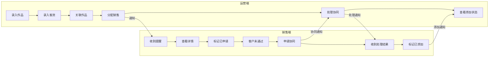

### 4.2 详细测试用例

#### TC-E2E-001: 运营录入作品

| 字段 | 内容 |
|------|------|
| **用例编号** | TC-E2E-001 |
| **用例标题** | 运营录入作品 |
| **涉及端口** | 运营端 |
| **优先级** | P0 |
| **前置条件** | 1. 当前账号已登录运营端 2. 运营已绑定账号 test_account_1 3. 测试作品链接已准备 |
| **测试数据** | 作品链接：https://www.xiaohongshu.com/explore/xxx 平台：小红书 标题：测试作品标题 封面：test_cover.png |
| **测试步骤** | **运营端 - 运营角色** 1. 点击左侧菜单「作品录入」 2. 选择平台「小红书」 3. 粘贴作品链接 4. 系统自动解析链接（POST /api/posts/parse-link） 5. 验证自动回填标题、封面 6. 选择账号「test_account_1」 7. 填写备注「测试作品」 8. 点击「保存」 |
| **预期结果** | 步骤4: 自动回填成功，标题和封面显示 步骤8: 保存成功，提示「作品录入成功」 **DB验证**: - `posts` 表新增1条记录 - `posts.operator_id` = 当前运营ID - `posts.account_id` = test_account_1 - `posts.platform` = 'xiaohongshu' - `posts.status` = 'active' **通知验证**: 无通知触发 |
| **实际结果** | |
| **备注** | 链接解析失败时应允许手动兜底录入 |

---

#### TC-E2E-002: 运营录入客资并关联作品

| 字段 | 内容 |
|------|------|
| **用例编号** | TC-E2E-002 |
| **用例标题** | 运营录入客资并关联作品 |
| **涉及端口** | 运营端 |
| **优先级** | P0 |
| **前置条件** | 1. 运营端已登录 2. 作品 test_post_1 已录入（关联 test_account_1） 3. 客资录入表单字段已配置 |
| **测试数据** | 昵称：张三 联系方式：13800138001 平台：小红书 来源账号：test_account_1 来源作品：test_post_1 需求备注：意向咨询课程 |
| **测试步骤** | **运营端 - 运营角色** 1. 点击左侧菜单「客资录入」 2. 选择来源平台「小红书」 3. 选择来源账号「test_account_1」 4. 选择来源作品「test_post_1」 5. 填写昵称「张三」 6. 粘贴聊天内容（含手机号13800138001） 7. 验证系统自动识别手机号 8. 填写需求备注 9. 点击「保存」 |
| **预期结果** | 步骤7: 联系方式自动识别并填充 步骤9: 保存成功，客资状态为 new **DB验证**: - `leads` 表新增1条记录 - `leads.operator_id` = 当前运营ID - `leads.source_post_id` = test_post_1 - `leads.source_account_id` = test_account_1 - `leads.platform` = 'xiaohongshu' - `leads.status` = 'new' - `leads.contact` = '13800138001'（脱敏后显示） **通知验证**: 无通知触发（分配销售后才触发） |
| **实际结果** | |
| **备注** | ⚠️ 根据文档，通知触发未实装，此处注意 |

---

#### TC-E2E-003: 运营分配销售

| 字段 | 内容 |
|------|------|
| **用例编号** | TC-E2E-003 |
| **用例标题** | 运营分配销售 |
| **涉及端口** | 运营端 |
| **优先级** | P0 |
| **前置条件** | 1. 运营端已登录 2. 客资 test_lead_1 已录入（status=new） 3. 销售账号 sales_test1 已存在 |
| **测试数据** | 客资：test_lead_1（张三，13800138001） 分配销售：sales_test1 |
| **测试步骤** | **运营端 - 运营角色** 1. 进入客资看板 2. 找到客资 test_lead_1 3. 点击「分配销售」 4. 在销售下拉框选择「sales_test1」 5. 点击「确认分配」 6. 验证客资状态变化 |
| **预期结果** | 步骤5: 分配成功，提示「已分配给 sales_test1」 **DB验证**: - `leads` 表更新：   - `leads.status` = 'assigned'   - `leads.assigned_sales_user_id` = sales_test1.user_id   - `leads.assigned_at` = 当前时间 - `lead_follow_records` 表新增1条记录 - `notifications` 表新增1条记录：   - `type` = 'lead_assigned'   - `user_id` = sales_test1.user_id **通知验证**: - 销售端收到 `lead_assigned` 类型通知 - 销售端顶部显示未读消息红点 - 3秒内收到实时推送（WebSocket） |
| **实际结果** | |
| **备注** | ⚠️ 根据文档，通知触发未实装，需要验证实际行为 |

---

#### TC-E2E-004: 销售收到实时提醒

| 字段 | 内容 |
|------|------|
| **用例编号** | TC-E2E-004 |
| **用例标题** | 销售收到实时提醒和未读消息 |
| **涉及端口** | 销售端 |
| **优先级** | P0 |
| **前置条件** | 1. 销售端已登录 sales_test1 2. 运营端已分配客资 test_lead_1 给 sales_test1 3. 销售端首页已加载 |
| **测试数据** | 客资：test_lead_1 销售：sales_test1 |
| **测试步骤** | **销售端 - 销售角色** 1. 保持销售端页面打开 2. 运营端执行分配操作 3. 观察销售端页面变化（3秒内） 4. 检查顶部未读消息数 5. 点击消息中心图标 6. 查看消息列表 7. 离线场景：退出登录后重新登录，验证消息补看 |
| **预期结果** | 步骤3: 页面自动刷新或收到推送通知 步骤4: 顶部未读消息数 +1，显示红点 步骤6: 消息列表显示新客资分配通知 **消息内容验证**: - 标题：您有新的客资分配 - 内容包含：客户昵称「张三」、来源作品 - 可点击跳转客资详情 **离线补看验证**: - 重新登录后，未读消息仍存在 - 点击消息可正常跳转 |
| **实际结果** | |
| **备注** | 需验证 Socket.IO 连接状态 |

---

#### TC-E2E-005: 销售查看客资详情

| 字段 | 内容 |
|------|------|
| **用例编号** | TC-E2E-005 |
| **用例标题** | 销售查看客资详情 |
| **涉及端口** | 销售端 |
| **优先级** | P0 |
| **前置条件** | 1. 销售端已登录 sales_test1 2. 客资 test_lead_1 已分配给 sales_test1 3. 销售端消息中心有未读通知 |
| **测试数据** | 客资：test_lead_1（张三，13800138001，小红书，来源作品） |
| **测试步骤** | **销售端 - 销售角色** 1. 在消息中心点击新客资分配通知 2. 或在「我的客资」列表点击客资卡片 3. 进入客资详情页面 4. 验证基础信息展示（昵称、联系方式、IP/地区） 5. 验证来源信息展示（平台、账号、作品） 6. 验证所属运营信息 7. 验证需求备注 8. 验证状态标签（status=assigned） 9. 验证跟进记录时间线（空或仅有分配记录） 10. 验证协同记录时间线（空） |
| **预期结果** | 步骤4: 客户基础信息完整展示（联系方式脱敏显示） 步骤5: 来源信息完整：平台「小红书」、账号、作品标题 步骤6: 运营昵称显示 步骤7: 需求备注显示 步骤8: 状态标签显示「已分配」 步骤9: 时间线显示分配记录 步骤10: 协同记录为空或无记录提示 **DB验证**: - `leads` 表：客资详情与展示一致 - `lead_follow_records` 表：仅有分配记录 |
| **实际结果** | |
| **备注** | |

---

#### TC-E2E-006: 销售标记已申请添加

| 字段 | 内容 |
|------|------|
| **用例编号** | TC-E2E-006 |
| **用例标题** | 销售标记已申请添加 |
| **涉及端口** | 销售端 |
| **优先级** | P0 |
| **前置条件** | 1. 销售端已登录 sales_test1 2. 客资 test_lead_1 详情页已打开 3. 当前状态：status=assigned, add_status=not_added |
| **测试数据** | 客资：test_lead_1 操作：标记已申请添加 跟进备注：已发送好友申请，等待通过 |
| **测试步骤** | **销售端 - 销售角色** 1. 在客资详情页点击状态操作区 2. 选择「已申请添加」 3. 填写跟进备注「已发送好友申请，等待通过」 4. 设置下次跟进时间（明天） 5. 点击「保存」 6. 验证状态变化 |
| **预期结果** | 步骤5: 保存成功，状态更新 **DB验证**: - `leads` 表更新：   - `leads.status` = 'in_followup'（首次跟进后进入跟进中）   - `leads.add_status` = 'applied'   - `leads.updated_at` = 当前时间 - `lead_follow_records` 表新增1条记录：   - `type` = 'status_change'   - `content` = '已申请添加'   - `remark` = '已发送好友申请，等待通过' **通知验证**: 无通知触发 |
| **实际结果** | |
| **备注** | 首次跟进后客资进入 in_followup 状态 |

---

#### TC-E2E-007: 销售标记客户未通过并申请协同

| 字段 | 内容 |
|------|------|
| **用例编号** | TC-E2E-007 |
| **用例标题** | 销售标记客户未通过并申请运营协同 |
| **涉及端口** | 销售端 |
| **优先级** | P0 |
| **前置条件** | 1. 销售端已登录 sales_test1 2. 客资 test_lead_1 详情页已打开 3. 当前状态：status=in_followup, add_status=applied |
| **测试数据** | 客资：test_lead_1 操作：客户未通过 协同类型：提醒客户/补充来源信息 协同原因：客户未通过好友申请，需要运营协助提醒 期望处理时间：2小时内 |
| **测试步骤** | **销售端 - 销售角色** 1. 在客资详情页点击「客户未通过」按钮 2. 填写协同原因「客户未通过好友申请，需要运营协助」 3. 选择协同类型「提醒客户」 4. 设置期望处理时间 5. 点击「提交协同」 6. 验证状态变化和协同记录 |
| **预期结果** | 步骤5: 提交成功，提示「协同申请已提交」 **DB验证**: - `leads` 表更新：   - `leads.add_status` = 'not_passed'   - `leads.status` = 'in_collaboration'（进入协同中） - `collaboration_tasks` 表新增1条记录：   - `lead_id` = test_lead_1   - `type` = 'customer_not_passed'   - `reason` = '客户未通过好友申请，需要运营协助'   - `status` = 'pending'   - `expected_handle_time` = 设置的时间   - `created_by` = sales_test1.user_id - `lead_follow_records` 表新增记录 - `notifications` 表新增记录：   - `type` = 'customer_not_passed'   - `user_id` = 运营账号ID（leads.operator_id） **通知验证**: - 运营端收到 `customer_not_passed` 类型通知 - 运营端收到 `collaboration_requested` 类型通知 - 运营端顶部显示未读消息红点 |
| **实际结果** | |
| **备注** | |

---

#### TC-E2E-008: 运营收到协同提醒

| 字段 | 内容 |
|------|------|
| **用例编号** | TC-E2E-008 |
| **用例标题** | 运营收到协同提醒 |
| **涉及端口** | 运营端 |
| **优先级** | P0 |
| **前置条件** | 1. 运营端已登录 operation_test1 2. 销售已提交 test_lead_1 的协同申请 3. 运营端首页已加载 |
| **测试数据** | 客资：test_lead_1 协同类型：提醒客户 协同原因：客户未通过好友申请，需要运营协助 |
| **测试步骤** | **运营端 - 运营角色** 1. 保持运营端页面打开 2. 销售端提交协同申请 3. 观察运营端页面变化（3秒内） 4. 检查顶部未读消息数 5. 点击消息中心图标 6. 查看消息列表，找到协同申请通知 7. 点击通知跳转客资看板 8. 验证协同状态标签 |
| **预期结果** | 步骤3: 页面自动刷新或收到推送通知 步骤4: 顶部未读消息数 +1（可能+2：customer_not_passed + collaboration_requested） 步骤6: 消息列表显示协同申请通知 **消息内容验证**: - 标题：客户未通过-协同申请 - 内容包含：客户昵称、协同原因 - 可点击跳转客资看板 步骤8: 客资看板中 test_lead_1 显示「协同中」状态标签 **DB验证**: - `notifications` 表有对应记录 - `leads` 表 `status` = 'in_collaboration' |
| **实际结果** | |
| **备注** | |

---

#### TC-E2E-009: 运营处理协同

| 字段 | 内容 |
|------|------|
| **用例编号** | TC-E2E-009 |
| **用例标题** | 运营处理协同并填写备注 |
| **涉及端口** | 运营端 |
| **优先级** | P0 |
| **前置条件** | 1. 运营端已登录 operation_test1 2. 客资 test_lead_1 有待处理协同任务 3. 协同任务状态：pending |
| **测试数据** | 客资：test_lead_1 协同任务：test_collab_task_1 处理备注：已再次提醒客户，请销售继续跟进 |
| **测试步骤** | **运营端 - 运营角色** 1. 进入客资看板 2. 找到客资 test_lead_1 3. 点击「处理协同」或进入详情 4. 查看协同记录详情 5. 填写处理备注「已再次提醒客户，请销售继续跟进」 6. 点击「处理完成」 7. 验证协同状态变化 |
| **预期结果** | 步骤6: 处理成功，提示「协同已处理」 **DB验证**: - `collaboration_tasks` 表更新：   - `status` = 'handled'   - `handled_at` = 当前时间   - `handled_by` = operation_test1.user_id   - `handle_remark` = '已再次提醒客户，请销售继续跟进' - `leads` 表更新：   - `leads.status` = 'operation_handled'（运营已处理）   - `leads.add_status` = 'operation_reminded'（运营已提醒） - `notifications` 表新增记录：   - `type` = 'collaboration_handled'   - `user_id` = sales_test1.user_id **通知验证**: - 销售端收到 `collaboration_handled` 类型通知 - 销售端顶部显示未读消息红点 |
| **实际结果** | |
| **备注** | |

---

#### TC-E2E-010: 销售收到运营已处理提醒

| 字段 | 内容 |
|------|------|
| **用例编号** | TC-E2E-010 |
| **用例标题** | 销售收到运营已处理提醒 |
| **涉及端口** | 销售端 |
| **优先级** | P0 |
| **前置条件** | 1. 销售端已登录 sales_test1 2. 运营已处理 test_lead_1 的协同任务 3. 销售端「待跟进」页面已加载 |
| **测试数据** | 客资：test_lead_1 协同处理备注：已再次提醒客户，请销售继续跟进 |
| **测试步骤** | **销售端 - 销售角色** 1. 保持销售端页面打开 2. 运营端处理协同 3. 观察销售端页面变化（3秒内） 4. 检查顶部未读消息数 5. 点击消息中心图标 6. 查看消息列表，找到「运营已处理」通知 7. 点击通知跳转客资详情 8. 验证协同记录显示处理备注 |
| **预期结果** | 步骤3: 页面自动刷新或收到推送通知 步骤4: 顶部未读消息数 +1 步骤6: 消息列表显示「运营已处理您的协同申请」 **消息内容验证**: - 标题：协同已处理 - 内容包含：处理备注「已再次提醒客户，请销售继续跟进」 步骤8: 客资详情页协同时间线显示： - 运营处理记录 - 处理备注内容 **DB验证**: - `notifications` 表有对应记录 - `leads` 表 `status` = 'operation_handled' |
| **实际结果** | |
| **备注** | |

---

#### TC-E2E-011: 销售标记已添加通过

| 字段 | 内容 |
|------|------|
| **用例编号** | TC-E2E-011 |
| **用例标题** | 销售继续跟进并标记已添加通过 |
| **涉及端口** | 销售端 |
| **优先级** | P0 |
| **前置条件** | 1. 销售端已登录 sales_test1 2. 客资 test_lead_1 状态：status=operation_handled, add_status=operation_reminded 3. 客资详情页已打开 |
| **测试数据** | 客资：test_lead_1 操作：标记已添加通过 跟进备注：客户已通过好友申请，已添加微信 |
| **测试步骤** | **销售端 - 销售角色** 1. 在客资详情页点击「已添加通过」按钮 2. 填写跟进备注「客户已通过好友申请，已添加微信」 3. 设置下次跟进时间（如3天后） 4. 点击「保存」 5. 验证状态变化 |
| **预期结果** | 步骤4: 保存成功，状态更新 **DB验证**: - `leads` 表更新：   - `leads.status` = 'added_success'（销售已添加通过）   - `leads.add_status` = 'added'   - `leads.updated_at` = 当前时间   - `leads.added_at` = 当前时间 - `lead_follow_records` 表新增记录：   - `type` = 'status_change'   - `content` = '已添加通过'   - `remark` = '客户已通过好友申请，已添加微信' - `notifications` 表新增记录：   - `type` = 'customer_added'   - `user_id` = operation_test1.user_id（运营） **通知验证**: - 运营端收到 `customer_added` 类型通知 - 运营端顶部显示未读消息红点 |
| **实际结果** | |
| **备注** | |

---

#### TC-E2E-012: 运营端看到销售已添加通过状态

| 字段 | 内容 |
|------|------|
| **用例编号** | TC-E2E-012 |
| **用例标题** | 运营端看到销售已添加通过状态 |
| **涉及端口** | 运营端 |
| **优先级** | P0 |
| **前置条件** | 1. 运营端已登录 operation_test1 2. 销售已标记 test_lead_1 为已添加通过 3. 运营端首页已加载 |
| **测试数据** | 客资：test_lead_1 状态：已添加通过 |
| **测试步骤** | **运营端 - 运营角色** 1. 保持运营端页面打开 2. 销售端标记已添加通过 3. 观察运营端页面变化（3秒内） 4. 检查顶部未读消息数 5. 点击消息中心图标 6. 查看消息列表，找到「销售已添加通过」通知 7. 进入客资看板 8. 找到客资 test_lead_1 9. 验证状态标签显示「已添加通过」或「销售已添加」 |
| **预期结果** | 步骤3: 页面自动刷新或收到推送通知 步骤4: 顶部未读消息数 +1 步骤6: 消息列表显示「销售已添加通过」通知 步骤9: 客资看板中 test_lead_1 状态标签显示「已添加通过」或「销售已添加」 **DB验证**: - `notifications` 表有对应记录 - `leads` 表：   - `status` = 'added_success'   - `add_status` = 'added' |
| **实际结果** | |
| **备注** | |

---

## 五、销售→教务主流程测试用例

### 5.1 主流程概述

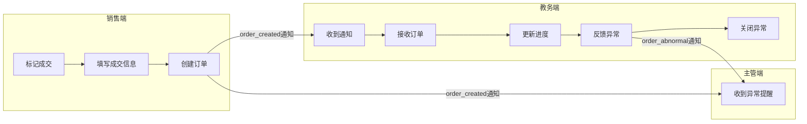

### 5.2 详细测试用例

#### TC-E2E-013: 销售标记成交

| 字段 | 内容 |
|------|------|
| **用例编号** | TC-E2E-013 |
| **用例标题** | 销售标记成交并填写成交信息 |
| **涉及端口** | 销售端 |
| **优先级** | P0 |
| **前置条件** | 1. 销售端已登录 sales_test1 2. 客资 test_lead_1 状态：status=added_success, add_status=added 3. 客资详情页已打开 |
| **测试数据** | 客资：test_lead_1 成交金额：2999.00 产品类型：VIP课程 合同状态：已签署 付款状态：部分付款 交付要求：需要7天内完成交付 |
| **测试步骤** | **销售端 - 销售角色** 1. 在客资详情页点击「标记成交」或「closeDeal」按钮 2. 弹出成交信息填写 Modal 3. 填写成交金额「2999.00」 4. 选择产品类型「VIP课程」 5. 选择合同状态「已签署」 6. 选择付款状态「部分付款」 7. 填写交付要求「需要7天内完成交付」 8. 点击「确认成交」 9. 验证成交成功提示和客资状态变化 |
| **预期结果** | 步骤8: 成交成功，提示「成交成功，订单已创建」 **DB验证**: - `leads` 表更新：   - `leads.status` = 'in_followup'（成交后状态）   - `leads.process_status` = 'deal_done'   - `leads.deal_status` = 'deal_done'   - `leads.deal_amount` = 2999.00   - `leads.deal_service_type` = 'VIP课程'   - `leads.updated_at` = 当前时间 - `lead_follow_records` 表新增记录 - `orders` 表新增1条记录：   - `lead_id` = test_lead_1   - `sales_id` = sales_test1.user_id   - `service_type` = 'VIP课程'   - `amount` = 2999.00   - `paid_status` = 'partial'   - `contract_status` = 'signed'   - `order_status` = 'pending_accept'   - `delivery_requirement` = '需要7天内完成交付'   - `handover_status` = 'pending' - `notifications` 表新增记录：   - `type` = 'order_created'   - `user_id` = 教务账号ID（academic_test1）   - `type` = 'lead_deal_done'   - `user_id` = 主管账号ID |
| **实际结果** | |
| **备注** | 成交操作是事务化的，客资和订单同时创建 |

---

#### TC-E2E-014: 教务收到order_created通知

| 字段 | 内容 |
|------|------|
| **用例编号** | TC-E2E-014 |
| **用例标题** | 教务收到order_created通知 |
| **涉及端口** | 教务端 |
| **优先级** | P0 |
| **前置条件** | 1. 教务端已登录 academic_test1 2. 销售已标记 test_lead_1 成交并创建订单 3. 教务端首页已加载 |
| **测试数据** | 订单：test_order_1 客资：张三，2999.00元，VIP课程 |
| **测试步骤** | **教务端 - 教务角色** 1. 保持教务端页面打开 2. 销售端标记成交 3. 观察教务端页面变化（3秒内） 4. 检查顶部未读消息数 5. 点击消息中心图标 6. 查看消息列表，找到「新订单创建」通知 7. 点击通知跳转订单池 8. 验证订单池出现新订单 |
| **预期结果** | 步骤3: 页面自动刷新或收到推送通知 步骤4: 顶部未读消息数 +1（或+2：订单创建+成交提醒） 步骤6: 消息列表显示「新订单创建」通知 **消息内容验证**: - 标题：新订单待接收 - 内容包含：客户昵称、成交金额、服务类型 - 可点击跳转订单池 步骤8: 订单池列表出现 test_order_1 **DB验证**: - `notifications` 表有对应记录 - `orders` 表有对应记录 |
| **实际结果** | |
| **备注** | |

---

#### TC-E2E-015: 教务接收订单

| 字段 | 内容 |
|------|------|
| **用例编号** | TC-E2E-015 |
| **用例标题** | 教务接收订单 |
| **涉及端口** | 教务端 |
| **优先级** | P0 |
| **前置条件** | 1. 教务端已登录 academic_test1 2. 订单 test_order_1 状态：order_status=pending_accept, handover_status=pending 3. 教务端订单池已加载 |
| **测试数据** | 订单：test_order_1 客资：张三，2999.00元，VIP课程 |
| **测试步骤** | **教务端 - 教务角色** 1. 进入订单池页面 2. 找到订单 test_order_1（待接收状态） 3. 点击「接收」按钮 4. 验证订单状态变化 5. 进入订单详情，验证交接信息 |
| **预期结果** | 步骤3: 接收成功，提示「订单已接收」 **DB验证**: - `orders` 表更新：   - `order_status` = 'to_receive'（进行中）   - `handover_status` = 'handed_over'（已交接）   - `academic_admin_id` = academic_test1.user_id   - `accepted_at` = 当前时间 - `order_follow_records` 表新增记录 - `notifications` 表新增记录：   - `type` = 'order_updated'   - `user_id` = sales_test1.user_id（销售） |
| **实际结果** | |
| **备注** | 接收后订单进入进行中，销售收到通知 |

---

#### TC-E2E-016: 教务更新订单进度

| 字段 | 内容 |
|------|------|
| **用例编号** | TC-E2E-016 |
| **用例标题** | 教务更新订单进度 |
| **涉及端口** | 教务端 |
| **优先级** | P0 |
| **前置条件** | 1. 教务端已登录 academic_test1 2. 订单 test_order_1 已接收，order_status=in_progress 3. 订单详情页已打开 |
| **测试数据** | 订单：test_order_1 进度动作：资料收集中 备注：客户已提交基础信息，还需补充身份证 |
| **测试步骤** | **教务端 - 教务角色** 1. 进入订单详情页 2. 点击「添加进度」或「更新进度」 3. 选择进度动作「资料收集中」 4. 填写备注 5. 设置下次提醒时间（如明天） 6. 点击「保存」 7. 验证进度时间线新增记录 |
| **预期结果** | 步骤6: 保存成功，进度更新 **DB验证**: - `orders` 表更新：   - `order_status` 可能更新（如 waiting_material）   - `updated_at` = 当前时间 - `order_follow_records` 表新增记录：   - `action` = 'progress_update'   - `content` = '资料收集中'   - `remark` = '客户已提交基础信息，还需补充身份证'   - `next_reminder` = 设置的时间 - `notifications` 表新增记录：   - `type` = 'order_updated'   - `user_id` = sales_test1.user_id（销售） **通知验证**: - 销售端收到订单进度更新通知 |
| **实际结果** | |
| **备注** | |

---

#### TC-E2E-017: 销售看到订单进度更新

| 字段 | 内容 |
|------|------|
| **用例编号** | TC-E2E-017 |
| **用例标题** | 销售看到订单进度更新 |
| **涉及端口** | 销售端 |
| **优先级** | P0 |
| **前置条件** | 1. 销售端已登录 sales_test1 2. 教务已更新 test_order_1 进度 3. 销售端首页已加载 |
| **测试数据** | 订单：test_order_1 进度：资料收集中 |
| **测试步骤** | **销售端 - 销售角色** 1. 保持销售端页面打开 2. 教务端更新订单进度 3. 观察销售端页面变化（3秒内） 4. 检查顶部未读消息数 5. 点击消息中心图标 6. 查看消息列表，找到「订单进度更新」通知 7. 点击通知跳转订单详情 8. 验证进度时间线显示最新记录 |
| **预期结果** | 步骤3: 页面自动刷新或收到推送通知 步骤4: 顶部未读消息数 +1 步骤6: 消息列表显示「订单进度更新」通知 **消息内容验证**: - 内容包含：订单编号、进度状态 步骤8: 订单进度时间线显示教务添加的记录 **DB验证**: - `notifications` 表有对应记录 - `order_follow_records` 表有对应记录 |
| **实际结果** | |
| **备注** | |

---

#### TC-E2E-018: 教务创建异常反馈

| 字段 | 内容 |
|------|------|
| **用例编号** | TC-E2E-018 |
| **用例标题** | 教务创建异常反馈 |
| **涉及端口** | 教务端 |
| **优先级** | P0 |
| **前置条件** | 1. 教务端已登录 academic_test1 2. 订单 test_order_1 在进行中 3. 订单详情页已打开 |
| **测试数据** | 订单：test_order_1 异常类型：客户不配合 异常说明：客户多次拖延提交资料，已电话沟通2次无果 期望协助对象：销售或主管 |
| **测试步骤** | **教务端 - 教务角色** 1. 进入订单详情页 2. 点击「异常反馈」或「反馈异常」按钮 3. 选择异常类型「客户不配合」 4. 填写异常说明 5. 选择期望协助对象 6. 点击「提交反馈」 7. 验证异常反馈记录 |
| **预期结果** | 步骤6: 提交成功，提示「异常反馈已提交」 **DB验证**: - `order_abnormal_feedbacks` 表新增1条记录：   - `order_id` = test_order_1   - `type` = 'customer_not_cooperate'   - `description` = '客户多次拖延提交资料，已电话沟通2次无果'   - `expected_help` = 'sales_or_supervisor'   - `status` = 'open'   - `created_by` = academic_test1.user_id - `orders` 表更新：   - `order_status` = 'abnormal' - `notifications` 表新增记录：   - `type` = 'order_abnormal'   - `user_id` = sales_test1.user_id（销售）   - `user_id` = 主管账号ID（supervisor） |
| **实际结果** | |
| **备注** | |

---

#### TC-E2E-019: 销售和主管收到异常提醒

| 字段 | 内容 |
|------|------|
| **用例编号** | TC-E2E-019 |
| **用例标题** | 销售和主管收到异常提醒 |
| **涉及端口** | 销售端、主管端 |
| **优先级** | P0 |
| **前置条件** | 1. 销售端已登录 sales_test1 2. 主管端已登录 supervisor_test1 3. 教务已创建 test_order_1 的异常反馈 4. 销售端和主管端首页已加载 |
| **测试数据** | 订单：test_order_1 异常类型：客户不配合 |
| **测试步骤** | **销售端 - 销售角色** 1. 保持销售端页面打开 2. 教务端创建异常反馈 3. 观察销售端页面变化（3秒内） 4. 检查顶部未读消息数 5. 查看消息列表，找到「订单异常」通知 6. 点击通知跳转订单详情 7. 验证异常反馈卡片显示  **主管端 - 主管角色** 8. 保持主管端页面打开 9. 观察主管端页面变化（3秒内） 10. 检查顶部未读消息数 11. 查看消息列表，找到「订单异常」通知 12. 点击通知跳转订单详情 |
| **预期结果** | **销售端验证**: 步骤3-4: 页面自动刷新，顶部未读消息数 +1 步骤5: 消息列表显示「订单异常」通知 **消息内容验证**: - 标题：订单异常反馈 - 内容包含：订单编号、异常类型 步骤7: 订单详情页显示异常反馈卡片  **主管端验证**: 步骤9-10: 页面自动刷新，顶部未读消息数 +1 步骤11: 消息列表显示「订单异常」通知 **DB验证**: - `notifications` 表有2条记录（销售和主管各1条） |
| **实际结果** | |
| **备注** | |

---

#### TC-E2E-020: 异常关闭后订单状态同步

| 字段 | 内容 |
|------|------|
| **用例编号** | TC-E2E-020 |
| **用例标题** | 异常关闭后订单状态同步 |
| **涉及端口** | 教务端、销售端、主管端 |
| **优先级** | P0 |
| **前置条件** | 1. 教务端已登录 academic_test1 2. 订单 test_order_1 有 open 状态的异常反馈 3. 异常已处理完成 |
| **测试数据** | 订单：test_order_1 异常反馈：test_feedback_1 处理备注：已与客户沟通，客户同意配合提交资料 |
| **测试步骤** | **教务端 - 教务角色** 1. 进入订单详情页 2. 找到异常反馈卡片 3. 点击「关闭异常」或「处理完成」 4. 填写处理备注 5. 点击「确认关闭」 6. 验证订单状态从 abnormal 恢复  **验证端 - 销售/主管角色** 7. 观察销售端和主管端订单状态变化 |
| **预期结果** | 步骤5: 关闭成功，提示「异常已关闭」 **DB验证**: - `order_abnormal_feedbacks` 表更新：   - `status` = 'closed'   - `handled_by` = academic_test1.user_id   - `handled_at` = 当前时间   - `handle_remark` = '已与客户沟通，客户同意配合提交资料' - `orders` 表更新：   - `order_status` = 'in_progress'（恢复正常进度） - `notifications` 表新增记录：   - `type` = 'order_updated'   - `user_id` = sales_test1.user_id（销售） **通知验证**: - 销售端收到订单状态恢复通知 |
| **实际结果** | |
| **备注** | |

---

## 六、主管管理流程测试用例

### 6.1 主流程概述

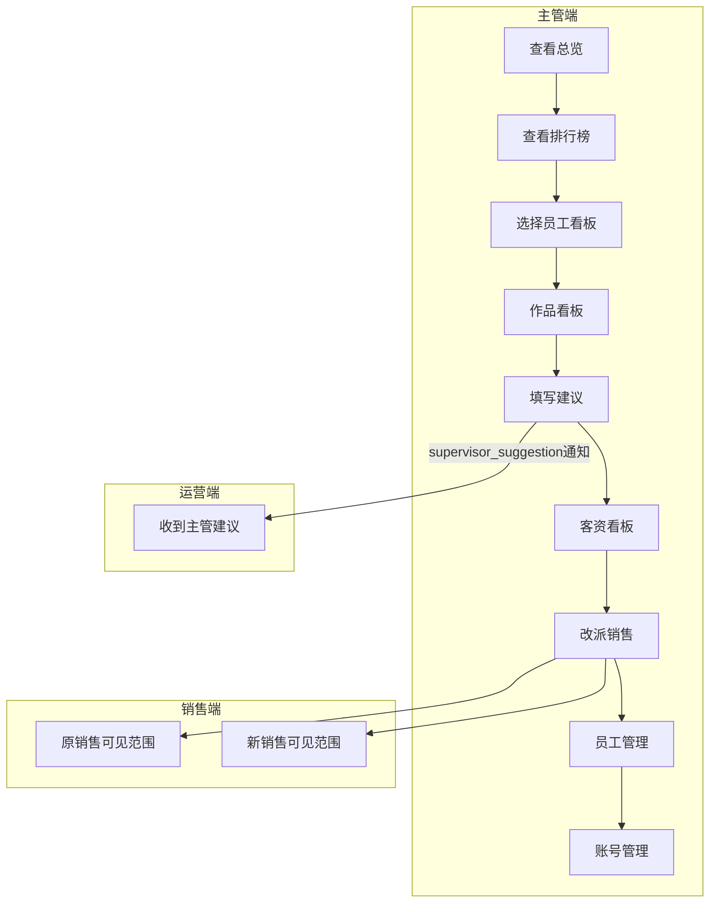

### 6.2 详细测试用例

#### TC-E2E-021: 主管查看总览数据

| 字段 | 内容 |
|------|------|
| **用例编号** | TC-E2E-021 |
| **用例标题** | 主管查看总览数据 |
| **涉及端口** | 主管端 |
| **优先级** | P0 |
| **前置条件** | 1. 主管端已登录 supervisor_test1 2. 系统已有作品、客资、订单数据 |
| **测试数据** | 无 |
| **测试步骤** | **主管端 - 主管角色** 1. 进入主管端首页（总览） 2. 验证数据卡片展示 3. 切换时间周期（今日/本周/本月/累计） 4. 验证各周期数据变化 5. 验证异常提醒卡片 |
| **预期结果** | 步骤2: 总览展示以下数据卡片： - 作品总数 - 客资总数 - 点赞总数 - 有效账号数 - 待处理协同数 - 风险提醒（异常订单数） 步骤4: 切换周期后数据正确更新 步骤5: 异常提醒卡片显示： - 协同超时数 - 客资积压数 - 员工低更新数 - 账号异常数 **DB验证**: - `posts` 表统计正确 - `leads` 表统计正确 - `orders` 表统计正确 |
| **实际结果** | |
| **备注** | |

---

#### TC-E2E-022: 主管查看运营排行榜

| 字段 | 内容 |
|------|------|
| **用例编号** | TC-E2E-022 |
| **用例标题** | 主管查看运营排行榜 |
| **涉及端口** | 主管端 |
| **优先级** | P0 |
| **前置条件** | 1. 主管端已登录 supervisor_test1 2. 系统已有多个运营的作品和客资数据 |
| **测试数据** | 无 |
| **测试步骤** | **主管端 - 主管角色** 1. 点击左侧菜单「运营排行榜」 2. 验证作品数榜单展示 3. 切换榜单类型：客资榜 4. 验证客资数、有效率、与上一名差距 5. 切换榜单类型：流量榜 6. 验证按点赞数排名 7. 切换时间周期（今日/本周/本月/累计） 8. 验证数据随周期变化 9. 点击「导出」按钮 10. 验证导出任务创建 |
| **预期结果** | 步骤2: 作品数榜单正确展示 步骤4: 客资榜单数据正确 步骤5: 流量榜按点赞数排序 步骤7: 数据随周期正确更新 步骤9: 导出 Modal 弹出 步骤10: 导出任务创建成功，提示「导出任务已创建」 **DB验证**: - `exports` 表新增记录：   - `export_type` = 'rankings'   - `status` = 'pending' |
| **实际结果** | |
| **备注** | |

---

#### TC-E2E-023: 主管选择员工查看个人看板

| 字段 | 内容 |
|------|------|
| **用例编号** | TC-E2E-023 |
| **用例标题** | 主管选择员工查看个人看板 |
| **涉及端口** | 主管端 |
| **优先级** | P0 |
| **前置条件** | 1. 主管端已登录 supervisor_test1 2. 运营 operation_test1 有作品和客资数据 |
| **测试数据** | 员工：operation_test1 |
| **测试步骤** | **主管端 - 主管角色** 1. 点击左侧菜单「个人看板」 2. 在员工选择器中选择「operation_test1」 3. 验证个人看板数据展示 4. 验证本月统计：作品数、客资数、点赞数 5. 验证获客数榜、效率榜 6. 验证账号日历展示 |
| **预期结果** | 步骤3: 个人看板展示该员工数据 **数据卡片验证**: - 本月作品数 - 本月客资数 - 本月点赞数 - 有效账号数 - 获客贴数 - 非获客贴数 步骤5: 排行榜数据正确 步骤6: 账号日历显示发帖节奏 **DB验证**: - `posts` 表统计该运营数据 - `leads` 表统计该运营数据 - 统计口径与运营端个人看板一致 |
| **实际结果** | |
| **备注** | |

---

#### TC-E2E-024: 主管查看作品看板并填写建议

| 字段 | 内容 |
|------|------|
| **用例编号** | TC-E2E-024 |
| **用例标题** | 主管查看作品看板并填写建议 |
| **涉及端口** | 主管端 |
| **优先级** | P0 |
| **前置条件** | 1. 主管端已登录 supervisor_test1 2. 作品 test_post_1 已存在 3. 运营 operation_test1 是作品负责人 |
| **测试数据** | 作品：test_post_1 建议内容：建议优化封面图，提升点击率 |
| **测试步骤** | **主管端 - 主管角色** 1. 点击左侧菜单「作品看板」 2. 筛选或找到作品 test_post_1 3. 点击作品卡片进入详情 4. 查看作品完整信息（文案、截图、指标） 5. 查看来源客资列表 6. 查看主管建议历史（如有） 7. 填写建议「建议优化封面图，提升点击率」 8. 点击「提交建议」 9. 验证建议提交成功 |
| **预期结果** | 步骤4: 作品详情完整展示 步骤5: 来源客资列表显示 步骤6: 历史建议显示（如有） 步骤8: 提交成功，提示「建议已提交」 **DB验证**: - `supervisor_suggestions` 表新增1条记录：   - `post_id` = test_post_1   - `operator_id` = operation_test1.user_id   - `content` = '建议优化封面图，提升点击率'   - `created_by` = supervisor_test1.user_id   - `is_read` = false - `notifications` 表新增记录：   - `type` = 'supervisor_suggestion'   - `user_id` = operation_test1.user_id（运营） **通知验证**: - 运营端收到 `supervisor_suggestion` 类型通知 |
| **实际结果** | |
| **备注** | ⚠️ 根据文档，supervisor_suggestion 通知标为"已下线"，需验证实际行为 |

---

#### TC-E2E-025: 运营收到主管建议消息

| 字段 | 内容 |
|------|------|
| **用例编号** | TC-E2E-025 |
| **用例标题** | 运营收到主管建议消息 |
| **涉及端口** | 运营端 |
| **优先级** | P0 |
| **前置条件** | 1. 运营端已登录 operation_test1 2. 主管已为作品 test_post_1 填写建议 3. 运营端首页已加载 |
| **测试数据** | 作品：test_post_1 建议：建议优化封面图，提升点击率 |
| **测试步骤** | **运营端 - 运营角色** 1. 保持运营端页面打开 2. 主管端提交建议 3. 观察运营端页面变化（3秒内） 4. 检查顶部未读消息数 5. 点击消息中心图标 6. 查看消息列表，找到「主管建议」通知 7. 点击通知跳转作品详情 8. 验证建议内容显示 |
| **预期结果** | 步骤3: 页面自动刷新或收到推送通知 步骤4: 顶部未读消息数 +1 步骤6: 消息列表显示「主管建议」通知 **消息内容验证**: - 内容包含：作品标题、建议内容 步骤8: 作品详情页显示建议内容 **DB验证**: - `notifications` 表有对应记录 - `supervisor_suggestions` 表 `is_read` = false |
| **实际结果** | |
| **备注** | ⚠️ 根据文档，supervisor_suggestion 通知标为"已下线"，需验证实际行为 |

---

#### TC-E2E-026: 主管改派销售

| 字段 | 内容 |
|------|------|
| **用例编号** | TC-E2E-026 |
| **用例标题** | 主管改派销售 |
| **涉及端口** | 主管端 |
| **优先级** | P0 |
| **前置条件** | 1. 主管端已登录 supervisor_test1 2. 客资 test_lead_1 当前分配给 sales_test1 3. 销售账号 sales_test2 已存在 |
| **测试数据** | 客资：test_lead_1 原销售：sales_test1 新销售：sales_test2 |
| **测试步骤** | **主管端 - 主管角色** 1. 点击左侧菜单「客资看板」 2. 找到客资 test_lead_1 3. 点击「改派销售」或「分配销售」 4. 在销售下拉框选择「sales_test2」 5. 点击「确认改派」 6. 验证改派成功提示 |
| **预期结果** | 步骤5: 改派成功，提示「已改派给 sales_test2」 **DB验证**: - `leads` 表更新：   - `leads.assigned_sales_user_id` = sales_test2.user_id   - `leads.assigned_at` = 当前时间   - `leads.updated_at` = 当前时间 - `lead_follow_records` 表新增1条记录：   - `action` = 'reassign'   - `content` = '主管改派'   - `from_sales` = sales_test1.user_id   - `to_sales` = sales_test2.user_id - `operation_logs` 表新增记录 |
| **实际结果** | |
| **备注** | |

---

#### TC-E2E-027: 销售可见范围同步变化

| 字段 | 内容 |
|------|------|
| **用例编号** | TC-E2E-027 |
| **用例标题** | 原销售和新销售的客资可见范围同步变化 |
| **涉及端口** | 销售端 |
| **优先级** | P0 |
| **前置条件** | 1. 销售端已登录 sales_test1（原销售）和 sales_test2（新销售） 2. 主管已改派 test_lead_1 从 sales_test1 到 sales_test2 |
| **测试数据** | 客资：test_lead_1 原销售：sales_test1 新销售：sales_test2 |
| **测试步骤** | **销售端 - sales_test1（原销售）** 1. 在「我的客资」列表刷新 2. 验证 test_lead_1 不再出现在列表中 3. 验证无权限访问客资详情（404）  **销售端 - sales_test2（新销售）** 4. 在「我的客资」列表刷新 5. 验证 test_lead_1 出现在列表中 6. 点击进入客资详情 7. 验证客资信息完整展示 |
| **预期结果** | **原销售验证**: 步骤2: test_lead_1 不在 sales_test1 的客资列表中 步骤3: 尝试直接访问客资详情返回 404 或无权限  **新销售验证**: 步骤5: test_lead_1 出现在 sales_test2 的客资列表中 步骤7: 客资详情完整展示，状态信息正确 **DB验证**: - `leads` 表 `assigned_sales_user_id` = sales_test2.user_id - 权限过滤生效：sales_test1 查询不到此客资 |
| **实际结果** | |
| **备注** | |

---

#### TC-E2E-028: 主管新增员工和登录账号

| 字段 | 内容 |
|------|------|
| **用例编号** | TC-E2E-028 |
| **用例标题** | 主管新增员工和登录账号 |
| **涉及端口** | 主管端 |
| **优先级** | P0 |
| **前置条件** | 1. 主管端已登录 supervisor_test1 2. 员工管理页面已加载 |
| **测试数据** | 员工姓名：新员工测试 手机号：13900139001 角色：运营 账号：新员工账号 密码：test123 |
| **测试步骤** | **主管端 - 主管角色** 1. 点击左侧菜单「员工管理」 2. 点击「新增员工」按钮 3. 填写员工信息 4. 勾选「同时创建登录账号」 5. 填写登录账号信息 6. 点击「保存」 7. 验证员工创建成功 8. 验证账号创建成功 |
| **预期结果** | 步骤7: 保存成功，提示「员工创建成功」 **DB验证**: - `employees` 表新增1条记录：   - `name` = '新员工测试'   - `phone` = '13900139001'   - `role` = 'operation'   - `status` = 'active' - `users` 表新增1条记录：   - `username` = '新员工账号'   - `password` = 加密后的 'test123'   - `role` = 'operation'   - `employee_id` = 新员工ID   - `status` = 'active' - `operation_logs` 表新增记录 |
| **实际结果** | |
| **备注** | |

---

#### TC-E2E-029: 停用员工后权限验证

| 字段 | 内容 |
|------|------|
| **用例编号** | TC-E2E-029 |
| **用例标题** | 停用员工后登录和数据操作权限正确 |
| **涉及端口** | 主管端、销售端 |
| **优先级** | P0 |
| **前置条件** | 1. 主管端已登录 supervisor_test1 2. 新员工 test_employee_1 已创建并有登录账号 3. 新员工有录入的客资数据 |
| **测试数据** | 员工：test_employee_1 账号：test_employee_user |
| **测试步骤** | **主管端 - 主管角色** 1. 进入员工管理页面 2. 找到 test_employee_1 3. 点击「停用」按钮 4. 确认停用操作 5. 验证员工状态更新  **登录验证** 6. 使用 test_employee_user 账号尝试登录 7. 验证登录被拒绝  **数据权限验证** 8. 主管端查看该员工录入的客资 9. 验证客资数据仍可查看（主管权限） 10. 验证其他销售看不到该员工的客资 |
| **预期结果** | 步骤4: 停用成功，提示「员工已停用」 **DB验证**: - `employees` 表更新：   - `status` = 'inactive' - `users` 表更新：   - `status` = 'inactive' - `operation_logs` 表新增记录  **登录验证**: 步骤6: 登录失败，提示「账号已被停用」  **数据权限验证**: 步骤8: 主管端可查看该员工历史数据 步骤10: 其他销售无法访问（权限隔离） |
| **实际结果** | |
| **备注** | |

---

## 七、状态机测试用例

### 7.1 客资主状态机（leads.status）

#### 状态流转图

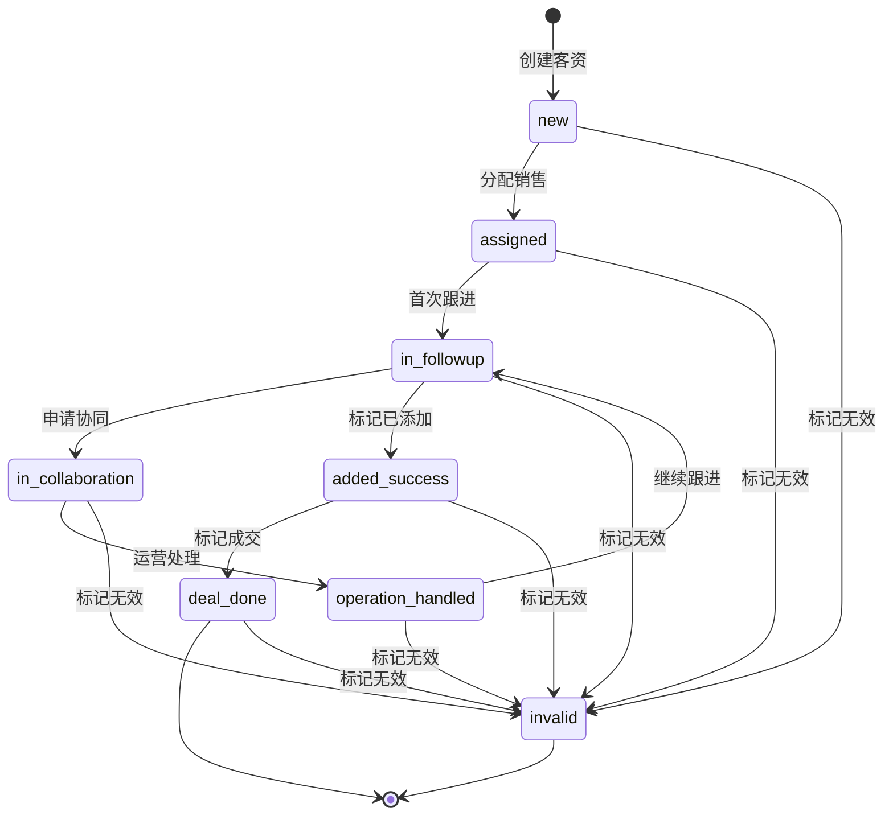

#### TC-STM-001: 客资status正向流转（正常路径）

| 字段 | 内容 |
|------|------|
| **用例编号** | TC-STM-001 |
| **用例标题** | 客资status正向流转：new→assigned→in_followup→in_collaboration→operation_handled→added_success |
| **涉及端口** | 运营端、销售端 |
| **优先级** | P0 |
| **前置条件** | 1. 运营端已登录 operation_test1 2. 销售端已登录 sales_test1 3. 测试客资已创建 |
| **测试数据** | 客资：test_lead_status_1 |
| **测试步骤** | **步骤1**: 运营分配销售给 sales_test1 **步骤2**: 验证 status = 'assigned' **步骤3**: 销售首次跟进（标记已申请添加） **步骤4**: 验证 status = 'in_followup' **步骤5**: 销售标记客户未通过并申请协同 **步骤6**: 验证 status = 'in_collaboration' **步骤7**: 运营处理协同 **步骤8**: 验证 status = 'operation_handled' **步骤9**: 销售标记已添加通过 **步骤10**: 验证 status = 'added_success' |
| **预期结果** | 每步后验证 `leads.status` 值正确变化 **DB验证**: 每步后查询 `leads` 表，验证 status 字段 |
| **实际结果** | |
| **备注** | |

---

#### TC-STM-002: 客资status正向流转（成交路径）

| 字段 | 内容 |
|------|------|
| **用例编号** | TC-STM-002 |
| **用例标题** | 客资status正向流转：added_success→deal_done |
| **涉及端口** | 销售端 |
| **优先级** | P0 |
| **前置条件** | 1. 销售端已登录 sales_test1 2. 客资 test_lead_status_2 状态：status=added_success |
| **测试数据** | 客资：test_lead_status_2 成交金额：5000 |
| **测试步骤** | **步骤1**: 销售点击「标记成交」 **步骤2**: 填写成交信息 **步骤3**: 点击「确认成交」 **步骤4**: 验证 status = 'deal_done' |
| **预期结果** | 步骤4: status = 'deal_done' **DB验证**: - `leads.status` = 'deal_done' - `leads.deal_status` = 'deal_done' - `leads.process_status` = 'deal_done' - `orders` 表有对应订单记录 |
| **实际结果** | |
| **备注** | |

---

#### TC-STM-003: 客资status旁路流转（无效路径）

| 字段 | 内容 |
|------|------|
| **用例编号** | TC-STM-003 |
| **用例标题** | 客资status旁路流转：任意状态→invalid |
| **涉及端口** | 运营端、销售端 |
| **优先级** | P0 |
| **前置条件** | 1. 销售端已登录 sales_test1 2. 客资 test_lead_invalid_1 状态：status=in_followup |
| **测试数据** | 客资：test_lead_invalid_1 无效原因：客户明确拒绝 |
| **测试步骤** | **步骤1**: 销售点击「标记无效」 **步骤2**: 选择无效原因或填写备注 **步骤3**: 点击「确认无效」 **步骤4**: 验证 status = 'invalid' |
| **预期结果** | 步骤4: status = 'invalid' **DB验证**: - `leads.status` = 'invalid' - `leads.process_status` = 'invalid' |
| **实际结果** | |
| **备注** | 无效状态不可逆 |

---

#### TC-STM-004: 客资status非法流转拒绝

| 字段 | 内容 |
|------|------|
| **用例编号** | TC-STM-004 |
| **用例标题** | 客资status非法流转：deal_done→new（拒绝） |
| **涉及端口** | 销售端 |
| **优先级** | P0 |
| **前置条件** | 1. 销售端已登录 sales_test1 2. 客资 test_lead_deal_1 状态：status=deal_done |
| **测试数据** | 客资：test_lead_deal_1 |
| **测试步骤** | **步骤1**: 尝试将 status 从 'deal_done' 修改为 'new' **步骤2**: 通过 API 直接调用 PATCH /api/leads/:id/status |
| **预期结果** | 步骤2: API 返回 400 错误或 422 错误 **错误信息**: 状态流转不允许或 Invalid state transition **DB验证**: `leads.status` 仍为 'deal_done' |
| **实际结果** | |
| **备注** | 需验证后端有状态流转校验 |

---

### 7.2 添加状态机（leads.add_status）

#### 状态流转图

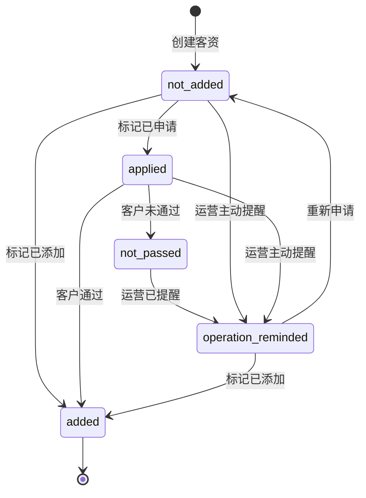

#### TC-STM-005: add_status正向流转

| 字段 | 内容 |
|------|------|
| **用例编号** | TC-STM-005 |
| **用例标题** | add_status正向流转：not_added→applied→added |
| **涉及端口** | 销售端 |
| **优先级** | P0 |
| **前置条件** | 1. 销售端已登录 sales_test1 2. 客资 test_lead_add_1 状态：add_status=not_added |
| **测试数据** | 客资：test_lead_add_1 |
| **测试步骤** | **步骤1**: 销售标记「已申请添加」 **步骤2**: 验证 add_status = 'applied' **步骤3**: 销售标记「已添加通过」 **步骤4**: 验证 add_status = 'added' |
| **预期结果** | **DB验证**: - 步骤2: `leads.add_status` = 'applied' - 步骤4: `leads.add_status` = 'added' |
| **实际结果** | |
| **备注** | |

---

#### TC-STM-006: add_status逆向流转

| 字段 | 内容 |
|------|------|
| **用例编号** | TC-STM-006 |
| **用例标题** | add_status逆向流转：applied→not_added |
| **涉及端口** | 销售端 |
| **优先级** | P0 |
| **前置条件** | 1. 销售端已登录 sales_test1 2. 客资 test_lead_add_2 状态：add_status=applied |
| **测试数据** | 客资：test_lead_add_2 |
| **测试步骤** | **步骤1**: 销售重新标记为「未申请添加」或撤回申请 **步骤2**: 验证 add_status = 'not_added' |
| **预期结果** | 步骤2: add_status = 'not_added'（允许撤销重新申请） |
| **实际结果** | |
| **备注** | |

---

#### TC-STM-007: add_status旁路流转

| 字段 | 内容 |
|------|------|
| **用例编号** | TC-STM-007 |
| **用例标题** | add_status旁路流转：任意状态→operation_reminded |
| **涉及端口** | 运营端 |
| **优先级** | P0 |
| **前置条件** | 1. 运营端已登录 operation_test1 2. 客资 test_lead_add_3 状态：add_status=not_passed, status=in_collaboration |
| **测试数据** | 客资：test_lead_add_3 |
| **测试步骤** | **步骤1**: 运营处理协同申请 **步骤2**: 验证 add_status = 'operation_reminded' |
| **预期结果** | 步骤2: add_status = 'operation_reminded' |
| **实际结果** | |
| **备注** | |

---

### 7.3 处理状态机（leads.process_status）

#### 状态流转图

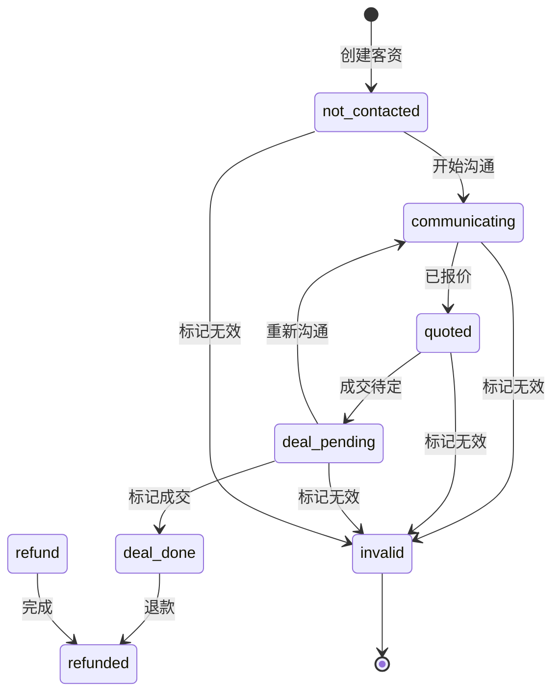

#### TC-STM-008: process_status正向流转

| 字段 | 内容 |
|------|------|
| **用例编号** | TC-STM-008 |
| **用例标题** | process_status正向流转：not_contacted→communicating→quoted→deal_pending→deal_done |
| **涉及端口** | 销售端 |
| **优先级** | P0 |
| **前置条件** | 1. 销售端已登录 sales_test1 2. 客资 test_lead_proc_1 状态：process_status=not_contacted |
| **测试数据** | 客资：test_lead_proc_1 |
| **测试步骤** | **步骤1**: 销售填写跟进备注（沟通中） **步骤2**: 验证 process_status = 'communicating' **步骤3**: 销售选择意向度并报价 **步骤4**: 验证 process_status = 'quoted' **步骤5**: 客户意向确认 **步骤6**: 验证 process_status = 'deal_pending' **步骤7**: 销售标记成交 **步骤8**: 验证 process_status = 'deal_done' |
| **预期结果** | **DB验证**: - 步骤2: `leads.process_status` = 'communicating' - 步骤4: `leads.process_status` = 'quoted' - 步骤6: `leads.process_status` = 'deal_pending' - 步骤8: `leads.process_status` = 'deal_done' |
| **实际结果** | |
| **备注** | |

---

#### TC-STM-009: process_status旁路流转

| 字段 | 内容 |
|------|------|
| **用例编号** | TC-STM-009 |
| **用例标题** | process_status旁路流转：任意状态→invalid |
| **涉及端口** | 销售端 |
| **优先级** | P0 |
| **前置条件** | 1. 销售端已登录 sales_test1 2. 客资 test_lead_proc_2 状态：process_status=communicating |
| **测试数据** | 客资：test_lead_proc_2 |
| **测试步骤** | **步骤1**: 销售标记客资无效 **步骤2**: 验证 process_status = 'invalid' |
| **预期结果** | 步骤2: process_status = 'invalid' |
| **实际结果** | |
| **备注** | |

---

### 7.4 成交状态机（leads.deal_status）

#### 状态流转图

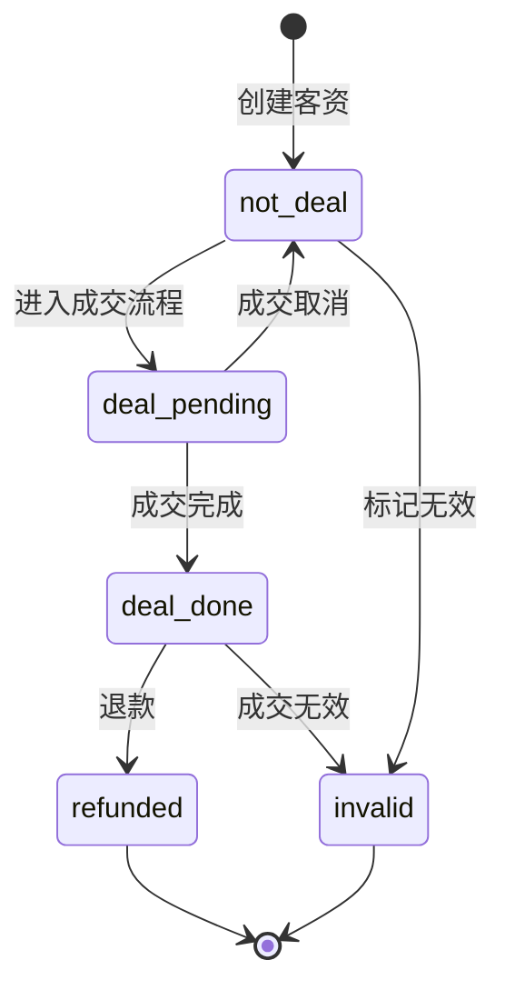

#### TC-STM-010: deal_status正向流转

| 字段 | 内容 |
|------|------|
| **用例编号** | TC-STM-010 |
| **用例标题** | deal_status正向流转：not_deal→deal_pending→deal_done |
| **涉及端口** | 销售端 |
| **优先级** | P0 |
| **前置条件** | 1. 销售端已登录 sales_test1 2. 客资 test_lead_deal_1 状态：deal_status=not_deal |
| **测试数据** | 客资：test_lead_deal_1 |
| **测试步骤** | **步骤1**: 销售标记成交 **步骤2**: 验证 deal_status = 'deal_pending'（成交流程中） **步骤3**: 订单创建成功 **步骤4**: 验证 deal_status = 'deal_done' |
| **预期结果** | **DB验证**: - 步骤2: `leads.deal_status` = 'deal_pending' - 步骤4: `leads.deal_status` = 'deal_done' |
| **实际结果** | |
| **备注** | |

---

#### TC-STM-011: deal_status旁路流转

| 字段 | 内容 |
|------|------|
| **用例编号** | TC-STM-011 |
| **用例标题** | deal_status旁路流转：任意状态→refunded |
| **涉及端口** | 销售端、教务端 |
| **优先级** | P0 |
| **前置条件** | 1. 教务端已登录 academic_test1 2. 订单 test_order_deal_1 已成交 3. 客资 test_lead_deal_2 状态：deal_status=deal_done |
| **测试数据** | 客资：test_lead_deal_2 |
| **测试步骤** | **步骤1**: 教务或销售发起退款 **步骤2**: 退款流程完成 **步骤3**: 验证 deal_status = 'refunded' |
| **预期结果** | 步骤3: deal_status = 'refunded' |
| **实际结果** | |
| **备注** | |

---

### 7.5 协同任务状态机（collaboration_tasks.status）

#### 状态流转图

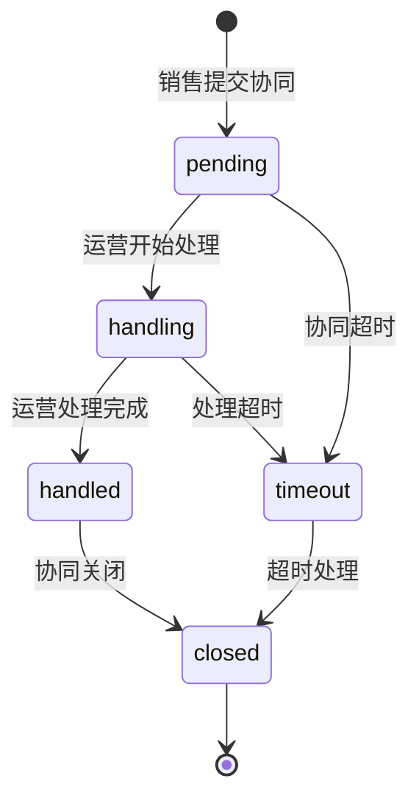

#### TC-STM-012: 协同任务status正向流转

| 字段 | 内容 |
|------|------|
| **用例编号** | TC-STM-012 |
| **用例标题** | 协同任务status正向流转：pending→handling→handled→closed |
| **涉及端口** | 销售端、运营端 |
| **优先级** | P0 |
| **前置条件** | 1. 销售端已登录 sales_test1 2. 运营端已登录 operation_test1 3. 客资 test_lead_collab_1 状态：in_collaboration |
| **测试数据** | 协同任务：test_collab_1 |
| **测试步骤** | **步骤1**: 销售提交协同申请 **步骤2**: 验证 status = 'pending' **步骤3**: 运营进入协同详情，开始处理 **步骤4**: 验证 status = 'handling' **步骤5**: 运营填写处理备注并提交 **步骤6**: 验证 status = 'handled' **步骤7**: 协同任务自动或手动关闭 **步骤8**: 验证 status = 'closed' |
| **预期结果** | **DB验证**: - 步骤2: `collaboration_tasks.status` = 'pending' - 步骤4: `collaboration_tasks.status` = 'handling' - 步骤6: `collaboration_tasks.status` = 'handled' - 步骤8: `collaboration_tasks.status` = 'closed' |
| **实际结果** | |
| **备注** | |

---

#### TC-STM-013: 协同任务status旁路流转

| 字段 | 内容 |
|------|------|
| **用例编号** | TC-STM-013 |
| **用例标题** | 协同任务status旁路流转：pending→timeout |
| **涉及端口** | 系统定时任务 |
| **优先级** | P0 |
| **前置条件** | 1. 协同任务 test_collab_timeout_1 已创建超过超时时间 2. @Cron 扫描器已配置 |
| **测试数据** | 协同任务：test_collab_timeout_1 超时时间：30分钟 |
| **测试步骤** | **步骤1**: 等待或手动触发 30 分钟超时扫描 **步骤2**: 验证 status = 'timeout' **步骤3**: 验证主管收到超时通知 |
| **预期结果** | **DB验证**: - `collaboration_tasks.status` = 'timeout' - `notifications` 表有 `collaboration_timeout` 类型通知 |
| **实际结果** | |
| **备注** | |

---

### 7.6 订单状态机

#### 订单主状态流转图

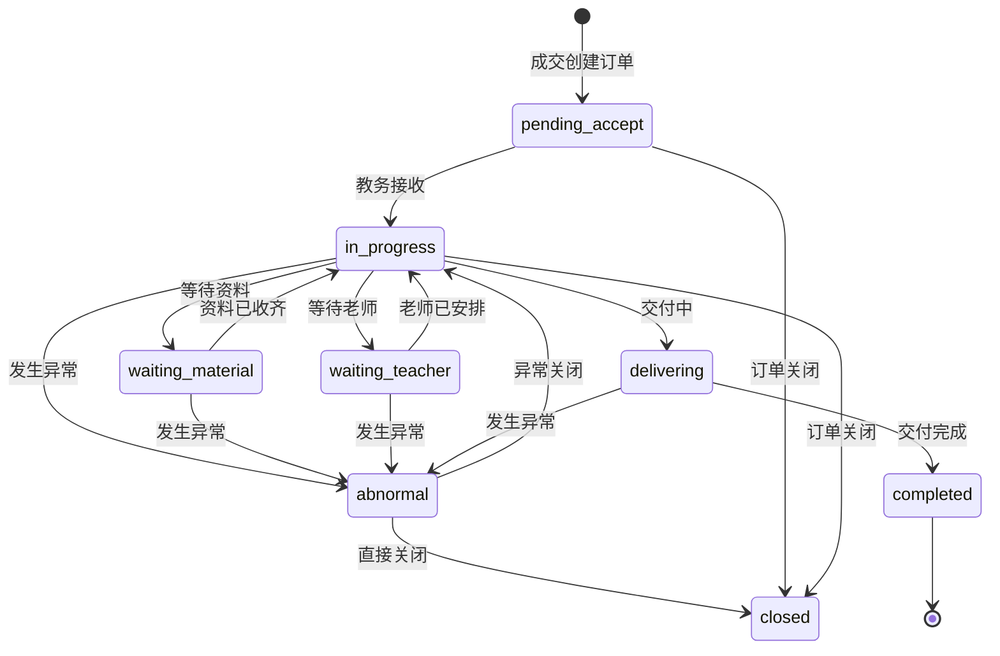

#### 付款状态流转图

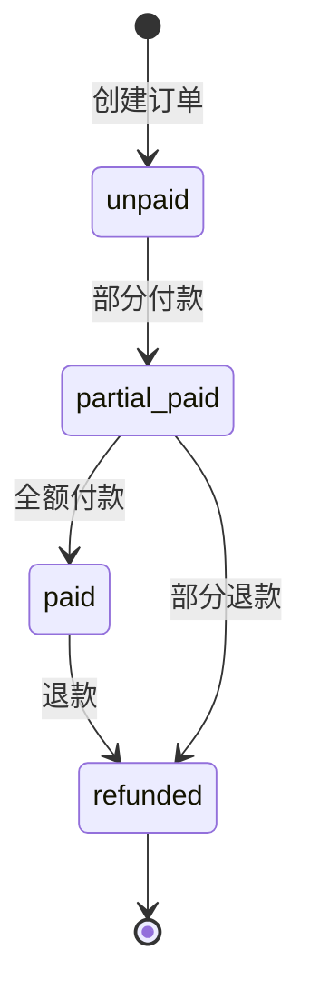

#### 交接状态流转图

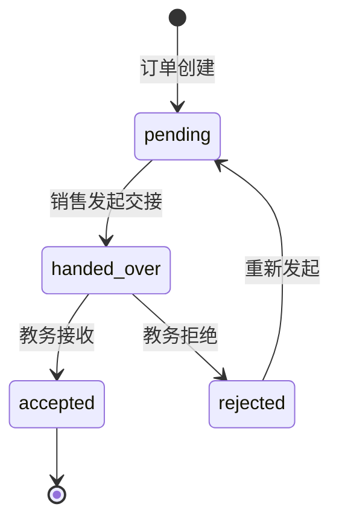

#### TC-STM-014: 订单order_status正向流转

| 字段 | 内容 |
|------|------|
| **用例编号** | TC-STM-014 |
| **用例标题** | 订单order_status正向流转：pending_accept→in_progress→waiting_material→waiting_teacher→delivering→completed |
| **涉及端口** | 销售端、教务端 |
| **优先级** | P0 |
| **前置条件** | 1. 教务端已登录 academic_test1 2. 订单 test_order_status_1 状态：order_status=pending_accept |
| **测试数据** | 订单：test_order_status_1 |
| **测试步骤** | **步骤1**: 教务接收订单 **步骤2**: 验证 order_status = 'in_progress' **步骤3**: 教务更新进度：等待客户资料 **步骤4**: 验证 order_status = 'waiting_material' **步骤5**: 教务更新进度：资料已收齐 **步骤6**: 验证 order_status = 'in_progress' **步骤7**: 教务更新进度：等待老师安排 **步骤8**: 验证 order_status = 'waiting_teacher' **步骤9**: 教务更新进度：老师已安排 **步骤10**: 验证 order_status = 'in_progress' **步骤11**: 教务更新进度：交付中 **步骤12**: 验证 order_status = 'delivering' **步骤13**: 教务更新进度：交付完成 **步骤14**: 验证 order_status = 'completed' |
| **预期结果** | **DB验证**: 每步后查询 `orders.order_status` 字段正确变化 |
| **实际结果** | |
| **备注** | |

---

#### TC-STM-015: 订单order_status旁路流转

| 字段 | 内容 |
|------|------|
| **用例编号** | TC-STM-015 |
| **用例标题** | 订单order_status旁路流转：任意状态→abnormal |
| **涉及端口** | 教务端 |
| **优先级** | P0 |
| **前置条件** | 1. 教务端已登录 academic_test1 2. 订单 test_order_abn_1 状态：order_status=in_progress |
| **测试数据** | 订单：test_order_abn_1 异常类型：客户不配合 |
| **测试步骤** | **步骤1**: 教务创建异常反馈 **步骤2**: 验证 order_status = 'abnormal' |
| **预期结果** | 步骤2: order_status = 'abnormal' |
| **实际结果** | |
| **备注** | |

---

#### TC-STM-016: 订单paid_status正向流转

| 字段 | 内容 |
|------|------|
| **用例编号** | TC-STM-016 |
| **用例标题** | 订单paid_status正向流转：unpaid→partial_paid→paid |
| **涉及端口** | 销售端、教务端 |
| **优先级** | P0 |
| **前置条件** | 1. 教务端已登录 academic_test1 2. 订单 test_order_paid_1 状态：paid_status=unpaid |
| **测试数据** | 订单：test_order_paid_1 成交金额：5000 首次付款：2000 |
| **测试步骤** | **步骤1**: 教务或销售记录部分付款 2000 **步骤2**: 验证 paid_status = 'partial_paid' **步骤3**: 记录剩余付款 3000 **步骤4**: 验证 paid_status = 'paid' |
| **预期结果** | **DB验证**: - 步骤2: `orders.paid_status` = 'partial_paid' - 步骤4: `orders.paid_status` = 'paid' |
| **实际结果** | |
| **备注** | |

---

#### TC-STM-017: 订单paid_status旁路流转

| 字段 | 内容 |
|------|------|
| **用例编号** | TC-STM-017 |
| **用例标题** | 订单paid_status旁路流转：paid→refunded |
| **涉及端口** | 教务端 |
| **优先级** | P0 |
| **前置条件** | 1. 教务端已登录 academic_test1 2. 订单 test_order_paid_2 状态：paid_status=paid |
| **测试数据** | 订单：test_order_paid_2 |
| **测试步骤** | **步骤1**: 发起退款流程 **步骤2**: 退款完成 **步骤3**: 验证 paid_status = 'refunded' |
| **预期结果** | 步骤3: paid_status = 'refunded' |
| **实际结果** | |
| **备注** | |

---

#### TC-STM-018: 订单handover_status正向流转

| 字段 | 内容 |
|------|------|
| **用例编号** | TC-STM-018 |
| **用例标题** | 订单handover_status正向流转：pending→handed_over→accepted |
| **涉及端口** | 销售端、教务端 |
| **优先级** | P0 |
| **前置条件** | 1. 销售端已登录 sales_test1 2. 教务端已登录 academic_test1 3. 订单 test_order_handover_1 状态：handover_status=pending |
| **测试数据** | 订单：test_order_handover_1 |
| **测试步骤** | **步骤1**: 销售发起 hand-over **步骤2**: 验证 handover_status = 'handed_over' **步骤3**: 教务 accept 接收订单 **步骤4**: 验证 handover_status = 'accepted' |
| **预期结果** | **DB验证**: - 步骤2: `orders.handover_status` = 'handed_over' - 步骤4: `orders.handover_status` = 'accepted' |
| **实际结果** | |
| **备注** | |

---

#### TC-STM-019: 订单handover_status拒绝流转

| 字段 | 内容 |
|------|------|
| **用例编号** | TC-STM-019 |
| **用例标题** | 订单handover_status拒绝流转：handed_over→rejected |
| **涉及端口** | 教务端 |
| **优先级** | P0 |
| **前置条件** | 1. 教务端已登录 academic_test1 2. 订单 test_order_handover_2 状态：handover_status=handed_over |
| **测试数据** | 订单：test_order_handover_2 |
| **测试步骤** | **步骤1**: 教务 reject 拒绝接收订单 **步骤2**: 填写拒绝原因 **步骤3**: 验证 handover_status = 'rejected' |
| **预期结果** | 步骤3: handover_status = 'rejected' |
| **实际结果** | |
| **备注** | |

---

## 八、交付链路验收测试用例

### 8.1 链路验收概述

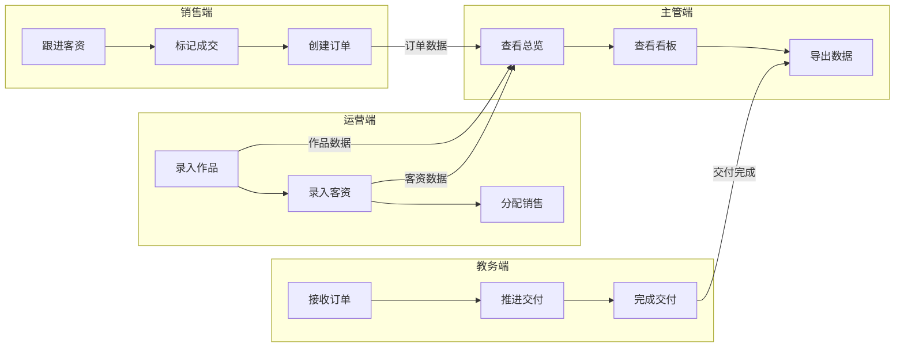

### 8.2 详细测试用例

#### TC-LINK-001: 运营录入作品→主管查看作品看板

| 字段 | 内容 |
|------|------|
| **用例编号** | TC-LINK-001 |
| **用例标题** | 运营录入作品→主管查看作品看板 |
| **涉及端口** | 运营端、主管端 |
| **优先级** | P0 |
| **前置条件** | 1. 运营端已登录 operation_test1 2. 主管端已登录 supervisor_test1 3. 系统已有绑定账号 |
| **测试数据** | 作品标题：链路测试作品001 |
| **测试步骤** | **运营端** 1. 录入作品 test_post_link_1 2. 验证录入成功  **主管端** 3. 进入作品看板 4. 筛选该运营作品 5. 验证作品出现在列表中 6. 点击作品查看详情 7. 验证数据一致性 |
| **预期结果** | **数据一致性验证**: - `posts` 表作品数据 - 主管端作品看板数据与录入一致 - 作品关联的账号、运营信息正确 |
| **实际结果** | |
| **备注** | |

---

#### TC-LINK-002: 运营录入客资→销售跟进→成交→教务交付

| 字段 | 内容 |
|------|------|
| **用例编号** | TC-LINK-002 |
| **用例标题** | 运营录入客资→销售跟进→成交→教务交付完整链路 |
| **涉及端口** | 运营端、销售端、教务端、主管端 |
| **优先级** | P0 |
| **前置条件** | 1. 运营端已登录 operation_test1 2. 销售端已登录 sales_test1 3. 教务端已登录 academic_test1 4. 主管端已登录 supervisor_test1 |
| **测试数据** | 客资：张三 成交金额：8888 |
| **测试步骤** | **运营端** 1. 录入客资 test_lead_full_1，关联作品 2. 分配给 sales_test1  **销售端** 3. 收到新客资通知 4. 查看客资详情 5. 跟进并标记已添加 6. 标记成交  **教务端** 7. 收到新订单通知 8. 接收订单 9. 推进交付进度 10. 完成交付  **主管端** 11. 查看客资看板 12. 查看订单状态 13. 导出客资和订单数据 |
| **预期结果** | **全链路数据一致性验证**:  **客资数据链**: - `leads` 表：new→assigned→in_followup→added_success→deal_done - `lead_follow_records` 表：完整跟进时间线  **订单数据链**: - `orders` 表：pending_accept→in_progress→completed - `order_follow_records` 表：完整交付时间线  **通知数据链**: - `notifications` 表：lead_assigned→order_created→order_updated  **主管端数据验证**: - 客资看板数据与销售端一致 - 订单数据与教务端一致 |
| **实际结果** | |
| **备注** | |

---

#### TC-LINK-003: 全链路数据一致性验证

| 字段 | 内容 |
|------|------|
| **用例编号** | TC-LINK-003 |
| **用例标题** | 全链路数据一致性验证 |
| **涉及端口** | 运营端、销售端、教务端、主管端 |
| **优先级** | P0 |
| **前置条件** | 1. 四端口已登录对应账号 2. 完整链路测试数据已创建 |
| **测试数据** | 作品：test_post_consistency 客资：test_lead_consistency 订单：test_order_consistency |
| **测试步骤** | **数据溯源验证** 1. 从订单 test_order_consistency 溯源到客资 2. 从客资溯源到来源作品 3. 从客资溯源到录入运营 4. 从订单溯源到成交销售 5. 从订单溯源到负责教务  **跨表数据一致性验证** 6. 验证 `orders.lead_id` 与 `leads.id` 一致 7. 验证 `leads.source_post_id` 与 `posts.id` 一致 8. 验证 `leads.operator_id` 与 `employees.id` 一致 9. 验证 `orders.sales_id` 与 `users.id` 一致 10. 验证 `orders.academic_admin_id` 与 `users.id` 一致  **状态机一致性验证** 11. 验证 `leads.deal_status` 与 `orders.order_status` 关联 12. 验证 `leads.status` 与各子状态机一致 |
| **预期结果** | **溯源链路**: - 订单→客资→作品→运营：链路完整 - 订单→销售→教务：链路完整  **跨表一致性**: - 所有外键关系正确 - 关联字段值匹配  **状态机一致性**: - 客资成交后订单自动创建 - 订单关闭后客资状态联动 |
| **实际结果** | |
| **备注** | |

---

#### TC-LINK-004: 通知触发全链路验证

| 字段 | 内容 |
|------|------|
| **用例编号** | TC-LINK-004 |
| **用例标题** | 通知触发全链路验证 |
| **涉及端口** | 运营端、销售端、教务端、主管端 |
| **优先级** | P0 |
| **前置条件** | 1. 四端口已登录对应账号 2. Socket.IO 服务正常运行 |
| **测试数据** | 完整链路测试数据 |
| **测试步骤** | **通知触发点验证** 1. 运营分配销售 → 销售收到 lead_assigned 2. 销售申请协同 → 运营收到 collaboration_requested 3. 运营处理协同 → 销售收到 collaboration_handled 4. 销售标记已添加 → 运营收到 customer_added 5. 销售标记成交 → 教务收到 order_created 6. 销售标记成交 → 主管收到 lead_deal_done 7. 教务更新进度 → 销售收到 order_updated 8. 教务创建异常 → 销售和主管收到 order_abnormal  **通知内容验证** 9. 验证每条通知的 type 正确 10. 验证 related_id 指向正确业务记录 11. 验证跳转参数正确  **实时性验证** 12. 验证在线推送 3 秒内到达 13. 验证离线补看功能 |
| **预期结果** | **通知触发**: - 12 个通知类型全部触发 - 触发时机正确  **通知内容**: - typeCode 正确 - relatedId 正确 - targetView 正确  **实时性**: - 在线推送 ≤ 3 秒 - 离线补看完整 |
| **实际结果** | |
| **备注** | |

---

#### TC-LINK-005: 主管导出全链路验证

| 字段 | 内容 |
|------|------|
| **用例编号** | TC-LINK-005 |
| **用例标题** | 主管导出全链路验证 |
| **涉及端口** | 主管端 |
| **优先级** | P0 |
| **前置条件** | 1. 主管端已登录 supervisor_test1 2. 系统已有作品、客资、订单数据 |
| **测试数据** | 无 |
| **测试步骤** | **导出类型验证** 1. 导出作品数据（posts） 2. 导出客资数据（leads） 3. 导出订单数据（orders） 4. 导出排行榜数据（rankings） 5. 导出协同记录（collaborations） 6. 导出账号数据（accounts）  **导出流程验证** 7. 创建导出任务 8. 验证导出任务状态变化（pending→processing→success/failed） 9. 验证导出完成通知 10. 下载导出文件  **数据完整性验证** 11. 验证导出数据与页面数据一致 12. 验证筛选条件保留 13. 验证敏感字段脱敏（普通员工视角） 14. 验证主管权限可导出完整字段 |
| **预期结果** | **导出类型**: - 6 种导出类型全部可用  **导出流程**: - 任务创建成功 - 状态流转正确 - 通知触发正确  **数据完整性**: - 导出数据与 DB 一致 - 筛选条件正确保留 - 脱敏规则正确执行 |
| **实际结果** | |
| **备注** | |

---

## 九、缺口验证测试用例（⚠️标记项）

### 9.1 通知触发缺口验证

| 字段 | 内容 |
|------|------|
| **用例编号** | TC-GAP-001 |
| **用例标题** | 运营分配销售时通知触发验证 |
| **涉及端口** | 运营端、销售端 |
| **优先级** | P1 |
| **前置条件** | 1. 运营端已登录 operation_test1 2. 销售端已登录 sales_test1 3. 客资已录入 |
| **测试数据** | 客资：test_lead_notify_gap |
| **测试步骤** | **⚠️ 根据文档标注，分配销售时通知触发未实装** 1. 运营分配销售 2. 检查 sales_test1 是否收到通知 3. 检查 notifications 表是否有记录 4. 记录实际行为 |
| **预期结果** | **期望行为**: - 销售收到 lead_assigned 通知 - notifications 表有记录  **实际结果**: （待填写） |
| **实际结果** | |
| **备注** | ⚠️ 文档标注通知触发未实装，需验证 |

---

### 9.2 作品录入多入口缺口验证

| 字段 | 内容 |
|------|------|
| **用例编号** | TC-GAP-002 |
| **用例标题** | 作品录入三入口验证 |
| **涉及端口** | 运营端 |
| **优先级** | P1 |
| **前置条件** | 1. 运营端已登录 operation_test1 |
| **测试数据** | 无 |
| **测试步骤** | **⚠️ 根据文档标注，缺 3 入口 UI 切换** 1. 进入作品录入页面 2. 验证是否有三种录入入口切换（链接录入/截图上传/手动录入） 3. 测试截图作为封面上传功能 4. 测试 note 备注字段 |
| **预期结果** | **期望行为**: - 有三种录入入口切换 UI - 截图作为封面字段 - 有 note 备注字段  **实际结果**: （待填写） |
| **实际结果** | |
| **备注** | ⚠️ 文档标注缺 3 入口 UI，需验证 |

---

### 9.3 客资今日记录视图缺口验证

| 字段 | 内容 |
|------|------|
| **用例编号** | TC-GAP-003 |
| **用例标题** | 客资今日记录视图验证 |
| **涉及端口** | 运营端 |
| **优先级** | P1 |
| **前置条件** | 1. 运营端已登录 operation_test1 2. 已有今日录入的客资 |
| **测试数据** | 今日录入的客资：test_lead_today |
| **测试步骤** | **⚠️ 根据文档标注，今日记录视图缺失** 1. 运营录入客资后 2. 检查是否有「今日记录」快速跳转入口 3. 检查客资看板是否有今日时间筛选 4. 验证是否支持当天快速回查和编辑 |
| **预期结果** | **期望行为**: - 录入成功后可跳转到今日记录视图 - 客资看板支持今日时间筛选 - 今日记录视图正确展示当天数据  **实际结果**: （待填写） |
| **实际结果** | |
| **备注** | ⚠️ 文档标注今日记录视图缺失，需验证 |

---

### 9.4 协同再次提醒缺口验证

| 字段 | 内容 |
|------|------|
| **用例编号** | TC-GAP-004 |
| **用例标题** | 协同再次提醒功能验证 |
| **涉及端口** | 销售端、运营端 |
| **优先级** | P2 |
| **前置条件** | 1. 销售端已登录 sales_test1 2. 有待处理的协同任务 |
| **测试数据** | 协同任务：test_collab_remind |
| **测试步骤** | **⚠️ 根据文档标注，当前仅首次协同** 1. 销售提交协同申请 2. 运营处理前，销售再次点击提醒 3. 验证是否记录提醒次数和时间 4. 验证运营是否收到再次提醒 |
| **预期结果** | **期望行为**: - 支持再次提醒 - 记录提醒次数 - 记录提醒时间  **实际结果**: （待填写） |
| **实际结果** | |
| **备注** | ⚠️ 文档标注 P2 留待跟进，需验证 |

---

### 9.5 主管建议通知缺口验证

| 字段 | 内容 |
|------|------|
| **用例编号** | TC-GAP-005 |
| **用例标题** | 主管建议通知触发验证 |
| **涉及端口** | 主管端、运营端 |
| **优先级** | P1 |
| **前置条件** | 1. 主管端已登录 supervisor_test1 2. 运营端已登录 operation_test1 3. 有作品可填写建议 |
| **测试数据** | 作品：test_post_suggest |
| **测试步骤** | **⚠️ 根据文档标注，supervisor_suggestion 通知标为"已下线"** 1. 主管为作品填写建议 2. 检查运营端是否收到通知 3. 检查 notifications 表 type='supervisor_suggestion' 记录 4. 记录实际行为 |
| **预期结果** | **期望行为**: - 运营收到 supervisor_suggestion 通知 - notifications 表有记录  **实际结果**: （待填写） |
| **实际结果** | |
| **备注** | ⚠️ 文档标注通知已下线，需验证 |

---

## 十、测试用例执行记录

### 10.1 执行日志

| 执行日期 | 执行人 | 用例编号 | 执行结果 | 问题记录 |
|----------|--------|----------|----------|----------|
| | | | | |
| | | | | |
| | | | | |

### 10.2 问题跟踪

| 问题编号 | 描述 | 严重程度 | 状态 | 解决日期 |
|----------|------|----------|------|----------|
| | | | | |
| | | | | |

---

## 十一、附录

### 11.1 状态码对照表

| 状态类型 | 状态码 | 中文标签 |
|----------|--------|----------|
| leads.status | new | 新建 |
| leads.status | assigned | 已分配 |
| leads.status | in_followup | 跟进中 |
| leads.status | in_collaboration | 协同中 |
| leads.status | operation_handled | 运营已处理 |
| leads.status | added_success | 已添加通过 |
| leads.status | deal_done | 已成交 |
| leads.status | invalid | 无效 |
| leads.add_status | not_added | 未添加 |
| leads.add_status | applied | 已申请 |
| leads.add_status | not_passed | 未通过 |
| leads.add_status | operation_reminded | 运营已提醒 |
| leads.add_status | added | 已添加 |
| leads.process_status | not_contacted | 未联系 |
| leads.process_status | communicating | 沟通中 |
| leads.process_status | quoted | 已报价 |
| leads.process_status | deal_pending | 成交待定 |
| leads.process_status | deal_done | 已成交 |
| leads.process_status | invalid | 无效 |
| leads.deal_status | not_deal | 未成交 |
| leads.deal_status | deal_pending | 成交流程中 |
| leads.deal_status | deal_done | 已成交 |
| leads.deal_status | refunded | 已退款 |
| leads.deal_status | invalid | 无效 |
| collaboration_tasks.status | pending | 待处理 |
| collaboration_tasks.status | handling | 处理中 |
| collaboration_tasks.status | handled | 已处理 |
| collaboration_tasks.status | timeout | 已超时 |
| collaboration_tasks.status | closed | 已关闭 |
| orders.order_status | pending_accept | 待接收 |
| orders.order_status | in_progress | 进行中 |
| orders.order_status | waiting_material | 等待资料 |
| orders.order_status | waiting_teacher | 等待老师 |
| orders.order_status | delivering | 交付中 |
| orders.order_status | completed | 已完成 |
| orders.order_status | abnormal | 异常 |
| orders.order_status | closed | 已关闭 |
| orders.paid_status | unpaid | 未付款 |
| orders.paid_status | partial_paid | 部分付款 |
| orders.paid_status | paid | 已付款 |
| orders.paid_status | refunded | 已退款 |
| orders.handover_status | pending | 待交接 |
| orders.handover_status | handed_over | 已交接 |
| orders.handover_status | accepted | 已接收 |
| orders.handover_status | rejected | 已拒绝 |

### 11.2 通知类型对照表

| 通知类型 | 触发时机 | 接收端 |
|----------|----------|--------|
| lead_assigned | 客资分配销售 | 销售 |
| collaboration_requested | 销售申请协同 | 运营 |
| customer_not_passed | 客户未通过 | 运营 |
| collaboration_handled | 运营处理协同 | 销售 |
| customer_added | 销售已添加通过 | 运营 |
| lead_deal_done | 客资成交 | 主管 |
| order_created | 订单创建 | 教务、主管 |
| order_updated | 订单进度更新 | 销售、主管 |
| order_abnormal | 订单异常 | 销售、主管 |
| supervisor_suggestion | 主管建议 | 运营 |
| collaboration_timeout | 协同超时 | 主管 |
| export_finished | 导出完成 | 发起人 |

## 十二、跨端口协同 P0 缺口测试用例

> **缺口来源**：`doc/运营中台四端口-当前问题.md` 11 条问题 + `doc/B端-详细测试用例-真实执行结果.md` 11 个真实缺陷
> **本章范围**：四端口之间的实时协同、跨端口跳转、跨端数据一致性

### 12.1 销售-运营协同链路用例

#### TC-E2E-030: 销售"待确认被动添加"客资→运营收到"客户已通过"通知

| 字段 | 内容 |
|------|------|
| **用例编号** | TC-E2E-030 |
| **用例标题** | 销售"待确认被动添加"客资→运营收到"客户已通过"通知 |
| **涉及端口** | 销售端、运营端 |
| **优先级** | P0 |
| **缺口追溯** | 当前问题 #2（被动添加客资无法确定具体哪个客资） |
| **前置条件** | 1. 销售 sales_test1 已登录 2. 客户已主动加销售微信，但来源运营待确认 3. 销售已新建"被动添加客资"test_passive_lead_1 |
| **测试步骤** | **销售端** 1. 进入"待确认被动添加"列表 2. 选择 test_passive_lead_1 3. 点击"确认绑定"按钮 4. 模糊匹配展示 3 个候选客资 5. 选择其中 1 个候选客资确认 6. 填写反馈"客户已通过好友申请" 7. 点击"提交"  **运营端** 8. 切换到 operation_test1 9. 检查通知中心 |
| **预期结果** | 步骤7: 提交成功，提示"绑定成功" **DB验证**: - `leads` 表 test_passive_lead_1 的 `add_method` = 'passive' - `leads.matched_post_id` = 候选客资对应作品ID - `notifications` 表新增 type='customer_added'，receiver_id=operation_test1.user_id **通知验证**: - 运营端 3 秒内收到 `lead.added_success` 事件 - 通知 content 包含"客户已通过" - 通知 routeHint 指向 `/operation/leads/{leadId}` |
| **实际结果** | |
| **备注** | 真实缺陷 PF-04 回归：协同 reason 中文应不报 422 |

---

#### TC-E2E-031: 销售模糊匹配到候选客资→确认绑定→关联关系写入

| 字段 | 内容 |
|------|------|
| **用例编号** | TC-E2E-031 |
| **用例标题** | 销售模糊匹配到候选客资→确认绑定→关联关系写入→销售/运营两侧看板一致 |
| **涉及端口** | 销售端、运营端 |
| **优先级** | P0 |
| **缺口追溯** | 当前问题 #2 |
| **前置条件** | 1. 销售 sales_test1 已登录 2. 运营 operation_test1 5 天前已录客资 test_lead_match_1（昵称"小红"，联系方式尾号 8888） 3. 客户"小红"今天主动加了销售微信 |
| **测试步骤** | **销售端** 1. 在"待确认被动添加"页新建被动客资 2. 填写昵称"小红"、手机号尾号 8888 3. 提交后等待系统模糊匹配 4. 验证系统返回候选客资列表（至少包含 test_lead_match_1） 5. 销售选中 test_lead_match_1 点击"确认绑定" 6. 验证该候选客资状态更新  **运营端** 7. operation_test1 进入客资看板 8. 查找 test_lead_match_1 9. 验证客资状态显示"销售已添加通过" |
| **预期结果** | 步骤4: 模糊匹配返回正确候选（基于联系方式、昵称、时间） 步骤5: 绑定成功 **DB验证**: - `leads` 表 test_lead_match_1 的 `add_method` = 'passive' - `leads.matched_post_id` 写入 - `lead_follow_records` 表新增一条 type='passive_match_confirmed' 记录 步骤9: 运营端看到 test_lead_match_1 状态 = 'added_success' **两侧看板一致性**: - 销售端"我的客资"显示 test_lead_match_1 - 运营端客资看板显示 test_lead_match_1 状态同步 |
| **实际结果** | |
| **备注** | 模糊匹配算法应基于 (联系方式末4位+昵称) 模糊匹配 |

---

#### TC-E2E-032: 员工硬删/软删作品→销售端"来源作品"显示"已删除"或降级展示

| 字段 | 内容 |
|------|------|
| **用例编号** | TC-E2E-032 |
| **用例标题** | 员工硬删/软删作品→销售端"来源作品"显示"已删除"或降级展示 |
| **涉及端口** | 运营端、销售端 |
| **优先级** | P0 |
| **缺口追溯** | 客资-作品-账号溯源链路 |
| **前置条件** | 1. 运营 operation_test1 已录入作品 test_post_del_1 2. test_post_del_1 关联 3 条客资已分配给销售 |
| **测试步骤** | **运营端** 1. operation_test1 在"我的作品"找到 test_post_del_1 2. 点击"删除"按钮（系统内确认弹窗） 3. 确认软删除（status='deleted'）  **销售端** 4. sales_test1 进入"我的客资" 5. 找到来源作品为 test_post_del_1 的客资 6. 进入客资详情 7. 检查"来源作品"区域 |
| **预期结果** | **软删除验证**: 步骤3: 删除成功 **DB验证**: - `posts` 表 status='deleted'（或 deleted_at 非空） 步骤7: 销售端"来源作品"区域显示"该作品已删除"灰色提示 - 仍能查看作品标题、发布时间（保留溯源） - "打开原帖"按钮置灰或隐藏 - 点击标题不再跳转 **硬删除验证**（如果有该功能）： - `posts` 表记录不存在 - 销售端"来源作品"显示"作品不存在"占位 - 客资-作品关系保持只读 |
| **实际结果** | |
| **备注** | 软删除优于硬删除，保留溯源链路 |

---

#### TC-E2E-033: 员工改作品链接→销售端跳转链接同步更新

| 字段 | 内容 |
|------|------|
| **用例编号** | TC-E2E-033 |
| **用例标题** | 员工改作品链接→销售端跳转链接同步更新 |
| **涉及端口** | 运营端、销售端 |
| **优先级** | P0 |
| **缺口追溯** | 客资-作品溯源实时性 |
| **前置条件** | 1. 运营 operation_test1 已录作品 test_post_link_edit_1（post_url = 'https://old-url'） 2. 销售 sales_test1 有客资引用此作品 |
| **测试步骤** | **运营端** 1. operation_test1 在"我的作品"编辑 test_post_link_edit_1 2. 修改 post_url 为 'https://new-url' 3. 保存  **销售端** 4. sales_test1 进入客资详情 5. 点击"打开原帖"按钮 6. 验证跳转链接 |
| **预期结果** | 步骤3: 保存成功 **DB验证**: - `posts.post_url` = 'https://new-url' 步骤6: 浏览器新标签页打开 'https://new-url'（不是旧链接） **实时性验证**（如缓存）： - 销售端不需要刷新即可看到新链接 |
| **实际结果** | |
| **备注** | 验证缓存/前端不存储过时 URL |

---

#### TC-E2E-034: 主管停用运营 A→销售端历史客资仍可访问，但显示"该员工已停用"

| 字段 | 内容 |
|------|------|
| **用例编号** | TC-E2E-034 |
| **用例标题** | 主管停用运营 A→销售端历史客资仍可访问，但显示"该员工已停用" |
| **涉及端口** | 主管端、销售端 |
| **优先级** | P0 |
| **缺口追溯** | 员工停用后的客资溯源可见性 |
| **前置条件** | 1. 运营 operation_test1 已被主管停用（employees.status='inactive'） 2. operation_test1 录入的客资 test_lead_inactive_op_1 已分配给 sales_test1 |
| **测试步骤** | **销售端** 1. sales_test1 进入"我的客资" 2. 找到 test_lead_inactive_op_1 3. 进入详情页 4. 查看"所属运营"区域 5. 点击运营头像（如有） |
| **预期结果** | 步骤3: 客资详情正常显示（不报错） 步骤4: "所属运营"显示 "operation_test1（已停用）" 灰色标签 步骤5: 运营头像/名称不跳转，或跳转后提示"该员工已停用" **DB验证**: - `leads.operator_id` 仍指向 operation_test1.employee_id - `leads` 数据仍可访问（不级联删除） - `employees.status` = 'inactive' |
| **实际结果** | |
| **备注** | 历史数据完整性优先，溯源不断链 |

---

#### TC-E2E-035: 主管改派销售（无源 vs 有源两种）

| 字段 | 内容 |
|------|------|
| **用例编号** | TC-E2E-035 |
| **用例标题** | 主管改派销售（无源 vs 有源两种） |
| **涉及端口** | 主管端、销售端 |
| **优先级** | P0 |
| **缺口追溯** | 主管改派场景全覆盖 |
| **前置条件** | 1. 主管 supervisor_test1 已登录 2. 客资 A：test_lead_reassign_a（无源销售，已 assigned=null） 3. 客资 B：test_lead_reassign_b（已分配给 sales_test1） |
| **测试数据** | 客资 A：test_lead_reassign_a（新客资，sales_id=NULL） 客资 B：test_lead_reassign_b（已分配给 sales_test1） 新销售：sales_test2 |
| **测试步骤** | **场景 1：无源改派** 1. 主管在客资看板找到 test_lead_reassign_a 2. 点击"分配销售"（不是"改派"） 3. 选择 sales_test2 4. 确认  **场景 2：有源改派** 5. 主管在客资看板找到 test_lead_reassign_b 6. 点击"改派销售" 7. 选择 sales_test2 8. 确认 |
| **预期结果** | **场景 1**: 步骤4: 分配成功，提示"已分配给 sales_test2" - `leads.assigned_sales_user_id` = sales_test2 - `lead_follow_records` 新增 type='assign' - sales_test2 收到 `lead_assigned` 通知  **场景 2**: 步骤8: 改派成功 - `leads.assigned_sales_user_id` = sales_test2 - `lead_follow_records` 新增 type='reassign'，from=sales_test1，to=sales_test2 - sales_test2 收到 `lead_assigned` 通知 - sales_test1 收到 `lead_unassigned` 通知（如有） - operation_logs 新增 action='reassign' |
| **实际结果** | |
| **备注** | BF-15 真实缺陷回归：admin PUT 改 assignedSalesUserId 必须触发通知 |

---

#### TC-E2E-036: 销售对 pending 协同任务点击"再次提醒"→运营收到+1提醒，remind_count 记录

| 字段 | 内容 |
|------|------|
| **用例编号** | TC-E2E-036 |
| **用例标题** | 销售对 pending 协同任务点击"再次提醒"→运营收到+1提醒，remind_count 记录 |
| **涉及端口** | 销售端、运营端 |
| **优先级** | P0 |
| **缺口追溯** | TC-GAP-004（协同再次提醒缺口） |
| **前置条件** | 1. 销售 sales_test1 已发起协同 test_collab_remind_1 2. 该协同状态=pending，未处理 |
| **测试步骤** | **销售端** 1. sales_test1 进入客资详情 2. 找到协同任务 test_collab_remind_1 3. 点击"再次提醒"按钮 4. 记录操作时间 T1  **运营端** 5. operation_test1 检查消息中心 |
| **预期结果** | 步骤3: 点击成功，提示"已再次提醒运营" **DB验证**: - `collaboration_tasks.remind_count` +1 - `collaboration_tasks.last_remind_at` = T1 - `notifications` 表新增 type='collaboration_reminded'，receiver_id=operation_test1 **通知验证**: - 运营端 3 秒内收到"协同再次提醒"事件 - 通知 content 包含"销售再次提醒"，提醒次数（"第 N 次"） |
| **实际结果** | |
| **备注** | 真实缺陷 PF-04 回归：reason 输入中文应不报 422 |

---

#### TC-E2E-037: 再次提醒时如果运营仍未处理，销售可升级到主管

| 字段 | 内容 |
|------|------|
| **用例编号** | TC-E2E-037 |
| **用例标题** | 再次提醒时如果运营仍未处理，销售可升级到主管 |
| **涉及端口** | 销售端、主管端 |
| **优先级** | P1 |
| **缺口追溯** | 协同升级机制 |
| **前置条件** | 1. 协同 test_collab_escalate_1 已 remind_count ≥ 2 2. 运营仍未处理 |
| **测试步骤** | **销售端** 1. sales_test1 在协同任务详情页 2. 看到"升级到主管"按钮（满足升级条件后可见） 3. 点击"升级到主管" 4. 填写升级原因"运营超过 1 小时未处理" 5. 提交  **主管端** 6. supervisor_test1 检查消息中心 |
| **预期结果** | 步骤5: 升级成功 **DB验证**: - `collaboration_tasks.escalated_at` = T1 - `collaboration_tasks.escalated_to` = supervisor_test1 - `notifications` 表新增 type='collaboration_escalated'，receiver_id=supervisor_test1 **通知验证**: - 主管端收到"协同升级"通知 - 通知 content 包含协同原因、运营、客资ID、升级次数 |
| **实际结果** | |
| **备注** | 可选功能，如有 |

---

#### TC-E2E-038: 销售成交后，主管端分析看板确认不显示成交金额

| 字段 | 内容 |
|------|------|
| **用例编号** | TC-E2E-038 |
| **用例标题** | 销售成交后，主管端分析看板确认不显示成交金额 |
| **涉及端口** | 销售端、主管端 |
| **优先级** | P0 |
| **缺口追溯** | 需求清单-界面恢复与优化.md §8 数据与指标口径 |
| **前置条件** | 1. 销售 sales_test1 已成交 test_lead_amt_1（金额 8888） 2. 主管端 supervisor_test1 已登录 |
| **测试步骤** | **主管端** 1. supervisor_test1 进入"分析看板" 2. 查看第一屏 5 个核心指标卡 3. 滚动查看趋势图、账号表现、内容归因 4. 搜索"成交"、"金额"、"8888"等关键词 5. F12 检查页面源码是否含金额字段 |
| **预期结果** | 步骤2: 第一屏只显示 5 个核心指标（抖音作品数、小红书作品数、获客贴数、新增客资数、有客资作品/账号），**不出现**成交金额卡片 步骤3: 趋势图围绕"作品数 vs 客资数"，**不出现**金额曲线 步骤4: 页面文本搜索"成交"出现 0 次或仅"非成交"上下文 步骤5: 页面源码不包含 amount、deal_amount 字段 |
| **实际结果** | |
| **备注** | 这是 P0 数据口径要求，分析看板不混入成交数据 |

---

#### TC-E2E-039: 主管总览确认成交数据仅在订单汇总区出现

| 字段 | 内容 |
|------|------|
| **用例编号** | TC-E2E-039 |
| **用例标题** | 主管总览确认成交数据仅在订单汇总区出现，不混入作品/客资区 |
| **涉及端口** | 主管端 |
| **优先级** | P0 |
| **缺口追溯** | 需求清单 §3.1 主管总览、§3.5 分析看板 |
| **前置条件** | 1. 主管 supervisor_test1 已登录 2. 系统已有成交订单数据 |
| **测试步骤** | **主管端** 1. supervisor_test1 进入"总览"页 2. 查看顶部核心指标组合卡（员工/账号、抖音/小红书作品、获客/素人/话题、客资/空转） 3. 查看中部重点判断区（平台重心、内容结构、风险、结果） 4. 查找"订单汇总"区 5. 在作品/客资相关区域搜索"成交金额" |
| **预期结果** | 步骤2: 顶部核心卡只有组合指标，**无成交金额** 步骤3: 重点判断区中"结果"可能含"新客资数"、"有客资账号"，但**不直接显示金额** 步骤4: "订单汇总"区显示订单数、交付进度（可能含金额） 步骤5: 作品/客资区搜索"金额"出现 0 次 |
| **实际结果** | |
| **备注** | 与 TC-E2E-038 互补，确保全站成交金额隔离 |

---

#### TC-E2E-040: 教务进入订单详情→看到销售姓名、运营姓名、来源作品、来源账号

| 字段 | 内容 |
|------|------|
| **用例编号** | TC-E2E-040 |
| **用例标题** | 教务进入订单详情→看到销售姓名、运营姓名、来源作品、来源账号 |
| **涉及端口** | 教务端 |
| **优先级** | P0 |
| **缺口追溯** | 教务订单详情字段完整性 |
| **前置条件** | 1. 教务 academic_test1 已登录 2. 订单 test_order_full_1 已成交 3. 订单由 sales_test1 成交，关联运营 operation_test1，关联作品 test_post_x |
| **测试步骤** | **教务端** 1. academic_test1 进入订单池 2. 找到 test_order_full_1 3. 进入订单详情 4. 查看"客户基础信息"区 5. 查看"成交信息"区 6. 查看"溯源信息"区（如有） |
| **预期结果** | 步骤4: 客户昵称、联系方式（脱敏）、IP、需求备注显示 步骤5: 服务类型、成交金额、合同状态、付款状态显示 步骤6: 销售姓名（sales_test1）、运营姓名（operation_test1）、来源作品（test_post_x 标题+封面缩略图）、来源账号（账号名+平台）显示 **DB验证**: - 订单详情 JOIN leads JOIN posts JOIN accounts JOIN employees 显示完整 |
| **实际结果** | |
| **备注** | 教务是只读视角，但需要完整溯源信息 |

---

#### TC-E2E-041: 教务点击来源作品→跳转到运营/主管端作品详情（教务端是只读）

| 字段 | 内容 |
|------|------|
| **用例编号** | TC-E2E-041 |
| **用例标题** | 教务点击来源作品→跳转到运营/主管端作品详情（教务端是只读） |
| **涉及端口** | 教务端、主管端/运营端 |
| **优先级** | P0 |
| **缺口追溯** | 跨端溯源跳转 |
| **前置条件** | 1. 教务 academic_test1 在订单详情页 2. 来源作品 test_post_y 已存在 |
| **测试步骤** | **教务端** 1. academic_test1 在订单详情 2. 点击"来源作品"卡片 3. 验证跳转目标 4. 验证只读性（无编辑/删除按钮） |
| **预期结果** | 步骤2: 点击成功 步骤3: 跳转到只读作品详情 Modal 或独立页面 - 作品标题、封面、平台、文案、点赞/评论指标显示 - 关联客资列表（脱敏） - 运营姓名（来源运营） 步骤4: 教务端**无**"编辑"、"删除"、"刷新数据"按钮 - 仅"关闭"、"打开原帖" |
| **实际结果** | |
| **备注** | 教务没有作品编辑权限，但需要溯源可读 |

---

#### TC-E2E-042: 主管改派后，新销售看到包含原销售跟进记录的完整时间线

| 字段 | 内容 |
|------|------|
| **用例编号** | TC-E2E-042 |
| **用例标题** | 主管改派后，新销售看到包含原销售跟进记录的完整时间线 |
| **涉及端口** | 销售端 |
| **优先级** | P0 |
| **缺口追溯** | 改派后时间线完整性 |
| **前置条件** | 1. 客资 test_lead_history_1 原由 sales_test1 跟进，有 3 条 follow_records 2. 主管已改派给 sales_test2 |
| **测试步骤** | **销售端** 1. sales_test2 进入"我的客资" 2. 找到 test_lead_history_1 3. 进入详情 4. 查看"跟进记录时间线" |
| **预期结果** | 步骤4: 时间线显示完整 3 条原销售跟进记录 - 销售姓名显示为 sales_test1（不是 sales_test2） - 时间戳正确 - 跟进内容、跟进类型完整 - 追加显示改派记录（"主管 X 于 Y 时间将客资改派给您"） |
| **实际结果** | |
| **备注** | 时间线不应被改派清空，保留完整历史 |

---

#### TC-E2E-043: 原销售的历史跟进记录是否在主管端保留并可见

| 字段 | 内容 |
|------|------|
| **用例编号** | TC-E2E-043 |
| **用例标题** | 原销售的历史跟进记录是否在主管端保留并可见 |
| **涉及端口** | 主管端 |
| **优先级** | P0 |
| **缺口追溯** | 主管全局可见性 |
| **前置条件** | 1. 主管 supervisor_test1 已登录 2. 客资 test_lead_history_1 改派后仍有原销售跟进记录 |
| **测试步骤** | **主管端** 1. supervisor_test1 进入客资看板 2. 找到 test_lead_history_1 3. 进入详情 4. 查看跟进记录时间线 |
| **预期结果** | 步骤4: 显示全部 3 条原销售跟进记录 + 改派记录 + 当前销售跟进记录 **DB验证**: - `lead_follow_records` 表不因改派而删除 - supervisor_test1 有全局可见性 |
| **实际结果** | |
| **备注** | 主管有全局视角，不受改派影响 |

---

#### TC-E2E-044: 批量导入 100 条作品→主管端看到导入记录汇总通知

| 字段 | 内容 |
|------|------|
| **用例编号** | TC-E2E-044 |
| **用例标题** | 批量导入 100 条作品→主管端看到导入记录汇总通知 |
| **涉及端口** | 运营端、主管端 |
| **优先级** | P0 |
| **缺口追溯** | 当前问题 #7（批量导入） |
| **前置条件** | 1. 运营 operation_test1 已登录 2. 已下载 Excel 模板 3. 模板中填入 100 条作品 |
| **测试步骤** | **运营端** 1. operation_test1 进入"作品录入" 2. 切换到"批量导入"Tab 3. 上传 100 条作品的 Excel 4. 等待校验 5. 查看导入结果（成功 95、失败 5） 6. 下载错误文件（如有失败）  **主管端** 7. supervisor_test1 检查消息中心 |
| **预期结果** | 步骤5: 显示"成功 95，失败 5" 步骤6: 错误文件包含 5 行失败原因 **DB验证**: - `import_tasks` 表新增 1 条记录：   - `import_type` = 'posts'   - `user_id` = operation_test1   - `success_count` = 95   - `fail_count` = 5   - `error_file_url` = '/uploads/import_errors/xxx.xlsx' - `posts` 表新增 95 条记录 步骤7: 主管端收到 type='import_finished' 通知 - content 包含"operation_test1 批量导入了 100 条作品，成功 95，失败 5" |
| **实际结果** | |
| **备注** | 当前问题 #7 真实需求 |

---

#### TC-E2E-045: 批量导入客资并自动分配销售→销售端批量收到 lead_assigned 通知

| 字段 | 内容 |
|------|------|
| **用例编号** | TC-E2E-045 |
| **用例标题** | 批量导入客资并自动分配销售→销售端批量收到 lead_assigned 通知 |
| **涉及端口** | 运营端、销售端 |
| **优先级** | P0 |
| **缺口追溯** | 当前问题 #7（批量导入 + 自动分配） |
| **前置条件** | 1. 运营 operation_test1 已登录 2. Excel 中 50 条客资预填"分配销售"列为 sales_test1 |
| **测试步骤** | **运营端** 1. operation_test1 进入"客资录入" 2. 切换"批量导入"Tab 3. 上传 50 条客资的 Excel 4. 提交  **销售端** 5. sales_test1 检查消息中心 |
| **预期结果** | 步骤4: 50 条客资全部导入成功 **DB验证**: - `leads` 表新增 50 条记录，全部 `assigned_sales_user_id` = sales_test1 - `notifications` 表新增 50 条 type='lead_assigned'，receiver_id=sales_test1 步骤5: sales_test1 看到 50 条未读消息（或聚合消息"您有 50 条新客资"） **WebSocket 验证**: - 50 条 `lead.assigned` 事件分批推送（每批 10 条，避免阻塞） |
| **实际结果** | |
| **备注** | 批量通知优化：聚合 vs 逐条 需明确 |

---

#### TC-E2E-046: 批量导入部分成功（80 成功/20 失败）→错误文件下载链接生成

| 字段 | 内容 |
|------|------|
| **用例编号** | TC-E2E-046 |
| **用例标题** | 批量导入部分成功（80 成功/20 失败）→错误文件下载链接生成 |
| **涉及端口** | 运营端 |
| **优先级** | P0 |
| **缺口追溯** | 当前问题 #7 |
| **前置条件** | 1. Excel 100 条数据中 20 行有字段错误（如联系方式空、平台缺失） |
| **测试步骤** | **运营端** 1. operation_test1 上传 100 条数据 2. 查看导入结果页 3. 点击"下载错误文件"按钮 4. 验证下载文件内容 |
| **预期结果** | 步骤2: 显示"成功 80，失败 20" 步骤3: 浏览器下载 `import_errors_xxx.xlsx` 步骤4: 错误文件包含 20 行原数据 + 错误原因列 - 每行错误指出：第 X 行 + 字段名 + 错误原因 - 例如"第 5 行：联系方式为空" **DB验证**: - `import_tasks.error_file_url` 指向有效路径 |
| **实际结果** | |
| **备注** | 错误文件保留 7 天 |

---

#### TC-E2E-047: 协同超时后，运营端客资看板显示"超时未处理"+ 红色警告标签

| 字段 | 内容 |
|------|------|
| **用例编号** | TC-E2E-047 |
| **用例标题** | 协同超时后，运营端客资看板显示"超时未处理"+ 红色警告标签 |
| **涉及端口** | 运营端 |
| **优先级** | P0 |
| **缺口追溯** | 协同超时视觉提示 |
| **前置条件** | 1. 协同 test_collab_timeout_v_1 已 pending 超过 30 分钟 2. @Cron 扫描器已运行 |
| **测试步骤** | **运营端** 1. operation_test1 进入客资看板 2. 找到超时协同的客资 3. 查看客资卡片状态标签 |
| **预期结果** | 步骤3: 客资卡片显示"协同超时"红色标签 - 标签颜色：与 v1.2 P0 修复一致（红色 #F5222D 或类似） - 点击标签查看超时时长（"已超时 1 小时 30 分"） **DB验证**: - `collaboration_tasks.status` = 'timeout' - 看板 SQL 过滤 status IN ('pending', 'handling', 'timeout') 并按超时优先排序 |
| **实际结果** | |
| **备注** | 协同超时是 v1.2 P0 关注点 |

---

#### TC-E2E-048: 销售端客资详情显示"协同超时"+ 升级到主管按钮（如果有该功能）

| 字段 | 内容 |
|------|------|
| **用例编号** | TC-E2E-048 |
| **用例标题** | 销售端客资详情显示"协同超时"+ 升级到主管按钮（如果有该功能） |
| **涉及端口** | 销售端 |
| **优先级** | P1 |
| **缺口追溯** | 协同超时升级机制 |
| **前置条件** | 1. 销售 sales_test1 有协同已超时未处理 |
| **测试步骤** | **销售端** 1. sales_test1 进入客资详情 2. 查看协同区域 3. 查找"升级到主管"按钮 |
| **预期结果** | 步骤2: 协同区域显示红色"已超时 X 小时"提示 步骤3: 升级按钮可见（满足升级条件） - 点击触发 TC-E2E-037 流程 |
| **实际结果** | |
| **备注** | 升级按钮是可选项 |

---

#### TC-E2E-049: 销售发起交接但教务未响应超过 1 小时→销售端和销售主管看到"等待教务接收"提醒

| 字段 | 内容 |
|------|------|
| **用例编号** | TC-E2E-049 |
| **用例标题** | 销售发起交接但教务未响应超过 1 小时→销售端和销售主管看到"等待教务接收"提醒 |
| **涉及端口** | 销售端、主管端 |
| **优先级** | P0 |
| **缺口追溯** | 交接超时提醒 |
| **前置条件** | 1. 销售 sales_test1 已发起订单 test_order_ho_1 交接 2. 教务 academic_test1 1 小时内未响应 3. handover_status = 'handed_over' |
| **测试步骤** | **销售端** 1. sales_test1 进入"订单跟进" 2. 找到 test_order_ho_1 3. 查看订单卡片状态  **主管端** 4. supervisor_test1 进入订单池或客资看板 5. 找到 test_order_ho_1 |
| **预期结果** | **销售端**: 步骤3: 订单卡片显示黄色"等待教务接收"标签（已等待 1 小时） **主管端**: 步骤5: 看到"该订单已交接 1 小时未接收"提示 - @Cron 扫描器生成 type='handover_timeout' 通知给 sales_test1 和 supervisor_test1 |
| **实际结果** | |
| **备注** | 实际未实装（v1.2 修复之一） |

---

#### TC-E2E-050: 销售发起交接后撤回（如果有该功能）→教务端订单回退到池单

| 字段 | 内容 |
|------|------|
| **用例编号** | TC-E2E-050 |
| **用例标题** | 销售发起交接后撤回（如果有该功能）→教务端订单回退到池单 |
| **涉及端口** | 销售端、教务端 |
| **优先级** | P1 |
| **缺口追溯** | 交接撤回机制 |
| **前置条件** | 1. 销售 sales_test1 已发起交接 2. 订单 handover_status='handed_over'，教务未接收 |
| **测试步骤** | **销售端** 1. sales_test1 在订单详情 2. 点击"撤回交接" 3. 确认  **教务端** 4. academic_test1 刷新订单池 |
| **预期结果** | 步骤3: 撤回成功 **DB验证**: - `orders.handover_status` = 'pending' - `orders.academic_admin_id` = NULL - `order_follow_records` 新增 type='handover_withdrawn' 步骤4: 订单回到池单 |
| **实际结果** | |
| **备注** | 可选功能 |

---

#### TC-E2E-051: 运营端"协同任务中心"列表与"客资看板协同标签"一致性

| 字段 | 内容 |
|------|------|
| **用例编号** | TC-E2E-051 |
| **用例标题** | 运营端"协同任务中心"列表与"客资看板协同标签"一致性 |
| **涉及端口** | 运营端 |
| **优先级** | P0 |
| **缺口追溯** | 协同数据一致性 |
| **前置条件** | 1. 运营 operation_test1 有 5 条协同任务分布在不同状态 |
| **测试步骤** | **运营端** 1. operation_test1 进入"协同任务中心" 2. 筛选所有协同任务，统计各状态数量 3. 进入"客资看板" 4. 筛选有"协同"标签的客资，统计数量 5. 比较两个列表的数据 |
| **预期结果** | 步骤2: 5 条任务（pending: 2, handling: 1, handled: 1, timeout: 1） 步骤4: 5 个客资卡片显示协同状态标签 步骤5: 两个列表数据**完全一致**（基于同一张表同一查询） |
| **实际结果** | |
| **备注** | 数据一致性是 P0 要求 |

---

#### TC-E2E-052: 销售端"我发起的协同"列表→状态/处理人/处理时间

| 字段 | 内容 |
|------|------|
| **用例编号** | TC-E2E-052 |
| **用例标题** | 销售端"我发起的协同"列表→状态/处理人/处理时间 |
| **涉及端口** | 销售端 |
| **优先级** | P0 |
| **缺口追溯** | 销售端协同视图 |
| **前置条件** | 1. 销售 sales_test1 已发起 3 个协同任务 |
| **测试步骤** | **销售端** 1. sales_test1 进入"协同申请"或"我发起的协同"页 2. 查看列表 |
| **预期结果** | 列表显示： - 客资昵称/编号 - 协同类型 - 协同状态（pending/handling/handled/closed/timeout） - 处理人（运营姓名） - 申请时间 - 处理时间（handled 时显示） - 处理备注 |
| **实际结果** | |
| **备注** | 销售端只看到自己发起的协同 |

---

#### TC-E2E-053: 员工查看自己录入的客资→是否能看到"被动添加"等销售端添加方式字段

| 字段 | 内容 |
|------|------|
| **用例编号** | TC-E2E-053 |
| **用例标题** | 员工查看自己录入的客资→是否能看到"被动添加"等销售端添加方式字段 |
| **涉及端口** | 运营端 |
| **优先级** | P0 |
| **缺口追溯** | 当前问题 #2 |
| **前置条件** | 1. 运营 operation_test1 录入了 test_lead_op_view_1 2. 销售已标记为"被动添加"或"已添加" |
| **测试步骤** | **运营端** 1. operation_test1 进入客资看板 2. 找到 test_lead_op_view_1 3. 查看客资详情 4. 查看"添加方式"、"添加状态"字段 |
| **预期结果** | 步骤4: 运营端**能看到**添加方式（add_method）和添加状态（add_status） - 添加方式：主动添加/被动添加/客户主动加/未知 - 添加状态：未添加/已申请/未通过/已添加/运营已提醒 **DB验证**: - `leads.add_method` 字段已添加（v1.2 修复） |
| **实际结果** | |
| **备注** | 字段可见性是 P0 修复目标 |

---

#### TC-E2E-054: 员工查看自己客资的销售跟进历史摘要

| 字段 | 内容 |
|------|------|
| **用例编号** | TC-E2E-054 |
| **用例标题** | 员工查看自己客资的销售跟进历史摘要 |
| **涉及端口** | 运营端 |
| **优先级** | P0 |
| **缺口追溯** | 客资-销售跟进信息互通 |
| **前置条件** | 1. 运营 operation_test1 录入 test_lead_op_follow_1 2. 销售已添加 2 条跟进记录 |
| **测试步骤** | **运营端** 1. operation_test1 进入客资详情 2. 找到"销售跟进"区 3. 查看跟进时间线 |
| **预期结果** | 步骤3: 显示销售跟进历史**摘要**（不显示完整跟进内容） - 显示：跟进时间、跟进类型（已申请/已添加/已报价等） - 跟进内容**脱敏**或仅显示"销售已添加跟进备注"提示 - 销售姓名可见 **权限验证**: - 运营**不能**看到完整跟进内容（销售私密沟通） - 运营**不能**看到销售内部备注 |
| **实际结果** | |
| **备注** | TC-SEC-195 详细验证脱敏 |

---

#### TC-E2E-055: 主管批量改派 50 条客资给另一销售→50 条 lead_assigned 通知正确触达

| 字段 | 内容 |
|------|------|
| **用例编号** | TC-E2E-055 |
| **用例标题** | 主管批量改派 50 条客资给另一销售→50 条 lead_assigned 通知正确触达 |
| **涉及端口** | 主管端、销售端 |
| **优先级** | P0 |
| **缺口追溯** | BF-15 真实缺陷回归（admin PUT 改 assignedSalesUserId 没触发通知） |
| **前置条件** | 1. 主管 supervisor_test1 已登录 2. 50 条客资已勾选待改派 |
| **测试步骤** | **主管端** 1. supervisor_test1 在客资看板批量选中 50 条客资 2. 点击"批量改派" 3. 选择 sales_test2 4. 确认  **销售端** 5. sales_test2 检查消息中心 |
| **预期结果** | 步骤4: 改派成功，提示"50 条客资已改派给 sales_test2" **DB验证**: - 50 条 `leads.assigned_sales_user_id` 更新为 sales_test2 - 50 条 `lead_follow_records` 新增 type='reassign' - 50 条 `notifications` 新增 type='lead_assigned'，receiver_id=sales_test2 - 50 条 `operation_logs` 新增 action='reassign' 步骤5: sales_test2 收到 50 条通知（或聚合消息） **BF-15 真实缺陷回归**: - 验证 PUT /api/leads/:id 改 assignedSalesUserId 也触发 lead_assigned 通知 |
| **实际结果** | |
| **备注** | **重要**：必须用 admin/sales 双角色测试 PUT 改派路径 |

---

#### TC-E2E-056: 批量改派的事务一致性（部分失败时的回滚）

| 字段 | 内容 |
|------|------|
| **用例编号** | TC-E2E-056 |
| **用例标题** | 批量改派的事务一致性（部分失败时的回滚） |
| **涉及端口** | 主管端 |
| **优先级** | P0 |
| **缺口追溯** | 批量操作事务 |
| **前置条件** | 1. 50 条客资中 5 条已被其他主管改派（产生冲突） |
| **测试步骤** | **主管端** 1. supervisor_test1 批量选中 50 条改派 2. 确认 3. 查看结果 |
| **预期结果** | 步骤3: 系统行为选项： - **方案A（推荐）**：事务回滚，全部失败，提示"50 条中 5 条有冲突，已全部回滚" - **方案B**：部分成功 45 条，失败 5 条，提示"成功 45，失败 5" **DB验证**: - 不能出现"45 条已改派，5 条仍原销售"的不一致状态 |
| **实际结果** | |
| **备注** | 事务一致性是 P0 要求 |

---

#### TC-E2E-057: 销售标记已添加→运营端客资看板**无需刷新**自动更新状态

| 字段 | 内容 |
|------|------|
| **用例编号** | TC-E2E-057 |
| **用例标题** | 销售标记已添加→运营端客资看板无需刷新自动更新状态 |
| **涉及端口** | 销售端、运营端 |
| **优先级** | P0 |
| **缺口追溯** | WebSocket 实时同步 |
| **前置条件** | 1. 销售 sales_test1 持有客资 test_lead_realtime_1 2. 运营 operation_test1 客资看板已打开 |
| **测试步骤** | **销售端** 1. sales_test1 在客资详情 2. 点击"已添加通过" 3. 提交  **运营端** 4. operation_test1 观察客资看板变化（不刷新） 5. 查找 test_lead_realtime_1 |
| **预期结果** | 步骤3: 提交成功 步骤4-5: 3 秒内运营端客资看板**自动**更新： - test_lead_realtime_1 状态变为"已添加通过"或显示"销售已添加"绿色标签 - 无需手动刷新页面 **WebSocket 验证**: - 运营端收到 `lead.added_success` 事件后自动重渲染看板 |
| **实际结果** | |
| **备注** | 实时性是核心需求 |

---

#### TC-E2E-058: 销售端成交→运营端客资详情页成交状态实时显示

| 字段 | 内容 |
|------|------|
| **用例编号** | TC-E2E-058 |
| **用例标题** | 销售端成交→运营端客资详情页成交状态实时显示 |
| **涉及端口** | 销售端、运营端 |
| **优先级** | P0 |
| **缺口追溯** | 跨端状态同步 |
| **前置条件** | 1. 销售 sales_test1 有客资 test_lead_realtime_2 2. 运营 operation_test1 客资详情已打开 |
| **测试步骤** | **销售端** 1. sales_test1 标记成交 2. 填写成交信息 3. 提交  **运营端** 4. operation_test1 观察客资详情变化（不刷新） |
| **预期结果** | 步骤3: 成交成功 步骤4: 3 秒内运营端自动更新： - 客资状态显示"已成交"绿色标签 - 客资详情显示订单编号、成交时间 |
| **实际结果** | |
| **备注** | 运营端**不显示**金额（数据口径隔离） |

---

#### TC-E2E-059: 销售端客资详情→显示引流截图缩略图

| 字段 | 内容 |
|------|------|
| **用例编号** | TC-E2E-059 |
| **用例标题** | 销售端客资详情→显示引流截图缩略图 |
| **涉及端口** | 销售端 |
| **优先级** | P0 |
| **缺口追溯** | 引流截图可见性 |
| **前置条件** | 1. 客资 test_lead_screenshot_1 已上传 2 张引流截图 |
| **测试步骤** | **销售端** 1. sales_test1 进入客资详情 2. 滚动到"引流截图"区 3. 验证缩略图显示 |
| **预期结果** | 步骤3: 显示 2 张缩略图： - 缩略图大小 200x200 左右 - 点击缩略图弹出原图（Modal 或 Lightbox） - 缩略图懒加载 |
| **实际结果** | |
| **备注** | 需求清单 §6.1 销售客资展开信息 |

---

#### TC-E2E-060: 教务端订单详情→显示引流截图

| 字段 | 内容 |
|------|------|
| **用例编号** | TC-E2E-060 |
| **用例标题** | 教务端订单详情→显示引流截图 |
| **涉及端口** | 教务端 |
| **优先级** | P0 |
| **缺口追溯** | 需求清单 §7 总后台引流截图 |
| **前置条件** | 1. 订单 test_order_screenshot_1 关联客资有引流截图 |
| **测试步骤** | **教务端** 1. academic_test1 进入订单详情 2. 查找"引流截图"区 |
| **预期结果** | 步骤2: 显示引流截图缩略图 - 缩略图点击放大 - 至少 1 张（如果客资有） |
| **实际结果** | |
| **备注** | 教务只读 |

---

#### TC-E2E-061: 3001 总后台端→显示引流截图（v1.2 需求）

| 字段 | 内容 |
|------|------|
| **用例编号** | TC-E2E-061 |
| **用例标题** | 3001 总后台端→显示引流截图（v1.2 需求） |
| **涉及端口** | 3001 端口（owner 端） |
| **优先级** | P0 |
| **缺口追溯** | 需求清单 §7 总后台"总后台也能看到引流截图" |
| **前置条件** | 1. 3001 端口 owner 端已登录 owner_test1 2. 客资有引流截图 |
| **测试步骤** | **3001 端** 1. owner_test1 进入"客资监控" 2. 找到有截图的客资 3. 查看详情 |
| **预期结果** | 步骤3: 显示引流截图缩略图 - 与运营端/销售端一致 |
| **实际结果** | |
| **备注** | 3001 是 owner 端，仅 admin/owner/supervisor 可登录 |

---

#### TC-E2E-062: 销售填写跟进备注→运营端客资看板默认显示该摘要

| 字段 | 内容 |
|------|------|
| **用例编号** | TC-E2E-062 |
| **用例标题** | 销售填写跟进备注→运营端客资看板默认显示该摘要 |
| **涉及端口** | 销售端、运营端 |
| **优先级** | P0 |
| **缺口追溯** | 当前问题 #2、需求清单 §6.1 销售反馈摘要 |
| **前置条件** | 1. 销售 sales_test1 有客资 test_lead_remark_1 2. 运营 operation_test1 客资看板已打开 |
| **测试步骤** | **销售端** 1. sales_test1 在客资详情填写跟进备注"客户已确认课程意向，预计明日成交" 2. 提交  **运营端** 3. operation_test1 客资看板 4. 找到 test_lead_remark_1 5. 展开客资卡片 |
| **预期结果** | 步骤5: 客资卡片展开区显示"销售最新反馈：客户已确认课程意向，预计明日成交" - 显示销售姓名 - 显示反馈时间 |
| **实际结果** | |
| **备注** | 销售反馈摘要需脱敏/截断（最多 100 字） |

---

#### TC-E2E-063: 销售更新意向度→运营端可见字段同步

| 字段 | 内容 |
|------|------|
| **用例编号** | TC-E2E-063 |
| **用例标题** | 销售更新意向度→运营端可见字段同步 |
| **涉及端口** | 销售端、运营端 |
| **优先级** | P0 |
| **缺口追溯** | 当前问题 #1 跟进字段缺失 |
| **前置条件** | 1. 销售 sales_test1 有客资 test_lead_intent_1 |
| **测试步骤** | **销售端** 1. sales_test1 在客资详情选择"意向度"=高意向 2. 提交  **运营端** 3. operation_test1 在客资详情 4. 查看意向度字段 |
| **预期结果** | 步骤2: 提交成功 **DB验证**: - `leads.intention_level` = 'high' 步骤4: 运营端看到意向度 = "高意向"（或"high"） |
| **实际结果** | |
| **备注** | intention_level 是 v1.2 字段 |

---

#### TC-E2E-064: 主管标记某客资为重点→运营端客资卡片显示"主管标记重点"标签

| 字段 | 内容 |
|------|------|
| **用例编号** | TC-E2E-064 |
| **用例标题** | 主管标记某客资为重点→运营端客资卡片显示"主管标记重点"标签 |
| **涉及端口** | 主管端、运营端 |
| **优先级** | P0 |
| **缺口追溯** | 需求清单 §4.1 重点沉淀 |
| **前置条件** | 1. 主管 supervisor_test1 已登录 2. 客资 test_lead_key_1 存在 |
| **测试步骤** | **主管端** 1. supervisor_test1 在客资监控找到 test_lead_key_1 2. 点击"标记重点" 3. 系统内确认弹窗 4. 确认  **运营端** 5. operation_test1 客资看板 6. 查找 test_lead_key_1 |
| **预期结果** | 步骤4: 标记成功 **DB验证**: - `supervisor_focus` 表新增 type='lead', target_id=test_lead_key_1.id 步骤6: 客资卡片显示红色"主管标记重点"标签 - 标签醒目，符合视觉统一（红色 #F5222D） |
| **实际结果** | |
| **备注** | 重点沉淀是 P1 必须补回功能 |

---

#### TC-E2E-065: 主管把作品加入"好样本池"→运营端作品广场显示"已被主管推荐"标签

| 字段 | 内容 |
|------|------|
| **用例编号** | TC-E2E-065 |
| **用例标题** | 主管把作品加入"好样本池"→运营端作品广场显示"已被主管推荐"标签 |
| **涉及端口** | 主管端、运营端 |
| **优先级** | P0 |
| **缺口追溯** | 需求清单 §4.2 复盘样本池 |
| **前置条件** | 1. 主管 supervisor_test1 已登录 2. 作品 test_post_sample_1 存在 |
| **测试步骤** | **主管端** 1. supervisor_test1 在作品监控找到 test_post_sample_1 2. 点击"加入好样本" 3. 系统内确认 4. 确认  **运营端** 5. operation_test1 进入"作品广场" 6. 查找 test_post_sample_1 |
| **预期结果** | 步骤4: 加入成功 **DB验证**: - `supervisor_samples` 表新增 type='good_sample', target_type='post', target_id=test_post_sample_1.id 步骤6: 作品卡片显示绿色"已被主管推荐"标签 |
| **实际结果** | |
| **备注** | 复盘样本池是 P1 必须补回 |

---

#### TC-E2E-066: 主管把客资加入"问题样本"→运营端"问题样本"列表可查看

| 字段 | 内容 |
|------|------|
| **用例编号** | TC-E2E-066 |
| **用例标题** | 主管把客资加入"问题样本"→运营端"问题样本"列表可查看 |
| **涉及端口** | 主管端、运营端 |
| **优先级** | P0 |
| **缺口追溯** | 需求清单 §4.2 复盘样本池 |
| **前置条件** | 1. 主管 supervisor_test1 已登录 2. 客资 test_lead_problem_1 存在 |
| **测试步骤** | **主管端** 1. supervisor_test1 在客资监控找到 test_lead_problem_1 2. 点击"加入问题样本" 3. 填写问题描述 4. 确认  **运营端** 5. operation_test1 进入"复盘样本池"或"问题样本"Tab |
| **预期结果** | 步骤4: 加入成功 **DB验证**: - `supervisor_samples` 表新增 type='problem_sample', target_type='lead', target_id=test_lead_problem_1.id 步骤5: 问题样本列表显示 test_lead_problem_1 - 显示问题描述、加入时间、主管姓名 |
| **实际结果** | |
| **备注** | 问题样本仅主管和该运营可见 |

---

#### TC-E2E-067: 主管改派后→新销售**一定**收到 lead_assigned 通知（BF-15 真实缺陷回归）

| 字段 | 内容 |
|------|------|
| **用例编号** | TC-E2E-067 |
| **用例标题** | 主管改派后→新销售一定收到 lead_assigned 通知（BF-15 真实缺陷回归） |
| **涉及端口** | 主管端、销售端 |
| **优先级** | P0 |
| **缺口追溯** | BF-15 真实缺陷：admin PUT 改 assignedSalesUserId 没触发通知 |
| **前置条件** | 1. 主管 supervisor_test1 已登录 2. 客资 test_lead_bf15_1 当前 sales=NULL |
| **测试步骤** | **主管端 - 路径1：UI 改派** 1. supervisor_test1 在客资详情点击"改派销售" 2. 选择 sales_test2 3. 确认  **主管端 - 路径2：API PUT 改派** 4. supervisor_test1 直接调用 PUT /api/leads/{test_lead_bf15_1.id} 设置 assigned_sales_user_id = sales_test2.id  **销售端** 5. sales_test2 检查消息中心 |
| **预期结果** | **两条路径都必须触发 lead_assigned 通知** **DB验证**: - `notifications` 表新增 type='lead_assigned'，receiver_id=sales_test2 **BF-15 真实缺陷回归**: - 真实执行发现 admin PUT /api/leads/:id 修改 assignedSalesUserId 没触发通知 - v1.2 修复后两条路径都触发通知 |
| **实际结果** | |
| **备注** | **真实执行已发现严重缺陷回归** |

---

#### TC-E2E-068: 原销售收到 lead_unassigned 通知（如果有该功能）

| 字段 | 内容 |
|------|------|
| **用例编号** | TC-E2E-068 |
| **用例标题** | 原销售收到 lead_unassigned 通知（如果有该功能） |
| **涉及端口** | 销售端 |
| **优先级** | P1 |
| **缺口追溯** | 改派后原销售感知 |
| **前置条件** | 1. 客资原分配给 sales_test1 2. 主管改派给 sales_test2 |
| **测试步骤** | **销售端** 1. sales_test1 检查消息中心 2. 查找 lead_unassigned 通知 |
| **预期结果** | 步骤2: 收到 type='lead_unassigned' 通知 - 通知 content 包含"您负责的客资 X 已被主管改派给 sales_test2" |
| **实际结果** | |
| **备注** | 可选功能 |

---

## 十三、跨端口 3001 P0 缺口测试用例

### 13.1 跨端口 3001 通知与展示

#### TC-E2E-090: 3000 端口成交订单→3001 端口 owner 收到 lead_deal_done 通知

| 字段 | 内容 |
|------|------|
| **用例编号** | TC-E2E-090 |
| **用例标题** | 3000 端口成交订单→3001 端口 owner 收到 lead_deal_done 通知 |
| **涉及端口** | 销售端、3001 端（owner） |
| **优先级** | P0 |
| **缺口追溯** | 跨端口通知 |
| **前置条件** | 1. 销售 sales_test1 在 3000 端口已登录 2. owner_test1 在 3001 端口已登录 3. 客资 test_lead_3001_1 状态=added_success |
| **测试步骤** | **销售端（3000）** 1. sales_test1 标记成交 2. 填写成交信息 3. 提交  **3001 端（owner）** 4. owner_test1 检查消息中心 |
| **预期结果** | 步骤3: 成交成功 步骤4: owner_test1 收到 type='lead_deal_done' 通知 - content 包含"销售 sales_test1 成交客资 test_lead_3001_1" - 路由指向 3001 端客资详情 **DB验证**: - `notifications` 表新增 type='lead_deal_done'，receiver_id=owner_test1 |
| **实际结果** | |
| **备注** | 3001→3000 通知链路验证 |

---

#### TC-E2E-091: 3000 端口客资积压→3001 端口老板判断卡红点

| 字段 | 内容 |
|------|------|
| **用例编号** | TC-E2E-091 |
| **用例标题** | 3000 端口客资积压→3001 端口老板判断卡红点 |
| **涉及端口** | 3001 端（owner） |
| **优先级** | P0 |
| **缺口追溯** | 需求清单 §7 总后台老板判断卡 |
| **前置条件** | 1. 3000 端口有 20 条客资 status='new' 未分配超过 2 小时 2. owner_test1 在 3001 端口已登录 |
| **测试步骤** | **3001 端** 1. owner_test1 进入总后台首页 2. 查看顶部老板判断卡 3. 查看"客资积压"指标 |
| **预期结果** | 步骤2: 老板判断卡显示"客资积压"红色徽标（数字 ≥ 1） 步骤3: "客资积压"指标显示数字 20 **DB验证**: - 后台 SQL 正确统计 `status='new'` 且 `created_at < now - 2h` 的客资 |
| **实际结果** | |
| **备注** | 总后台驾驶舱核心指标 |

---

#### TC-E2E-092: owner 访问 3001 端口的导出中心

| 字段 | 内容 |
|------|------|
| **用例编号** | TC-E2E-092 |
| **用例标题** | owner 访问 3001 端口的导出中心 |
| **涉及端口** | 3001 端（owner） |
| **优先级** | P0 |
| **缺口追溯** | 跨端口导出中心 |
| **前置条件** | 1. owner_test1 在 3001 端口已登录 |
| **测试步骤** | **3001 端** 1. owner_test1 在导航查找"导出中心"或"导出历史" 2. 进入导出中心页 3. 查看导出任务列表 |
| **预期结果** | 步骤1: 导航有"导出中心" 步骤2: 进入成功 步骤3: 列表显示全公司的导出任务（不限于 owner 自己） - 包含创建人、类型、时间、状态、文件链接 |
| **实际结果** | |
| **备注** | owner 全公司视角 |

---

#### TC-E2E-093: 3001 owner 端能否接收 WebSocket 推送

| 字段 | 内容 |
|------|------|
| **用例编号** | TC-E2E-093 |
| **用例标题** | 3001 owner 端能否接收 WebSocket 推送 |
| **涉及端口** | 3001 端（owner） |
| **优先级** | P0 |
| **缺口追溯** | 跨端口 WebSocket |
| **前置条件** | 1. owner_test1 在 3001 端口已登录 2. WebSocket 服务运行 |
| **测试步骤** | **3001 端** 1. owner_test1 保持 3001 端页面打开 2. 在 3000 端口触发通知（运营分配销售） 3. 观察 3001 端是否有推送（可能没有，因为 owner 端口是独立 namespace） 4. F12 检查 WebSocket 连接状态 |
| **预期结果** | 步骤3: 3001 端**不接收** 3000 端口的销售-运营通知（namespace 隔离） 步骤4: WebSocket 连接到 3001 端口的 /notifications namespace，连接成功 - 仅接收针对 owner 的通知（如 lead_deal_done 跨端口推送） |
| **实际结果** | |
| **备注** | namespace 隔离设计 |

---

#### TC-E2E-094: 3001 owner 端能否查看全公司的导出历史

| 字段 | 内容 |
|------|------|
| **用例编号** | TC-E2E-094 |
| **用例标题** | 3001 owner 端能否查看全公司的导出历史 |
| **涉及端口** | 3001 端（owner） |
| **优先级** | P0 |
| **缺口追溯** | 跨端口数据聚合 |
| **前置条件** | 1. owner_test1 在 3001 端口已登录 2. 3000 端口已有多个员工创建了导出任务 |
| **测试步骤** | **3001 端** 1. owner_test1 进入导出中心 2. 查看列表 3. 筛选某个员工创建的导出 |
| **预期结果** | 步骤2: 列表显示全公司所有导出任务（跨端口） 步骤3: 筛选生效 **DB验证**: - `exports` 表被 3000 端口的多个 user_id 创建 - 3001 端口查询通过同库或 replication |
| **实际结果** | |
| **备注** | owner 视角需全公司数据 |

---

## 十四、缺口验证测试用例（补充 TC-GAP 系列）

> **缺口来源**：`doc/运营中台四端口-当前问题.md` 11 条问题
> **本章范围**：补全 TC-GAP-006 至 TC-GAP-016

#### TC-GAP-006: 运营端作品广场"客资数≥5 过滤"（当前问题 #6）

| 字段 | 内容 |
|------|------|
| **用例编号** | TC-GAP-006 |
| **用例标题** | 运营端作品广场"客资数≥5 过滤"（当前问题 #6） |
| **涉及端口** | 运营端、主管端 |
| **优先级** | P0 |
| **缺口追溯** | 当前问题 #6（运营端作品广场只看客资5条以上作品） |
| **前置条件** | 1. 运营 operation_test1 已登录 2. 系统有 5 条作品，其中 3 条 leads_count≥5，2 条 leads_count<5 |
| **测试步骤** | **运营端** 1. operation_test1 进入"作品广场" 2. 查看作品列表 3. 验证默认显示规则  **主管端** 4. supervisor_test1 进入"作品监控" 5. 查看作品列表 |
| **预期结果** | **运营端**： 步骤3: 默认只显示 3 条 leads_count≥5 的作品 - 切换"全部作品"可显示 5 条（如有开关） **主管端**： 步骤5: 显示全部 5 条作品（无默认过滤） - 可切换"全部/优秀/已收藏"Tab |
| **实际结果** | |
| **备注** | v1.2 修复目标 |

---

#### TC-GAP-007: 员工端"草稿保存"（当前问题 #4）

| 字段 | 内容 |
|------|------|
| **用例编号** | TC-GAP-007 |
| **用例标题** | 员工端"草稿保存"（当前问题 #4） |
| **涉及端口** | 运营端 |
| **优先级** | P0 |
| **缺口追溯** | 当前问题 #4（运营端客资录入填完闪退，数据全没） |
| **前置条件** | 1. 运营 operation_test1 已登录 2. 进入客资录入页 |
| **测试步骤** | **运营端** 1. operation_test1 在客资录入页填写部分字段 2. 等待 1 秒（自动保存触发） 3. 关闭浏览器 4. 重新打开浏览器，进入客资录入页 5. 验证草稿恢复提示 |
| **预期结果** | 步骤2: 自动保存成功（前端 localStorage + 后端 lead_drafts 表） 步骤5: 弹出"检测到未提交草稿，是否恢复？"提示 - 点击"恢复"：字段回填 - 点击"放弃"：草稿删除 |
| **实际结果** | |
| **备注** | lead_drafts 表结构见当前问题 #7 |

---

#### TC-GAP-008: 员工端"图片上传与文本字段解耦"（当前问题 #11）

| 字段 | 内容 |
|------|------|
| **用例编号** | TC-GAP-008 |
| **用例标题** | 员工端"图片上传与文本字段解耦"（当前问题 #11） |
| **涉及端口** | 运营端 |
| **优先级** | P0 |
| **缺口追溯** | 当前问题 #11（必须先放图片，否则其他信息消失） |
| **前置条件** | 1. 运营 operation_test1 在客资录入页 2. 已填写联系方式、IP、备注等文本 |
| **测试步骤** | **运营端** 1. 验证当前文本字段已填 2. 点击"上传图片"按钮 3. 选择 1 张图片 4. 验证上传完成后文本字段是否仍存在 5. 再次选择不同图片（替换） 6. 删除图片 |
| **预期结果** | 步骤4: 文本字段**不丢失**（联系方式、IP、备注仍存在） 步骤5: 替换图片后文本字段仍存在 步骤6: 删除图片后文本字段仍存在 |
| **实际结果** | |
| **备注** | v1.2 修复目标 |

---

#### TC-GAP-009: 员工端"批量导入作品/客资"（当前问题 #7）

| 字段 | 内容 |
|------|------|
| **用例编号** | TC-GAP-009 |
| **用例标题** | 员工端"批量导入作品/客资"（当前问题 #7） |
| **涉及端口** | 运营端 |
| **优先级** | P0 |
| **缺口追溯** | 当前问题 #7（批量导入） |
| **前置条件** | 1. 运营 operation_test1 已登录 2. 已下载 Excel 模板 |
| **测试步骤** | **运营端** 1. 进入作品录入，切换"批量导入"Tab 2. 上传 50 条作品的 Excel 3. 查看校验结果 4. 提交 5. 验证导入结果  **同样步骤测试客资导入** |
| **预期结果** | 步骤3: 校验结果显示"成功 X，失败 Y" 步骤4: 提交成功 步骤5: 列表显示新导入的作品/客资 - 错误行可下载错误文件 |
| **实际结果** | |
| **备注** | 与 TC-E2E-044 互补 |

---

#### TC-GAP-010: 员工端"作品刷新数据"按钮（当前问题 #8）

| 字段 | 内容 |
|------|------|
| **用例编号** | TC-GAP-010 |
| **用例标题** | 员工端"作品刷新数据"按钮（当前问题 #8） |
| **涉及端口** | 运营端 |
| **优先级** | P0 |
| **缺口追溯** | 当前问题 #8（作品数据增加手动刷新按钮） |
| **前置条件** | 1. 运营 operation_test1 已登录 2. 作品 test_post_refresh_1 已存在 |
| **测试步骤** | **运营端** 1. operation_test1 在"我的作品" 2. 找到 test_post_refresh_1 3. 点击"刷新数据"按钮 4. 等待刷新完成 5. 验证点赞/评论/收藏/转发/客资数变化 |
| **预期结果** | 步骤3: 按钮可点击 步骤4: 加载状态显示 步骤5: 数据更新（如有） **DB验证**: - `post_metrics_history` 表新增 1 条记录 - 包含刷新时间、刷新前后数据 |
| **实际结果** | |
| **备注** | 刷新失败时显示失败原因 |

---

#### TC-GAP-011: 员工端"学习榜单与作品广场收藏"（当前问题 #9）

| 字段 | 内容 |
|------|------|
| **用例编号** | TC-GAP-011 |
| **用例标题** | 员工端"学习榜单与作品广场收藏"（当前问题 #9） |
| **涉及端口** | 运营端 |
| **优先级** | P0 |
| **缺口追溯** | 当前问题 #9（学习榜单与作品广场增加收藏） |
| **前置条件** | 1. 运营 operation_test1 已登录 2. 系统有优秀作品 test_post_fav_1 |
| **测试步骤** | **运营端** 1. operation_test1 在"学习榜单"找到 test_post_fav_1 2. 点击"收藏"按钮 3. 进入"我的收藏" 4. 验证 test_post_fav_1 出现在列表 5. 在"作品广场"也测试收藏 |
| **预期结果** | 步骤2: 收藏成功 步骤3: 进入"我的收藏" 步骤4: 列表显示 test_post_fav_1 **DB验证**: - `favorites` 表新增 user_id=operation_test1，target_type='post'，target_id=test_post_fav_1 步骤5: 同样可收藏 |
| **实际结果** | |
| **备注** | favorites 表结构见当前问题 #7 |

---

#### TC-GAP-012: 员工端"长时间会话自动续期+草稿保留"（当前问题 #10）

| 字段 | 内容 |
|------|------|
| **用例编号** | TC-GAP-012 |
| **用例标题** | 员工端"长时间会话自动续期+草稿保留"（当前问题 #10） |
| **涉及端口** | 运营端 |
| **优先级** | P0 |
| **缺口追溯** | 当前问题 #10（隔一段时间录作品客资会卡住） |
| **前置条件** | 1. 运营 operation_test1 已登录 1 小时 2. 客资录入页有未提交草稿 |
| **测试步骤** | **运营端** 1. operation_test1 继续在客资录入页填写 2. 观察是否卡顿 3. 等待 token 即将过期（假设 8 小时） 4. 验证自动续期是否生效 |
| **预期结果** | 步骤2: 页面响应流畅，无卡顿 步骤4: token 自动续期，无需重新登录 - 草稿保留不丢失 |
| **实际结果** | |
| **备注** | 性能+会话双重保障 |

---

#### TC-GAP-013: 销售端"成交金额二次更新"

| 字段 | 内容 |
|------|------|
| **用例编号** | TC-GAP-013 |
| **用例标题** | 销售端"成交金额二次更新" |
| **涉及端口** | 销售端 |
| **优先级** | P0 |
| **缺口追溯** | 当前问题反馈（成交金额需要二次更新） |
| **前置条件** | 1. 销售 sales_test1 已成交订单 test_order_amt_update_1（金额 3000） |
| **测试步骤** | **销售端** 1. sales_test1 在订单详情 2. 点击"修改成交金额" 3. 修改为 5000 4. 填写修改原因 5. 提交 |
| **预期结果** | 步骤5: 提交成功 **DB验证**: - `orders.amount` = 5000 - `operation_logs` 记录 action='update'，detail 包含修改前/后金额 **通知验证**: - 教务和主管收到订单金额更新通知 |
| **实际结果** | |
| **备注** | 金额修改需审计日志 |

---

#### TC-GAP-014: 销售端"被动添加客资"

| 字段 | 内容 |
|------|------|
| **用例编号** | TC-GAP-014 |
| **用例标题** | 销售端"被动添加客资"完整流程 |
| **涉及端口** | 销售端、运营端 |
| **优先级** | P0 |
| **缺口追溯** | 当前问题 #2 |
| **前置条件** | 1. 销售 sales_test1 已登录 2. 客户"小红"主动加了 sales_test1 微信 |
| **测试步骤** | **销售端** 1. sales_test1 在"待确认被动添加" 2. 点击"新建被动客资" 3. 填写昵称"小红"、手机号、来源未知 4. 提交 5. 运营 operation_test1 看到该被动客资 6. 运营确认"是该客户的运营方"或"不是" |
| **预期结果** | 步骤4: 提交成功 **DB验证**: - `leads` 表新增 1 条，add_method='passive' 步骤6: 运营端处理后产生通知 |
| **实际结果** | |
| **备注** | 与 TC-E2E-030 互补 |

---

#### TC-GAP-015: 销售端"客资唯一编号 lead_code 展示"

| 字段 | 内容 |
|------|------|
| **用例编号** | TC-GAP-015 |
| **用例标题** | 销售端"客资唯一编号 lead_code 展示" |
| **涉及端口** | 销售端 |
| **优先级** | P0 |
| **缺口追溯** | 当前问题 #2（被动添加客资无法确定具体哪个客资） |
| **前置条件** | 1. 销售 sales_test1 有客资 test_lead_code_1 |
| **测试步骤** | **销售端** 1. sales_test1 在"我的客资"列表 2. 查看每个客资卡片的标题区域 3. 在客资详情查看顶部 |
| **预期结果** | 步骤2: 列表中每条客资显示 lead_code 编号（如"L20260603-0001"） 步骤3: 详情页顶部显示 lead_code 突出 **DB验证**: - `leads.lead_code` 字段已添加（v1.2 修复） - 格式：L{YYYYMMDD}-{NNNN} |
| **实际结果** | |
| **备注** | v1.2 字段见当前问题 #7 数据库补充 |

---

#### TC-GAP-016: 销售端"草稿保留"

| 字段 | 内容 |
|------|------|
| **用例编号** | TC-GAP-016 |
| **用例标题** | 销售端"草稿保留" |
| **涉及端口** | 销售端 |
| **优先级** | P0 |
| **缺口追溯** | 当前问题 #4（数据全没）的销售端版本 |
| **前置条件** | 1. 销售 sales_test1 已登录 2. 在"填写跟进"或"成交信息"弹窗 |
| **测试步骤** | **销售端** 1. sales_test1 填写跟进备注（未提交） 2. 关闭弹窗 3. 再次进入客资详情 4. 重新打开跟进弹窗 5. 验证草稿恢复 |
| **预期结果** | 步骤5: 跟进备注已自动恢复 |
| **实际结果** | |
| **备注** | 销售端跟进弹窗草稿保存 |

---

## 十五、主管动作联动端到端测试用例

> **缺口来源**：`doc/需求清单-界面恢复与优化.md` §3.4 账号更新可视化、§3.5 分析看板、§3.6 排行榜、§3.7 员工/账号管理
> **本章范围**：主管动作（标记重点/加入样本/写备注/改派）与四端联动

### 15.1 账号更新可视化（TC-SP-AS）

#### TC-SP-AS-001: 账号月度概览卡正确性

| 字段 | 内容 |
|------|------|
| **用例编号** | TC-SP-AS-001 |
| **用例标题** | 账号月度概览卡正确性 |
| **涉及端口** | 主管端 |
| **优先级** | P0 |
| **缺口追溯** | 需求清单 §3.4.3 账号更新可视化 |
| **前置条件** | 1. 主管 supervisor_test1 已登录 2. 账号 test_account_1 在 2026-06 月内有 10 个作品、5 条客资 |
| **测试步骤** | **主管端** 1. supervisor_test1 进入"账号更新可视化" 2. 选择 test_account_1 3. 查看顶部月度概览卡 |
| **预期结果** | 顶部概览卡显示： - 可见账号数：1（test_account_1） - 月内作品：10 - 月内客资：5 - 获客/素人/话题分布（按月） - 当前焦点（如有） |
| **实际结果** | |
| **备注** | 与运营端数据一致 |

---

#### TC-SP-AS-002: 账号客资趋势图渲染

| 字段 | 内容 |
|------|------|
| **用例编号** | TC-SP-AS-002 |
| **用例标题** | 账号客资趋势图渲染 |
| **涉及端口** | 主管端 |
| **优先级** | P0 |
| **缺口追溯** | 需求清单 §3.4.4 |
| **前置条件** | 1. 主管 supervisor_test1 已登录 2. test_account_1 在 30 天内每天的客资数据 |
| **测试步骤** | **主管端** 1. supervisor_test1 在"账号更新可视化" 2. 选择"按月查看" 3. 查看中间客资趋势图 |
| **预期结果** | 步骤3: 趋势图渲染： - X 轴：日期（30 天） - Y 轴：客资数 - 数据点：每天的客资数 - Hover 显示具体数值 |
| **实际结果** | |
| **备注** | 使用 ECharts |

---

#### TC-SP-AS-003: 账号更新矩阵正确性

| 字段 | 内容 |
|------|------|
| **用例编号** | TC-SP-AS-003 |
| **用例标题** | 账号更新矩阵正确性 |
| **涉及端口** | 主管端 |
| **优先级** | P0 |
| **缺口追溯** | 需求清单 §3.4.5 |
| **前置条件** | 1. 主管 supervisor_test1 已登录 2. 10 个账号在 30 天内的发帖数据 |
| **测试步骤** | **主管端** 1. supervisor_test1 在"账号更新可视化" 2. 滚动到"账号更新矩阵" |
| **预期结果** | 矩阵显示： - 行：10 个账号 - 列：30 天日期 - 单元格：方形标记（颜色编码发帖类型：素人/话题/获客/非获客） - Hover 显示详情 |
| **实际结果** | |
| **备注** | 视觉密度优化 |

---

#### TC-SP-AS-004: 点击账号切换单账号视角

| 字段 | 内容 |
|------|------|
| **用例编号** | TC-SP-AS-004 |
| **用例标题** | 点击账号切换单账号视角 |
| **涉及端口** | 主管端 |
| **优先级** | P0 |
| **缺口追溯** | 需求清单 §3.4.6 |
| **前置条件** | 1. 主管 supervisor_test1 在"账号更新可视化" |
| **测试步骤** | **主管端** 1. supervisor_test1 在账号更新矩阵中点击 test_account_1 2. 查看上方主图 |
| **预期结果** | 步骤2: 上方主图切换为 test_account_1 单账号视角 - 不用柱状图 - 用与矩阵一致的正方形标记表达发帖类型 - 同时叠加显示客资变化 |
| **实际结果** | |
| **备注** | 单账号视角交互 |

---

#### TC-SP-AS-005: 单账号客资变化叠加显示

| 字段 | 内容 |
|------|------|
| **用例编号** | TC-SP-AS-005 |
| **用例标题** | 单账号客资变化叠加显示 |
| **涉及端口** | 主管端 |
| **优先级** | P0 |
| **缺口追溯** | 需求清单 §3.4.7 |
| **前置条件** | 1. 主管 supervisor_test1 切换到 test_account_1 单账号视角 |
| **测试步骤** | **主管端** 1. supervisor_test1 在单账号视角下 2. 查看日期 X 轴 |
| **预期结果** | 步骤2: 日期 X 轴上叠加显示客资变化： - 每天客资数（柱状或折线） - 与发帖方块同坐标轴 |
| **实际结果** | |
| **备注** | 复合可视化 |

---

#### TC-SP-AS-006: 单账号视角下点击客资下钻到客资详情

| 字段 | 内容 |
|------|------|
| **用例编号** | TC-SP-AS-006 |
| **用例标题** | 单账号视角下点击客资下钻到客资详情 |
| **涉及端口** | 主管端 |
| **优先级** | P0 |
| **缺口追溯** | 需求清单 §3.4.8 跨页下钻 |
| **前置条件** | 1. 主管 supervisor_test1 在单账号视角下 |
| **测试步骤** | **主管端** 1. supervisor_test1 在单账号视角下点击某天客资柱 2. 验证下钻 |
| **预期结果** | 步骤2: 进入该天的客资列表（主管端客资监控预筛选该账号+该日期） - 显示当天该账号的客资 |
| **实际结果** | |
| **备注** | 跨页下钻保留上下文 |

---

### 15.2 分析看板（TC-SP-AN）

#### TC-SP-AN-001: 分析看板展示本周期复盘样本数

| 字段 | 内容 |
|------|------|
| **用例编号** | TC-SP-AN-001 |
| **用例标题** | 分析看板展示本周期复盘样本数 |
| **涉及端口** | 主管端 |
| **优先级** | P0 |
| **缺口追溯** | 需求清单 §3.5.7 |
| **前置条件** | 1. 主管 supervisor_test1 已登录 2. 本周期（本周）有 5 个好样本、3 个问题样本 |
| **测试步骤** | **主管端** 1. supervisor_test1 进入"分析看板" 2. 查看本周期复盘数据 |
| **预期结果** | 步骤2: 显示： - 复盘样本数：8 - 其中好样本：5 - 其中问题样本：3 |
| **实际结果** | |
| **备注** | supervisor_samples 表数据 |

---

#### TC-SP-AN-002: 分析看板展示待复盘样本数

| 字段 | 内容 |
|------|------|
| **用例编号** | TC-SP-AN-002 |
| **用例标题** | 分析看板展示待复盘样本数 |
| **涉及端口** | 主管端 |
| **优先级** | P0 |
| **缺口追溯** | 需求清单 §4.3 状态闭环 |
| **前置条件** | 1. 主管 supervisor_test1 已登录 2. 8 个样本中 3 个为待复盘状态 |
| **测试步骤** | **主管端** 1. supervisor_test1 进入"分析看板" 2. 查看待复盘样本数 |
| **预期结果** | 步骤2: 显示"待复盘：3" **DB验证**: - `supervisor_samples.status='pending_review'` 计数 |
| **实际结果** | |
| **备注** | 状态闭环 |

---

#### TC-SP-AN-003: 点击下钻到样本详情

| 字段 | 内容 |
|------|------|
| **用例编号** | TC-SP-AN-003 |
| **用例标题** | 点击下钻到样本详情 |
| **涉及端口** | 主管端 |
| **优先级** | P0 |
| **缺口追溯** | 需求清单 §3.5.6 下钻 |
| **前置条件** | 1. 主管 supervisor_test1 在分析看板 |
| **测试步骤** | **主管端** 1. supervisor_test1 点击"复盘样本 8"卡片 2. 验证下钻 |
| **预期结果** | 步骤2: 跳转到"复盘样本池"页面（已预筛选本周期） - 显示 8 个样本列表 |
| **实际结果** | |
| **备注** | 跨页下钻保留上下文 |

---

### 15.3 排行榜（TC-SP-RK）

#### TC-SP-RK-001: 主管端排行榜存在

| 字段 | 内容 |
|------|------|
| **用例编号** | TC-SP-RK-001 |
| **用例标题** | 主管端排行榜存在 |
| **涉及端口** | 主管端 |
| **优先级** | P0 |
| **缺口追溯** | 需求清单 §3.6 |
| **前置条件** | 1. 主管 supervisor_test1 已登录 |
| **测试步骤** | **主管端** 1. supervisor_test1 在导航查找"运营排行榜" |
| **预期结果** | 步骤1: 导航有"运营排行榜"菜单项 |
| **实际结果** | |
| **备注** | 入口验证 |

---

#### TC-SP-RK-002: 动作型/结果型视角切换

| 字段 | 内容 |
|------|------|
| **用例编号** | TC-SP-RK-002 |
| **用例标题** | 动作型/结果型视角切换 |
| **涉及端口** | 主管端 |
| **优先级** | P0 |
| **缺口追溯** | 需求清单 §3.6.1 |
| **前置条件** | 1. 主管 supervisor_test1 在"运营排行榜" |
| **测试步骤** | **主管端** 1. supervisor_test1 找到视角切换 Tab 2. 切换"动作型"（如作品数） 3. 切换"结果型"（如客资数） |
| **预期结果** | 步骤2: 榜单按作品数排序 步骤3: 榜单按客资数排序 |
| **实际结果** | |
| **备注** | 多视角切换 |

---

#### TC-SP-RK-003: 前三名卡片视觉层级强化

| 字段 | 内容 |
|------|------|
| **用例编号** | TC-SP-RK-003 |
| **用例标题** | 前三名卡片视觉层级强化 |
| **涉及端口** | 主管端 |
| **优先级** | P0 |
| **缺口追溯** | 需求清单 §3.6.3 |
| **前置条件** | 1. 主管 supervisor_test1 在"运营排行榜" |
| **测试步骤** | **主管端** 1. supervisor_test1 查看榜单 |
| **预期结果** | 步骤1: 前三名卡片视觉强化： - 卡片更大 - 边框/背景颜色不同（如金牌/银牌/铜牌风格） - 排名数字更突出 |
| **实际结果** | |
| **备注** | 视觉强调 |

---

#### TC-SP-RK-004: 前三名主管动作（标记重点/写备注/加入样本）

| 字段 | 内容 |
|------|------|
| **用例编号** | TC-SP-RK-004 |
| **用例标题** | 前三名主管动作（标记重点/写备注/加入样本） |
| **涉及端口** | 主管端 |
| **优先级** | P0 |
| **缺口追溯** | 需求清单 §3.6.5 |
| **前置条件** | 1. 主管 supervisor_test1 在"运营排行榜" 2. 榜单显示前三名员工 |
| **测试步骤** | **主管端** 1. supervisor_test1 在第一名员工卡片 2. 点击"标记重点" 3. 验证操作成功 |
| **预期结果** | 步骤2: 系统内弹窗出现 4 个动作按钮： - 标记重点 - 写备注 - 加入好样本 - 加入问题样本 步骤3: 操作成功，**DB验证**对应表新增 |
| **实际结果** | |
| **备注** | 主管动作全在榜单页 |

---

### 15.4 运营学习清单（TC-OP-LL）

#### TC-OP-LL-001: 作品加入学习清单

| 字段 | 内容 |
|------|------|
| **用例编号** | TC-OP-LL-001 |
| **用例标题** | 作品加入学习清单 |
| **涉及端口** | 运营端 |
| **优先级** | P0 |
| **缺口追溯** | 需求清单 §5.3 作品广场 |
| **前置条件** | 1. 运营 operation_test1 已登录 |
| **测试步骤** | **运营端** 1. operation_test1 在"作品广场" 2. 找到 test_post_fav_2 3. 点击"加入学习清单" |
| **预期结果** | 步骤3: 加入成功 **DB验证**: - `learning_list` 表新增记录（user_id=operation_test1，post_id=test_post_fav_2） |
| **实际结果** | |
| **备注** | 与收藏不同，是学习清单 |

---

#### TC-OP-LL-002: 我的学习清单筛选

| 字段 | 内容 |
|------|------|
| **用例编号** | TC-OP-LL-002 |
| **用例标题** | 我的学习清单筛选 |
| **涉及端口** | 运营端 |
| **优先级** | P0 |
| **缺口追溯** | 需求清单 §5.3.5 |
| **前置条件** | 1. 运营 operation_test1 已添加 3 个作品到学习清单 |
| **测试步骤** | **运营端** 1. operation_test1 进入"我的学习清单" 2. 按平台筛选"小红书" |
| **预期结果** | 步骤2: 只显示小红书作品（可能 2 条） |
| **实际结果** | |
| **备注** | 多维筛选 |

---

#### TC-OP-LL-003: 主管点评学习榜单作品

| 字段 | 内容 |
|------|------|
| **用例编号** | TC-OP-LL-003 |
| **用例标题** | 主管点评学习榜单作品 |
| **涉及端口** | 主管端、运营端 |
| **优先级** | P0 |
| **缺口追溯** | 需求清单 §4.3 学习榜单点评 |
| **前置条件** | 1. 主管 supervisor_test1 已登录 2. 优秀作品 test_post_top_1 |
| **测试步骤** | **主管端** 1. supervisor_test1 在"学习榜单" 2. 找到 test_post_top_1 3. 点击"主管点评" 4. 填写点评内容 5. 提交 |
| **预期结果** | 步骤5: 提交成功 **DB验证**: - `supervisor_reviews` 表新增记录（target_type='post'，target_id=test_post_top_1.id，content=点评） - 运营端学习榜单上 test_post_top_1 显示点评 |
| **实际结果** | |
| **备注** | 人工点评，不做 AI |

---

### 15.5 运营客资看板（TC-OP-DC）

#### TC-OP-DC-001: 运营客资看板区分跟进中/已成交/无效

| 字段 | 内容 |
|------|------|
| **用例编号** | TC-OP-DC-001 |
| **用例标题** | 运营客资看板区分跟进中/已成交/无效 |
| **涉及端口** | 运营端 |
| **优先级** | P0 |
| **缺口追溯** | 需求清单 §3.3 客资监控 |
| **前置条件** | 1. 运营 operation_test1 已登录 2. 客资分布在跟进中、已成交、无效三种状态 |
| **测试步骤** | **运营端** 1. operation_test1 进入"客资看板" 2. 查看状态筛选条 |
| **预期结果** | 步骤2: 状态筛选条显示： - 全部 - 跟进中 - 已成交 - 无效 - 每个状态数字正确 |
| **实际结果** | |
| **备注** | 状态细分 |

---

#### TC-OP-DC-002: 运营看板的"我的成交客户"快捷入口

| 字段 | 内容 |
|------|------|
| **用例编号** | TC-OP-DC-002 |
| **用例标题** | 运营看板的"我的成交客户"快捷入口 |
| **涉及端口** | 运营端 |
| **优先级** | P0 |
| **缺口追溯** | 需求清单 §3.3.4 优先关注客资 |
| **前置条件** | 1. 运营 operation_test1 有 3 条已成交客资 |
| **测试步骤** | **运营端** 1. operation_test1 在"客资看板" 2. 查找"我的成交客户"入口 |
| **预期结果** | 步骤2: 有"我的成交客户"快捷入口（顶部或侧边） - 点击进入显示 3 条已成交客资 |
| **实际结果** | |
| **备注** | 快捷入口 |

---

## 附录A：测试用例统计（v1.2 P0/P1 追加）

| 类别 | 用例数量 |
| --- | --- |
| 第十二章 跨端口协同 P0 缺口 | 39 |
| 第十三章 跨端口 3001 P0 缺口 | 5 |
| 第十四章 缺口验证 TC-GAP | 11 |
| 第十五章 主管动作联动 | 15 |
| **总计（本批追加）** | **70** |

---

**文档结束**
