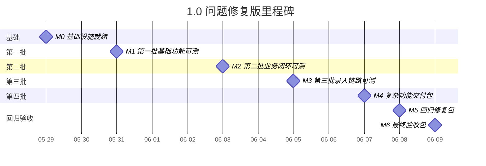

# 运营中台四端口 — 开发里程碑 1.0（问题修复版）

> 创建日期：2026-05-29
> 对齐范围：`doc/运营中台四端口-当前问题.md`
> 不对齐范围：`doc/运营中台四端口.md` 的完整四端口交付要求
> 团队：2 人全栈
> 对外口径：**6 天开发交付 + 2 天回归验收**

---

## 一、版本定位

1.0 只解决当前问题文档里的 11 项修复和补强，目标是：

- 不丢数据
- 不容易卡死
- 运营录入更快
- 销售和运营协同闭环
- 优秀作品能收藏沉淀

### 1.0 覆盖内容

- #1 销售端跟进看板修复
- #2 被动添加客资识别与反馈
- #3 运营端客资看板数据修复
- #4 客资录入防闪退与草稿保存
- #5 粘贴解析一键录入
- #6 作品广场权限过滤
- #7 批量导入
- #8 作品数据手动刷新
- #9 学习榜单与作品广场收藏
- #10 卡顿与稳定性修复
- #11 图片上传与表单解耦

### 1.0 不覆盖内容

- 教务端订单池、订单详情、进度跟进完整能力
- 销售端完整订单跟进
- 主管端员工管理、账号管理、完整分析看板
- 完整消息中心和异步导出

---

## 二、里程碑总览

| 里程碑 | 日期 | 目标 | 提测内容 |
|--------|------|------|---------|
| M0 | 2026-05-29 周五晚 | 基础设施就绪 | 建表、字段、角色、启动验证 |
| M1 | 2026-05-31 周日晚 | 第一批基础功能可测 | #3、#6、#11、#8 |
| M2 | 2026-06-03 周三晚 | 第二批业务闭环可测 | #1、#9 |
| M3 | 2026-06-05 周五晚 | 第三批录入链路可测 | #4、#5 |
| M4 | 2026-06-07 周日晚 | 第四批复杂功能可测，同时形成开发交付包 | #2、#7、#10 |
| M5 | 2026-06-08 周一晚 | 回归修复包 | P0/P1 修复 |
| M6 | 2026-06-09 周二晚 | 最终验收包 | 对照当前问题文档第八节逐项通过 |

---

## 三、甘特图

```text
日期:   05-29   05-30   05-31   06-01   06-02   06-03   06-04   06-05   06-06   06-07   06-08   06-09
      周五晚   周六全天 周日全天 周一晚   周二晚   周三晚   周四晚   周五晚   周六全天 周日全天 周一晚   周二晚

M0    ██
M1             ██████████████
M2                                     ████
M3                                                     ██████
M4                                                                     ██████████████
M5                                                                                           ████
M6                                                                                                    ████
```

### 3.1 Mermaid 甘特图



---

## 四、分批提测说明

| 批次 | 时间 | 需求点 | 测试重点 |
|------|------|-------|---------|
| Batch 0 | 2026-05-29 | 基础设施 | 启动、角色、表结构、关键字段 |
| Batch 1 | 2026-05-31 | #3、#6、#11、#8 | 看板口径、广场过滤、图片不清表单、手动刷新 |
| Batch 2 | 2026-06-03 | #1、#9 | 销售跟进闭环、收藏能力 |
| Batch 3 | 2026-06-05 | #4、#5 | 草稿保存、崩溃恢复、粘贴解析 |
| Batch 4 | 2026-06-07 | #2、#7、#10 | 被动添加、批量导入、稳定性 |
| Batch 5 | 2026-06-08 | 回归修复 | P0/P1 回归 |
| Batch 6 | 2026-06-09 | 最终验收 | 对照当前问题文档第八节 |

---

## 五、验收口径

### 1.0 必须满足

- 满足 `doc/运营中台四端口-当前问题.md` 第八节全部 11 项验收标准
- 运营端、销售端、主管端可正常使用
- 教务端至少登录和基础导航不报错

### 1.0 明确不承诺

- 满足 `doc/运营中台四端口.md` 第十四节完整验收标准
- 完整教务交付链路
- 完整导出、消息中心、主管管理体系

---

## 六、适合对外怎么说

> 本版本属于问题修复交付版，目标是先完成当前问题文档中的 11 项修复和补强，优先解决录入丢数据、销售跟进不闭环、批量录入能力不足、长时间使用卡顿等问题，先交付一个稳定可用的修复版本，不承诺完整四端口最终版范围。
