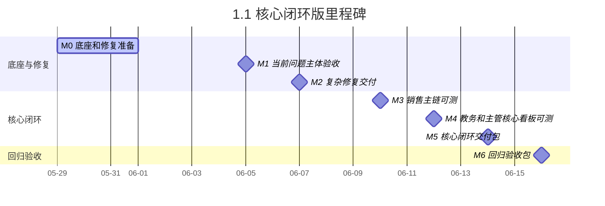

# 运营中台四端口 — 开发里程碑 1.1（核心闭环版）

> 创建日期：2026-05-29
> 对齐范围：`doc/运营中台四端口-当前问题.md` + `doc/运营中台四端口.md` 的核心主链
> 团队：2 人全栈
> 对外口径：**10-12 个开发日完成核心闭环交付，随后 2-3 天回归验收**

---

## 一、版本定位

1.1 不是只修问题，而是在 1.0 基础上把核心业务主链跑通：

- 运营录入作品/客资
- 分配销售并触发提醒
- 销售跟进、协同、标记成交
- 成交进入教务端订单池
- 教务记录进度和异常
- 主管端可看整体、分配、导出核心数据

### 1.1 覆盖内容

#### 1. 完整覆盖当前问题文档 11 项

- 即 1.0 全部内容

#### 2. 新增核心闭环能力

- 销售端：我的客资、待跟进、协同申请、订单跟进基础页、消息提醒基础页
- 教务端：订单池、订单详情、进度跟进、异常反馈基础页
- 主管端：总览、作品看板、客资看板、员工管理基础版、账号管理基础版
- 订单链路：销售标记成交后创建订单，订单进入教务端
- 通知链路：客资分配、协同申请、运营处理、添加通过、成交入教务
- 基础导出：作品、客资、订单导出

### 1.1 暂不完整覆盖

- 复杂分析看板
- 完整异步导出任务体系
- 完整消息中心细节体验
- 高级系统配置、数据字典、备份恢复、日志中心

---

## 二、里程碑总览

| 里程碑 | 日期 | 目标 | 提测内容 |
|--------|------|------|---------|
| M0 | 2026-05-29 至 2026-05-31 | 基础设施、数据库、当前问题修复底座就绪 | 新表、关键字段、角色、基础启动 |
| M1 | 2026-06-05 周五晚 | 当前问题主体验收通过 | #3、#6、#11、#8、#1、#9、#4、#5 |
| M2 | 2026-06-07 周日晚 | 复杂修复和录入效率能力交付 | #2、#7、#10 |
| M3 | 2026-06-10 周三晚 | 销售成交和通知主链可测 | 销售订单跟进、协同提醒、通知入库 |
| M4 | 2026-06-12 周五晚 | 教务接单和主管核心看板可测 | 教务端基础、主管总览/作品/客资看板 |
| M5 | 2026-06-14 周日晚 | 核心闭环交付包 | 运营->销售->教务主链串通 |
| M6 | 2026-06-16 周二晚 | 回归验收包 | P0/P1 修复、端到端回归 |

---

## 三、甘特图

```text
日期:   05-29   05-30   05-31   06-01   06-02   06-03   06-04   06-05   06-06   06-07   06-08   06-09   06-10   06-11   06-12   06-13   06-14   06-15   06-16
      周五晚   周六全天 周日全天 周一晚   周二晚   周三晚   周四晚   周五晚   周六全天 周日全天 周一晚   周二晚   周三晚   周四晚   周五晚   周六全天 周日全天 周一晚   周二晚

M0    ██████████████
M1                                     ██████████████
M2                                                                     ██████████████
M3                                                                                                             ████
M4                                                                                                                             ██████
M5                                                                                                                                                     ██████████████
M6                                                                                                                                                                                ██████
```

### 3.1 Mermaid 甘特图



---

## 四、分阶段交付重点

### M0-M2：先把当前问题文档做完

这一段目标是确保：

- 当前 11 项修复全部进入可测状态
- 运营端、销售端、主管端的当前痛点被解决

### M3：把销售主链补完整

新增能力：

- 销售标记成交
- 销售订单跟进基础字段
- 客资协同通知入库
- 基础消息提醒

### M4：把教务端和主管核心管理补上

新增能力：

- 教务订单池、订单详情、进度跟进、异常反馈
- 主管总览
- 主管作品看板、客资看板
- 员工管理、账号管理基础版

### M5-M6：做真正的端到端闭环验收

必须至少跑通这条链：

1. 运营录入客资并分配销售
2. 销售跟进并申请协同
3. 运营处理并通知销售
4. 销售标记成交并创建订单
5. 教务端接单并更新进度
6. 主管端可查看整体状态

---

## 五、验收口径

### 1.1 必须满足

- `doc/运营中台四端口-当前问题.md` 第八节全部通过
- `doc/运营中台四端口.md` 中以下范围通过：
  - 四端口可登录
  - 权限基本正确
  - 运营端核心页面可用
  - 销售跟进可用
  - 成交进入教务可用
  - 主管端核心看板可用
  - 作品、客资、订单基础导出可用

### 1.1 不建议直接承诺

- 完整满足 `doc/运营中台四端口.md` 第十四节全部验收项
- 完整分析看板和完整异步导出体系
- 所有消息提醒、性能和审计能力全部成体系

---

## 六、适合对外怎么说

> 本版本属于核心闭环交付版，会在修复当前问题文档 11 项的基础上，把运营、销售、教务、主管四端口的核心主链跑通，达到可上线使用的第一阶段正式版本，但不承诺完整覆盖最终版文档中的全部扩展能力。
