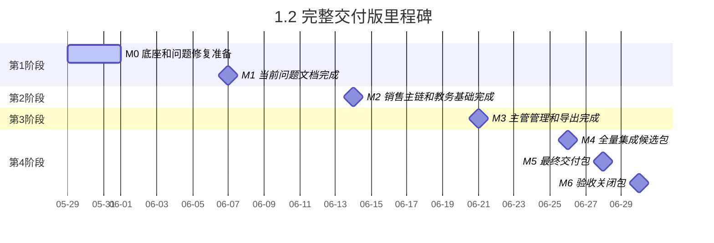

# 运营中台四端口 — 开发里程碑 1.2（完整交付版）

> 创建日期：2026-05-29
> 对齐范围：`doc/运营中台四端口.md` 完整交付要求
> 同时包含：`doc/运营中台四端口-当前问题.md` 全部修复项
> 团队：2 人全栈
> 对外口径：**3-4 周完成完整交付，随后 3-5 天联调回归验收**

---

## 一、版本定位

1.2 是唯一可以对外承诺“达到四端口最终版交付要求”的版本。

它不仅包含当前 11 项修复，还必须完整覆盖：

- 运营端完整使用体验
- 销售端完整跟进和订单跟进
- 教务端订单交付链路
- 主管端总览、看板、员工管理、账号管理、导出
- 四端口权限隔离
- 协同状态机
- 通知中心 + 实时提醒
- 订单、导出、通知等数据底座
- 性能、稳定性、导出、安全追踪

---

## 二、范围定义

### 1.2 必须覆盖

#### 1. 当前问题文档全部 11 项

- 即 1.0 全部范围

#### 2. 运营端完整范围

- 今日任务
- 运营排行榜
- 学习榜单
- 个人看板
- 作品录入
- 客资录入
- 客资看板
- 我的作品
- 作品广场
- 账号管理

#### 3. 销售端完整范围

- 我的客资
- 待跟进
- 客资详情
- 协同申请
- 订单跟进
- 消息中心

#### 4. 教务端完整范围

- 订单池
- 订单详情
- 进度跟进
- 节点提醒
- 异常反馈
- 导出

#### 5. 主管端完整范围

- 总览
- 运营排行榜
- 个人看板选择器
- 作品看板
- 客资看板
- 员工管理
- 账号管理
- 基础分析看板

#### 6. 平台底座能力

- 协同状态机
- 通知表和消息中心
- 订单表和订单跟进记录
- 导出任务表
- 分页、筛选、排序、权限
- Excel 导出
- 实时提醒和离线补看

---

## 三、里程碑总览

| 里程碑 | 日期 | 目标 | 提测内容 |
|--------|------|------|---------|
| M0 | 2026-05-29 至 2026-05-31 | 数据底座、角色权限、问题修复底座就绪 | 关键表、字段、角色、基础启动 |
| M1 | 2026-06-07 周日晚 | 当前问题文档 11 项全部完成 | 1.0 全部范围 |
| M2 | 2026-06-14 周日晚 | 销售主链 + 教务基础 + 通知基础完成 | 销售跟进、订单创建、教务接单、基础提醒 |
| M3 | 2026-06-21 周日晚 | 主管完整管理和导出能力完成 | 总览、看板、员工管理、账号管理、导出 |
| M4 | 2026-06-26 周五晚 | 全量集成候选包 | 四端口端到端联调、性能优化 |
| M5 | 2026-06-28 周日晚 | 最终交付包 | 对照四端口文档第十四节验收 |
| M6 | 2026-06-30 周二晚 | 验收关闭包 | P0/P1 关闭、问题清零 |

---

## 四、甘特图

```text
阶段:   第1周                    第2周                    第3周                    第4周
日期:   05-29~05-31             06-01~06-07             06-08~06-14             06-15~06-21             06-22~06-28             06-29~06-30

M0      ██████
M1                              ████████████
M2                                                      ████████████
M3                                                                                              ████████████
M4                                                                                                                      ██████
M5                                                                                                                                      ████
M6                                                                                                                                                     ████
```

### 4.1 Mermaid 甘特图



---

## 五、分阶段说明

### M0：先把基础底座搭稳

包括：

- 当前问题修复必须依赖的表和字段
- 订单、通知、导出相关表
- 权限角色和基础数据可见范围
- 基础分页、基础筛选、关键索引

### M1：先拿下当前问题文档

这一步结束后，必须达到：

- `doc/运营中台四端口-当前问题.md` 第八节全部通过
- 当前系统不再存在明显阻断问题

### M2：打通销售到教务的主链

这一段必须跑通：

1. 运营录入客资并分配销售
2. 销售跟进和协同
3. 销售标记成交
4. 订单自动进入教务端
5. 教务端开始跟进

### M3：补齐主管端和导出能力

必须完成：

- 主管总览
- 主管作品看板和客资看板
- 员工管理、账号管理
- 个人看板选择器
- 作品、客资、排行榜、订单导出

### M4-M6：做完整交付验收

这一步不再只是单功能测试，而是完整对照：

- 四端口可用
- 权限正确
- 排行榜可用
- 作品和客资录入可用
- 销售跟进可用
- 教务订单可用
- 导出可用
- 消息可用
- 性能达标
- 数据安全可追踪

---

## 六、验收口径

### 1.2 必须满足

- `doc/运营中台四端口-当前问题.md` 第八节全部通过
- `doc/运营中台四端口.md` 第十四节全部通过

### 1.2 交付后应具备

- 四端口均可按角色登录并工作
- 权限隔离正确
- 运营、销售、教务、主管主链全部跑通
- 作品、客资、订单、排行榜均可按权限导出
- 消息提醒既实时可见，也能离线补看
- 列表分页、性能、并发、稳定性达到文档要求

---

## 七、适合对外怎么说

> 本版本属于完整交付版，目标是完整对齐四端口最终版开发文档，不只是修复当前问题，还要把四端口、权限、订单、消息、导出和性能能力全部建设到位。只有这个版本适合对外承诺“达到最终交付要求”。
