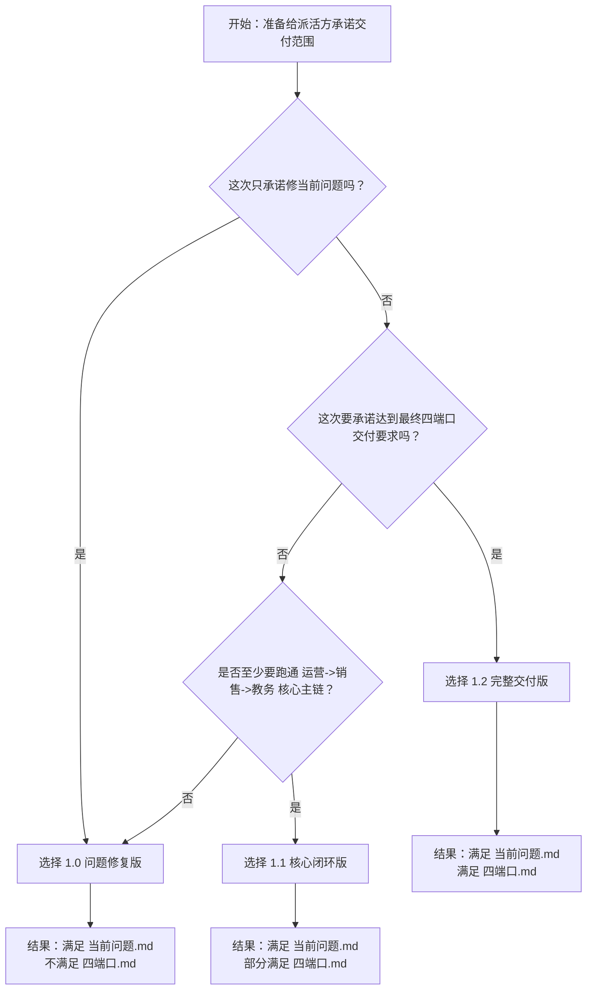

# 运营中台四端口 — 多版本交付建议

> 创建日期：2026-05-29
> 关联文档：`运营中台四端口-当前问题.md`、`运营中台四端口.md`、`需求工时评估.md`
> 适用对象：派活方、项目负责人、测试负责人

---

## 一、先说结论

这次不能只给一份里程碑，因为你们手上其实有两套范围：

- `doc/运营中台四端口-当前问题.md`
  这是 **11 个问题修复和功能补强项**，重点是修当前系统能用性、协同闭环和稳定性。
- `doc/运营中台四端口.md`
  这是 **完整四端口最终交付要求**，范围明显更大，包含运营端、销售端、教务端、主管端、消息提醒、订单流转、导出、权限、性能等完整能力。

因此建议拆成 3 个版本管理：

| 版本 | 适用承诺 | 覆盖范围 | 是否满足 `当前问题.md` | 是否满足 `四端口.md` |
|------|---------|---------|------------------------|----------------------|
| 1.0 问题修复版 | 先把现有问题修好，尽快可用 | 仅覆盖 11 个修复项 | 是 | 否 |
| 1.1 核心闭环版 | 主业务链先跑通 | 覆盖 11 个修复项 + 销售成交 + 教务接单 + 主管核心管理 | 是 | 部分满足 |
| 1.2 完整交付版 | 对外承诺“达到四端口最终交付要求” | 完整对齐四端口文档 | 是 | 是 |

### 1.1 版本选择流程图

---

## 二、每个版本解决什么问题

### 1.0 — 问题修复版

对应文档：[开发里程碑-1.0-问题修复版.md](/mnt/hgfs/webstormProjects/xhsmedium/doc/开发里程碑-1.0-问题修复版.md)

适合这种说法：

- 先把当前最痛的 Bug 和缺失功能补齐
- 先保证运营端、销售端、主管端能稳定跑
- 先满足当前反馈和验收底线

覆盖重点：

- 草稿保存、防闪退、图片不清表单
- 客资看板统计修复
- 销售跟进闭环、被动添加识别
- 粘贴解析、批量导入、收藏、手动刷新
- 长时间使用稳定性修复

不覆盖：

- 教务端订单池/交付跟进完整能力
- 销售端完整订单跟进
- 主管端员工管理/账号管理/全量导出
- 通知中心、异步导出、完整消息体系

### 1.1 — 核心闭环版

对应文档：[开发里程碑-1.1-核心闭环版.md](/mnt/hgfs/webstormProjects/xhsmedium/doc/开发里程碑-1.1-核心闭环版.md)

适合这种说法：

- 不只修问题，还要把“运营录入 -> 销售跟进 -> 成交 -> 教务接单”主链跑通
- 主管端要具备基本的全局查看、分配、导出能力
- 可以作为第一阶段正式上线版本

比 `1.0` 新增：

- 销售端订单跟进基础版
- 教务端订单池、订单详情、进度跟进基础版
- 主管端总览、作品看板、客资看板、员工/账号基础管理
- 基础通知入库 + 端内提醒
- 作品/客资/订单基础导出

仍不完全覆盖：

- 完整分析看板
- 完整消息中心体验和全部提醒类型
- 异步导出任务全流程
- 主管高级系统配置、日志、备份恢复

### 1.2 — 完整交付版

对应文档：[开发里程碑-1.2-完整交付版.md](/mnt/hgfs/webstormProjects/xhsmedium/doc/开发里程碑-1.2-完整交付版.md)

适合这种说法：

- 对外明确承诺“达到 `doc/运营中台四端口.md` 交付要求”
- 四端口都要可用
- 权限、导出、消息、订单、性能都要成体系

这是唯一可以对齐 `doc/运营中台四端口.md` 第十四节最终验收标准的版本。

---

## 三、推荐怎么选

### 如果你现在要快速派活并控制承诺风险

推荐优先级：

1. **外部只承诺修现有问题**：选 `1.0`
2. **外部承诺核心业务能跑通**：选 `1.1`
3. **外部承诺达到最终交付要求**：只能选 `1.2`

### 不建议的说法

下面这两种说法容易出问题：

- 拿 `1.0` 的 6 天排期，对外承诺“达到四端口最终版交付要求”
- 拿 `当前问题.md` 的 11 项修复，去替代 `四端口.md` 的完整范围

这两种都会导致后面范围争议。

---

## 四、建议对外口径

### 如果选 1.0

> 本阶段目标是先完成当前问题文档中的 11 项修复和补强，优先解决录入丢数据、销售跟进不闭环、批量录入不足和长时间使用卡顿等问题，先交付一个稳定可用的修复版本。

### 如果选 1.1

> 本阶段目标是在完成当前问题修复的基础上，把运营、销售、教务、主管的核心业务主链跑通，先形成可上线运行的核心闭环版本。

### 如果选 1.2

> 本阶段目标是完整对齐四端口最终版开发文档，按最终交付要求建设四端口、权限、消息、订单、导出和性能能力，作为完整交付版本。

---

## 五、文档清单

- [开发里程碑-1.0-问题修复版.md](/mnt/hgfs/webstormProjects/xhsmedium/doc/开发里程碑-1.0-问题修复版.md)
- [开发里程碑-1.1-核心闭环版.md](/mnt/hgfs/webstormProjects/xhsmedium/doc/开发里程碑-1.1-核心闭环版.md)
- [开发里程碑-1.2-完整交付版.md](/mnt/hgfs/webstormProjects/xhsmedium/doc/开发里程碑-1.2-完整交付版.md)
