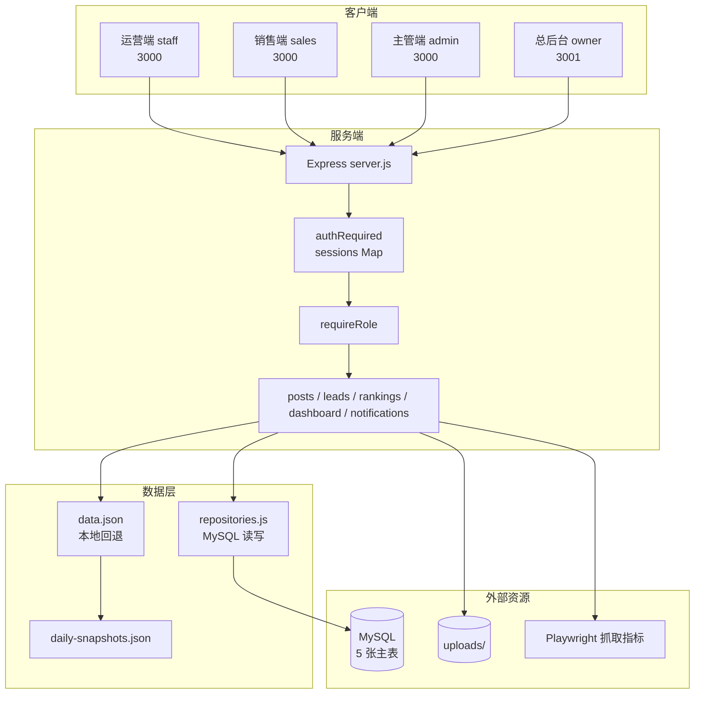
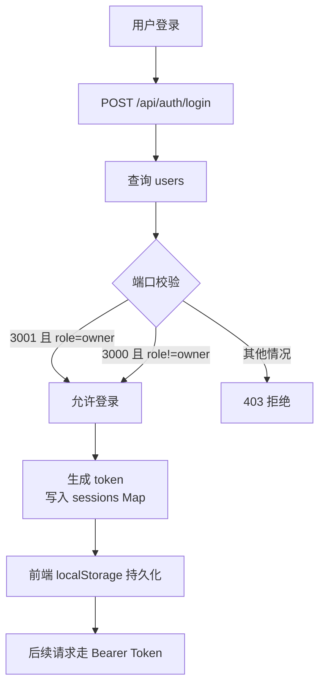
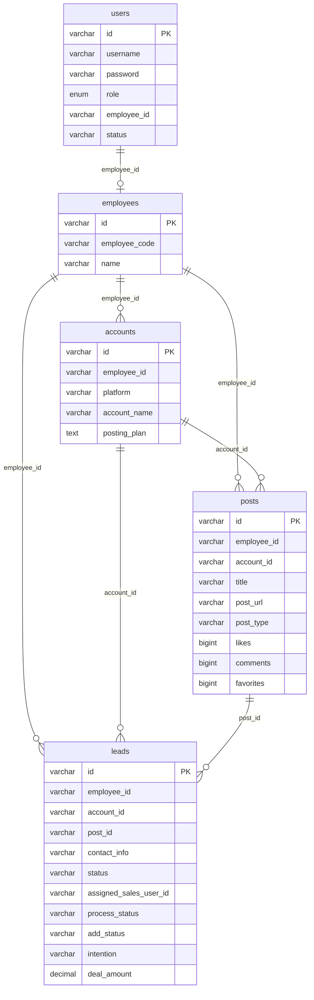
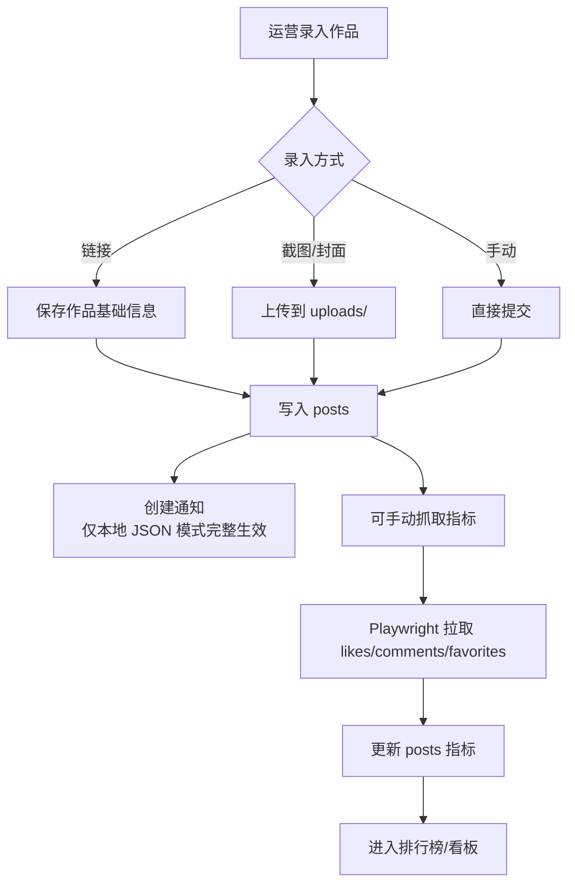
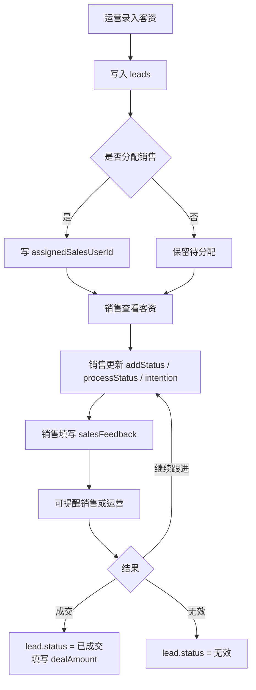
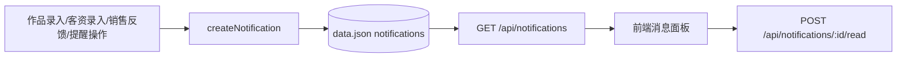
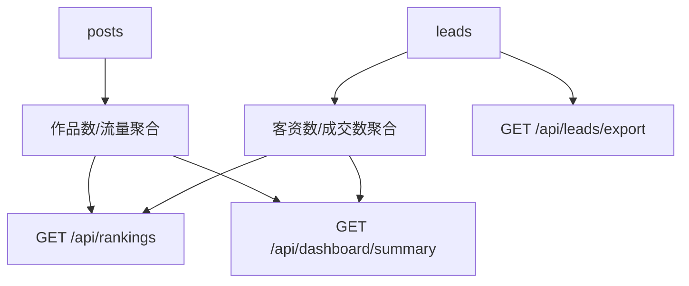

# 运营中台四端口 — 系统业务流程图（Mermaid 版，当前实现）

> 更新日期：2026-05-29
> 依据：当前仓库代码现状（`server.js`、`repositories.js`、`schema.sql`、`public/app.js`）
> 目的：描述现在已经实现的流程，不代表最终交付目标

---

## 一、当前实现边界

当前代码的重点是：

- 运营端、销售端、主管端共用 `3000` 端口
- `owner` 总后台走 `3001` 端口
- 以 `users / employees / accounts / posts / leads` 为主数据
- 作品、客资、排行榜、通知面板、基础导出、Playwright 抓取已存在
- 教务端、订单表、异步导出、WebSocket 实时推送尚未形成完整能力

### 当前明显未完整实现的目标能力

- 独立教务端角色与页面
- `orders / order_follow_records / exports / notifications` 数据表
- 成交后自动进入教务订单池
- Socket.IO 实时提醒
- 异步导出任务流

---

## 二、当前系统架构

---

## 三、当前认证与端口隔离

### 当前权限特征

- `staff` 只能按自己的 `employeeId` 看本人数据
- `admin / owner` 通常可看全量
- `sales` 当前并没有完整做到“只看 assignedSalesUserId 的客资”

---

## 四、当前数据模型

---

## 五、当前作品流程

---

## 六、当前客资流程

### 当前实现限制

- 成交后仍停留在 `leads` 记录中
- 不会自动创建订单
- 不会进入教务端订单池

---

## 七、当前通知流

### 当前实现限制

- 通知主要是轮询拉取，不是 WebSocket 实时推送
- 通知持久化是本地 JSON 逻辑，不是正式 `notifications` 表
- MySQL 模式下通知链路并不完整对齐本地模式

---

## 八、当前排行榜与导出

### 当前实现限制

- 导出主要是客资导出
- 不是最终文档要求的完整异步 Excel 导出体系

