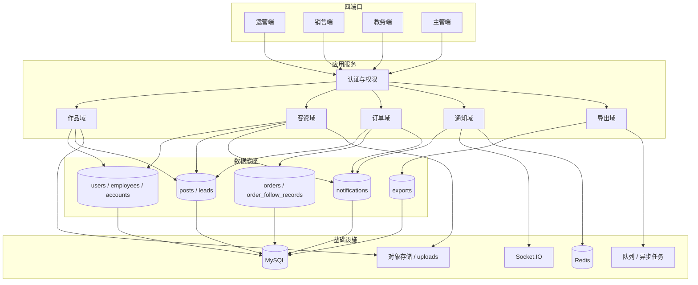
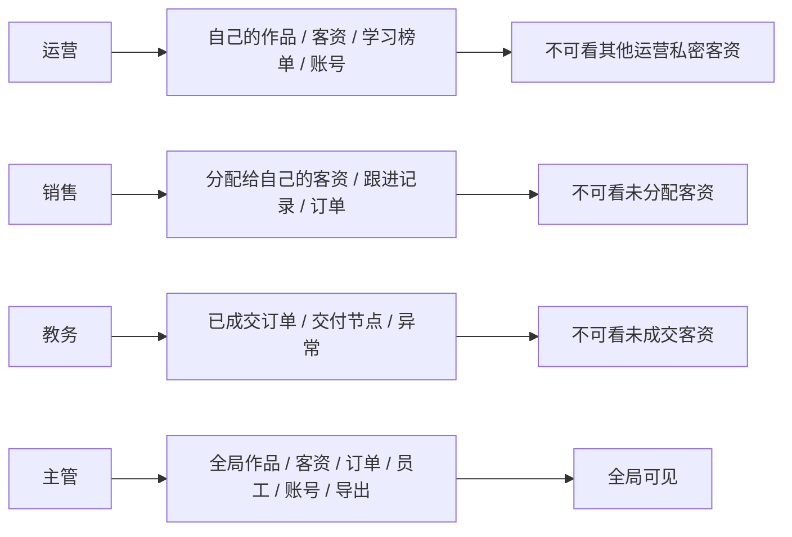
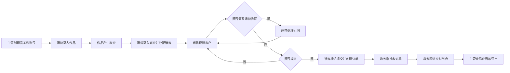
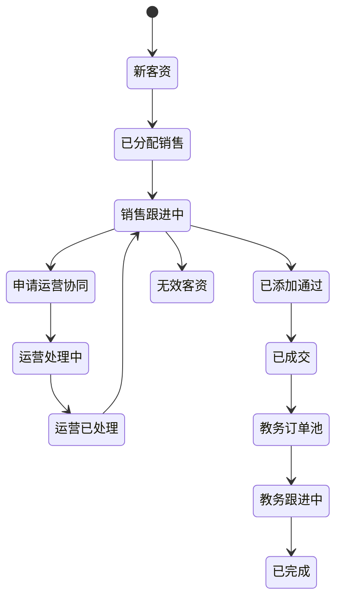
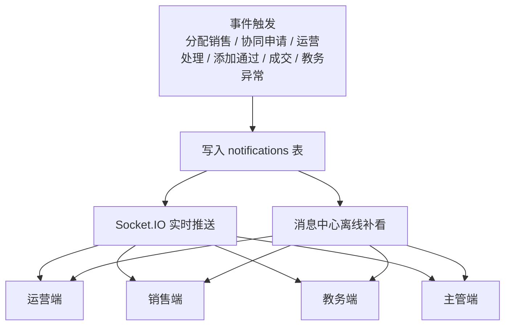
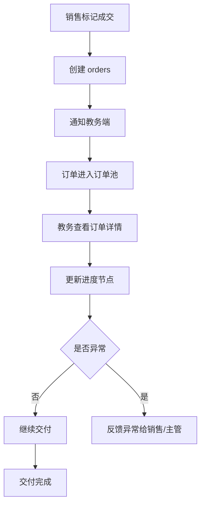
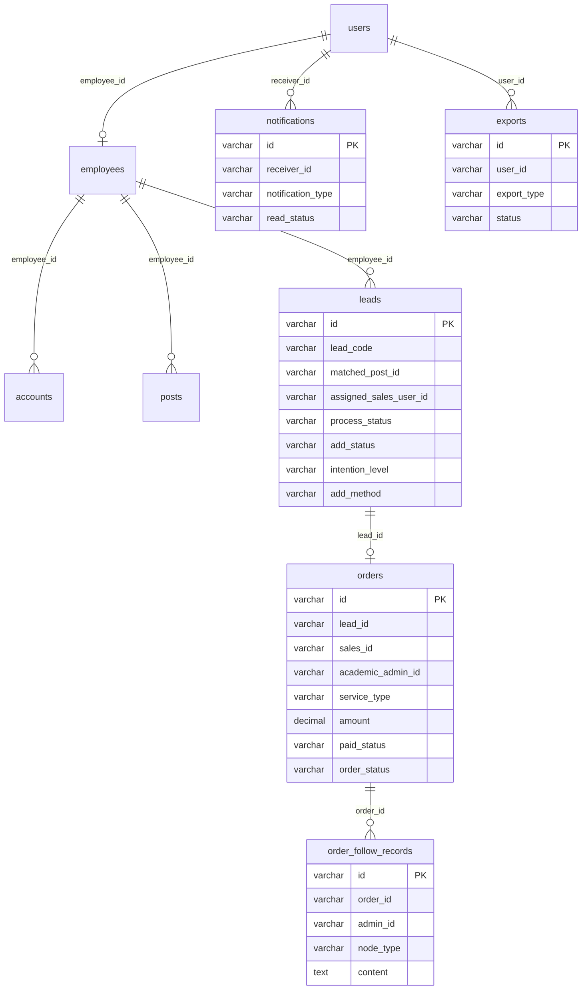
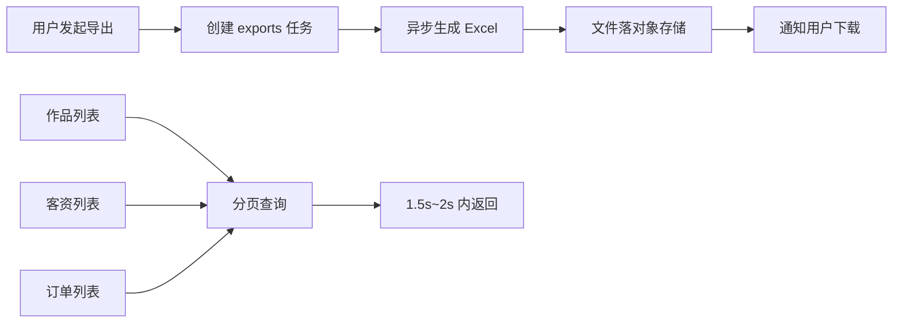

# 运营中台四端口 — 系统业务流程图（Mermaid 版，目标交付）

> 更新日期：2026-05-29
> 依据：`doc/运营中台四端口.md`
> 目的：描述最终应交付的四端口目标态，不代表当前代码已全部实现

---

## 一、目标交付边界

目标态必须严格按四端口设计：

- 运营端
- 销售端
- 教务端
- 主管端

### 目标原则

- 不再单独保留 `owner` 第五端口
- 四端口共用同一套数据底座，但页面和权限分离
- 所有跨端协作要有状态和消息提醒
- 成交后必须进入订单与教务跟进链路
- 所有列表支持筛选、分页、排序和 Excel 导出

---

## 二、目标系统架构

---

## 三、目标角色权限

---

## 四、目标核心业务闭环

---

## 五、目标客资协同状态机

---

## 六、目标通知体系

---

## 七、目标订单与教务流程

---

## 八、目标数据底座

---

## 九、目标导出与性能要求

### 目标要求

- 导出应走后端异步任务，不是前端一次性拉全量
- 列表查询必须分页
- 通知必须同时支持实时推送和离线补看
- 并发按 50-100 人同时在线设计

