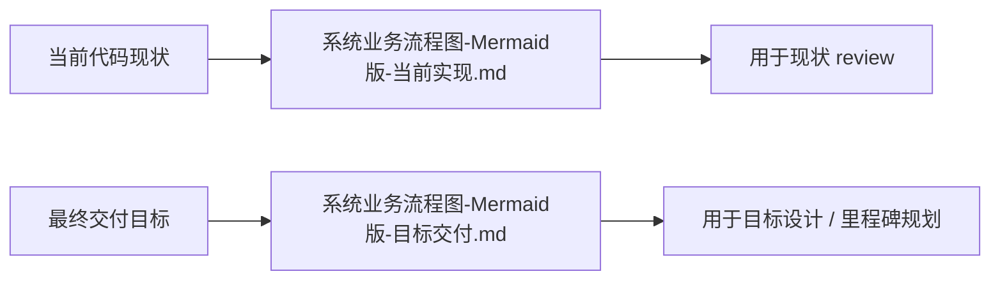

# 运营中台四端口 — 系统业务流程图（Mermaid 版）

> 更新日期：2026-05-29
> 关联文档：`运营中台四端口.md`、`运营中台四端口-当前问题.md`

---

## 说明

原来的单份 Mermaid 文档同时混用了：

- 当前代码真实实现
- 最终四端口目标设计

这会让开发、测试和派活方误判范围。现在正式拆成 2 份业务文档：

- [系统业务流程图-Mermaid版-当前实现.md](/mnt/hgfs/webstormProjects/xhsmedium/doc/系统业务流程图-Mermaid版-当前实现.md)
  只描述当前仓库代码已经具备的流程和结构。
- [系统业务流程图-Mermaid版-目标交付.md](/mnt/hgfs/webstormProjects/xhsmedium/doc/系统业务流程图-Mermaid版-目标交付.md)
  只描述 [运营中台四端口.md](/mnt/hgfs/webstormProjects/xhsmedium/doc/运营中台四端口.md) 定义的目标交付态。

当前这个文件仅保留为导航说明页，不再承载实际业务流程内容，因此不算第 3 份业务流程文档。

---

## 怎么用

- 评估“现在代码做到哪了”时，看“当前实现版”
- 评估“最终应该交付成什么样”时，看“目标交付版”
- 做 gap 分析时，两份文档对照看

---

## 快速结论

