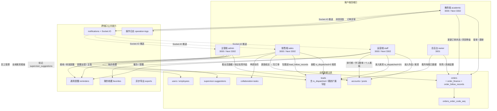
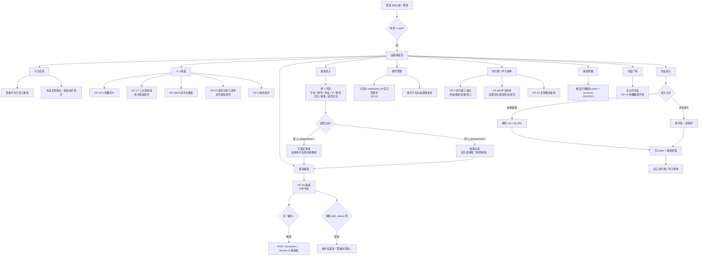
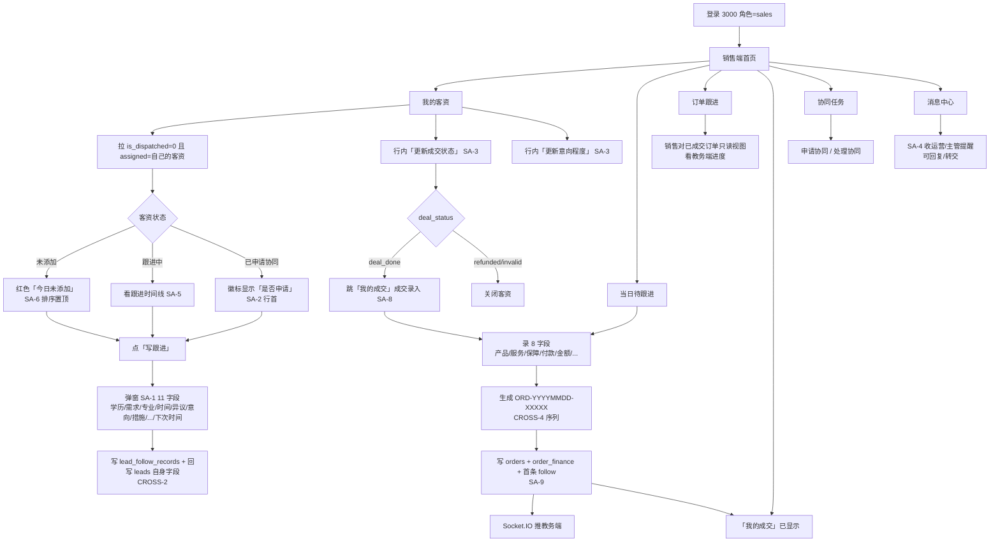
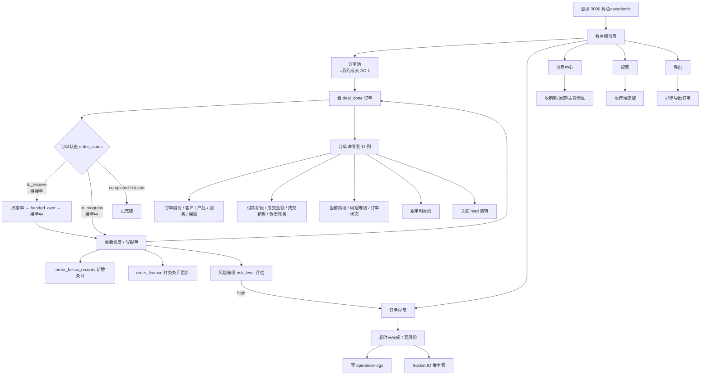
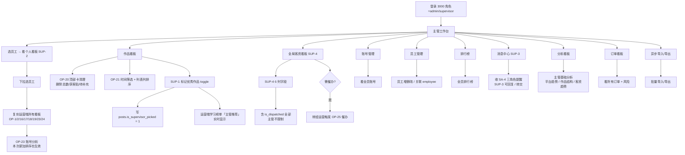
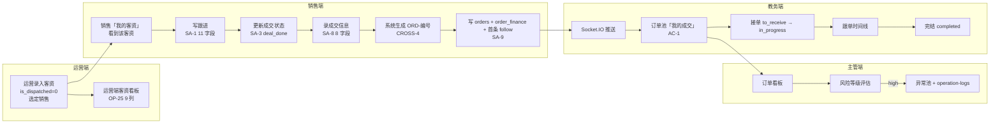
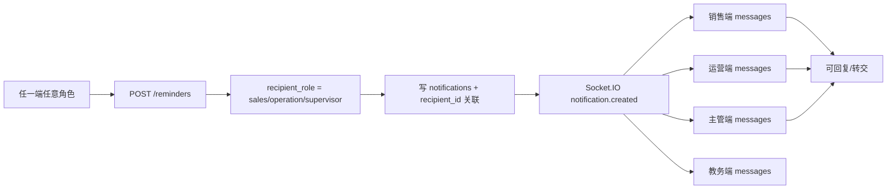
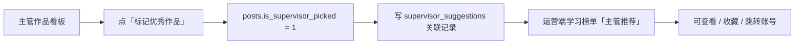
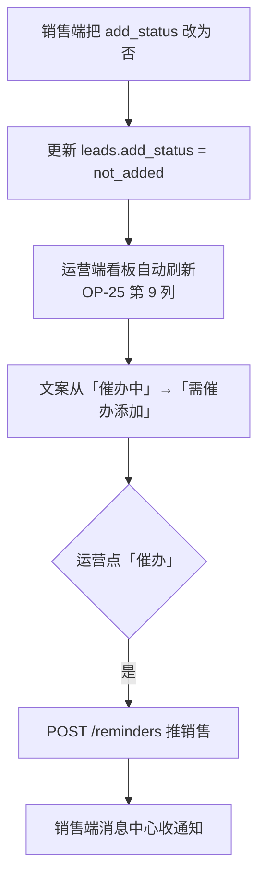
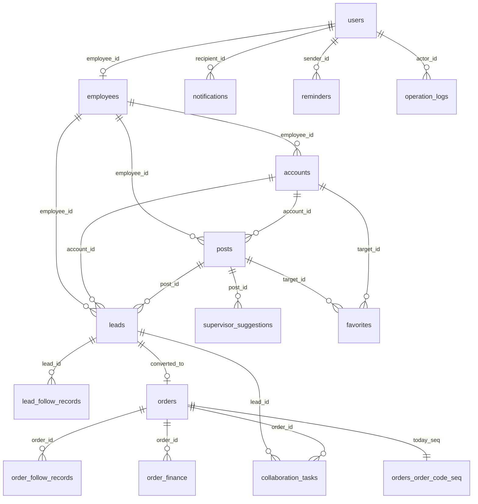

# 四端口完整业务流程梳理（v1.3 当前实现版）

> 生成日期：2026-06-04
> 依据：`v1.3-四端口迭代任务清单.md`、`v1.3-测试结果-*.md`、`系统业务流程图-Mermaid版-当前实现.md`、四个端口 `frontend/src/app/{operation,sales,academic,admin}` 实际页面树 + 后端 NestJS controllers 清单
> 目的：把"运营 → 销售 → 教务 → 主管"四端口在 v1.3 的端到端业务流串成一份可读文档，供排障 / 培训 / 后续迭代参照

---

## 一、四端口全景图



### 1.1 端口与角色矩阵（v1.3，2026-06-04）

| 端口 | 角色 role | 入口 | 主要菜单（实际页面） |
| --- | --- | --- | --- |
| 3001 总后台 | owner | http://localhost:3001 | 仅 owner 可见，系统设置/财务 |
| 3000 统一登录 | sales / academic / staff / admin / supervisor | http://localhost:3003 (3302 被 Next 占) | 见下 |
| 3302 新前端 | 同上 | http://localhost:3302 | 同上（Next.js 版） |

> L1/L2/L3 三层防御：L1=Express 中间件端口隔离、L2=auth.service.login 拒绝、L3=auth.guard.assertRolePortMatch

### 1.2 后端 NestJS 模块清单（22 个 controller）

| 模块 | 路径前缀 | 用途 |
| --- | --- | --- |
| auth | `/auth` | 登录 / 登出 / 注册 |
| accounts | `/accounts` | 账号管理（运营隔离） |
| posts | `/posts` | 作品录入 / 抓取 / 排序 |
| leads | `/leads` | 客资 CRUD（运营 / 销售 / 主管） |
| leads-parser | `/leads` | 客资批量导入 |
| lead-drafts | `/lead-drafts` | 客资草稿 |
| sales | `/sales` | 销售端销售专属接口 |
| dashboard | `/dashboard` | 个人看板 / 主管看板 / 账号分析 |
| rankings | `/rankings` | 排行榜（学习榜单） |
| analytics | `/analytics` | 主管基础分析 |
| favorites | `/favorites` | 我的收藏（帖子 + 账号） |
| reminders | `/reminders` | 三角色互相提醒（CROSS-3） |
| notifications | `/notifications` | 站内消息 + Socket.IO |
| supervisor-suggestions | `/supervisor-suggestions` | 主管建议 / 主管推荐 |
| collaboration-tasks | `/collaboration-tasks` | 跨端口协同任务 |
| orders | `/orders` | 订单（成交 → 教务） |
| exports | `/exports` | 异步导出 |
| imports | `/imports` | 异步导入 |
| operation-logs | `/operation-logs` | 关键操作审计 |
| employees | `/employees` | 员工管理 |
| users | `/users` | 用户 / 角色 |
| enums | `/enums` | 枚举字典 |
| parser / tools | `/parser` `/tools` | 工具类 |
| uploads | `/uploads` | 文件上传（multer） |

---

## 二、运营端业务流程（staff / 3000、3302）

### 2.1 菜单结构（实际页面树）

```
operation/
├── page.tsx                       # 总览（今日任务 + 个人看板）
├── today-tasks/                   # OP-6 今日任务
├── dashboard/                     # OP-1/2/3/16/17/18/19/23/24
│   ├── page.tsx                   # 概览入口
│   └── account-analysis/          # OP-23 账号分析（本次新加排序）
├── posts/                         # 作品录入（OP-12 去除截图）
├── leads/                         # 客资录入 + 看板
│   ├── new/                       # OP-5 客资录入（7 字段 + 是否分流）
│   └── page.tsx                   # OP-25 客资看板
├── accounts/                      # 账号管理（OP-15 只看自己）
├── rankings/                      # 运营排行榜
│   └── study/                     # OP-8/9/10 学习榜单 + 主管推荐
├── favorites/                     # OP-11 我的收藏
├── gallery/                       # OP-14 作品广场（看全员）
├── collaboration/                 # 协同任务
├── messages/                      # 消息中心
├── exports/                       # 异步导出
└── imports/                       # 异步导入
```

### 2.2 运营端核心业务流（端到端）



### 2.3 关键约束（v1.3 强约束）

| 编号 | 约束 | 实现位置 |
| --- | --- | --- |
| OP-3 | 运营端只看到自己的数据 | `getPersonalOverview` 等接口用 `req.user.employeeId` 过滤 |
| OP-5 | 未分流销售必选；已分流不出现在销售端 | `leads.is_dispatched` + sales 端 `WHERE is_dispatched=0` |
| OP-11 | 我的收藏支持账号 | `favorites.target_type IN ('post','account')` |
| OP-12 | 作品录入不再有"上传截图" | 前端 `posts/new` 入口只剩"链接/手动" |
| OP-15 | 账号管理只显示自己 | `accounts.controller` 按 `employeeId` 过滤 |
| OP-16 | 流量 = likes + comments + favorites（不含分享） | `dashboard.service.ts` 多处口径统一 |
| OP-22 | 作品详情封面图置顶 | `frontend/src/shared/components/post-detail/*` |
| OP-25 | 看板 9 列字段，催办与 add_status 联动 | `leads.page.tsx` + `reminders.controller` |

---

## 三、销售端业务流程（sales / 3000、3302）

### 3.1 菜单结构（实际页面树）

```
sales/
├── page.tsx                       # 销售端总览
├── leads/                         # SA-2 我的客资
│   ├── page.tsx                   # SA-2 列表（13 列）
│   └── [id]/                      # 客资详情（SA-5 跟进时间线）
├── deals/                         # SA-7 我的成交
├── orders/                        # SA-11 订单跟进（销售只读）
├── followups/                     # SA-11 当日待跟进
├── today-followups/               # SA-11 当日待跟进快捷入口
├── collaboration/                 # 协同任务
└── messages/                      # 消息中心 + SA-4 三角色提醒
```

### 3.2 销售端核心业务流



### 3.3 销售端关键约束

| 编号 | 约束 | 实现位置 |
| --- | --- | --- |
| CROSS-1 | 所有销售统计接口 `WHERE is_dispatched = 0` | `sales.controller.ts` / `leads.controller.ts` |
| SA-1 | 写跟进独立按钮 + 11 字段回写 | `frontend/src/app/sales/leads/[id]/page.tsx` 跟进弹窗 |
| SA-2 | 列表 13 列、不显示来源/平台/账号/IP/运营员工 | 列表组件 column 配置 |
| SA-3 | 两个独立编辑按钮（成交 / 意向） | 行内 action |
| SA-4 | 三角色互相提醒 | `POST /reminders` |
| SA-5 | 跟进时间线从列表移到详情 | 列表只显示条数；详情展开 |
| SA-6 | 当天未添加的客资红色标签 | 列表行 CSS + 排序权重 |
| SA-7 | 新增"我的成交"菜单 | `sales/deals/page.tsx` |
| SA-8 | 成交录入 8 字段 | `deals` 详情页表单 |
| SA-9 | 自动写 orders + 通知教务 | `orders.service.createFromLead` + Socket.IO |
| SA-10 | 删除"被动添加"菜单 | 菜单文件已删 |
| SA-11 | 4 个一级菜单 | layout.tsx 调整 |

---

## 四、教务端业务流程（academic / 3000、3302）

### 4.1 菜单结构（实际页面树）

```
academic/
├── page.tsx                       # 教务端首页（订单池概览）
├── orders/                        # AC-1 订单池 / 我的成交
│   ├── page.tsx                   # 订单列表
│   └── [id]/                      # 订单详情（含 8 字段 + 跟单时间线）
├── abnormal/                      # 订单异常（超时 / 风险）
├── exports/                       # 异步导出
├── messages/                      # 消息中心
└── reminders/                     # 跨端提醒接收
```

### 4.2 教务端核心业务流



### 4.3 教务端关键约束

| 编号 | 约束 | 实现位置 |
| --- | --- | --- |
| AC-1 | 「我的成交」= deal_done 订单池 | `academic/orders/page.tsx` 拉 orders.deal_status |
| SA-9 上游 | 销售成交 → 自动落 orders + 通知 | `orders.service.ts` |
| CROSS-4 | 订单编号 `ORD-YYYYMMDD-XXXXX` | `orders_order_code_seq` 序列表 / Redis 原子自增 |
| 跟单 | order_follow_records 时间线 | `orders/[id]/page.tsx` 详情 |
| 风险联动 | 风险等级 high → 进异常池 | `academic/abnormal/page.tsx` |

---

## 五、主管端业务流程（admin / 3000、3302）

### 5.1 菜单结构（实际页面树）

```
admin/                                  # 主管端
├── page.tsx                            # 主管工作台
├── personal/                           # SUP-2 主管端个人看板
│   └── [employeeId]/                   # 选员工 → 看该员工看板
├── posts/                              # 作品看板（OP-20/21）
│   └── page.tsx                        # 时间筛选 + 排序
├── accounts/                           # 账号管理（看全员）
├── leads/                              # 主管全局客资看板（SUP-4）
├── rankings/                           # 主管排行榜
├── orders/                             # 主管订单看板
├── employees/                          # 员工管理
├── messages/                           # 消息中心（SUP-3）
├── analytics/                          # 主管分析看板
├── collaboration/                      # 跨端协同
├── imports/                            # 异步导入
├── exports/                            # 异步导出
└── dashboard/                          # 主管总览
```

### 5.2 主管端核心业务流



### 5.3 主管端关键约束

| 编号 | 约束 | 实现位置 |
| --- | --- | --- |
| SUP-1 | 标记优秀作品 toggle | `admin/posts/page.tsx` 行内按钮 → `POST /posts/:id/pick` |
| SUP-2 | 主管端个人看板同步运营端 | `PersonalDashboardBoard` 接受 `employeeId` prop |
| SUP-3 | 接收三角色提醒 | `notifications` 收件箱 |
| SUP-4 | 全局客资看板 6 列、不显示催办 | `admin/leads/page.tsx` 列表配置 |
| OP-20 | 删除"作品总数/获客贴数/待补充建议"3 张卡 | 顶部 `OVERVIEW_CARDS` 已删 |
| OP-21 | 时间筛选 + 列排序 | `admin/posts/page.tsx` |
| 总后台 | owner 仍强制 3001 | L1/L2/L3 三层防御 |

---

## 六、跨端口核心业务流（端到端）

### 6.1 运营 → 销售 → 教务 主链路



### 6.2 跨端口提醒链路（CROSS-3 / OP-13 / SA-4 / SUP-3）



### 6.3 主管推荐链路（OP-10 / SUP-1）



### 6.4 催办与 add_status 联动（OP-13 / OP-25 / SA-6）



---

## 七、数据流转核心表

### 7.1 主表关系（v1.3）



### 7.2 关键字段（v1.3 新增）

| 表 | 新增字段 | 用途 | 迁移 |
| --- | --- | --- | --- |
| leads | `is_dispatched` | CROSS-1 分流开关 | M25 |
| leads | `client_degree` / `client_requirement` / `client_major_research` / `client_time_requirement` / `objection_point` / `follow_action` / `follow_action_at` | CROSS-2 跟进扩展 | M26 |
| leads | `intention_level` | SA-3 意向程度（已存在） | — |
| posts | `is_supervisor_picked` / `supervisor_picked_at` | SUP-1 主管推荐 | M27 |
| orders | `order_code` / `deal_status` / `order_status` / `risk_level` / `product_type` / `service_type` / `guarantee_type` | SA-8 成交 + 教务 | M28 |
| orders | `handover_status` | 销售→教务交接 | M28 |
| orders_order_code_seq | 自增序列表 | CROSS-4 订单编号 | M28 |
| favorites | `target_type` 扩展 | CROSS-5 账号收藏 | M25 |

---

## 八、典型业务场景走查

### 8.1 场景 A：运营录客资 → 销售成交 → 教务接单

| 步骤 | 端口 | 角色 | 动作 | 数据落点 | 通知 |
| --- | --- | --- | --- | --- | --- |
| 1 | 3000 运营端 | staff | 录客资，is_dispatched=0，选销售张三 | `leads` | Socket.IO 推销售 |
| 2 | 3000 销售端 | sales | 看到新客资，点"写跟进"，填 11 字段 | `lead_follow_records` + `leads` 回写 | — |
| 3 | 3000 销售端 | sales | 多次跟进后点"更新成交状态" → deal_done | `leads.deal_status` | — |
| 4 | 3000 销售端 | sales | 跳"我的成交"，填 8 字段（产品/服务/保障/付款/金额） | 触发 `orders` 创建 | 系统生成 `ORD-YYYYMMDD-XXXXX` |
| 5 | 3000 教务端 | academic | 收到 Socket.IO，"我的成交"看到新订单 | `orders` + `order_finance` + 首条 follow | — |
| 6 | 3000 教务端 | academic | 点接单，order_status: to_receive → in_progress | `orders.order_status` | — |
| 7 | 3000 教务端 | academic | 跟单，填时间线 | `order_follow_records` | — |
| 8 | 3000 教务端 | academic | 完结，order_status: completed | `orders` | Socket.IO 推销售+主管 |
| 9 | 3000 主管端 | admin | 订单看板看到全流程；风险 high 时进异常池 | `operation_logs` | — |

### 8.2 场景 B：主管标记优秀作品 → 运营学习榜单看到

| 步骤 | 端口 | 角色 | 动作 | 数据 |
| --- | --- | --- | --- | --- |
| 1 | 3000 主管端 | admin | 作品看板列表，点"标记优秀作品" | `posts.is_supervisor_picked = 1` |
| 2 | — | — | 系统写关联 | `supervisor_suggestions` |
| 3 | 3000 运营端 | staff | 学习榜单"主管推荐"板块实时出现该作品 | 只读展示 |
| 4 | 3000 运营端 | staff | 可点开看作品详情 / 跳账号 / 收藏 | `favorites` |

### 8.3 场景 C：销售 add_status=否 → 运营催办

| 步骤 | 端口 | 角色 | 动作 | 数据 |
| --- | --- | --- | --- | --- |
| 1 | 3000 销售端 | sales | 客资详情改 add_status=否 | `leads.add_status = not_added` |
| 2 | 3000 运营端 | staff | 看板自动刷新，"催办"文案变"需催办添加" | 客户端联动 |
| 3 | 3000 运营端 | staff | 点催办按钮 | `POST /reminders` |
| 4 | 3000 销售端 | sales | 收 Socket.IO 通知，消息中心红点 | `notifications` |

---

## 九、关键路径性能与稳定性参考

| 路径 | 接口前缀 | 缓存 | 备注 |
| --- | --- | --- | --- |
| 个人看板概览 | `dashboard/personal/overview` | 内存 LRU 30s | 流量/获客/月度卡 |
| 三大效率榜 | `dashboard/personal/rankings` | 30s | 本次新加 sort 参数到 cacheKey |
| 账号分析 | `dashboard/personal/accounts/timeseries` | 30s | 本次新加 sort 到 cacheKey |
| 主管看板 | `dashboard/supervisor/*` | 30s | 按 employeeId 隔离 |
| 排行榜 | `rankings/*` | — | 跨平台聚合 |
| 协同任务 | `collaboration-tasks/*` | — | 跨端同步 |
| 异步导出 | `exports/*` | 后台 worker | 大数据量走异步 |

---

## 十、已知待办与未来扩展（v1.4+）

- 老师端独立 App / 工作台（保留）
- 微信 / 邮箱 / 短信自动触达（保留）
- Word / PDF / 图片 OCR 解析（保留）
- 主管端跨端口分配规则配置（v1.2 现状）
- v1 原型数据迁移（仅作业务参考）

---

**文档版本**：v1.3，2026-06-04
**关联文档**：
- `v1.3-四端口迭代任务清单.md` — 46 条 P0/P1 任务状态表
- `系统业务流程图-Mermaid版-当前实现.md` — 历史实现图
- `修复说明-端口体系-v1.3.md` — 端口隔离 L1/L2/L3 详解
- 各端口 `v1.3-测试结果-*.md` — 验证结果
